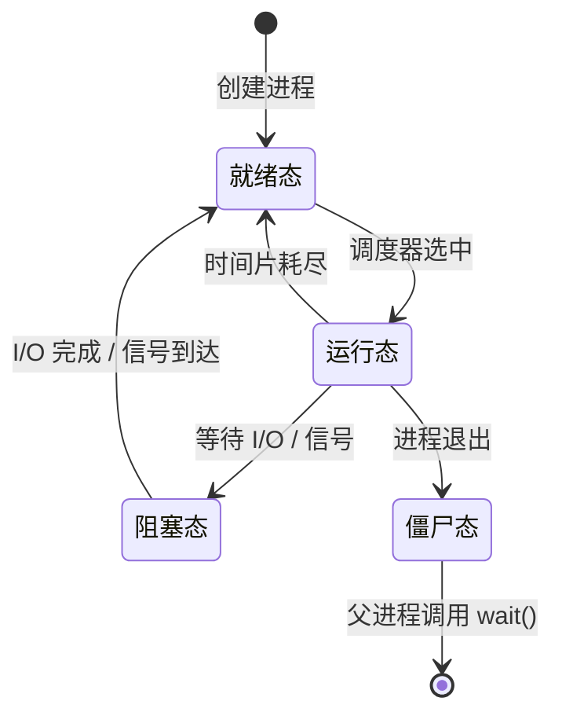

## B — 进程管理

进程是操作系统对一个正在运行的程序的抽象。它是资源分配（内存、文件描述符、CPU 时间）的基本单位。

### 进程的内存布局

每个进程拥有独立的虚拟地址空间。在 Linux 中，典型的内存布局如下（从高地址到低地址）：

```
高地址 ──────────────
 内核空间 (用户进程不可直接访问)
──────────────────
 栈（Stack）
 局部变量、函数调用帧
 ↓ 向下增长
 ... 空白区域 ...
 ↑ 向上增长
 堆（Heap）
 动态分配的内存（malloc/new）
──────────────────
 数据段
 .bss (未初始化的全局变量)
 .data (已初始化的全局变量)
──────────────────
 代码段
 .text (可执行指令)
低地址 ──────────────
```

从 `malloc` 分配的内存在堆段，局部变量在栈段。栈的空间通常是有限制的（Linux 默认 8MB），递归过深或局部变量过大导致栈溢出。

### 进程控制块（PCB）

内核用进程控制块（`task_struct` in Linux）维护每个进程的所有信息：

| 字段 | 内容 |
|------|------|
| pid | 进程 ID |
| state | 运行态 / 就绪态 / 阻塞态 / 僵尸态 |
| mm | 内存描述符（页表、虚拟地址空间） |
| fs | 文件系统信息（当前目录、打开的文件） |
| files | 文件描述符表 |
| thread | CPU 上下文（寄存器快照、栈指针） |
| signal | 信号处理信息 |

### 进程状态转换



僵尸进程：子进程已退出，但父进程尚未调用 `wait()` 读取退出状态，PCB 仍占在内核中。大量僵尸进程浪费 PID 资源。

### 上下文切换（Context Switch）

当 CPU 从一个进程切换到另一个进程时发生上下文切换：

1. 保存当前进程的寄存器值、程序计数器(PC)、栈指针(SP)到 PCB
2. 加载下一个进程的 PCB 中的寄存器值
3. 切换页表（CR3 寄存器在 x86），指向新进程的虚拟地址空间
4. 跳转到新进程的 PC 继续执行

上下文切换是纯开销：CPU 在做管理而非运算。一次上下文切换约 1-10\mu s。频繁切换导致系统响应变慢。

**对容器的意义**：在多线程程序中使用 `std::list` 的 splice 操作可能比 `std::vector` 有优势——splice 只改指针不触发内存分配/拷贝，减少因缺页中断导致的上下文切换。

### fork 与 exec

`fork()` 创建一个与父进程几乎完全相同的子进程（共享代码段，数据段写时复制）。`execve()` 用新程序替换当前进程的地址空间。

```c
pid_t pid = fork();
if (pid == 0) {
 // 子进程
 execl("/bin/ls", "ls", "-l", NULL); // 执行新的程序
} else if (pid > 0) {
 // 父进程
 wait(NULL); // 等待子进程结束
}
```

### 进程间通信（IPC）

见 [[I_进程间通信]]。

### 本章与其他模块的链接

- 函数调用栈的深入实现 → [[../c语言教程/2深化/02_内存模型与布局|内存模型与布局]]
- 栈帧在汇编层的表示 → [[../汇编基础/1基础/02_栈与调用约定|栈与调用约定]]
- 内核中 task_struct 的结构 → [[../内核/系统内核/02_进程与内存管理|进程与内存管理]]
