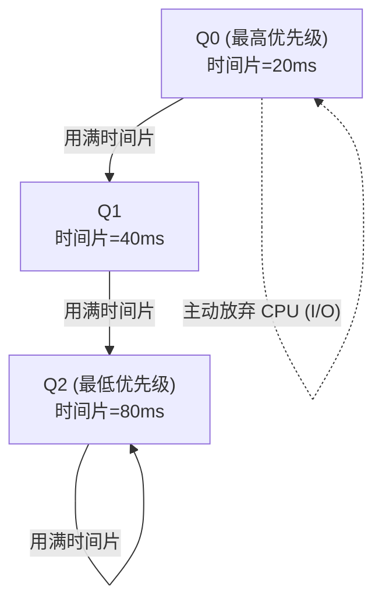

## D — CPU 调度

CPU 调度决定"在多个就绪的进程中，选哪个现在运行"。调度器是操作系统内核中最核心的决策函数之一。

### 调度的时机

下列时刻触发调度决策：

| 时机 | 是否抢占 |
|------|:------:|
| 进程从运行态变为阻塞态（等 I/O） | 非抢占 |
| 进程终止 | 非抢占 |
| 进程从阻塞态变为就绪态（I/O 完成） | 抢占 |
| 时间片中断（timer interrupt） | 抢占 |

非抢占调度：进程主动让出 CPU（调用 `sched_yield` 或阻塞）。抢占调度：内核强制挂起当前进程，把 CPU 分配给别的进程。

### 调度算法

#### FCFS (First-Come, First-Served)

最简单的策略——先来的先运行，一个运行完再下一个。非抢占。

优点：简单公平。缺点：一个长的 CPU 密集型进程堵住后面的所有短进程（护航效应 / Convoy Effect）。

#### SJF (Shortest Job First)

选预计运行时间最短的进程。需要预知进程的运行时间（在批处理系统中可由用户指定）。

理论上平均等待时间最小，但现实操作系统中无法预知进程何时终止，因此只适用于某些预测模型。

#### Round Robin (RR)

每个进程分配一个**时间片**（time quantum，通常 1-100ms），轮流运行。抢占式。

- 时间片太长 → 退化为 FCFS
- 时间片太短 → 过多的上下文切换开销

#### MLFQ (Multi-Level Feedback Queue)

多个优先级队列，每个队列有不同时间片长度。进程根据行为在队列间移动：



规则：
- 高优先级队列中的进程优先运行
- I/O 密集型进程频繁主动让出 CPU → 保持在高优先级
- CPU 密集型进程用满时间片 → 被推入低优先级
- 定期将低优先级进程提升回高优先级（防止饿死）

MLFQ 自动识别进程性质并动态调整，是现代调度器的思想基础。

#### CFS (Completely Fair Scheduler)

Linux 2.6 起使用的默认调度器。核心思想：在理想的多任务系统中，每个进程都应获得完全均等的 CPU 时间。

CFS 用**虚拟运行时间（vruntime）** 追踪每个进程实际获得的 CPU 时间。调度器始终选择 vruntime 最小的进程。

```c
// CFS 的抽象逻辑（非内核源码）
每次调度:
 current = 红黑树中 vruntime 最小的进程
 时间片 = sched_period * (进程权重 / 所有进程总权重)
 运行 current
 current.vruntime += 实际运行时间
 放回红黑树
```

**对数据结构的应用**：CFS 调度器内部用红黑树维护就绪队列。这就是 [[../数据结构/J_树_Tree_BST_AVL|红黑树]] 的一个经典系统级应用——O(log n) 插入、O(1) 查找最小值（最左边的节点）。

### 调度指标

| 指标 | 含义 |
|------|------|
| CPU 利用率 | 非空闲时间的百分比 |
| 吞吐量 | 单位时间内完成的进程数 |
| 周转时间 | 进程从提交到完成的时间 |
| 等待时间 | 进程在就绪队列中等待的时间 |
| 响应时间 | 从提交到首次响应的延时 |

### 本章与其他模块的链接

- CFS 就绪队列使用的红黑树实现 → [[../数据结构/J_树_Tree_BST_AVL|红黑树]]
- 调度与上下文切换 → [[B_进程管理#上下文切换]]
- 时钟中断 → [[A_操作系统概述#中断与异常]]
