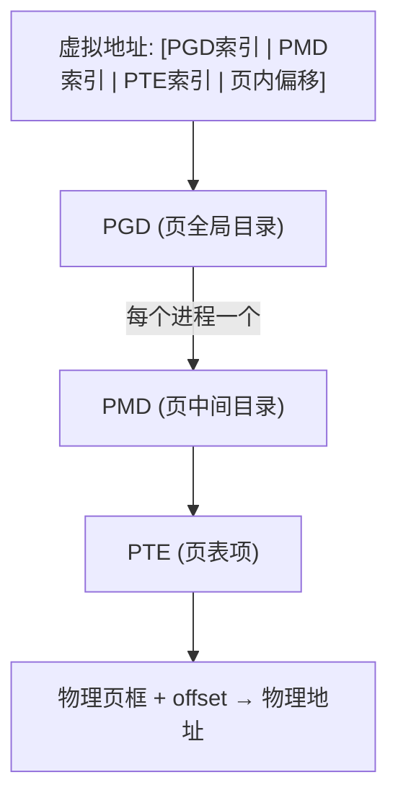
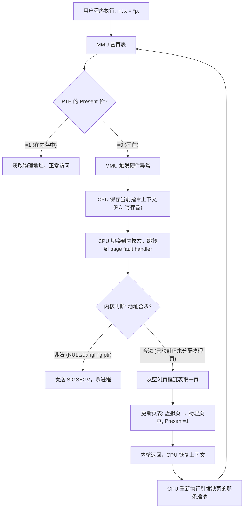

## F — 内存管理

内存管理是操作系统最核心的功能之一。它解决两个问题：给每个进程一个独占全部内存的幻觉（虚拟内存），并在物理内存的实际约束下高效执行（分页 + 置换）。

### 虚拟内存

每个进程拥有独立的虚拟地址空间，大小取决于寻址位数（32 位：4GB，64 位：理论上 2^64 字节，实际上 48 位有效位 = 256TB）。

```
虚拟地址 (进程看到的)          物理地址 (硬件实际的)
   0x7fff1234        页表映射        0xabcd0000
```

虚拟地址到物理地址的转换由 CPU 的 **MMU（Memory Management Unit）** 在每次内存访问时自动完成。映射的基本单元为**页（Page）**，通常 4KB。

### 页表

页表是虚拟页号到物理页框号的映射表。现代系统使用**多级页表**来节省空间（大部分虚拟地址空间未被使用）：



| 级别 | x86_64 名称 | 位数 | 条目数 |
|------|-----------|:---:|:-----:|
| 第 1 级 | PGD (Page Global Directory) | 9 bit | 512 |
| 第 2 级 | PUD (Page Upper Directory) | 9 bit | 512 |
| 第 3 级 | PMD (Page Middle Directory) | 9 bit | 512 |
| 第 4 级 | PTE (Page Table Entry) | 9 bit | 512 |
| 偏移 | offset | 12 bit | 4KB |

页表项（PTE）不仅包含物理页框地址，还包含控制位：

| 位 | 含义 |
|----|------|
| Present (P) | 该页是否在物理内存中（1 在，0 不在则触发缺页中断） |
| Read/Write (R/W) | 可写（1）或只读（0） |
| User/Supervisor (U/S) | 用户态可访问（1）或仅内核可访问（0） |
| Accessed (A) | 页面被访问过（用于页面置换算法） |
| Dirty (D) | 页面被写入过（write-back 时需要写回磁盘） |
| NX | 禁止执行（No-eXecute，防止栈上代码执行攻击） |

### TLB（Translation Lookaside Buffer）

每次内存访问都遍历四级页表需要访问 4 次物理内存，太慢。TLB 是 MMU 内部的一套高速缓存，存储最近使用的虚拟页→物理页映射。

```
访问虚拟地址:
① 查 TLB → 命中: 1 个时钟周期，直接得到物理地址
               ↓
           不命中: 遍历多级页表（几十个周期），结果存入 TLB
```

TLB 的容量有限（通常几十到几百条目），因此连续访问大范围内存时可能 TLB miss，导致额外几十个时钟周期的开销。

**对容器的意义**：遍历一个跨越多个页的 vector（例如 1MB 的数组 = 256 个 4KB 页面），如果 TLB 只能缓存在其中几十条映射，将频繁 TLB miss。使用**大页（Huge Page）**（2MB 或 1GB）可以减少页表层次，降低 TLB 压力。

### 缺页中断（Page Fault）的完整流程

缺页中断不是"OS 分配物理页"这一个动作，而是硬件异常 + 内核处理 + 返回重试的一套完整机制：



- 第 E-F 步是硬件执行的，第 G-L 步是内核软件执行的，第 M 步是 CPU 重新执行
- 一次缺页中断的时间成本约 1-10\mu s，比 cache miss (100ns) 再慢 100 倍

**对容器的影响**：
- `malloc` 分配一大块内存时瞬间返回（只分配虚拟地址空间，页表中记一笔 Present=0）
- 首次遍历写入时，每碰到一个新页就触发一次缺页中断，遍历速度被拖到极慢
- 第二遍遍历时物理页已分配完毕，速度恢复正常
- vector 扩容后首次写入的时间不均匀：扩容越大、新页越多、耗时波动越大

### 页面置换算法

当物理内存已满、需要加载新页时，必须选择一页换出到磁盘（swap）：

| 算法 | 策略 | 特点 |
|------|------|------|
| FIFO | 先进入的页先换出 | 简单，但可能换出频繁使用的页 |
| LRU（Least Recently Used） | 换出最久未使用的页 | 理论上接近最优，但实现开销大 |
| Clock（NRU） | 循环扫描，给第二次机会 | LRU 的近似，在 Linux 中使用 |
| LFU（Least Frequently Used） | 换出访问次数最少的页 | 可能留下"过去热门、现已不用"的页 |

Linux 使用一个更复杂的双层 LRU 列表：活跃列表（Active List）和非活跃列表（Inactive List），结合第二次机会机制。

### 交换（Swapping）


频繁的换入换出就是**颠簸（Thrashing）**——物理内存严重不足，大部分 CPU 时间浪费在页面置换而非实际计算上，系统几乎无法响应。

**对容器的意义**：在大数据量存储场景下，vector 的连续存储比 list 更不容易触发颠簸——连续分配的内存页更集中，被换出时一次 I/O 操作换一整块，list 散列的节点可能分布在完全不同的页面上，换入时需要多次 I/O。

### 本章与其他模块的链接

- 缺页中断如何影响 vector 扩容性能 → [[../数据结构/A_容器_Container|容器 Container#虚拟内存与缺页中断]]
- malloc 如何触发 sbrk/mm_p 向 OS 请求内存 → [[G_内存分配器]]
- 进程内存布局 → [[B_进程管理#进程的内存布局]]
- 用户态 / 内核态的切换 → [[A_操作系统概述#用户态与内核态]]
- 多级页表与 TLB → [[../计算机原理/D_内存层次结构|内存层次结构]]
