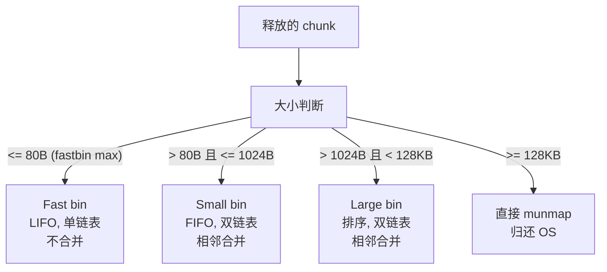

## G — 内存分配器

`malloc` / `free` / `realloc` 出自 C 标准库，但它们并非直接向 OS 请求内存，而是通过一套用户态的分配器管理系统调用产生的堆内存。本节以 Linux glibc 的 **ptmalloc** 为例，讲解分配器的设计原理。

### 两层架构：用户态分配器 vs 系统调用


关键点：
- `malloc` 是**用户态库函数**，运行在 glibc 中，不在内核中
- `sbrk` 和 `mmap` 是**系统调用**，从用户态切换到内核态，由内核分配虚拟地址空间
- `free` 一般**不立即归还**内存给 OS，而是缓存在分配器的 bin 中等待后续复用

### ptmalloc 的 bin 体系



| Bin 类型 | 大小范围 | 数据结构 | 合并 | 归还 OS |
|---------|---------|---------|:---:|:------:|
| Fast bin | <= 80B | 单链表, LIFO | 否 | 否 |
| Small bin | <= 1024B | 双链表, FIFO | 是 | 否 |
| Large bin | <= 128KB | 双链表, 排序 | 是 | 否 |
| mmap'd | >= 128KB (默认) | 直接映射 | N/A | munmap 时归还 |

### sbrk 与 mmap 的差异

| | sbrk | mmap |
|------|------|------|
| 本质 | 移动进程的 program break（堆顶） | 在虚拟地址空间的任意位置映射新区域 |
| 分配粒度 | 连续，只能向上增长 | 任意地址，灵活 |
| 归还 | 不能归还（只能等整个堆收缩） | `munmap` 即可归还 |
| 适用 | 小内存、连续分配 | 大内存、短期使用 |
| mmap 阈值 | 默认 128KB | |

`sbrk` 分配的堆内存形成一个连续的"水龙头"——只能向上扩展，不能释放中间的一段。如果你 `malloc` 两个小块再 `free` 掉第一个，第一个的内存空间被保留在进程的堆中供后续分配，而不是归还给 OS。`mmap` 则完全独立：`munmap` 后物理页直接归还。

### 分配与释放的流程

**`malloc(size)`**：
1. 若 `size >= mmap_threshold(128KB)`，直接 `mmap`
2. 用 size 确定目标 bin
3. 在对应 bin 中查找空闲 chunk：fast bin（精确大小匹配）→ small bin → unsorted bin → large bin
4. 若都找不到，合并相邻空闲块重新放入 unsorted bin 再查
5. 仍找不到，从 top chunk 切割
6. top chunk 不足，调用 `sbrk` 扩展

**`free(ptr)`**：
1. 若 chunk 是 mmap 分配的，直接 `munmap`
2. 根据 chunk 大小决定放入哪个 bin（fast bin 不合并）
3. 检查前后相邻 chunk 是否空闲，若空闲则合并为一个更大的 chunk 放入 unsorted bin

**`realloc(ptr, new_size)`**：
1. 计算原 chunk 的大小
2. 原地可扩展（top chunk 紧邻其后且够用）→ 直接扩展，返回原地址
3. 原地不可扩展 → `malloc(new_size)` → `memcpy` 旧数据 → `free(old_ptr)` → 返回新地址

### 碎片（Fragmentation）的底层成因

`free` 后如果不合并相邻空闲 chunk，一个 100 字节的空洞只能满足 `<=100` 字节的请求。如果空洞散落在堆中各处，堆中总空闲很大但每个空洞都很小，无法满足一个中等的 malloc——这被称为**外部碎片**。

```
堆布局示例（灰色 = 已占用，白色 = 空闲）:
[sbrk 分配的范围]
[████████░░░░████░░████████░░████░░██████░░░░░]
     ↑ 每小块空闲分散在各处 → 总计很大但无法合并
```

- vector 的 realloc 释放旧内存 → 旧内存成为一个内部空间的可合并 chunk（若前后也是空闲）
- list 的每个节点独立 malloc → free 后产生大量小空洞散落在堆各处

### 现代分配器的优化

| 分配器 | 特点 |
|--------|------|
| ptmalloc（glibc） | 通用，多线程用 arena 分区，性能中等 |
| jemalloc（FreeBSD, Rust） | 注重多线程和低碎片，用 size class + thread cache |
| tcmalloc（Google） | 极致多线程性能，中大型分配优于 ptmalloc |
| mimalloc（Microsoft） | 安全 + 高性能，free list sharding |

它们的共同策略：thread-local cache（每个线程有自己的小缓存，避免锁竞争） + size class（按大小分桶，减少外部碎片）。

### 本章与其他模块的链接

- 虚拟内存分配页框的真正时机 → [[F_内存管理#缺页中断]]
- malloc 在数据结构中的实际应用 → [[../数据结构/A_容器_Container|容器 Container#malloc 的实现原理]]
- C 语言中动态内存的陷阱 → [[../c语言教程/2深化/03_动态内存管理|动态内存管理]]
