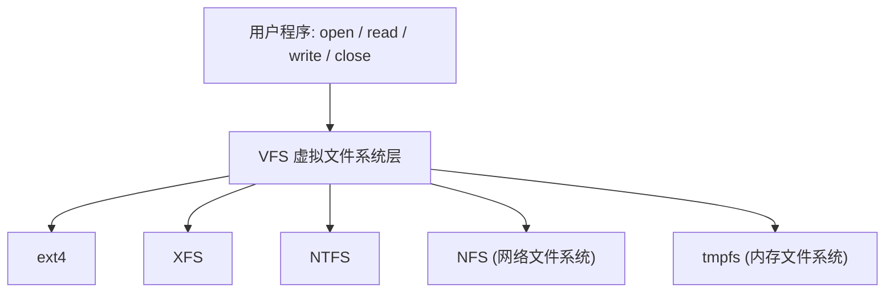
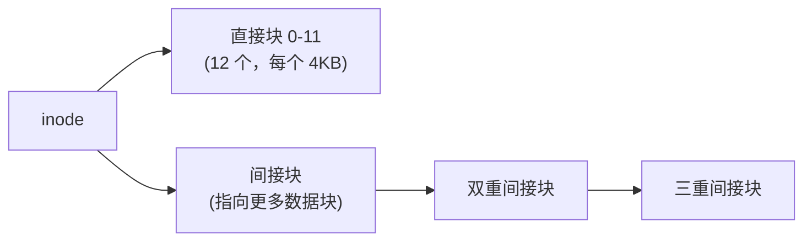
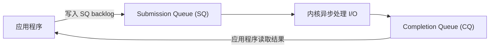

## H — 文件系统

文件系统是操作系统对存储设备上的数据组织和管理方式的抽象。它回答两个核心问题：数据怎么被存放（on-disk layout），以及数据怎么被程序访问（VFS 接口）。

### VFS（Virtual File System）

Linux 通过 VFS 层统一不同文件系统的访问方式。用户程序调用 `open()` / `read()` / `write()` 等系统调用，VFS 将其分派到对应的具体文件系统实现：



### inode

在 Unix/Linux 文件系统中，文件由两部分组成：

| 组成部分 | 存储内容 | 存储位置 |
|---------|---------|---------|
| inode | 元数据（权限、所有者、大小、时间戳、数据块指针） | inode 表（磁盘固定区域） |
| data blocks | 文件的实际数据 | 数据块区域 |



inode 本身不存储文件名——文件名存储在**目录**中，目录本质上是一个将文件名映射到 inode 编号的特殊文件。

### 目录

```c
// 简化表示
struct dirent {
    int    inode_number;   // inode 编号
    char   name[256];      // 文件名
};
```

目录是一个列表，每个条目把一个人类可读的文件名映射到一个数字 inode 编号。

**硬链接 vs 软链接**：
- 硬链接：不同的文件名指向同一个 inode 号（底层是同一个文件，删一个不影响另一个）
- 软链接（符号链接）：一个特殊文件，内容为另一个文件的路径名

### 文件描述符

每个进程维护一个文件描述符表（`files` 字段在 `task_struct` 中）：

```c
int fd = open("/path/to/file", O_RDONLY);
// fd = 3  -- 一个整数索引
// 内核中: task.files.fd[3] → struct file → inode → data blocks
```

`0` = stdin, `1` = stdout, `2` = stderr 是每个进程默认打开的三个文件描述符。

### 缓冲与同步

标准 C 库（`fopen` / `fprintf` / `fwrite`）在用户态维护自己的缓冲区，直到缓冲区满、调用 `fflush`、或程序退出时才执行实际的 `write()` 系统调用。

```c
fprintf(fp, "hello");  // 可能还在 C 库的用户态缓冲区中，未写入磁盘
fflush(fp);            // 强制 flush 到内核的 page cache
fsync(fileno(fp));     // 强制内核将 page cache 写入磁盘
```

三层缓冲：

```
C 库缓冲区 (用户态) → 内核 Page Cache (内核态) → 磁盘 (物理)
     fflush              fsync / fdatasync
```

**崩溃一致性**：如果在内核 page cache 和磁盘之间发生断电，未写入磁盘的数据会丢失。数据库（如 SQLite）在每次事务提交后调用 `fsync` 确保数据写入磁盘。

### 文件系统与 io_uring

传统的 `read()` / `write()` 系统调用在处理高并发 I/O 时上下文切换开销很高。`io_uring`（Linux 5.1+）是两个环形缓冲区（submission queue + completion queue），允许程序批量提交 I/O 请求并批量收集结果，减少了系统调用的次数和上下文切换。



`io_uring` 代表了 Linux 异步 I/O 的未来方向。传统的 `epoll` poll 模型将在开发者转向 `io_uring` 后逐渐被替代。

### 本章与其他模块的链接

- `fsync` 为什么关系数据安全 → [[../c语言教程/2深化/08_标准库深度|C 标准库深度]]
- 从 inode 到文件的底层路径 → [[../内核/系统内核/03_文件系统|内核文件系统]]
