## J -- 输入输出(I/O)管理

I/O 管理是操作系统中最复杂、最"脏"的部分 -- 它要应对千差万别的硬件设备、不可预测的物理时序、以及用户程序对"设备无关"的抽象需求。I/O 子系统在 OS 内核代码中占比最大（Linux 内核中约 60% 的代码与设备和驱动相关），却也是考试和工程中最容易被忽视的模块。

### I/O 硬件概览

#### 设备分类

| 类别 | 数据单元 | 寻址方式 | 典型设备 | 典型吞吐量 |
|------|---------|---------|---------|:---------:|
| 块设备 | 块（512B/4KB） | 随机寻址 | 磁盘、SSD、光盘 | 100MB/s ~ 7GB/s |
| 字符设备 | 字符流 | 顺序访问 | 键盘、鼠标、串口、打印机 | B/s ~ KB/s |
| 网络设备 | 报文 | 无定位 | 网卡 | 100Mbps ~ 400Gbps |

块设备以**固定大小的块**为传输单元，每块有独立地址（如 LBA），可随机访问任意块。字符设备产生／消费**字节流**，无块结构，不可寻址。网络接口介于两者之间 -- 传输报文（packet），但通常单独归类。

#### 设备控制器

设备本身不直接连接到 CPU 总线。每类设备通过**设备控制器**（Device Controller）与系统总线交互：

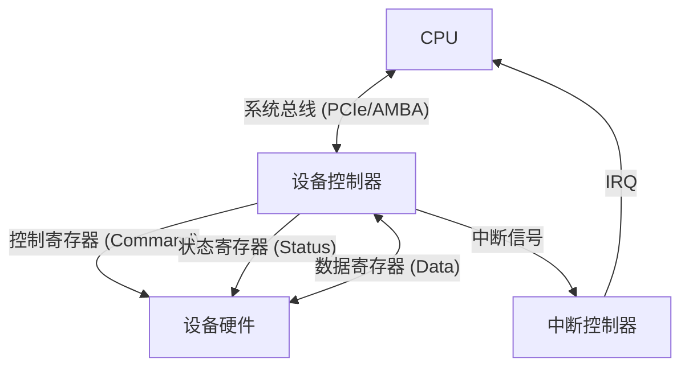

控制器包含三类寄存器：

| 寄存器 | 用途 | 示例 |
|--------|------|------|
| 数据寄存器 | 暂存输入/输出数据 | 磁盘扇区缓冲（512B/4KB） |
| 控制寄存器 | CPU 向设备发送命令 | "READ sector 42" |
| 状态寄存器 | 设备向 CPU 报告状态 | BUSY / READY / ERROR |

**内存映射 I/O vs 端口映射 I/O**：

```
内存映射 I/O (Memory-Mapped I/O):
 控制器寄存器映射到物理地址空间
 CPU 用 mov 指令读写寄存器（如 ARM、RISC-V）
 volatile uint32_t *reg = (uint32_t *)0x40001000;
 *reg = CMD_READ; // 写控制寄存器
 while (*reg & STATUS_BUSY); // 读状态寄存器

端口映射 I/O (Port-Mapped I/O):
 控制器端口有独立地址空间
 CPU 用 in/out 指令访问（如 x86）
 outb(CMD_READ, 0x1F7); // 写控制端口
 while (inb(0x1F7) & STATUS_BUSY); // 读状态端口
```

x86 同时支持两种方式（PCI 设备通常用 MMIO），ARM/RISC-V 仅支持 MMIO。

#### 设备-控制器-CPU 关系

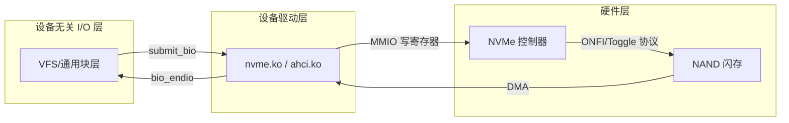

### I/O 控制方式

I/O 控制方式是操作系统的核心内容。CPU 如何与设备交换数据，直接决定了 I/O 吞吐量和 CPU 利用率。

#### 程序控制 I/O（轮询 / Polling）

CPU 反复读状态寄存器，直到设备就绪，然后传输数据。CPU 全程参与，**忙等待**。

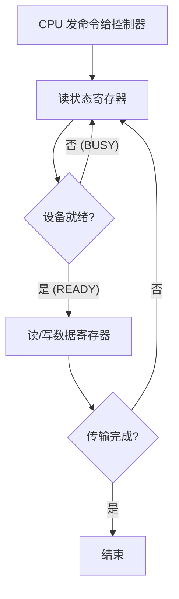

```c
// 轮询方式从磁盘读一个扇区（简化的伪代码）
void read_sector_polling(int lba, char *buf) {
 outb(0x1F6, 0xE0 | ((lba >> 24) & 0x0F)); // 驱动器/磁头
 outb(0x1F2, 1); // 扇区数 = 1
 outb(0x1F3, lba & 0xFF); // LBA 低字节
 outb(0x1F4, (lba >> 8) & 0xFF);
 outb(0x1F5, (lba >> 16) & 0xFF);
 outb(0x1F7, 0x20); // READ 命令

 while ((inb(0x1F7) & 0x08) == 0) // 轮询 BSY 和 DRQ 位
 ; // 忙等待 —— CPU 什么也不做，就在这循环

 for (int i = 0; i < 256; i++) // 一次读 2 字节 × 256 = 512 字节
 ((uint16_t *)buf)[i] = inw(0x1F0);
}
```

**性能分析**：设磁盘读一个扇区需 10ms（寻道 + 旋转延迟 + 传输），CPU 主频 2GHz。10ms = 20,000,000 个时钟周期被浪费在轮询上。如果 CPU 要同时服务多个设备，轮询完全不可行。

轮询的唯二适用场景：
- **极高速设备**：完成时间 < 中断处理开销（如 NVMe 的 Completion Queue Polling）
- **极低延迟系统**：中断延迟不可接受（实时嵌入式、高频交易）

#### 中断驱动 I/O

CPU 发出 I/O 命令后不轮询 -- 切换到其他进程工作。设备完成时通过**中断信号**通知 CPU。

**中断机制流程**：

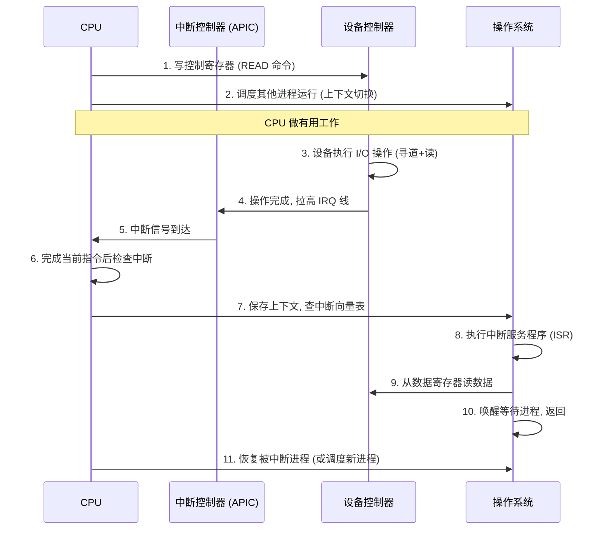

**中断向量表（IVT / IDT）**：

```c
// 简化表示 —— x86 中为 IDT (Interrupt Descriptor Table)
struct idt_entry {
 uint16_t handler_low; // 中断处理函数地址低 16 位
 uint16_t selector; // 代码段选择子
 uint8_t ist; // 中断栈表
 uint8_t flags; // 存在位、DPL、类型
 uint16_t handler_mid; // 地址中 16 位
 uint32_t handler_high; // 地址高 32 位
 uint32_t reserved;
} __attribute__((packed));

// 中断号 → 处理函数映射
// IRQ0 = 定时器, IRQ1 = 键盘, IRQ14 = IDE 主通道
void keyboard_isr() { /* 读键盘扫描码 */ }
void timer_isr() { /* 更新 jiffies, 触发调度 */ }
```

**中断优先级与嵌套**：

| 级别 | 类型 | 可被抢占? | 示例 |
|:----:|------|:--------:|------|
| 最高 | NMI (不可屏蔽中断) | 否 | 硬件故障、看门狗、ECC 错误 |
| 高 | 高优先级设备 | 可被 NMI 抢占 | 网络收包（softirq） |
| 中 | 普通设备 | 可被高优先级抢占 | 磁盘 I/O 完成 |
| 低 | 低优先级 | 可被任何中断抢占 | 键盘、鼠标 |

NMI（Non-Maskable Interrupt）是硬件级的"紧急刹车" -- 内存 ECC 检测到不可纠正的错误、硬件看门狗超时等致命事件触发 NMI，处理器**必须立即响应**，不能延迟。

**上半部与下半部**（Linux 中断处理）：

中断处理程序必须快 -- 处理期间 CPU 屏蔽同级或更低级中断。因此 Linux 将中断处理一分为二：

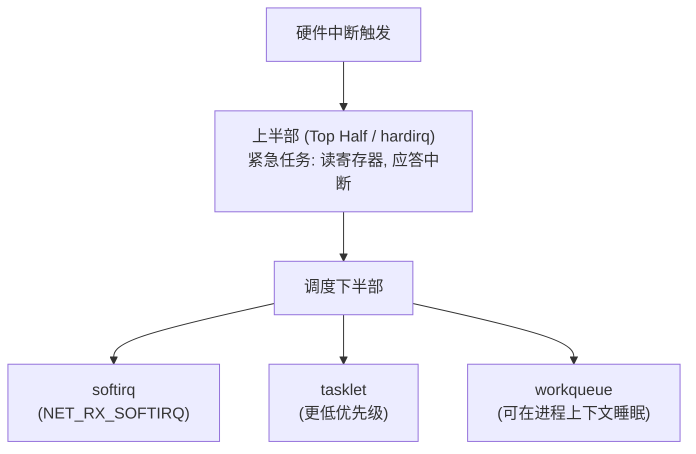

- **上半部**：在中断上下文中运行，不可睡眠，必须极快（微秒级）
- **softirq**：在中断上下文中运行，但允许中断嵌套，用于网络收发包
- **tasklet**：在 softirq 之上构建，同一类型 tasklet 不会在多个 CPU 上并发
- **workqueue**：在**进程上下文**中运行，可以睡眠、持有 mutex、访问文件

#### DMA（直接内存访问）

轮询和中断都需要 CPU 亲自搬数据（从设备数据寄存器 → CPU 寄存器 → 内存）。当传输大量数据（如磁盘的一个 4KB 扇区），CPU 在数据拷贝上浪费大量时间。

DMA 控制器（DMAC）接管数据搬运：

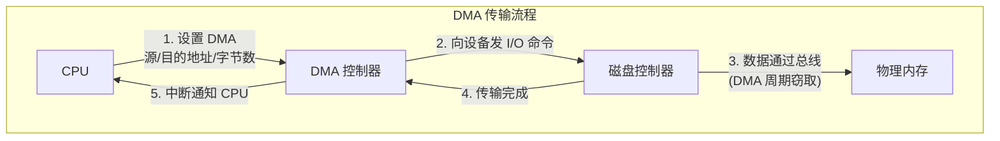

**DMA 传输步骤**：

1. CPU 在内存中分配 DMA 缓冲区，编程 DMAC 寄存器（源地址、目的地址、传输字节数、方向）
2. CPU 向设备控制器发送读写命令，告诉它"数据准备好后通知 DMAC"
3. CPU 返回调度其他进程
4. 设备将数据通过总线直接写入内存（DMAC 控制总线）
5. 传输完成后，DMAC 向 CPU 发送中断，CPU 做后续处理

**周期窃取 vs 块模式**：

| 模式 | 策略 | 特点 |
|------|------|------|
| 周期窃取（Cycle Stealing） | DMA 趁 CPU 不用总线的周期传输一个字节/字 | 对 CPU 影响小，但传输慢 |
| 块模式（Burst Mode） | DMA 连续传输一整块数据，CPU 暂停 | 传输效率高，降低 CPU 性能 |
| 透明模式（Transparent） | 仅在 CPU 不使用总线的周期传输 | 对 CPU 零影响，需要硬件支持 |

**散聚 DMA（Scatter-Gather DMA）**：

物理上连续的大缓冲区在内存碎片化后难以分配。散聚 DMA 允许一个 DMA 传输操作涵盖多个物理上不连续的缓冲区：

```c
// scatter-gather 列表
struct scatterlist {
 unsigned long page_link; // 缓冲区物理页地址
 unsigned int offset; // 页内偏移
 unsigned int length; // 该片段长度
};

// 例如: 一个文件 12KB, 分散在 3 个物理页中
// sg[0]: page A + offset 0 + length 4096
// sg[1]: page B + offset 100 + length 4096
// sg[2]: page C + offset 0 + length 4096
// DMAC 一次性完成三次非连续传输
```

从 [[F_内存管理#虚拟内存|虚拟内存]] 角度看，每个 I/O 操作的目标缓冲区在用户进程的虚拟地址空间中连续，但在物理内存中可能横跨多个物理页框。散聚 DMA 正是为此而设计。

#### 通道 I/O（Channel I/O）

大型机（Mainframe）中的 I/O 通道是一颗**专用的 I/O 协处理器**，能执行自己的通道程序，管理与多个设备的并行传输：

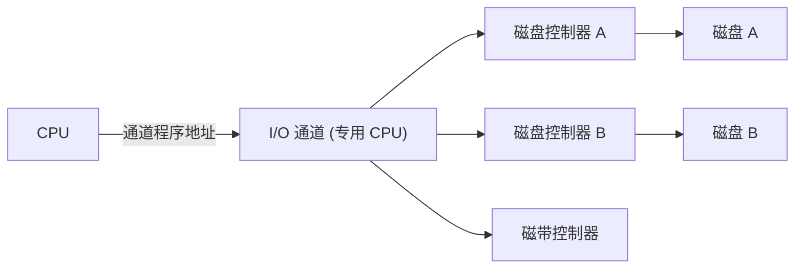

**选择器通道 vs 多路复用通道**：

| 通道类型 | 连接设备数 | 并行度 | 适用设备 |
|---------|:--------:|:-----:|---------|
| 选择器通道 | 多台 | 一次一台（独占） | 高速块设备（磁盘） |
| 字节多路通道 | 多台 | 字节交叉（时分复用） | 低速字符设备 |
| 数组多路通道 | 多台 | 数组交叉（时分复用块传输） | 中速设备集群 |

通道程序由一系列**通道命令字（CCW）**组成：

```c
// CCW 简化表示
struct ccw {
 uint8_t cmd; // 读/写/控制/转移
 uint32_t data_addr; // 内存缓冲区地址
 uint16_t count; // 传输字节数
 uint8_t flags; // 链式命令、跳转、中断标志
};
```

通道 I/O 在 Linux 中没有直接对应（因为 IBM 大型机架构与 x86/ARM 差异巨大），但 Linux 的 `io_uring` 概念上类似 -- 皆是将 I/O 请求批量化、异步化，减少 CPU 干预。详见 [[H_文件系统#文件系统与 io_uring]]。

---

### I/O 软件层次

I/O 软件采用严格的层次化设计，每层向上提供抽象、向下隐藏细节：

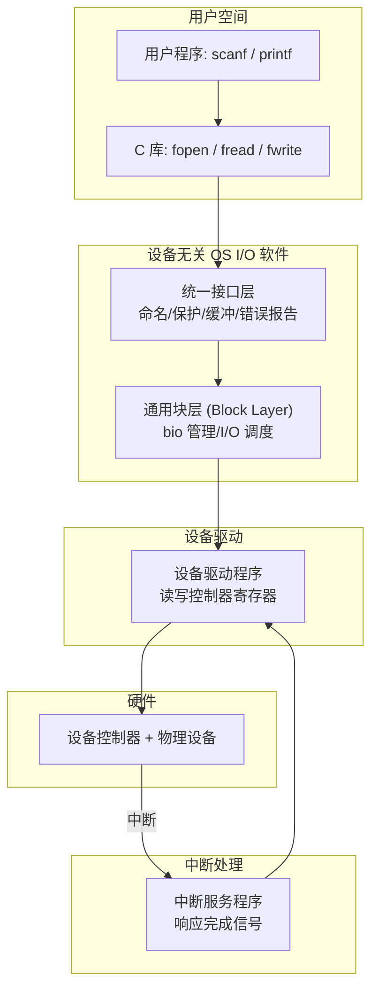

#### 中断处理程序

位于最底层，处理设备完成信号。必须极快、不可阻塞。详见上文 [[#中断驱动 I/O]]。

#### 设备驱动程序

每类设备对应一个驱动，负责与控制器通信。Linux 中有三类标准驱动框架：

| 驱动类型 | 设备种类 | 主设备号 | 典型操作 | 用户接口 |
|---------|---------|:-------:|---------|---------|
| 字符设备驱动 | 串口、键盘、/dev/null | 动态 | open/read/write/ioctl | `/dev/ttyS0` |
| 块设备驱动 | 磁盘、SSD、SD 卡 | 动态 | open/release/ioctl + I/O 调度 | `/dev/sda` |
| 网络设备驱动 | 以太网、Wi-Fi | N/A | 无文件节点，用 socket 接口 | `eth0` |

**字符设备驱动骨架**：

```c
#include <linux/fs.h>
#include <linux/cdev.h>

static int my_open(struct inode *inode, struct file *filp) {
 // 初始化设备特定状态
 return 0;
}

static ssize_t my_read(struct file *filp, char __user *buf,
 size_t count, loff_t *off) {
 // 从设备硬件读取 count 字节到用户 buf
 // 使用 copy_to_user() -- 不可直接用 memcpy
 return bytes_read;
}

static ssize_t my_write(struct file *filp, const char __user *buf,
 size_t count, loff_t *off) {
 // 将用户 buf 中的数据写入设备
 return bytes_written;
}

static long my_ioctl(struct file *filp, unsigned int cmd,
 unsigned long arg) {
 // 设备特异控制: 设置波特率、查询状态等
 switch (cmd) {
 case MY_SET_PARAM: /* ... */ break;
 case MY_GET_STATUS: /* ... */ break;
 }
 return 0;
}

static struct file_operations my_fops = {
 .owner = THIS_MODULE,
 .open = my_open,
 .read = my_read,
 .write = my_write,
 .unlocked_ioctl = my_ioctl,
};
```

#### 设备无关 OS I/O 软件

提供所有驱动共享的通用功能：

| 功能 | 说明 |
|------|------|
| 设备命名与保护 | `/dev/sda` 有 UID/GID 和访问权限 |
| 缓冲 | 统一块缓冲，减少磁盘 I/O 次数 |
| 错误报告 | 读错误 → 重试 N 次 → 返回 -EIO |
| 分配与释放 | 独占设备（如光盘刻录机）的互斥分配 |
| 块大小转换 | 用户写 513 字节 → 对齐到 2 个扇区 |

#### 用户空间 I/O 库

C 标准库（`libc`）在用户态封装系统调用：

```c
// 用户看到的
fprintf(fp, "hello\n"); // buffered I/O

// 实际触发的内核路径
// fprintf → fwrite → (缓冲区满 / fflush) → write(2) 系统调用
// write(2) → VFS → 文件系统 → 通用块层 → I/O 调度 → 驱动 → 磁盘
```

三层缓冲的详细分析见 [[H_文件系统#缓冲与同步]]。

---

### 缓冲（Buffering）

缓冲是缓解速度不匹配的经典技术。生产者（CPU）和消费者（设备）之间插入缓冲区，让双方以各自节律工作。

设 $T$ = 设备处理一块数据的时间，$C$ = CPU 处理一块数据的时间，$M$ = 缓冲区大小（块数）。以下分析各模式的系统处理时间。

#### 单缓冲 vs 双缓冲 vs 循环缓冲

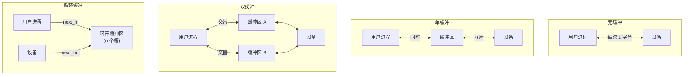

**单缓冲性能分析**：

```
处理一块的总时间 = T + C
系统吞吐量 = 1 / max(T, C)
```

当 $T > C$：设备是瓶颈，CPU 等待设备。当 $C > T$：CPU 是瓶颈，设备等待 CPU。单缓冲下两者串行，无法重叠。

**双缓冲性能分析**：

```
设备在处理第 i 块时，CPU 可同步处理第 i-1 块
处理 n 块的总时间 ≈ max(T, C) × n + min(T, C) (首尾填充)
吞吐量 ≈ 1 / max(T, C)
```

双缓冲实现了**计算与 I/O 的并行**。当 $T \approx C$ 时提升最明显（接近 2×）。

**循环缓冲（Circular Buffer）**：

数据结构和进程间通信中反复出现的主题。一个固定大小的数组，读写指针循环移动。生产者写满不下就阻塞，消费者读完后释放槽位。

```c
#define BUF_SIZE 1024

typedef struct {
 char ring[BUF_SIZE];
 int head; // 生产者写入位置
 int tail; // 消费者读取位置
 int count; // 当前数据量
 sem_t empty; // 空闲槽数信号量 (初值 = BUF_SIZE)
 sem_t full; // 已填充槽数信号量 (初值 = 0)
} circ_buf_t;

void circ_put(circ_buf_t *cb, char c) {
 sem_wait(&cb->empty); // 有空槽?
 cb->ring[cb->head] = c;
 cb->head = (cb->head + 1) % BUF_SIZE;
 sem_post(&cb->full); // 增加一个满槽
}

char circ_get(circ_buf_t *cb) {
 sem_wait(&cb->full); // 有数据?
 char c = cb->ring[cb->tail];
 cb->tail = (cb->tail + 1) % BUF_SIZE;
 sem_post(&cb->empty); // 释放一个空槽
 return c;
}
```

循环缓冲是 [[G_队列_Queue|队列]] 的一种物理实现，也是管道（pipe）和套接字缓冲区（sk_buff）的基础。

#### 缓冲的数学分析

设 $T_{\text{I/O}}$ = 设备完成一次 I/O 的时间，$T_{\text{CPU}}$ = CPU 处理一块数据的时间：

| 缓冲模式 | 总处理时间 (n 块) | 最大并发度 | 适用场景 |
|---------|:----------------:|:--------:|---------|
| 无缓冲 | $n \cdot (T_{\text{I/O}} + T_{\text{CPU}})$ | 0 | 无 |
| 单缓冲 | $n \cdot \max(T_{\text{I/O}}, T_{\text{CPU}})$ | 0 | $T_{\text{I/O}} \ll T_{\text{CPU}}$ 或反向 |
| 双缓冲 | $\approx n \cdot \max(T_{\text{I/O}}, T_{\text{CPU}})$ | 1 | $T_{\text{I/O}} \approx T_{\text{CPU}}$ |
| 循环缓冲 | $\approx n \cdot \max(T_{\text{I/O}}, T_{\text{CPU}})$ | min(k, n) | 生产-消费速率波动 |

当缓冲区足够大、$T_{\text{I/O}} \approx T_{\text{CPU}}$ 时，双缓冲与循环缓冲性能趋同。循环缓冲的优势在于容忍瞬时速率波动 -- 生产者短时间内可走得比消费者快。

---

### SPOOLing（假脱机系统）

SPOOLing = **S**imultaneous **P**eripheral **O**perations **O**n-**L**ine。本质上是用**磁盘空间换设备独占** -- 将低速独占设备（如打印机）虚拟化为多个"虚拟设备"，每个进程感觉自己独占一台打印机。

#### SPOOLing 系统架构

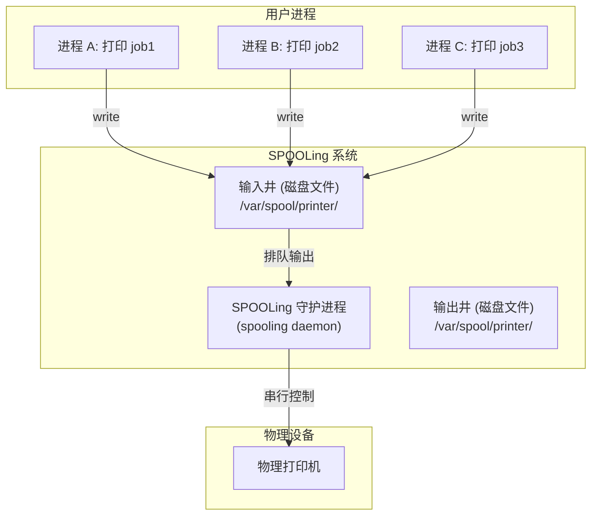

**输入井**：进程将打印数据写入磁盘文件（快），不必等待打印机（慢）。

**输出井**：SPOOLing 守护进程从井中依次读出打印任务，串行发生物理打印机。

**井管理**：每个打印任务是一个井文件，外加一个队列（优先队列或 FIFO 队列）维护执行顺序。

#### 打印机 SPOOLing 实例

```bash
# 用户视角：lp 命令瞬间返回
lp -d office_printer report.pdf

# 实际发生：
# 1. lp 将 report.pdf 拷贝到 /var/spool/cups/
# 2. CUPS 守护进程将 job 插入打印队列
# 3. 守护进程按顺序将 job 发给打印机
# 4. 打印机完成 → 删除临时文件

# 查看打印队列
lpq # 列出等待中的打印任务
lprm 5 # 取消编号为 5 的任务
```

SPOOLing 不仅用于打印。Linux 的邮件系统（MTA 如 Postfix）、`at`/`batch` 批处理调度都是 SPOOLing 思想的变体。进程将任务"假脱机"到磁盘队列，后台守护进程逐一处理。

#### SPOOLing 与虚拟设备

SPOOLing 的核心效果是**将独占设备改造为共享虚拟设备**：

| 特征 | 直接使用物理设备 | 通过 SPOOLing |
|------|:-------------:|:-----------:|
| 并发访问 | 只能互斥，阻塞等待 | 每个进程有自己的井空间 |
| 进程等待时间 | 等于打印时间 | 等于磁盘写入时间（极短） |
| 死锁风险 | 高（进程持有设备等待另一个设备） | 低（进程只持有磁盘文件） |
| 实现复杂度 | 低 | 高（需要守护进程 + 磁盘队列管理） |

---

### 设备分配

#### 设备独立性

**设备独立性**（Device Independence）：程序用逻辑设备名（如 `/dev/printer`）而非物理设备名（如 `/dev/lp0`）访问设备。OS 在运行时将逻辑设备映射到物理设备。

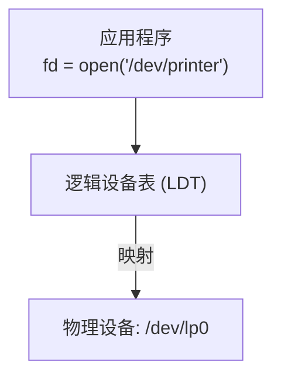

逻辑设备表（LDT）每个条目：

| 字段 | 含义 |
|------|------|
| 逻辑设备名 | 应用程序看到的名称（如 `lp`） |
| 物理设备名 | 实际硬件（如 `lp0`） |
| 驱动程序入口 | 对应驱动的函数表指针 |

设备独立性的好处：
- 物理设备更换时只需改 LDT 中的一条映射，程序无需重新编译
- 可实现多路复用：一个物理设备对应多个逻辑设备
- 可实现负载均衡：一个逻辑设备指向"最空闲的物理设备"

#### 设备分配数据结构

设备分配需要四张核心表：

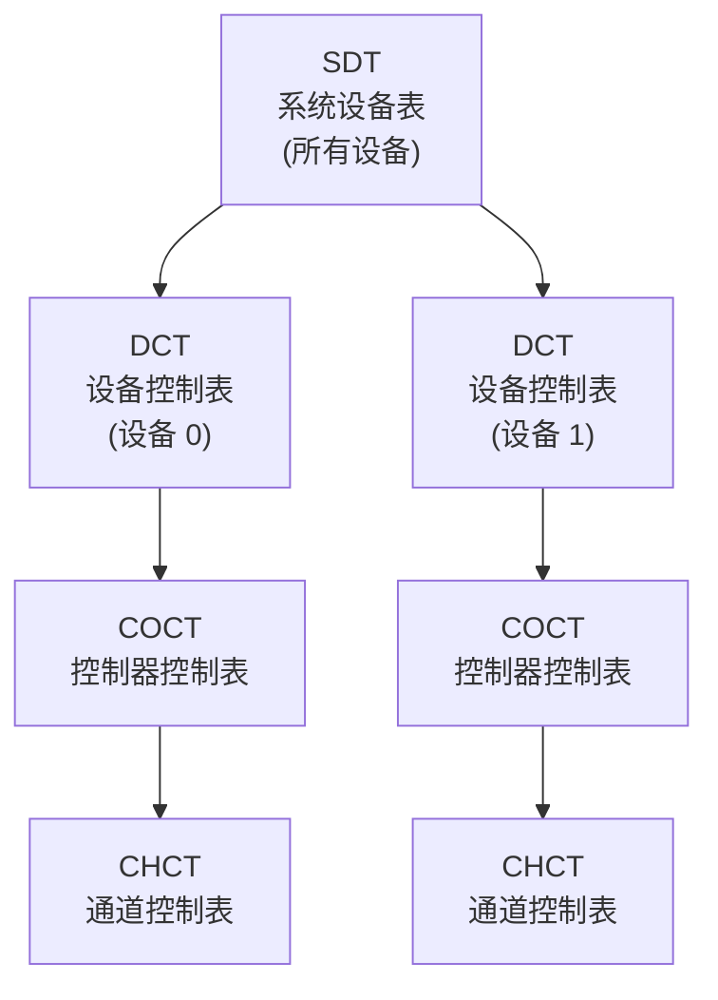

| 表 | 全称 | 记录内容 |
|----|------|---------|
| SDT | System Device Table | 系统中所有设备的入口指针 |
| DCT | Device Control Table | 设备类型/标识符/状态/等待队列/指向 COCT 的指针 |
| COCT | Controller Control Table | 控制器标识符/状态/等待队列/指向 CHCT 的指针 |
| CHCT | Channel Control Table | 通道标识符/状态/等待队列 |

```c
// DCT 简化定义
struct dct {
 int device_id; // 设备标识符
 int device_type; // 块 / 字符
 int status; // 空闲 / 已分配 / 故障
 int pid; // 当前占用进程 PID
 struct list_head waitq; // 等待本设备的进程队列
 struct coct *controller; // 指向对应控制器
};
```

#### 分配策略

**静态分配**：进程启动时一次性分配所有需要的设备，运行结束后释放。

| 优点 | 缺点 |
|------|------|
| 无死锁（破坏"占有且等待"条件） | 设备利用率极低 |
| 实现简单 | 进程可能迟迟不能启动 |

**动态分配**：运行时按需申请、用完即释放。

| 优点 | 缺点 |
|------|------|
| 设备利用率高 | 可能死锁 |
| 进程可提前开始执行 | 需死锁避免/检测机制 |

**死锁与设备分配**：进程 A 持有打印机等待磁带机，进程 B 持有磁带机等待打印机 → 死锁。详见 [[E_同步与死锁#死锁（Deadlock）]] 中的资源分配图分析。

#### 虚拟设备与独占设备

| 类型 | 可共享? | 分配方式 | 示例 |
|------|:------:|---------|------|
| 独占设备 | 否 | 必须互斥分配，用前申请、用后释放 | 打印机、刻录机 |
| 共享设备 | 是 | 可并行访问（I/O 调度保证顺序） | 磁盘、SSD |
| 虚拟设备 | SPOOLing 下虚拟共享 | 无需显式分配 | 通过 SPOOLing 访问的打印机 |

---

### 磁盘管理

磁盘是块设备的原型，也是操作系统存储栈的最终物理层。理解磁盘调度对于 `[[H_文件系统|文件系统]]` 和数据库的性能至关重要。

#### 磁盘物理结构

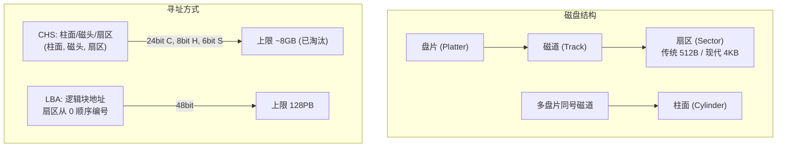

CHS（Cylinder-Head-Sector）是传统寻址方式，但因位宽限制早已被 LBA（Logical Block Addressing）取代。现代磁盘控制器内部将 LBA 映射到物理扇区（可能重映射坏块）。

#### 磁盘访问时间

$$T_{\text{access}} = T_{\text{seek}} + T_{\text{rotation}} + T_{\text{transfer}}$$

| 分量 | 含义 | 典型值（7200 RPM HDD） | 决定因素 |
|------|------|:--------:|---------|
| $T_{\text{seek}}$ | 磁头从当前柱面移动到目标柱面 | 1-15ms | 磁头臂机械运动（最大头） |
| $T_{\text{rotation}}$ | 扇区旋转到磁头下方 | 0-8.3ms（半圈） | 主轴转速 RPM |
| $T_{\text{transfer}}$ | 实际数据传输时间 | ~0.01ms/4KB | 盘面密度和转速 |

$$T_{\text{rotation\_avg}} = \frac{1}{\text{RPM} / 60} \times \frac{1}{2} = \frac{30}{\text{RPM}} \text{秒}$$

- 5400 RPM 盘：平均旋转延迟 5.6ms
- 7200 RPM 盘：平均旋转延迟 4.2ms
- 15000 RPM 盘：平均旋转延迟 2.0ms

寻道时间占总延迟的 60-80%。**磁盘调度算法的目标就是最小化寻道时间**。

SSD 没有机械部件，因此无寻道和旋转延迟，随机访问 ~0.1ms。但 SSD 有截然不同的问题：写放大、磨损均衡、垃圾回收（GC）阻塞。

#### 磁盘调度算法

以下示例均使用**工作队列：55, 58, 39, 18, 90, 160, 150, 38, 184**，假设磁头初始位置为 **100** 号磁道，并向大号方向移动（对 SCAN/LOOK）。

##### FCFS（先来先服务）

按请求到达顺序服务。最公平，但磁头移动可能极大。

```
请求队列: 55, 58, 39, 18, 90, 160, 150, 38, 184
磁头轨迹: 100→55→58→39→18→90→160→150→38→184
移动距离: |100-55|+|55-58|+|58-39|+|39-18|+|18-90|+|90-160|+|160-150|+|150-38|+|38-184|
 = 45 + 3 + 19 + 21 + 72 + 70 + 10 + 112 + 146 = 498 道
```

##### SSTF（最短寻道时间优先）

每次选离当前磁头最近的请求。贪心策略。

```
初始位置 100
100→90 (10) →58 (32) →55 (3) →39 (16) →38 (1) →18 (20) →150 (132) →160 (10) →184 (24)
总移动 = 10+32+3+16+1+20+132+10+24 = 248 道
```

SSTF 存在**饥饿**风险：如果不断有新请求出现在磁头附近，远离磁头的请求可能永远得不到服务。

##### SCAN 算法（电梯算法）

磁头从一端扫到另一端，沿途服务所有请求，到终点后折返。

```
初始: 100, 向大号方向移动
100→150 (50) →160 (10) →184 (24) [到达远端] → 折返
→90 (94) →58 (32) →55 (3) →39 (16) →38 (1) →18 (20)
总移动 = 50+10+24+94+32+3+16+1+20 = 250 道
```

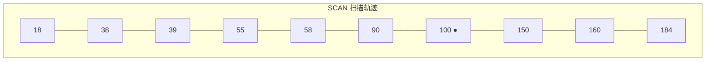

SCAN 的弱点：磁头刚过 90 道，请求 38 到达，38 必须等到磁头扫到远端再折返，等待时间长。

##### C-SCAN 算法（循环扫描）

磁头只在一个方向服务请求，到达远端后**快速重置**到起点（不服务途中请求）：

```
初始: 100, 向大号移动
100→150→160→184 [到达远端] → 快速返回 0 → 18→38→39→55→58→90
总移动 = (184-100) + (184-0) + (90-0) = 84+184+90 = 358 道
```

C-SCAN 保证更均匀的等待时间 -- 所有请求在磁头扫过时被均匀服务，不存在"扫描方向末端请求被立即服务但反向末端永远落后"的问题。

##### LOOK 算法

SCAN 的优化 -- 磁头不扫到绝对边缘，扫到**最远请求**就折返，减少空行程：

```
初始: 100, 向大号移动 (最远请求: 184)
100→150→160→184 [折返] → 90→58→55→39→38→18
总移动 = (184-100) + (184-18) = 84+166 = 250 道
```

##### C-LOOK 算法

C-SCAN + LOOK 的优化：单向服务，到最远请求后直接跳到最近请求（而不是回 0）：

```
初始: 100, 向大号移动
100→150→160→184 [跳到 18] → 18→38→39→55→58→90
总移动 = (184-100) + (184-18) + (90-18) = 84+166+72 = 322 道
```

#### 六种算法对比

| 算法 | 平均寻道 | 公平性 | 饥饿风险 | 适用场景 |
|------|:------:|:-----:|:-------:|---------|
| FCFS | 最差 | 最优 | 无 | 负载极低 |
| SSTF | 好 | 差 | **高** | 吞吐优先，可接受饥饿 |
| SCAN | 中 | 中 | 低 | 通用、负载均衡 |
| C-SCAN | 中 | 好 | 低 | 要求响应时间均匀 |
| LOOK | 好 | 中 | 低 | 通用（实际使用） |
| C-LOOK | 好 | 好 | 极低 | 数据库、高并发文件服务器 |

Linux 默认 I/O 调度器（内核 5.0+ 使用 `mq-deadline`）将读请求和写请求分开调度（读优先），并按 LBA 排序实现类似 C-LOOK 的行为。

#### 磁盘格式化和坏块管理

**低级格式化**（Low-Level Formatting）：工厂将磁盘划分为磁道和扇区，每个扇区写入头部（间隙、同步标记、地址标记）、数据区（512/4096 字节）和尾部（ECC 纠错码）。

```
+------+-------+------+----------+------+
| Gap | Sync | Addr | Data | ECC |
+------+-------+------+----------+------+
 16B 1B 6B 512B/4KB 8-16B
```

**分区**（Partitioning）：将磁盘划分成分区，每个分区可作为独立的文件系统。MBR 分区表在扇区 0 存储分区信息，GPT 在扇区 1-N 存储更现代的方案。

**坏块处理**：

| 方式 | 实现层 | 方法 |
|------|-------|------|
| 硬件坏块重映射 | 磁盘控制器 | 固件自动将坏扇区重映射到备用扇区（P-list / G-list） |
| 软件坏块管理 | 文件系统 | ext4 `badblocks` + `fsck` 标记坏 inode，避免分配 |

磁盘出厂时就可能有厂商检测到的缺陷（P-list），运行时新产生的缺陷加入增长列表（G-list）。控制器对 OS 透明处理 -- OS 看到的 LBA 总是指向好扇区或已重映射的备用扇区。但当 G-list 耗尽时，坏块将穿透到文件系统层。

---

### 对容器的意义

I/O 管理对数据结构、数据库和容器的直接影响：

#### 磁盘调度 → 数据库性能

数据库的 B 树索引散布在多个 LBA 区间。如果 I/O 调度器用 FCFS 策略，不同 B 树页的 `pread` 系统调用按线程到达顺序被服务 -- 磁头随机跳跃，平均寻道 ~10ms（相当于约 100 IOPS 的上限）。

当 I/O 调度器采用 C-LOOK 时，同一时间段内的读请求按 LBA 排序批量发出 -- 磁头做单向平稳扫描而不是随机跳动。同一个磁盘可以输出 150-200 IOPS，接近硬件上限。这也是 MySQL InnoDB 的 `innodb_flush_method=O_DIRECT` 配合 `mq-deadline` 调度器的经典组合 -- 读请求和写请求被均匀排入 deadline 队列，互不饥饿。

`[[../数据结构/M_B树_BTree|B 树]]` 和 `[[../数据结构/N_哈希表_HashTable|哈希表]]` 的磁盘表现形式与 I/O 调度器直接相关。B 树的节点大小通常为一个或数个扇区（例如 InnoDB 的 16KB 页 = 4 个 4KB 扇区），分配到相邻 LBA 的叶子节点每次磁头扫过时可被连续读出。

#### 缓冲 → 日志与 LSM 树

双缓冲和循环缓冲在写入密集型场景中对数据结构选择有决定性影响。LSM 树（Log-Structured Merge Tree）使用一个内存中的 MemTable（本质上是循环缓冲区）批量收集写入，当 MemTable 满后一次性刷入 Sorted String Table（SSTable）磁盘文件。这种策略将随机写入转换为顺序写入，每次旋转周期可以写数百 KB 而非追一次随机写。

`[[../数据结构/P_跳表_SkipList|跳表]]` 和 `[[../数据结构/K_红黑树_RedBlackTree|红黑树]]` 在内存中维护 MemTable 的常见选择。跳表在此期间因 concurrency 友好性胜出 -- 其分层结构允许无锁读取。

#### 容器 I/O 模式

- **顺序 I/O**（`std::vector` 的连续存储）：一次寻道 + 一次旋转延迟 + 连续传输 N 个扇区。磁盘对顺序访问友好（100+ MB/s），SSD 对顺序访问更友好（数 GB/s）。

- **随机 I/O**（`std::list` / `std::unordered_map` 的散列存储）：N 次寻道 + N 次旋转延迟。磁盘随机访问约 ~1MB/s（差距 100x），SSD 随机访问约 ~500MB/s（仍低于顺序但差距缩小）。

- **大页（Huge Page）+ DMA**：从虚拟化角度看，每个 2MB 大页跨越 512 个 4KB 物理页框。如果设备 DMA 缓冲区用 2MB 大页分配，散聚列表从 512 个条目降至 1 个条目，DMA 引擎开销降低 512 倍。对于容器运行时（如 containerd 的镜像拉取），大页 DMA 减少 CPU 停滞。

#### 容器与 I/O 调度器的耦合

容器共享内核的 I/O 栈 -- 宿主机 I/O 调度器的选择影响所有容器。如果 `mq-deadline` 的 `writes_starved=2`（2 次读优先后强制处理一次写），一个容器的密集型写入可能阻塞另一个容器的读取。方案：
- 用 cgroup v2 的 `io.max` 限制每个容器的 IOPS/BW 上限
- 用 `io.latency` 设定 I/O 延迟目标，调度器动态调整
- 容器使用 `O_DIRECT` 绕过 page cache，避免缓存竞争

---

### Red Team / 工程视角

#### DMA 攻击

DMA 控制器拥有直接访问物理内存的能力，完全绕过 CPU 和 MMU。通过 FireWire/Thunderbolt 或 PCIe 热插拔接口接入恶意设备，攻击者可以：

- 读任意物理地址：搜索内存中的加密密钥、密码（绕过所有 OS 访问控制）
- 写任意物理地址：修改内核代码、注入 rootkit
- 禁用 SMEP/SMAP 位：将用户态代码映射为内核可执行

防御：IOMMU（VT-d / AMD-Vi）将设备 DMA 请求也纳入地址翻译 -- DMA 看到的也是虚拟地址而非物理地址。启用 IOMMU 后，设备只能访问显式分配给它的 I/O 页表中的映射区域。

```bash
# 检查 IOMMU 是否启用
dmesg | grep -i iommu
cat /proc/cmdline | grep iommu
# 应包含: intel_iommu=on 或 amd_iommu=on
```

#### 磁盘取证与时间侧信道

`fsync` / `fdatasync` 的时间被用作侧信道：攻击者可以在同一物理磁盘的不同分区测量写入延迟，推断另一分区的 I/O 活动。C-LOOK 调度器的磁头轨迹在时间上具有特征模式 -- 对特定 LBA 范围的请求如果在磁头"即将到达"的时刻发出，响应延迟最小（~旋转延迟）；如果在磁头"刚经过"的时刻发出，延迟最大（~全行程扫描 + 旋转延迟）。

这种分析可以推断：
- 另一分区的磁盘调度队列长度
- 文件系统元数据（superblock, journal）的布局位置
- 特定数据库操作模式（批量顺序写入 vs 随机散列读取）

防御：在共享磁盘环境中为不同租户启用基于 cgroup 的 I/O 隔离，或为敏感工作负载提供独占物理磁盘。

#### 虚拟化中的 I/O 性能

I/O 是虚拟化中最大的性能瓶颈。三种方案对比：

| 方案 | 实现 | CPU 开销 | I/O 吞吐 | 说明 |
|------|------|:------:|:------:|------|
| 全模拟（QEMU） | 捕获 MMIO 指令，软件模拟设备 | 极高 | 极低 | 无修改的旧 OS 支持 |
| 半虚拟化（virtio） | 前端驱动 in guest + 后端 in host，共享 virtqueue | 中 | 高 | 需要 guest 安装驱动 |
| 设备直通（VFIO / SR-IOV） | 硬件直接分配给 VM，无软件中转 | 极低 | 接近原生 | 需要 IOMMU + 硬件支持 |


virtio 是 Linux 中虚拟机 I/O 的事实标准。前端和后端通过 `virtqueue`（本质上是共享内存中的环形缓冲区）通信，避免了全模拟的每次 I/O 多次 VM Exit 开销。`virtio-blk` 是块设备版本，`virtio-scsi` 是 SCSI 子系统版本（支持更多企业特性如 UNMAP）。

#### io_uring 与容器 I/O 隔离

传统 `read`/`write` 系统调用在容器场景下有两点问题：
1. 每次 I/O 触发进程上下文切换，并发请求数 × 上下文切换开销
2. cgroup 的 I/O 控制只能按进程（不能按 IO 请求本身）生效

`io_uring` 的 SQ/CQ 环形缓冲区允许一个进程批量提交和收集 I/O 请求。在容器场景下，这使得 cgroup 的 I/O 控制器能对整个批量操作统一限流，而不是对单个 `read()` 逐个统计。

---

### 本章与其他模块的链接

- 中断 → 上下文切换 → [[B_进程管理#上下文切换（Context Switch）]]
- 循环缓冲区 → 管道实现 → [[I_进程间通信]]
- 磁盘调度 → 文件系统布局 → [[H_文件系统]]
- 缓冲 → C 标准库 vs 内核 → [[H_文件系统#缓冲与同步]]
- 死锁与设备分配 → [[E_同步与死锁#死锁（Deadlock）]]
- 虚拟内存 → DMA 散聚 → [[F_内存管理#页表]]
- B 树的磁盘存储布局 → [[../数据结构/M_B树_BTree|B 树]]
- 队列与环形缓冲在磁盘调度中的应用 → [[../数据结构/G_队列_Queue|队列 Queue]]
- 设备驱动的并发问题 → [[../数据结构/J_树_Tree_BST_AVL|并发数据结构]]
- IOMMU / DMA 安全 → [[../计算机原理/D_内存层次结构|内存层次结构]]
- 磁盘物理结构与 CHS/LBA → [[../计算机原理/E_存储技术|存储技术]]
