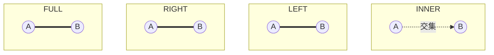

# MySQL 03 - 查询进阶

上一章学会了单表 CRUD，本章解决"数据怎么查得漂亮"的问题：SELECT 的完整执行顺序、聚合与分组、四种 JOIN、子查询、UNION、内置函数与窗口函数。全部示例基于 `students`（学生）与 `classes`（班级）两张表。

---

## 一、SELECT 完整执行顺序

一条 SELECT 语句写出来是这个顺序：

```sql
SELECT DISTINCT 列          -- 5
FROM 表1 JOIN 表2 ON ...    -- 1
WHERE 行过滤                -- 2
GROUP BY 分组列             -- 3
HAVING 组过滤               -- 4
ORDER BY 排序列              -- 6
LIMIT n OFFSET m;           -- 7
```

**实际执行顺序**为：


理解顺序能解释很多怪现象：

- WHERE 里不能用 SELECT 的别名（SELECT 还没执行）
- ORDER BY 里可以用别名（它排在 SELECT 之后）
- WHERE 不能用聚合函数，HAVING 可以（聚合发生在 GROUP BY 阶段）

---

## 二、聚合函数

| 函数 | 作用 | 注意 |
|------|------|------|
| `COUNT(*)` | 统计行数 | 含 NULL 行 |
| `COUNT(col)` | 统计该列非 NULL 行数 | 忽略 NULL |
| `SUM(col)` | 求和 | 忽略 NULL |
| `AVG(col)` | 平均值 | 忽略 NULL，分母是非空行数 |
| `MAX(col)` / `MIN(col)` | 最大/最小值 | 也可用于日期和字符串 |

```sql
SELECT COUNT(*)        AS 总人数,
       AVG(score)      AS 平均分,
       MAX(score)      AS 最高分,
       MIN(score)      AS 最低分
FROM students;
```

---

## 三、GROUP BY 与 HAVING

```sql
-- 每个班的人数、平均分、最高分
SELECT class_id,
       COUNT(*)   AS cnt,
       AVG(score) AS avg_score
FROM students
GROUP BY class_id;

-- HAVING 过滤分组结果：只看平均分大于 80 的班
SELECT class_id, AVG(score) AS avg_score
FROM students
WHERE score IS NOT NULL          -- 先用 WHERE 剔除无效行
GROUP BY class_id
HAVING avg_score > 80            -- 聚合后的条件交给 HAVING
ORDER BY avg_score DESC;
```

记忆口诀：**WHERE 过滤行（分组前），HAVING 过滤组（分组后）**。

---

## 四、JOIN 四种连接

### 4.1 图示



- **INNER JOIN**：两表都匹配的行（中间交集）
- **LEFT JOIN**：左表全部 + 右表匹配不上的填 NULL
- **RIGHT JOIN**：右表全部 + 左表匹配不上的填 NULL
- **FULL OUTER JOIN**：MySQL 不支持，用 LEFT JOIN UNION RIGHT JOIN 模拟

### 4.2 SQL 示例

```sql
-- 内连接：只返回有班级的学生
SELECT s.name, c.name AS class_name
FROM students s
INNER JOIN classes c ON s.class_id = c.id;

-- 左连接：所有学生都保留，没分班的 class_name 为 NULL
SELECT s.name, c.name AS class_name
FROM students s
LEFT JOIN classes c ON s.class_id = c.id;

-- 右连接：所有班级都保留，没有学生的班级学生列为 NULL
SELECT s.name, c.name AS class_name
FROM students s
RIGHT JOIN classes c ON s.class_id = c.id;

-- 全外连接模拟：MySQL 用 UNION 合并左右连接
SELECT s.name, c.name AS class_name
FROM students s LEFT JOIN classes c ON s.class_id = c.id
UNION
SELECT s.name, c.name AS class_name
FROM students s RIGHT JOIN classes c ON s.class_id = c.id;
```

### 4.3 经典应用：左连接找"没有匹配"的行

```sql
-- 找出没有任何学生的班级
SELECT c.*
FROM classes c
LEFT JOIN students s ON s.class_id = c.id
WHERE s.id IS NULL;
```

### 4.4 自连接

同一张表和自己连接，用于层级关系（员工-上级、分类-父类）：

```sql
CREATE TABLE employees (
    id      INT PRIMARY KEY,
    name    VARCHAR(50),
    manager_id INT   -- 指向本表的 id
);

INSERT INTO employees VALUES
    (1, 'CEO', NULL),
    (2, '张总监', 1),
    (3, '李经理', 2),
    (4, '王工', 3);

-- 查每个员工及其上级的名字
SELECT e.name AS 员工, m.name AS 上级
FROM employees e
LEFT JOIN employees m ON e.manager_id = m.id;
```

---

## 五、子查询

### 5.1 WHERE 子查询

```sql
-- 单值子查询：查高于平均分的同学
SELECT name, score FROM students
WHERE score > (SELECT AVG(score) FROM students);

-- 多值子查询：IN 搭配
SELECT name FROM students
WHERE class_id IN (SELECT id FROM classes WHERE name LIKE '%一班%');
```

### 5.2 FROM 子查询（派生表）

把子查询结果当临时表再查：

```sql
-- 每个班的平均分，再从中找平均分最高的班
SELECT MAX(avg_score)
FROM (
    SELECT class_id, AVG(score) AS avg_score
    FROM students
    GROUP BY class_id
) AS t;    -- 派生表必须起别名
```

### 5.3 EXISTS 相关子查询

外层每行都执行一次内层判断，找到即返回真，常用于存在性检查且效率高：

```sql
-- 有学生的班级
SELECT c.name FROM classes c
WHERE EXISTS (
    SELECT 1 FROM students s WHERE s.class_id = c.id
);

-- 反向：没有学生的班级（NOT EXISTS）
SELECT c.name FROM classes c
WHERE NOT EXISTS (
    SELECT 1 FROM students s WHERE s.class_id = c.id
);
```

---

## 六、UNION 与 UNION ALL

```sql
SELECT name FROM students_2025
UNION
SELECT name FROM students_2026;      -- 合并并去重（隐式排序，慢）

SELECT name FROM students_2025
UNION ALL
SELECT name FROM students_2026;      -- 简单拼接不去重（快）
```

| 对比项 | UNION | UNION ALL |
|--------|-------|-----------|
| 去重 | 是 | 否 |
| 性能 | 较慢（需去重排序） | 快 |
| 使用建议 | 确实需要去重时 | 默认首选 |

要求：两个 SELECT 的列数相同、对应列类型兼容。

---

## 七、内置函数速查

### 7.1 字符串函数

| 函数 | 示例 | 结果 |
|------|------|------|
| `CONCAT(a,b,...)` | `CONCAT('Hello',' ','SQL')` | `Hello SQL` |
| `LENGTH(s)` | 字节数；`CHAR_LENGTH` 为字符数 | 中文注意区分 |
| `SUBSTRING(s,pos,len)` | `SUBSTRING('abcdef',2,3)` | `bcd` |
| `UPPER(s)` / `LOWER(s)` | 大小写转换 | — |
| `TRIM(s)` | 去两端空白 | — |
| `REPLACE(s,old,new)` | `REPLACE('a-b-c','-','+')` | `a+b+c` |
| `LEFT(s,n)` / `RIGHT(s,n)` | 取左/右 n 个字符 | — |

```sql
SELECT CONCAT(name, ' 的分数是 ', IFNULL(score,'未知')) AS info FROM students;
```

### 7.2 日期函数

| 函数 | 说明 |
|------|------|
| `NOW()` / `CURDATE()` / `CURTIME()` | 当前日期时间 / 日期 / 时间 |
| `DATEDIFF(d1,d2)` | 相差天数 |
| `DATE_ADD(d, INTERVAL n DAY)` | 加时间量（DAY/MONTH/YEAR/HOUR...） |
| `DATE_FORMAT(d, fmt)` | 格式化：`%Y-%m-%d %H:%i:%s` |
| `YEAR(d)` / `MONTH(d)` / `DAY(d)` | 提取年月日 |

```sql
SELECT DATE_FORMAT(NOW(), '%Y年%m月%d日');           -- 2026年08月21日
SELECT DATEDIFF('2026-12-31', NOW()) AS days_left;
SELECT * FROM students WHERE created_at >= DATE_SUB(NOW(), INTERVAL 7 DAY);
```

### 7.3 数学函数

| 函数 | 示例 | 结果 |
|------|------|------|
| `ROUND(x,d)` | `ROUND(3.14159, 2)` | `3.14` |
| `FLOOR(x)` / `CEIL(x)` | 向下/向上取整 | — |
| `ABS(x)` | 绝对值 | — |
| `MOD(n,m)` | 取余 | — |
| `RAND()` | 0~1 随机数 | — |

### 7.4 流程控制

```sql
-- IF(条件, 真值, 假值)
SELECT name, IF(score >= 60, '及格', '不及格') AS result FROM students;

-- CASE WHEN 多分支（标准 SQL）
SELECT name, score,
    CASE
        WHEN score >= 90 THEN '优秀'
        WHEN score >= 75 THEN '良好'
        WHEN score >= 60 THEN '及格'
        ELSE '不及格'
    END AS grade
FROM students;

-- COALESCE 返回第一个非 NULL 值
SELECT COALESCE(NULL, NULL, 'fallback');
```

---

## 八、窗口函数入门（MySQL 8+）

窗口函数在**不折叠行**的前提下做聚合计算，解决了"既要明细又要汇总"的需求。

```sql
-- 按班级分组，组内按分数排名（并列名次不同处理见下表）
SELECT name, class_id, score,
       ROW_NUMBER() OVER (PARTITION BY class_id ORDER BY score DESC) AS rn,
       RANK()       OVER (PARTITION BY class_id ORDER BY score DESC) AS rk,
       DENSE_RANK() OVER (PARTITION BY class_id ORDER BY score DESC) AS drk
FROM students;
```

三个排名函数的区别（假设分数 95, 95, 90）：

| 函数 | 结果名次 | 规则 |
|------|---------|------|
| `ROW_NUMBER()` | 1, 2, 3 | 强制连续编号，并列也分先后 |
| `RANK()` | 1, 1, 3 | 并列同名次，跳过后续（跳跃） |
| `DENSE_RANK()` | 1, 1, 2 | 并列同名次，不跳号（密集） |

经典面试题：**每个班取前两名**——窗口函数一行搞定，老版本 MySQL 要写复杂子查询：

```sql
SELECT * FROM (
    SELECT name, class_id, score,
           ROW_NUMBER() OVER (PARTITION BY class_id ORDER BY score DESC) AS rn
    FROM students
) t
WHERE rn <= 2;
```

其他常用窗口函数：`LAG(col)/LEAD(col)` 取前/后一行值、`SUM(col) OVER (...)` 累计求和。

---

## 九、本章小结

| 主题 | 要点 |
|------|------|
| 执行顺序 | FROM → WHERE → GROUP BY → HAVING → SELECT → ORDER BY → LIMIT |
| 聚合分组 | WHERE 过滤行在前，HAVING 过滤组在后 |
| JOIN | INNER 取交集，LEFT 保左表，全外用 UNION 模拟 |
| 子查询 | 标量/IN/FROM 派生表/EXISTS 四种形态 |
| UNION | 默认用 UNION ALL，确需去重才 UNION |
| 窗口函数 | MySQL 8+，OVER(PARTITION BY ... ORDER BY ...) 组合拳 |

下一章深入性能与可靠性：[[04-索引事务与优化|索引事务与优化]]

---
**返回** [[../数据库目录|数据库目录]]
