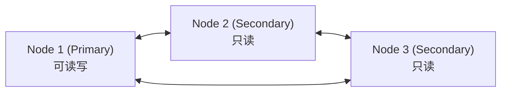

# MySQL 07 - 主从复制与高可用

数据量大到单机扛不住时，就需要**读写分离**和**主从复制**——把写操作放主库，读操作分散到多个从库。

---

## 一、主从复制原理

MySQL 主从复制基于 **binlog**（二进制日志）：

```
主库 (Master)                    从库 (Slave)
    │                                │
    │ 1. 执行写操作                    │
    │ 2. 写入 binlog                  │
    │ ──────── binlog dump ────────> │
    │                                │ 3. IO 线程读取 binlog
    │                                │ 4. 写入 relay log
    │                                │ 5. SQL 线程重放 relay log
    │                                │ 6. 数据与主库一致
```

### 三种复制模式

| 模式 | 说明 | 数据安全性 | 性能 |
|------|------|------------|------|
| 异步复制 | 主库写完 binlog 即返回，不等从库 | 低（主库宕机可能丢数据） | 高 |
| 半同步复制 | 至少一个从库确认收到 binlog 才返回 | 中 | 中 |
| 全同步复制 | 所有从库确认才返回 | 高 | 低 |

---

## 二、配置主从复制

### 2.1 主库配置

```ini
# 配置文件路径按平台选择：
#   Debian/Ubuntu: /etc/mysql/mysql.conf.d/mysqld.cnf
#   Arch/Fedora:   /etc/my.cnf 或 /etc/my.cnf.d/*.cnf
#   macOS(brew):   /opt/homebrew/etc/my.cnf
#   Windows:       C:\ProgramData\MySQL\MySQL Server 8.4\my.ini
[mysqld]
server-id = 1                    # 唯一标识，主从必须不同
log-bin = mysql-bin              # 启用 binlog
binlog-format = ROW              # 推荐 ROW 格式
# binlog-do-db = mydb            # 可选但易漏复制，生产环境一般不用
```

> **注意**：`binlog-do-db` 只按「当前默认库」过滤，跨库语句容易漏复制，生产环境通常**不设置**，复制全部库后用从库权限控制访问。

```sql
-- 创建复制用户
CREATE USER 'repl'@'%' IDENTIFIED BY 'repl_password';
GRANT REPLICATION SLAVE ON *.* TO 'repl'@'%';

-- 查看主库状态（MySQL 8.0.22+ 新语法；MariaDB 仍用 SHOW MASTER STATUS）
SHOW BINARY LOG STATUS;
-- 记录 File 和 Position；GTID 模式下记录 Executed_Gtid_Set
```

### 2.2 从库配置

```ini
# 配置文件路径与主库相同（见 2.1 节说明）
[mysqld]
server-id = 2                    # 与主库不同
relay-log = relay-bin            # 中继日志
read-only = ON                   # 从库只读（对 SUPER 用户无效）
super-read-only = ON             # 更严格：所有用户都只读
```

```sql
-- 配置主库信息（MySQL 8.0.22+ 新语法）
CHANGE REPLICATION SOURCE TO
    SOURCE_HOST = '192.168.1.100',
    SOURCE_USER = 'repl',
    SOURCE_PASSWORD = 'repl_password',
    SOURCE_LOG_FILE = 'mysql-bin.000001',
    SOURCE_LOG_POS = 154;

-- 启动复制
START REPLICA;

-- 检查状态
SHOW REPLICA STATUS\G
-- 关键字段：Replica_IO_Running = Yes, Replica_SQL_Running = Yes
```

> **旧语法兼容说明**：MySQL 8.0.22 起 `CHANGE MASTER TO` / `START SLAVE` / `SHOW SLAVE STATUS` / `SHOW MASTER STATUS` 等旧术语全部弃用，8.4/9.x 中已不可用，请统一使用 `SOURCE`/`REPLICA` 新语法；MariaDB 与 MySQL 5.7 仍使用旧语法。例如 MariaDB：
> ```sql
> CHANGE MASTER TO MASTER_HOST='192.168.1.100', MASTER_USER='repl',
>   MASTER_PASSWORD='repl_password', MASTER_LOG_FILE='mysql-bin.000001', MASTER_LOG_POS=154;
> START SLAVE; SHOW SLAVE STATUS\G
> ```

---

## 三、GTID 复制（推荐）

GTID（Global Transaction ID）是 MySQL 5.6+ 引入的复制方式，每个事务有全局唯一 ID，简化了主从切换：

```ini
# 主库和从库都配置
[mysqld]
gtid-mode = ON
enforce-gtid-consistency = ON
```

```sql
-- 从库配置（无需指定 binlog 文件和位置）
CHANGE REPLICATION SOURCE TO
    SOURCE_HOST = '192.168.1.100',
    SOURCE_USER = 'repl',
    SOURCE_PASSWORD = 'repl_password',
    SOURCE_AUTO_POSITION = 1;
-- MariaDB 对应写法：CHANGE MASTER TO ... MASTER_AUTO_POSITION=1;
```

---

## 四、读写分离

### 4.1 应用层分离

```java
// Java 示例：根据操作类型选择数据源
public class DynamicDataSource {
    private DataSource masterDataSource;  // 主库：写
    private DataSource slaveDataSource;   // 从库：读
    
    public Connection getConnection(boolean readOnly) {
        return readOnly
            ? slaveDataSource.getConnection()
            : masterDataSource.getConnection();
    }
}
```

### 4.2 中间件分离

使用代理层自动路由：

| 中间件 | 说明 |
|--------|------|
| ProxySQL | MySQL 代理，支持读写分离、连接池、查询缓存 |
| MySQL Router | MySQL 官方轻量级代理 |
| ShardingSphere | Apache 分库分表中间件 |

---

## 五、主从切换（故障转移）

当主库宕机时，需要将从库提升为新主库：

### 5.1 手动切换

```sql
-- 1. 确保从库已应用完 relay log（对比位点后再操作）
STOP REPLICA;
RESET REPLICA ALL;          -- 清除复制配置（MySQL 8.0.22+；旧语法 RESET SLAVE ALL）

-- 2. 将选中的从库提升为主库
-- 在新主库上执行（8.0.22+ 新语法，旧语法为 RESET MASTER）
RESET BINARY LOGS AND GTIDS;
-- 警告：该命令会清空 binlog，执行前确认不再需要基于旧 binlog 的时间点恢复
-- 其他从库重新配置 CHANGE REPLICATION SOURCE TO ... 指向新主库
```

### 5.2 自动切换工具

| 工具 | 说明 |
|------|------|
| MHA (Master High Availability) | 经典方案，但项目已停止维护（最后版本 0.58，2018 年），新项目不建议选用 |
| Orchestrator | 可视化拓扑管理，支持自动切换 |
| MySQL InnoDB Cluster | 官方方案，基于 Group Replication + MySQL Shell + MySQL Router |

---

## 六、Group Replication（组复制）

MySQL 5.7+ 的官方高可用方案，基于 Paxos 协议实现多节点数据一致性：



**特点**：
- 默认单主模式（single-primary）：只有 Primary 可写，故障时自动选举新 Primary
- 支持多主模式（multi-primary），但需应用层处理写冲突，生产环境较少使用
- 多数派确认（Paxos 变体），保证数据一致性与自动成员管理
- 节点数建议 3 或 5（奇数），超过半数节点存活集群才可写

---

## 七、MySQL InnoDB Cluster

MySQL 官方的完整高可用解决方案：

```text
# 在 MySQL Shell 交互界面中执行（mysqlsh 命令）
MySQL  JS > dba.configureInstance('root@node1:3306')
MySQL  JS > dba.configureInstance('root@node2:3306')
MySQL  JS > dba.configureInstance('root@node3:3306')

# 创建集群
MySQL  JS > shell.connect('root@node1:3306')
MySQL  JS > var cluster = dba.createCluster('myCluster')

# 添加实例
MySQL  JS > cluster.addInstance('root@node2:3306')
MySQL  JS > cluster.addInstance('root@node3:3306')

# 查看状态
MySQL  JS > cluster.status()
```

> mysqlsh 安装：Ubuntu 通过 MySQL APT 源、macOS 用 `brew install mysql-shell`、Arch 在 AUR（`mysql-shell`）。

---

## 八、备份与恢复

### 8.1 物理备份（推荐生产环境）

```bash
# 安装：Arch 用 pacman -S xtrabackup；Ubuntu 从 Percona 仓库安装
# 版本必须与 MySQL 对应（8.0 用 XtraBackup 8.0.x，8.4 用 8.4.x），不匹配会直接拒绝

# 1. 备份（热备，不锁表）
xtrabackup --backup --target-dir=/backup/full --user=root -p

# 2. prepare：回放 redo 使备份达到一致状态（必须执行，否则无法恢复）
xtrabackup --prepare --target-dir=/backup/full

# 3. 恢复：停服务 → 清空数据目录 → copy-back → 修属主 → 启动
sudo systemctl stop mysqld
xtrabackup --copy-back --target-dir=/backup/full
sudo chown -R mysql:mysql /var/lib/mysql
sudo systemctl start mysqld
```

> MySQL 8.0.30+ 也可使用官方 Clone Plugin 做物理克隆；小数据量仍推荐逻辑备份 + binlog 的 PITR 方案。

### 8.2 逻辑备份

```bash
# 全量备份
mysqldump -u root -p --all-databases > full_backup.sql

# 恢复
mysql -u root -p < full_backup.sql

# 增量恢复（基于 binlog，时间按实际备份点填写）
mysqlbinlog --start-datetime="2026-09-01 00:00:00" \
            --stop-datetime="2026-09-01 12:00:00" \
            mysql-bin.000001 | mysql -u root -p
```

---

## 九、监控指标

| 指标 | 命令 | 告警阈值 |
|------|------|----------|
| 复制延迟 | `SHOW REPLICA STATUS\G` 的 `Seconds_Behind_Source`（旧语法为 `Seconds_Behind_Master`） | > 10s |
| 主库连接数 | `SHOW STATUS LIKE 'Threads_connected'` | > max_connections * 0.8 |
| 慢查询 | `SHOW STATUS LIKE 'Slow_queries'` | 持续增长 |
| InnoDB 缓冲池命中率 | `SHOW STATUS LIKE 'Innodb_buffer_pool_read%'` | < 99% |

---

## 练习

| 序号 | 任务 | 验收标准 |
|------|------|---------|
| 1 | 用两台 MySQL 实例（或 Docker 容器）搭一套主从复制 | `SHOW REPLICA STATUS\G` 中 `Replica_IO_Running` 与 `Replica_SQL_Running` 均为 Yes |
| 2 | 在主库写入数据，确认从库同步 | 主库 INSERT 后 1 秒内从库可查到相同数据 |
| 3 | 把从库设为 `super-read-only` 并尝试写入 | 写入被拒绝，报 `--super-read-only` 相关错误 |
| 4 | 用 GTID 模式重新搭建复制 | `SOURCE_AUTO_POSITION=1` 配置成功，无需手工指定位点 |
| 5 | 模拟主库宕机，手动把从库提升为主库 | 提升后的新主库可写入，其他从库能重新指向它 |
