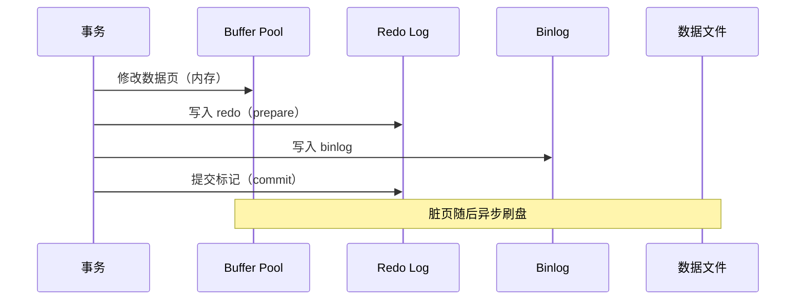

# MySQL 09 - 高级主题与性能诊断

前面的章节解决了「会用」：建库建表、增删改查、索引事务、备份复制。本章解决「用好」：窗口函数与 CTE、JSON、分区、执行计划深挖、锁与死锁实战、InnoDB 内部机制、在线 DDL、安全加固与参数调优。这些是面试的分水岭，也是生产排障的必备工具。

> 前置：[[03-查询进阶|查询进阶]]、[[04-索引事务与优化|索引事务与优化]]。本章以 Oracle MySQL 8.4/9.x 为主，MariaDB 差异处单独标注。所有示例基于以下表：

```sql
CREATE DATABASE IF NOT EXISTS demo CHARACTER SET utf8mb4 COLLATE utf8mb4_0900_ai_ci;
USE demo;

CREATE TABLE students (
    id      INT PRIMARY KEY AUTO_INCREMENT,
    name    VARCHAR(50) NOT NULL,
    class   VARCHAR(20),
    score   DECIMAL(5,2),
    created_at DATETIME DEFAULT CURRENT_TIMESTAMP
);

INSERT INTO students (name, class, score) VALUES
    ('张三', '一班', 92.5), ('李四', '一班', 85.0), ('王五', '一班', 77.5),
    ('赵六', '二班', 95.0), ('钱七', '二班', 88.0), ('孙八', '二班', 88.0);
```

---

## 一、窗口函数进阶

窗口函数在**不折叠行**的前提下做聚合与排名——这是它和 GROUP BY 的本质区别。

### 1.1 排名三兄弟

```sql
SELECT name, class, score,
       ROW_NUMBER() OVER (PARTITION BY class ORDER BY score DESC) AS rn,   -- 1,2,3,4 不重复
       RANK()       OVER (PARTITION BY class ORDER BY score DESC) AS rk,   -- 1,2,2,4 跳号
       DENSE_RANK() OVER (PARTITION BY class ORDER BY score DESC) AS drk   -- 1,2,2,3 不跳号
FROM students
ORDER BY class, score DESC;
```

| 函数 | 并列时行为 | 典型场景 |
|------|-----------|---------|
| `ROW_NUMBER()` | 并列也强行编号 | 分页、去重（取每组第一条） |
| `RANK()` | 并列同名次，后续跳号 | 比赛排名 |
| `DENSE_RANK()` | 并列同名次，后续不跳号 | 等级评定 |

### 1.2 取每组 Top-N

```sql
-- 每个班成绩最高的前两名
SELECT * FROM (
    SELECT name, class, score,
           ROW_NUMBER() OVER (PARTITION BY class ORDER BY score DESC) AS rn
    FROM students
) t
WHERE rn <= 2;
```

### 1.3 位移与累计

```sql
SELECT name, class, score,
       LAG(score)  OVER (PARTITION BY class ORDER BY id) AS 上一名分数,
       LEAD(score) OVER (PARTITION BY class ORDER BY id) AS 下一名分数,
       SUM(score)  OVER (PARTITION BY class ORDER BY id
                         ROWS BETWEEN UNBOUNDED PRECEDING AND CURRENT ROW) AS 累计分,
       AVG(score)  OVER (PARTITION BY class) AS 班级平均分,
       score - AVG(score) OVER (PARTITION BY class) AS 与班均差
FROM students;
```

窗口定义（`PARTITION BY` / `ORDER BY` / 帧 `ROWS BETWEEN`）可以抽成命名窗口复用：

```sql
SELECT name, class, score,
       ROW_NUMBER() OVER w AS rn,
       AVG(score)   OVER w AS avg_score
FROM students
WINDOW w AS (PARTITION BY class ORDER BY score DESC);
```

> 版本要求：窗口函数 MySQL 8.0+ / MariaDB 10.2+。5.7 只能用变量模拟，可读性极差，建议直接升级。

---

## 二、CTE 与递归 CTE

### 2.1 普通 CTE：让复杂查询可读

```sql
WITH class_stats AS (
    SELECT class, AVG(score) AS avg_score, COUNT(*) AS cnt
    FROM students
    GROUP BY class
),
top_students AS (
    SELECT s.*, c.avg_score
    FROM students s
    JOIN class_stats c ON s.class = c.class
    WHERE s.score > c.avg_score
)
SELECT * FROM top_students ORDER BY class, score DESC;
```

CTE 相比子查询的优势：**可命名、可复用、可读性接近自然语言**。MySQL 8.0+ / MariaDB 10.2+ 支持。

### 2.2 递归 CTE：处理层级数据

生成 1 到 10 的数字序列：

```sql
WITH RECURSIVE nums AS (
    SELECT 1 AS n
    UNION ALL
    SELECT n + 1 FROM nums WHERE n < 10
)
SELECT * FROM nums;
```

组织架构树（经典场景）：

```sql
CREATE TABLE employees (
    id INT PRIMARY KEY,
    name VARCHAR(50),
    manager_id INT NULL,
    FOREIGN KEY (manager_id) REFERENCES employees(id)
);

INSERT INTO employees VALUES
    (1, 'CEO', NULL), (2, 'CTO', 1), (3, 'CFO', 1),
    (4, '后端主管', 2), (5, '前端主管', 2), (6, '会计', 3);

-- 从 CEO 出发遍历所有下属，带层级
WITH RECURSIVE org AS (
    SELECT id, name, manager_id, 1 AS level, CAST(name AS CHAR(200)) AS path
    FROM employees WHERE manager_id IS NULL
    UNION ALL
    SELECT e.id, e.name, e.manager_id, o.level + 1,
           CONCAT(o.path, ' > ', e.name)
    FROM employees e
    JOIN org o ON e.manager_id = o.id
)
SELECT id, name, level, path FROM org ORDER BY level, id;
```

**安全阀**：递归失控会耗尽内存，用 `cte_max_recursion_depth`（默认 1000）限制深度：

```sql
SET SESSION cte_max_recursion_depth = 100;
```

---

## 三、JSON 类型与函数

MySQL 5.7+ 提供原生 JSON 类型（二进制存储 + 自动校验），适合**结构不固定的属性**。

```sql
CREATE TABLE products (
    id    INT PRIMARY KEY AUTO_INCREMENT,
    name  VARCHAR(50) NOT NULL,
    attrs JSON
);

INSERT INTO products (name, attrs) VALUES
    ('手机', '{"color": "black", "storage": 256, "tags": ["5G", "旗舰"]}'),
    ('耳机', '{"color": "white", "wireless": true}');
```

常用操作：

```sql
-- 提取（->> 返回字符串，-> 返回 JSON）
SELECT name, attrs->>'$.color' AS color FROM products;

-- 条件查询
SELECT * FROM products WHERE attrs->>'$.color' = 'black';

-- 判断键是否存在
SELECT * FROM products WHERE JSON_CONTAINS_PATH(attrs, 'one', '$.wireless');

-- 修改
UPDATE products SET attrs = JSON_SET(attrs, '$.storage', 512) WHERE name = '手机';
UPDATE products SET attrs = JSON_REMOVE(attrs, '$.tags[0]') WHERE name = '手机';

-- 展开数组为多行
SELECT p.name, jt.tag
FROM products p,
     JSON_TABLE(p.attrs, '$.tags[*]' COLUMNS (tag VARCHAR(50) PATH '$')) AS jt;
```

**JSON 的工程边界**：

| 该用 JSON | 不该用 JSON |
|-----------|-------------|
| 商品的可变属性、埋点数据、配置快照 | 需要频繁 WHERE / JOIN / 聚合的字段 |
| 结构经常变化、每行差异大 | 关系明确、结构稳定的核心业务字段 |
| 作为整体读写的附加信息 | 需要外键约束、唯一约束的数据 |

> 需要按 JSON 字段高频查询时，用**生成列 + 索引**把 JSON 字段「提升」为普通列：

```sql
ALTER TABLE products
  ADD COLUMN storage INT GENERATED ALWAYS AS (attrs->>'$.storage') STORED,
  ADD INDEX idx_storage (storage);
```

---

## 四、生成列

生成列的值由其他列计算得到，分 `VIRTUAL`（默认，不存储）与 `STORED`（存储并占用空间）。

```sql
CREATE TABLE order_items (
    id    INT PRIMARY KEY AUTO_INCREMENT,
    price DECIMAL(10,2) NOT NULL,
    qty   INT NOT NULL,
    total DECIMAL(12,2) GENERATED ALWAYS AS (price * qty) STORED,
    INDEX idx_total (total)
);

INSERT INTO order_items (price, qty) VALUES (19.90, 3);
SELECT * FROM order_items;   -- total = 59.70，无需应用层计算
```

| 对比 | VIRTUAL | STORED |
|------|---------|--------|
| 存储空间 | 不占（读取时计算） | 占用 |
| 可建索引 | 是（二级索引） | 是 |
| 修改基列 | 自动更新 | 自动更新 |
| 适用 | 查询时才用到的派生值 | 频繁过滤/排序、需要唯一约束 |

典型用途：`full_name = CONCAT(first_name, last_name)`、金额合计、日期截断（`DATE(created_at)`）、JSON 字段提取。**不要在应用层重复计算这些值，数据库算得更可靠。**

---

## 五、分区表

当单表行数达到千万级、且能按某个维度（时间最常见）切分时，分区可以：
- 查询只扫描相关分区（分区裁剪）
- 删除历史数据用 `DROP PARTITION` 秒级完成，而不是 `DELETE` 慢慢删

```sql
CREATE TABLE orders (
    id         BIGINT NOT NULL,
    user_id    BIGINT NOT NULL,
    created_at DATE   NOT NULL,
    amount     DECIMAL(10,2),
    PRIMARY KEY (id, created_at)          -- 分区键必须包含在每个唯一键中
)
PARTITION BY RANGE (YEAR(created_at)) (
    PARTITION p2024 VALUES LESS THAN (2025),
    PARTITION p2025 VALUES LESS THAN (2026),
    PARTITION p2026 VALUES LESS THAN (2027),
    PARTITION pmax  VALUES LESS THAN MAXVALUE
);

-- 归档：直接删除整个分区（比 DELETE 快几个数量级）
ALTER TABLE orders DROP PARTITION p2024;
```

常用分区类型：

| 类型 | 适用 |
|------|------|
| `RANGE` | 时间区间（最常用） |
| `LIST` | 枚举值分区（按地区/类型） |
| `HASH` / `KEY` | 均匀打散（按 user_id） |

**分区不是万能药**：

- 分区键必须出现在每个唯一索引中，设计受限
- 分区过多（成百上千）会拖慢元数据操作
- 查询不带分区键时仍然全分区扫描
- 小表（几百万行以内）用索引就够，分区反而添乱
- MySQL 分区表不支持外键

---

## 六、EXPLAIN 进阶

`EXPLAIN` 是 SQL 优化的听诊器。基础用法见 [[04-索引事务与优化|04 索引事务与优化]]，这里讲进阶。

### 6.1 三种输出格式

```sql
-- 传统表格（默认）
EXPLAIN SELECT * FROM students WHERE class = '一班';

-- 树形（可读性最好，MySQL 8.0.16+）
EXPLAIN FORMAT=TREE
SELECT s.name, c.avg_score
FROM students s
JOIN (SELECT class, AVG(score) AS avg_score FROM students GROUP BY class) c
  ON s.class = c.class
WHERE s.score > 80;

-- JSON（信息最全，可被程序解析）
EXPLAIN FORMAT=JSON SELECT * FROM students WHERE score > 90;
```

### 6.2 EXPLAIN ANALYZE：真实执行数据

`EXPLAIN` 只是估算，`EXPLAIN ANALYZE`（8.0.18+）会**真正执行**并给出实际耗时与行数：

```sql
EXPLAIN ANALYZE
SELECT class, AVG(score) FROM students GROUP BY class;
```

输出示例（节选）：

```text
-> Table scan on students  (cost=0.75 rows=6) (actual time=0.045..0.061 rows=6 loops=1)
-> Group aggregate: avg(students.score)  (actual time=0.072..0.079 rows=2 loops=1)
```

**关键对比**：`rows=6`（估算）与 `actual ... rows=6`（实际）差距越大，统计信息越不准，优化器越可能选错计划。此时执行 `ANALYZE TABLE students;` 更新统计。

### 6.3 读懂访问类型与 Extra

| type（访问类型） | 含义 | 好坏 |
|------------------|------|------|
| `system` / `const` | 主键或唯一索引等值命中，最多一行 | 最好 |
| `eq_ref` | JOIN 时被驱动表用主键/唯一索引命中 | 很好 |
| `ref` | 普通二级索引等值命中 | 好 |
| `range` | 索引范围扫描 | 尚可 |
| `index` | 全索引扫描 | 偏差（扫整棵索引树） |
| `ALL` | 全表扫描 | 差，大表必须优化 |

| Extra 提示 | 含义 | 对策 |
|-----------|------|------|
| `Using index` | 覆盖索引，不回表 | 好 |
| `Using where` | 存储引擎返回后再过滤 | 视情况加索引 |
| `Using filesort` | 需要额外排序 | 让 ORDER BY 走索引顺序 |
| `Using temporary` | 用了临时表（GROUP BY/DISTINCT） | 优化分组字段索引 |
| `Using join buffer` | 被驱动表无索引，用了连接缓冲 | 给 JOIN 字段加索引 |

### 6.4 优化器追踪（了解即可）

```sql
SET optimizer_trace = 'enabled=on';
SELECT * FROM students WHERE score > 90;
SELECT * FROM information_schema.OPTIMIZER_TRACE\G
SET optimizer_trace = 'enabled=off';
```

---

## 七、performance_schema 与 sys schema

`performance_schema` 是 MySQL 内置的性能监控库；`sys` 库把它包装成人能看懂的报告（MySQL 5.7+ 默认安装）。

```sql
-- 最耗时的 SQL 类型 Top 10（按总耗时）
SELECT DIGEST_TEXT, COUNT_STAR, 
       ROUND(SUM_TIMER_WAIT/1e12, 2) AS total_sec,
       ROUND(AVG_TIMER_WAIT/1e9, 2)  AS avg_ms
FROM performance_schema.events_statements_summary_by_digest
ORDER BY SUM_TIMER_WAIT DESC
LIMIT 10;

-- sys 库的封装视图（更好读）
SELECT * FROM sys.statement_analysis LIMIT 10;          -- 语句分析
SELECT * FROM sys.schema_table_statistics_with_buffer   -- 表访问与缓冲
ORDER BY rows_fetched DESC LIMIT 10;
SELECT * FROM sys.innodb_lock_waits;                    -- 当前锁等待
SELECT * FROM sys.processlist WHERE conn_id IS NOT NULL;-- 当前会话
SELECT * FROM sys.schema_unused_indexes;                -- 从未被用过的索引
```

> `sys.schema_unused_indexes` 是清理冗余索引的利器：长期未被使用的索引只增加写入成本，可以考虑删除（删除前先在预发环境验证）。

---

## 八、锁与死锁实战

### 8.1 观察当前锁

```sql
-- 当前运行的事务
SELECT trx_id, trx_state, trx_started, trx_mysql_thread_id, trx_query
FROM information_schema.INNODB_TRX;

-- 当前持有的锁（MySQL 8.0+）
SELECT * FROM performance_schema.data_locks;

-- 谁在等谁的锁
SELECT * FROM performance_schema.data_lock_waits;

-- 综合视图
SELECT * FROM sys.innodb_lock_waits;
```

### 8.2 复现一次死锁

两个会话按相反顺序更新同一批行：

| 步骤 | 会话 A | 会话 B |
|------|--------|--------|
| 1 | `BEGIN; UPDATE accounts SET balance=balance-10 WHERE id=1;` | |
| 2 | | `BEGIN; UPDATE accounts SET balance=balance-10 WHERE id=2;` |
| 3 | `UPDATE accounts SET balance=balance+10 WHERE id=2;`（等待 B） | |
| 4 | | `UPDATE accounts SET balance=balance+10 WHERE id=1;`（死锁触发） |

InnoDB 检测到死锁后，会回滚其中代价较小的事务并报错：

```text
ERROR 1213 (40001): Deadlock found when trying to get lock; try restarting transaction
```

查看最近一次死锁详情：

```sql
SHOW ENGINE INNODB STATUS\G
-- 关注 LATEST DETECTED DEADLOCK 段
```

### 8.3 避免与处理死锁

| 策略 | 说明 |
|------|------|
| 统一加锁顺序 | 所有事务按相同顺序（如按主键升序）访问资源 |
| 缩短事务 | 不要在事务里做 RPC、发消息、等用户输入 |
| 降低隔离级别 | 评估 READ COMMITTED 可减少间隙锁 |
| 精确索引 | 无索引的更新会锁更多行甚至全表 |
| 应用重试 | 捕获 1213/1205 错误码，退避后重试 1~3 次 |
| 避免大事务 | 批量更新拆成小批次提交 |

---

## 九、InnoDB 内部机制

理解内部机制，排障时才能推断「为什么慢、为什么丢数据」。

### 9.1 三大日志

| 日志 | 层次 | 作用 | 关键参数 |
|------|------|------|---------|
| redo log | InnoDB | 崩溃恢复：先写日志再刷脏页（WAL） | `innodb_redo_log_capacity`（8.0.30+） |
| undo log | InnoDB | 事务回滚 + MVCC 版本链 | 存放在 undo 表空间 |
| binlog | Server | 归档与复制：逻辑日志 | `binlog_format=ROW` |

一次事务提交的顺序：



两阶段提交保证 redo log 与 binlog 一致，这是崩溃恢复与主从复制正确性的基础。

### 9.2 MVCC：为什么读写不互相阻塞

InnoDB 为每行维护隐藏列：`DB_TRX_ID`（最后修改事务）、`DB_ROLL_PTR`（指向 undo 版本链）。读取时根据事务的 **Read View** 沿版本链找到可见版本：

- 读操作不加锁，读到的是「快照」
- REPEATABLE READ 下同一事务多次读取结果一致
- 写操作才加行锁
- 长事务会导致 undo 链无法清理，这是「长事务危害大」的根源

### 9.3 其他关键概念

| 概念 | 作用 |
|------|------|
| LSN | 日志序列号，标识 redo 位置 |
| Checkpoint | 把脏页刷盘并推进 LSN，缩短崩溃恢复时间 |
| Doublewrite Buffer | 防止页写入过程中断电导致页损坏 |
| Buffer Pool LRU | 缓存数据页与索引页，命中率决定性能 |
| Change Buffer | 缓存对非唯一二级索引的写，减少随机 IO |

```sql
-- 观察关键状态
SHOW ENGINE INNODB STATUS\G
SELECT * FROM information_schema.INNODB_METRICS WHERE STATUS = 'enabled';
SHOW STATUS LIKE 'Innodb_buffer_pool_read_requests';
SHOW STATUS LIKE 'Innodb_buffer_pool_reads';   -- 两者比值即命中率
```

---

## 十、在线 DDL

大表加字段/加索引时，锁表可能让业务停摆。MySQL 8 的在线 DDL 支持指定算法：

```sql
-- 加列：INSTANT 只改元数据，秒级完成（8.0.12+）
ALTER TABLE students ADD COLUMN phone VARCHAR(20), ALGORITHM=INSTANT;

-- 加索引：INPLACE + LOCK=NONE 不阻塞读写
ALTER TABLE students ADD INDEX idx_name (name), ALGORITHM=INPLACE, LOCK=NONE;

-- 改列类型/改字符集：通常需要 COPY，会重建表，慎用
ALTER TABLE students MODIFY name VARCHAR(100), ALGORITHM=COPY;
```

| ALGORITHM | 行为 | 是否阻塞 |
|-----------|------|---------|
| `INSTANT` | 只改数据字典 | 不阻塞，秒级 |
| `INPLACE` | 原地重建，不拷贝到临时表 | 视操作而定，配 `LOCK=NONE` 尽量不阻塞 |
| `COPY` | 建临时表逐行拷贝 | 阻塞写入 |

**实操建议**：

- 执行前先 `SHOW CREATE TABLE` 与数据量评估，预估耗时
- 在业务低峰期执行；大表变更前先备份
- 用 `ALGORITHM=INPLACE, LOCK=NONE` 显式声明要求，不满足时报错而不是悄悄锁表
- 8.0.29+ 支持 `ALTER TABLE ... ADD COLUMN ... INSTANT` 的列位置任意（旧版只能加在末尾）
- 超大表（亿级）考虑 gh-ost / pt-online-schema-change 工具

---

## 十一、安全加固

### 11.1 基础清单

```sql
-- 删除匿名用户与测试库（mysql_secure_installation 已自动处理）
DROP USER IF EXISTS ''@'localhost';
DROP DATABASE IF EXISTS test;

-- 应用账号最小权限：只给业务库，不给 ALL ON *.*
CREATE USER 'app'@'10.0.0.%' IDENTIFIED BY 'StrongPass!2026';
GRANT SELECT, INSERT, UPDATE, DELETE ON appdb.* TO 'app'@'10.0.0.%';
-- 明确不需要 DROP/ALTER/GRANT 等权限

-- 查看权限
SHOW GRANTS FOR 'app'@'10.0.0.%';
```

### 11.2 传输加密（TLS）

MySQL 8 初始化时会自动生成自签证书，启用强制加密：

```ini
[mysqld]
require_secure_transport = ON
```

```sql
-- 要求某用户必须用 SSL 连接
CREATE USER 'app'@'%' IDENTIFIED BY 'StrongPass!2026' REQUIRE SSL;
-- 查看连接是否加密
SHOW STATUS LIKE 'Ssl_cipher';
```

### 11.3 密码策略与审计

```sql
-- 启用密码强度组件（Oracle MySQL）
INSTALL COMPONENT 'file://component_validate_password';
SHOW VARIABLES LIKE 'validate_password%';
```

| 措施 | 说明 |
|------|------|
| 密码策略 | 长度 ≥ 8、含大小写/数字/符号 |
| 登录失败锁定 | `FAILED_LOGIN_ATTEMPTS`（8.0.19+ 的密码管理） |
| 审计日志 | 社区版可用 general log / 触发器记录；企业版有 Audit 插件；MariaDB 有 audit 插件 |
| 备份加密 | `mysqldump` 管道加密 / XtraBackup `--encrypt` |
| 网络隔离 | 数据库只监听内网；用 SSH 隧道/VPN 访问 |
| 定期升级 | 关注安全公告，及时打补丁 |

---

## 十二、参数调优速查

| 参数 | 作用 | 建议 |
|------|------|------|
| `innodb_buffer_pool_size` | 缓存数据与索引 | 物理内存的 50%~70%（专用数据库机） |
| `innodb_buffer_pool_instances` | 缓冲池分片 | 每 1GB 缓冲池一个实例，最多 8~16 |
| `innodb_redo_log_capacity` | redo 日志容量（8.0.30+） | 1~4GB，写密集可加大 |
| `innodb_flush_log_at_trx_commit` | 每次提交刷盘策略 | 1 最安全；2 性能好但可能丢 1 秒数据 |
| `sync_binlog` | binlog 刷盘频率 | 1 最安全；高并发可评估 100 |
| `max_connections` | 最大连接数 | 结合连接池设置，别盲目调大 |
| `thread_cache_size` | 线程缓存 | 减少频繁建连开销 |
| `table_open_cache` | 打开表缓存 | 表多时调大 |
| `tmp_table_size` / `max_heap_table_size` | 内存临时表上限 | 适当调大可减少磁盘临时表 |
| `long_query_time` | 慢查询阈值 | 1~2 秒，配合慢查询日志 |

```sql
-- 运行时查看与动态调整（重启后失效，持久化写配置文件）
SHOW VARIABLES LIKE 'innodb_buffer_pool_size';
SET GLOBAL long_query_time = 1;
```

> 调优顺序：**先优化 SQL 与索引（收益最大）→ 再调参数 → 最后才考虑加硬件**。没有慢查询分析的调参都是玄学。

---

## 十三、升级与迁移

| 任务 | 工具/命令 | 说明 |
|------|----------|------|
| 小版本升级 | 直接替换二进制并重启 | MySQL 8.0.16+ 启动时自动完成数据字典升级 |
| 大版本升级 | `mysqlsh` 的 `util.checkForServerUpgrade()` | 升级前检查不兼容项 |
| MariaDB 升级 | `sudo mariadb-upgrade -u root -p` | 大版本升级后必须执行 |
| 逻辑备份迁移 | `mysqldump` / `mydumper` | 跨版本、跨平台通用，速度慢 |
| 物理备份迁移 | XtraBackup / Clone Plugin | 大数据量快速，版本需兼容 |
| 云迁移 | DTS / DataX / 自建同步 | 不停机迁移用主从复制切换 |

大版本升级的稳妥流程：

```text
备份 → 预发环境演练 → 检查兼容性(mysqlsh) → 从库先行升级
→ 主从切换 → 观察 → 原主库升级为新从库 → 回滚预案待命
```

---

## 十四、分库分表与云数据库概览

单机 MySQL 的扩展极限大致是：单表数千万行、单库 QPS 数千到数万（视硬件与查询）。超过后有三条路：

| 路线 | 做法 | 代价 |
|------|------|------|
| 垂直拆分 | 按业务拆库（订单库、用户库） | 跨库 JOIN 消失 |
| 读写分离 | 主写从读（见 [[07-主从复制与高可用\|07 主从复制]]） | 主从延迟、读一致性 |
| 水平分片 | 按 user_id 取模等拆成多个库表 | 跨分片查询、分布式事务复杂 |

分片中间件：

| 工具 | 定位 |
|------|------|
| ShardingSphere | Java 生态，客户端分片 + 代理 |
| Vitess | YouTube 开源，K8s 友好，云原生 |
| ProxySQL | 高性能代理，读写分离与路由 |
| MyCat | 国内老牌分片中间件 |

> **忠告**：分库分表是最后手段。先穷尽索引优化、读写分离、缓存、归档历史数据，再考虑分片。分片带来的复杂度会渗透到每一行业务代码。

云数据库（RDS / Cloud SQL / Aurora 等）把备份、主从、监控、扩容托管化，中小团队通常比自建更划算。核心概念相通，学完本章你理解的是同一套原理。

---

## 十五、动手实践

| 序号 | 任务 | 验收标准 |
|------|------|---------|
| 1 | 用窗口函数求每个班成绩前 2 名与班级平均分 | 一条 SQL 完成，结果正确 |
| 2 | 用递归 CTE 输出组织架构的层级路径 | `CEO > CTO > 后端主管` 格式正确 |
| 3 | 建一张含 JSON 列与生成列的表，并对生成列建索引 | `EXPLAIN` 显示走了该索引 |
| 4 | 按年份对订单表分区，并用 `DROP PARTITION` 归档一年数据 | 归档瞬间完成，查询只扫相关分区 |
| 5 | 用 `EXPLAIN ANALYZE` 对比一条 SQL 加索引前后的真实耗时 | 记录执行时间与扫描行数变化 |
| 6 | 复现第八节的死锁并读懂 `SHOW ENGINE INNODB STATUS` 的死锁段 | 能说出两个事务各自持有什么锁、在等什么锁 |
| 7 | 给应用账号只授予单库的 CRUD 权限并验证越权被拒 | `DROP TABLE` 报权限错误 |

---

**返回** [[../数据库目录|数据库目录]]；相关章节：[[04-索引事务与优化|04 索引事务与优化]]、[[05-用户权限与备份恢复|05 用户权限与备份恢复]]、[[07-主从复制与高可用|07 主从复制与高可用]]、[[08-与后端语言集成|08 与后端语言集成]]。
