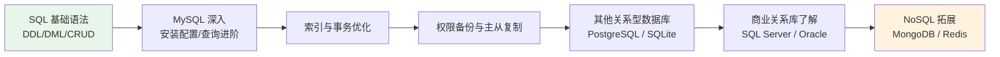

# 数据库教程总目录

本目录是 RootStack 的 **多数据库教学模块**，面向有 C/C++ 基础的读者。数据库是后端开发、运维和安全的共同基石：写服务端程序要连数据库，做渗透测试要懂 SQL 注入，分析日志要会查询。本教程从零开始，以 **MySQL 为主线深入讲解**，再横向铺开 PostgreSQL、SQLite、SQL Server、Oracle、MongoDB、Redis 七大主流数据库。

> 学习前置建议：具备任意一门编程语言基础（C/C++ 更佳），无需数据库经验。

---

## 一、主流数据库选型对比

| 数据库 | 类型 | 许可证 | 典型场景 | 默认端口 |
|--------|------|--------|----------|----------|
| MySQL | 关系型 | GPL / 商业双授权 | Web 后端（LAMP/LNMP）、中小型互联网业务 | 3306 |
| PostgreSQL | 关系型（对象-关系） | BSD 类（PostgreSQL License） | 复杂查询、GIS、数据分析、企业级应用 | 5432 |
| SQLite | 嵌入式关系型 | Public Domain | 移动端 App、桌面软件、IoT、测试 | 无（单文件，无网络端口） |
| SQL Server | 关系型 | 商业（有免费 Developer 版） | Windows 企业生态、.NET 技术栈 | 1433 |
| Oracle | 关系型 | 商业 | 银行、电信、大型政企核心系统 | 1521 |
| MongoDB | 文档型 NoSQL | SSPL | 快速迭代的业务、日志存储、半结构化数据 | 27017 |
| Redis | 内存键值 NoSQL | BSD 类（RSALv2/SSPLv1 双许可） | 缓存、会话存储、消息队列、排行榜 | 6379 |

选型一句话：**Web 业务选 MySQL 或 PostgreSQL，嵌入式/单机小工具选 SQLite，缓存选 Redis，文档灵活多变选 MongoDB，国企银行按甲方要求上 Oracle/SQL Server。**

---

## 二、学习路线

推荐顺序：

1. 先学 `mysql/` 五章，掌握 SQL 与一个生产级关系库的完整使用
2. 再横向对比学 PostgreSQL 和 SQLite，体会不同实现的差异
3. 最后根据需要选修 MongoDB / Redis 等 NoSQL

---

## 三、子目录导航

| 目录 | 内容 |
|------|------|
| [[mysql/01-安装与配置\|MySQL 01 安装与配置]] | 多平台安装、服务管理、配置文件、字符集、重置 root 密码 |
| [[mysql/02-SQL基础语法\|MySQL 02 SQL 基础语法]] | 数据类型、库表操作、约束、CRUD 全套 |
| [[mysql/03-查询进阶\|MySQL 03 查询进阶]] | JOIN、子查询、UNION、内置函数、窗口函数 |
| [[mysql/04-索引事务与优化\|MySQL 04 索引事务与优化]] | B+ 树、最左前缀、EXPLAIN、ACID、隔离级别 |
| [[mysql/05-用户权限与备份恢复\|MySQL 05 用户权限与备份恢复]] | GRANT/REVOKE、mysqldump、binlog 时间点恢复 |
| [[postgresql/PostgreSQL教程\|PostgreSQL 教程]] | 最先进开源关系库、JSONB、CTE、递归查询 |
| [[sqlite/SQLite教程\|SQLite 教程]] | 嵌入式零配置、C API 集成、类型亲和性 |
| [[sqlserver/SQLServer教程\|SQL Server 教程]] | 微软企业级关系库、T-SQL |
| [[oracle/Oracle教程\|Oracle 教程]] | 大型商业数据库、PL/SQL |
| [[mongodb/MongoDB教程\|MongoDB 教程]] | 文档型 NoSQL、聚合管道 |
| [[redis/Redis教程\|Redis 教程]] | 内存键值数据库、缓存与数据结构 |

---

## 四、与 RootStack 其他模块的关联

| 模块 | 关联说明 |
|------|----------|
| [[../red_team/网安基础知识/08-数据库基础\|网安数据库基础]] | 安全视角的数据库入门，与本目录互为补充 |
| [[../red_team/数据库安全/数据库安全总目录\|红队数据库安全]] | SQL 注入、提权、数据窃取等攻防实战 |
| [[../python/python目录\|Python 教程]] | Python 连接 MySQL（pymysql）、SQLite（内置 sqlite3 模块）实操 |

---

**返回** [[../README|RootStack 首页]]
