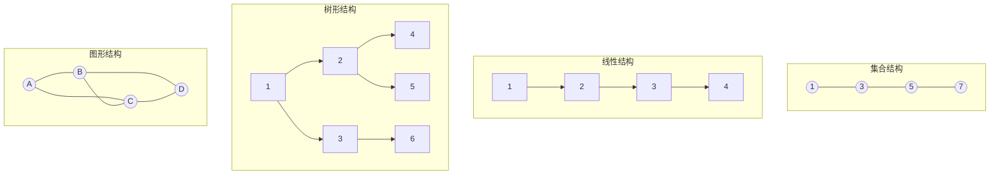
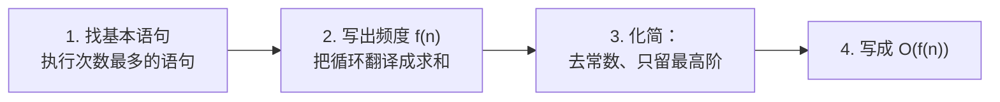
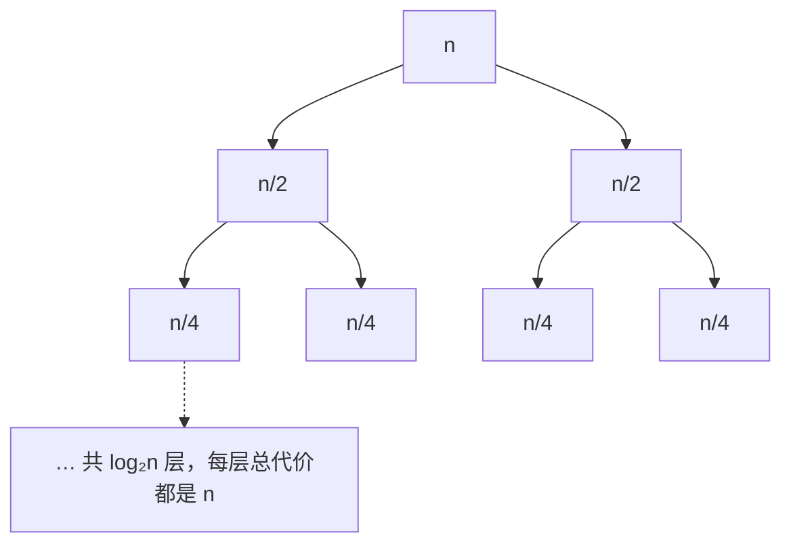

## 什么是数据结构

在学习具体的数据结构之前，先理清几个基本概念。这些概念在考试和面试中经常出现，也是理解后续所有章节的基础。

### 数据

**数据**是计算机能识别、存储和处理的符号集合。数字、字符、图片、音频——凡是能被计算机处理的东西，都是数据。

### 数据元素

**数据元素**是数据的基本单位，在程序中通常作为一个整体进行考虑和处理。一个数据元素可以由多个**数据项**组成。而数据项即是最小单位。

举个例子：一个学生记录是一个数据元素，它包含姓名、学号、成绩等多个数据项。

| 概念 | 类比 | 示例 |
|------|------|------|
| 数据 | 整个通讯录 | 全班同学的联系方式 |
| 数据元素 | 通讯录中的一条记录 | 张三的完整信息 |
| 数据项 | 记录中的一个字段 | 张三的电话号码 |

### 数据结构

**数据结构**是相互之间存在一种或多种特定关系的数据元素的集合。它包含两个层面：

1. **逻辑结构**：数据元素之间的抽象关系（与存储无关），逻辑结构主要分为线性结构和非线性结构
2. **物理结构**（存储结构）：数据在计算机内存中的实际存储方式，目前主要分为顺序存储结构和链式存储结构。

---

## 逻辑结构

逻辑结构描述数据元素之间的**抽象关系**，与计算机如何实现无关。主要分为四大类：

| 逻辑结构 | 关系 | 说明 | 典型例子 |
|----------|------|------|----------|
| **集合结构** | 元素同属一个集合，无其他关系 | 最松散的结构 | {1, 3, 5, 7} |
| **线性结构** | 一对一（1:1） | 元素排成一条线 | [[C_线性表_LinearList|线性表]]、数组、链表、栈、队列 |
| **树形结构** | 一对多（1:N） | 层层分支 | 二叉树、B树、文件系统 |
| **图形结构** | 多对多（M:N） | 任意连接 | 社交网络、地图导航 |



**关键区分**：逻辑结构关注的是"元素之间有什么关系"，不关心"元素存在哪里"。同一个线性结构，可以用数组存储，也可以用链表存储——这就是逻辑结构和物理结构的分离。线性结构中最基础的抽象是**线性表**，它的定义与两种实现见 [[C_线性表_LinearList|线性表与顺序表]]。

---

## 物理结构（存储结构）

物理结构描述数据在计算机内存中的**实际存储方式**。主要分为两种：

### 顺序存储

把逻辑上相邻的元素，存储在物理位置也相邻的存储单元中。

```
内存地址:  1000   1004   1008   1012   1016
存储内容: [  1  ][  2  ][  3  ][  4  ][  5  ]
           ←──── 连续的内存块 ────→
```

**特点**：
- 支持随机访问（按下标取值 O(1)）
- 插入/删除需要移动大量元素 O(n)
- 需要预先分配连续空间

**典型代表**：数组

### 链式存储

不要求逻辑上相邻的元素在物理位置上也相邻，元素间的逻辑关系通过附加的**指针**来表示。

```
内存地址:  1000      2056      1532
存储内容: [ 1 | ●]→[ 2 | ●]→[ 3 | ●]→NULL
           ↑         ↑         ↑
           不连续！靠指针链接
```

**特点**：
- 不支持随机访问（必须从头遍历 O(n)）
- 插入/删除只需修改指针 O(1)
- 动态分配，不需要预先知道数据规模

**典型代表**：链表

### 对比

| 维度 | 顺序存储 | 链式存储 |
|------|----------|----------|
| 内存分配 | 预先分配连续空间 | 动态分配，按需申请 |
| 随机访问 | O(1) | O(n) |
| 插入/删除 | O(n)（需移动元素） | O(1)（已知位置时） |
| 空间利用 | 可能浪费（预分配过多） | 按需使用，但指针占额外空间 |
| 缓存友好 | 好（连续内存，局部性） | 差（节点分散，cache miss） |

> **还有一种散列存储**：用哈希函数直接计算元素的存储地址，典型代表是哈希表。它既不是纯粹的顺序存储，也不是链式存储，而是通过数学映射直达目标位置。

---

## 数据的运算

无论哪种数据结构，基本运算都可以归纳为以下几类：

| 运算类型 | 说明 | 示例 |
|----------|------|------|
| 查找（Search） | 在数据结构中找到指定元素 | 在数组中找值为 5 的元素 |
| 插入（Insert） | 在数据结构中添加新元素 | 在链表头插入新节点 |
| 删除（Delete） | 从数据结构中移除指定元素 | 删除二叉树的叶节点 |
| 修改（Update） | 更新指定元素的值 | 修改数组 arr[3] 的值 |
| 遍历（Traverse） | 访问数据结构中的每个元素 | 中序遍历二叉树 |

---

## 内存和地址

计算机运行程序时，所有数据都存在内存（RAM）里。可以把内存想象成一排带编号的小格子，每个格子能存一小块数据，格子的编号就是它的**地址**（类似宾馆的房间号）。

程序里写的变量名、数组名，对 CPU 来说都不存在——CPU 只认地址。所以理解"数据放在哪、怎么找到它"，是理解一切数据结构的第一步。

### 数据宽度

一个格子能存多少数据，取决于数据宽度。比如：

- `char` 占 1 字节
- `int` 占 4 字节
- `double` 占 8 字节

数据宽度也叫"元素大小"。后面学数组时你会看到：**第 i 个元素的地址 = 起始地址 + i × 数据宽度**，这个公式几乎贯穿整个教程。

### 字节

字节（Byte）是计算机存储的最小单位，1 字节 = 8 个二进制位（bit），能表示 0 ~ 255 的数字。

文件大小里的 KB、MB、GB 都基于字节：1 KB = 1024 字节，1 MB = 1024 KB。记住 $2^{10} = 1024 \approx 1000$ 就够了。

## CPU

CPU 是计算机的"大脑"，负责执行指令。它工作时只跟寄存器（CPU 内部的小存储）打交道，而寄存器的数据要从内存读来。CPU 的速度非常快，快得内存跟不上——正是这个速度差距，引出了下面的"缓存"。

这一节不需要深究，只要记住一句话：**CPU 读数据是有代价的，从不同地方读，速度差很多倍**。

## 磁盘和存储

磁盘（硬盘/SSD）是"断电后数据还在"的地方。程序不运行时存在磁盘里，运行时要先加载到内存。

类比：内存是办公桌，磁盘是抽屉。拿东西桌面上最快，抽屉里要弯腰，慢得多（慢约十万倍）。所以数据结构的性能讨论，通常只关心内存，不关心磁盘。

## 缓存

因为 CPU 太快、内存太慢，计算机在中间加了一层速度更快的**缓存（Cache）**，自动存最近用过的数据。CPU 每次读数据，会顺带把相邻的一小片数据一起搬进缓存（这叫"局部性"）。

这就是为什么：

- 数组（连续内存）从头到尾读一遍，非常快——因为一次能搬一大片进缓存；
- 链表（节点散落各处）跳着读，每次都"扑空"，慢得多。

**同样的操作，数据摆得越连续，跑得越快。** 这是整个教程反复出现的底层逻辑。

## 偏移

从某段内存的起点往前"数几格"，这个距离叫**偏移（offset）**。比如数组的第 3 个元素，距开头偏移是 3。

### 索引

索引（index）就是数组下标 `i`，从 0 开始。索引和偏移的关系：

$$
\text{偏移（字节）} = \text{索引} \times \text{数据宽度}
$$

一个 `int` 数组，`arr[3]` 的字节偏移是 $3 \times 4 = 12$ 字节。

### 地址

地址是内存格子的编号，也是变量真正的"身份证"。数组里每个元素的位置：

$$
\text{元素地址} = \text{基地址} + \text{索引} \times \text{数据宽度}
$$

（基地址就是 `arr[0]` 的地址）这个公式是数组 O(1) 随机访问的全部秘密——只要一次乘法和加法，就能算出任意元素在哪。

## 指针

指针是一个"存的不是数据，而是别人地址"的变量。类比：一张纸条上写着"东西在第 12 号柜子里"。

需要知道的几点：

- 指针指向一个位置，也叫"引用"它；
- 指针可以为空（NULL），表示"不指向任何地方"，使用前要判断；
- 链表、树、图这些结构，本质都是靠指针把一个个分散的节点"串"起来。

## 数据抽象

数据结构可以拆成两层看：

- **对外**：能干什么（提供的操作，比如"插入""查找"）；
- **对内**：怎么存（具体实现，比如数组还是链表）。

这两层可以分开。比如"栈"只规定"后进先出、只能从顶部操作"这个**规则**，底层用数组实现也行、用链表实现也行——使用者完全不用关心。这种"只看规则、不看实现"的思想就是**抽象**。

所以后面学"栈""队列""哈希表"时，先分清它是一套**规则（抽象）**，还是具体的**实现**，学习会顺畅很多。

## 数学基础

### 对数

$\log_2 n$ 的意思是："2 要自乘几次才等于 n"。例如 $\log_2 8 = 3$，因为 $2 \times 2 \times 2 = 8$。

为什么数据结构里到处都是 O(log n)：因为很多算法每做一次操作就"砍掉一半"（二分查找、二叉树的查找都是）。砍一半很快到底——$\log_2 100万 \approx 20$，也就是说**处理 100 万个数据，最多只需要约 20 步**，这就是 O(log n) 强大之处。

### 幂

$2^3 = 8$ 这种"指数"记法。计算机里到处是 2 的幂：$2^{10}=1024$、内存容量 4GB/8GB/16GB（翻倍增长）、容器扩容"容量 ×2"。所以看到一个东西成倍翻，先想到幂。

### 几何级数

一串数每一项都是前一项的固定倍数（比如 1, 2, 4, 8, 16...），叫几何级数。它有个重要性质：

$$
1 + 2 + 4 + \dots + n \approx 2n
$$

为什么学：vector 扩容是"每次容量翻倍"，把扩容的搬移代价加起来正好是几何级数，总和约 2n——所以"平均每次插入的代价是常数"，这就是**均摊复杂度**（后面容器章节会细讲）。

### 取模

取模 `%` 就是取余数：`7 % 3 = 1`。它把任意大的数字"圈"进一个固定范围，很像时钟：13 点就是 1 点（模 12）。

哪里会用到：环形队列用 `(i + 1) % n` 转圈；哈希表用 `h(k) % M` 把任意键映射进桶数组。**"取模让数字循环起来"**，记住这一句就够。

### 位运算

数据在计算机里是二进制（一串 0/1），直接对这串 0/1 做的运算叫位运算：

| 符号 | 含义 | 例子 |
|------|------|------|
| `&` | 与（按位） | `i & (-i)` 取出最低位的 1 |
| `\|` | 或（按位） | 把某些位设为 1 |
| `<<` | 左移（×2） | `1 << 3 = 8` |
| `>>` | 右移（÷2） | `8 >> 1 = 4` |

这一节**只需认识符号**，知道"二进制、有位运算这回事"。真正用到的地方（树状数组的 lowbit）会单独讲解，到时候再回头看这里即可。

## 语句频度

分析复杂度的第一步不是套公式，而是回答一个更底层的问题：**每一条语句到底执行了多少次**。这个次数就是**语句频度（frequency count）**，记作 $f(n)$。

### 为什么要数语句频度

算法运行时间 = 所有语句的执行次数 × 单条语句的执行时间。单条语句的耗时取决于硬件与编译器，难以精确测量；但**执行次数只取决于算法逻辑与数据规模 $n$**，完全由代码决定。于是做两步近似：

1. 认为每条语句单次执行耗时是一个常数；
2. 统计各语句的频度并累加，得到"总操作次数" $T(n)$，再取数量级得到时间复杂度。

> 一句话：**语句频度是时间复杂度的原材料**。从代码到公式的转化训练见 [[0y_表达方式之间的转化_RepresentationConversion|表达方式之间的转化]]。

### 如何找语句频度

按下面的顺序逐条分析：

1. **找循环**：只有处在循环中的语句频度才会随 $n$ 增长；
2. **定层级**：外层循环决定"执行多少轮"，内层循环决定"每轮多少次"；
3. **求和**：把内层频度对循环变量求和，逐层向外展开；
4. **累计**：把所有语句频度相加。

以逐行统计为例：

```c
int sum(int a[], int n) {
    int s = 0;                        /* 1 次 */
    for (int i = 0; i < n; i++) {     /* 判断执行 n+1 次 */
        s += a[i];                    /* n 次 */
    }
    return s;                         /* 1 次 */
}
```

| 语句 | 频度 |
|------|:----:|
| `s = 0;` | 1 |
| `i = 0;` | 1 |
| 判断 `i < n` | $n+1$ |
| `i++` | $n$ |
| `s += a[i];` | $n$ |
| `return s;` | 1 |
| **合计** | $3n+4$ |

累加得 $T(n) = 3n + 4$，取数量级为 $O(n)$。注意：**循环判断比循环体多执行一次**（最后一次判断失败退出），这是教材计数的常见细节；但取数量级后 $+1$ 不影响结果，所以后续分析往往只关注循环体。

### 频度求和：把循环翻译成求和式

单层循环的频度是对循环变量求和：

```c
for (int i = 1; i <= n; i++)
    x++;                    /* 频度 = Σ(i=1..n) 1 = n */
```

双重循环先固定外层、再对内存求和：

```c
for (int i = 1; i <= n; i++)
    for (int j = 1; j <= i; j++)
        x++;                /* 频度 = Σ(i=1..n) i = n(n+1)/2 */
```

`x++` 的频度是 $\sum_{i=1}^{n} i = \frac{n(n+1)}{2}$，数量级 $O(n^2)$。**不是所有双重循环都执行 $n^2$ 次**——内层上界依赖外层变量时必须用求和，这是语句频度方法最直接的价值。

若内层上界与 $n$ 无关或随层数规律变化，则用乘法规则：

```c
for (int i = 0; i < n; i++)
    for (int j = 0; j < n; j++)
        x++;                /* 频度 = n × n = n² */
```

### 非线性递增：数执行次数

循环变量按倍数增长时，不要数"每轮多少次"，而要数"总共多少轮"：

```c
int i = 1;
while (i < n) {
    i = i * 2;              /* 执行 k 次，2^k ≥ n，k = ⌈log₂ n⌉ */
}
```

设循环体执行 $k$ 次，停止条件是 $2^k \ge n$，解得 $k = \lceil \log_2 n \rceil$，频度为 $O(\log n)$。同理：

| 循环步进 | 执行次数 | 复杂度 |
|----------|---------|:------:|
| `i++` | $n$ | $O(n)$ |
| `i += 2` | $n/2$ | $O(n)$ |
| `i *= 2` | $\lceil \log_2 n \rceil$ | $O(\log n)$ |
| `i *= 3` | $\lceil \log_3 n \rceil$ | $O(\log n)$ |
| `i = i * i` | $\lceil \log_2 \log_2 n \rceil$ | $O(\log \log n)$ |

## 时间复杂度的数学计算

### 大 O 的数学定义
大O也被称为朗道符号，详见于《数论》，用于描述事物膨胀的尺度或变化规模。
比如一个函数，输入值是1,输出值是1,但是当输入值为10的时候，输出值是100,输入100的时候，输出是10000,那么这个函数对数值的膨胀尺度是平方级别的，可以用O(n²)表示其规模。
又比如一家公司，他赚钱的规模随着人员的增长，年利率增长是n倍的，那么可以用O(n)表示其年利率相对于员工数目的变化规模

要记住的是一些基础的朗道符号计算：
O(n1)+O(n2)=O(n1+n2)
O(n1) * O(n2)=O(n1* n2)
函数f是O(n)的，c是常数，那么Cf是O(n)的
函数f1和f2是O(n)的，那么f1+f2是O(n)的，f1 x f2是O(n²)的
函数有多个项，以最高指数项取值，类如f1=x³+logₙ2+n是O(n³)            ----具体推导见于《数论》

常见的参考函数有，1,logₙ,nlogₙ,n²,√n,2ⁿ    如果函数的指数如同2.0001，一般情况下高斯取值最大整数。

若存在正常数 $c$ 和 $n_0$，使得对一切 $n \ge n_0$ 都有

$$T(n) \le c \cdot f(n)$$

则记 $T(n) = O(f(n))$。通俗地说：**$n$ 足够大以后，$T(n)$ 被 $f(n)$ 的某个常数倍压住**。

配套记号（了解即可）：

| 记号 | 含义 | 直觉 |
|------|------|------|
| $O(f)$ | 上界 | $T$ 增长不快于 $f$ |
| $\Omega(f)$ | 下界 | $T$ 增长不慢于 $f$ |
| $\Theta(f)$ | 紧确界 | $T$ 与 $f$ 同阶 |

### 计算四步法



**第 3 步的化简规则**（最重要）：

- **加法规则**：$O(f) + O(g) = O(\max(f, g))$——并列的两段代码取较大者；
- **乘法规则**：$O(f) \times O(g) = O(f \cdot g)$——循环嵌套相乘；
- **去常数**：$O(3n) = O(n)$、$O(\frac{n}{2}) = O(n)$；
- **去低阶**：$O(n^2 + n) = O(n^2)$、$O(n + \log n) = O(n)$。

### 常用求和公式

| 求和式 | 结果 | 数量级 |
|--------|------|:------:|
| $\sum_{i=1}^{n} 1$ | $n$ | $O(n)$ |
| $\sum_{i=1}^{n} i$ | $\frac{n(n+1)}{2}$ | $O(n^2)$ |
| $\sum_{i=1}^{n} i^2$ | $\frac{n(n+1)(2n+1)}{6}$ | $O(n^3)$ |
| $\sum_{i=0}^{n-1} 2^i$ | $2^n - 1$ | $O(2^n)$ |
| $\sum_{i=1}^{n} \frac{1}{i}$ | $\ln n + C$（调和级数） | $O(\log n)$ |
| $\sum_{i=0}^{k} \frac{n}{2^i}$ | $n\left(2 - \frac{1}{2^k}\right) < 2n$ | $O(n)$ |

> 几何级数 $\sum n/2^i$ 是均摊分析的关键：每层规模减半，总和收敛到 $2n$。vector 扩容、Floyd 建堆都用它。

### 五类典型模型推导

**模型 1：单层循环 → $O(n)$**

```c
for (int i = 0; i < n; i++)
    x++;
```
频度 $\sum_{i=0}^{n-1} 1 = n$，故 $O(n)$。

**模型 2：双重循环 → $O(n^2)$**

```c
for (int i = 0; i < n; i++)
    for (int j = 0; j < n; j++)
        x++;
```
内层频度 $n$，外层重复 $n$ 次，总频度 $n \cdot n = n^2$，故 $O(n^2)$。

**模型 3：三角循环 → $O(n^2)$，但常数是 $1/2$**

```c
for (int i = 1; i <= n; i++)
    for (int j = 1; j <= i; j++)
        x++;
```
频度 $\sum_{i=1}^{n} i = \frac{n(n+1)}{2}$，仍是 $O(n^2)$，但比模型 2 少一半操作——**大 O 相同不代表实际耗时相同**。

**模型 4：倍增循环 → $O(\log n)$**

```c
for (int i = 1; i < n; i *= 2)
    x++;
```
执行 $k$ 次后 $2^k \ge n$，$k = \lceil \log_2 n \rceil$，故 $O(\log n)$。

**模型 5：二分 → $O(\log n)$**

每次把区间折半：$n \to n/2 \to n/4 \to \dots \to 1$，共 $\log_2 n$ 层，故 $O(\log n)$。

### 递归算法：递推方程求解

递归代码的复杂度要先写出**递推方程** $T(n)$，再解方程。

| 递推方程 | 展开过程 | 解 | 典型算法 |
|----------|---------|-----|---------|
| $T(n) = T(n-1) + 1$ | 1 加 $n$ 次 | $O(n)$ | 递归求阶乘 |
| $T(n) = T(n-1) + n$ | $n + (n-1) + \dots + 1$ | $O(n^2)$ | 递归插入排序最坏 |
| $T(n) = T(n/2) + 1$ | 折半 $\log_2 n$ 次 | $O(\log n)$ | 二分查找 |
| $T(n) = 2T(n/2) + 1$ | 每层节点翻倍，共 $\log n$ 层 | $O(n)$ | 二叉树遍历 |
| $T(n) = 2T(n/2) + n$ | 每层总代价 $n$，共 $\log n$ 层 | $O(n \log n)$ | 归并排序、快排平均 |
| $T(n) = T(n-1) + T(n-2) + 1$ | 双叉递归树 | $O(2^n)$ | 朴素斐波那契 |

**树形展开法**（以 $T(n)=2T(n/2)+n$ 为例）：



- 第 0 层总代价 $n$，第 1 层 $n/2 + n/2 = n$，每一层总代价都是 $n$；
- 层数为 $\log_2 n$；
- 总代价 $n \log n$，故 $O(n \log n)$。

**主定理速查**（$T(n) = aT(n/b) + f(n)$，$a \ge 1,\ b > 1$）：

| 情况 | 条件 | 解 |
|:----:|------|-----|
| 1 | $f(n) = O(n^{\log_b a - \varepsilon})$ | $\Theta(n^{\log_b a})$ |
| 2 | $f(n) = \Theta(n^{\log_b a})$ | $\Theta(n^{\log_b a} \log n)$ |
| 3 | $f(n) = \Omega(n^{\log_b a + \varepsilon})$ 且满足正则条件 | $\Theta(f(n))$ |

代入验证：

- 归并排序 $a=2,\ b=2,\ f(n)=n$：$\log_2 2 = 1$，$f(n)=\Theta(n^1)$ 属情况 2，解为 $\Theta(n \log n)$；
- 二分查找 $a=1,\ b=2,\ f(n)=1$：$\log_2 1 = 0$，$f(n)=\Theta(n^0)$ 属情况 2，解为 $\Theta(\log n)$。

### 最好、最坏与平均情况

同一个算法，不同输入的执行次数不同，要分三种情况分析：

| 情况 | 含义 | 例（顺序查找） |
|------|------|---------------|
| 最好 | 最省时的输入 | 第一个就命中：1 次比较 |
| 最坏 | 最费时的输入 | 最后一个或不存在：$n$ 次比较 |
| 平均 | 按输入分布求期望 | 等概率下：$\frac{1}{n}\sum_{i=1}^{n} i = \frac{n+1}{2}$ |

**平均情况的数学计算**：先列出所有可能输入的代价，再按概率加权求期望：

$$E[T(n)] = \sum_{\text{每种输入}} P(\text{输入}) \times T(\text{输入})$$

通常假设"等概率"；实际分布未知时，平均复杂度只是一种参考。顺序表的插入/删除平均移动次数就是这种计算的直接应用，详见 [[C_线性表_LinearList|线性表]]。

### 增长阶的直观感受

| 复杂度 | $n = 10$ | $n = 100$ | $n = 10^6$ |
|--------|:--------:|:---------:|:----------:|
| $O(1)$ | 1 | 1 | 1 |
| $O(\log_2 n)$ | 3 | 7 | 20 |
| $O(n)$ | 10 | 100 | $10^6$ |
| $O(n \log_2 n)$ | 33 | 664 | $2 \times 10^7$ |
| $O(n^2)$ | 100 | $10^4$ | $10^{12}$ |
| $O(2^n)$ | 1024 | $10^{30}$ | 不可行 |

> 经验值：$10^8$ 次操作约 1 秒（现代 CPU 量级）。所以 $n = 10^5$ 的题目，$O(n^2)$ 通常会超时，$O(n \log n)$ 安全。

## 空间复杂度的数学计算

### 定义与计算范围

空间复杂度 $S(n)$ 衡量算法运行所需的**额外存储空间**随 $n$ 的增长关系，同样用大 O 表示。**输入数据本身占用的空间不计入**——只算算法为了运行额外申请的空间（辅助数组、递归栈、临时变量等）。

计算步骤：

1. 找出所有随 $n$ 增长的额外空间；
2. 写出空间占用函数 $S(n)$；
3. 去常数、取最高阶，写成 $O(\cdot)$。

**原地算法（in-place）**：$S(n) = O(1)$，即只用了常数个变量。

### 常见空间模型

| 模型 | 额外空间 | 复杂度 |
|------|---------|:------:|
| 若干个临时变量 | 常数 | $O(1)$ |
| 一维辅助数组 | $n$ | $O(n)$ |
| 二维辅助数组 | $n \times n$ | $O(n^2)$ |
| 递归调用栈 | 递归深度 × 每帧空间 | $O(\text{深度})$ |
| 新建链表节点 | $n$ 个节点 | $O(n)$ |

**递归栈是最容易被忽略的空间**：每次递归调用都会在调用栈上压入一个栈帧（保存参数、局部变量、返回地址），空间为 $O(\text{递归深度})$。

### 典型例题

**例 1：数组逆置（原地）**

```c
void reverse(int* a, int n) {
    for (int i = 0, j = n - 1; i < j; i++, j--) {
        int t = a[i];
        a[i] = a[j];
        a[j] = t;
    }
}
```

只用 `i`、`j`、`t` 三个变量，$S(n) = O(1)$，是原地算法。

**例 2：递归求阶乘 vs 迭代**

```c
int fact(int n) {
    if (n <= 1) return 1;
    return n * fact(n - 1);
}
```

递归深度为 $n$，每帧只有常数个变量，$S(n) = O(n)$。改成循环只需一个累乘变量，$S(n) = O(1)$——**递归换空间、迭代省空间的典型对照**。

**例 3：归并排序与快速排序**

归并排序的合并阶段需要一个与待合并区间等长的临时数组，最坏 $S(n) = O(n)$；快速排序原地分区 $S(n) = O(1)$（不计递归栈），但递归栈期望深度为 $O(\log n)$，最坏 $O(n)$。

**例 4：斐波那契的三种解法**

| 解法 | 时间 | 空间 |
|------|------|------|
| 朴素递归 | $O(2^n)$ | $O(n)$（栈深度） |
| 记忆化数组 | $O(n)$ | $O(n)$ |
| 滚动变量迭代 | $O(n)$ | $O(1)$ |

同一个问题三种解法，时间与空间各不相同——这就是"时空权衡"的具体体现，也是下一节的内容。

## 复杂度计算练习

以下为 408 风格的计算题——先自己算，再对照解析。

**题 1（语句频度）**：求下列代码中 `x++` 的频度与时间复杂度。

```c
for (int i = 1; i <= n; i++)
    for (int j = 1; j * j <= n; j++)
        x++;
```

> 外层执行 $n$ 次；内层条件 $j^2 \le n$ 等价于 $j \le \lfloor \sqrt{n} \rfloor$，内层执行 $\lfloor \sqrt{n} \rfloor$ 次。总频度 $n\sqrt{n}$，时间复杂度 $O(n\sqrt{n})$。**陷阱**：只看到"双重循环"就写 $O(n^2)$ 是错的，内层次数并不随 $n$ 线性增长。

**题 2（对数循环）**：下列代码的时间复杂度是多少？

```c
int i = n;
while (i > 0) {
    x++;
    i = i / 3;
}
```

> `i` 的取值为 $n, n/3, n/9, \dots, 1$，执行次数是满足 $3^k \le n$ 的最大 $k+1$，即 $\lceil \log_3 n \rceil + 1$，时间复杂度 $O(\log n)$。底数不影响数量级，所以也写 $O(\log n)$。

**题 3（递推方程）**：解 $T(n) = 2T(n/2) + n$，并说明它对应哪个算法。

> 用树形展开：每一层的总代价都是 $n$（$n/2^k$ 个子问题各贡献 $n/2^k$），共 $\log_2 n$ 层，总代价 $n\log_2 n$，故 $T(n) = O(n\log n)$。对应归并排序与快速排序的平均情况。

**题 4（空间复杂度）**：递归版二分查找的空间复杂度是多少？

```c
int bsearch(int* a, int l, int r, int key) {
    if (l > r) return -1;
    int mid = (l + r) / 2;
    if (a[mid] == key) return mid;
    if (a[mid] > key) return bsearch(a, l, mid - 1, key);
    return bsearch(a, mid + 1, r, key);
}
```

> 每次递归区间折半，递归深度 $O(\log n)$，每帧只占常数空间，故 $S(n) = O(\log n)$。若改成循环实现（`l`、`r` 递推更新），$S(n) = O(1)$。

**题 5（平均情况）**：对长度为 $n$ 的顺序表进行等概率的顺序查找，求查找成功的平均比较次数。

> 查找第 $i$ 个元素需要比较 $i$ 次，每种位置概率 $1/n$：
> $$ASL = \sum_{i=1}^{n}\frac{1}{n} \cdot i = \frac{1}{n} \cdot \frac{n(n+1)}{2} = \frac{n+1}{2}$$
> 数量级为 $O(n)$。

**题 6（判断与化简）**：化简下列表达式并判断大小关系。
1. $T_1(n) = 3n^2 + 2n + 1$，$T_2(n) = 100n\log_2 n$
2. $T_3(n) = 2^{n+1}$，$T_4(n) = n^{10}$

> 1. $T_1 = O(n^2)$，$T_2 = O(n\log n)$；当 $n$ 足够大时 $n\log n < n^2$，故 $T_2$ 增长更慢。注意 $100$ 这个常数不影响结论——**低阶项与常数在数量级比较中会被吞掉，但小规模时实际性能可能相反**。
> 2. $T_3 = O(2^n)$ 是指数级，$T_4 = O(n^{10})$ 是多项式级；无论 $10$ 次方多大，指数最终都会反超，$T_4$ 增长更慢。

## 最优解

同一个问题往往有多种解法。选一个"又快又省"的，就是最优解。注意**时间和空间常常矛盾**：

- 用空间换时间：多存一些中间结果（比如缓存），换来更快；
- 用时间换空间：少存东西，多算几遍。

学哈希表、记忆化等技巧时，会反复看到这种权衡。

## 运行时内存布局

程序运行时，它的内存大致分成几块区域：

- **代码段**：存放程序指令本身；
- **调用栈（stack）**：函数调用时自动分配空间，一层层"叠"起来，函数返回时自动回收。特点：**自动管理、很快、大小有限**（递归太深会溢出）；
- **堆（heap）**：程序员手动申请的空间（C 的 `malloc`、C++ 的 `new`），用完后要手动释放。特点：**手动管理、灵活、空间大**。

> 注意区分：这里的"栈 / 堆"是**内存区域**，不是数据结构"栈 / 堆"。
> 数据结构里的"栈"是指"后进先出"的规则——恰好函数调用也是后进先出（最晚调用的函数最先返回），所以这个内存区域才借用了"栈"的名字。这也解释了为什么"递归"总跟"栈"联系在一起。
