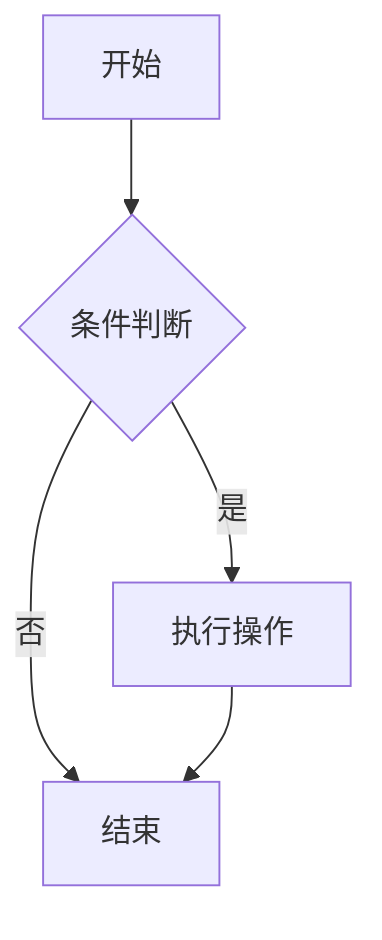
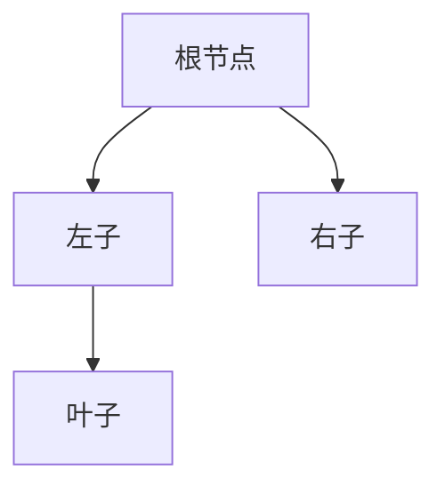
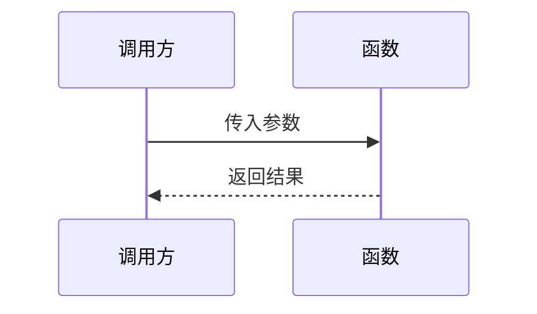
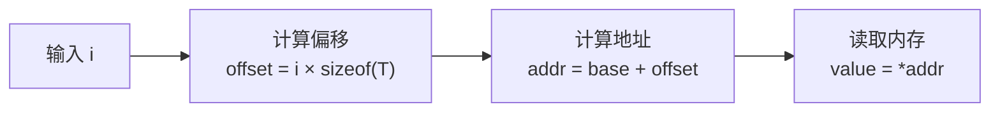
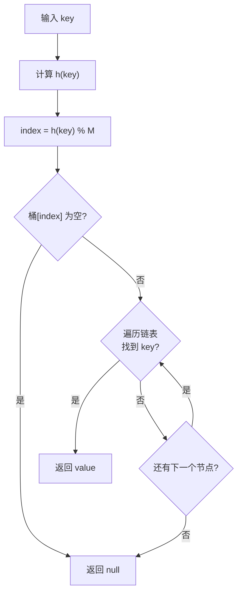
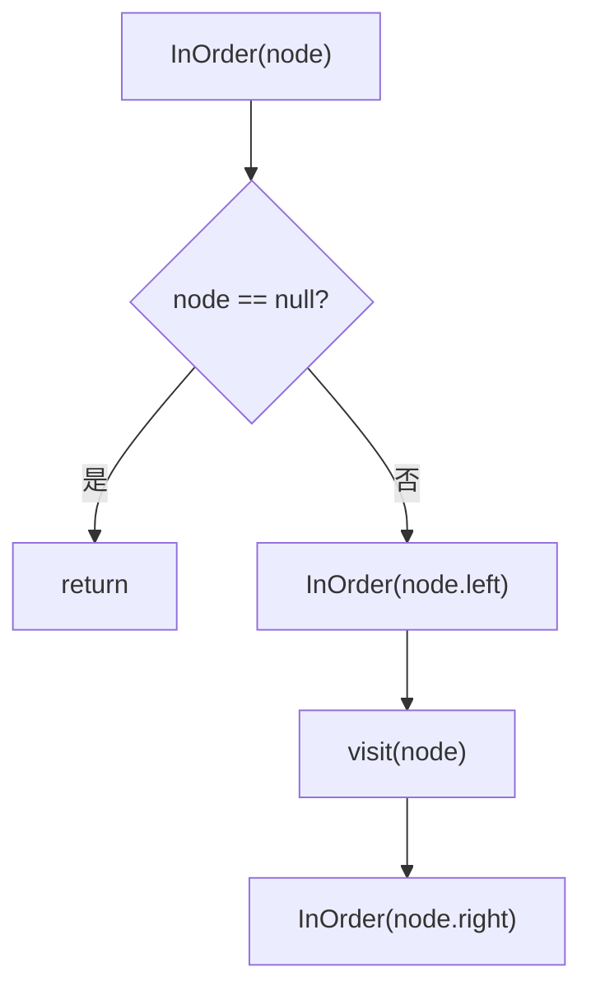

## 数据结构的三种表达方式

建议先阅读: [[0 域本知识|前置知识]]

---

## 为什么需要多种表达

同一个数据结构可以用三种"语言"来描述，每种语言各有侧重：

| 表达方式 | 优势 | 劣势 | 典型用途 |
|---------|------|------|---------|
| 自然语言（文字） | 精确定义，可描述细节 | 冗长，易产生歧义 | 教科书定义、工程文档、面试口述 |
| 数学公式 | 简洁严谨，便于推导分析 | 抽象，需要数学素养 | 复杂度分析、算法正确性证明 |
| 流程图/图示 | 直观，一眼看懂结构和流程 | 难以表达精确数值关系 | 内存布局、算法流程、架构设计 |

学数据结构时，**三种表达要同时掌握**。读教科书是文字，看论文是公式，画架构图是流程图——三者之间要能自由切换。

---

## 表达方式一：自然语言

### 定义式表达

用集合论和操作语义精确定义一个数据结构。例如栈的定义：

> **栈（Stack）** 是一个二元组 $(S, \text{op})$，其中 $S$ 是元素集合，$\text{op}$ 是操作集，包含：
> - $\text{push}(S, x)$：将元素 $x$ 压入栈顶
> - $\text{pop}(S)$：移除并返回栈顶元素
> - $\text{top}(S)$：返回栈顶元素但不移除
> - $\text{empty}(S)$：判断栈是否为空
>
> 栈满足 **后进先出（LIFO）** 性质：最后压入的元素最先被弹出。

这种定义方式的好处是**无歧义**——任何人读到这段文字，对栈的理解完全一致。

### 伪代码表达

伪代码是介于自然语言和具体代码之间的半形式化描述，重点在逻辑而非语法：

```
function binary_search(arr, target):
    lo ← 0, hi ← length(arr) - 1
    while lo ≤ hi:
        mid ← (lo + hi) / 2
        if arr[mid] == target:
            return mid
        else if arr[mid] < target:
            lo ← mid + 1
        else:
            hi ← mid - 1
    return -1
```

伪代码与具体语言无关，C 程序员和 Python 程序员都能读懂。面试时手写伪代码是表达思路的标准方式。

### 什么时候用文字

- **写文档**：给别人（或未来的自己）解释一个数据结构是什么、为什么这样设计
- **面试口述**：先用文字讲清楚思路，再写代码
- **论文/教材**：正式定义 + 直觉解释

---

## 表达方式二：数学公式

### 复杂度公式

描述算法效率的核心工具：

$$
T(n) = \begin{cases} O(1) & \text{随机访问} \\ O(n) & \text{顺序查找} \\ O(\log n) & \text{二分查找} \end{cases}
$$

### 递推关系

描述分治、递归算法的时间复杂度：

$$
T(n) = 2T\left(\frac{n}{2}\right) + O(n)
$$

这个递推式的解是 $T(n) = O(n \log n)$——归并排序的时间复杂度。

### 性质公式

数据结构的核心性质往往用公式表达：

$$
\text{addr}(i) = \text{base} + i \times \text{sizeof}(T) \quad \text{（数组寻址）}
$$

$$
h(k) = k \bmod M \quad \text{（哈希函数）}
$$

$$
\alpha = \frac{n}{M} \quad \text{（装载因子）}
$$

### LaTeX 常用语法速查

| 语法 | 渲染效果 | 用途 |
|------|---------|------|
| `$x_i$` | $x_i$ | 下标 |
| `$x^2$` | $x^2$ | 上标 |
| `$\sum_{i=0}^{n} a_i$` | $\sum_{i=0}^{n} a_i$ | 求和 |
| `$\prod_{i=1}^{n} i$` | $\prod_{i=1}^{n} i$ | 求积 |
| `$\lfloor x \rfloor$` | $\lfloor x \rfloor$ | 下取整 |
| `$\lceil x \rceil$` | $\lceil x \rceil$ | 上取整 |
| `$\log_2 n$` | $\log_2 n$ | 对数 |
| `$O(n \log n)$` | $O(n \log n)$ | 复杂度 |
| `$\frac{a}{b}$` | $\frac{a}{b}$ | 分式 |
| `$\sqrt{n}$` | $\sqrt{n}$ | 平方根 |
| `$\in$` | $\in$ | 属于 |
| `$\subset$` | $\subset$ | 子集 |
| `$\cup$` | $\cup$ | 并集 |
| `$\cap$` | $\cap$ | 交集 |
| `$\forall$` | $\forall$ | 任意 |
| `$\exists$` | $\exists$ | 存在 |

### 什么时候用公式

- **复杂度分析**：用 $O()$、$\Omega()$、$\Theta()$ 标记法
- **正确性证明**：数学归纳法证明递归算法
- **性质推导**：证明某个操作的均摊复杂度
- **论文/学术**：严谨的算法分析

---

## 表达方式三：流程图与图示

### Mermaid flowchart 基础

Mermaid 是 Markdown 中嵌入流程图的标准语法，Obsidian 原生支持。

````markdown

````

常用节点形状：

| 语法 | 形状 | 用途 |
|------|------|------|
| `["文字"]` | 矩形 | 普通步骤 |
| `{"文字"}` | 菱形 | 判断/条件 |
| `("文字")` | 圆角矩形 | 开始/结束 |
| `[文字]` | 简写矩形 | 普通步骤 |
| `{文字}` | 简写菱形 | 判断 |

常用箭头：

| 语法 | 含义 |
|------|------|
| `-->` | 普通流程 |
| `-->|标注|` | 带标注的流程 |
| `---` | 无箭头连接 |
| `-- 文字 ---` | 带标注的无箭头 |

### Mermaid graph 基础

用于展示数据结构的逻辑关系（树、图、链表等）：

````markdown

````

| 语法 | 方向 |
|------|------|
| `graph TD` / `graph BT` | 从上到下 |
| `graph LR` | 从左到右 |
| `graph RL` | 从右到左 |
| `graph TB` | 从上到下 |

### Mermaid sequenceDiagram 基础

用于展示多个对象之间的交互时序：

````markdown

````

### 数据结构常用图示类型

| 图示类型 | 适用场景 | Mermaid 语法 |
|---------|---------|-------------|
| 内存布局图 | 数组、链表的物理存储 | `graph LR` + 地址标注 |
| 树形结构图 | 二叉树、B树、字典树 | `graph TD` |
| 图的邻接关系 | 有向图、无向图 | `graph TD/LR` + 双向箭头 |
| 流程图 | 算法步骤、操作流程 | `flowchart TD` |
| 时序图 | 多方交互（如COW字符串） | `sequenceDiagram` |

### 什么时候用图示

- **内存布局**：展示数据在内存中怎么摆放（数组连续 vs 链表散列）
- **算法流程**：展示循环、判断、递归的执行路径
- **结构关系**：展示节点之间的指针/引用关系
- **对比展示**：两种方案的结构对比（如行优先 vs 列优先）

---

## 三种表达的对照示例

### 示例 1：数组寻址

**文字描述**：

> 数组在内存中占据一段连续地址空间。第 i 个元素的地址等于首地址加上 i 乘以元素大小。CPU 通过一次乘法和加法即可算出任意元素的地址，因此数组支持 O(1) 随机访问。

**数学公式**：

$$
\text{addr}(i) = \text{base} + i \times \text{sizeof}(T)
$$

**流程图**：



### 示例 2：哈希表查找

**文字描述**：

> 哈希表通过哈希函数将键映射到数组索引。先计算键的哈希值，再对桶数组大小取模，得到桶下标。如果该桶有多个元素（冲突），则遍历链表逐个比较键值。

**数学公式**：

$$
\text{index} = h(k) \bmod M
$$

$$
\text{查找时间} = \begin{cases} O(1) & \text{无冲突} \\ O(\alpha) & \text{链地址法（}\alpha\text{为装载因子）} \end{cases}
$$

**流程图**：



### 示例 3：二叉树中序遍历

**文字描述**：

> 中序遍历的规则是：先递归遍历左子树，再访问当前节点，最后递归遍历右子树。对于二叉搜索树，中序遍历的结果恰好是升序序列。

**数学公式（递推定义）**：

$$
\text{InOrder}(node) = \begin{cases} \text{InOrder}(node.\text{left}),\ \text{visit}(node),\ \text{InOrder}(node.\text{right}) & \text{if } node \neq \text{null} \\ \text{return} & \text{otherwise} \end{cases}
$$

**流程图**：



---

## 练习

1. **文字 → 公式**：用数学公式表达"栈的 push 操作将元素 x 放到栈顶，栈的大小加 1"
2. **公式 → 流程图**：将数组寻址公式 $\text{addr}(i) = \text{base} + i \times \text{sizeof}(T)$ 画成流程图
3. **流程图 → 代码**：将哈希表查找的流程图翻译为 C 语言代码
4. **代码 → 文字**：将以下代码用自然语言描述其功能：

```c
int fib(int n) {
    if (n <= 1) return n;
    return fib(n-1) + fib(n-2);
}
```

5. **综合**：选择一个你熟悉的数据结构（如队列），分别用文字、公式、流程图三种方式描述它的入队操作
