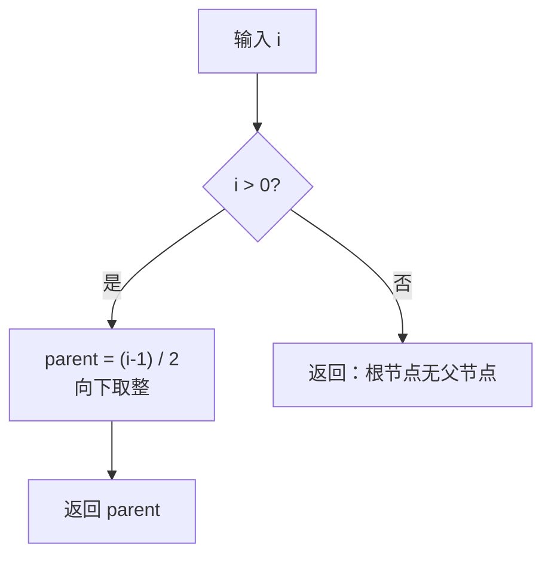
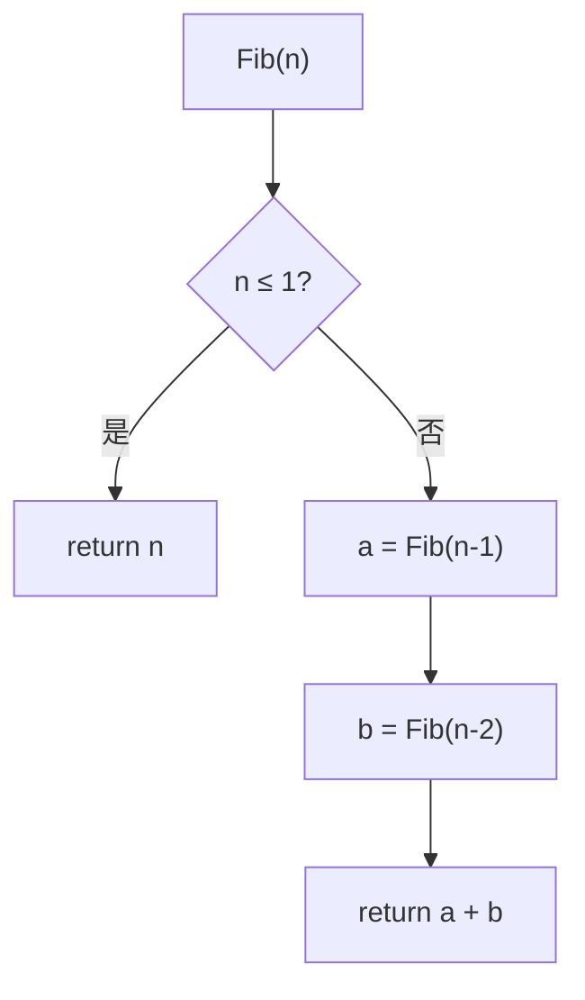
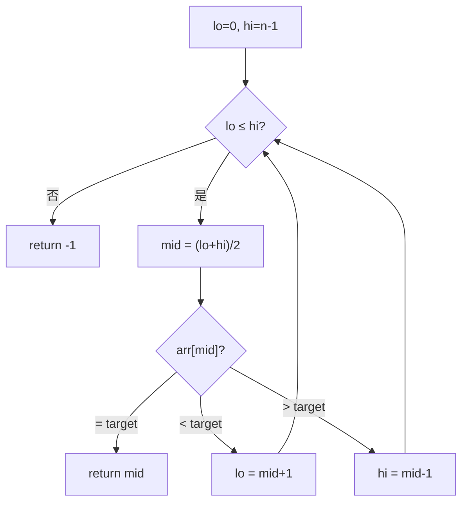
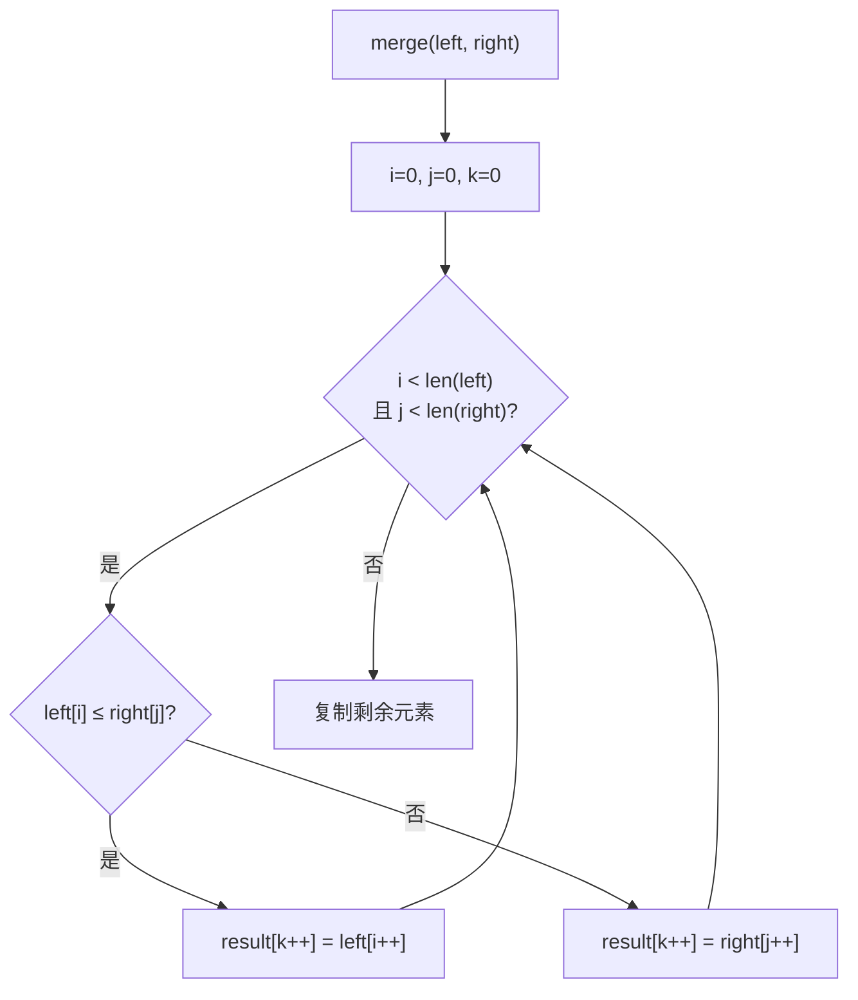

## 表达方式之间的转化

建议先阅读: [[0x_数据结构表达方式_Representation|表达方式]], [[0 域本知识|前置知识]]

---

## 转化总览

数据结构有四种表达方式：**自然语言、数学公式、流程图、代码**。学习数据结构的核心能力之一，就是在这四种表达之间自由转化。

````mermaid
flowchart LR
    A["自然语言\n文字描述"] <-->|"提炼/展开"| B["数学公式\n精确表达"]
    B <-->|"可视化/实例化"| C["流程图\n直观展示"]
    C <-->|"实现"| D["代码\n具体执行"]
    A <-->|"图解/简化"| C
    A <-->|"伪代码化"| D
    B <-->|"翻译为语法"| D
````

### 六种转化方向

| 转化方向 | 核心动作 | 典型场景 |
|---------|---------|---------|
| 文字 → 公式 | 提炼关键变量和关系，去除自然语言的冗余 | 从教科书定义推导出复杂度公式 |
| 公式 → 文字 | 展开符号含义，用通俗语言解释 | 论文公式翻译给非数学背景的人 |
| 公式 → 流程图 | 将数学分支/递推映射为判断节点和流程 | 将递推关系画成算法流程 |
| 流程图 → 公式 | 提取流程中的循环/递推模式，抽象为公式 | 从流程图推导时间复杂度 |
| 公式 → 代码 | 将数学运算翻译为编程语言的语法 | 将算法论文实现为可运行程序 |
| 代码 → 公式 | 提炼代码的循环/递推结构，抽象为数学表达 | 从代码反推复杂度分析 |

---

## 转化一：文字 → 公式

**核心技能**：从自然语言描述中提取变量、关系和约束，写成数学表达。

### 示例：从文字推导复杂度

**文字**：

> 快速排序每次选取一个 pivot，将数组分为两部分，然后递归处理两部分。平均情况下，每次 partition 将数组近似均分。

**提取关键信息**：
- "分为两部分" → 两个子问题
- "近似均分" → 每个子问题规模为 $n/2$
- "递归处理" → 递推关系

**公式**：

$$
T(n) = 2T\left(\frac{n}{2}\right) + O(n)
$$

### 示例：从文字推导性质

**文字**：

> 哈希表的查找过程是：先算哈希值确定桶位置，如果桶里有多个元素就逐个比较。假设哈希函数均匀分布，平均每个桶有 $\alpha = n/M$ 个元素。

**提取关键信息**：
- "哈希值确定桶位置" → $h(k) \bmod M$
- "逐个比较" → 遍历链表
- "均匀分布" → 期望比较次数为 $\alpha/2$

**公式**：

$$
\text{期望比较次数} = 1 + \frac{\alpha}{2} = 1 + \frac{n}{2M}
$$

---

## 转化二：公式 → 文字

**核心技能**：将数学符号展开为通俗语言，让没有数学背景的人也能理解。

### 示例：解释复杂度公式

**公式**：

$$
T(n) = O(n \log n)
$$

**文字**：

> 这个算法的时间复杂度是 $O(n \log n)$。意思是：当数据量为 $n$ 时，操作次数大约是 $n$ 乘以 $\log_2 n$。比如 $n = 100$ 万时，$\log_2 n \approx 20$，所以大约需要 2000 万次操作。这个速度比 $O(n^2)$ 快得多——$O(n^2)$ 需要 1 万亿次。

### 示例：解释递推公式

**公式**：

$$
T(n) = 2T(n/2) + n, \quad T(1) = 1
$$

**文字**：

> 这个递推式描述的是归并排序的时间复杂度。它的意思是：处理 $n$ 个数据时，先把它们分成两半（产生两个规模为 $n/2$ 的子问题），然后再花 $n$ 时间把两半合并起来。每一层的总工作量都是 $n$，一共有 $\log_2 n$ 层，所以总时间是 $n \log n$。

---

## 转化三：公式 → 流程图

**核心技能**：将数学中的分支、递推、循环映射为流程图的判断节点和流程。

### 示例：分段函数 → 流程图

**公式**：

$$
\text{parent}(i) = \begin{cases} \lfloor (i-1)/2 \rfloor & \text{if } i > 0 \\ \text{不存在} & \text{if } i = 0 \end{cases}
$$

**流程图**：



### 示例：递推公式 → 流程图

**公式**（斐波那契数列）：

$$
F(n) = \begin{cases} n & \text{if } n \leq 1 \\ F(n-1) + F(n-2) & \text{if } n > 1 \end{cases}
$$

**流程图**：



### 关键映射规则

| 数学概念 | 流程图元素 |
|---------|-----------|
| 分段函数 | 菱形判断节点 + 分支 |
| 递推 / 递归 | 带回边的流程 or 自调用 |
| 循环 $\sum$ / $\prod$ | 循环结构 + 累加器 |
| 条件约束 | 菱形判断 |

---

## 转化四：流程图 → 公式

**核心技能**：从流程图中识别循环、递推模式，抽象为数学表达。

### 示例：从循环流程图推导复杂度

**流程图**（二分查找）：



**提取模式**：
- 循环条件 `lo ≤ hi`，每次 `lo` 或 `hi` 移动到中点 → 每次数据量减半
- 循环次数：$n \to n/2 \to n/4 \to \cdots \to 1$，共 $\log_2 n$ 次

**公式**：

$$
T(n) = T(n/2) + O(1) = O(\log n)
$$

### 示例：从流程图提取递推

**流程图**（归并排序 merge 步骤）：



**公式**：

$$
\text{merge 的时间} = O(\text{left 长度} + \text{right 长度}) = O(n)
$$

---

## 转化五：公式 → 代码

**核心技能**：将数学运算翻译为编程语言的具体语法。这是论文/教科书到工程实现的关键桥梁。

### 核心映射表

| 数学概念 | C | C++ | Rust | Python | Bash | Java |
|---------|---|-----|------|--------|------|------|
| 求和 $\sum_{i=0}^{n-1} a_i$ | `for`循环累加 | 同C / `std::accumulate` | `.iter().sum()` | `sum(a)` | `for` + `(( ))` | `Arrays.stream(a).sum()` |
| 求积 $\prod_{i=1}^{n} i$ | `for`循环累乘 | 同C | `.fold(1,\|a,b\|a*b)` | `math.prod()` 或 `functools.reduce` | `for` + `(( *= ))` | Stream reduce |
| 递推 $a_n = f(a_{n-1})$ | `for`循环 | 同C | `for`循环 | `for`循环 | `for`循环 | `for`循环 |
| 递归 $T(n) = T(n/2)+c$ | 递归函数 | 同C | 递归函数 | 递归函数 | 递归(不推荐) | 递归函数 |
| 下取整 $\lfloor x \rfloor$ | `(int)x` | `std::floor` 或整数除法 | `as usize` / `.floor()` | `int(x)` 或 `//` 整除 | `$(( ))` 整除 | `(int)x` |
| 取模 $a \bmod b$ | `a % b` | 同C | `a % b` | `a % b` | `$(( a % b ))` | `a % b` |
| 最大值 $\max(a,b)` | `a>b?a:b` | `std::max(a,b)` | `a.max(b)` / `a.max(b)` | `max(a,b)` | `[[ $a -gt $b ]]` | `Math.max(a,b)` |
| 条件函数 | `if-else` | 同C | `match` / `if-else` | `if-else` / 三元 | `if-then-else-fi` | `if-else` / `switch` |

### 代表公式一：求和 $\sum_{i=0}^{n-1} a_i$

**C**：
```c
int sum = 0;
for (int i = 0; i < n; i++) {
    sum += a[i];
}
```

**C++**：
```cpp
// 手写
int sum = 0;
for (int i = 0; i < n; i++) {
    sum += a[i];
}
// 标准库
int sum = std::accumulate(a.begin(), a.end(), 0);
```

**Rust**：
```rust
// 手写
let mut sum = 0;
for i in 0..n {
    sum += a[i];
}
// 迭代器
let sum: i32 = a.iter().sum();
```

**Python**：
```python
# 手写
s = 0
for x in a:
    s += x
# 内置
s = sum(a)
```

**Bash**：
```bash
sum=0
for x in "${a[@]}"; do
    ((sum += x))
done
echo $sum
```

**Java**：
```java
// 手写
int sum = 0;
for (int i = 0; i < n; i++) {
    sum += a[i];
}
// Stream
int sum = Arrays.stream(a).sum();
```

### 代表公式二：递推 $a_n = a_{n-1} + n,\ a_0 = 1$

**C**：
```c
int a = 1; // a_0
for (int i = 1; i <= n; i++) {
    a = a + i;
}
// 循环结束后 a = a_n
```

**C++**：
```cpp
int a = 1;
for (int i = 1; i <= n; i++) {
    a += i;
}
```

**Rust**：
```rust
let mut a = 1;
for i in 1..=n {
    a += i;
}
```

**Python**：
```python
a = 1
for i in range(1, n + 1):
    a += i
```

**Bash**：
```bash
a=1
for ((i=1; i<=n; i++)); do
    ((a += i))
done
```

**Java**：
```java
int a = 1;
for (int i = 1; i <= n; i++) {
    a += i;
}
```

### 代表公式三：地址计算 $\text{addr}(i) = \text{base} + i \times \text{sizeof}(T)$

**C**：
```c
// 指针算术
int *arr = (int *)base;
int val = arr[i]; // 编译器生成: [base + i*4]

// 手动计算地址
void *addr = (char *)base + i * sizeof(int);
int val = *(int *)addr;
```

**C++**：
```cpp
int *arr = reinterpret_cast<int*>(base);
int val = arr[i];
// 或 vector
std::vector<int> v(/* ... */);
int val = v[i];
```

**Rust**：
```rust
// 切片
let slice: &[i32] = unsafe { std::slice::from_raw_parts(base as *const i32, n) };
let val = slice[i];
// 或安全方式
let val = slice.get(i); // Option<&i32>
```

**Python**：
```python
# Python 的 list 天然支持索引
arr = [10, 20, 30, 40, 50]
val = arr[i]
# 底层是 C 的 PyListObject，索引同样是 base + i*指针大小
```

**Bash**：
```bash
arr=(10 20 30 40 50)
val=${arr[$i]}
```

**Java**：
```java
int[] arr = {10, 20, 30, 40, 50};
int val = arr[i]; // JVM 内部: base + i*4
```

### 代表公式四：哈希函数 $h(k) = k \bmod M$

**C**：
```c
int hash(int key, int M) {
    return key % M;
}
```

**C++**：
```cpp
int hash(int key, int M) {
    return key % M;
}
// C++ 标准库用法
std::unordered_map<int, int> map; // 内部自动处理哈希
```

**Rust**：
```rust
fn hash(key: i32, m: usize) -> usize {
    (key % m as i32) as usize
}
// Rust 标准库用法
use std::collections::HashMap;
let map: HashMap<i32, i32> = HashMap::new();
```

**Python**：
```python
def hash(key, M):
    return key % M
# Python dict 天然支持
d = {}
d[key] = value  # 内部自动哈希
```

**Bash**：
```bash
hash() {
    local key=$1 M=$2
    echo $(( key % M ))
}
```

**Java**：
```java
int hash(int key, int M) {
    return key % M;
}
// Java HashMap
Map<Integer, Integer> map = new HashMap<>();
map.put(key, value);
```

---

## 转化六：代码 → 公式

**核心技能**：从代码中提炼出循环、递推结构，用数学语言表达其复杂度和行为。

### 示例：从循环代码推导求和公式

**代码**：
```c
int sum = 0;
for (int i = 0; i < n; i++) {
    sum += a[i];
}
```

**识别模式**：
- 一个变量 `sum` 累加
- 循环变量 `i` 从 0 到 n-1
- 每次加 `a[i]`

**公式**：

$$
\text{sum} = \sum_{i=0}^{n-1} a[i]
$$

$$
T(n) = O(n)
$$

### 示例：从递归代码推导递推式

**代码**：
```c
int fib(int n) {
    if (n <= 1) return n;
    return fib(n-1) + fib(n-2);
}
```

**识别模式**：
- 基础情况：$n \leq 1$ 时返回 $n$
- 递归调用：两次，规模分别为 $n-1$ 和 $n-2$
- 合并操作：加法 $O(1)$

**公式**：

$$
T(n) = T(n-1) + T(n-2) + O(1)
$$

$$
T(n) = O(2^n) \quad \text{（指数级，无记忆化）}
$$

### 示例：从嵌套循环推导平方复杂度

**代码**：
```c
for (int i = 0; i < n; i++) {
    for (int j = i + 1; j < n; j++) {
        if (arr[i] + arr[j] == target)
            return true;
    }
}
```

**识别模式**：
- 外层循环 $i$: $0$ 到 $n-1$
- 内层循环 $j$: $i+1$ 到 $n-1$
- 每次操作 $O(1)$

**公式**：

$$
T(n) = \sum_{i=0}^{n-1} \sum_{j=i+1}^{n-1} 1 = \frac{n(n-1)}{2} = O(n^2)
$$

### 代码 → 公式的通用步骤

1. **识别循环**：找到 `for`、`while`、递归调用
2. **确定范围**：循环变量的起止值
3. **写出求和**：将循环转化为 $\sum$ 符号
4. **化简**：用数学方法化简求和式
5. **得到复杂度**：$T(n) = \cdots = O(\cdots)$

---

## 反向练习：从图片推导数学公式

### 练习 1：从内存布局图推导寻址公式

给定以下数组内存布局：

```
地址:   0x1000  0x1004  0x1008  0x100C  0x1010
值:     [10]    [20]    [30]    [40]    [50]
索引:     0       1       2       3       4
```

问：如何从图中推导出 $\text{addr}(i) = \text{base} + i \times 4$？

**分析**：
- base = 0x1000
- arr[0] = 0x1000, arr[1] = 0x1004, arr[2] = 0x1008
- 每个元素占 4 字节（int），地址差为 4
- $\text{addr}(i) - \text{base} = 4i$，因此 $\text{addr}(i) = \text{base} + 4i$

### 练习 2：从流程图推导复杂度公式

给定二分查找的流程图（见"转化四"一节），请：

1. 写出 $T(n)$ 的递推式
2. 求解该递推式得到 $T(n) = O(\cdots)$

### 练习 3：从代码画流程图并写公式

将以下 C 代码转化为流程图和数学公式：

```c
void reverse(int *arr, int n) {
    for (int i = 0, j = n - 1; i < j; i++, j--) {
        int tmp = arr[i];
        arr[i] = arr[j];
        arr[j] = tmp;
    }
}
```

---

## 综合练习

### 练习 A：队列的四重描述

选择"循环队列的入队操作"，分别用四种方式描述：

1. **文字**：用一段话解释循环队列如何入队
2. **公式**：写出 `rear` 指针的更新公式
3. **流程图**：画出入队操作的流程图
4. **代码**：用 C 和 Python 分别实现

### 练习 B：从论文到代码

读以下论文中的公式，用六种语言实现：

$$
h(k) = \lfloor M \cdot (k \cdot A \bmod 1) \rfloor, \quad A = \frac{\sqrt{5}-1}{2}
$$

其中 $M$ 是桶数组大小，$k$ 是键。

### 练习 C：从代码反推设计

以下代码实现了一个 LRU 缓存的核心逻辑，请用文字解释其设计思路，用公式描述其时间复杂度，并画出其数据结构的内存布局图：

```c
typedef struct Node {
    int key, value;
    struct Node *prev, *next;
} Node;

typedef struct {
    int capacity, size;
    Node *head, *tail;
    // 哈希表: key -> Node*
} LRUCache;
```
