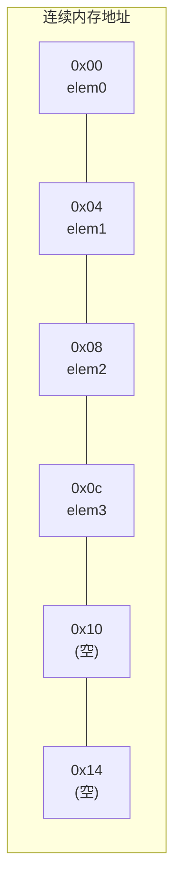
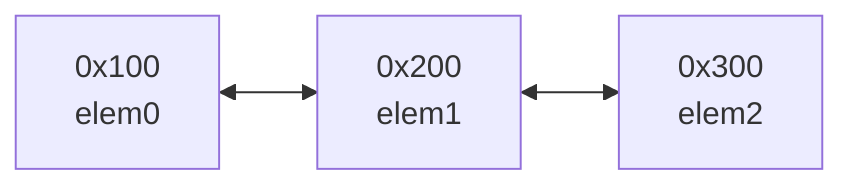

---
数据结构教程 — 容器 (Container)
---

## 章节概述

容器(Container)是数据结构中最核心的组成部分之一。容器是用于存储和组织
数据集合的数据结构，它封装了数据存储和访问的管理细节，让开发者可以专注于业务逻辑。

标准库提供了多种容器，每种容器都基于特定的底层数据结构，适用于不同的使用场景。
本章将从最基本的容器概念讲起，深入底层数据结构原理，全面覆盖所有标准容器的实现思路，
最后通过实例和习题巩固所学知识。

> **底层实现参考**：如果需要深入理解本章数据结构的底层实现（纯C手写、内存布局、指针操作），请参阅 [[../../c语言教程/3数据结构/01_动态数组|C语言教程: 动态数组]]。C教程侧重手动实现与内存本质，本教程侧重算法设计与抽象思维，两者互补。

---
### 第一节: 基础语法 + 计算机底层原理
---

1.1 容器的基本概念
-----------------------

容器是"存放数据的对象"。容器的核心特征包括：
- 管理一组元素（Element）的生命周期
- 提供插入、删除、访问元素的操作接口
- 通过迭代器（Iterator）提供统一的元素遍历方式
- 具有特定的时间复杂度保证

最基础的容器使用示例——动态数组:

```pseudocode
v ← CREATE 动态数组 OF INTEGER

PUSH v, 10
PUSH v, 20
PUSH v, 30

输出 "第一个元素: ", v[0]
输出 "元素个数: ", SIZE(v)

FOR EACH num IN v:
    输出 num, " "
END FOR

it ← BEGIN(v)
WHILE it ≠ END(v):
    输出 *it, " "
    it ← NEXT(it)
END WHILE
```

1.2 容器的底层原理：连续存储 vs 节点存储
---------------------------------------------

容器根据底层存储方式分为两大类：

(1) 连续存储容器（Contiguous Containers）
- 动态数组, 固定数组, 双端队列, 字符串
- 元素在内存中连续排列
- 通过指针偏移直接访问（O(1)随机访问）
- 中间插入/删除需要移动大量元素（O(n)）

(2) 节点存储容器（Node-based Containers）
- 双向链表, 单向链表, 映射表, 集合, 哈希表等
- 每个元素独立分配在堆上，节点间通过指针连接
- 不支持随机访问（或仅支持有限的随机访问）
- 中间插入/删除仅需修改指针（O(1)或O(log n)）

内存布局对比示意：

连续存储 (动态数组):


节点存储 (链表):


1.3 迭代器原理
------------------

迭代器是容器与算法之间的桥梁。它抽象了"遍历元素"这一概念，使得算法可以不关心
底层容器的具体类型。

迭代器本质上是一个"智能指针"，支持类似指针的操作：
- 解引用 (*) : 获取当前指向的元素
- 自增 (++) : 前移到下一个元素
- 自减 (--) : 回退到前一个元素（仅双向迭代器）
- 下标 ([]) : 随机访问（仅随机访问迭代器）
- 比较 (== / !=) : 比较两个迭代器是否相等

```pseudocode
vec ← CREATE 动态数组 FROM {10, 20, 30, 40, 50}
vit ← BEGIN(vec)
输出 "vec[0] = ", *vit
输出 "vec[2] = ", *(vit + 2)      // 随机访问迭代器支持偏移
输出 "vec[3] = ", vit[3]          // 随机访问迭代器支持下标的方括号

lst ← CREATE 双向链表 FROM {10, 20, 30, 40, 50}
lit ← BEGIN(lst)
输出 "list first = ", *lit
// 输出 *(lit + 2)              // 错误！链表不支持随机访问
ADVANCE(lit, 2)                  // 通过逐跳前进移动
输出 "list third = ", *lit
```

1.4 容器的分类体系
---------------------

标准库容器按组织方式分为三大类：

序列容器（Sequence Containers）：
- 固定数组       : 固定大小数组，连续存储
- 动态数组       : 动态数组，自动扩容，连续存储
- 双端队列       : 双端队列，分段连续存储
- 单向链表       : 单向链表，节点存储
- 双向链表       : 双向链表，节点存储
- 字符串         : 字符序列容器

关联容器（Associative Containers）（有序，基于红黑树）：
- 集合           : 集合，元素唯一且有序
- 多重集合       : 多重集合，元素可重复且有序
- 映射表         : 映射表，key唯一且有序
- 多重映射表     : 多重映射表，key可重复且有序

无序关联容器（Unordered Associative Containers）（基于哈希表）：
- 无序集合        : 无序集合，元素唯一
- 无序多重集合    : 无序多重集合
- 无序映射表      : 无序映射表
- 无序多重映射表  : 无序多重映射表

容器适配器（Container Adapters）：（基于底层容器封装）
- 栈           : 栈（LIFO），默认基于双端队列
- 队列         : 队列（FIFO），默认基于双端队列
- 优先队列     : 优先队列，默认基于动态数组

1.5 计算机底层原理：内存分配与增长策略
------------------------------------------

以最常用的动态数组为例，底层原理揭示了"动态数组"的实现：

```pseudocode
vec ← CREATE 动态数组 OF INTEGER

输出 "初始: size=", SIZE(vec), " capacity=", CAPACITY(vec)

FOR i ← 0 TO 19:
    PUSH vec, i
    输出 "push_back(", i, "): size=", SIZE(vec),
          " capacity=", CAPACITY(vec)
END FOR
```

动态数组内部维护三个指针：
- _start : 指向分配内存的起始位置
- _finish: 指向已使用元素的末尾（即size位置）
- _end_of_storage: 指向分配内存的末尾（即capacity位置）

扩容过程：
1. push_back时检查_finish == _end_of_storage?
2. 如果容量已满，分配新内存（通常是当前容量的1.5~2倍）
3. 将旧元素移动/拷贝到新内存
4. 释放旧内存
5. 更新指针

GCC的动态数组扩容倍数为2，而Visual Studio的动态数组扩容倍数为1.5。扩容是O(n)操作，
但均摊后push_back的摊还时间复杂度为O(1)。

```pseudocode
// 手动实现简化版的动态数组扩容逻辑（概念演示）

CLASS SimpleVector:
    PRIVATE _data: POINTER TO ARRAY
    PRIVATE _finish: INTEGER
    PRIVATE _end_of_storage: INTEGER

    PRIVATE FUNCTION reallocate():
        old_size ← _finish
        new_capacity ← IF old_size == 0 THEN 1 ELSE old_size * 2

        new_start ← ALLOCATE ARRAY OF new_capacity ELEMENTS

        FOR i ← 0 TO old_size - 1:
            new_start[i] ← _data[i]
        END FOR

        DELETE _data

        _data ← new_start
        _finish ← old_size
        _end_of_storage ← new_capacity

        输出 "  扩容: ", old_size, " -> ", new_capacity
    END FUNCTION

    PUBLIC FUNCTION CONSTRUCTOR():
        _data ← NULL
        _finish ← 0
        _end_of_storage ← 0
    END FUNCTION

    PUBLIC FUNCTION DESTRUCTOR():
        DELETE _data
    END FUNCTION

    PUBLIC FUNCTION size():
        RETURN _finish
    END FUNCTION

    PUBLIC FUNCTION capacity():
        RETURN _end_of_storage
    END FUNCTION

    PUBLIC FUNCTION push_back(value):
        IF _finish == _end_of_storage:
            CALL reallocate()
        END IF
        _data[_finish] ← value
        _finish ← _finish + 1
    END FUNCTION

    PUBLIC FUNCTION at(index):
        RETURN _data[index]
    END FUNCTION
END CLASS

// 使用示例
vec ← NEW SimpleVector

FOR i ← 0 TO 7:
    CALL vec.push_back(i)
    输出 "添加 ", i, ": size=", vec.size(), " capacity=", vec.capacity()
END FOR

输出 "所有元素: "
FOR i ← 0 TO vec.size() - 1:
    输出 vec.at(i), " "
END FOR
```

---
**实现练习**: 用 C 或 C++ 自行实现上述结构。完成后与 AI 对话检查正确性。
- C 语言底层参考: [[../../c语言教程/3数据结构/01_动态数组]]
- C++ STL 参考: [[../../cpp教程/容器库/序列容器/vector.md]]
---


---
### 第二节: 实现思路
---

2.1 动态数组 —— 实现思路
-------------------------------

最通用的序列容器。连续内存，随机访问O(1)，尾部插入/删除O(1)均摊。

核心数据结构：三个指针管理堆上分配的连续内存块。

```pseudocode
STRUCT DynamicArray:
    data: POINTER TO ARRAY
    size: INTEGER
    capacity: INTEGER

// ========== 构造 ==========

FUNCTION dynamic_array_new():
    arr ← ALLOCATE DynamicArray
    arr.data ← NULL
    arr.size ← 0
    arr.capacity ← 0
    RETURN arr

FUNCTION dynamic_array_init(count, default_value):
    arr ← ALLOCATE DynamicArray
    arr.capacity ← count
    arr.size ← count
    arr.data ← ALLOCATE ARRAY OF count ELEMENTS
    FOR i ← 0 TO count - 1:
        arr.data[i] ← default_value
    RETURN arr

FUNCTION dynamic_array_from_list(values, n):
    arr ← ALLOCATE DynamicArray
    arr.capacity ← n
    arr.size ← n
    arr.data ← ALLOCATE ARRAY OF n ELEMENTS
    FOR i ← 0 TO n - 1:
        arr.data[i] ← values[i]
    RETURN arr

FUNCTION dynamic_array_copy(other):
    arr ← ALLOCATE DynamicArray
    arr.capacity ← other.size
    arr.size ← other.size
    arr.data ← ALLOCATE ARRAY OF other.size ELEMENTS
    FOR i ← 0 TO other.size - 1:
        arr.data[i] ← other.data[i]
    RETURN arr

// ========== 元素访问 ==========

FUNCTION dynamic_array_front(arr):
    RETURN arr.data[0]

FUNCTION dynamic_array_back(arr):
    RETURN arr.data[arr.size - 1]

FUNCTION dynamic_array_at(arr, index):
    IF index < 0 OR index >= arr.size:
        RAISE out_of_range_error
    RETURN arr.data[index]

// ========== 扩容 ==========

FUNCTION dynamic_array_reserve(arr, new_capacity):
    IF new_capacity > arr.capacity:
        new_data ← ALLOCATE ARRAY OF new_capacity ELEMENTS
        FOR i ← 0 TO arr.size - 1:
            new_data[i] ← arr.data[i]
        DELETE arr.data
        arr.data ← new_data
        arr.capacity ← new_capacity
    END IF

FUNCTION dynamic_array_shrink_to_fit(arr):
    IF arr.size < arr.capacity:
        new_data ← ALLOCATE ARRAY OF arr.size ELEMENTS
        FOR i ← 0 TO arr.size - 1:
            new_data[i] ← arr.data[i]
        DELETE arr.data
        arr.data ← new_data
        arr.capacity ← arr.size
    END IF

// ========== 添加与删除 ==========

FUNCTION dynamic_array_push_back(arr, value):
    IF arr.size == arr.capacity:
        new_cap ← IF arr.capacity == 0 THEN 1 ELSE arr.capacity * 2
        CALL dynamic_array_reserve(arr, new_cap)
    END IF
    arr.data[arr.size] ← value
    arr.size ← arr.size + 1

FUNCTION dynamic_array_emplace_back(arr, ...args):
    // 直接在数组末尾构造元素，避免临时对象拷贝
    IF arr.size == arr.capacity:
        new_cap ← IF arr.capacity == 0 THEN 1 ELSE arr.capacity * 2
        CALL dynamic_array_reserve(arr, new_cap)
    END IF
    arr.data[arr.size] ← CONSTRUCT_WITH(args...)
    arr.size ← arr.size + 1

FUNCTION dynamic_array_pop_back(arr):
    IF arr.size > 0:
        arr.size ← arr.size - 1
    END IF

FUNCTION dynamic_array_insert(arr, pos, value):
    IF pos < 0 OR pos > arr.size:
        RAISE out_of_range_error
    END IF
    IF arr.size == arr.capacity:
        new_cap ← IF arr.capacity == 0 THEN 1 ELSE arr.capacity * 2
        CALL dynamic_array_reserve(arr, new_cap)
    END IF
    FOR i ← arr.size DOWNTO pos + 1:
        arr.data[i] ← arr.data[i - 1]
    END FOR
    arr.data[pos] ← value
    arr.size ← arr.size + 1

FUNCTION dynamic_array_erase(arr, pos):
    IF pos < 0 OR pos >= arr.size:
        RAISE out_of_range_error
    END IF
    FOR i ← pos TO arr.size - 2:
        arr.data[i] ← arr.data[i + 1]
    END FOR
    arr.size ← arr.size - 1

FUNCTION dynamic_array_resize(arr, new_size, default_value):
    IF new_size > arr.capacity:
        CALL dynamic_array_reserve(arr, new_size)
    END IF
    IF new_size > arr.size:
        FOR i ← arr.size TO new_size - 1:
            arr.data[i] ← default_value
        END FOR
    END IF
    arr.size ← new_size

FUNCTION dynamic_array_clear(arr):
    arr.size ← 0

// ========== 容量查询 ==========

FUNCTION dynamic_array_is_empty(arr):
    RETURN arr.size == 0

// ========== 遍历 ==========

// 方式1: 下标遍历
FOR i ← 0 TO arr.size - 1:
    输出 arr.data[i], " "
END FOR

// 方式2: FOR-EACH 遍历
FOR EACH x IN arr:
    输出 x, " "
END FOR

// 方式3: 迭代器遍历
it ← BEGIN(arr)
WHILE it ≠ END(arr):
    输出 *it, " "
    it ← NEXT(it)
END WHILE

// ========== 算法配合 ==========

SORT(arr.data, 0, arr.size - 1)          // 排序
pos ← BINARY_SEARCH(arr.data, 0, arr.size - 1, target)  // 二分查找
REVERSE(arr.data, 0, arr.size - 1)       // 反转
```

---
**实现练习**: 用 C 或 C++ 自行实现上述结构。完成后与 AI 对话检查正确性。
- C 语言底层参考: [[../../c语言教程/3数据结构/01_动态数组]]
- C++ STL 参考: [[../../cpp教程/容器库/序列容器/vector.md]]
---

2.2 固定数组 —— 实现思路
----------------------------------

固定大小的数组封装，提供统一的容器接口但不支持动态增长。大小在编译时确定。

```pseudocode
STRUCT FixedArray[N]:
    data: ARRAY OF N ELEMENTS

// ========== 构造 ==========

FUNCTION fixed_array_from_list(values, n):
    // 要求 n == N
    arr ← ALLOCATE FixedArray
    FOR i ← 0 TO N - 1:
        arr.data[i] ← values[i]
    RETURN arr

FUNCTION fixed_array_default():
    arr ← ALLOCATE FixedArray
    FOR i ← 0 TO N - 1:
        arr.data[i] ← DEFAULT_VALUE
    RETURN arr

// ========== 访问 ==========

FUNCTION fixed_array_front(arr):
    RETURN arr.data[0]

FUNCTION fixed_array_back(arr):
    RETURN arr.data[N - 1]

FUNCTION fixed_array_at(arr, index):
    IF index < 0 OR index >= N:
        RAISE out_of_range_error
    RETURN arr.data[index]

FUNCTION fixed_array_raw_pointer(arr):
    RETURN ADDRESS_OF(arr.data[0])

// ========== 大小 ==========

FUNCTION fixed_array_size():
    RETURN N  // 编译期常量

// ========== 填充 ==========

FUNCTION fixed_array_fill(arr, value):
    FOR i ← 0 TO N - 1:
        arr.data[i] ← value
    END FOR
```

---
**实现练习**: 用 C 或 C++ 自行实现上述结构。完成后与 AI 对话检查正确性。
- C 语言底层参考: [[../../c语言教程/3数据结构/01_动态数组]]
- C++ STL 参考: [[../../cpp教程/容器库/序列容器/vector.md]]
---

2.3 双端队列 —— 实现思路
------------------------------

分段连续存储，支持两端快速插入/删除O(1)，随机访问O(1)。

内部由多个固定大小的缓冲区（block）组成，通过中控器（map数组）管理所有块的指针。

```pseudocode
CONST BLOCK_SIZE = 8

STRUCT Deque:
    blocks: POINTER TO ARRAY OF POINTER TO BLOCK   // 中控器（块指针数组）
    block_count: INTEGER                             // 中控器的块指针个数
    head_block: INTEGER                              // 头部所在的块索引
    head_offset: INTEGER                             // 头部在块内的偏移
    tail_block: INTEGER                              // 尾部所在的块索引
    tail_offset: INTEGER                             // 尾部在块内的偏移
    element_count: INTEGER

// ========== 构造 ==========

FUNCTION deque_new():
    dq ← ALLOCATE Deque
    dq.block_count ← 8
    dq.blocks ← ALLOCATE ARRAY OF dq.block_count POINTERS (初始化为 NULL)
    dq.head_block ← dq.block_count / 2
    dq.head_offset ← BLOCK_SIZE / 2
    dq.tail_block ← dq.head_block
    dq.tail_offset ← dq.head_offset
    dq.element_count ← 0
    // 分配初始块
    dq.blocks[dq.head_block] ← ALLOCATE ARRAY OF BLOCK_SIZE ELEMENTS
    RETURN dq

// ========== 两端操作 ==========

FUNCTION deque_push_front(dq, value):
    IF dq.head_offset == 0:
        // 需要在前方分配新块
        IF dq.head_block == 0:
            // 中控器满了，需要扩容中控器
            CALL deque_expand_map(dq)
        END IF
        dq.head_block ← dq.head_block - 1
        dq.blocks[dq.head_block] ← ALLOCATE ARRAY OF BLOCK_SIZE ELEMENTS
        dq.head_offset ← BLOCK_SIZE
    END IF
    dq.head_offset ← dq.head_offset - 1
    dq.blocks[dq.head_block][dq.head_offset] ← value
    dq.element_count ← dq.element_count + 1

FUNCTION deque_push_back(dq, value):
    IF dq.tail_offset == BLOCK_SIZE - 1:
        IF dq.tail_block == dq.block_count - 1:
            CALL deque_expand_map(dq)
        END IF
        dq.tail_block ← dq.tail_block + 1
        dq.blocks[dq.tail_block] ← ALLOCATE ARRAY OF BLOCK_SIZE ELEMENTS
        dq.tail_offset ← -1
    END IF
    dq.tail_offset ← dq.tail_offset + 1
    dq.blocks[dq.tail_block][dq.tail_offset] ← value
    dq.element_count ← dq.element_count + 1

FUNCTION deque_pop_front(dq):
    IF dq.element_count == 0:
        RETURN
    END IF
    IF dq.head_block == dq.tail_block AND dq.head_offset == dq.tail_offset:
        dq.element_count ← dq.element_count - 1
        RETURN
    END IF
    dq.head_offset ← dq.head_offset + 1
    IF dq.head_offset == BLOCK_SIZE:
        DELETE dq.blocks[dq.head_block]
        dq.blocks[dq.head_block] ← NULL
        dq.head_block ← dq.head_block + 1
        dq.head_offset ← 0
    END IF
    dq.element_count ← dq.element_count - 1

FUNCTION deque_pop_back(dq):
    IF dq.element_count == 0:
        RETURN
    END IF
    IF dq.head_block == dq.tail_block AND dq.head_offset == dq.tail_offset:
        dq.element_count ← dq.element_count - 1
        RETURN
    END IF
    dq.tail_offset ← dq.tail_offset - 1
    IF dq.tail_offset < 0:
        DELETE dq.blocks[dq.tail_block]
        dq.blocks[dq.tail_block] ← NULL
        dq.tail_block ← dq.tail_block - 1
        dq.tail_offset ← BLOCK_SIZE - 1
    END IF
    dq.element_count ← dq.element_count - 1

// ========== 随机访问 ==========

FUNCTION deque_at(dq, index):
    // 通过两级索引定位元素
    global_offset ← dq.head_offset + index
    block_index ← dq.head_block + global_offset / BLOCK_SIZE
    offset_in_block ← global_offset % BLOCK_SIZE
    RETURN dq.blocks[block_index][offset_in_block]

// ========== 中间插入 ==========

FUNCTION deque_insert(dq, pos, value):
    IF pos < dq.element_count / 2:
        // 靠近头部，移动前半部分
        CALL deque_push_front(dq, deque_at(dq, 0))
        FOR i ← 1 TO pos:
            deque_at(dq, i - 1) ← deque_at(dq, i + 1)
        END FOR
        deque_at(dq, pos - 1) ← value
    ELSE:
        // 靠近尾部，移动后半部分
        CALL deque_push_back(dq, deque_at(dq, dq.element_count - 1))
        FOR i ← dq.element_count - 2 DOWNTO pos:
            deque_at(dq, i + 1) ← deque_at(dq, i)
        END FOR
        deque_at(dq, pos) ← value
    END IF

// ========== 中控器扩容 ==========

FUNCTION deque_expand_map(dq):
    old_count ← dq.block_count
    new_count ← old_count * 2
    new_blocks ← ALLOCATE ARRAY OF new_count POINTERS (初始化为 NULL)
    offset ← (new_count - old_count) / 2
    FOR i ← 0 TO old_count - 1:
        new_blocks[offset + i] ← dq.blocks[i]
    END FOR
    dq.head_block ← dq.head_block + offset
    dq.tail_block ← dq.tail_block + offset
    DELETE dq.blocks
    dq.blocks ← new_blocks
    dq.block_count ← new_count
```

---
**实现练习**: 用 C 或 C++ 自行实现上述结构。完成后与 AI 对话检查正确性。
- C 语言底层参考: [[../../c语言教程/3数据结构/05_双端队列]]
- C++ STL 参考: [[../../cpp教程/容器库/序列容器/deque.md]]
---

2.4 双向链表 —— 实现思路
-------------------------------

底层是双向链表，每个节点包含前驱指针、后继指针和数据。插入/删除O(1)，
但不支持随机访问。

```pseudocode
STRUCT ListNode:
    prev: POINTER TO ListNode
    next: POINTER TO ListNode
    value: T

STRUCT LinkedList:
    head: POINTER TO ListNode     // 哨兵节点
    tail: POINTER TO ListNode     // 哨兵节点
    count: INTEGER

// ========== 构造 ==========

FUNCTION list_new():
    lst ← ALLOCATE LinkedList
    // 创建哨兵节点，形成空循环链表
    sentinel ← ALLOCATE ListNode
    sentinel.prev ← sentinel
    sentinel.next ← sentinel
    lst.head ← sentinel
    lst.tail ← sentinel
    lst.count ← 0
    RETURN lst

// ========== 节点操作辅助 ==========

FUNCTION list_make_node(value):
    node ← ALLOCATE ListNode
    node.value ← value
    node.prev ← NULL
    node.next ← NULL
    RETURN node

FUNCTION list_link_before(pos_node, new_node):
    // 将 new_node 插入到 pos_node 之前
    new_node.next ← pos_node
    new_node.prev ← pos_node.prev
    pos_node.prev.next ← new_node
    pos_node.prev ← new_node

// ========== 添加操作 ==========

FUNCTION list_push_front(lst, value):
    node ← list_make_node(value)
    CALL list_link_before(lst.head.next, node)
    lst.count ← lst.count + 1

FUNCTION list_push_back(lst, value):
    node ← list_make_node(value)
    CALL list_link_before(lst.head, node)  // head 是哨兵的尾部
    lst.count ← lst.count + 1

FUNCTION list_emplace_front(lst, ...args):
    node ← ALLOCATE ListNode
    node.value ← CONSTRUCT_WITH(args...)
    CALL list_link_before(lst.head.next, node)
    lst.count ← lst.count + 1

FUNCTION list_emplace_back(lst, ...args):
    node ← ALLOCATE ListNode
    node.value ← CONSTRUCT_WITH(args...)
    CALL list_link_before(lst.head, node)
    lst.count ← lst.count + 1

FUNCTION list_insert(lst, pos_node, value):
    // pos_node 为迭代器指向的节点，在其之前插入
    node ← list_make_node(value)
    CALL list_link_before(pos_node, node)
    lst.count ← lst.count + 1
    RETURN node   // 返回指向新节点的迭代器

// ========== 删除操作 ==========

FUNCTION list_pop_front(lst):
    IF lst.count == 0:
        RETURN
    END IF
    node ← lst.head.next
    node.prev.next ← node.next
    node.next.prev ← node.prev
    DELETE node
    lst.count ← lst.count - 1

FUNCTION list_pop_back(lst):
    IF lst.count == 0:
        RETURN
    END IF
    node ← lst.head.prev
    node.prev.next ← node.next
    node.next.prev ← node.prev
    DELETE node
    lst.count ← lst.count - 1

FUNCTION list_erase(lst, pos_node):
    // pos_node 不能是哨兵节点
    pos_node.prev.next ← pos_node.next
    pos_node.next.prev ← pos_node.prev
    DELETE pos_node
    lst.count ← lst.count - 1

FUNCTION list_remove(lst, value):
    cur ← lst.head.next
    WHILE cur ≠ lst.head:
        next_node ← cur.next
        IF cur.value == value:
            cur.prev.next ← cur.next
            cur.next.prev ← cur.prev
            DELETE cur
            lst.count ← lst.count - 1
        END IF
        cur ← next_node
    END WHILE

FUNCTION list_remove_if(lst, predicate):
    cur ← lst.head.next
    WHILE cur ≠ lst.head:
        next_node ← cur.next
        IF CALL predicate(cur.value):
            cur.prev.next ← cur.next
            cur.next.prev ← cur.prev
            DELETE cur
            lst.count ← lst.count - 1
        END IF
        cur ← next_node
    END WHILE

// ========== 链表特有操作 ==========

FUNCTION list_splice(lst, pos, other):
    // 将 other 的全部节点拼接到 lst 的 pos 之前，other 变为空
    IF other.count == 0:
        RETURN
    END IF
    first ← other.head.next
    last ← other.head.prev
    // 从 other 中拆下
    other.head.next ← other.head
    other.head.prev ← other.head
    // 拼入 lst
    last.next ← pos
    first.prev ← pos.prev
    pos.prev.next ← first
    pos.prev ← last
    lst.count ← lst.count + other.count
    other.count ← 0

FUNCTION list_merge(a, b):
    // 合并两个已排序的链表，b 变为空
    cur_a ← a.head.next
    cur_b ← b.head.next
    WHILE cur_b ≠ b.head AND cur_a ≠ a.head:
        IF cur_b.value < cur_a.value:
            next_b ← cur_b.next
            // 将 cur_b 移到 cur_a 之前
            cur_b.prev.next ← cur_b.next
            cur_b.next.prev ← cur_b.prev
            CALL list_link_before(cur_a, cur_b)
            a.count ← a.count + 1
            b.count ← b.count - 1
            cur_b ← next_b
        ELSE:
            cur_a ← cur_a.next
        END IF
    END WHILE
    // 将剩余的 b 节点拼接到 a 尾部
    IF cur_b ≠ b.head:
        CALL list_splice(a, a.head, b)
    END IF

FUNCTION list_sort(lst):
    // 归并排序实现
    IF lst.count <= 1:
        RETURN
    END IF
    // 使用快慢指针找到中点
    mid ← list_split(lst)
    left ← lst
    right ← mid
    CALL list_sort(left)
    CALL list_sort(right)
    // 合并
    result ← list_new()
    CALL list_merge_into(result, left, right)
    // 将结果移回原链表
    lst.head ← result.head
    lst.count ← result.count

FUNCTION list_unique(lst):
    // 删除连续重复元素（要求链表已排序）
    IF lst.count <= 1:
        RETURN
    END IF
    cur ← lst.head.next
    WHILE cur.next ≠ lst.head:
        IF cur.value == cur.next.value:
            dup ← cur.next
            cur.next ← dup.next
            dup.next.prev ← cur
            DELETE dup
            lst.count ← lst.count - 1
        ELSE:
            cur ← cur.next
        END IF
    END WHILE

FUNCTION list_reverse(lst):
    cur ← lst.head
    // 头哨兵变为尾哨兵（交换）
    REPEAT:
        temp ← cur.next
        cur.next ← cur.prev
        cur.prev ← temp
        cur ← temp
    UNTIL cur == lst.head

// ========== 访问 ==========

FUNCTION list_front(lst):
    IF lst.count == 0:
        RAISE empty_error
    END IF
    RETURN lst.head.next.value

FUNCTION list_back(lst):
    IF lst.count == 0:
        RAISE empty_error
    END IF
    RETURN lst.head.prev.value

// ========== 遍历 ==========

cur ← lst.head.next
WHILE cur ≠ lst.head:
    输出 cur.value, " "
    cur ← cur.next
END WHILE
```

---
**实现练习**: 用 C 或 C++ 自行实现上述结构。完成后与 AI 对话检查正确性。
- C 语言底层参考: [[../../c语言教程/3数据结构/02_链表]]
- C++ STL 参考: [[../../cpp教程/容器库/序列容器/list.md]]
---

2.5 单向链表 —— 实现思路
--------------------------------------

比双向链表更节省内存（每个节点只有一个后继指针，没有前驱指针）。
仅支持单向遍历，只能在头部快速插入/删除。

```pseudocode
STRUCT SListNode:
    next: POINTER TO SListNode
    value: T

STRUCT ForwardList:
    before_head: POINTER TO SListNode   // 第一个元素之前的哨兵节点
    count: INTEGER

// ========== 构造 ==========

FUNCTION forward_list_new():
    flst ← ALLOCATE ForwardList
    sentinel ← ALLOCATE SListNode
    sentinel.next ← NULL
    flst.before_head ← sentinel
    flst.count ← 0
    RETURN flst

// ========== 头部操作 ==========

FUNCTION forward_list_push_front(flst, value):
    node ← ALLOCATE SListNode
    node.value ← value
    node.next ← flst.before_head.next
    flst.before_head.next ← node
    flst.count ← flst.count + 1

FUNCTION forward_list_pop_front(flst):
    IF flst.count == 0:
        RETURN
    END IF
    node ← flst.before_head.next
    flst.before_head.next ← node.next
    DELETE node
    flst.count ← flst.count - 1

// ========== 在指定位置之后插入 ==========

FUNCTION forward_list_insert_after(flst, pos_node, value):
    // pos_node 是 before_head 或某个元素节点
    node ← ALLOCATE SListNode
    node.value ← value
    node.next ← pos_node.next
    pos_node.next ← node
    flst.count ← flst.count + 1
    RETURN node

// ========== 删除指定位置之后 ==========

FUNCTION forward_list_erase_after(flst, pos_node):
    IF pos_node.next == NULL:
        RETURN
    END IF
    target ← pos_node.next
    pos_node.next ← target.next
    DELETE target
    flst.count ← flst.count - 1

// ========== 特有操作 ==========

FUNCTION forward_list_reverse(flst):
    prev ← NULL
    cur ← flst.before_head.next
    WHILE cur ≠ NULL:
        next_node ← cur.next
        cur.next ← prev
        prev ← cur
        cur ← next_node
    END WHILE
    flst.before_head.next ← prev

FUNCTION forward_list_sort(flst):
    // 归并排序（单向链表版本）
    IF flst.count <= 1:
        RETURN
    END IF
    // 找到中点并切分
    mid ← forward_list_split(flst)
    CALL forward_list_sort(flst)
    CALL forward_list_sort(mid)
    // 合并两个有序链表
    CALL forward_list_merge(flst, mid)

FUNCTION forward_list_merge(a, b):
    // b 的所有元素按序合并到 a，b 变为空
    cur ← a.before_head
    cur_a ← a.before_head.next
    cur_b ← b.before_head.next
    WHILE cur_a ≠ NULL AND cur_b ≠ NULL:
        IF cur_b.value < cur_a.value:
            cur.next ← cur_b
            cur_b ← cur_b.next
        ELSE:
            cur.next ← cur_a
            cur_a ← cur_a.next
        END IF
        cur ← cur.next
    END WHILE
    IF cur_a ≠ NULL:
        cur.next ← cur_a
    ELSE:
        cur.next ← cur_b
    END IF
    b.before_head.next ← NULL

// ========== 遍历 ==========

cur ← flst.before_head.next
WHILE cur ≠ NULL:
    输出 cur.value, " "
    cur ← cur.next
END WHILE
```

---
**实现练习**: 用 C 或 C++ 自行实现上述结构。完成后与 AI 对话检查正确性。
- C 语言底层参考: [[../../c语言教程/3数据结构/02_链表]]
- C++ STL 参考: [[../../cpp教程/容器库/序列容器/list.md]]
---

2.6 有序集合 —— 实现思路
-------------------------------------------

基于红黑树实现，元素自动排序，增删查均为O(log n)。

```pseudocode
ENUM Color: RED, BLACK

STRUCT RBNode:
    left: POINTER TO RBNode
    right: POINTER TO RBNode
    parent: POINTER TO RBNode
    value: T
    color: Color

STRUCT OrderedSet:
    root: POINTER TO RBNode
    sentinel: POINTER TO RBNode   // NIL 哨兵节点（黑色）
    count: INTEGER

// ========== 构造 ==========

FUNCTION ordered_set_new(comparator):
    s ← ALLOCATE OrderedSet
    s.sentinel ← ALLOCATE RBNode
    s.sentinel.color ← BLACK
    s.sentinel.left ← s.sentinel
    s.sentinel.right ← s.sentinel
    s.sentinel.parent ← s.sentinel
    s.root ← s.sentinel
    s.count ← 0
    RETURN s

// ========== 查找 ==========

FUNCTION ordered_set_find(s, value):
    cur ← s.root
    WHILE cur ≠ s.sentinel:
        IF value < cur.value:
            cur ← cur.left
        ELSE IF value > cur.value:
            cur ← cur.right
        ELSE:
            RETURN cur   // 找到了
        END IF
    END WHILE
    RETURN s.sentinel    // 未找到

FUNCTION ordered_set_contains(s, value):
    RETURN ordered_set_find(s, value) ≠ s.sentinel

// ========== 插入（含红黑树修复） ==========

FUNCTION ordered_set_insert(s, value):
    new_node ← ALLOCATE RBNode
    new_node.value ← value
    new_node.color ← RED
    new_node.left ← s.sentinel
    new_node.right ← s.sentinel
    new_node.parent ← s.sentinel

    // BST 插入
    parent ← s.sentinel
    cur ← s.root
    WHILE cur ≠ s.sentinel:
        parent ← cur
        IF value < cur.value:
            cur ← cur.left
        ELSE IF value > cur.value:
            cur ← cur.right
        ELSE:
            // 重复元素，set 不允许
            DELETE new_node
            RETURN {parent, FALSE}
        END IF
    END WHILE

    new_node.parent ← parent
    IF parent == s.sentinel:
        s.root ← new_node
    ELSE IF value < parent.value:
        parent.left ← new_node
    ELSE:
        parent.right ← new_node
    END IF

    s.count ← s.count + 1
    CALL rb_insert_fixup(s, new_node)
    RETURN {new_node, TRUE}

FUNCTION rb_insert_fixup(s, node):
    WHILE node.parent.color == RED:
        IF node.parent == node.parent.parent.left:
            uncle ← node.parent.parent.right
            IF uncle.color == RED:          // 情况 1: 叔叔也是红色
                node.parent.color ← BLACK
                uncle.color ← BLACK
                node.parent.parent.color ← RED
                node ← node.parent.parent
            ELSE:
                IF node == node.parent.right:  // 情况 2: 三角
                    node ← node.parent
                    CALL left_rotate(s, node)
                END IF
                // 情况 3: 直线
                node.parent.color ← BLACK
                node.parent.parent.color ← RED
                CALL right_rotate(s, node.parent.parent)
            END IF
        ELSE:
            // 对称情况（parent 是右孩子）
            uncle ← node.parent.parent.left
            IF uncle.color == RED:
                node.parent.color ← BLACK
                uncle.color ← BLACK
                node.parent.parent.color ← RED
                node ← node.parent.parent
            ELSE:
                IF node == node.parent.left:
                    node ← node.parent
                    CALL right_rotate(s, node)
                END IF
                node.parent.color ← BLACK
                node.parent.parent.color ← RED
                CALL left_rotate(s, node.parent.parent)
            END IF
        END IF
    END WHILE
    s.root.color ← BLACK

// ========== 左旋 / 右旋 ==========

FUNCTION left_rotate(s, x):
    y ← x.right
    x.right ← y.left
    IF y.left ≠ s.sentinel:
        y.left.parent ← x
    END IF
    y.parent ← x.parent
    IF x.parent == s.sentinel:
        s.root ← y
    ELSE IF x == x.parent.left:
        x.parent.left ← y
    ELSE:
        x.parent.right ← y
    END IF
    y.left ← x
    x.parent ← y

FUNCTION right_rotate(s, x):
    y ← x.left
    x.left ← y.right
    IF y.right ≠ s.sentinel:
        y.right.parent ← x
    END IF
    y.parent ← x.parent
    IF x.parent == s.sentinel:
        s.root ← y
    ELSE IF x == x.parent.right:
        x.parent.right ← y
    ELSE:
        x.parent.left ← y
    END IF
    y.right ← x
    x.parent ← y

// ========== 删除 ==========

FUNCTION ordered_set_erase(s, node):
    // 红黑树删除（含修复），简化表示
    CALL rb_delete(s, node)
    DELETE node
    s.count ← s.count - 1

FUNCTION ordered_set_erase_value(s, value):
    node ← ordered_set_find(s, value)
    IF node ≠ s.sentinel:
        CALL ordered_set_erase(s, node)
    END IF

// ========== 计数 ==========

FUNCTION ordered_set_count(s, value):
    // set 中元素唯一，返回 0 或 1
    IF ordered_set_contains(s, value):
        RETURN 1
    ELSE:
        RETURN 0
    END IF

// ========== 范围查询 ==========

FUNCTION ordered_set_lower_bound(s, value):
    // 返回第一个 >= value 的迭代器
    cur ← s.root
    result ← s.sentinel
    WHILE cur ≠ s.sentinel:
        IF cur.value >= value:
            result ← cur
            cur ← cur.left
        ELSE:
            cur ← cur.right
        END IF
    END WHILE
    RETURN result

FUNCTION ordered_set_upper_bound(s, value):
    // 返回第一个 > value 的迭代器
    cur ← s.root
    result ← s.sentinel
    WHILE cur ≠ s.sentinel:
        IF cur.value > value:
            result ← cur
            cur ← cur.left
        ELSE:
            cur ← cur.right
        END IF
    END WHILE
    RETURN result

// ========== 迭代 ==========

FUNCTION ordered_set_begin(s):
    // 最左节点
    cur ← s.root
    WHILE cur.left ≠ s.sentinel:
        cur ← cur.left
    END WHILE
    RETURN cur

FUNCTION ordered_set_next(node, sentinel):
    // 后继节点（中序遍历下的下一个）
    IF node.right ≠ sentinel:
        cur ← node.right
        WHILE cur.left ≠ sentinel:
            cur ← cur.left
        END WHILE
        RETURN cur
    ELSE:
        cur ← node
        WHILE cur.parent ≠ sentinel AND cur == cur.parent.right:
            cur ← cur.parent
        END WHILE
        RETURN cur.parent
    END IF

// ========== 多重集合 (multiset) 的区别 ==========

// multiset 允许重复元素，插入时遇到相同值走右子树
// count() 返回实际出现次数（需要遍历相同值范围）
// equal_range() 返回 {lower_bound, upper_bound}

FUNCTION multiset_insert(s, value):
    // 与 set 的 insert 类似，但遇到 value == cur.value 时走右子树（而非拒绝）
    // 其余操作不变
    // ...

FUNCTION multiset_count(s, value):
    // 在 O(log n + k) 时间内返回计数
    first ← ordered_set_lower_bound(s, value)
    last ← ordered_set_upper_bound(s, value)
    count ← 0
    cur ← first
    WHILE cur ≠ last:
        count ← count + 1
        cur ← ordered_set_next(cur, s.sentinel)
    END WHILE
    RETURN count

FUNCTION multiset_equal_range(s, value):
    RETURN {ordered_set_lower_bound(s, value), ordered_set_upper_bound(s, value)}
```

---
**实现练习**: 用 C 或 C++ 自行实现上述结构。完成后与 AI 对话检查正确性。
- C 语言底层参考: [[../../c语言教程/3数据结构/03_二叉搜索树]]
- C++ STL 参考: [[../../cpp教程/容器库/关联容器/set.md]]
---

2.7 有序映射表 —— 实现思路
---------------------------------------------

基于红黑树实现，key-value键值对存储，按key排序，增删查均为O(log n)。

```pseudocode
STRUCT MapNode:
    left: POINTER TO MapNode
    right: POINTER TO MapNode
    parent: POINTER TO MapNode
    key: K
    value: V
    color: Color

STRUCT OrderedMap:
    root: POINTER TO MapNode
    sentinel: POINTER TO MapNode
    count: INTEGER

// ========== 构造 ==========
// （与 OrderedSet 类似，节点存储 {key, value} 对）

// ========== 插入方式 ==========

FUNCTION ordered_map_insert(map, key, value):
    // BST 插入（按 key 比较），与 set 的红黑树插入逻辑相同
    node ← ALLOCATE MapNode
    node.key ← key
    node.value ← value
    CALL rb_tree_insert(map, node)
    map.count ← map.count + 1

FUNCTION ordered_map_emplace(map, key, ...value_args):
    // 直接在节点内构造 value，避免临时对象
    node ← ALLOCATE MapNode
    node.key ← key
    node.value ← CONSTRUCT_WITH(value_args...)
    CALL rb_tree_insert(map, node)
    map.count ← map.count + 1

FUNCTION ordered_map_set(map, key, value):
    // operator[]: 若 key 存在则更新，不存在则插入默认构造的 value
    node ← ordered_map_find(map, key)
    IF node ≠ map.sentinel:
        node.value ← value
    ELSE:
        CALL ordered_map_insert(map, key, value)
    END IF

// ========== 访问 ==========

FUNCTION ordered_map_get(map, key):
    node ← ordered_map_find(map, key)
    IF node == map.sentinel:
        RAISE key_not_found_error
    END IF
    RETURN node.value

FUNCTION ordered_map_find(map, key):
    // 按 key 进行 BST 查找
    cur ← map.root
    WHILE cur ≠ map.sentinel:
        IF key < cur.key:
            cur ← cur.left
        ELSE IF key > cur.key:
            cur ← cur.right
        ELSE:
            RETURN cur
        END IF
    END WHILE
    RETURN map.sentinel

FUNCTION ordered_map_contains(map, key):
    RETURN ordered_map_find(map, key) ≠ map.sentinel

FUNCTION ordered_map_count(map, key):
    // map 中 key 唯一，返回 0 或 1
    IF ordered_map_contains(map, key):
        RETURN 1
    ELSE:
        RETURN 0
    END IF

// ========== 删除 ==========

FUNCTION ordered_map_erase_key(map, key):
    node ← ordered_map_find(map, key)
    IF node ≠ map.sentinel:
        CALL rb_delete(map, node)
        DELETE node
        map.count ← map.count - 1
    END IF

FUNCTION ordered_map_erase_node(map, node):
    CALL rb_delete(map, node)
    DELETE node
    map.count ← map.count - 1

// ========== 遍历 ==========

FUNCTION ordered_map_begin(map):
    cur ← map.root
    WHILE cur.left ≠ map.sentinel:
        cur ← cur.left
    END WHILE
    RETURN cur

FUNCTION ordered_map_next(node, sentinel):
    // 与 set 的后继节点逻辑相同
    IF node.right ≠ sentinel:
        cur ← node.right
        WHILE cur.left ≠ sentinel:
            cur ← cur.left
        END WHILE
        RETURN cur
    ELSE:
        cur ← node
        WHILE cur.parent ≠ sentinel AND cur == cur.parent.right:
            cur ← cur.parent
        END WHILE
        RETURN cur.parent
    END IF

// 遍历所有键值对
cur ← ordered_map_begin(map)
WHILE cur ≠ map.sentinel:
    输出 cur.key, " : ", cur.value
    cur ← ordered_map_next(cur, map.sentinel)
END WHILE

// ========== 多重映射表 (multimap) 的区别 ==========

FUNCTION multimap_equal_range(map, key):
    // 返回 {lower_bound, upper_bound} 范围内的所有迭代器
    RETURN {ordered_map_lower_bound(map, key), ordered_map_upper_bound(map, key)}
```

---
**实现练习**: 用 C 或 C++ 自行实现上述结构。完成后与 AI 对话检查正确性。
- C 语言底层参考: [[../../c语言教程/3数据结构/03_二叉搜索树]]
- C++ STL 参考: [[../../cpp教程/容器库/关联容器/map.md]]
---

2.8 无序容器 —— 实现思路
------------------------------

基于哈希表实现，平均O(1)的增删查，元素无序存储。

```pseudocode
STRUCT HashNode:
    key: K
    value: V
    next: POINTER TO HashNode

STRUCT HashMap:
    buckets: ARRAY OF POINTER TO HashNode
    bucket_count: INTEGER
    element_count: INTEGER
    max_load_factor: FLOAT

// ========== 构造 ==========

FUNCTION hashmap_new():
    map ← ALLOCATE HashMap
    map.bucket_count ← 8
    map.buckets ← ALLOCATE ARRAY OF map.bucket_count POINTERS (初始化为 NULL)
    map.element_count ← 0
    map.max_load_factor ← 0.75
    RETURN map

// ========== 哈希与索引 ==========

FUNCTION hashmap_hash(map, key):
    hash_value ← HASH(key)
    RETURN hash_value % map.bucket_count

// ========== 查找 ==========

FUNCTION hashmap_find(map, key):
    index ← hashmap_hash(map, key)
    cur ← map.buckets[index]
    WHILE cur ≠ NULL:
        IF cur.key == key:
            RETURN cur
        END IF
        cur ← cur.next
    END WHILE
    RETURN NULL

FUNCTION hashmap_contains(map, key):
    RETURN hashmap_find(map, key) ≠ NULL

// ========== 插入 ==========

FUNCTION hashmap_insert(map, key, value):
    // 检查负载因子
    IF (map.element_count + 1) / map.bucket_count > map.max_load_factor:
        CALL hashmap_rehash(map, map.bucket_count * 2)
    END IF

    index ← hashmap_hash(map, key)

    // 检查 key 是否已存在
    cur ← map.buckets[index]
    WHILE cur ≠ NULL:
        IF cur.key == key:
            cur.value ← value   // 更新已有 key
            RETURN
        END IF
        cur ← cur.next
    END WHILE

    // 新节点插入到链表头部
    node ← ALLOCATE HashNode
    node.key ← key
    node.value ← value
    node.next ← map.buckets[index]
    map.buckets[index] ← node
    map.element_count ← map.element_count + 1

FUNCTION hashmap_set(map, key, value):
    // operator[] 风格：若不存在则插入默认值再赋值
    node ← hashmap_find(map, key)
    IF node == NULL:
        CALL hashmap_insert(map, key, DEFAULT_VALUE(V))
        node ← hashmap_find(map, key)
    END IF
    node.value ← value

// ========== 删除 ==========

FUNCTION hashmap_erase(map, key):
    index ← hashmap_hash(map, key)
    prev ← NULL
    cur ← map.buckets[index]
    WHILE cur ≠ NULL:
        IF cur.key == key:
            IF prev == NULL:
                map.buckets[index] ← cur.next
            ELSE:
                prev.next ← cur.next
            END IF
            DELETE cur
            map.element_count ← map.element_count - 1
            RETURN
        END IF
        prev ← cur
        cur ← cur.next
    END WHILE

// ========== 重新哈希 ==========

FUNCTION hashmap_rehash(map, new_bucket_count):
    old_buckets ← map.buckets
    old_count ← map.bucket_count
    map.bucket_count ← new_bucket_count
    map.buckets ← ALLOCATE ARRAY OF new_bucket_count POINTERS (初始化为 NULL)

    FOR i ← 0 TO old_count - 1:
        cur ← old_buckets[i]
        WHILE cur ≠ NULL:
            next_node ← cur.next
            new_index ← HASH(cur.key) % new_bucket_count
            cur.next ← map.buckets[new_index]
            map.buckets[new_index] ← cur
            cur ← next_node
        END WHILE
    END FOR

    DELETE old_buckets

// ========== 容量与负载 ==========

FUNCTION hashmap_load_factor(map):
    RETURN map.element_count / map.bucket_count

FUNCTION hashmap_is_empty(map):
    RETURN map.element_count == 0

FUNCTION hashmap_size(map):
    RETURN map.element_count

// ========== 遍历 ==========

FOR i ← 0 TO map.bucket_count - 1:
    cur ← map.buckets[i]
    WHILE cur ≠ NULL:
        输出 cur.key, " -> ", cur.value
        cur ← cur.next
    END WHILE
END FOR

// ========== 无序集合 (HashSet) ==========

// HashSet 只存 key，不存 value。节点结构中去掉 value 字段即可。
// 插入/删除/查找逻辑与 HashMap 完全相同。

// ========== 自定义哈希函数 ==========

// 对于自定义类型，需要提供哈希函数和相等比较：
FUNCTION custom_hash(person):
    RETURN HASH(person.name) XOR (HASH(person.age) SHIFT_LEFT 1)

FUNCTION custom_equals(a, b):
    RETURN a.name == b.name AND a.age == b.age
```

---
**实现练习**: 用 C 或 C++ 自行实现上述结构。完成后与 AI 对话检查正确性。
- C 语言底层参考: [[../../c语言教程/3数据结构/04_哈希表]]
- C++ STL 参考: [[../../cpp教程/容器库/无序容器/unordered_set.md]]
---

2.9 容器适配器 —— 实现思路
--------------------------------

容器适配器是对底层容器的接口封装，提供受限的特定数据访问模式。

```pseudocode
// ========== 栈 (Stack, LIFO) ==========

CLASS Stack:
    PRIVATE container  // 底层容器，默认使用双端队列

    FUNCTION push(value):
        PUSH_BACK container, value

    FUNCTION pop():
        POP_BACK container

    FUNCTION top():
        RETURN BACK(container)

    FUNCTION is_empty():
        RETURN IS_EMPTY(container)

    FUNCTION size():
        RETURN SIZE(container)

// 使用示例
stk ← NEW Stack
CALL stk.push(10)
CALL stk.push(20)
CALL stk.push(30)
输出 "栈顶: ", stk.top()    // 30
CALL stk.pop()
WHILE NOT stk.is_empty():
    输出 stk.top(), " "
    CALL stk.pop()
END WHILE

// ========== 队列 (Queue, FIFO) ==========

CLASS Queue:
    PRIVATE container  // 底层容器，默认使用双端队列

    FUNCTION push(value):
        PUSH_BACK container, value

    FUNCTION pop():
        POP_FRONT container

    FUNCTION front():
        RETURN FRONT(container)

    FUNCTION back():
        RETURN BACK(container)

    FUNCTION is_empty():
        RETURN IS_EMPTY(container)

    FUNCTION size():
        RETURN SIZE(container)

// 使用示例
que ← NEW Queue
CALL que.push(10)
CALL que.push(20)
CALL que.push(30)
输出 "队首: ", que.front()   // 10
输出 "队尾: ", que.back()    // 30
CALL que.pop()

// ========== 优先队列 (PriorityQueue, 最大堆) ==========

CLASS PriorityQueue:
    PRIVATE container  // 底层容器，默认使用动态数组

    FUNCTION push(value):
        PUSH_BACK container, value
        CALL heap_sift_up(container, SIZE(container) - 1)

    FUNCTION pop():
        container[0] ← container[SIZE(container) - 1]
        POP_BACK container
        CALL heap_sift_down(container, 0)

    FUNCTION top():
        RETURN container[0]

    FUNCTION is_empty():
        RETURN IS_EMPTY(container)

    FUNCTION size():
        RETURN SIZE(container)

    PRIVATE FUNCTION heap_sift_up(container, idx):
        WHILE idx > 0:
            parent ← (idx - 1) / 2
            IF container[idx] > container[parent]:
                SWAP container[idx], container[parent]
                idx ← parent
            ELSE:
                BREAK
            END IF
        END WHILE
    END FUNCTION

    PRIVATE FUNCTION heap_sift_down(container, idx):
        n ← SIZE(container)
        WHILE TRUE:
            largest ← idx
            left ← 2 * idx + 1
            right ← 2 * idx + 2
            IF left < n AND container[left] > container[largest]:
                largest ← left
            END IF
            IF right < n AND container[right] > container[largest]:
                largest ← right
            END IF
            IF largest ≠ idx:
                SWAP container[idx], container[largest]
                idx ← largest
            ELSE:
                BREAK
            END IF
        END WHILE
    END FUNCTION
END CLASS

// 小顶堆（最小元素在顶部）：将比较条件从 > 改为 < 即可

// 使用示例
pq ← NEW PriorityQueue
CALL pq.push(30)
CALL pq.push(10)
CALL pq.push(50)
CALL pq.push(20)
输出 "优先级最高: ", pq.top()   // 50

// 指定底层容器：PriorityQueue 还可以指定底层容器类型
// 例如使用动态数组：PriorityQueue(array_comparator)
```

---
**实现练习**: 用 C 或 C++ 自行实现上述结构。完成后与 AI 对话检查正确性。
- C 语言底层参考: [[../../c语言教程/3数据结构/栈与队列]]
- C++ STL 参考: [[../../cpp教程/容器库/适配器/stack.md]]
---


---
### 第三节: 应用场景
---

应用场景一：学生成绩管理系统
-----------------------------

**问题描述**：使用映射表存储学生姓名和成绩列表，使用动态数组辅助排序，实现班级成绩统计分析。

**适用模式**：映射表维护姓名到成绩列表的映射；动态数组收集所有姓名并排序后按序打印。

```pseudocode
STRUCT GradeManager:
    PRIVATE records: HASHMAP OF (STRING → ARRAY OF FLOAT)

    FUNCTION add_score(name, score):
        IF NOT CONTAINS(records, name):
            records[name] ← NEW ARRAY
        END IF
        records[name].PUSH(score)

    FUNCTION get_average(name):
        IF NOT CONTAINS(records, name):
            RETURN 0.0
        END IF
        scores ← records[name]
        IF LENGTH(scores) == 0:
            RETURN 0.0
        END IF
        sum ← 0.0
        FOR EACH s IN scores:
            sum ← sum + s
        END FOR
        RETURN sum / LENGTH(scores)

    FUNCTION get_class_average():
        total ← 0.0
        count ← 0
        FOR EACH (name, scores) IN records:
            FOR EACH s IN scores:
                total ← total + s
                count ← count + 1
            END FOR
        END FOR
        IF count == 0:
            RETURN 0.0
        END IF
        RETURN total / count

    FUNCTION get_top_student():
        IF IS_EMPTY(records):
            RETURN ""
        END IF
        top_name ← ""
        top_avg ← 0.0
        FOR EACH (name, scores) IN records:
            avg ← CALL get_average(name)
            IF avg > top_avg:
                top_avg ← avg
                top_name ← name
            END IF
        END FOR
        RETURN top_name

    FUNCTION print_report():
        输出 "========== 成绩报告 =========="

        // 收集学生姓名并排序
        names ← NEW ARRAY
        FOR EACH (name, _) IN records:
            names.PUSH(name)
        END FOR
        SORT(names)

        FOR EACH name IN names:
            scores ← records[name]
            avg ← CALL get_average(name)
            max_score ← MAX(scores)
            输出 name, ": ", scores, " | 平均: ", avg, " | 最高: ", max_score
        END FOR

        输出 "班级平均分: ", CALL get_class_average()
        输出 "最佳学生: ", CALL get_top_student()
    END FUNCTION
END STRUCT

// 使用示例
gm ← NEW GradeManager
gm.add_score("张三", 85.5)
gm.add_score("张三", 90.0)
gm.add_score("李四", 78.0)
gm.add_score("李四", 82.5)
gm.add_score("王五", 95.0)
gm.add_score("王五", 88.0)
gm.add_score("王五", 92.5)
gm.print_report()
```

---
**实现练习**: 用 C 或 C++ 自行实现上述结构。完成后与 AI 对话检查正确性。
- C 语言底层参考: [[../../c语言教程/3数据结构/04_哈希表]]
- C++ STL 参考: [[../../cpp教程/容器库/关联容器/map.md]]
---


应用场景二：LRU缓存（最近最少使用）
--------------------------------------

**问题描述**：设计一个固定容量的缓存。get(key) 获取值并将该 key 标记为最近使用；
put(key, value) 插入/更新，若容量满则淘汰最久未使用的 key。

**适用模式**：双向链表维护访问顺序（头部=最近，尾部=最久），哈希表实现 O(1) 查找。
这种"链表+哈希表"组合是处理"时序性淘汰"问题的经典模式。

```pseudocode
STRUCT LRUCache:
    PRIVATE capacity: INTEGER
    PRIVATE cache: HASHMAP OF (INTEGER → POINTER TO ListNode)
    PRIVATE order: LinkedList OF {key: INTEGER, value: INTEGER}

    FUNCTION constructor(cap):
        capacity ← cap
        cache ← NEW HASHMAP
        order ← NEW LinkedList

    FUNCTION get(key):
        node_ptr ← cache.LOOKUP(key)
        IF node_ptr == NULL:
            RETURN -1
        END IF
        // 将节点移动到链表头部（标记为最近使用）
        CALL order.move_to_front(node_ptr)
        RETURN node_ptr.value

    FUNCTION put(key, value):
        node_ptr ← cache.LOOKUP(key)
        IF node_ptr ≠ NULL:
            // key 已存在，更新值并移到头部
            node_ptr.value ← value
            CALL order.move_to_front(node_ptr)
            RETURN
        END IF

        // 容量满则淘汰尾部（最久未使用）
        IF order.SIZE() >= capacity:
            old_key ← order.BACK().key
            cache.REMOVE(old_key)
            CALL order.pop_back()
        END IF

        // 新节点插入头部
        CALL order.push_front({key, value})
        cache[key] ← order.BEGIN()   // 保存指向新节点的引用

    FUNCTION print():
        输出 "缓存内容 (最近->最久): "
        FOR EACH node IN order:
            输出 "[", node.key, ":", node.value, "] "
        END FOR
    END FUNCTION
END STRUCT

// 使用示例
cache ← NEW LRUCache(3)
cache.put(1, 100)
cache.put(2, 200)
cache.put(3, 300)
cache.print()
// 输出: [3:300] [2:200] [1:100]

输出 "get(2): ", cache.get(2)   // 200, key=2 移到头部
cache.print()
// 输出: [2:200] [3:300] [1:100]

cache.put(4, 400)               // 淘汰最久的 key=1
cache.print()
// 输出: [4:400] [2:200] [3:300]

输出 "get(1): ", cache.get(1)   // -1 (已淘汰)
```

---
**实现练习**: 用 C 或 C++ 自行实现上述结构。完成后与 AI 对话检查正确性。
- C 语言底层参考: [[../../c语言教程/3数据结构/02_链表]]
- C++ STL 参考: [[../../cpp教程/容器库/序列容器/list.md]]
---


---
### 第四节: 课后习题
---

1. 基础题：不使用标准库容器，手动实现一个动态数组。
   - 实现 push_back、pop_back、下标访问、size、capacity 方法
   - 实现扩容策略（2倍扩容）

2. 应用题：使用映射表和动态数组实现一个简单的词频统计程序。
   - 读入一段英文文本
   - 统计每个单词出现的次数
   - 按出现次数降序输出

3. 进阶题：实现一个线程安全的阻塞队列。
   - 使用队列作为底层容器
   - 支持 push（尾插）和 pop（头取，队列空时阻塞等待）
   - 支持超时机制

4. 综合题：设计一个超市商品管理系统。
   - 使用哈希映射表存储商品信息（ID → {名称, 价格, 库存}）
   - 使用集合维护所有在售商品ID
   - 支持添加/删除/修改商品
   - 支持按价格区间查询
   - 支持库存告警（低于阈值）

5. 挑战题：实现一个线程安全的无锁链表（lock-free linked list）。
   - 使用原子操作和CAS指令
   - 支持插入、删除、查找操作
   - 分析其正确性和性能

---


---
### 章节测试
---

> [!question] 判断题 1
> 动态数组的元素在内存中是连续存储的 （ ）
> - [ ] 正确
> - [ ] 错误
>
> > [!success]- 点击查看答案
> > 答案: 正确
> > 
> > **解析**: 动态数组底层使用连续的动态数组存储元素，因此所有元素在内存中连续排列，这也是它支持O(1)随机访问的原因。

> [!question] 判断题 2
> 双向链表支持通过下标（方括号 operator[]）随机访问元素 （ ）
> - [ ] 正确
> - [ ] 错误
>
> > [!success]- 点击查看答案
> > 答案: 错误
> > 
> > **解析**: 双向链表是双向链表实现，只提供双向迭代器，不支持随机访问。要访问第n个元素需要从头遍历，时间复杂度为O(n)。

> [!question] 判断题 3
> 有序映射表中的元素是按插入顺序排列的 （ ）
> - [ ] 正确
> - [ ] 错误
>
> > [!success]- 点击查看答案
> > 答案: 错误
> > 
> > **解析**: 有序映射表基于红黑树实现，元素按key的大小自动排序，而不是按插入顺序排列。如果需要插入顺序，可以考虑其他方案。

> [!question] 判断题 4
> 动态数组的 push_back 操作的均摊时间复杂度为 O(1) （ ）
> - [ ] 正确
> - [ ] 错误
>
> > [!success]- 点击查看答案
> > 答案: 正确
> > 
> > **解析**: 虽然单次扩容是O(n)，但由于扩容倍增策略，大部分push_back只需O(1)，均摊下来每次push_back的时间复杂度为O(1)。

> [!question] 判断题 5
> 哈希映射表的查找操作最坏时间复杂度为 O(1) （ ）
> - [ ] 正确
> - [ ] 错误
>
> > [!success]- 点击查看答案
> > 答案: 错误
> > 
> > **解析**: 哈希映射表基于哈希表实现，平均查找为O(1)，但最坏情况下（所有元素哈希冲突到同一个桶），退化为O(n)。

> [!question] 判断题 6
> 双端队列支持在头部和尾部都以 O(1) 时间插入元素 （ ）
> - [ ] 正确
> - [ ] 错误
>
> > [!success]- 点击查看答案
> > 答案: 正确
> > 
> > **解析**: 双端队列使用分段连续存储，支持在两端高效插入和删除，头部和尾部操作都是O(1)。

> [!question] 判断题 7
> 有序集合中可以存储重复的元素 （ ）
> - [ ] 正确
> - [ ] 错误
>
> > [!success]- 点击查看答案
> > 答案: 错误
> > 
> > **解析**: 有序集合保证元素唯一性，插入重复元素会失败。如果需要存储重复元素，应使用多重集合。

> [!question] 判断题 8
> 栈默认使用动态数组作为底层容器 （ ）
> - [ ] 正确
> - [ ] 错误
>
> > [!success]- 点击查看答案
> > 答案: 错误
> > 
> > **解析**: 栈默认使用双端队列作为底层容器，不是动态数组。可以通过模板参数指定其他容器。

> [!question] 判断题 9
> 动态数组的 capacity() 返回值总是大于等于 size() 的返回值 （ ）
> - [ ] 正确
> - [ ] 错误
>
> > [!success]- 点击查看答案
> > 答案: 正确
> > 
> > **解析**: capacity是已分配的内存能容纳的元素数量，size是当前实际存储的元素数量。capacity总是>=size，多出的空间用于避免频繁扩容。

> [!question] 判断题 10
> emplace_back 比 push_back 更高效，因为它避免了临时对象的构造和拷贝 （ ）
> - [ ] 正确
> - [ ] 错误
>
> > [!success]- 点击查看答案
> > 答案: 正确
> > 
> > **解析**: emplace_back直接在容器内存中就地构造对象，避免了先构造临时对象再拷贝/移动到容器的开销。

---

> [!question] 选择题 1
> 以下哪个容器不属于序列容器（Sequence Container）？
> - [ ] A. 动态数组
> - [ ] B. 双向链表
> - [ ] C. 有序映射表
> - [ ] D. 双端队列
>
> > [!success]- 点击查看答案
> > 正确答案: C
> > 
> > **解析**: 有序映射表是关联容器（Associative Container），基于红黑树实现，按key排序。动态数组、双向链表、双端队列都是序列容器。

> [!question] 选择题 2
> 动态数组扩容时，GCC 实现通常将容量扩大为原来的几倍？
> - [ ] A. 1.5倍
> - [ ] B. 2倍
> - [ ] C. 3倍
> - [ ] D. 4倍
>
> > [!success]- 点击查看答案
> > 正确答案: B
> > 
> > **解析**: GCC的动态数组实现扩容倍数为2倍，而Visual Studio的实现为1.5倍。扩容倍数是时间与空间的权衡。

> [!question] 选择题 3
> 以下哪个操作在动态数组上的时间复杂度为 O(n)？
> - [ ] A. push_back（均摊）
> - [ ] B. 下标访问
> - [ ] C. insert到中间位置
> - [ ] D. back()
>
> > [!success]- 点击查看答案
> > 正确答案: C
> > 
> > **解析**: 在动态数组中间插入元素需要移动插入点之后的所有元素，时间复杂度为O(n)。其余操作都是O(1)。

> [!question] 选择题 4
> 单向链表相比双向链表的主要优势是什么？
> - [ ] A. 支持随机访问
> - [ ] B. 更节省内存（只有一个指针域）
> - [ ] C. 支持双向遍历
> - [ ] D. 插入删除更快
>
> > [!success]- 点击查看答案
> > 正确答案: B
> > 
> > **解析**: 单向链表是单向链表，每个节点只有一个next指针；而双向链表有prev和next两个指针。因此单向链表每个节点节省一个指针的内存。

> [!question] 选择题 5
> 以下哪个容器的迭代器在插入/删除操作后仍然保持有效（不失效）？
> - [ ] A. 动态数组
> - [ ] B. 双端队列
> - [ ] C. 双向链表
> - [ ] D. 固定数组
>
> > [!success]- 点击查看答案
> > 正确答案: C
> > 
> > **解析**: 双向链表基于节点存储，插入/删除操作只修改指针，不会移动其他节点，因此未被删除节点的迭代器始终有效。动态数组和双端队列在插入/删除后可能导致迭代器失效。

> [!question] 选择题 6
> 使用有序映射表的方括号运算符（operator[]）访问一个不存在的 key 会发生什么？
> - [ ] A. 抛出异常
> - [ ] B. 返回默认构造的值，并将该键值对插入映射表
> - [ ] C. 返回nullptr
> - [ ] D. 未定义行为
>
> > [!success]- 点击查看答案
> > 正确答案: B
> > 
> > **解析**: 有序映射表的方括号运算符在key不存在时会自动插入一个默认构造的value，并返回其引用。如果只想查找而不插入，应使用find()或at()。

> [!question] 选择题 7
> 下面哪种情况最适合使用哈希映射表而不是有序映射表？
> - [ ] A. 需要按key有序遍历
> - [ ] B. 需要频繁查找且不关心顺序
> - [ ] C. key是不可哈希的自定义类型
> - [ ] D. 需要使用lower_bound/upper_bound
>
> > [!success]- 点击查看答案
> > 正确答案: B
> > 
> > **解析**: 哈希映射表基于哈希表，平均O(1)查找，适合频繁查找且不需要有序的场景。需要有序遍历或范围查询时应使用有序映射表。

> [!question] 选择题 8
> 动态数组内部维护的三个指针分别指向什么？
> - [ ] A. begin, end, rbegin
> - [ ] B. start, finish, end_of_storage
> - [ ] C. head, tail, capacity
> - [ ] D. first, last, allocator
>
> > [!success]- 点击查看答案
> > 正确答案: B
> > 
> > **解析**: 动态数组内部维护_start（内存起始）、_finish（已用元素末尾，即size位置）、_end_of_storage（分配内存末尾，即capacity位置）三个指针。

> [!question] 选择题 9
> 以下哪个容器适配器基于底层容器动态数组并使用堆维护元素顺序？
> - [ ] A. 栈
> - [ ] B. 队列
> - [ ] C. 优先队列
> - [ ] D. 双端队列
>
> > [!success]- 点击查看答案
> > 正确答案: C
> > 
> > **解析**: 优先队列默认基于动态数组，使用堆（heap）算法维护元素的优先级顺序。栈默认基于双端队列，队列也默认基于双端队列。

> [!question] 选择题 10
> 调用动态数组的 shrink_to_fit() 后，以下哪个说法是正确的？
> - [ ] A. size() 一定减小
> - [ ] B. capacity() 可能减小到等于 size()
> - [ ] C. 所有元素被删除
> - [ ] D. 迭代器仍然有效
>
> > [!success]- 点击查看答案
> > 正确答案: B
> > 
> > **解析**: shrink_to_fit()是一个非强制请求，要求将capacity减小到size。实现可以忽略该请求，但通常会重新分配内存使capacity等于size。注意这可能导致迭代器失效。

---

### 编程大题

> [!note] 编程题 1：实现一个有序容器
> **要求**：
> 1. 实现一个 `SortedContainer`，内部使用动态数组存储数据
> 2. 保证容器中的元素始终有序（每次插入后自动排序或使用二分插入）
> 3. 支持以下操作：
>    - `insert(val)` — 插入元素并保持有序，时间复杂度O(log n)查找+O(n)移动
>    - `erase(val)` — 删除指定值的第一个匹配元素
>    - `contains(val)` — 使用二分查找判断元素是否存在，O(log n)
>    - `size()`, `empty()`, `print()`
> 4. 支持迭代器遍历（begin/end）
>
> **提示**: 使用二分查找定位插入位置

> [!note] 编程题 2：实现一个简易内存池
> **要求**：
> 1. 使用动态数组（字节数组）作为底层内存块
> 2. 维护空闲块列表（可用链表或有序集合）
> 3. 支持以下操作：
>    - `allocate(size)` — 分配指定大小的内存块
>    - `deallocate(ptr)` — 释放内存块
>    - `printStatus()` — 打印当前内存使用情况
> 4. 使用首次适应（first-fit）策略分配内存
> 5. 支持相邻空闲块合并

> [!note] 编程题 3：多容器联合统计系统
> **要求**：
> 1. 设计一个学生选课系统，使用多种容器协同工作：
>    - 有序映射表存储 学生→课程集合 的映射
>    - 哈希映射表存储 课程→学生列表
>    - 优先队列管理选课优先级
> 2. 支持以下功能：
>    - 学生选课/退课
>    - 查询某门课的所有学生
>    - 查询某学生的所有课程
>    - 统计最热门的Top-K课程
>    - 查找选课数量最多的学生
> 3. 所有查询操作要求合理的时间复杂度

### 推荐练习题（洛谷）

| 题号 | 题目 | 难度 | 知识点 |
|------|------|------|--------|
| [P1047](https://www.luogu.com.cn/problem/P1047) | 校门外的树 | 入门 | 容器基本操作、区间处理 |

---

***
## 知识网络
***

- **下一章**: [[B_栈_Stack]] | **返回**: [[DSA学习路线]]
- **相关容器**: [[14_C++标准库]] | [[容器库/序列容器/vector.md]] | [[容器库/关联容器/map.md]]
- **算法技巧**: [[../算法/算法技巧/数组]] | [[../算法/算法技巧/前缀和]] | [[../算法/算法技巧/差分]] | [[../算法/算法技巧/动态规划]]
