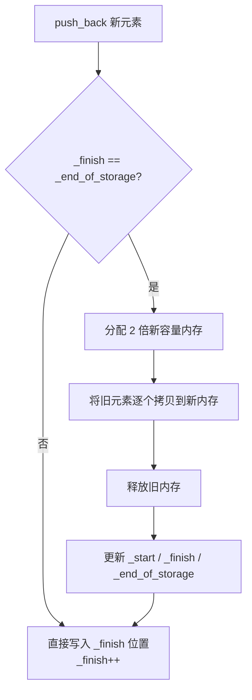

建议先阅读: 无（本章为数据结构系列的第一章）

本章只讲述数据结构的设计原理和实现思想，不绑定任何特定语言。代码演示用 C 语言，因为 C 标准库几乎不提供数据结构，能完整展示底层实现细节。每种主流语言对该结构的封装形式见末尾的对比表。

---

## 原理

容器是用于存储和组织数据集合的数据结构，封装了数据存储和访问的管理细节。

### 连续存储 vs 节点存储

| 类型   | 代表             | 内存布局      | 随机访问 | 中间插入/删除         |
| ---- | -------------- | --------- | ---- | --------------- |
| 连续存储 | vector, array  | 元素连续排列    | O(1) | O(n)            |
| 节点存储 | list, map, set | 节点散列，指针相连 | 不支持  | O(1) 或 O(log n) |
>注意：array不支持中间插入/删除，array是固定大小
 >map/set是有序关联容器，插入是按值排序，而不是简单的中间插入
 >>>有序关联容器内部是红黑树实现，元素按照键大小关系排序
> >>与之对应的是哈希表实现，通过键值对，遍历无序

### CPU 缓存与空间局部性

连续存储和节点存储的实际性能差异远不止复杂度表能反映的，硬件缓存机制放大了这个差距。

CPU 读取内存时，不是按字节逐个取，而是以 **cache line** 为单位预取一整块（通常 64 字节）。一个 cache miss 导致 CPU 停顿几十到几百个时钟周期去主存搬数据。

- **连续存储**：遍历数组时，读 `arr[0]`（4 字节），CPU 顺带把 `arr[0..15]`（64 字节）全部拉入 L1 缓存。后续 `arr[1]`、`arr[2]`……直接在缓存命中 → ~1ns / 次
- **节点存储**：每个 node 在堆上独立分配，地址散列。遍历链表时，当前节点大概率不在上一个节点的 cache line 内 → 每次访问都是 cache miss → ~100ns / 次

**实测差异**：对一个 1000 万元素的数组进行连续遍历 ≈ 0.03s，对同样大小的链表遍历 ≈ 3-10s，差了两个数量级。这不是算法的胜利，是**空间局部性**的胜利。

### 迭代器原理

迭代器是容器与算法之间的桥梁，抽象了"遍历元素"这一概念。本质上是智能指针。
支持解引用( * )、自增(++)、比较( ==  !=  <  > )等操作

随机访问迭代器（如 *vector, array,string*）基于指针算术原理：`it + n` 和 `it[n]`（it指针后移n位）来计算偏移量判断前后；额外支持< > >= <=关系比较运算符。
双向迭代器（如 *list,set,map*）只支持 != 和 == 。因为内存不连续，比较大小（本质是比较地址前后）是低效的无意义操作

#### 为什么双向迭代器不支持 `<`

技术上完全可以在 list 迭代器上实现 `<` 运算符——做法是遍历链表，数出每个迭代器距离头节点的步数，然后比较步数大小。C++ 标准库**选择不实现**，原因有两个：

1. **违背迭代器的抽象契约**：迭代器应当是 O(1) 的轻量句柄。`<` 如果变成 O(n) 操作，会让所有接受随机访问迭代器的算法（如 `sort`、`lower_bound`）在 list 上退化为 O(n²)，且编译期无法检测
2. **跨容器比较无意义**：分属两个不同 list 的迭代器，它们的地址顺序不代表元素顺序，比较毫无语义

所以双向迭代器只提供 `==` 和 `!=`，这并非"做不到"，而是**设计上的有意约束**。

### vector 扩容机制

vector 内部维护三个指针：`_start`（起始）、`_finish`（已用末尾）、`_end_of_storage`（容量末尾）。当 `_finish == _end_of_storage` 时触发扩容：



单次扩容为 O(n)，但均摊后 push_back 仍为 O(1)。

#### 扩容因子的数学分析

扩容因子 k（k > 1）的选择是一个时间和空间的权衡。

**均摊证明**：设初始容量为 1，扩容因子为 k，扩容序列为 1, k, k², ..., n/k, n。

每次扩容时拷贝的元素数 = 当前容量。总拷贝次数：
```
总拷贝 = 1 + k + k² + ... + n/k
       < n/k · (1 + 1/k + 1/k² + ...)   // 等比级数求和
       = n/k · 1/(1 - 1/k)
       = n/(k - 1)
```
总 push_back 次数 ≈ n，所以每单次 push_back 均摊拷贝次数 ≈ 1/(k-1)，O(1)。

**不同因子的对比**：

| 因子 | 均摊拷贝/次 | 最坏内存浪费 | 典型采用 |
|:---:|:----------:|:----------:|:-------:|
| 1.5 | ~2.0 | ~33% | GCC libstdc++ |
| 2   | ~1.0 | ~50% | LLVM libc++, MSVC STL |
| 3   | ~0.5 | ~66% | 极少使用 |

- **k = 2**：拷贝次数最少（均摊 1 次/op），但最后一次扩容后最多浪费一半内存
- **k = 1.5**：浪费更少（~33%），但扩容更频繁，拷贝总次数多一倍
- **k 越大**：扩容次数越少，但内存碎片率和浪费越大

工程实践中没有绝对最优的因子——LLVM 用 2 保持拷贝最少，GCC 用 1.5 换取更紧凑的内存。

### 时间复杂度总表

| 操作 | vector | list | deque | set/map | unordered_map |
|------|--------|------|-------|---------|---------------|
| 随机访问 | O(1) | O(n) | O(1) | - | - |
| 头部插入 | O(n) | O(1) | O(1) | O(log n) | O(1) |
| 尾部插入 | O(1)* | O(1) | O(1) | O(log n) | O(1) |
| 中间插入 | O(n) | O(1) | O(n) | O(log n) | O(1) |
| 查找 | O(n) | O(n) | O(n) | O(log n) | O(1) |

> *均摊 O(1)，单次扩容时为 O(n)

---

## 实现

手写一个简易动态数组 SimpleVector（仅为 int 类型演示，通用化可将 int 替换为 void* 加类型参数）：

```c
#include <stdlib.h>
#include <string.h>

typedef struct {
    int* data;
    size_t size;
    size_t capacity;
    //size是已用元素数，capacity是容量大小
} SimpleVector;

void sv_init(SimpleVector* v) {
    v->data = NULL;
    v->size = 0;
    v->capacity = 0;
}

void sv_destroy(SimpleVector* v) {
    free(v->data);  //free()函数来自stdlib.h,作用是释放之前由malloc,calloc,realloc分配的堆内存。
    v->data = NULL;
    v->size = 0;
    v->capacity = 0;
}

// 扩容：容量不足时翻倍
int sv_expand(SimpleVector* v) {
    size_t new_cap = v->capacity == 0 ? 1 : v->capacity * 2;
    //void* realloc(void* ptr,size_t new_size)函数作用：在ptr指针原有内存上调整大小，如果能原地扩展就原地扩展，如果不能就分配新内存->拷贝就旧数据->释放旧内存
    //void* malloc(size_t size)用于分配size字节上的堆内存，内容不初始化，保留垃圾值
    //void* calloc(size_t n,size_t size)分配n*size字节，全部清零，多一个溢出保护，比malloc安全
    int* new_data = realloc(v->data, new_cap * sizeof(int));
    //这里已经包含了分配->拷贝->释放旧的全过程
    //下面当realloc对data扩容失败的时候返回-1,扩容成功就进行指针赋值
    if (!new_data) return -1;
    v->data = new_data;
    v->capacity = new_cap;
    return 0;
}

int sv_push_back(SimpleVector* v, int value) {
    if (v->size >= v->capacity)//这里是判断元素总量是否超量，如果超量或者用满则进行扩容，调用扩容函数，扩容失败则返回-1
        if (sv_expand(v) != 0) return -1;
    v->data[v->size++] = value; //扩容成功在data[size]位置写入value,然后size++。保证size是新的元素个数
    return 0;
}

void sv_pop_back(SimpleVector* v) {
    if (v->size > 0) v->size--;//直接看这里是当满足元素数量大于零则删除尾部元素，其实没有清零，只是把size上限-1,让外部无法访问末位元素罢了，数据还在，下次push_back会覆盖
    //假如说这里直接free清空，下次push_back会进行扩容产生额外开销，标准做法就是只减size,不清零内存，让数据被自然覆盖，这样均摊才会O(1)
}

int sv_at(SimpleVector* v, size_t index) {
    return v->data[index];  // 调用者保证 index < size
    //该函数用于返回索引为index的值
}

size_t sv_size(SimpleVector* v) { return v->size; }
size_t sv_capacity(SimpleVector* v) { return v->capacity; }
int sv_empty(SimpleVector* v) { return v->size == 0; }

void sv_clear(SimpleVector* v) { v->size = 0; }
```

扩容机制与 C++ vector 相同：容量不足时分配 2 倍新内存，将旧元素拷贝/移动到新内存，释放旧内存。单次扩容 O(n)，均摊后 push_back 为 O(1)。>区别具体情况可以自行去看看CPP[[vector]]章节内容
*有些朋友可能在学完CPP之后就来学数据结构了，没有提前了解过C语言，这里来提前解释一下，C语言没有成员函数，所以在main（）里直接调用的时候直接使用自定义库里的函数，比如实例化一个对象a,在CPP里可能是使用a.函数()来进行操作，但是在C里面要这样用： 函数（&a),所以我们每个函数都要提前加上前缀_来区分不同数据类型的“同名”函数*

#### realloc 的陷阱

`sv_expand` 中使用了 `realloc`，写法看起来正确，但仍需注意两个陷阱：

**陷阱 1：不要直接赋值回原指针**
```c
v->data = realloc(v->data, new_cap * sizeof(int));   // 危险！
```
如果 `realloc` 返回 NULL（内存不足），原指针 `v->data` 已经丢失——既拿不到新内存，又丢失了旧数据的地址，数据全部泄漏。正确的做法是用临时变量接收返回值，判 NULL 后再赋值（即代码中 `sv_expand` 的写法）。

**陷阱 2：size_t 溢出**
```c
size_t new_cap = v->capacity == 0 ? 1 : v->capacity * 2;
```
当 `v->capacity` 接近 `SIZE_MAX / 2` 时，`capacity * 2` 会回绕（wrap around）为一个很小的数，然后 `realloc` 失败。安全做法是先判溢出：

```c
if (v->capacity > SIZE_MAX / 2) return -1;  // 无法再扩容
size_t new_cap = v->capacity == 0 ? 1 : v->capacity * 2;
```

---

## 各语言标准库对比

本章介绍的几种容器类型在各主流语言中都有对应封装，只是名称和接口略有差异：

| 语言 | 动态数组 | 双向链表 | 双端队列 | 有序集合 | 有序映射 | 哈希集合 | 哈希映射 |
|------|----------|----------|----------|----------|----------|----------|----------|
| C | 无（手写） | 无（手写） | 无（手写） | 无（手写） | 无（手写） | 无（手写） | 无（手写） |
| C++ | vector | list | deque | set | map | unordered_set | unordered_map |
| Java | ArrayList | LinkedList | ArrayDeque | TreeSet | TreeMap | HashSet | HashMap |
| Python | list | 无（用 deque） | collections.deque | 无（需 sortedcontainers） | 无 | set | dict |
| Rust | Vec | LinkedList | VecDeque | BTreeSet | BTreeMap | HashSet | HashMap |
| Go | slice | container/list | 无 | 无（需第三方） | 无 | map[K]struct{} | map[K]V |

C 标准库不提供任何通用容器，所有数据结构需手动实现，这正是本章用 C 演示实现的原因。

---

## 应用场景

- **vector**: 需要随机访问的列表，末尾增删频繁。如存储学生成绩列表
- **list**: 中间频繁插入/删除，需要 splice 操作。如 LRU 缓存的内部链表
- **set/map**: 需要有序存储和范围查询。如按时间排序的事件日志
- **unordered_map**: 需要 O(1) 查找，不关心顺序。如缓存、字典

---

## 练习

| 题号 | 题目 | 难度 | 知识点 |
|------|------|------|--------|
| P1047 | 校门外的树 | 入门 | 数组标记 |
| P3156 | 询问学号 | 入门 | vector 基础 |
| P1427 | 小鱼的数字游戏 | 入门 | vector 反向遍历 |

