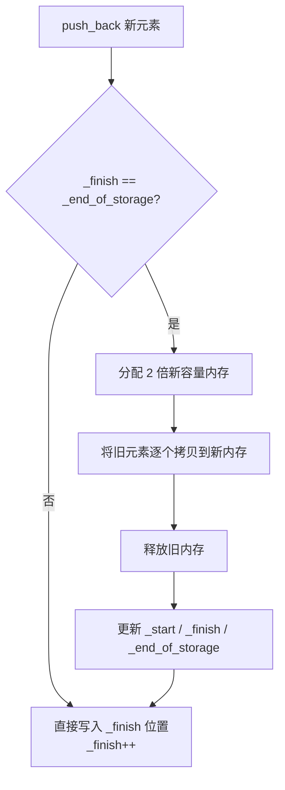

建议先阅读: [[01_动态数组]]

本章只讲述数据结构的设计原理和实现思想，不绑定任何特定语言。代码演示用 C 语言，因为 C 标准库几乎不提供数据结构，能完整展示底层实现细节。每种主流语言对该结构的封装形式见末尾的对比表。

---

## 原理

容器是用于存储和组织数据集合的数据结构，封装了数据存储和访问的管理细节。

### 连续存储 vs 节点存储

| 类型   | 代表             | 内存布局      | 随机访问 | 中间插入/删除         |
| ---- | -------------- | --------- | ---- | --------------- |
| 连续存储 | vector, array  | 元素连续排列    | O(1) | O(n)            |
| 节点存储 | list, map, set | 节点散列，指针相连 | 不支持  | O(1) 或 O(log n) |
>注意：array不支持中间插入/删除，array是固定大小
 >map/set是有序关联容器，插入是按值排序，而不是简单的中间插入
 >>>有序关联容器内部是红黑树实现，元素按照键大小关系排序
> >>与之对应的是哈希表实现，通过键值对，遍历无序

### CPU 缓存与空间局部性

连续存储和节点存储的实际性能差异远不止复杂度表能反映的，硬件缓存机制放大了这个差距。

CPU 读取内存时，不是按字节逐个取，而是以 **cache line** 为单位预取一整块（通常 64 字节）。一个 cache miss 导致 CPU 停顿几十到几百个时钟周期去主存搬数据。

- **连续存储**：遍历数组时，读 `arr[0]`（4 字节），CPU 顺带把 `arr[0..15]`（64 字节）全部拉入 L1 缓存。后续 `arr[1]`、`arr[2]`……直接在缓存命中 → ~1ns / 次
- **节点存储**：每个 node 在堆上独立分配，地址散列。遍历链表时，当前节点大概率不在上一个节点的 cache line 内 → 每次访问都是 cache miss → ~100ns / 次

**实测差异**：对一个 1000 万元素的数组进行连续遍历 ≈ 0.03s，对同样大小的链表遍历 ≈ 3-10s，差了两个数量级。这不是算法的胜利，是**空间局部性**的胜利。

### 虚拟内存与缺页中断

CPU 缓存之上还有一层**虚拟内存**。进程看到的地址是虚拟地址，OS 通过页表将其映射到物理内存。

**关键事实**：
- `malloc` （标准库stdlib内的函数）分配大内存时，OS 只分配了虚拟地址空间，并没有分配物理页框
- 首次访问某个虚拟页时，CPU 触发**缺页中断（page fault）**，OS 才从物理内存中分配一个页框（通常 4KB）并建立映射
- 一次缺页中断 ≈ 1–10μs，比一次 cache miss（~100ns）再慢一个数量级

**对容器的影响**：

vector 扩容时，`realloc` 通过 `sbrk` 或 `mmap` 获取新内存：
- 小容量增长（< 128KB）：`sbrk` 扩展堆段，数据已在虚拟地址范围内，缺页少
- 大容量增长（> 128KB）：`mmap` 映射新区域，首次写入旧数据时触发大量缺页中断

```
分配大数组 ≈ 瞬间完成（仅分配虚拟地址）
首次遍历写入每个页 ≈ 慢，每页首次访问触发 page fault
```

所以 vector 单次 O(n) 扩容的实际耗时并不均匀——新内存的前几次访问额外承担一次缺页中断。扩容越大，缺页越多，越能感受到"分配一瞬间、访问卡一下"的现象。

### 迭代器原理

迭代器是容器与算法之间的桥梁，抽象了"遍历元素"这一概念。本质上是智能指针。
支持解引用( * )、自增(++)、比较( ==  !=  <  > )等操作

随机访问迭代器（如 *vector, array,string*）基于指针算术原理：`it + n` 和 `it[n]`（it指针后移n位）来计算偏移量判断前后；额外支持< > >= <=关系比较运算符。
双向迭代器（如 *list,set,map*）只支持 != 和 == 。因为内存不连续，比较大小（本质是比较地址前后）是低效的无意义操作

#### 为什么双向迭代器不支持 `<`

技术上完全可以在 list 迭代器上实现 `<` 运算符——做法是遍历链表，数出每个迭代器距离头节点的步数，然后比较步数大小。C++ 标准库**选择不实现**，原因有两个：

1. **违背迭代器的抽象契约**：迭代器应当是 O(1) 的轻量句柄。`<` 如果变成 O(n) 操作，会让所有接受随机访问迭代器的算法（如 `sort`、`lower_bound`）在 list 上退化为 O(n²)，且编译期无法检测
2. **跨容器比较无意义**：分属两个不同 list 的迭代器，它们的地址顺序不代表元素顺序，比较毫无语义

所以双向迭代器只提供 `==` 和 `!=`，这并非"做不到"，而是**设计上的有意约束**。

#### 迭代器失效规则

对容器执行插入/删除操作后，部分或全部迭代器、指针、引用可能变得不可用（失效）。不同容器的规则差异很大：

**vector**：
- 插入导致扩容 → **所有**迭代器失效（内存重新分配）
- 中间插入（未扩容）→ 插入点**之后**的迭代器失效（元素后移）
- 删除 → 删除点**之后**的迭代器失效

**list**：
- 插入/删除 → 仅被删节点的迭代器失效，**其他全部有效**
- 这是链表最大的优势：操作不影响其他迭代器，极端安全

**deque**：
- 中间插入/删除 → **所有**迭代器失效（可能触发 block 重排）
- 头尾插入/删除 → 标准只保证被操作端之外的可能失效；实际实现中头尾 push/pop 通常仅使该端迭代器失效

**set / map**：
- 插入/删除 → 仅被删节点的迭代器失效（红黑树节点独立分配）

**unordered_map**：
- 插入触发 rehash → 所有迭代器失效
- 未 rehash 的插入/删除 → 仅被删节点失效

#### 失效根因

迭代器本质上存储了一个内存地址（或地址 + 偏移量）。失效的根本原因只有一个：**底层存储布局变化导致该地址不再指向原来的元素**。

- **vector**：底层是一整块连续内存。扩容时旧内存被 free、新内存被 malloc，**所有地址全变**；中间插入/删除时元素被 memmove 后移/前移，**插入点之后的地址全变**
- **list**：每个节点独立 malloc，地址固定。插入/删除只改相邻节点的 prev/next 指针，**已有节点地址永不改变**，其他迭代器自然全部有效
- **deque**：中段插入可能触发 block 分裂或 map 重分配 → **block 指针变化**，全部失效；头尾 push/pop 只申请/释放一个 block，**已有 block 地址不变**
- **set / map**：红黑树节点独立分配，插入/删除只修改树指针，不移动内存，**仅被删节点失效**
- **unordered_map**：rehash 时所有 bucket 重新分配，**全部失效**；未 rehash 时节点地址不变

一句话总结：**连续存储的容器（vector）地址随操作大面积移动；节点独立分配的容器（list、set、map）地址稳定，只影响被删节点。**

### vector 扩容机制

vector 内部维护三个指针：`_start`（起始）、`_finish`（已用末尾）、`_end_of_storage`（容量末尾）。当 `_finish == _end_of_storage` 时触发扩容：



单次扩容为 O(n)，但均摊后 push_back 仍为 O(1)。

#### 扩容因子的数学分析

扩容因子 k（k > 1）的选择是一个时间和空间的权衡。

**均摊证明**：设初始容量为 1，扩容因子为 k，扩容序列为 1, k, k², ..., n/k, n。

每次扩容时拷贝的元素数 = 当前容量。总拷贝次数：
```
总拷贝 = 1 + k + k² + ... + n/k
       < n/k · (1 + 1/k + 1/k² + ...)   // 等比级数求和
       = n/k · 1/(1 - 1/k)
       = n/(k - 1)
```
总 push_back 次数 ≈ n，所以每单次 push_back 均摊拷贝次数 ≈ 1/(k-1)，O(1)。

**不同因子的对比**：

| 因子 | 均摊拷贝/次 | 最坏内存浪费 | 典型采用 |
|:---:|:----------:|:----------:|:-------:|
| 1.5 | ~2.0 | ~33% | GCC libstdc++ |
| 2   | ~1.0 | ~50% | LLVM libc++, MSVC STL |
| 3   | ~0.5 | ~66% | 极少使用 |

- **k = 2**：拷贝次数最少（均摊 1 次/op），但最后一次扩容后最多浪费一半内存
- **k = 1.5**：浪费更少（~33%），但扩容更频繁，拷贝总次数多一倍
- **k 越大**：扩容次数越少，但内存碎片率和浪费越大

工程实践中没有绝对最优的因子——LLVM 用 2 保持拷贝最少，GCC 用 1.5 换取更紧凑的内存。

### 时间复杂度总表

| 操作 | vector | list | deque | set/map | unordered_map |
|------|--------|------|-------|---------|---------------|
| 随机访问 | O(1) | O(n) | O(1) | - | - |
| 头部插入 | O(n) | O(1) | O(1) | O(log n) | O(1) |
| 尾部插入 | O(1)* | O(1) | O(1) | O(log n) | O(1) |
| 中间插入 | O(n) | O(1) | O(n) | O(log n) | O(1) |
| 查找 | O(n) | O(n) | O(n) | O(log n) | O(1) |

> *均摊 O(1)，单次扩容时为 O(n)

### 内存开销对比

除时间复杂度外，不同容器的**每元素额外内存开销**也是选型的重要考量：

| 容器 | 每元素额外开销 | 说明 |
|------|:------------:|------|
| vector | 0（仅数据本身） | 连续存储，无冗余指针 |
| list（双向） | 2 个指针（prev + next） | 64 位系统下约 16 字节/元素 |
| deque | ~均摊 1 个指针（block map） | 分段连续，中控数组的均摊开销 |
| set / map（红黑树） | 3 个指针（left + right + parent）+ 颜色位 | 约 24–32 字节/元素 |
| unordered_map（哈希表） | 1 个指针（next 链）+ 桶均摊 | 约 8–16 字节/元素 |

> 存储小对象（如 int）时，list 的额外开销可能使总内存翻倍；vector 零开销在小对象场景优势明显。但 list 的 splice / 中间插入不需要移动元素，各有取舍。

### 内存对齐与 padding

"内存开销对比表"列出的数字忽略了另一个因素——**内存对齐**。

CPU 读取对齐的地址（如 4 字节 int 在 4 的倍数地址上）能一次完成，未对齐的地址可能需要两次内存访问。因此编译器在结构体成员间插入 **padding（填充字节）** 保证自然对齐：

```c
struct A {           // sizeof(struct A) = 8，而非 5
    char a;          // 偏移 0，1 字节
    // padding 3 字节 ← 让 int b 在 4 的倍数上
    int  b;          // 偏移 4，4 字节
};

struct B {           // sizeof(struct B) = 12，而非 8
    char a;          // 偏移 0，1 字节
    // padding 1 字节 ← 让 short c 在 2 的倍数上
    short c;         // 偏移 2，2 字节
    // padding 2 字节 ← 让 int b 在 4 的倍数上
    int  b;          // 偏移 4，4 字节
    char d;          // 偏移 8，1 字节
    // padding 3 字节 ← struct 整体大小对齐到最大成员对齐值（4）
};
```

**对容器选型的影响**：

- vector 存储 `struct A`，每元素 8 字节（5B 数据 + 3B padding），额外开销仍为 0
- list 存储 `struct A`，每节点 = 8（数据 + padding）+ 16（prev/next）= **24 字节**，比数据本身大 3 倍
- 当元素是对齐要求高的复杂结构体时，vector 的内存优势更突出——零开销始终是零开销，而 list 的先验开销不受 padding 影响

> 可通过 `__attribute__((packed))`（GCC）或 `#pragma pack(1)` 取消 padding，但这会导致未对齐访问的性能惩罚，在频繁遍历的场景下不推荐。

---

## 实现

手写一个简易动态数组 SimpleVector（仅为 int 类型演示，通用化可将 int 替换为 void* 加类型参数）：

```c
#include <stdlib.h>
#include <string.h>

typedef struct {
    int* data;
    size_t size;
    size_t capacity;
    //size是已用元素数，capacity是容量大小
} SimpleVector;

void sv_init(SimpleVector* v) {
    v->data = NULL;
    v->size = 0;
    v->capacity = 0;
}

void sv_destroy(SimpleVector* v) {
    free(v->data);  //free()函数来自stdlib.h,作用是释放之前由malloc,calloc,realloc分配的堆内存。
    v->data = NULL;
    v->size = 0;
    v->capacity = 0;
}

// 扩容：容量不足时翻倍
int sv_expand(SimpleVector* v) {
    size_t new_cap = v->capacity == 0 ? 1 : v->capacity * 2;
    //void* realloc(void* ptr,size_t new_size)函数作用：在ptr指针原有内存上调整大小，如果能原地扩展就原地扩展，如果不能就分配新内存->拷贝就旧数据->释放旧内存
    //void* malloc(size_t size)用于分配size字节上的堆内存，内容不初始化，保留垃圾值
    //void* calloc(size_t n,size_t size)分配n*size字节，全部清零，多一个溢出保护，比malloc安全
    int* new_data = realloc(v->data, new_cap * sizeof(int));
    //这里已经包含了分配->拷贝->释放旧的全过程
    //下面当realloc对data扩容失败的时候返回-1,扩容成功就进行指针赋值
    if (!new_data) return -1;
    v->data = new_data;
    v->capacity = new_cap;
    return 0;
}

int sv_push_back(SimpleVector* v, int value) {
    if (v->size >= v->capacity)//这里是判断元素总量是否超量，如果超量或者用满则进行扩容，调用扩容函数，扩容失败则返回-1
        if (sv_expand(v) != 0) return -1;
    v->data[v->size++] = value; //扩容成功在data[size]位置写入value,然后size++。保证size是新的元素个数
    return 0;
}

void sv_pop_back(SimpleVector* v) {
    if (v->size > 0) v->size--;//直接看这里是当满足元素数量大于零则删除尾部元素，其实没有清零，只是把size上限-1,让外部无法访问末位元素罢了，数据还在，下次push_back会覆盖
    //假如说这里直接free清空，下次push_back会进行扩容产生额外开销，标准做法就是只减size,不清零内存，让数据被自然覆盖，这样均摊才会O(1)
}

int sv_at(SimpleVector* v, size_t index) {
    return v->data[index];  // 调用者保证 index < size
    //该函数用于返回索引为index的值
}

size_t sv_size(SimpleVector* v) { return v->size; }
size_t sv_capacity(SimpleVector* v) { return v->capacity; }
int sv_empty(SimpleVector* v) { return v->size == 0; }

void sv_clear(SimpleVector* v) { v->size = 0; }
```

扩容机制与 C++ vector 相同：容量不足时分配 2 倍新内存，将旧元素拷贝/移动到新内存，释放旧内存。单次扩容 O(n)，均摊后 push_back 为 O(1)。>区别具体情况可以自行去看看 C++ [[../cpp教程/容器库/序列容器/vector|vector]] 章节内容
*有些朋友可能在学完CPP之后就来学数据结构了，没有提前了解过C语言，这里来提前解释一下，C语言没有成员函数，所以在main（）里直接调用的时候直接使用自定义库里的函数，比如实例化一个对象a,在CPP里可能是使用a.函数()来进行操作，但是在C里面要这样用： 函数（&a),所以我们每个函数都要提前加上前缀_来区分不同数据类型的“同名”函数*

#### realloc 的陷阱

`sv_expand` 中使用了 `realloc`，写法看起来正确，但仍需注意两个陷阱：

**陷阱 1：不要直接赋值回原指针**
```c
v->data = realloc(v->data, new_cap * sizeof(int));   // 危险！
```
如果 `realloc` 返回 NULL（内存不足），原指针 `v->data` 已经丢失——既拿不到新内存，又丢失了旧数据的地址，数据全部泄漏。正确的做法是用临时变量接收返回值，判 NULL 后再赋值（即代码中 `sv_expand` 的写法）。

**陷阱 2：size_t 溢出**
```c
size_t new_cap = v->capacity == 0 ? 1 : v->capacity * 2;
```
当 `v->capacity` 接近 `SIZE_MAX / 2` 时，`capacity * 2` 会回绕（wrap around）为一个很小的数，然后 `realloc` 失败。安全做法是先判溢出：

```c
if (v->capacity > SIZE_MAX / 2) return -1;  // 无法再扩容
size_t new_cap = v->capacity == 0 ? 1 : v->capacity * 2;
```

### malloc 的实现原理

章节多次调用 `malloc` / `realloc` / `free`，这些函数并非直接与 OS 打交道，而是在用户态维护了一个**堆内存分配器**。以 Linux glibc 的 **ptmalloc** 为例：

#### 架构

```
进程堆区
    │
    ├─ Arena（主 arena 用 sbrk，线程 arena 用 mmap）
    │    │
    │    ├─ Fast bins（小内存，LIFO，≤ 80B）
    │    ├─ Small bins（中等内存，FIFO，≤ 1024B）
    │    ├─ Unsorted bin（临时缓存）
    │    ├─ Large bins（大内存）
    │    └─ Top chunk（最后的"水龙头"）
    │
    └─ mmap（超大分配，> 128KB 走 mmap 映射匿名页）
```

#### 关键行为

1. **`malloc(n)`**：从对应 bin 中找空闲 chunk，找不到则从 top chunk 切，top chunk 不够则用 `sbrk` 或 `mmap` 向 OS 申请
2. **`free(p)`**：不立即归还 OS！相邻空闲 chunk 合并，放入对应 bin 缓存以备复用
3. **`realloc(ptr, new_size)`**：
   - 原地可扩展 → 直接扩展 top chunk，返回原地址（免拷贝）
   - 原地不可扩 → malloc 新内存 → memcpy 旧数据 → free 旧内存

#### 这对容器意味着什么

| 容器操作 | 分配器的行为 | 性能特征 |
|----------|------------|---------|
| vector 反复 realloc | 小规模时原地扩展（免拷贝），规模大后必须搬迁 → 释放的 chunk 进入 fastbin 复用 | 均摊 O(1)，但每次 realloc 可能触发 syscall |
| list 每个节点一次 malloc | 大量小 chunk 进入 fastbin，不合并 → 外部碎片增长 | 长期运行后内存碎片化严重 |
| deque 按 block 大小分配 | block 大小适中（8–64 元素），分配次数远少于 list | 分配规整，碎片介于 vector 和 list 之间 |

#### 碎片模式对比

| 容器 | 碎片类型 | 成因 |
|------|---------|------|
| vector | **内部碎片**（internal） | 扩容预留的空间未被使用 |
| list | **外部碎片**（external） | 节点散落在堆中，free 后的空洞无法被充分利用 |
| deque | 内部碎片最少（block 几乎满配），外部碎片也比 list 少 | block 尺寸固定，分配模式规整 |

> 碎片是容器长期运行的"隐形杀手"——vector 浪费的是虚拟地址空间，不影响其他进程；list 的外部碎片会降低后续所有 malloc 的命中率，影响整个进程的内存效率。

---

## 各语言标准库对比

本章介绍的几种容器类型在各主流语言中都有对应封装，只是名称和接口略有差异：

| 语言 | 动态数组 | 双向链表 | 双端队列 | 有序集合 | 有序映射 | 哈希集合 | 哈希映射 |
|------|----------|----------|----------|----------|----------|----------|----------|
| C | 无（手写） | 无（手写） | 无（手写） | 无（手写） | 无（手写） | 无（手写） | 无（手写） |
| C++ | vector | list | deque | set | map | unordered_set | unordered_map |
| Java | ArrayList | LinkedList | ArrayDeque | TreeSet | TreeMap | HashSet | HashMap |
| Python | list | 无（用 deque） | collections.deque | 无（需 sortedcontainers） | 无 | set | dict |
| Rust | Vec | LinkedList | VecDeque | BTreeSet | BTreeMap | HashSet | HashMap |
| Go | slice | container/list | 无 | 无（需第三方） | 无 | map[K]struct{} | map[K]V |

C 标准库不提供任何通用容器，所有数据结构需手动实现，这正是本章用 C 演示实现的原因。

---

## 容器适配器

容器适配器是对已有容器的封装，通过**限制接口**来提供特定数据结构的行为。适配器本身不存储元素，而是委托给底层容器：

| 适配器 | 默认底层容器 | 限制的接口 | 提供的行为 |
|--------|------------|-----------|-----------|
| stack | deque | 仅保留 push / pop / top | LIFO 栈 |
| queue | deque | 仅保留 push / pop / front / back | FIFO 队列 |
| priority_queue | vector | 仅保留 push / pop / top | 最大/最小堆 |

适配器模式剥离了"做什么"和"用什么做"——你可以用动态数组实现栈，也可以用链表实现栈，只要满足接口需求即可。

#### 适配器的 C 模拟：用 SimpleVector 实现栈

适配器的本质是**组合（composition）** + **委托（delegation）** + **接口限制**：

```c
// 利用上一节实现的 SimpleVector 作为底层容器
typedef struct {
    SimpleVector* vec;  // 组合：持有底层容器的指针
} StackAdapter;

void sa_init(StackAdapter* s, SimpleVector* v) {
    s->vec = v;
}

void sa_destroy(StackAdapter* s) {
    // 只释放栈对象本身，不释放底层容器
    // 底层容器的生命周期由调用方管理
}

void sa_push(StackAdapter* s, int val) {
    sv_push_back(s->vec, val);  // 委托：转发给 vector 的 push_back
}

int sa_pop(StackAdapter* s) {
    // 限制：只暴露栈接口，隐藏 vector 的随机访问、任意位置插入等能力
    int top = sv_at(s->vec, sv_size(s->vec) - 1);
    sv_pop_back(s->vec);
    return top;
}

int sa_top(StackAdapter* s) {
    return sv_at(s->vec, sv_size(s->vec) - 1);
}

int sa_empty(StackAdapter* s) {
    return sv_empty(s->vec);
}

size_t sa_size(StackAdapter* s) {
    return sv_size(s->vec);
}
```

把底层容器从 vector 换成链表，栈的对外接口完全不变——这就是适配器模式的核心价值：**封装变化，接口稳定**。

---

## 应用场景

- **vector**: 需要随机访问的列表，末尾增删频繁。如存储学生成绩列表
- **list**: 中间频繁插入/删除，需要 splice 操作。如 LRU 缓存的内部链表
- **set/map**: 需要有序存储和范围查询。如按时间排序的事件日志
- **unordered_map**: 需要 O(1) 查找，不关心顺序。如缓存、字典

---

## 练习

| 题号 | 题目 | 难度 | 知识点 |
|------|------|------|--------|
| 448 | 找到所有数组中消失的数字 | 入门 | 数组标记 |
| 1920 | 基于排列构建数组 | 入门 | vector 基础 |
| 344 | 反转字符串 | 入门 | vector 反向遍历 |

---

## 动手实验

以下实验题用代码"看见"本章讲述的理论。要求先写预期，再运行验证，最后用理论解释结果。

| 编号 | 题目 | 难度 | 知识点 |
|------|------|------|--------|
| E1 | 时间复杂度实测 | 动手实验 | O(1) vs O(n) 计时 |
| E2 | 内存对齐观测 | 动手实验 | sizeof / offsetof / padding |
| E3 | 容器内存开销对比 | 动手实验 | malloc 分配量追踪 |
| E4 | 迭代器失效演示 | 动手实验 | vector vs list 失效规则 |
| E5 | vector / deque / list 三容器性能对比 | 选做 | 实测与理论对照 |

### E1 — 时间复杂度实测

编写一个 C 程序，对 `push_back`（尾部插入，理论 O(1) 均摊）和头部插入（理论 O(n)）分别用 `n = 1000, 10000, 100000, 1000000` 计时。记录每次的总耗时和每操作平均耗时（ns/op）。

**要求**：在输出结果前用注释写出你的预期——各操作在各 n 下的 ns/op 应该是常数还是线性增长？实测结果是否符合预期？如果不符合，可能的原因是什么（缓存、缺页中断、realloc 开销）？

### E2 — 内存对齐观测

定义以下结构体，用 `sizeof` 和 `offsetof`（来自 `<stddef.h>`）打印每个成员的偏移量和结构体总大小：

```c
struct A { char a; int b; };
struct B { char a; short c; int b; };
struct C { char a; char b; int c; };
struct D { char a; int b; char c; };
```

**要求**：
1. 先手算每个结构体的预期大小，再运行验证
2. 解释为什么 C 和 D 的成员都是 `char + int + char` 但大小不同
3. 尝试 `#pragma pack(1)` 重新编译，观察变化

### E3 — 容器内存开销对比

用 `malloc` 分别模拟 vector 和 list 的内存分配模型：

- **vector 模型**：一次 `malloc(n * sizeof(int))`
- **list 模型**：循环 `n` 次，每次 `malloc(sizeof(Node))`，其中 `Node` 包含 `int data + struct Node *prev + struct Node *next`

**要求**：
1. 令 `n = 100000`，统计各自的总分配字节数和 `malloc` 调用次数
2. 解释为什么 vector 的总字节数约等于 `n * 4`，而 list 的总字节数远大于此
3. 思考：如果把 int 换成 1024 字节的大结构体，vector 和 list 的内存差距会缩小还是扩大？为什么？

### E4 — 迭代器失效演示

用 C++ 编写程序（文件后缀 `.cpp`，用 `g++` 编译）：

```cpp
#include <iostream>
#include <vector>
#include <list>
```

**要求**：
1. 创建一个 vector `v = {1, 2, 3, 4, 5}`，获取指向 `3` 的迭代器 `it`，输出 `*it`
2. 向 `v` 中 `push_back` 100 个元素（触发扩容），再次输出 `*it`，观察结果
3. 对 list 执行完全相同操作，观察迭代器是否仍然有效
4. 解释为什么会这样（引用 **迭代器失效根因** 一节的内容）

### E5 — 三容器性能对比（选做）

用 C++ 分别测试 `std::vector<int>`、`std::list<int>`、`std::deque<int>` 在以下三种操作上的耗时（`n = 100000`）：

| 操作 | vector 预期 | list 预期 | deque 预期 |
|------|------------|----------|-----------|
| 尾部插入 n 次 | O(1) 均摊 | O(1) | O(1) |
| 头部插入 n 次 | O(n) | O(1) | O(1) |
| 随机访问 n 次（随机下标） | O(1) | O(n) | O(1) |

**要求**：先填写上表中的"预期"列（O(1) / O(n)），再实际跑出数据对照。结合 **CPU 缓存**、**虚拟内存**、**deque 分段连续存储** 三节的内容，解释为什么实际数据与理论复杂度表存在偏差。

