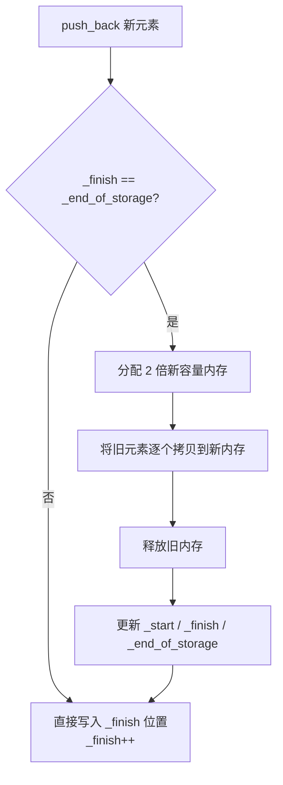

建议先阅读: 无（本章为数据结构系列的第一章）

本章只讲述数据结构的设计原理和实现思想，不绑定任何特定语言。代码演示用 C 语言，因为 C 标准库几乎不提供数据结构，能完整展示底层实现细节。每种主流语言对该结构的封装形式见末尾的对比表。

---

## 原理

容器是用于存储和组织数据集合的数据结构，封装了数据存储和访问的管理细节。

### 连续存储 vs 节点存储

| 类型   | 代表             | 内存布局      | 随机访问 | 中间插入/删除         |
| ---- | -------------- | --------- | ---- | --------------- |
| 连续存储 | vector, array  | 元素连续排列    | O(1) | O(n)            |
| 节点存储 | list, map, set | 节点散列，指针相连 | 不支持  | O(1) 或 O(log n) |
>注意：array不支持中间插入/删除，array是固定大小
 >map/set是有序关联容器，插入是按值排序，而不是简单的中间插入
 >>>有序关联容器内部是红黑树实现，元素按照键大小关系排序
> >>与之对应的是哈希表实现，通过键值对，遍历无序


### 迭代器原理

迭代器是容器与算法之间的桥梁，抽象了"遍历元素"这一概念。本质上是智能指针。
支持解引用( * )、自增(++)、比较( ==  !=  <  > )等操作

随机访问迭代器（如 *vector, array,string*）基于指针算术原理：`it + n` 和 `it[n]`（it指针后移n位）来计算偏移量判断前后；额外支持< > >= <=关系比较运算符。
双向迭代器（如 *list,set,map*）只支持 != 和 == 。因为内存不连续，比较大小（本质是比较地址前后）是低效的无意义操作

### vector 扩容机制

vector 内部维护三个指针：`_start`（起始）、`_finish`（已用末尾）、`_end_of_storage`（容量末尾）。当 `_finish == _end_of_storage` 时触发扩容：



单次扩容为 O(n)，但均摊后 push_back 仍为 O(1)。

### 时间复杂度总表

| 操作 | vector | list | deque | set/map | unordered_map |
|------|--------|------|-------|---------|---------------|
| 随机访问 | O(1) | O(n) | O(1) | - | - |
| 头部插入 | O(n) | O(1) | O(1) | O(log n) | O(1) |
| 尾部插入 | O(1)* | O(1) | O(1) | O(log n) | O(1) |
| 中间插入 | O(n) | O(1) | O(n) | O(log n) | O(1) |
| 查找 | O(n) | O(n) | O(n) | O(log n) | O(1) |

> *均摊 O(1)，单次扩容时为 O(n)

---

## 实现

手写一个简易动态数组 SimpleVector（仅为 int 类型演示，通用化可将 int 替换为 void* 加类型参数）：

```c
#include <stdlib.h>
#include <string.h>

typedef struct {
    int* data;
    size_t size;
    size_t capacity;
} SimpleVector;

void sv_init(SimpleVector* v) {
    v->data = NULL;
    v->size = 0;
    v->capacity = 0;
}

void sv_destroy(SimpleVector* v) {
    free(v->data);
    v->data = NULL;
    v->size = 0;
    v->capacity = 0;
}

// 扩容：容量不足时翻倍
int sv_expand(SimpleVector* v) {
    size_t new_cap = v->capacity == 0 ? 1 : v->capacity * 2;
    int* new_data = realloc(v->data, new_cap * sizeof(int));
    if (!new_data) return -1;
    v->data = new_data;
    v->capacity = new_cap;
    return 0;
}

int sv_push_back(SimpleVector* v, int value) {
    if (v->size >= v->capacity)
        if (sv_expand(v) != 0) return -1;
    v->data[v->size++] = value;
    return 0;
}

void sv_pop_back(SimpleVector* v) {
    if (v->size > 0) v->size--;
}

int sv_at(SimpleVector* v, size_t index) {
    return v->data[index];  // 调用者保证 index < size
}

size_t sv_size(SimpleVector* v) { return v->size; }
size_t sv_capacity(SimpleVector* v) { return v->capacity; }
int sv_empty(SimpleVector* v) { return v->size == 0; }

void sv_clear(SimpleVector* v) { v->size = 0; }
```

扩容机制与 C++ vector 相同：容量不足时分配 2 倍新内存，将旧元素拷贝/移动到新内存，释放旧内存。单次扩容 O(n)，均摊后 push_back 为 O(1)。

---

## 各语言标准库对比

本章介绍的几种容器类型在各主流语言中都有对应封装，只是名称和接口略有差异：

| 语言 | 动态数组 | 双向链表 | 双端队列 | 有序集合 | 有序映射 | 哈希集合 | 哈希映射 |
|------|----------|----------|----------|----------|----------|----------|----------|
| C | 无（手写） | 无（手写） | 无（手写） | 无（手写） | 无（手写） | 无（手写） | 无（手写） |
| C++ | vector | list | deque | set | map | unordered_set | unordered_map |
| Java | ArrayList | LinkedList | ArrayDeque | TreeSet | TreeMap | HashSet | HashMap |
| Python | list | 无（用 deque） | collections.deque | 无（需 sortedcontainers） | 无 | set | dict |
| Rust | Vec | LinkedList | VecDeque | BTreeSet | BTreeMap | HashSet | HashMap |
| Go | slice | container/list | 无 | 无（需第三方） | 无 | map[K]struct{} | map[K]V |

C 标准库不提供任何通用容器，所有数据结构需手动实现，这正是本章用 C 演示实现的原因。

---

## 应用场景

- **vector**: 需要随机访问的列表，末尾增删频繁。如存储学生成绩列表
- **list**: 中间频繁插入/删除，需要 splice 操作。如 LRU 缓存的内部链表
- **set/map**: 需要有序存储和范围查询。如按时间排序的事件日志
- **unordered_map**: 需要 O(1) 查找，不关心顺序。如缓存、字典

---

## 练习

| 题号 | 题目 | 难度 | 知识点 |
|------|------|------|--------|
| P1047 | 校门外的树 | 入门 | 数组标记 |
| P3156 | 询问学号 | 入门 | vector 基础 |
| P1427 | 小鱼的数字游戏 | 入门 | vector 反向遍历 |

