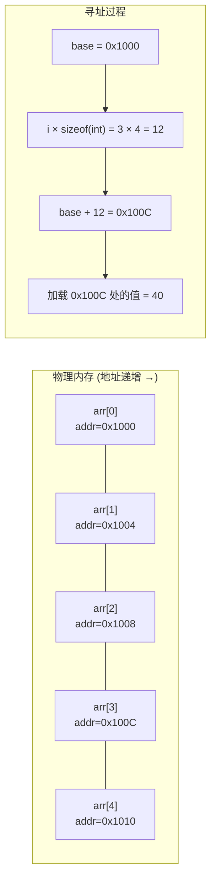
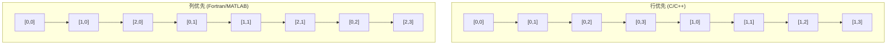
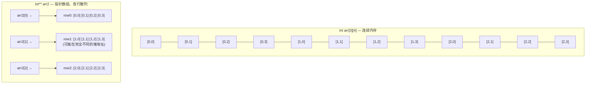
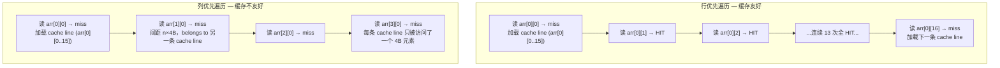
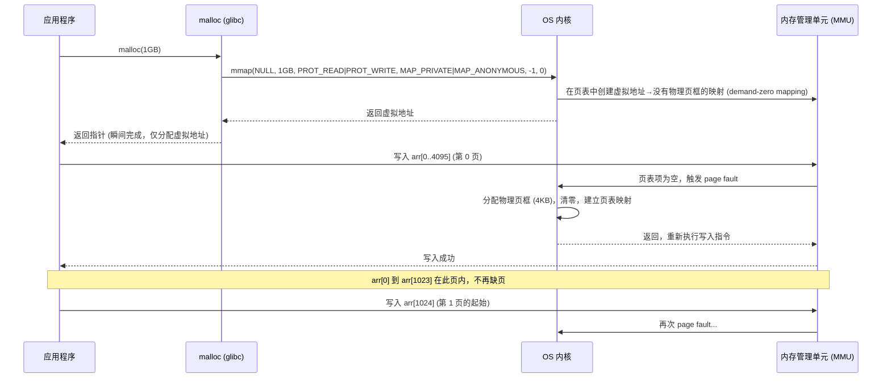
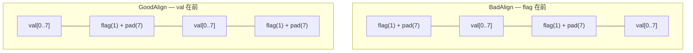

## 数组 (Array)

建议先阅读：无。数组是所有数据结构的基础逻辑基石，也是计算机硬件唯一直接理解的数据组织方式——CPU 只认识"基地址 + 偏移"。

---

## 原理

### 为什么数组是起点

在计算机科学中，"数据结构的本质是内存布局"。数组之所以成为第一课，是因为它对应硬件最直接的抽象：一段连续的内存，通过基地址 + 偏移量寻址。链表、树、哈希表等所有其它数据结构，最终都是在此基础上施加额外的指针管理或算法逻辑。

从 CPU 的视角看，数组不是"数据结构"，而是"一段地址"。`arr[i]` 在 x86-64 汇编层被翻译为一条 `mov eax, [rdi + rsi*4]`，其中 `rdi` 存基地址，`rsi` 存下标 i，乘数 4 是 `sizeof(int)`。整个访存过程在一条指令内部完成地址计算和加载。

```nasm
; C: int x = arr[3];
; 假设 arr -> rdi, 3 -> rsi
mov  eax, DWORD PTR [rdi + rsi*4]    ; 基址 + 偏移*元素字节数
```

### 内存模型与寻址公式

数组在内存中占据一段连续地址空间。对于元素类型为 T 的数组，第 i 个元素的地址是：

$$
\text{addr}(\text{arr}, i) = \text{base} + i \times \text{sizeof}(T)
$$

其中 `base` 是 `arr[0]` 的地址（即数组首地址）。这个公式由 CPU 的内存管理单元（MMU）在地址生成阶段完成乘法与加法，不需要额外的内存访问——这是 O(1) 随机访问的硬件基础。
简单解释的话，就是计算数组arr的第i位地址。base是arr[0]也就是首位地址，第i位地址就是加上i乘以数组类型的单个地址所占内存大小。

```c
int arr[5] = {10, 20, 30, 40, 50};
int x = arr[3];    // 等价于 *(arr + 3)
int y = 3[arr];    // C 语言允许的古怪写法，等价于 *(3 + arr)
```

`arr[3]` 和 `3[arr]` 在 C 标准中完全等价，因为 `a[b]` 被定义为 `*(a + b)`，加法交换律使得两者计算结果相同。编译后生成的汇编指令毫无区别。这揭示了 C 语言的一个核心事实：数组下标在语义层面就是指针算术的语法糖。



### 静态数组 vs 动态数组

数组的生命周期和存储位置取决于其声明方式。这个区别不仅影响语法，更决定性能特征和安全边界。

|  | 静态数组 | 动态数组 |
|------|---------|---------|
| 大小 | 编译期常量，不可变 | 运行时可变 |
| 内存来源 | 栈或全局数据段（.data/.bss） | 堆（通过 malloc/realloc） |
| 生命周期 | 随作用域结束自动销毁 | 需手动 free，或由 GC 处理 |
| 分配成本 | ~0（仅移动栈指针 rsp） | malloc 需遍历空闲链表 / 切割 chunk |
| 扩容成本 | 不支持 | O(n) 数据拷贝，且旧内存需释放 |
| 大小上限 | 受栈大小限制（Linux 默认 8MB） | 受虚拟地址空间限制（64 位下约 2^47 字节） |

#### 栈与堆：为什么静态数组大小有上限

操作系统在进程创建时为栈分配固定大小的虚拟地址空间（Linux 默认 8MB，`ulimit -s` 查看）。主线程栈地址通常在用户空间的高地址端，向下增长。每次函数调用将栈指针（`rsp`）下移，为局部变量腾出空间。


静态数组声明在栈上时，若数组大小超过栈剩余空间，会触发栈溢出（stack overflow），在 Linux 下通常表现为段错误（SIGSEGV）。编译器无法完全检测这种运行时越界——这就是为什么大数组必须在堆上分配。

动态数组通过 `malloc` 从堆获取内存。堆的虚拟地址空间远大于栈（受 `vm.max_map_count` 和地址空间上限限制，而非 8MB），因此动态数组可以分配数 GB。但是 `malloc` 并不只是"给一块内存"：

1. **小块内存（< 128KB，实际阈值由 glibc 的 `mmap_threshold` 控制）**：`malloc` 从预先向 OS 申请的堆段（通过 `sbrk` 系统调用扩展数据段边界）中切割一块空闲 chunk。chunk 之间有元数据（大小、标记位），free 时合并相邻空闲 chunk
2. **大块内存（≥ 128KB）**：`malloc` 直接调用 `mmap` 向内核申请一块全新的虚拟地址区域（anonymous mapping），free 时通过 `munmap` 归还内核

动态数组扩容的核心机制在 [[D_容器_Container#vector 扩容机制|容器章节]] 有完整的均摊数学分析。

### 多维数组的内存布局

对于形状为 $n_1 \times n_2 \times \dots \times n_k$ 的 $k$ 维数组，内存始终是一维的。将多维下标映射到一维偏移量的策略决定了遍历时的缓存行为。

#### 行优先（Row-Major）

C、C++、Python（NumPy）、Go 使用行优先。最右侧下标变化最快——同一行在内存中连续存放。

对于 $m \times n$ 的二维数组：

$$
\text{addr}(i, j) = \text{base} + (i \cdot n + j) \cdot \text{sizeof}(T)
$$

推广到 $k$ 维，各维大小为 $n_1, n_2, \dots, n_k$：

$$
\text{addr}(i_1, i_2, \dots, i_k) = \text{base} + \left( \sum_{p=1}^{k} i_p \cdot \prod_{q=p+1}^{k} n_q \right) \cdot \text{sizeof}(T)
$$

乘积 $\prod_{q=p+1}^{k} n_q$ 称为维度 $p$ 的**步幅（stride）**，表示下标 $i_p$ 每增加 1，在内存中跨越的元素个数。

**实例**：一个 $3 \times 4 \times 5$ 的三维数组，访问 `arr[1][2][3]`：

$$
\begin{aligned}
\text{addr} &= \text{base} + (1 \cdot 4 \cdot 5 + 2 \cdot 5 + 3) \cdot \text{sizeof}(T) \\
&= \text{base} + (20 + 10 + 3) \cdot 4 \\
&= \text{base} + 132
\end{aligned}
$$

编译器在编译时就将各维的 stride 乘积计算为常量，运行时只需一条乘加指令（`imul` + `add`）即可完成地址计算。

#### 列优先（Column-Major）

Fortran、MATLAB、R 使用列优先。最左侧下标变化最快——同一列在内存中连续存放。

对于 $m \times n$ 的二维数组：

$$
\text{addr}(i, j) = \text{base} + (j \cdot m + i) \cdot \text{sizeof}(T)
$$



#### C 语言中的多维数组：真正的二维 vs 指针数组

这是 C 语言中最容易误解的概念之一。以下两种写法在语法上都能写成 `arr[i][j]`，但内存布局截然不同：

```c
// 方式 1：真正的连续二维数组（栈上分配，编译时确定列数）
int arr1[3][4];  // 一块连续的 3×4×4 = 48 字节内存

// 方式 2：指针数组模拟的二维数组（堆上分配）
int** arr2 = malloc(3 * sizeof(int*));
for (int i = 0; i < 3; i++)
    arr2[i] = malloc(4 * sizeof(int));
```



**连续二维数组的性能优势**：
- 内存局部性：一整块连续内存，一次 cache miss 拉入一整条 cache line，后续同行的元素全命中
- 无额外指针开销：没有存储行指针的数组，也没有每次访问的间接跳转
- 分配简单：一条 `malloc(rows * cols * sizeof(T))`，释放一条 `free`

**指针数组的场景**：
- 当各行的长度不同时（锯齿数组 / jagged array），指针数组不可避免
- 当需要交换行时，指针数组可以直接交换两个指针（O(1)），而连续数组需要 O(cols) 的数据复制
- 但每次 `arr2[i][j]` 需要两次内存访问：一次读 `arr2[i]` 获取行指针，一次读 `*(arr2[i]+j)` 获取值。如果 `arr2` 本身被逐出缓存，第一次访问就是 cache miss

### 时间复杂度

| 操作 | 静态数组 | 动态数组（末尾） | 动态数组（中间） |
|------|:------:|:------:|:------:|
| 随机访问 | $O(1)$ | $O(1)$ | $O(1)$ |
| 更新 | $O(1)$ | $O(1)$ | $O(1)$ |
| 线性扫描 | $O(n)$ | $O(n)$ | $O(n)$ |
| 尾部插入 | 不支持 | 均摊 $O(1)$ | — |
| 中间插入 | 不支持 | — | $O(n)$ |
| 删除 | 不支持 | $O(1)$ | $O(n)$ |

---

## 深入底层

### 缓存层级与访问模式

CPU 缓存是理解数组性能的关键。现代 CPU 使用多级缓存架构：

| 层级 | 大小 | 延迟 | 关联度 | 位置 |
|------|------|------|--------|------|
| L1d (数据缓存) | 32KB / 核心 | ~1ns (4-5 周期) | 8 路组相联 | 每核心私有 |
| L2 | 256KB-1MB / 核心 | ~4ns (12 周期) | 4-16 路 | 每核心私有 |
| L3 (LLC) | 8-32MB / 芯片 | ~12ns (40 周期) | 16 路 | 所有核心共享 |
| 主存 (DRAM) | 8-64GB | ~100ns | — | 通过内存控制器 |

CPU 不是按字节而是以 **cache line**（64 字节）为单位与主存交互。一次 cache miss 会导致整条 cache line 从主存加载到缓存层级中。

#### 行优先遍历 vs 列优先遍历

对于 $m \times n$ 的二维 `int` 数组（每个 int = 4 字节），一条 cache line 容纳 $\frac{64}{4} = 16$ 个连续 int：

**行优先遍历**（循环外 i，内 j）—— 内存访问顺序与存储顺序一致：
```c
for (int i = 0; i < m; i++)
    for (int j = 0; j < n; j++)
        sum += arr[i][j];  // 连续的 16 次访问几乎在一条 cache line 内
```

每 16 次访问中约 1 次 cache miss，其余 15 次命中。L1 命中率 $\approx 93.75\%$。

**列优先遍历**（循环外 j，内 i）—— 内存访问与存储顺序垂直：
```c
for (int j = 0; j < n; j++)
    for (int i = 0; i < m; i++)
        sum += arr[i][j];  // arr[i][j] 与 arr[i+1][j] 相距 n × 4 字节
```

相邻两次访问相距 $n \times 4$ 字节。若 $n = 1000$，间距为 4000 字节（62.5 条 cache line）。每次访问几乎一定是 cache miss。



实验数据参考（$10000 \times 10000$ 的 int 数组，即约 400MB）：

| 遍历方式 | 时间 | L1 命中率 | 总 cache miss |
|----------|------|-----------|---------------|
| 行优先 | ~0.04s | 93% | ~2.5M |
| 列优先 | ~0.8s | 0% | ~100M |

差距约 20 倍。这不是"算法"的差距——两种写法都是 O(n²) 访问所有元素——差距完全是硬件缓存行为造成的。

#### 跨步访问（Strided Access）

不是所有"连续扫描"都享受完美的缓存行为。考虑以下遍历模式：

```c
// stride = 1: 访问 arr[0], arr[1], arr[2], ...
for (int i = 0; i < N; i++) sum += a[i];

// stride = 16: 访问 arr[0], arr[16], arr[32], ...
for (int i = 0; i < N; i += 16) sum += a[i];

// stride = 64: 访问 arr[0], arr[64], arr[128], ...
// 如果数组元素是 int (4B), stride 64 意味着 256 字节步长
// 每次访问都在不同的 cache line 上！
for (int i = 0; i < N; i += 64) sum += a[i];
```

当 stride 增大时，每次访问落入不同 cache line 的概率增大。当 stride × sizeof(T) > cache line 大小时，每次访问都是 miss。更隐蔽的是 **缓存抖动（cache thrashing）**：在组相联缓存中，如果 stride 恰好使得访问地址落入同一组的不同行，会导致频繁的逐出和重新加载。

### 数组退化（Array Decay）

在 C 语言中，数组名在大多数上下文中**退化（decay）为指向其第一个元素的指针**。这是 C 语言设计中最常导致 bug 的特性之一。

```c
int arr[10];

// sizeof 是少数不退化的场景之一
sizeof(arr);        // 40 (= 10 × 4)，数组总字节数
&arr;               // int(*)[10]，指向整个数组的指针

// 大多数场景下 arr 退化为 int*
int* p = arr;       // 退化：arr → &arr[0]
sizeof(p);          // 8 (64位系统上指针大小)，长度信息丢失

// 函数传参时必然退化
void foo(int arr[10]) {
    // arr 在这里是 int*，不是 int[10]
    sizeof(arr);    // 8，不是 40！长度信息完全丢失
}
```

**退化导致的安全隐患**：

```c
// 典型的缓冲区溢出 —— 函数内无法获知数组大小
void read_data(int* buf) {
    // buf 的大小是多少？函数签名没有提供信息
    // 只能依赖调用者传入的 size 参数
    // 如果没有 size 参数，只能猜测——这是 heartbleed 等漏洞的根源
}
```

**正确的安全写法**：

```c
// 明确传递大小信息
void read_data(int* buf, size_t len) {
    for (size_t i = 0; i < len; i++)  // 有明确边界
        buf[i] = ...;
}
```

在现代 C++ 中，`std::span` 和 `std::array` 解决了数组退化问题——它们携带大小信息，不丢失。

### 大数组与虚拟内存

当数组大小超过几百 MB 时，虚拟内存行为成为性能瓶颈。`malloc` 分配大数组的过程：



**缺页中断的三阶段开销**：

1. **CPU 上下文保存**：硬件自动压栈 RIP/CS/RFLAGS/RSP/SS（约 20 周期），然后跳转 page fault handler
2. **内核处理**：遍历进程 VMA 链表确认地址合法 → 调用伙伴分配器获取空闲物理页框 → 用 `memset` 清零 4KB 页 → 填写页表项（PTE）→ 刷新 TLB 对应项
3. **返回用户态**：`iret` 恢复上下文，重新执行引发缺页的那条指令

一次缺页中断的总延迟约 1000-10000ns（1-10μs），即 3000-30000 个 CPU 周期。对于 1GB 的 int 数组（256M 个 int），共占据 $\frac{1\text{GB}}{4\text{KB}} = 262144$ 个 4KB 页。首次遍历时，每个页触发一次缺页中断，总计约 262144 × 5μs ≈ 1.3 秒延迟，远超过内存带宽本身的时间。

**优化策略**：

```c
// 使用 madvise 预加载大数组的物理页
int* big = malloc(1GB);
madvise(big, 1GB, MADV_WILLNEED);  // 提示内核：这些页即将被访问
// 内核可能在后台预先完成缺页处理，减少后续首次访问的停顿
```

`MADV_WILLNEED` 是一个乐观的 hint——内核可能预取也可能忽略，取决于当前系统内存压力。在生产系统中，对大数组使用 `MAP_POPULATE` 标志（`mmap` 时）或 `mlockall`（锁定物理页）可以保证物理页框一次性分配完毕。

### SIMD 与自动向量化

数组操作是现代编译器自动向量化的主要目标。对于以下循环：

```c
void add_arrays(const int* a, const int* b, int* c, int n) {
    for (int i = 0; i < n; i++)
        c[i] = a[i] + b[i];
}
```

编译器（GCC `-O3 -march=native`）会将其转换为使用 AVX2 的 SIMD 指令：

```nasm
; 简化的向量化版本 (AVX2, 一次处理 8 个 int)
vpmovsxdq  ymm0, [rdi + rax]      ; 加载 a[i..i+7] 的 8 个 int
vpaddd     ymm0, ymm0, [rsi + rax] ; 与 b[i..i+7] 对应相加
vmovdqu    [rdx + rax], ymm0       ; 存储结果到 c[i..i+7]
add        rax, 32                 ; 前移 8 × 4 = 32 字节
cmp        rax, rcx
jl         .loop
```

向量化要求：
1. **数组在内存中连续**：`int*` 和真二维数组满足，`int**` 指针数组不满足——各行可能散落在堆的各处，编译器无法确定数组的位置关系
2. **无依赖冲突（aliasing）**：编译器必须确信 `c` 不覆盖 `a` 或 `b`（否则顺序写入 c 可能污染尚未读取的 a/b）。使用 `restrict` 关键字可以给编译器这个承诺：

```c
void add_arrays(int* restrict a, int* restrict b, int* restrict c, int n);
```

3. **对齐**：SIMD 加载指令（如 `vmovdqa`）要求地址 32 字节对齐，未对齐则需使用 `vmovdqu`（允许未对齐但略慢）

### 内存对齐对数组性能的影响

数组元素的对齐决定了每次访问跨越几条 cache line。对于结构体数组：

```c
struct BadAlign {
    char flag;   // 1 字节
    double val;  // 8 字节 — 编译器在 flag 后插入 7 字节 padding
};  // sizeof = 16 字节，而非 1+8=9 字节

struct BadAlign arr[1000];  // 占用 16000 字节，浪费 7000 字节
```

将大字段排在前面可以减少 padding：

```c
struct GoodAlign {
    double val;   // 8 字节
    char flag;    // 1 字节 — padding 仅在末尾（对齐到 8 的倍数）
};  // sizeof = 16 字节（但 val 在最前，对缓存预取更友好）
```



对于遍历 `val` 字段的场景，GoodAlign 布局使得连续的 `val` 字段尽可能靠近，cache line 利用率更高。详细对齐原理见 [[../计算机原理/A_数据表示#内存对齐|计算机原理 — 内存对齐]]。

---

## 数组作为其他数据结构的底层存储

数组是大量高级数据结构的实现载体——不是"可以"用数组实现，而是"在实践中必然"用数组实现以获得 cache 友好的内存布局：

| 数据结构 | 底层用数组的方式 | 对应章节 |
|---------|-----------------|---------|
| 堆（Heap） | 完全二叉树映射到一维数组，`parent(i) = (i-1)/2`，`left(i) = 2i+1` | [[I_堆_Heap]] |
| 循环队列 | 数组 + 模运算，用 `(head+1) % cap` 绕回 | [[G_队列_Queue]] |
| 哈希表（开放寻址） | 数组存储键值对，探测时线性/二次扫描 | [[N_哈希表_HashTable]] |
| 线段树 | 大小为 4n 的数组，`tree[i]` 保存区间信息 | [[Q_线段树_SegmentTree]] |
| 树状数组 | 长度为 n+1 的数组，利用 `lowbit(i) = i & -i` 定位管辖区间 | [[R_树状数组_BIT]] |

堆是最经典的例子——逻辑上是一棵完全二叉树，但在存储层面只是一个数组。父子关系不靠指针而靠下标公式，每一步跳转就是一条 `lea` 指令。详见 [[I_堆_Heap#数组存储|堆 — 数组存储]]。

---

## 实现

### 带边界检查的静态数组

```c
#include <stdlib.h>

typedef struct {
    int* data;
    size_t length;
} StaticArray;

void sa_init(StaticArray* a, size_t n) {
    a->data = malloc(n * sizeof(int));
    a->length = n;
}

void sa_destroy(StaticArray* a) {
    free(a->data);
    a->data = NULL;
    a->length = 0;
}

int sa_get(const StaticArray* a, size_t index, int* out) {
    if (index >= a->length) return -1;  // 拒绝越界
    *out = a->data[index];              // 寻址: data + index * sizeof(int)
    return 0;
}

int sa_set(StaticArray* a, size_t index, int value) {
    if (index >= a->length) return -1;
    a->data[index] = value;
    return 0;
}
```

### 连续二维数组（平坦数组）

在 C 语言中，用一维数组手动计算下标索引，是实现真连续二维数组的最通用方式——工作在所有 C/C++ 版本，且保证缓存最优：
```c
#include <stdlib.h>

typedef struct {
    int* data;       // 平坦数组，大小为 rows * cols
    size_t rows;
    size_t cols;
} Matrix2D;

void mat_init(Matrix2D* m, size_t rows, size_t cols) {
    m->data = malloc(rows * cols * sizeof(int));
    m->rows = rows;
    m->cols = cols;
}

void mat_destroy(Matrix2D* m) {
    free(m->data);
    m->data = NULL;
}

// 下标映射: addr(i, j) = base + (i * cols + j) * sizeof(int)
int mat_get(const Matrix2D* m, size_t i, size_t j, int* out) {
    if (i >= m->rows || j >= m->cols) return -1;
    *out = m->data[i * m->cols + j];
    return 0;
}

int mat_set(Matrix2D* m, size_t i, size_t j, int value) {
    if (i >= m->rows || j >= m->cols) return -1;
    m->data[i * m->cols + j] = value;
    return 0;
}
```

这种平坦数组方式在科学计算库（如 BLAS、LAPACK、NumPy 底层）中是标准做法——一整块 `malloc` 加上手动下标计算，同时获得内存连续性、缓存友好性和分配/释放的简洁性。

动态数组的扩容实现（含均摊 O(1) 的数学证明）见 [[D_容器_Container|容器章节]]。

---

## 各语言标准库对比

| 语言 | 静态数组 | 动态数组 | 说明 |
|------|---------|---------|------|
| C | `int arr[10]` | `malloc + realloc` | 无内置动态数组，需手动管理 |
| C++ | `std::array<int, 10>` | `std::vector<int>` | vector 保证连续存储 |
| Java | `int[] arr = new int[10]` | `ArrayList<Integer>` | 固定数组大小，扩容通过 List |
| Python | `array('i')` 或 `[0]*10` | `list` | Python list 本质是动态指针数组（并非纯 int 数组） |
| Rust | `[i32; 10]` | `Vec<i32>` | 静态数组大小编译时确定 |
| Go | `[10]int` | `[]int`（slice） | slice 是底层数组的视图+长度+容量 |

---

## 应用场景

- **查找表（Lookup Table）**：用下标做 O(1) 映射——CRC 校验表、三角函数近似、Unicode 属性表、预计算常量
- **I/O 缓冲区**：操作系统用大数组作为内核态↔用户态的 DMA 缓冲区，网卡驱动程序用环形缓冲区数组存储待发送/待接收的数据包描述符
- **GPU 缓冲区对象**：VBO（顶点缓冲对象，vertex buffer object）存储顶点位置/颜色/法线，以数组形式连续排列以便 GPU SIMD 单元并行处理
- **稀疏结构的稠密载体**：CSR 稀疏矩阵的三个数组（values / col_index / row_ptr），堆的完全二叉树数组表示
- **B 树/数据库页**：B 树节点本身就是固定大小的数组（一个节点内按 key 排序的数组），对应磁盘上的 4KB / 8KB 数据页

---

## 练习

| 题号                                                                      | 题目          | 难度  | 知识点        |
| ----------------------------------------------------------------------- | ----------- | :-: | ---------- |
| [26](https://leetcode.cn/problems/remove-duplicates-from-sorted-array/) | 删除有序数组中的重复项 | 入门  | 原地修改、双指针   |
| [27](https://leetcode.cn/problems/remove-element/)                      | 移除元素        | 入门  | 原地修改       |
| [283](https://leetcode.cn/problems/move-zeroes/)                        | 移动零         | 入门  | 双指针 + 原地修改 |
| [88](https://leetcode.cn/problems/merge-sorted-array/)                  | 合并两个有序数组    | 入门  | 逆向双指针      |


---

## 动手实验

| 编号 | 题目 | 说明 |
|:----:|------|------|
| E1 | 行优先 vs 列优先遍历耗时对比 | 分配一个 10000×10000 的 int 矩阵，分别按行优先和列优先遍历并计算所有元素的总和。用 `clock_gettime(CLOCK_MONOTONIC)` 计时，用 `perf stat -e cache-references,cache-misses` 统计缓存行为差异 |
| E2 | 大数组首次访问的缺页分布 | 分配一个 512MB 的 int 数组（`malloc`），计时 `memset` 全部字节为 0 的耗时。再用 `perf stat -e page-faults` 统计实际缺页次数，与理论值 $512\text{MB} / 4\text{KB} = 131072$ 次缺页对比。第二次 `memset` 看看缺页次数是否归零 |
| E3 | 缓存块大小探测 | 编写程序在不同步长（stride = 1, 2, 4, 8, 16, 32, 64, 128）下遍历数组并计时。用曲线图分析：步长 ≤ 16（即 64 字节以内）时性能几乎不变（同一条 cache line），步长 > 16 后每次访问的耗时骤然上升。结合 L1/L2/L3 大小解释性能阶跃 |
| E4 | 真二维数组 vs 指针数组 | 分别用平坦数组（`int* data = malloc(rows*cols*sizeof(int))`）和指针数组（`int** rows = malloc(rows*sizeof(int*))`）实现矩阵乘法 $C = A \times B$，尺寸为 $1000 \times 1000$。计时比较并解释差距来源（cache miss 率 × 间接寻址开销） |
