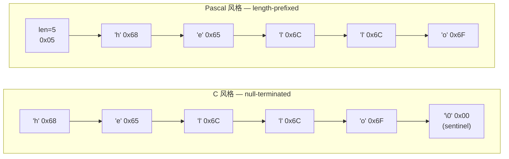
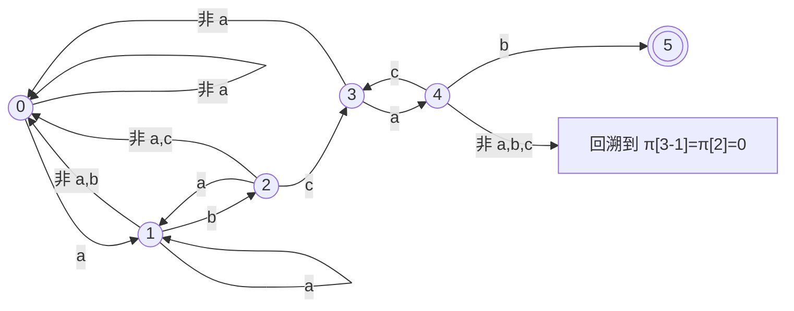
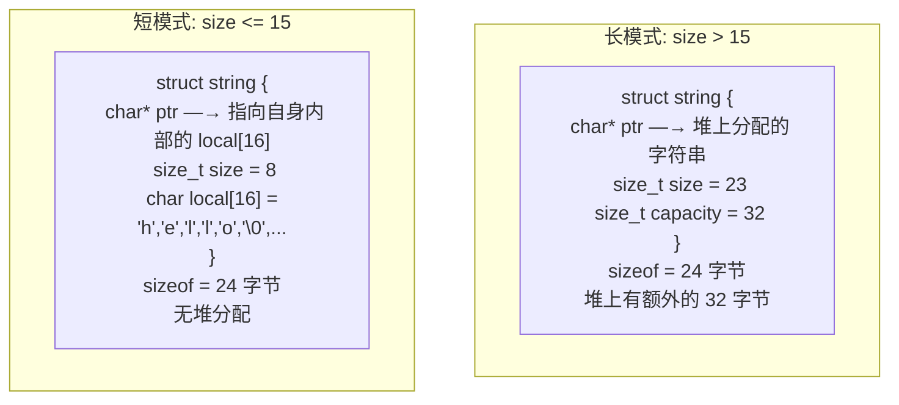
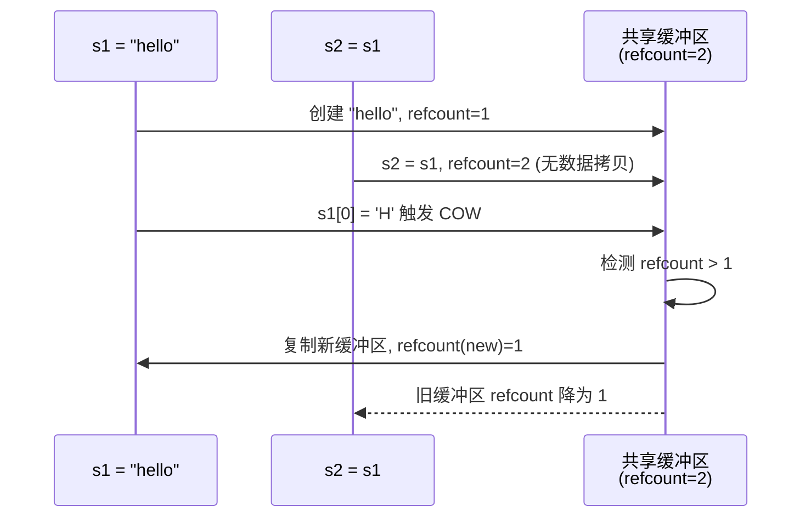

## 字符串 (String)

建议先阅读：[[A_数组_Array|数组]] — 字符串本质是字符数组，数组的缓存行为、寻址公式、边界问题在字符串中全部成立。

---

## 原理

### 什么是字符串：从直觉到形式化

先回答最基本的问题：**字符串是什么？**

日常语义里，字符串就是"一串文字"。但在数据结构层面，需要精确的定义：

> **字符串（String）是有限字符集 $\Sigma$ 上的有限序列**，记作 $s \in \Sigma^*$。
> 其中 $\Sigma$ 是字符的集合（如 ASCII 的 128 个字符、Unicode 的百万级码点），$\Sigma^*$ 表示 $\Sigma$ 上所有有限序列构成的集合（克莱尼星号闭包），空串 $\varepsilon$（长度为 0）也属于 $\Sigma^*$。

这个定义拆开看有三个要点：

1. **元素类型是字符**——字符串首先是数组。上一章的寻址公式在这里原样成立：
   $$
   \text{addr}(s, i) = \text{base} + i \times \text{sizeof(char)}
   $$
   只是 sizeof(char) 恒为 1，且字符数据天然连续，因此上一章讲的"顺序遍历吃满 cache line"在字符串上是默认成立的；
2. **长度是核心属性**——几乎所有字符串操作的复杂度都以长度 $n$ 为变量；
3. **"长度约定"使它成为独立的数据结构**——光有 char 数组还不够，数组本身不知道自己多长。字符串通过某种约定携带长度信息（C 用 `\0` 哨兵，Pascal 用长度前缀）。**字符串 = char 数组 + 长度约定**，这个约定正是下一节两条技术路线全部分歧的根源。

#### 形式化术语

设 $s = s[0..n-1]$，以下术语贯穿全章（也是 KMP、后缀结构的语言基础）：

| 术语 | 定义 | 示例（$s$ = `"abcab"`） |
|------|------|-------------------------|
| 前缀 Prefix | $s[0..k-1]$，$0 \le k \le n$ | `"a"`、`"abca"` |
| 后缀 Suffix | $s[n-k..n-1]$，$0 \le k \le n$ | `"b"`、`"cab"` |
| 子串 Substring | $s[i..j]$，连续一段 | `"bca"` |
| 子序列 Subsequence | 可跳字符但保序 | `"acb"` 是子序列但不是子串 |
| 真前缀/真后缀 | 不允许等于整串的前缀/后缀 | `"ab"` 是真前缀，`"abcab"` 不是 |
| Border | 既是真前缀又是真后缀的串 | `"ab"`——KMP 的 $\pi$ 数组就是在求每个前缀的最长 Border |

特别区分**子串与子序列**：子串必须连续（对应内存上一段连续区间），子序列允许跳过中间字符。本章后面的编辑距离/LCS 处理的是子序列层面的变换，KMP 和后缀数组处理的是子串层面的定位——混淆这两个词是字符串问题中最常见的审题错误。

### 两种基本表示

字符串在计算机史上有两条主线：C 的 null-terminated（以 `\0` 结尾）和 Pascal 的 length-prefixed（长度前缀）。这两种设计的深层分歧不在于"多一个字节存长度"，而在于对硬件、安全性、效率的不同权衡。

| | C 风格（Null-Terminated） | Pascal 风格（Length-Prefixed） |
|------|---------|---------|
| 长度记录 | `\0` (NUL, ASCII 0x00) 标记结束 | 开头若干字节存长度 |
| 获取长度 | $O(n)$ — 必须扫描到 `\0` | $O(1)$ — 读长度字段 |
| 最大长度 | 受地址空间限制，无理论上限 | 受长度字段位数限制（1B→255, 4B→4GB） |
| 可否包含 `\0` | 否 — 第一个 `\0` 被当作结束 | 是 — 长度独立于内容 |
| 代表 | C（`char*`）、Unix 文件路径 | C++ `std::string` (SSO 部分)、Pascal、Go、Rust |



C 选择 null-terminated 的原因可以追溯到 PDP-11 汇编指令：当时的字符串处理指令（如 `MOVC`）原生支持扫描到 NUL 为止。此外，每个字符串只浪费 1 字节（`\0`），对于内存只有 32KB 的机器是重要考虑。这个历史选择的影响延续至今——Linux 内核中的所有路径名、设备名、文件系统元数据全部使用 null-terminated 字符串。

Pascal 选择 length-prefixed 的理由是类型安全——字符串长度是类型的一部分，编译器可以静态检查越界。但受限于当时的 1 字节长度字段（最多 255 字符），这种设计在需要更长字符串的场景下捉襟见肘。

#### 现代折中：胖指针（Fat Pointer）

Go 的 `string` 和 Rust 的 `&str` 采用第三种方案——胖指针：

```c
// Go/Rust 的字符串在底层等效于：
struct string_ref {
 const char* ptr; // 指向字符数据的指针
 size_t len; // 字节长度（不含 \0）
};
```

每次传递字符串引用时，栈上多传一个 `size_t`（8 字节）。代价是函数调用的参数/返回值多占用一个寄存器或栈槽。收益是取长度 O(1)，且不需要 sentinel 字符。这个方案在现代 64 位地址空间下是明确的最优解——额外的 8 字节相较于指针本就占的 8 字节，边际成本很低。

### 字符串的存储方式

存储归纳为三类。按"内存从哪来、长度放哪、怎么链接"三个维度重新分类：

```c
// ① 定长顺序存储 —— 静态分配，超长截断
#define MAXLEN 255
typedef struct {
    char ch[MAXLEN + 1];     // 下标 0 存放串长（或弃用，ch[1..len] 存字符）
    int length;
} SString;

// ② 堆分配存储 —— 运行时 malloc，长度可变
typedef struct {
    char* ch;                // 按实际串长分配
    int length;
} HString;

// ③ 块链存储 —— 链表节点，每个节点装一个"字符块"
#define CHUNKSIZE 4          // 每节点存 4 个字符
typedef struct Chunk {
    char ch[CHUNKSIZE];
    struct Chunk* next;
} Chunk;                     // 另设头结点记录串长与首尾指针
```

| | 定长顺序 | 堆分配 | 块链 |
|---|---------|--------|------|
| 内存来源 | 编译期静态区/栈 | 堆（malloc/free） | 堆（节点逐个申请） |
| 最大长度 | MAXLEN 固定上限 | 仅受内存限制 | 仅受内存限制 |
| 取长度 | $O(1)$（length 字段） | $O(1)$ | $O(1)$（头结点记录） |
| 访问第 i 个字符 | $O(1)$ 直取 | $O(1)$ 直取 | $O(\lceil i/\text{CHUNKSIZE}\rceil)$ 顺链走 |
| 插入/删除 | 搬移后续元素，可能截断 | realloc 或搬移 | 改指针，块内整理 |
| 空间利用率 | 高，但有预留浪费 | 高（按需分配） | 受**存储密度**制约 |

块链的关键知识点是**存储密度**：

$$
\text{存储密度} = \frac{\text{数据本身所占字节}}{\text{结点总占用}} = \frac{\text{CHUNKSIZE}}{\text{CHUNKSIZE} + \text{sizeof(指针)}}
$$

64 位系统指针占 8B：CHUNKSIZE=4 时密度仅 $\frac{4}{12} \approx 33\%$；把块加大到 64，密度升至 $\frac{64}{72} \approx 89\%$。**块越小插删越灵活但密度越低；块越大越接近顺序存储**——这是链式结构"粒度换密度"的一般规律。


### 基本操作与真实成本

在进入算法之前，先把字符串 ADT 的基础操作过一遍。每个操作的成本直接由上一节的表示方式决定：

| 操作 | C 接口 | 语义 | 成本 | 备注 |
|------|--------|------|:----:|------|
| 取长度 | `strlen(s)` | 扫描到 `\0` | $O(n)$ | length-prefixed 表示下是 $O(1)$ |
| 取下标 | `s[i]` | 寻址公式直取 | $O(1)$ | 完整继承数组的随机访问能力 |
| 比较 | `strcmp(a,b)` | 逐字符比到首个差异或 `\0` | $O(\min(\lvert a\rvert,\lvert b\rvert))$ | 返回差值而非布尔值，见下 |
| 拼接 | `strcat(dst,src)` | 先扫 dst 尾再拷贝 src | $O(\lvert dst\rvert+\lvert src\rvert)$ | 每次 O(n) 是拼接陷阱的根源 |
| 拷贝 | `strcpy(dst,src)` | 逐字符复制直到 `\0` | $O(n)$ | 无边界检查版即缓冲区溢出之源 |
| 子串定位 | `strstr(h,n)` | 见下一节匹配算法 | $O(nm)$ 起 | BF→KMP/BM 的优化对象 |

两个值得展开的点：

**为什么 `strcmp` 返回 int 差值而不是 bool？** 因为排序和三路分支都需要"小于/等于/大于"三种信息——qsort 的比较函数约定、C++ 的 `operator<=>`、Java 的 `compareTo`、Rust 的 `Ord` 全部沿用这个设计。一个返回值承载三种语义，调用方按符号分派即可。

**拼接的二次方陷阱在所有表示上都存在**，只是形式不同：

```c
// 反例：strcat 每次都要从头扫描 dst 找尾部 —— 总计 O(n^2)
char buf[10240] = "";
for (int i = 0; i < 1000; i++)
    strcat(buf, "chunk");        // 第 i 轮扫描约 5*i 个字符

// 正解：自己维护写指针，追加 O(1) —— 这就是 StringBuilder 的手工版
size_t len = 0;
for (int i = 0; i < 1000; i++) {
    memcpy(buf + len, "chunk", 5);
    len += 5;                    // 写指针直接跳到尾部，不再扫描
}
```

Python/Java 的不可变字符串让这个问题更严重（每次拼接连旧串内容一起复制，详见下一节），所以标准库提供 `StringBuilder`、`io.StringIO`、`''.join(list)` 作为"写指针"的高层等价物。本质都一样：**把 n 次 O(n) 的追加摊还成 n 次 O(1)**。

### 不可变性

Java 和 Python 的字符串是不可变的（immutable），C 和 C++ 的字符串是可变的。这不是语法细节——它是数据结构设计的核心决策：

| | 不可变（Java `String`, Python `str`） | 可变（C `char[]`, C++ `std::string`） |
|------|---------|------|
| 修改开销 | 每次修改产生新副本，$O(n)$ 拷贝 | 原地修改，$O(1)$ 或 $O(n)$ 均在原缓冲区 |
| 哈希缓存 | 安全——不变，可哈希一次并永久缓存 `hashcode` | 危险——修改后哈希值改变，缓存即失效 |
| 线程安全 | 自然安全——不可变对象天然线程安全 | 需要手动同步 |
| 子串操作 | Java 7 前：`substring` 共享底层 `char[]`，O(1) 但潜在内存泄漏 | C++：`substr` 总是拷贝，O(n) |

不可变字符串的一个经典陷阱：在 Java 中拼接大量字符串时，`str = str + "x"` 每次循环都分配新 `String` 并复制旧内容，导致 $O(n^2)$ 的时间复杂度。`StringBuilder` 用可变缓冲区解决此问题——这揭示了"不可变"在函数式语义下的美好承诺与工程实践之间的矛盾。

### 字符串匹配

给定文本串 $T$（长度 $n$）和模式串 $P$（长度 $m$），找到 $P$ 在 $T$ 中的所有出现位置。这是计算机科学中研究最深的问题之一——从文本编辑器到网络入侵检测，从 DNA 序列比对到搜索引擎，字符串匹配无处不在。

#### BF 算法（Brute-Force）

最直觉的思路：从 $T$ 的每个位置 $i$ 出发，逐个字符与 $P$ 比较：

| 步 | i | 对齐位置 | T 片段 | P 片段 | 比较结果 |
|:--:|:-:|:--------:|:------:|:------:|:--------:|
| 1 | 0 | T[0..4] vs P | `ababc` | `abcab` | T[2]='a' ≠ P[2]='c'，失败 |
| 2 | 1 | T[1] vs P[0] | `b...` | `a...` | T[1]='b' ≠ P[0]='a'，失败 |
| 3 | 2 | T[2..6] vs P | `abcab` | `abcab` | 全部匹配，成功！ |

```c
// BF: O(n*m) 最坏情况
int bf_search(const char* T, int n, const char* P, int m) {
 for (int i = 0; i <= n - m; i++) {
 int j;
 for (j = 0; j < m; j++)
 if (T[i + j] != P[j])
 break;
 if (j == m) return i; // 匹配成功
 }
 return -1;
}
```

最坏情况 $O(n \cdot m)$：当 $T$ = `"aaaaaaaaaa"`，$P$ = `"aaaab"` 时，每次匹配到 $P$ 的最后一个字符才失败，$i$ 回溯后重复扫描已比对过的字符。BF 的瓶颈在于——失配时丢弃了已匹配部分的所有信息，将 $i$ 回退至 $i+1$ 重新开始。

**手算示范**：以 $T$ = `"ababcabcab"`、$P$ = `"abcab"` 为例（下标从 0 开始），BF 的完整比较轨迹：

| 起点 i | 比较过程 | 结果 |
|:-----:|----------|------|
| 0 | T[0]='a'=P[0]，T[1]='b'=P[1]，T[2]='a'≠P[2]='c' | 失败，共比较 3 次 |
| 1 | T[1]='b'≠P[0]='a' | 失败，共比较 1 次 |
| 2 | T[2..6]="abcab" 与 P 逐字符相等 | **匹配成功，返回 2**，共比较 5 次 |

$i$ 只回退到 $i+1$，$j$ 归零从头再比——第 0 步已经比对出的信息（T[0..1]="ab"）被完全丢弃。KMP 的全部价值就在于回收这份信息：失配在 P[2] 时其实无需移动 i，直接让模式串"滑"到正确位置继续。

**BF 轨迹书写**

| 起点 i | 比较过程 | 结果 |
|:-----:|----------|------|
| 0 | T[0]='a'≠P[0]='b' | 失败，1 次 |
| 1 | T[1]='a'≠P[0]='b' | 失败，1 次 |
| 2 | T[2]='b'=P[0]，T[3]='a'=P[1]，T[4]='b'≠P[2]='a' | 失败，3 次 |
| 3 | T[3]='a'≠P[0]='b' | 失败，1 次 |
| 4 | T[4..7]="baab" 全部相等 | **成功，返回 4**，共 4 次 |

总计 $1+1+3+1+4=10$ 次比较。注意：每次失败后是否记得 j 归零、i 只前进一位；第 i=2 步那种"匹配了前缀又断掉"的情形是失分重灾区——比较次数要按实际比对过的字符数写。

#### KMP 算法（Knuth-Morris-Pratt）

KMP 的核心洞察：失配时，已匹配的子串告诉我们模式串可以从哪里继续，文本指针不需要回退。

**前缀函数** $\pi$ 的数学定义：

对于模式串 $P$（长度 $m$），前缀函数 $\pi[k]$ 定义为：

$$
\pi[k] = \max \{ \ell < k+1 \mid P[0..\ell-1] = P[k+1-\ell..k] \}
$$

即 $P[0..k]$ 这个子串中，最长相等的真前缀和真后缀的长度（$k = 0, 1, \dots, m-1$）。

**示例**：$P = \text{"abcab"}$

| $k$ | $P[0..k]$ | 相等的前缀/后缀 | $\pi[k]$ |
|:---:|-----------|:--------------:|:--------:|
| 0 | `"a"` | 无（真前缀/真后缀必须比原串短） | 0 |
| 1 | `"ab"` | `"a"` ≠ `"b"` | 0 |
| 2 | `"abc"` | `"a"` ≠ `"c"`, `"ab"` ≠ `"bc"` | 0 |
| 3 | `"abca"` | `"a"` = `"a"` | 1 |
| 4 | `"abcab"` | `"ab"` = `"ab"` | 2 |

$\pi = [0, 0, 0, 1, 2]$

**$\pi$ 数组的递归计算**：

已知 $\pi[k-1]$（即 $P[0..k-1]$ 的最长 border 长度），求 $\pi[k]$：

$$
\pi[k] = \begin{cases}
\pi[k-1] + 1 & \text{若 } P[\pi[k-1]] = P[k] \\
\pi[\pi[k-1]-1] + 1 & \text{若上一步不等，继续回溯} \\
0 & \text{若回溯到底仍不等}
\end{cases}
$$

其中的递归回溯——`j = pi[j-1]`——之所以仍保持线性复杂度，是因为每次 j 回退都会严格缩短，而在整个循环中 j 只能被回退"已被增加过的"次数。总的说，j 最多被增加 m 次，最多被回退 m 次，总复杂度 $O(m)$。这个分析与 vector 扩容的均摊分析在数学上等同——"总操作数除以操作次数"不超过常数的思想。

**1-indexed 的 next 数组**

模式串下标从 1 开始，数组名叫 next：

$$
next[j] = \begin{cases} 0 & j = 1 \\ \text{Border}(P[1..j-1]) + 1 & 2 \le j \le m \end{cases}
$$

其中 $\text{Border}(P[1..j-1])$ 是子串 $P[1..j-1]$ 的最长相等真前后缀长度。它与本章 $\pi$ 数组只差一条平移公式：

$$
next[j] = \pi[j-2] + 1 \ (j \ge 2), \qquad next[1] = 0
$$

含义：$T[i] \ne P[j]$ 失配时，$j$ 直接跳到 $next[j]$ 继续比较；$next[j]=0$ 特殊地表示"模式串整体右移一位、$j$ 从头开始"。教材原貌的匹配循环：

```c
// 1-indexed 版本：T、P 的下标都从 1 开始
int kmp_index(SString* T, SString* P, int next[]) {
    int i = 1, j = 1;
    while (i <= T->length && j <= P->length) {
        if (j == 0 || T->ch[i] == P->ch[j]) { i++; j++; }
        else j = next[j];               // 失配：j 跳到 next[j]，i 不动
    }
    return j > P->length ? i - P->length : 0;   // 返回匹配起点（1-indexed）
}
```

**next 手算示范**：求 $P$ = `"abcab"` 的 next 数组——

| j | 看 P[1..j-1] | 最长相等真前后缀 | Border 长度 | next[j] |
|:-:|--------------|----------------|:-----------:|:-------:|
| 1 | （约定） | — | — | **0** |
| 2 | `"a"` | 无 | 0 | **1** |
| 3 | `"ab"` | 无 | 0 | **1** |
| 4 | `"abc"` | 无 | 0 | **1** |
| 5 | `"abca"` | `"a"` = `"a"` | 1 | **2** |

即 next = [0, 1, 1, 1, 2]。用平移公式验证：$\pi$ = [0,0,0,1,2] → next[5] = π[3]+1 = 1+1 = 2，与表格一致。

再练一个周期性强的：$P$ = `"aaaab"` → next = [0, 1, 2, 3, 4]，每个位置的 Border 都取到最大。**操作要领：盯住 P[1..j-1] 这一段，看首尾最多能重叠多长，加 1 即答案。**

**next 数组求解**


① $P$ = `"abab"`　② $P$ = `"aaab"`　③ $P$ = `"aaaa"`

答案：

| j | ① `"abab"` | ② `"aaab"` | ③ `"aaaa"` |
|:-:|:----------:|:----------:|:----------:|
| 1 | 0 | 0 | 0 |
| 2 | 1 | 1 | 1 |
| 3 | 1 | 2 | 2 |
| 4 | 2 | 3 | **3** |

第 ③ 题是经典陷阱：next[4] 看的是 P[1..3] = "aaa"，其最长相等**真**前后缀是 "aa"（长 2），所以 next[4] = 3——而不是 4。Border 必须是"真"前后缀，因此恒有 $next[j] \le j - 1$；若你算出某格等于 j 本身，说明把整个串当成了自己的 Border，必错。

**KMP 匹配过程的 DFA 视角**：

可以将模式串 $P$ 视为构造了一台确定有限自动机（DFA）：



状态 $j$ 表示"已匹配了 $P$ 的前 $j$ 个字符"。读入一个字符 $c$ 后，若 $c = P[j]$，转移到 $j+1$（匹配前进）；否则通过 $\pi$ 数组跳转到"次长可能的匹配位置"——这个跳转正好就是 $j \leftarrow \pi[j-1]$ 然后重新比较。

**为什么 KMP 是 $O(n+m)$**：

文本指针 $i$ 在整个过程中只增不减（从不回退）。模式指针 $j$ 每次增加至多 1（当 $T[i] = P[j]$），每次回退至少减少 1（$j = \pi[j-1]$）。由于 $\pi[j-1] < j$，$j$ 不会被回退到负数，也不会无限回退。在整个算法运行过程中，$j$ 的总增加量不超过 $n$，因此总回退量也不超过 $n$。加上构建 $\pi$ 的 $O(m)$ 类似分析，总复杂度 $O(n+m)$。

**完整匹配过程**

用上面求出的 next = [0, 1, 1, 1, 2]，在 $T$ = `"ababcabcab"` 中找 $P$ = `"abcab"`（下标从 1 开始）：

| 步骤 | 比较 | 结果 | 动作 |
|:---:|------|------|------|
| 1 | T[1]='a' = P[1] | 匹配 | i=2, j=2 |
| 2 | T[2]='b' = P[2] | 匹配 | i=3, j=3 |
| 3 | T[3]='a' ≠ P[3]='c' | 失配 | j = next[3] = 1（i 不动）|
| 4 | T[3]='a' = P[1] | 匹配 | i=4, j=2 |
| 5 | T[4]='b' = P[2] | 匹配 | i=5, j=3 |
| 6 | T[5]='c' = P[3] | 匹配 | i=6, j=4 |
| 7 | T[6]='a' = P[4] | 匹配 | i=7, j=5 |
| 8 | T[7]='b' = P[5] | 匹配 | i=8, j=6 > m，**匹配成功** |
| 9 | 返回起点 i − m = 8 − 5 = **3**（即 0 起算的位置 2）| 结束 | |

对照 BF 节的轨迹：同样的文本与模式，BF 第 0 步失配后 i 从 1 从头来；KMP 借助 next 把 j 回跳到 1、i 纹丝未动——省掉的正是那些注定失败的重复比较。

**KMP 轨迹书写**


① $T$ = `"aababa"`、$P$ = `"aba"`；② $T$ = `"abbababbab"`、$P$ = `"abab"`

答案:

① next = [0, 1, 2]。

| 步骤 | 比较 | 结果 | 动作 |
|:---:|------|------|------|
| 1 | T[1]='a' = P[1] | 匹配 | i=2, j=2 |
| 2 | T[2]='a' ≠ P[2]='b' | 失配 | j = next[2] = 1（i 不动）|
| 3 | T[2]='a' = P[1] | 匹配 | i=3, j=2 |
| 4 | T[3]='b' = P[2] | 匹配 | i=4, j=3 |
| 5 | T[4]='a' = P[3] | 匹配 | i=5, j=4 > m，**成功** |
| 6 | 起点 i − m = 5 − 3 = **2**（0 起算位置 1）| 结束 | |

② next = [0, 1, 1, 2]。

| 步骤 | 比较 | 结果 | 动作 |
|:---:|------|------|------|
| 1 | T[1]='a' = P[1] | 匹配 | i=2, j=2 |
| 2 | T[2]='b' = P[2] | 匹配 | i=3, j=3 |
| 3 | T[3]='b' ≠ P[3]='a' | 失配 | j = next[3] = 1 |
| 4 | T[3]='b' ≠ P[1]='a' | 失配 | j = next[1] = 0 → i=4, j=1 |
| 5 | T[4]='a' = P[1] | 匹配 | i=5, j=2 |
| 6 | T[5]='b' = P[2] | 匹配 | i=6, j=3 |
| 7 | T[6]='a' = P[3] | 匹配 | i=7, j=4 |
| 8 | T[7]='b' = P[4] | 匹配 | i=8, j=5 > m，**成功** |
| 9 | 起点 i − m = 8 − 4 = **4**（0 起算位置 3）| 结束 | |

② 的第 3-4 步是重点：j 连续两次回跳（3→1→0）时，**i 始终停在 3 没有动过**——这正是 KMP 与 BF 的分水岭。另外注意 j=0 时不再比较、直接 i++ 前进。

**nextval：改进的 next 数组**

next 有一个可优化的小缺陷：若 $P[j] = P[next[j]]$，跳过去之后拿同一个字符再比一次，必然再次失配。nextval 在构造阶段就把这类"无效跳跃"折叠掉：

$$
nextval[j] = \begin{cases} 0 & j = 1 \\ nextval[\,next[j]\,] & P[j] = P[next[j]] \\ next[j] & P[j] \ne P[next[j]] \end{cases}
$$

以 $P$ = `"aaaab"` 为例（next = [0,1,2,3,4]）：P[2..4] 都是 'a'，与各自 next 指向的字符相同，一路折叠成 0——失配时直接整体右移重开，不再做无谓比较；P[5]='b' 与 P[next[5]=4]='a' 不同，nextval[5] = next[5] = 4。最终：

| j | 1 | 2 | 3 | 4 | 5 |
|:-:|:-:|:-:|:-:|:-:|:-:|
| next | 0 | 1 | 2 | 3 | 4 |
| nextval | 0 | 0 | 0 | 0 | 4 |

**手算规则一句话：先照常写出 next；再从左往右扫一遍，凡是"自己 == 自己要跳去的位置上的字符"，就把该位置的 nextval 值抄过来，否则保留原 next 值。**

**nextval 求解**

① $P$ = `"abaabc"`　② $P$ = `"ababab"`——先求 next，再求 nextval。

答案：

| j | ① next | ① nextval | ② next | ② nextval |
|:-:|:------:|:---------:|:------:|:---------:|
| 1 | 0 | 0 | 0 | 0 |
| 2 | 1 | 1 | 1 | 1 |
| 3 | 1 | **0** | 1 | **0** |
| 4 | 2 | 2 | 2 | **1** |
| 5 | 2 | **1** | 3 | **0** |
| 6 | 3 | 3 | 4 | **1** |

② 是周期串的极致案例：P[3..6] 每个字符都等于它要跳去位置上的字符，于是逐格折叠成 [0,1,0,1,0,1]——失配时直接退回起点重开，一次多余的字符比较都不做。折叠要注意方向：必须从左往右算，因为 $nextval[j]$ 可能引用前面刚折叠过的结果（如 ① 的 j=5 引用了 nextval[2]=1）。

#### 扩展：其他匹配算法

| 算法 | 预处理 | 匹配 | 空间 | 核心思想 |
|------|:------:|:----:|:----:|---------|
| BF | — | $O(nm)$ | $O(1)$ | 逐个比对，失配回退起点 |
| KMP | $O(m)$ | $O(n)$ | $O(m)$ | 前缀函数：失配时跳过不可能起点的位置 |
| Boyer-Moore | $O(m+\|\Sigma\|)$ | 平均亚线性 | $O(\|\Sigma\|)$ | 从右向左比对，两个启发式规则跳过大量字符 |
| Rabin-Karp | $O(m)$ | 均摊 $O(n+m)$ | $O(1)$ | 哈希滚动：比较哈希值而非逐字符比对 |
| Sunday | $O(m+\|\Sigma\|)$ | 平均亚线性 | $O(\|\Sigma\|)$ | BM 的简化版，偏移表决定跳步 |

Boyer-Moore 是实践中最快的单模式匹配算法——它从模式串的尾部向前比对，利用"坏字符规则"（失配时根据失配字符在模式串中最右出现的位置决定跳跃）和"好后缀规则"（已匹配的后缀在模式串中有另一个出现位置，直接跳到该位置）。在大多数实际文本上，BM 只需要检查 $n$ 个字符中的一小部分，平均时间低于 $O(n)$。

Rabin-Karp 用滚动哈希（rolling hash）将字符串比较转化为哈希值比较：先计算 $P$ 的哈希，然后滑动窗口计算 $T$ 中每个长度 $m$ 的子串哈希（每次滑动 O(1) 更新），只有哈希匹配时才逐字符验证。适用于同时搜索多个模式串的场景——每个模式串存一个哈希值，一次扫描即可。

### 字符串上的动态规划：编辑距离与 LCS

把"两个字符串如何互相变化"建模为二维网格上的递推。这是动态规划最经典的应用场景之一。

#### 编辑距离（Levenshtein Distance）

定义 $dp[i][j]$ 为把 $A$ 的前 $i$ 个字符变成 $B$ 的前 $j$ 个字符所需的最少操作数，允许的操作为插入、删除、替换（各计 1）：

$$
dp[i][j] = \begin{cases}
j & i = 0 \\
i & j = 0 \\
dp[i-1][j-1] & A[i-1] = B[j-1] \quad (\text{字符相同，免费}) \\
1 + \min\begin{cases} dp[i-1][j] & \text{删除 } A[i-1] \\ dp[i][j-1] & \text{插入 } B[j-1] \\ dp[i-1][j-1] & \text{替换 } A[i-1]\end{cases} & A[i-1] \ne B[j-1]
\end{cases}
$$

以 $A$ = `"horse"`、$B$ = `"ros"` 为例的完整网格（行是 $A$ 的前缀，列是 $B$ 的前缀）：

|      | `""` | `r` | `o` | `s` |
|:----:|:----:|:---:|:---:|:---:|
| `""` |  0   |  1  |  2  |  3  |
| `h`  |  1   |  1  |  2  |  3  |
| `o`  |  2   |  2  |  1  |  2  |
| `r`  |  3   |  2  |  2  |  2  |
| `s`  |  4   |  3  |  3  |  2  |
| `e`  |  5   |  4  |  4  |  3  |

右下角 $dp[5][3] = 3$，对应变换路径：horse → rorse（替换 h→r）→ rose（删 r）→ ros（删 e）。

时间空间都是 $O(mn)$。注意到每个格子只依赖正上方、左方、左上三个邻居，空间可以滚动优化到 $O(\min(m,n))$：

```c
static inline int min3(int x, int y, int z) {
    int m = x < y ? x : y;
    return m < z ? m : z;
}

// 编辑距离 —— 滚动数组版，空间 O(m)
int min_distance(const char* a, int n, const char* b, int m) {
    int* dp = malloc((m + 1) * sizeof(int));
    for (int j = 0; j <= m; j++) dp[j] = j;    // 第 0 行：空串变成 B 前 j 个字符
    for (int i = 1; i <= n; i++) {
        int diag = dp[0];                      // diag = dp[i-1][j-1]，左上角
        dp[0] = i;                             // 第 i 行第 0 列：A 前 i 个变成空串
        for (int j = 1; j <= m; j++) {
            int up = dp[j];                    // up = dp[i-1][j]，正上方，先存后覆盖
            if (a[i-1] == b[j-1])
                dp[j] = diag;                  // 尾字符相同，免费继承左上
            else
                dp[j] = 1 + min3(diag, up, dp[j-1]);   // 替换 / 删除 / 插入
            diag = up;
        }
    }
    int ans = dp[m];
    free(dp);
    return ans;
}
```

编辑距离是拼写检查、DNA 序列比对（Smith-Waterman 局部对齐是它的变体）、模糊搜索的核心度量。

#### 最长公共子序列（LCS）

与编辑距离共用同一张网格，换一个问题：$dp[i][j]$ 记录 $A$ 前 $i$ 个与 $B$ 前 $j$ 个的**最长公共子序列长度**：

$$
dp[i][j] = \begin{cases}
dp[i-1][j-1] + 1 & A[i-1] = B[j-1] \\
\max(dp[i-1][j],\ dp[i][j-1]) & A[i-1] \ne B[j-1]
\end{cases}
$$

两者的深层关系：当只允许插入和删除时，$\text{editdist} = m + n - 2\cdot\text{LCS}$。它们共享同一个"$O(mn)$ 网格 + 三邻居依赖"框架，差别只在转移方程的聚合方向（min 还是 max）。这个模式还会出现在通配符匹配、文件 diff（GNU diff 的内核就是 LCS）等场景中。

```c
// LCS —— 滚动数组版，空间 O(min(m,n))
int lcs(const char* a, int n, const char* b, int m) {
    int* dp = malloc((m + 1) * sizeof(int));
    for (int j = 0; j <= m; j++) dp[j] = 0;
    for (int i = 1; i <= n; i++) {
        int diag = dp[0];
        for (int j = 1; j <= m; j++) {
            int up = dp[j];
            if (a[i-1] == b[j-1])
                dp[j] = diag + 1;
            else
                dp[j] = dp[j-1] > up ? dp[j-1] : up;
            diag = up;
        }
    }
    int ans = dp[m];
    free(dp);
    return ans;
}
```

> 注意 LCS 是**子序列**（可跳字符），而"最长公共**子串**"要求连续——后者用下一节的后缀数组可以高效求解。两个名字一字之差，做法完全不同。

**DP 网格填表**

给定两串，写出 DP 表格（或其前几行）

① 编辑距离：$A$ = `"ab"`、$B$ = `"ba"`，写出完整网格并给出距离。
② LCS：$A$ = `"abcde"`、$B$ = `"ace"`，写出完整网格并给出 LCS 长度。

答案：

①

|      | `""` | `b` | `a` |
|:----:|:----:|:---:|:---:|
| `""` |  0   |  1  |  2  |
| `a`  |  1   |  1  |  1  |
| `b`  |  2   |  1  |  2  |

距离 = **2**。自查要点：dp[1][1] 处 'a'≠'b'，取 $1+\min(\text{上}1,\text{左}1,\text{左上}0)=1$；dp[1][2] 处尾字符相同免费继承左上的 1；dp[2][2] 处 'b'≠'a' 取 $1+\min(1,1,1)=2$。顺手验证本章公式：$\text{LCS}(ab,ba)=1$，$m+n-2\text{LCS}=2+2-2=2$，与答案一致。

②

|      | `""` | `a` | `c` | `e` |
|:----:|:----:|:---:|:---:|:---:|
| `""` |  0   |  0  |  0  |  0  |
| `a`  |  0   |  1  |  1  |  1  |
| `b`  |  0   |  1  |  1  |  1  |
| `c`  |  0   |  1  |  2  |  2  |
| `d`  |  0   |  1  |  2  |  2  |
| `e`  |  0   |  1  |  2  |  3  |

LCS = **3**（即 "ace" 本身）。自查要点：字符相等时是 $dp[i-1][j-1]+1$ 而**不是** max 三邻居——这是与编辑距离最容易混的一格；不等时取上下、左右中的较大者。

### 后缀结构与后缀数组

KMP 解决的是"一个模式串在一篇文本中的定位"。如果要对**同一篇固定文本**反复查询任意子串（搜索引擎索引、DNA 库检索的场景），每次都跑一遍匹配就太慢了——正确姿势是对文本建立一次性的索引结构。后缀家族就是干这个的。

核心观察：文本 $T$ 的所有后缀包含了它的全部子串——任何子串都是某个后缀的前缀。把 $T$ 的 $n$ 个后缀按字典序排序，得到**后缀数组 sa**：$sa[k]$ 是字典序排名第 $k$ 的后缀的起始下标。

以 $T$ = `"banana"` 为例：

| 排名 $k$ | $sa[k]$ | 后缀 |
|:-------:|:-------:|------|
| 0 | 5 | `a` |
| 1 | 3 | `ana` |
| 2 | 1 | `anana` |
| 3 | 0 | `banana` |
| 4 | 4 | `na` |
| 5 | 2 | `nana` |

配套的 **LCP 数组**记录排名相邻两后缀的最长公共前缀长度：上表对应 lcp = `[—, 1, 3, 0, 0, 2]`（如 `ana` 与 `anana` 公共前缀 `"ana"` 长 3）。

有了这两张表，一批经典问题化为几次二分或一次线性扫描：

| 问题 | 做法 | 复杂度 |
|------|------|--------|
| 子串 $t$ 是否出现 | 二分查找：$t$ 与有序后缀比较 | $O(\lvert t\rvert \log n)$ |
| 子串出现次数 | 二分定出上下界之差 | $O(\lvert t\rvert \log n)$ |
| 最长重复子串 | $\max_k(\text{lcp}[k])$ | $O(n)$ |
| 两串最长公共子串 | 拼接后取跨界 max(lcp) | $O(n)$ |
| 不同子串总数 | $\frac{n(n+1)}{2} - \sum_k \text{lcp}[k]$ | $O(n)$ |

构造方法的复杂度阶梯：

| 方法 | 思路 | 复杂度 |
|------|------|--------|
| 直接排序 | $n$ 个后缀丢给 qsort，单次比较 $O(n)$ | $O(n^2 \log n)$ |
| 倍增法 Doubling | 按 $1, 2, 4, \dots$ 长度的排名迭代重排 | $O(n \log n)$ |
| SA-IS / DC3 | 线性构造 | $O(n)$ |

它的不变量非常干净："长度 $2k$ 片段的排名"由相邻两个"长度 $k$ 片段的排名"组成的二元组决定：

$$
rank_{2k}[i] = \text{sortkey}\big(rank_k[i],\ rank_k[i+k]\big)
$$

每轮做一次基数排序完成重排，共 $\log n$ 轮。它同时是理解后缀自动机、后缀树等更高级结构的台阶。

后缀家族的关系谱系：压缩后缀 Trie 得到后缀树（Ukkonen 算法可 $O(n)$ 构建），后缀树的边按字典序整理即得后缀数组。工程实践中后缀数组因内存紧凑、缓存友好而更常用；多模式串的在线匹配则交给 [[L_字典树_Trie|Trie 章节]]的 Aho-Corasick 自动机——它们共同构成"文本索引"主题的完整工具箱。

---

## 深入底层

### 字符串匹配的缓存行为

上一章用整整一节讲了缓存的层级与访问模式（[[A_数组_Array#缓存层级与访问模式|数组 — 缓存层级与访问模式]]），字符串作为 char 数组的特化，那些结论全部适用——而且能解释一个实践中常见的反常现象：**理论复杂度更优的算法不一定更快**。

三个匹配算法的访存模式完全不同：

**BF——教科书级的缓存友好。** 内层循环对 $T$ 和 $P$ 都是严格顺序访问，一条 64B 的 cache line 装 64 个 char，每 64 次比较只有 1 次 miss，L1 命中率约 98%；硬件预取器对步长为 1 的流式访问预测近乎完美。这就是 BF 在短模式串（$m \lesssim 32$）的实际运行中经常不输 KMP 的原因——每次失配虽然浪费了已比对的工作量，但每次比对本身便宜得惊人（L1 命中约 4 周期 vs 一次 L2 约 12 周期、主存约 100 周期）。

**KMP——文本顺序，π 表随机。** 文本指针 $i$ 只增不减、顺序扫过 $T$，这部分同样缓存友好；但失配时 `j = pi[j-1]` 是对 $\pi$ 数组的随机跳转。$\pi$ 数组只有 $m$ 个 int，通常整个装进 L1，实际开销可控；真正的隐藏成本是**分支预测失败**——`T[i] == P[j]` 与否高度不可预测，在流水线深度 15 左右的现代 CPU 上一次 mispredict 浪费 15-20 个周期，接近一次 L2 访问。KMP 相对 BF 省下的"重复比对"，有一部分被 mispredict 吃掉了。

**BM——跳跃访问，赢在少摸内存。** 坏字符规则的跳跃常常一次跨过若干 cache line，破坏预取器的等步长模型（预取器擅长连续流和固定 stride，不擅长随机大跳）。但 BM 的总触达字节数远小于前两者——平均只检查 $n/m$ 量级的字符，**摸过的 cache line 总数最少**，这一优势压倒了跳跃本身的代价。

| | BF | KMP | BM |
|---|---|---|---|
| 文本访问模式 | 严格顺序 | 顺序 | 大跨度跳跃 |
| 每次比对的 cache 成本 | 极低（~1 miss / 64 次） | 极低 | 触达行数最少 |
| 额外访存 | 无 | $\pi$ 数组随机跳转 | 坏字符表查表（256 项常驻 L1）|
| 分支可预测性 | 高 | 低（mispredict 密集） | 中 |
| 实践定位 | 短模式串够用 | 保证最坏线性 | 长模式串 + 自然文本最快 |

结论：当 $n$、$m$ 都不大时，缓存与分支预测把常数项拉平甚至反转，选 BF 完全合理；只有模式串长、文本量大时，BM/KMP 的渐近优势才能兑现实测收益。"换算法之前先看常数项"是性能工程的一般规律，字符串匹配是最典型的案例场。动手验证见本章实验 E4。

### 小字符串优化（SSO / Small String Optimization）

现代 C++ 的 `std::string` 实现（libstdc++ v5+、libc++、MSVC STL）都使用 SSO 避免短字符串的堆分配。以 libc++ 的实现为例：



核心技巧是 `union`：`capacity` 字段和 `local[16]` 共享同一块内存。两者的长度恰好相同（8 字节的 `size_t capacity` 和 16 字节的 `char local[16]`），但 union 的实际大小取决于较大者——`local[16]` 占 16 字节。对于长模式，这 16 字节存 capacity；对于短模式，`local[0..14]` 存 15 个字符，`local[15]` 存 `\0`。字符串总大小 24 字节（64 位系统：指针 8 + size 8 + local/capacity 16 → 共 32，但编译器可能因对齐把 size 和 capacity 合并）。

SSO 的阈值 15 不是随意选择的——它精确权衡了 `string` 对象总大小（对齐到 32 字节，即 64 位系统的两个 cache line 的一半）和能容纳的最长 ASCII 短字符串（15 个字符覆盖了绝大多数 JSON key、配置项名称、字段名等场景）。

**SSO 的性能影响**：
- 堆分配消除：跳过 `malloc` / `free` 约 50-200ns 的延迟
- Cache 局部性：字符串内容与字符串对象在同一 cache line 中，访问成本降低
- 复制加速：`std::string` 的拷贝在短模式下退化为 `memcpy` 32 字节

### Null-Terminated 的安全隐患

以 `\0` 为 sentinel 的设计导致了 C 语言史上最严重的安全漏洞类别——缓冲区溢出（buffer overflow）：

```c
// 不安全的字符串拼接
char dst[10] = "hello";
char src[] = "world!!!";
strcat(dst, src); // dst 只能存 10 字节，但最终需要 12 字节
// 溢出覆盖了栈上的其他变量，可能重写返回地址

// 不安全的字符串拷贝
char buf[64];
gets(buf); // 不检查长度，输入 1000 个字符照样写入
// 攻击者可通过此覆盖返回地址，劫持程序控制流
```

这些问题在硬件层面被利用的机制：栈帧上变量从低地址向高地址排列，但返回地址在更高地址。当 `strcpy` 从目标缓冲区的低地址向高地址写并溢出时，它覆写了返回地址。攻击者精心构造输入使得返回地址指向恶意代码（shellcode）或 ROP 链。现代防御措施包括栈 canary（在返回地址前插入随机值，函数返回前检查是否被破坏）、W^X（写和执行不可同时存在的内存页）、ASLR（随机化地址空间布局）。

安全使用 null-terminated 字符串的底线：
```c
strncpy(dst, src, sizeof(dst) - 1); // 永远留一个字节放 \0
dst[sizeof(dst) - 1] = '\0'; // 确保 null-terminated

snprintf(dst, sizeof(dst), "%s", src); // snprintf 始终保证 \0
```

### 宽字符与 Unicode 的底层

字符串的"字符"在底层没有统一的长度。UTF-8 可变长度编码设计精妙，让 ASCII 成为 UTF-8 的真子集：

**UTF-8 编码规则**：

| Unicode 码点范围 | UTF-8 字节序列 | 说明 |
|:----------------|:----------------------------|------|
| U+0000 – U+007F | `0xxxxxxx` | 1 字节，与 ASCII 完全兼容 |
| U+0080 – U+07FF | `110xxxxx 10xxxxxx` | 2 字节，覆盖拉丁扩展、希腊、阿拉伯 |
| U+0800 – U+FFFF | `1110xxxx 10xxxxxx 10xxxxxx` | 3 字节，CJK 汉字在此范围 |
| U+10000 – U+10FFFF | `11110xxx 10xxxxxx 10xxxxxx 10xxxxxx` | 4 字节，emoji、罕见汉字 |

每个后续字节的 `10` 前缀保证了反向扫描时不会将多字节序列的中间字节误认为一个字符的开始——这是 UTF-8 的自同步（self-synchronizing）特性。即使从流中间开始解析，最多扫描 3 字节就能确定字符边界。

**UTF-16 与代理对（Surrogate Pairs）**：

Java 和 Windows 内核使用 UTF-16，大多数字符占 2 字节。但对于 U+10000 以上的字符，UTF-16 用两个 16 位单元（代理对）表示。Java 的 `String.length()` 返回的是 UTF-16 单元数量而非真正的 Unicode 码点数量：

```java
String s = ""; // U+1F602, 占用 2 个 UTF-16 单元
s.length(); // = 2, 不是 1
s.codePointCount(0, s.length()); // = 1, 这才是真正的码点数
```

这种"一个字符占多个 `char` 单元"的行为是 Java 字符串函数中出现偏移量错误的常见原因。在 C 语言环境，使用 `wchar_t`（Linux 和 macOS 上是 32 位 UTF-32，Windows 上是 16 位 UTF-16）的跨平台代码面临同样的不一致。

### Copy-on-Write 字符串（历史教训）

C++98 时代的 libstdc++ 使用 COW（copy-on-write）实现 `std::string`。多个字符串对象可以共享同一块堆缓冲区，直到某个字符串尝试修改时才复制：



COW 在单线程下工作良好——当字符串拷贝频繁但修改稀少时，避免了大量不必要的堆分配。然而在多线程环境下，修改引用计数需要原子操作，每次拷贝（即使不修改）也需要原子地增加引用计数。在 C++11 引入移动语义后，COW 的性能优势被颠覆——`std::string` 可以"移动"而非复制，堆缓冲区所有权转移不需要引用计数。C++11 标准明确禁止了 COW 实现——`std::string` 上的 `operator[]` 不再允许共享缓冲区。

---

## 实现

### KMP 前缀函数与匹配

```c
#include <stdlib.h>
#include <string.h>

// 构建前缀函数 pi[0..m-1]
// pi[k] = P[0..k] 的最长相等真前后缀长度
void compute_pi(const char* P, int m, int* pi) {
 pi[0] = 0;
 int j = 0; // j = pi[k-1]
 for (int k = 1; k < m; k++) {
 while (j > 0 && P[k] != P[j])
 j = pi[j - 1]; // 递归回退：试次长 border
 if (P[k] == P[j])
 j++;
 pi[k] = j;
 }
}

// KMP 匹配：在 T 中找 P，返回匹配索引个数
int kmp_search(const char* T, int n, const char* P, int m, int* result) {
 int* pi = malloc(m * sizeof(int));
 compute_pi(P, m, pi);

 int count = 0, j = 0;
 for (int i = 0; i < n; i++) {
 while (j > 0 && T[i] != P[j])
 j = pi[j - 1];
 if (T[i] == P[j])
 j++;
 if (j == m) {
 result[count++] = i - m + 1;
 j = pi[j - 1]; // 继续搜索后继匹配
 }
 }
 free(pi);
 return count;
}

// KMP 计数：返回 P 在 T 中出现的次数
int kmp_count(const char* T, int n, const char* P, int m) {
 int* pi = malloc(m * sizeof(int));
 compute_pi(P, m, pi);
 int count = 0, j = 0;
 for (int i = 0; i < n; i++) {
 while (j > 0 && T[i] != P[j])
 j = pi[j - 1];
 if (T[i] == P[j])
 j++;
 if (j == m) {
 count++;
 j = pi[j - 1];
 }
 }
 free(pi);
 return count;
}

// 简单子串包含判断：返回 1 表示 P 出现在 T 中，0 表示未出现
int str_contains(const char* T, const char* P) {
 int n = strlen(T), m = strlen(P);
 if (m == 0) return 1;
 int* pi = malloc(m * sizeof(int));
 compute_pi(P, m, pi);
 int j = 0;
 for (int i = 0; i < n; i++) {
 while (j > 0 && T[i] != P[j])
 j = pi[j - 1];
 if (T[i] == P[j])
 j++;
 if (j == m) { free(pi); return 1; }
 }
 free(pi);
 return 0;
}
```

这段代码的核心在于 **`j` 的双重身份**——它既表示"已匹配的字符数"，又作为模式串中下一个待比较字符的下标。两个 while 嵌套看似 $O(m^2)$ 或 $O(n \cdot m)$，但均摊分析证明是线性的：`j` 在整个循环中至多被增加 n 次，每次回退至少减少 1，所以总体回退次数不超过总体增加次数。均摊思想的数学本质见 [[D_容器_Container#扩容因子的数学分析|容器章节 — 均摊思想]]。

### Boyer-Moore 坏字符规则（简版）

BM 的完整实现需要好后缀规则，但单靠坏字符规则已经展示了 BM 的核心思想——从右向左比对，利用失配字符的位置信息跳过大量字符：

```c
#define ALPHABET 256

// 坏字符表：每个字符在模式串中最右出现的位置（-1 表示不出现）
void build_bad_char(const char* P, int m, int bc[ALPHABET]) {
 for (int i = 0; i < ALPHABET; i++) bc[i] = -1;
 for (int i = 0; i < m; i++) bc[(unsigned char)P[i]] = i;
}

int bm_search(const char* T, int n, const char* P, int m) {
 int bc[ALPHABET];
 build_bad_char(P, m, bc);

 int i = 0;
 while (i <= n - m) {
 int j = m - 1;
 while (j >= 0 && T[i + j] == P[j]) j--; // 从右向左比对
 if (j < 0) return i; // 完全匹配
 // 坏字符规则：将模式串右移，使失配字符对齐到它在 P 中最右的匹配位置
 int shift = j - bc[(unsigned char)T[i + j]];
 i += (shift > 0) ? shift : 1;
 }
 return -1;
}
```

在实际英文文本上，BM 的坏字符规则平均跳过 $n/m$ 个字符——模式串越长，跳得越远。这个特性使得 BM 在搜索长模式串时远超 KMP。

### Boyer-Moore 好后缀规则

上面的简版只用坏字符规则。完整 BM 还有第二把武器——好后缀规则（good suffix rule）。

场景：从右向左比对时，后缀 $P[j+1..m-1]$ 已经匹配成功（这段就叫"好后缀"），随后 $T[i+j] \ne P[j]$ 失配。此时不要只盯着失配的那个坏字符，还要问：**模式串里有没有别的位置能接上这段好后缀？** 三条位移来源取最大：

1. 模式串中另有一段与好后缀完全相同的片段 → 对齐它；
2. 没有完整相同片段，但有模式串的**前缀**恰好等于好后缀的某个**后缀** → 让该前缀顶上来；
3. 都没有 → 整体滑过好后缀，移动 $m$ 位。

```c
// 好后缀表 gs[j]：失配在位置 j 时应右移的距离
void build_good_suffix(const char* P, int m, int* gs) {
    memset(gs, 0, m * sizeof(int));
    int* border = malloc((m + 1) * sizeof(int));   // 广义 border 辅助数组
    int i = m, j = m + 1;
    border[i] = j;
    while (i > 0) {                                // 步骤一：预处理广义 border
        while (j <= m && P[i-1] != P[j-1]) {
            if (gs[j] == 0) gs[j] = j - i;         // 情形 1/2 的位移
            j = border[j];
        }
        border[--i] = --j;
    }
    j = border[0];                                 // 步骤二：前缀兜底（情形 2）
    for (i = 0; i <= m; i++) {
        if (gs[i] == 0) gs[i] = j;
        if (i == j) j = border[j];
    }
    free(border);
}
```

匹配主循环改为 `shift = max(坏字符位移, gs[j])`，两者取大者。叠加好后缀规则后，BM 的最坏情况从 $O(nm)$ 改善到 $O(n+m)$，同时自然文本上的平均跳跃进一步提升——GNU grep 把 BM 选作默认引擎，靠的就是双规则叠加。

值得玩味的是：好后缀表的构建本质上又回到了 KMP 的 border 思想——"让模式串自己和自己做匹配"。两个看似相反的算法在最深处殊途同归。

### Rabin-Karp 滚动哈希

Rabin-Karp 的核心：用滚动哈希把子串比较转化为整数比较，哈希匹配时再逐字符验证。

```c
#define RK_BASE 256
#define RK_MOD  1000000007

// 计算 a^b mod RK_MOD
static long long rk_powmod(long long a, long long b) {
 long long res = 1;
 a %= RK_MOD;
 while (b > 0) {
 if (b & 1) res = res * a % RK_MOD;
 a = a * a % RK_MOD;
 b >>= 1;
 }
 return res;
}

// Rabin-Karp：返回匹配索引，未找到返回 -1
int rabin_karp(const char* T, int n, const char* P, int m) {
 if (m > n) return -1;
 long long h = rk_powmod(RK_BASE, m - 1);  // 最高位的权重
 long long p_hash = 0, t_hash = 0;

 // 计算模式串哈希和文本第一个窗口哈希
 for (int i = 0; i < m; i++) {
 p_hash = (p_hash * RK_BASE + P[i]) % RK_MOD;
 t_hash = (t_hash * RK_BASE + T[i]) % RK_MOD;
 }

 // 滑动窗口
 for (int i = 0; i <= n - m; i++) {
 if (p_hash == t_hash) {
 int j;
 for (j = 0; j < m; j++)
 if (T[i + j] != P[j]) break;
 if (j == m) return i;  // 哈希匹配且字符验证通过
 }
 // 滚动更新：移除 T[i]，加入 T[i+m]
 if (i < n - m) {
 t_hash = (t_hash - T[i] * h % RK_MOD + RK_MOD) % RK_MOD;
 t_hash = (t_hash * RK_BASE + T[i + m]) % RK_MOD;
 }
 }
 return -1;
}
```

### Sunday 算法

Sunday 是 BM 的简化版——失配时看**对齐位置后面的下一个字符**（即 $T[i+m]$），查偏移表决定跳跃距离。

```c
#define SUNDAY_ALPHABET 256

// 构建 Sunday 偏移表：每个字符在模式串中最右出现位置到串尾的距离+1
void build_sunday_shift(const char* P, int m, int shift[SUNDAY_ALPHABET]) {
 for (int i = 0; i < SUNDAY_ALPHABET; i++) shift[i] = m + 1;
 for (int i = 0; i < m; i++) shift[(unsigned char)P[i]] = m - i;
}

int sunday_search(const char* T, int n, const char* P, int m) {
 int shift[SUNDAY_ALPHABET];
 build_sunday_shift(P, m, shift);

 int i = 0;
 while (i <= n - m) {
 int j = 0;
 while (j < m && T[i + j] == P[j]) j++;
 if (j == m) return i;
 // 看对齐位置后的下一个字符，决定跳多远
 i += shift[(unsigned char)T[i + m]];
 }
 return -1;
}
```

---

## 各语言标准库对比

| 语言 | 字符串类型 | 底层表示 | 可变 | SSO | 说明 |
|------|----------|---------|:---:|:---:|------|
| C | `char*` / `char[]` | null-terminated | 是 | — | 无内置字符串类型 |
| C++ | `std::string` | 长度+容量+SSO | 是 | 15 字符 | libstdc++/libc++ 均启用 |
| Java | `String` | UTF-16, 不可变 | 否 | — | `StringBuilder` 用于拼接 |
| Python | `str` | 不可变, 长度记录 | 否 | — | 内部用柔性数组表示 |
| Rust | `&str` / `String` | 胖指针 / 堆分配 | `String` 可 | — | `&str` 是借用,无分配 |
| Go | `string` / `[]byte` | 胖指针(长度前缀) | `string` 否 | — | `strings.Builder` 可变构建 |

---

## 应用场景

- **编译器前端**：词法分析器（lexer）使用有限自动机——KMP 的 DFA 视角——逐个字符识别 token
- **入侵检测系统**：Snort/Suricata 规则引擎使用 Aho-Corasick（KMP 的多模式扩展）同时匹配数千条攻击特征
- **数据库**：B+Tree 的键比较、LIKE 模式匹配、全文检索的倒排索引都依赖高效的字符串操作
- **数据压缩**：LZ77/LZ78 家族用滑动窗口找"前面出现过的字符串"——本质上是 BM/KMP 的匹配逻辑在可变长度模式上的推广
- **文本编辑器**：查找/替换功能使用 BM（GNU grep 的核心算法），正则表达式引擎使用 Thompson NFA 或回溯匹配

---

## 练习

| 题号 | 题目 | 难度 | 知识点 |
|------|------|:----:|--------|
| [28](https://leetcode.cn/problems/find-the-index-of-the-first-occurrence-in-a-string/) | 找出字符串中第一个匹配项的下标 | 入门 | KMP / BF / BM |
| [14](https://leetcode.cn/problems/longest-common-prefix/) | 最长公共前缀 | 入门 | 前缀比较 |
| [459](https://leetcode.cn/problems/repeated-substring-pattern/) | 重复的子字符串 | 入门 | 前缀函数的周期性应用 |
| [151](https://leetcode.cn/problems/reverse-words-in-a-string/) | 反转字符串中的单词 | 中等 | 原地修改 |
| [72](https://leetcode.cn/problems/edit-distance/) | 编辑距离 | 中等 | 字符串 DP（滚动数组优化） |
| [1143](https://leetcode.cn/problems/longest-common-subsequence/) | 最长公共子序列 | 中等 | 字符串 DP |
| [1044](https://leetcode.cn/problems/longest-duplicate-substring/) | 最长重复子串 | 困难 | 后缀数组 / 二分+滚动哈希 |


---

## 动手实验

| 编号 | 题目 | 说明 |
|:----:|------|------|
| E1 | KMP vs BF vs BM 实测 | 对随机英文文本（取自维基百科 dump）和不同长度模式串（m=6,12,24,48），分别用 BF、KMP、BM 搜索 1000 次，绘制耗时-m 曲线。BM 在长模式串下应该显著快于 KMP |
| E2 | 小字符串优化 (SSO) 观察 | 使用 C++ `std::string` 对长度 1,8,15,16,64 的字符串各创建 10000 个。用 `valgrind --tool=massif` 观察堆分配总量变化——15 及以下应无堆分配 |
| E3 | 前缀函数与周期性 | 随机生成 100 组模式串，计算前缀函数。验证命题：若 $\pi[m-1] > 0$ 且 $m \bmod (m - \pi[m-1]) = 0$，则该串由周期子串重复构成。打印验证通过率 |
| E4 | 匹配算法的缓存行为实测 | 在 100MB 英文文本（维基百科 dump）上分别用 BF、KMP、BM 搜索一批真实单词，用 `perf stat -e cache-misses,branch-misses` 统计三个指标：总耗时、cache-miss、branch-misses。验证本章"深入底层"节的论断——BF 的 miss 率最低但总耗时未必最低，BM 触达的 cache line 最少；再用 m=4 与 m=32 两组模式串对比，观察常数项优势随 m 增大的消失 |
