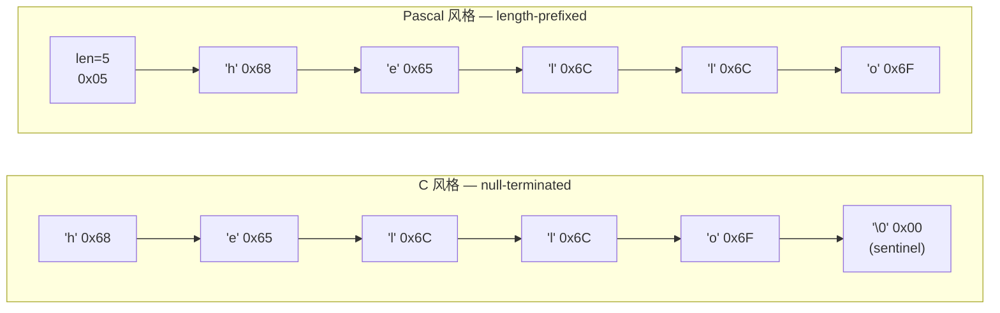
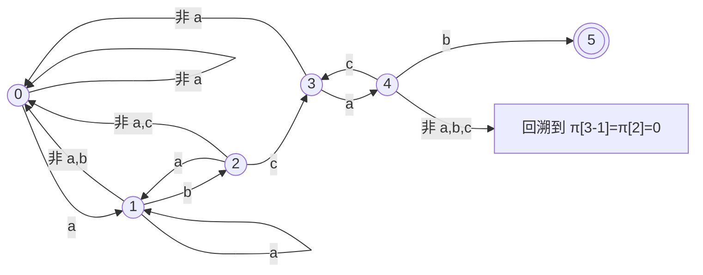
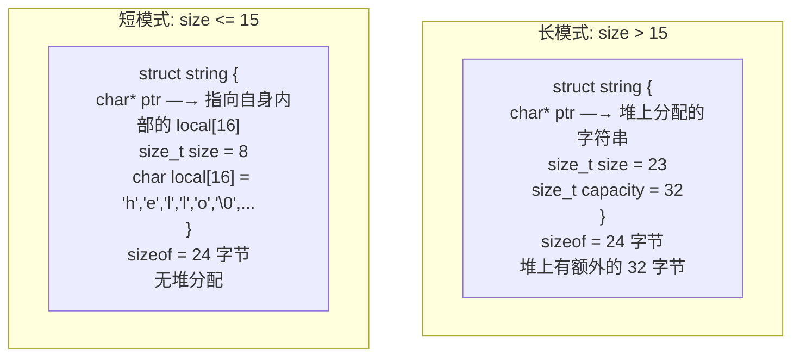
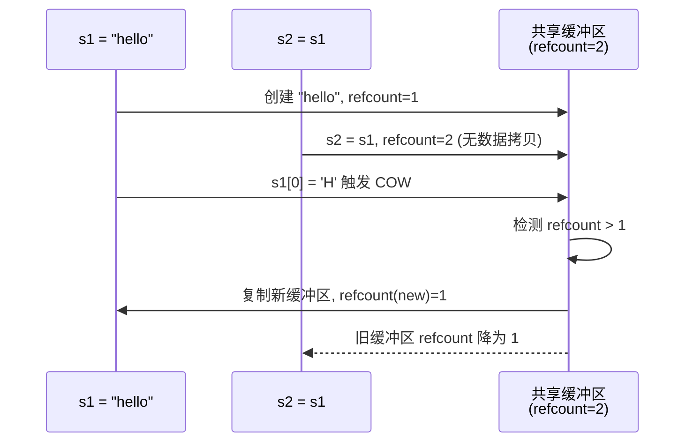

## 字符串 (String)

建议先阅读：[[A_数组_Array|数组]] — 字符串本质是字符数组，数组的缓存行为、寻址公式、边界问题在字符串中全部成立。

---

## 原理

### 两种基本表示

字符串在计算机史上有两条主线：C 的 null-terminated（以 `\0` 结尾）和 Pascal 的 length-prefixed（长度前缀）。这两种设计的深层分歧不在于"多一个字节存长度"，而在于对硬件、安全性、效率的不同权衡。

| | C 风格（Null-Terminated） | Pascal 风格（Length-Prefixed） |
|------|---------|---------|
| 长度记录 | `\0` (NUL, ASCII 0x00) 标记结束 | 开头若干字节存长度 |
| 获取长度 | $O(n)$ — 必须扫描到 `\0` | $O(1)$ — 读长度字段 |
| 最大长度 | 受地址空间限制，无理论上限 | 受长度字段位数限制（1B→255, 4B→4GB） |
| 可否包含 `\0` | 否 — 第一个 `\0` 被当作结束 | 是 — 长度独立于内容 |
| 代表 | C（`char*`）、Unix 文件路径 | C++ `std::string` (SSO 部分)、Pascal、Go、Rust |



C 选择 null-terminated 的原因可以追溯到 PDP-11 汇编指令：当时的字符串处理指令（如 `MOVC`）原生支持扫描到 NUL 为止。此外，每个字符串只浪费 1 字节（`\0`），对于内存只有 32KB 的机器是重要考虑。这个历史选择的影响延续至今——Linux 内核中的所有路径名、设备名、文件系统元数据全部使用 null-terminated 字符串。

Pascal 选择 length-prefixed 的理由是类型安全——字符串长度是类型的一部分，编译器可以静态检查越界。但受限于当时的 1 字节长度字段（最多 255 字符），这种设计在需要更长字符串的场景下捉襟见肘。

#### 现代折中：胖指针（Fat Pointer）

Go 的 `string` 和 Rust 的 `&str` 采用第三种方案——胖指针：

```c
// Go/Rust 的字符串在底层等效于：
struct string_ref {
    const char* ptr;   // 指向字符数据的指针
    size_t      len;   // 字节长度（不含 \0）
};
```

每次传递字符串引用时，栈上多传一个 `size_t`（8 字节）。代价是函数调用的参数/返回值多占用一个寄存器或栈槽。收益是取长度 O(1)，且不需要 sentinel 字符。这个方案在现代 64 位地址空间下是明确的最优解——额外的 8 字节相较于指针本就占的 8 字节，边际成本很低。

### 字符串匹配：从暴力到线性

给定文本串 $T$（长度 $n$）和模式串 $P$（长度 $m$），找到 $P$ 在 $T$ 中的所有出现位置。这是计算机科学中研究最深的问题之一——从文本编辑器到网络入侵检测，从 DNA 序列比对到搜索引擎，字符串匹配无处不在。

#### BF 算法（Brute-Force）

最直觉的思路：从 $T$ 的每个位置 $i$ 出发，逐个字符与 $P$ 比较：

```
T = "ababcabcab", P = "abcab"

i=0: T[0..4]="ababc" vs P="abcab" → T[2]='a' ≠ P[2]='c', 失败
i=1: T[1]='b' ≠ P[0]='a', 失败
i=2: T[2..6]="abcab" vs P="abcab" → 匹配成功, i=2
...
```

```c
// BF: O(n*m) 最坏情况
int bf_search(const char* T, int n, const char* P, int m) {
    for (int i = 0; i <= n - m; i++) {
        int j;
        for (j = 0; j < m; j++)
            if (T[i + j] != P[j])
                break;
        if (j == m) return i;  // 匹配成功
    }
    return -1;
}
```

最坏情况 $O(n \cdot m)$：当 $T$ = `"aaaaaaaaaa"`，$P$ = `"aaaab"` 时，每次匹配到 $P$ 的最后一个字符才失败，$i$ 回溯后重复扫描已比对过的字符。BF 的瓶颈在于——失配时丢弃了已匹配部分的所有信息，将 $i$ 回退至 $i+1$ 重新开始。

#### KMP 算法（Knuth-Morris-Pratt）

KMP 的核心洞察：失配时，已匹配的子串告诉我们模式串可以从哪里继续，文本指针不需要回退。

**前缀函数** $\pi$ 的数学定义：

对于模式串 $P$（长度 $m$），前缀函数 $\pi[k]$ 定义为：

$$
\pi[k] = \max \{ \ell < k+1 \mid P[0..\ell-1] = P[k+1-\ell..k] \}
$$

即 $P[0..k]$ 这个子串中，最长相等的真前缀和真后缀的长度（$k = 0, 1, \dots, m-1$）。

**示例**：$P = \text{"abcab"}$

| $k$ | $P[0..k]$ | 相等的前缀/后缀 | $\pi[k]$ |
|:---:|-----------|:--------------:|:--------:|
| 0 | `"a"` | 无（真前缀/真后缀必须比原串短） | 0 |
| 1 | `"ab"` | `"a"` ≠ `"b"` | 0 |
| 2 | `"abc"` | `"a"` ≠ `"c"`, `"ab"` ≠ `"bc"` | 0 |
| 3 | `"abca"` | `"a"` = `"a"` | 1 |
| 4 | `"abcab"` | `"ab"` = `"ab"` | 2 |

$\pi = [0, 0, 0, 1, 2]$

**$\pi$ 数组的递归计算**：

已知 $\pi[k-1]$（即 $P[0..k-1]$ 的最长 border 长度），求 $\pi[k]$：

$$
\pi[k] = \begin{cases}
\pi[k-1] + 1 & \text{若 } P[\pi[k-1]] = P[k] \\
\pi[\pi[k-1]-1] + 1 & \text{若上一步不等，继续回溯} \\
0 & \text{若回溯到底仍不等}
\end{cases}
$$

其中的递归回溯——`j = pi[j-1]`——之所以仍保持线性复杂度，是因为每次 j 回退都会严格缩短，而在整个循环中 j 只能被回退"已被增加过的"次数。总的说，j 最多被增加 m 次，最多被回退 m 次，总复杂度 $O(m)$。这个分析与 vector 扩容的均摊分析在数学上等同——"总操作数除以操作次数"不超过常数的思想。

**KMP 匹配过程的 DFA 视角**：

可以将模式串 $P$ 视为构造了一台确定有限自动机（DFA）：



状态 $j$ 表示"已匹配了 $P$ 的前 $j$ 个字符"。读入一个字符 $c$ 后，若 $c = P[j]$，转移到 $j+1$（匹配前进）；否则通过 $\pi$ 数组跳转到"次长可能的匹配位置"——这个跳转正好就是 $j \leftarrow \pi[j-1]$ 然后重新比较。

**为什么 KMP 是 $O(n+m)$**：

文本指针 $i$ 在整个过程中只增不减（从不回退）。模式指针 $j$ 每次增加至多 1（当 $T[i] = P[j]$），每次回退至少减少 1（$j = \pi[j-1]$）。由于 $\pi[j-1] < j$，$j$ 不会被回退到负数，也不会无限回退。在整个算法运行过程中，$j$ 的总增加量不超过 $n$，因此总回退量也不超过 $n$。加上构建 $\pi$ 的 $O(m)$ 类似分析，总复杂度 $O(n+m)$。

#### 扩展：其他匹配算法

| 算法 | 预处理 | 匹配 | 空间 | 核心思想 |
|------|:------:|:----:|:----:|---------|
| BF | — | $O(nm)$ | $O(1)$ | 逐个比对，失配回退起点 |
| KMP | $O(m)$ | $O(n)$ | $O(m)$ | 前缀函数：失配时跳过不可能起点的位置 |
| Boyer-Moore | $O(m+\|\Sigma\|)$ | 平均亚线性 | $O(\|\Sigma\|)$ | 从右向左比对，两个启发式规则跳过大量字符 |
| Rabin-Karp | $O(m)$ | 均摊 $O(n+m)$ | $O(1)$ | 哈希滚动：比较哈希值而非逐字符比对 |
| Sunday | $O(m+\|\Sigma\|)$ | 平均亚线性 | $O(\|\Sigma\|)$ | BM 的简化版，偏移表决定跳步 |

Boyer-Moore 是实践中最快的单模式匹配算法——它从模式串的尾部向前比对，利用"坏字符规则"（失配时根据失配字符在模式串中最右出现的位置决定跳跃）和"好后缀规则"（已匹配的后缀在模式串中有另一个出现位置，直接跳到该位置）。在大多数实际文本上，BM 只需要检查 $n$ 个字符中的一小部分，平均时间低于 $O(n)$。

Rabin-Karp 用滚动哈希（rolling hash）将字符串比较转化为哈希值比较：先计算 $P$ 的哈希，然后滑动窗口计算 $T$ 中每个长度 $m$ 的子串哈希（每次滑动 O(1) 更新），只有哈希匹配时才逐字符验证。适用于同时搜索多个模式串的场景——每个模式串存一个哈希值，一次扫描即可。

### 不可变性之争

Java 和 Python 的字符串是不可变的（immutable），C 和 C++ 的字符串是可变的。这不是语法细节——它是数据结构设计的核心决策：

|  | 不可变（Java `String`, Python `str`） | 可变（C `char[]`, C++ `std::string`） |
|------|---------|------|
| 修改开销 | 每次修改产生新副本，$O(n)$ 拷贝 | 原地修改，$O(1)$ 或 $O(n)$ 均在原缓冲区 |
| 哈希缓存 | 安全——不变，可哈希一次并永久缓存 `hashcode` | 危险——修改后哈希值改变，缓存即失效 |
| 线程安全 | 自然安全——不可变对象天然线程安全 | 需要手动同步 |
| 子串操作 | Java 7 前：`substring` 共享底层 `char[]`，O(1) 但潜在内存泄漏 | C++：`substr` 总是拷贝，O(n) |

不可变字符串的一个经典陷阱：在 Java 中拼接大量字符串时，`str = str + "x"` 每次循环都分配新 `String` 并复制旧内容，导致 $O(n^2)$ 的时间复杂度。`StringBuilder` 用可变缓冲区解决此问题——这揭示了"不可变"在函数式语义下的美好承诺与工程实践之间的矛盾。

---

## 深入底层

### 小字符串优化（SSO / Small String Optimization）

现代 C++ 的 `std::string` 实现（libstdc++ v5+、libc++、MSVC STL）都使用 SSO 避免短字符串的堆分配。以 libc++ 的实现为例：



核心技巧是 `union`：`capacity` 字段和 `local[16]` 共享同一块内存。两者的长度恰好相同（8 字节的 `size_t capacity` 和 16 字节的 `char local[16]`），但 union 的实际大小取决于较大者——`local[16]` 占 16 字节。对于长模式，这 16 字节存 capacity；对于短模式，`local[0..14]` 存 15 个字符，`local[15]` 存 `\0`。字符串总大小 24 字节（64 位系统：指针 8 + size 8 + local/capacity 16 → 共 32，但编译器可能因对齐把 size 和 capacity 合并）。

SSO 的阈值 15 不是随意选择的——它精确权衡了 `string` 对象总大小（对齐到 32 字节，即 64 位系统的两个 cache line 的一半）和能容纳的最长 ASCII 短字符串（15 个字符覆盖了绝大多数 JSON key、配置项名称、字段名等场景）。

**SSO 的性能影响**：
- 堆分配消除：跳过 `malloc` / `free` 约 50-200ns 的延迟
- Cache 局部性：字符串内容与字符串对象在同一 cache line 中，访问成本降低
- 复制加速：`std::string` 的拷贝在短模式下退化为 `memcpy` 32 字节

### Null-Terminated 的安全隐患

以 `\0` 为 sentinel 的设计导致了 C 语言史上最严重的安全漏洞类别——缓冲区溢出（buffer overflow）：

```c
// 不安全的字符串拼接
char dst[10] = "hello";
char src[] = "world!!!";
strcat(dst, src);  // dst 只能存 10 字节，但最终需要 12 字节
// 溢出覆盖了栈上的其他变量，可能重写返回地址

// 不安全的字符串拷贝
char buf[64];
gets(buf);  // 不检查长度，输入 1000 个字符照样写入
// 攻击者可通过此覆盖返回地址，劫持程序控制流
```

这些问题在硬件层面被利用的机制：栈帧上变量从低地址向高地址排列，但返回地址在更高地址。当 `strcpy` 从目标缓冲区的低地址向高地址写并溢出时，它覆写了返回地址。攻击者精心构造输入使得返回地址指向恶意代码（shellcode）或 ROP 链。现代防御措施包括栈 canary（在返回地址前插入随机值，函数返回前检查是否被破坏）、W^X（写和执行不可同时存在的内存页）、ASLR（随机化地址空间布局）。

安全使用 null-terminated 字符串的底线：
```c
strncpy(dst, src, sizeof(dst) - 1);  // 永远留一个字节放 \0
dst[sizeof(dst) - 1] = '\0';         // 确保 null-terminated

snprintf(dst, sizeof(dst), "%s", src);  // snprintf 始终保证 \0
```

### 宽字符与 Unicode 的底层

字符串的"字符"在底层没有统一的长度。UTF-8 可变长度编码设计精妙，让 ASCII 成为 UTF-8 的真子集：

**UTF-8 编码规则**：

| Unicode 码点范围 | UTF-8 字节序列 | 说明 |
|:----------------|:----------------------------|------|
| U+0000 – U+007F | `0xxxxxxx` | 1 字节，与 ASCII 完全兼容 |
| U+0080 – U+07FF | `110xxxxx 10xxxxxx` | 2 字节，覆盖拉丁扩展、希腊、阿拉伯 |
| U+0800 – U+FFFF | `1110xxxx 10xxxxxx 10xxxxxx` | 3 字节，CJK 汉字在此范围 |
| U+10000 – U+10FFFF | `11110xxx 10xxxxxx 10xxxxxx 10xxxxxx` | 4 字节，emoji、罕见汉字 |

每个后续字节的 `10` 前缀保证了反向扫描时不会将多字节序列的中间字节误认为一个字符的开始——这是 UTF-8 的自同步（self-synchronizing）特性。即使从流中间开始解析，最多扫描 3 字节就能确定字符边界。

**UTF-16 与代理对（Surrogate Pairs）**：

Java 和 Windows 内核使用 UTF-16，大多数字符占 2 字节。但对于 U+10000 以上的字符，UTF-16 用两个 16 位单元（代理对）表示。Java 的 `String.length()` 返回的是 UTF-16 单元数量而非真正的 Unicode 码点数量：

```java
String s = "😂";              // U+1F602, 占用 2 个 UTF-16 单元
s.length();                  // = 2, 不是 1
s.codePointCount(0, s.length()); // = 1, 这才是真正的码点数
```

这种"一个字符占多个 `char` 单元"的行为是 Java 字符串函数中出现偏移量错误的常见原因。在 C 语言环境，使用 `wchar_t`（Linux 和 macOS 上是 32 位 UTF-32，Windows 上是 16 位 UTF-16）的跨平台代码面临同样的不一致。

### Copy-on-Write 字符串（历史教训）

C++98 时代的 libstdc++ 使用 COW（copy-on-write）实现 `std::string`。多个字符串对象可以共享同一块堆缓冲区，直到某个字符串尝试修改时才复制：



COW 在单线程下工作良好——当字符串拷贝频繁但修改稀少时，避免了大量不必要的堆分配。然而在多线程环境下，修改引用计数需要原子操作，每次拷贝（即使不修改）也需要原子地增加引用计数。在 C++11 引入移动语义后，COW 的性能优势被颠覆——`std::string` 可以"移动"而非复制，堆缓冲区所有权转移不需要引用计数。C++11 标准明确禁止了 COW 实现——`std::string` 上的 `operator[]` 不再允许共享缓冲区。

---

## 实现

### KMP 前缀函数与匹配

```c
#include <stdlib.h>
#include <string.h>

// 构建前缀函数 pi[0..m-1]
// pi[k] = P[0..k] 的最长相等真前后缀长度
void compute_pi(const char* P, int m, int* pi) {
    pi[0] = 0;
    int j = 0;                    // j = pi[k-1]
    for (int k = 1; k < m; k++) {
        while (j > 0 && P[k] != P[j])
            j = pi[j - 1];        // 递归回退：试次长 border
        if (P[k] == P[j])
            j++;
        pi[k] = j;
    }
}

// KMP 匹配：在 T 中找 P，返回匹配索引个数
int kmp_search(const char* T, int n, const char* P, int m, int* result) {
    int* pi = malloc(m * sizeof(int));
    compute_pi(P, m, pi);

    int count = 0, j = 0;
    for (int i = 0; i < n; i++) {
        while (j > 0 && T[i] != P[j])
            j = pi[j - 1];
        if (T[i] == P[j])
            j++;
        if (j == m) {
            result[count++] = i - m + 1;
            j = pi[j - 1];        // 继续搜索后继匹配
        }
    }
    free(pi);
    return count;
}
```

这段代码的核心在于 **`j` 的双重身份**——它既表示"已匹配的字符数"，又作为模式串中下一个待比较字符的下标。两个 while 嵌套看似 $O(m^2)$ 或 $O(n \cdot m)$，但均摊分析证明是线性的：`j` 在整个循环中至多被增加 n 次，每次回退至少减少 1，所以总体回退次数不超过总体增加次数。均摊思想的数学本质见 [[D_容器_Container#扩容因子的数学分析|容器章节 — 均摊思想]]。

### Boyer-Moore 坏字符规则（简版）

BM 的完整实现需要好后缀规则，但单靠坏字符规则已经展示了 BM 的核心思想——从右向左比对，利用失配字符的位置信息跳过大量字符：

```c
#define ALPHABET 256

// 坏字符表：每个字符在模式串中最右出现的位置（-1 表示不出现）
void build_bad_char(const char* P, int m, int bc[ALPHABET]) {
    for (int i = 0; i < ALPHABET; i++) bc[i] = -1;
    for (int i = 0; i < m; i++)      bc[(unsigned char)P[i]] = i;
}

int bm_search(const char* T, int n, const char* P, int m) {
    int bc[ALPHABET];
    build_bad_char(P, m, bc);

    int i = 0;
    while (i <= n - m) {
        int j = m - 1;
        while (j >= 0 && T[i + j] == P[j]) j--;  // 从右向左比对
        if (j < 0) return i;                       // 完全匹配
        // 坏字符规则：将模式串右移，使失配字符对齐到它在 P 中最右的匹配位置
        int shift = j - bc[(unsigned char)T[i + j]];
        i += (shift > 0) ? shift : 1;
    }
    return -1;
}
```

在实际英文文本上，BM 的坏字符规则平均跳过 $n/m$ 个字符——模式串越长，跳得越远。这个特性使得 BM 在搜索长模式串时远超 KMP。

---

## 各语言标准库对比

| 语言 | 字符串类型 | 底层表示 | 可变 | SSO | 说明 |
|------|----------|---------|:---:|:---:|------|
| C | `char*` / `char[]` | null-terminated | 是 | — | 无内置字符串类型 |
| C++ | `std::string` | 长度+容量+SSO | 是 | 15 字符 | libstdc++/libc++ 均启用 |
| Java | `String` | UTF-16, 不可变 | 否 | — | `StringBuilder` 用于拼接 |
| Python | `str` | 不可变, 长度记录 | 否 | — | 内部用柔性数组表示 |
| Rust | `&str` / `String` | 胖指针 / 堆分配 | `String` 可 | — | `&str` 是借用,无分配 |
| Go | `string` / `[]byte` | 胖指针(长度前缀) | `string` 否 | — | `strings.Builder` 可变构建 |

---

## 应用场景

- **编译器前端**：词法分析器（lexer）使用有限自动机——KMP 的 DFA 视角——逐个字符识别 token
- **入侵检测系统**：Snort/Suricata 规则引擎使用 Aho-Corasick（KMP 的多模式扩展）同时匹配数千条攻击特征
- **数据库**：B+Tree 的键比较、LIKE 模式匹配、全文检索的倒排索引都依赖高效的字符串操作
- **数据压缩**：LZ77/LZ78 家族用滑动窗口找"前面出现过的字符串"——本质上是 BM/KMP 的匹配逻辑在可变长度模式上的推广
- **文本编辑器**：查找/替换功能使用 BM（GNU grep 的核心算法），正则表达式引擎使用 Thompson NFA 或回溯匹配

---

## 练习

| 题号 | 题目 | 难度 | 知识点 |
|------|------|:----:|--------|
| [28](https://leetcode.cn/problems/find-the-index-of-the-first-occurrence-in-a-string/) | 找出字符串中第一个匹配项的下标 | 入门 | KMP / BF / BM |
| [14](https://leetcode.cn/problems/longest-common-prefix/) | 最长公共前缀 | 入门 | 前缀比较 |
| [459](https://leetcode.cn/problems/repeated-substring-pattern/) | 重复的子字符串 | 入门 | 前缀函数的周期性应用 |
| [151](https://leetcode.cn/problems/reverse-words-in-a-string/) | 反转字符串中的单词 | 中等 | 原地修改 |

---

## 动手实验

| 编号 | 题目 | 说明 |
|:----:|------|------|
| E1 | KMP vs BF vs BM 实测 | 对随机英文文本（取自维基百科 dump）和不同长度模式串（m=6,12,24,48），分别用 BF、KMP、BM 搜索 1000 次，绘制耗时-m 曲线。BM 在长模式串下应该显著快于 KMP |
| E2 | 小字符串优化 (SSO) 观察 | 使用 C++ `std::string` 对长度 1,8,15,16,64 的字符串各创建 10000 个。用 `valgrind --tool=massif` 观察堆分配总量变化——15 及以下应无堆分配 |
| E3 | 前缀函数与周期性 | 随机生成 100 组模式串，计算前缀函数。验证命题：若 $\pi[m-1] > 0$ 且 $m \bmod (m - \pi[m-1]) = 0$，则该串由周期子串重复构成。打印验证通过率 |
