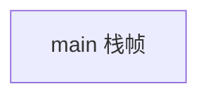
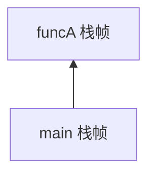
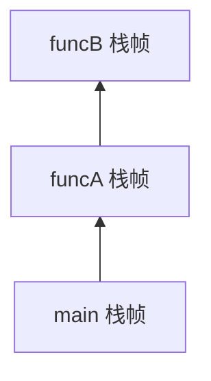
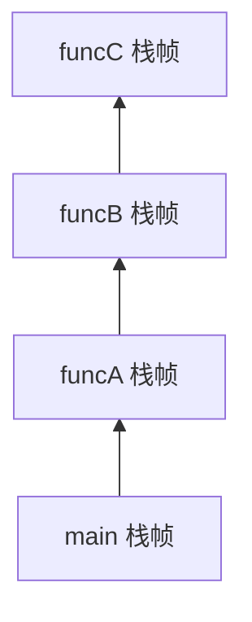

---
数据结构教程 — 栈 (Stack)
---

##  章节概述

栈（Stack）是一种受限的线性数据结构，它遵循"后进先出"（LIFO, Last In First Out）
的原则。栈在计算机科学中有着极其广泛的应用：函数调用栈、表达式求值、括号匹配、
浏览器的后退功能、撤销操作等。

本章将从栈的基本概念出发，深入栈的底层实现原理，全面覆盖栈的所有用法，
最后通过实例和习题巩固所学知识。

>  **底层实现参考**：如果需要深入理解本章数据结构的底层实现（纯C手写、内存布局、指针操作），请参阅 [[../../C语言深化教程/3数据结构/03_栈|C语言教程: 栈]]。C教程侧重手动实现与内存本质，本教程侧重数据结构与算法原理，两者互补。

---
###  第一节: 基础语法 + 计算机底层原理
---

1.1 栈的基本概念
--------------------

栈是一种只能在一端（称为"栈顶"）进行插入和删除操作的线性表。

核心操作：
- push  : 将元素压入栈顶
- pop   : 弹出栈顶元素
- top   : 获取栈顶元素（不弹出）
- empty : 判断栈是否为空
- size  : 返回栈中元素个数

最基础的栈使用示例：

```pseudocode
stack = NEW Stack()

// 压栈
stack.push(10)
stack.push(20)
stack.push(30)

// 访问栈顶
PRINT "栈顶元素: " + stack.top()   // 30

// 弹栈
stack.pop()
PRINT "弹出一个元素后栈顶: " + stack.top()   // 20

// 大小
PRINT "栈大小: " + stack.size()   // 2

// 遍历并清空
WHILE NOT stack.empty():
    PRINT stack.top() + " "
    stack.pop()
END WHILE
```

1.2 栈的底层原理：函数调用栈
---------------------------------

栈的数据结构在计算机底层有着直接的硬件支持——这就是"调用栈"（Call Stack）。

当一个函数被调用时，系统会在调用栈上分配一个"栈帧"（Stack Frame），用于存储：
- 函数的局部变量
- 函数的参数
- 返回地址（函数执行完毕后跳转的位置）
- 保存的寄存器状态

函数调用结束时，栈帧被弹出，控制权返回到调用者。

```pseudocode
FUNCTION funcC():
    PRINT "funcC 被调用"
    // funcC的栈帧: 局部变量 + 返回地址
END FUNCTION

FUNCTION funcB():
    PRINT "funcB 被调用"
    funcC()
END FUNCTION

FUNCTION funcA():
    PRINT "funcA 被调用"
    funcB()
END FUNCTION

PROGRAM main:
    PRINT "main 开始"
    funcA()
    PRINT "main 结束"
END PROGRAM
```

上述代码执行时的调用栈变化：

初始状态:


调用 funcA 后:


调用 funcB 后:


调用 funcC 后:


funcC 返回后:


1.3 栈溢出的原理
--------------------

栈的大小是有限的（通常为1MB~8MB，取决于操作系统和编译器设置）。
如果递归太深或局部变量太大，会导致"栈溢出"（Stack Overflow）。

```pseudocode
// 递归过深导致栈溢出
FUNCTION deep_recursion(depth):
    local_array = ARRAY[1000]   // 每个递归层消耗约4KB栈空间
    PRINT "深度: " + depth
    deep_recursion(depth + 1)   // 最终导致段错误
END FUNCTION

PROGRAM main:
    deep_recursion(1)
END PROGRAM
```

1.4 手动实现栈（基于数组）
------------------------------

理解栈的底层实现可以帮助我们深入理解其工作原理：

```pseudocode
STRUCT ArrayStack(MAX_SIZE):
    data: ARRAY[MAX_SIZE] OF T
    top_index: Integer

    FUNCTION init():
        top_index = 0
    END FUNCTION

    FUNCTION push(value):
        IF top_index >= MAX_SIZE:
            RAISE OverflowError("栈溢出！")
        END IF
        data[top_index] = value
        top_index = top_index + 1
    END FUNCTION

    FUNCTION pop():
        IF top_index == 0:
            RAISE UnderflowError("栈为空！")
        END IF
        top_index = top_index - 1
    END FUNCTION

    FUNCTION top():
        IF top_index == 0:
            RAISE UnderflowError("栈为空！")
        END IF
        RETURN data[top_index - 1]
    END FUNCTION

    FUNCTION empty():
        RETURN top_index == 0
    END FUNCTION

    FUNCTION size():
        RETURN top_index
    END FUNCTION
END STRUCT

// 使用示例
stk = NEW ArrayStack(10)
FOR i = 1 TO 5:
    stk.push(i * 10)
END FOR

PRINT "栈大小: " + stk.size()

WHILE NOT stk.empty():
    PRINT stk.top() + " "
    stk.pop()
END WHILE
```

---
**实现练习**: 用 C 或 C++ 自行实现上述结构。完成后与 AI 对话检查正确性。
- C 语言底层参考: [[../../c语言教程/3数据结构/03_栈]]
- C++ STL 参考: [[../../cpp教程/容器库/04_stack]]
---

1.5 手动实现栈（基于链表）
------------------------------

基于链表的栈实现，支持动态增长，没有固定容量限制：

```pseudocode
STRUCT Node:
    data: T
    next: Node*
END STRUCT

STRUCT LinkedStack:
    head: Node*    // 栈顶指针
    count: Integer

    FUNCTION init():
        head = NULL
        count = 0
    END FUNCTION

    FUNCTION destroy():
        WHILE head != NULL:
            temp = head
            head = head.next
            DELETE temp
        END WHILE
    END FUNCTION

    FUNCTION push(value):
        new_node = NEW Node
        new_node.data = value
        new_node.next = head
        head = new_node
        count = count + 1
    END FUNCTION

    FUNCTION pop():
        IF head == NULL:
            RAISE UnderflowError("栈为空！")
        END IF
        temp = head
        head = head.next
        DELETE temp
        count = count - 1
    END FUNCTION

    FUNCTION top():
        IF head == NULL:
            RAISE UnderflowError("栈为空！")
        END IF
        RETURN head.data
    END FUNCTION

    FUNCTION empty():
        RETURN head == NULL
    END FUNCTION

    FUNCTION size():
        RETURN count
    END FUNCTION
END STRUCT

// 使用示例
stk = NEW LinkedStack()
FOR i = 1 TO 10:
    stk.push(i)
END FOR

PRINT "栈大小: " + stk.size()

WHILE NOT stk.empty():
    PRINT stk.top() + " "
    stk.pop()
END WHILE
```

---
**实现练习**: 用 C 或 C++ 自行实现上述结构。完成后与 AI 对话检查正确性。
- C 语言底层参考: [[../../c语言教程/3数据结构/03_栈]]
- C++ STL 参考: [[../../cpp教程/容器库/04_stack]]
---


---
###  第二节: 实现变体
---

2.1 容器适配器模式
-------------------------

栈是一种容器适配器，它限制了对底层容器的访问方式，只允许在一端操作。
底层容器可以是动态数组、链表或双端队列等，只需支持尾部的快速插入和删除。

```pseudocode
// 使用动态数组作为底层存储
STRUCT StackWithArray:
    backend: DynamicArray[T]

    FUNCTION push(value):
        backend.append(value)
    END FUNCTION

    FUNCTION pop():
        IF backend.empty():
            RAISE UnderflowError
        END IF
        backend.remove_last()
    END FUNCTION

    FUNCTION top():
        IF backend.empty():
            RAISE UnderflowError
        END IF
        RETURN backend.last()
    END FUNCTION

    FUNCTION empty():
        RETURN backend.empty()
    END FUNCTION

    FUNCTION size():
        RETURN backend.size()
    END FUNCTION
END STRUCT

// 使用链表作为底层存储（与 1.5 的 LinkedStack 本质相同）
STRUCT StackWithList:
    backend: LinkedList[T]

    FUNCTION push(value):
        backend.push_front(value)
    END FUNCTION

    FUNCTION pop():
        backend.pop_front()
    END FUNCTION

    FUNCTION top():
        RETURN backend.front()
    END FUNCTION

    FUNCTION empty():
        RETURN backend.empty()
    END FUNCTION

    FUNCTION size():
        RETURN backend.size()
    END FUNCTION
END STRUCT

// 从已有容器构造栈（容器中已有的元素自动成为栈底元素）
FUNCTION create_stack_from_container(container):
    stack = NEW Stack()
    FOR element IN container:
        stack.push(element)    // 栈底为第一个元素，栈顶为最后一个元素
    END FOR
    RETURN stack
END FUNCTION

// 核心操作示例
stk = NEW Stack()
stk.push(100)
stk.push(200)

PRINT "size: " + stk.size()
PRINT "top: " + stk.top()

stk.pop()   // 弹出栈顶（不返回元素）
PRINT "after pop, top: " + stk.top()

// 交换两个栈
other = NEW Stack()
other.push(999)
SWAP(stk, other)
PRINT "after swap, top: " + stk.top()

// 比较两个栈（要求底层容器支持按元素顺序比较）
a = NEW Stack(); a.push(1); a.push(2)
b = NEW Stack(); b.push(1); b.push(2)
PRINT "a == b: " + (a == b)    // TRUE

// 遍历技巧：标准栈不提供遍历能力。如需遍历，请使用底层的数组/链表直接操作。
// 或者在调试时继承栈以暴露底层容器（仅用于教学演示）
```

---
**实现练习**: 用 C 或 C++ 自行实现上述结构。完成后与 AI 对话检查正确性。
- C 语言底层参考: [[../../c语言教程/3数据结构/03_栈]]
- C++ STL 参考: [[../../cpp教程/容器库/04_stack]]
---

2.2 可迭代的栈
----------------------

标准栈不提供迭代器，但我们可以实现一个支持遍历的栈变体：

```pseudocode
STRUCT IterableStack:
    backend: Deque[T]

    FUNCTION push(value):
        backend.push_back(value)
    END FUNCTION

    FUNCTION pop():
        backend.pop_back()
    END FUNCTION

    FUNCTION top():
        RETURN backend.back()
    END FUNCTION

    FUNCTION empty():
        RETURN backend.empty()
    END FUNCTION

    FUNCTION size():
        RETURN backend.size()
    END FUNCTION

    // 从栈顶到栈底遍历
    FUNCTION iterator():
        RETURN backend.reverse_iterator()
    END FUNCTION
END STRUCT

// 使用示例
stk = NEW IterableStack()
stk.push(10)
stk.push(20)
stk.push(30)

PRINT "从栈顶到栈底遍历: "
FOR x IN stk:
    PRINT x + " "     // 输出: 30 20 10
END FOR
```

---
**实现练习**: 用 C 或 C++ 自行实现上述结构。完成后与 AI 对话检查正确性。
- C 语言底层参考: [[../../c语言教程/3数据结构/03_栈]]
- C++ STL 参考: [[../../cpp教程/容器库/04_stack]]
---

2.3 栈的核心算法
----------------------

（1）括号匹配检查

```pseudocode
FUNCTION is_balanced(expr):
    stack = NEW Stack()
    pairs = {')': '(', ']': '[', '}': '{'}

    FOR ch IN expr:
        IF ch == '(' OR ch == '[' OR ch == '{':
            stack.push(ch)
        ELSE IF ch == ')' OR ch == ']' OR ch == '}':
            IF stack.empty() OR stack.top() != pairs[ch]:
                RETURN FALSE
            END IF
            stack.pop()
        END IF
    END FOR

    RETURN stack.empty()
END FUNCTION

// 测试
test_cases = ["()", "()[]{}", "([{}])", "(]", "([)]", "((((", ""]
FOR s IN test_cases:
    result = "匹配" IF is_balanced(s) ELSE "不匹配"
    PRINT s + " -> " + result
END FOR
```

---
**实现练习**: 用 C 或 C++ 自行实现上述结构。完成后与 AI 对话检查正确性。
- C 语言底层参考: [[../../c语言教程/3数据结构/03_栈]]
- C++ STL 参考: [[../../cpp教程/容器库/04_stack]]
---

（2）中缀表达式转后缀表达式（逆波兰表达式）

```pseudocode
FUNCTION precedence(op):
    IF op == '+' OR op == '-': RETURN 1
    IF op == '*' OR op == '/': RETURN 2
    IF op == '^':              RETURN 3
    RETURN 0
END FUNCTION

FUNCTION infix_to_postfix(expr):
    stack = NEW Stack()
    output = ""

    FOR ch IN expr:
        IF is_alphanumeric(ch):
            output = output + ch
        ELSE IF ch == '(':
            stack.push(ch)
        ELSE IF ch == ')':
            WHILE NOT stack.empty() AND stack.top() != '(':
                output = output + stack.top()
                stack.pop()
            END WHILE
            stack.pop()   // 弹出 '('
        ELSE:   // 运算符
            WHILE NOT stack.empty() AND precedence(stack.top()) >= precedence(ch):
                output = output + stack.top()
                stack.pop()
            END WHILE
            stack.push(ch)
        END IF
    END FOR

    WHILE NOT stack.empty():
        output = output + stack.top()
        stack.pop()
    END WHILE

    RETURN output
END FUNCTION

// 测试
expr = "a+b*(c^d-e)^(f+g*h)-i"
PRINT "中缀: " + expr
PRINT "后缀: " + infix_to_postfix(expr)
```

---
**实现练习**: 用 C 或 C++ 自行实现上述结构。完成后与 AI 对话检查正确性。
- C 语言底层参考: [[../../c语言教程/3数据结构/03_栈]]
- C++ STL 参考: [[../../cpp教程/容器库/04_stack]]
---

（3）后缀表达式求值

```pseudocode
FUNCTION evaluate_postfix(expr):
    stack = NEW Stack()
    tokens = SPLIT(expr, " ")   // 按空格分割

    FOR token IN tokens:
        IF is_digit(token[0]) OR (LENGTH(token) > 1 AND token[0] == '-'):
            stack.push(PARSE_INT(token))
        ELSE:
            b = stack.top(); stack.pop()
            a = stack.top(); stack.pop()

            IF token == '+':     stack.push(a + b)
            ELSE IF token == '-': stack.push(a - b)
            ELSE IF token == '*': stack.push(a * b)
            ELSE IF token == '/': stack.push(a / b)
            END IF
        END IF
    END FOR

    RETURN stack.top()
END FUNCTION

// 测试
expr = "3 4 + 5 * 6 -"
PRINT "表达式: " + expr
PRINT "结果: " + evaluate_postfix(expr)   // (3+4)*5-6 = 29
```

---
**实现练习**: 用 C 或 C++ 自行实现上述结构。完成后与 AI 对话检查正确性。
- C 语言底层参考: [[../../c语言教程/3数据结构/03_栈]]
- C++ STL 参考: [[../../cpp教程/容器库/04_stack]]
---


---
###  第三节: 应用场景
---

案例一：浏览器的前进后退功能
--------------------------------------

使用两个栈实现浏览器的前进后退：

```pseudocode
STRUCT BrowserHistory:
    back_stack: Stack[String]   // 后退栈
    forward_stack: Stack[String] // 前进栈
    current_url: String

    FUNCTION init(homepage):
        current_url = homepage
    END FUNCTION

    FUNCTION visit(url):
        back_stack.push(current_url)
        current_url = url
        // 访问新页面时，清空前进栈
        WHILE NOT forward_stack.empty():
            forward_stack.pop()
        END WHILE
        PRINT "访问: " + current_url
    END FUNCTION

    FUNCTION back():
        IF back_stack.empty():
            PRINT "无法后退"
            RETURN current_url
        END IF
        forward_stack.push(current_url)
        current_url = back_stack.top()
        back_stack.pop()
        PRINT "后退到: " + current_url
        RETURN current_url
    END FUNCTION

    FUNCTION forward():
        IF forward_stack.empty():
            PRINT "无法前进"
            RETURN current_url
        END IF
        back_stack.push(current_url)
        current_url = forward_stack.top()
        forward_stack.pop()
        PRINT "前进到: " + current_url
        RETURN current_url
    END FUNCTION

    FUNCTION get_current():
        RETURN current_url
    END FUNCTION
END STRUCT

// 使用示例
bh = NEW BrowserHistory("google.com")
bh.visit("github.com")
bh.visit("stackoverflow.com")
bh.visit("cppreference.com")

bh.back()    // stackoverflow.com
bh.back()    // github.com
bh.forward() // stackoverflow.com
bh.visit("reddit.com")  // forward stack cleared
PRINT "当前页面: " + bh.get_current()
```

---
**实现练习**: 用 C 或 C++ 自行实现上述结构。完成后与 AI 对话检查正确性。
- C 语言底层参考: [[../../c语言教程/3数据结构/03_栈]]
- C++ STL 参考: [[../../cpp教程/容器库/04_stack]]
---


案例二：表达式计算器
------------------------------

完整的四则运算表达式计算器，包含括号支持：

```pseudocode
STRUCT Calculator:

    FUNCTION precedence(op):
        IF op == '+' OR op == '-': RETURN 1
        IF op == '*' OR op == '/': RETURN 2
        RETURN 0
    END FUNCTION

    FUNCTION apply_op(a, b, op):
        IF op == '+': RETURN a + b
        IF op == '-': RETURN a - b
        IF op == '*': RETURN a * b
        IF op == '/':
            IF b == 0: RAISE RuntimeError("除零错误")
            RETURN a / b
        END IF
        RETURN 0
    END FUNCTION

    FUNCTION evaluate(expr):
        values = NEW Stack()   // 操作数栈
        ops = NEW Stack()      // 运算符栈

        i = 0
        WHILE i < LENGTH(expr):
            ch = expr[i]

            // 跳过空格
            IF ch == ' ':
                i = i + 1
                CONTINUE
            END IF

            // 处理数字
            IF is_digit(ch):
                val = 0
                WHILE i < LENGTH(expr) AND is_digit(expr[i]):
                    val = val * 10 + (CHAR_TO_INT(expr[i]))
                    i = i + 1
                END WHILE
                values.push(val)
                i = i - 1   // 循环会自增，退回一步
            // 处理左括号
            ELSE IF ch == '(':
                ops.push(ch)
            // 处理右括号
            ELSE IF ch == ')':
                WHILE NOT ops.empty() AND ops.top() != '(':
                    b = values.top(); values.pop()
                    a = values.top(); values.pop()
                    values.push(apply_op(a, b, ops.top()))
                    ops.pop()
                END WHILE
                IF ops.empty(): RAISE RuntimeError("括号不匹配")
                ops.pop()   // 弹出 '('
            // 处理运算符
            ELSE IF ch == '+' OR ch == '-' OR ch == '*' OR ch == '/':
                WHILE NOT ops.empty() AND precedence(ops.top()) >= precedence(ch):
                    b = values.top(); values.pop()
                    a = values.top(); values.pop()
                    values.push(apply_op(a, b, ops.top()))
                    ops.pop()
                END WHILE
                ops.push(ch)
            END IF

            i = i + 1
        END WHILE

        // 处理剩余的运算符
        WHILE NOT ops.empty():
            b = values.top(); values.pop()
            a = values.top(); values.pop()
            values.push(apply_op(a, b, ops.top()))
            ops.pop()
        END WHILE

        RETURN values.top()
    END FUNCTION
END STRUCT

// 测试
calc = NEW Calculator()
expressions = [
    "10 + 20 * 3",
    "(10 + 20) * 3",
    "5 * (4 + 3) / 7",
    "100 - 50 / 5 * 3",
    "((2 + 3) * (4 + 5))"
]
FOR expr IN expressions:
    PRINT expr + " = " + calc.evaluate(expr)
END FOR
```

---
**实现练习**: 用 C 或 C++ 自行实现上述结构。完成后与 AI 对话检查正确性。
- C 语言底层参考: [[../../c语言教程/3数据结构/03_栈]]
- C++ STL 参考: [[../../cpp教程/容器库/04_stack]]
---


案例三：深度优先搜索（DFS）
--------------------------------------

使用栈实现图/树的深度优先遍历：

```pseudocode
STRUCT Graph:
    vertices: Integer
    adj_list: ARRAY[vertices] OF List[Integer]

    FUNCTION init(v):
        vertices = v
        adj_list = ARRAY[v] OF List[Integer]
    END FUNCTION

    FUNCTION add_edge(u, v):
        adj_list[u].append(v)
        adj_list[v].append(u)   // 无向图
    END FUNCTION

    FUNCTION dfs(start):
        stack = NEW Stack()
        visited = NEW Set()

        stack.push(start)

        PRINT "DFS遍历顺序: "

        WHILE NOT stack.empty():
            current = stack.top()
            stack.pop()

            IF visited.contains(current): CONTINUE

            visited.insert(current)
            PRINT current + " "

            // 将邻居入栈（逆序入栈以保证正序访问）
            FOR neighbor IN REVERSE(adj_list[current]):
                IF NOT visited.contains(neighbor):
                    stack.push(neighbor)
                END IF
            END FOR
        END WHILE
    END FUNCTION
END STRUCT

// 测试
g = NEW Graph(6)
g.add_edge(0, 1)
g.add_edge(0, 2)
g.add_edge(1, 3)
g.add_edge(1, 4)
g.add_edge(2, 4)
g.add_edge(3, 4)
g.add_edge(3, 5)

g.dfs(0)
```

---
**实现练习**: 用 C 或 C++ 自行实现上述结构。完成后与 AI 对话检查正确性。
- C 语言底层参考: [[../../c语言教程/3数据结构/03_栈]]
- C++ STL 参考: [[../../cpp教程/容器库/04_stack]]
---


---
###  第四节: 课后习题
---

1. 基础题：手动实现一个支持动态增长的栈。
   - 基于动态数组实现（类似可变长数组）
   - 实现push、pop、top、empty、size
   - 实现扩容（2倍扩容策略）
   - 分析各操作的时间复杂度

2. 应用题：设计一个最小栈（Min Stack）。
   - 在O(1)时间内获取栈中的最小值
   - 使用辅助栈或pair的方式实现
   - 支持push、pop、top、getMin操作

3. 进阶题：使用栈实现一个简易的HTML标签检查器。
   - 检查HTML标签是否匹配闭合
   - 处理自闭合标签（如<br/>、）
   - 报告第一个不匹配的位置

4. 综合题：实现一个基于栈的迷宫求解器。
   - 迷宫用二维数组表示（0=通路，1=墙）
   - 使用DFS（栈）寻找从起点到终点的路径
   - 输出路径坐标
   - 如果能找到多条路径，输出最短路径

5. 挑战题：实现一个单调栈，并用它计算"柱状图中的最大矩形面积"。
   - 时间复杂度要求O(n)
   - 单调栈维护递增/递减序列
   - 应用在LeetCode 84题

---


---
###  章节测试
---

> [!question] 判断题 1
> 栈是一种先进先出（FIFO）的数据结构 （ ）
> - [ ]  正确
> - [ ]  错误
>
> > [!success]- 点击查看答案
> > 答案: 错误
> > 
> > **解析**: 栈是后进先出（LIFO, Last In First Out）的数据结构，最后压入的元素最先弹出。先进先出的是队列（Queue）。

> [!question] 判断题 2
> 标准库栈的 pop() 函数会返回被弹出的栈顶元素 （ ）
> - [ ]  正确
> - [ ]  错误
>
> > [!success]- 点击查看答案
> > 答案: 错误
> > 
> > **解析**: 标准库栈的 pop() 返回 void，只负责删除栈顶元素。要获取栈顶元素需要先调用 top()，再调用 pop()。

> [!question] 判断题 3
> 函数调用栈的大小是无限的，只要内存足够就不会溢出 （ ）
> - [ ]  正确
> - [ ]  错误
>
> > [!success]- 点击查看答案
> > 答案: 错误
> > 
> > **解析**: 函数调用栈的大小是有限的（通常1MB~8MB），由操作系统和编译器设置决定。递归太深或局部变量太大会导致栈溢出（Stack Overflow）。

> [!question] 判断题 4
> 用数组实现的栈，push操作的时间复杂度总是O(1) （ ）
> - [ ]  正确
> - [ ]  错误
>
> > [!success]- 点击查看答案
> > 答案: 错误
> > 
> > **解析**: 如果是固定大小数组实现，push是O(1)（满时直接报错）。如果是动态数组实现（类似可变长数组），push的均摊复杂度是O(1)，但单次扩容时是O(n)。

> [!question] 判断题 5
> 用链表实现的栈，push和pop操作都是O(1)，且无需扩容 （ ）
> - [ ]  正确
> - [ ]  错误
>
> > [!success]- 点击查看答案
> > 答案: 正确
> > 
> > **解析**: 链表实现的栈在头部插入和删除节点，都只需要修改指针，时间复杂度为O(1)，且不存在容量限制，无需扩容。

> [!question] 判断题 6
> 标准库 stack 提供迭代器支持，可以遍历栈中所有元素 （ ）
> - [ ]  正确
> - [ ]  错误
>
> > [!success]- 点击查看答案
> > 答案: 错误
> > 
> > **解析**: 标准 stack 是容器适配器，不提供迭代器。它只暴露栈顶元素（top）和基本操作（push/pop/empty/size），这是其"受限"特性的体现。

> [!question] 判断题 7
> 中缀表达式 "3 + 4 * 5" 转为后缀表达式是 "3 4 5 * +" （ ）
> - [ ]  正确
> - [ ]  错误
>
> > [!success]- 点击查看答案
> > 答案: 正确
> > 
> > **解析**: 根据运算符优先级，*优先于+。转换过程：3直接输出，+入栈，4直接输出，*优先级高于栈顶+所以入栈，5直接输出，结束后弹出*和+。结果为"3 4 5 * +"。

> [!question] 判断题 8
> 使用栈可以将递归算法转换为非递归的迭代算法 （ ）
> - [ ]  正确
> - [ ]  错误
>
> > [!success]- 点击查看答案
> > 答案: 正确
> > 
> > **解析**: 递归本质上使用了系统调用栈。通过手动维护一个栈来保存中间状态，任何递归算法都可以转换为等价的非递归迭代算法。

> [!question] 判断题 9
> stack 可以使用 vector、deque、list 作为底层容器 （ ）
> - [ ]  正确
> - [ ]  错误
>
> > [!success]- 点击查看答案
> > 答案: 正确
> > 
> > **解析**: stack 只要求底层容器支持 back()、push_back()、pop_back() 操作，vector、deque、list都满足这些要求。

> [!question] 判断题 10
> 在括号匹配问题中，遇到右括号时应该将其压入栈中 （ ）
> - [ ]  正确
> - [ ]  错误
>
> > [!success]- 点击查看答案
> > 答案: 错误
> > 
> > **解析**: 遇到左括号时压入栈中，遇到右括号时应从栈中弹出栈顶的左括号进行匹配，而不是压入右括号。

---

> [!question] 选择题 1
> 以下哪个不是栈的基本操作？
> - [ ] A. push
> - [ ] B. pop
> - [ ] C. front
> - [ ] D. top
>
> > [!success]- 点击查看答案
> > 正确答案: C
> > 
> > **解析**: front()是队列的操作，用于获取队首元素。栈只能访问栈顶元素（top），不能访问栈底或中间元素。

> [!question] 选择题 2
> 依次将元素 1, 2, 3, 4 压入栈中，然后执行两次pop操作，此时栈顶元素是？
> - [ ] A. 1
> - [ ] B. 2
> - [ ] C. 3
> - [ ] D. 4
>
> > [!success]- 点击查看答案
> > 正确答案: B
> > 
> > **解析**: 压入后栈从底到顶为1,2,3,4。第一次pop弹出4，第二次pop弹出3，栈顶变为2。

> [!question] 选择题 3
> 函数调用栈帧中不包含以下哪项信息？
> - [ ] A. 函数的局部变量
> - [ ] B. 返回地址
> - [ ] C. 全局变量
> - [ ] D. 函数参数
>
> > [!success]- 点击查看答案
> > 正确答案: C
> > 
> > **解析**: 全局变量存储在数据段（data segment），不属于函数栈帧。栈帧包含局部变量、函数参数、返回地址和保存的寄存器状态。

> [!question] 选择题 4
> 单调栈的主要用途是什么？
> - [ ] A. 实现排序算法
> - [ ] B. 寻找每个元素左/右边第一个比它大/小的元素
> - [ ] C. 实现BFS遍历
> - [ ] D. 实现哈希表
>
> > [!success]- 点击查看答案
> > 正确答案: B
> > 
> > **解析**: 单调栈维护单调递增或递减的元素序列，当新元素破坏单调性时弹出栈顶，可以在O(n)时间内找到每个元素左/右边第一个比它大或小的元素。

> [!question] 选择题 5
> 后缀表达式 "5 3 + 2 *" 的计算结果是？
> - [ ] A. 11
> - [ ] B. 16
> - [ ] C. 13
> - [ ] D. 25
>
> > [!success]- 点击查看答案
> > 正确答案: B
> > 
> > **解析**: 5入栈，3入栈，+：弹出3和5计算5+3=8入栈，2入栈，*：弹出2和8计算8*2=16入栈。最终结果为16。

> [!question] 选择题 6
> 用两个栈实现一个队列，入队操作的时间复杂度是？
> - [ ] A. O(1)
> - [ ] B. O(n)
> - [ ] C. O(log n)
> - [ ] D. O(n^2)
>
> > [!success]- 点击查看答案
> > 正确答案: A
> > 
> > **解析**: 使用两个栈实现队列时，入队只需push到输入栈，为O(1)。出队时如果输出栈为空，则将输入栈所有元素倒入输出栈，均摊也是O(1)。

> [!question] 选择题 7
> 以下哪种应用不使用栈结构？
> - [ ] A. 函数递归调用
> - [ ] B. 括号匹配检查
> - [ ] C. BFS广度优先搜索
> - [ ] D. 表达式求值
>
> > [!success]- 点击查看答案
> > 正确答案: C
> > 
> > **解析**: BFS使用队列（Queue）而不是栈。DFS深度优先搜索才使用栈（或递归，递归本质是系统栈）。

> [!question] 选择题 8
> stack 默认使用的底层容器是？
> - [ ] A. vector
> - [ ] B. list
> - [ ] C. deque
> - [ ] D. array
>
> > [!success]- 点击查看答案
> > 正确答案: C
> > 
> > **解析**: 标准 stack 默认使用 deque 作为底层容器。deque支持尾部高效操作且分段连续存储，是stack的良好底层选择。

> [!question] 选择题 9
> 以下关于浏览器前进/后退功能的实现，哪种说法正确？
> - [ ] A. 使用一个栈即可实现
> - [ ] B. 使用两个栈，一个用于后退，一个用于前进
> - [ ] C. 使用一个队列实现
> - [ ] D. 使用一个数组实现
>
> > [!success]- 点击查看答案
> > 正确答案: B
> > 
> > **解析**: 浏览器前进/后退功能使用两个栈：后退栈保存历史页面，前进栈保存前进页面。访问新页面时清空前进栈。

> [!question] 选择题 10
> 在中缀转后缀的算法中，遇到左括号'('时应该？
> - [ ] A. 直接输出到结果
> - [ ] B. 压入运算符栈
> - [ ] C. 弹出栈中所有运算符
> - [ ] D. 忽略不处理
>
> > [!success]- 点击查看答案
> > 正确答案: B
> > 
> > **解析**: 遇到左括号时直接压入运算符栈。左括号在栈中不参与优先级比较（优先级视为0），直到遇到对应的右括号时才弹出括号之间的所有运算符。

---

###  编程大题

> [!note] 编程题 1：实现一个支持获取最小值的栈（Min Stack）
> **要求**：
> 1. 设计一个栈类 `MinStack`，支持以下操作，均要求O(1)时间复杂度：
>    - `push(int val)` — 将元素压入栈
>    - `pop()` — 弹出栈顶元素
>    - `top()` — 获取栈顶元素
>    - `getMin()` — 获取栈中的最小值
> 2. 方法一：使用辅助栈，辅助栈栈顶始终为当前栈的最小值
> 3. 方法二：不使用辅助栈，在主栈中存储差值
> 4. 编写完整测试用例验证正确性
>
> **提示**: 辅助栈方法中，每次push时比较新元素与辅助栈栈顶，取较小值压入辅助栈

> [!note] 编程题 2：使用栈实现完整的四则运算计算器
> **要求**：
> 1. 支持 +、-、*、/ 四则运算和括号
> 2. 支持多位数和负数
> 3. 支持浮点数运算
> 4. 完善的错误处理：
>    - 除零检测
>    - 括号不匹配检测
>    - 非法字符检测
> 5. 实现两种方式：
>    - 方式一：中缀表达式直接求值（双栈法）
>    - 方式二：先转后缀再求值
>
> **提示**: 处理负数时需要区分减号和负号（如"-3+5"中的"-"是负号）

> [!note] 编程题 3：使用栈实现迷宫求解（DFS）
> **要求**：
> 1. 读入一个 n×m 的迷宫（0=通路，1=墙壁）
> 2. 给定起点和终点坐标
> 3. 使用栈实现DFS搜索所有路径
> 4. 输出：
>    - 是否存在从起点到终点的路径
>    - 如果存在，输出一条路径的坐标序列
>    - 输出最短路径（需要记录所有路径并比较）
> 5. 使用方向数组表示上下左右四个移动方向
>
> **提示**: 栈中保存当前坐标和已尝试的方向编号，回溯时恢复visited标记

###  推荐练习题（洛谷）

| 题号 | 题目 | 难度 | 知识点 |
|------|------|------|--------|
| [P1449](https://www.luogu.com.cn/problem/P1449) | 后缀表达式 | 入门 | 栈、后缀表达式求值 |
| [P1739](https://www.luogu.com.cn/problem/P1739) | 表达式括号匹配 | 入门 | 栈、括号匹配 |

---

***
##  知识网络
***

- **上一章**: [[A_容器_Container]] | **下一章**: [[F_队列_Queue]] | **返回**: [[DSA学习路线]]
- **相关容器**: [[容器库/04_stack]]
- **算法技巧**: [[../算法/算法技巧/递推递归]] | [[../算法/算法技巧/搜索]]
