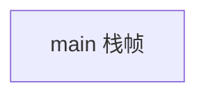
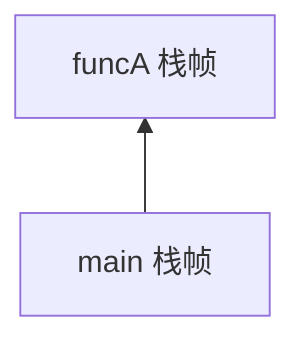
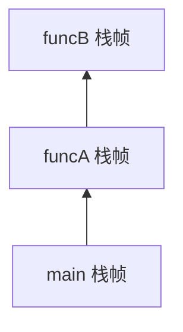
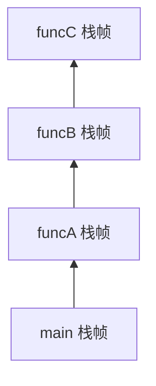

## ==========================================================================
C++ 数据结构教程 — 栈 (Stack)
## ==========================================================================

## 📋 章节概述

栈（Stack）是一种受限的线性数据结构，它遵循"后进先出"（LIFO, Last In First Out）
的原则。栈在计算机科学中有着极其广泛的应用：函数调用栈、表达式求值、括号匹配、
浏览器的后退功能、撤销操作等。

本章将从栈的基本概念出发，深入栈的底层实现原理，全面覆盖栈的所有用法，
最后通过实例和习题巩固所学知识。

> 📌 **底层实现参考**：如果需要深入理解本章数据结构的底层实现（纯C手写、内存布局、指针操作），请参阅 [[../../C语言深化教程/3数据结构/03_栈|C语言教程: 栈]]。C教程侧重手动实现与内存本质，本教程侧重STL使用与算法优化，两者互补。

## ==========================================================================
### 📖 第一节: 基础语法 + 计算机底层原理
## ==========================================================================

1.1 栈的基本概念
--------------------

栈是一种只能在一端（称为"栈顶"）进行插入和删除操作的线性表。

核心操作：
- push  : 将元素压入栈顶
- pop   : 弹出栈顶元素
- top   : 获取栈顶元素（不弹出）
- empty : 判断栈是否为空
- size  : 返回栈中元素个数

最基础的栈使用示例：

```cpp
#include <iostream>
#include <stack>

int main() {
    std::stack<int> stk;

    // 压栈
    stk.push(10);
    stk.push(20);
    stk.push(30);

    // 访问栈顶
    std::cout << "栈顶元素: " << stk.top() << std::endl;  // 30

    // 弹栈
    stk.pop();
    std::cout << "弹出一个元素后栈顶: " << stk.top() << std::endl;  // 20

    // 大小
    std::cout << "栈大小: " << stk.size() << std::endl;  // 2

    // 遍历并清空
    while (!stk.empty()) {
        std::cout << stk.top() << " ";
        stk.pop();
    }
    std::cout << std::endl;

    return 0;
}
```

1.2 栈的底层原理：函数调用栈
---------------------------------

栈的数据结构在计算机底层有着直接的硬件支持——这就是"调用栈"（Call Stack）。

当一个函数被调用时，系统会在调用栈上分配一个"栈帧"（Stack Frame），用于存储：
- 函数的局部变量
- 函数的参数
- 返回地址（函数执行完毕后跳转的位置）
- 保存的寄存器状态

函数调用结束时，栈帧被弹出，控制权返回到调用者。

```cpp
#include <iostream>

void funcC() {
    std::cout << "funcC 被调用" << std::endl;
    // funcC的栈帧: 局部变量 + 返回地址
}

void funcB() {
    std::cout << "funcB 被调用" << std::endl;
    funcC();
}

void funcA() {
    std::cout << "funcA 被调用" << std::endl;
    funcB();
}

int main() {
    std::cout << "main 开始" << std::endl;
    funcA();
    std::cout << "main 结束" << std::endl;
    return 0;
}
```

上述代码执行时的调用栈变化：

初始状态:


调用 funcA 后:


调用 funcB 后:


调用 funcC 后:


funcC 返回后:


1.3 栈溢出的原理
--------------------

栈的大小是有限的（通常为1MB~8MB，取决于操作系统和编译器设置）。
如果递归太深或局部变量太大，会导致"栈溢出"（Stack Overflow）。

```cpp
// 递归过深导致栈溢出
#include <iostream>

void deepRecursion(int depth) {
    int local_array[1000];  // 每个递归层消耗约4KB栈空间
    std::cout << "深度: " << depth << std::endl;
    deepRecursion(depth + 1);  // 最终导致段错误
}

int main() {
    deepRecursion(1);
    return 0;
}
```

1.4 手动实现栈（基于数组）
------------------------------

理解栈的底层实现可以帮助我们深入理解其工作原理：

```cpp
#include <iostream>
#include <stdexcept>

template<typename T, size_t MAX_SIZE = 100>
class ArrayStack {
private:
    T data[MAX_SIZE];
    size_t top_index;  // 当前栈顶位置

public:
    ArrayStack() : top_index(0) {}

    void push(const T& value) {
        if (top_index >= MAX_SIZE) {
            throw std::overflow_error("栈溢出！");
        }
        data[top_index++] = value;
    }

    void pop() {
        if (empty()) {
            throw std::underflow_error("栈为空！");
        }
        --top_index;
    }

    T& top() {
        if (empty()) {
            throw std::underflow_error("栈为空！");
        }
        return data[top_index - 1];
    }

    bool empty() const { return top_index == 0; }
    size_t size() const { return top_index; }
};

int main() {
    ArrayStack<int, 10> stk;

    for (int i = 1; i <= 5; ++i) {
        stk.push(i * 10);
    }

    std::cout << "栈大小: " << stk.size() << std::endl;

    while (!stk.empty()) {
        std::cout << stk.top() << " ";
        stk.pop();
    }
    std::cout << std::endl;

    return 0;
}
```

1.5 手动实现栈（基于链表）
------------------------------

基于链表的栈实现，支持动态增长，没有固定容量限制：

```cpp
#include <iostream>
#include <stdexcept>

template<typename T>
class LinkedStack {
private:
    struct Node {
        T data;
        Node* next;
        Node(const T& val) : data(val), next(nullptr) {}
    };

    Node* head;  // 栈顶指针
    size_t count;

public:
    LinkedStack() : head(nullptr), count(0) {}

    ~LinkedStack() {
        while (head) {
            Node* temp = head;
            head = head->next;
            delete temp;
        }
    }

    void push(const T& value) {
        Node* new_node = new Node(value);
        new_node->next = head;
        head = new_node;
        ++count;
    }

    void pop() {
        if (empty()) {
            throw std::underflow_error("栈为空！");
        }
        Node* temp = head;
        head = head->next;
        delete temp;
        --count;
    }

    T& top() {
        if (empty()) {
            throw std::underflow_error("栈为空！");
        }
        return head->data;
    }

    bool empty() const { return head == nullptr; }
    size_t size() const { return count; }
};

int main() {
    LinkedStack<int> stk;

    for (int i = 1; i <= 10; ++i) {
        stk.push(i);
    }

    std::cout << "栈大小: " << stk.size() << std::endl;

    while (!stk.empty()) {
        std::cout << stk.top() << " ";
        stk.pop();
    }
    std::cout << std::endl;

    return 0;
}
```


## ==========================================================================
### 📖 第二节: 所有用法大全
## ==========================================================================

2.1 std::stack —— 标准库栈容器适配器
-----------------------------------------

std::stack 是一个容器适配器，默认底层使用 deque，也可以指定其他容器。

```cpp
#include <iostream>
#include <stack>
#include <vector>
#include <list>
#include <deque>

int main() {
    // 默认底层容器 deque
    std::stack<int> stk1;

    // 使用 vector 作为底层容器
    std::stack<int, std::vector<int>> stk2;

    // 使用 list 作为底层容器
    std::stack<int, std::list<int>> stk3;

    // 从已有容器构造
    std::deque<int> deq = {1, 2, 3, 4, 5};
    std::stack<int> stk4(deq);  // 栈底为1，栈顶为5

    // 核心操作
    std::stack<int> stk;
    stk.push(100);
    stk.push(200);
    stk.emplace(300);   // C++11: 就地构造，效果同push

    std::cout << "size: " << stk.size() << std::endl;
    std::cout << "top: " << stk.top() << std::endl;

    stk.pop();  // 弹出（不返回元素）
    std::cout << "after pop, top: " << stk.top() << std::endl;

    // 交换两个栈的内容
    std::stack<int> other;
    other.push(999);
    stk.swap(other);
    std::cout << "after swap, top: " << stk.top() << std::endl;

    // 关系运算符
    std::stack<int> a, b;
    a.push(1); a.push(2);
    b.push(1); b.push(2);
    std::cout << "a == b: " << (a == b) << std::endl;
    // 比较规则：按元素顺序依次比较底层容器

    // 遍历技巧（标准stack不允许遍历，但可以访问底层容器）
    // 方法：在适配器上继承或使用友元，这里展示一种hack方式
    // 更推荐的做法是使用deque/vector代替stack

    return 0;
}

// 继承stack以暴露底层容器（仅用于演示，生产代码不建议）
template<typename T>
class DebugStack : public std::stack<T> {
public:
    void print() {
        // std::stack<T>::c 是受保护的底层容器成员
        for (const auto& x : this->c) {
            std::cout << x << " ";
        }
        std::cout << "(top -> 右)" << std::endl;
    }
};
```

2.2 自定义栈与迭代器支持
-----------------------------

标准库的 stack 不提供迭代器，但我们可以自己实现一个可迭代的栈：

```cpp
#include <iostream>
#include <deque>
#include <iterator>

template<typename T>
class IterableStack {
private:
    std::deque<T> data;

public:
    void push(const T& val) { data.push_back(val); }
    void pop() { data.pop_back(); }
    T& top() { return data.back(); }
    bool empty() const { return data.empty(); }
    size_t size() const { return data.size(); }

    // 提供迭代器支持
    using iterator = typename std::deque<T>::reverse_iterator;
    using const_iterator = typename std::deque<T>::const_reverse_iterator;

    iterator begin() { return data.rbegin(); }
    iterator end() { return data.rend(); }
    const_iterator begin() const { return data.rbegin(); }
    const_iterator end() const { return data.rend(); }
};

int main() {
    IterableStack<int> stk;
    stk.push(10);
    stk.push(20);
    stk.push(30);

    std::cout << "从栈顶到栈底遍历: ";
    for (int x : stk) {
        std::cout << x << " ";
    }
    std::cout << std::endl;

    return 0;
}
```

2.3 栈的各种应用场景
-----------------------

（1）括号匹配检查

```cpp
#include <iostream>
#include <stack>
#include <string>
#include <unordered_map>

bool isBalanced(const std::string& expr) {
    std::stack<char> stk;
    std::unordered_map<char, char> pairs = {
        {')', '('},
        {']', '['},
        {'}', '{'}
    };

    for (char ch : expr) {
        if (ch == '(' || ch == '[' || ch == '{') {
            stk.push(ch);
        } else if (ch == ')' || ch == ']' || ch == '}') {
            if (stk.empty() || stk.top() != pairs[ch]) {
                return false;
            }
            stk.pop();
        }
    }

    return stk.empty();
}

int main() {
    std::string tests[] = {
        "()", "()[]{}", "([{}])", "(]", "([)]", "((((", ""
    };

    for (const auto& s : tests) {
        std::cout << s << " -> " << (isBalanced(s) ? "匹配" : "不匹配") << std::endl;
    }

    return 0;
}
```

（2）中缀表达式转后缀表达式（逆波兰表达式）

```cpp
#include <iostream>
#include <stack>
#include <string>
#include <cctype>

int precedence(char op) {
    if (op == '+' || op == '-') return 1;
    if (op == '*' || op == '/') return 2;
    if (op == '^') return 3;
    return 0;
}

std::string infixToPostfix(const std::string& expr) {
    std::stack<char> stk;
    std::string output;

    for (char ch : expr) {
        if (std::isalnum(ch)) {
            output += ch;
        } else if (ch == '(') {
            stk.push(ch);
        } else if (ch == ')') {
            while (!stk.empty() && stk.top() != '(') {
                output += stk.top();
                stk.pop();
            }
            stk.pop();  // 弹出 '('
        } else {  // 运算符
            while (!stk.empty() && precedence(stk.top()) >= precedence(ch)) {
                output += stk.top();
                stk.pop();
            }
            stk.push(ch);
        }
    }

    while (!stk.empty()) {
        output += stk.top();
        stk.pop();
    }

    return output;
}

int main() {
    std::string expr = "a+b*(c^d-e)^(f+g*h)-i";
    std::cout << "中缀: " << expr << std::endl;
    std::cout << "后缀: " << infixToPostfix(expr) << std::endl;
    return 0;
}
```

（3）后缀表达式求值

```cpp
#include <iostream>
#include <stack>
#include <string>
#include <sstream>
#include <cctype>

int evaluatePostfix(const std::string& expr) {
    std::stack<int> stk;
    std::istringstream iss(expr);
    std::string token;

    while (iss >> token) {
        if (std::isdigit(token[0]) || (token.size() > 1 && token[0] == '-')) {
            stk.push(std::stoi(token));
        } else {
            int b = stk.top(); stk.pop();
            int a = stk.top(); stk.pop();

            switch (token[0]) {
                case '+': stk.push(a + b); break;
                case '-': stk.push(a - b); break;
                case '*': stk.push(a * b); break;
                case '/': stk.push(a / b); break;
            }
        }
    }

    return stk.top();
}

int main() {
    std::string expr = "3 4 + 5 * 6 -";
    std::cout << "表达式: " << expr << std::endl;
    std::cout << "结果: " << evaluatePostfix(expr) << std::endl;  // (3+4)*5-6 = 29
    return 0;
}
```


## ==========================================================================
### 📖 第三节: 实用案例
## ==========================================================================

案例一：浏览器的前进后退功能
--------------------------------------

使用两个栈实现浏览器的前进后退：

```cpp
#include <iostream>
#include <stack>
#include <string>

class BrowserHistory {
private:
    std::stack<std::string> back_stack;   // 后退栈
    std::stack<std::string> forward_stack; // 前进栈
    std::string current_url;

public:
    BrowserHistory(const std::string& homepage) : current_url(homepage) {}

    void visit(const std::string& url) {
        back_stack.push(current_url);
        current_url = url;
        // 访问新页面时，清空前进栈
        while (!forward_stack.empty()) {
            forward_stack.pop();
        }
        std::cout << "访问: " << current_url << std::endl;
    }

    std::string back() {
        if (back_stack.empty()) {
            std::cout << "无法后退" << std::endl;
            return current_url;
        }
        forward_stack.push(current_url);
        current_url = back_stack.top();
        back_stack.pop();
        std::cout << "后退到: " << current_url << std::endl;
        return current_url;
    }

    std::string forward() {
        if (forward_stack.empty()) {
            std::cout << "无法前进" << std::endl;
            return current_url;
        }
        back_stack.push(current_url);
        current_url = forward_stack.top();
        forward_stack.pop();
        std::cout << "前进到: " << current_url << std::endl;
        return current_url;
    }

    std::string getCurrent() const { return current_url; }
};

int main() {
    BrowserHistory bh("google.com");

    bh.visit("github.com");
    bh.visit("stackoverflow.com");
    bh.visit("cppreference.com");

    bh.back();  // stackoverflow.com
    bh.back();  // github.com
    bh.forward();  // stackoverflow.com
    bh.visit("reddit.com");  // forward stack cleared

    std::cout << "\n当前页面: " << bh.getCurrent() << std::endl;

    return 0;
}
```


案例二：表达式计算器
------------------------------

完整的四则运算表达式计算器，包含括号支持：

```cpp
#include <iostream>
#include <stack>
#include <string>
#include <cctype>
#include <stdexcept>

class Calculator {
private:
    // 获取运算符优先级
    int precedence(char op) {
        if (op == '+' || op == '-') return 1;
        if (op == '*' || op == '/') return 2;
        return 0;
    }

    // 执行运算
    int applyOp(int a, int b, char op) {
        switch (op) {
            case '+': return a + b;
            case '-': return a - b;
            case '*': return a * b;
            case '/':
                if (b == 0) throw std::runtime_error("除零错误");
                return a / b;
        }
        return 0;
    }

public:
    int evaluate(const std::string& expr) {
        std::stack<int> values;   // 操作数栈
        std::stack<char> ops;     // 运算符栈

        for (size_t i = 0; i < expr.length(); ++i) {
            char ch = expr[i];

            // 跳过空格
            if (ch == ' ') continue;

            // 处理数字
            if (std::isdigit(ch)) {
                int val = 0;
                while (i < expr.length() && std::isdigit(expr[i])) {
                    val = val * 10 + (expr[i] - '0');
                    ++i;
                }
                values.push(val);
                --i;  // for循环会自增，退回一步
            }
            // 处理左括号
            else if (ch == '(') {
                ops.push(ch);
            }
            // 处理右括号
            else if (ch == ')') {
                while (!ops.empty() && ops.top() != '(') {
                    int b = values.top(); values.pop();
                    int a = values.top(); values.pop();
                    values.push(applyOp(a, b, ops.top()));
                    ops.pop();
                }
                if (ops.empty()) throw std::runtime_error("括号不匹配");
                ops.pop();  // 弹出 '('
            }
            // 处理运算符
            else if (ch == '+' || ch == '-' || ch == '*' || ch == '/') {
                while (!ops.empty() && precedence(ops.top()) >= precedence(ch)) {
                    int b = values.top(); values.pop();
                    int a = values.top(); values.pop();
                    values.push(applyOp(a, b, ops.top()));
                    ops.pop();
                }
                ops.push(ch);
            }
        }

        // 处理剩余的运算符
        while (!ops.empty()) {
            int b = values.top(); values.pop();
            int a = values.top(); values.pop();
            values.push(applyOp(a, b, ops.top()));
            ops.pop();
        }

        return values.top();
    }
};

int main() {
    Calculator calc;

    std::string expressions[] = {
        "10 + 20 * 3",
        "(10 + 20) * 3",
        "5 * (4 + 3) / 7",
        "100 - 50 / 5 * 3",
        "((2 + 3) * (4 + 5))"
    };

    for (const auto& expr : expressions) {
        std::cout << expr << " = " << calc.evaluate(expr) << std::endl;
    }

    return 0;
}
```


案例三：深度优先搜索（DFS）
--------------------------------------

使用栈实现图/树的深度优先遍历：

```cpp
#include <iostream>
#include <stack>
#include <vector>
#include <unordered_set>

// 用邻接表表示图
class Graph {
private:
    int vertices;
    std::vector<std::vector<int>> adj_list;

public:
    Graph(int v) : vertices(v), adj_list(v) {}

    void addEdge(int u, int v) {
        adj_list[u].push_back(v);
        adj_list[v].push_back(u);  // 无向图
    }

    void dfs(int start) {
        std::stack<int> stk;
        std::unordered_set<int> visited;

        stk.push(start);

        std::cout << "DFS遍历顺序: ";

        while (!stk.empty()) {
            int current = stk.top();
            stk.pop();

            if (visited.find(current) != visited.end()) continue;

            visited.insert(current);
            std::cout << current << " ";

            // 将邻居入栈（逆序入栈，保证正序访问）
            for (auto it = adj_list[current].rbegin();
                 it != adj_list[current].rend(); ++it) {
                if (visited.find(*it) == visited.end()) {
                    stk.push(*it);
                }
            }
        }
        std::cout << std::endl;
    }
};

int main() {
    Graph g(6);
    g.addEdge(0, 1);
    g.addEdge(0, 2);
    g.addEdge(1, 3);
    g.addEdge(1, 4);
    g.addEdge(2, 4);
    g.addEdge(3, 4);
    g.addEdge(3, 5);

    g.dfs(0);

    return 0;
}
```


## ==========================================================================
### 📖 第四节: 课后习题
## ==========================================================================

1. 基础题：手动实现一个支持动态增长的栈。
   - 基于动态数组实现（类似std::vector）
   - 实现push、pop、top、empty、size
   - 实现扩容（2倍扩容策略）
   - 分析各操作的时间复杂度

2. 应用题：设计一个最小栈（Min Stack）。
   - 在O(1)时间内获取栈中的最小值
   - 使用辅助栈或pair的方式实现
   - 支持push、pop、top、getMin操作

3. 进阶题：使用栈实现一个简易的HTML标签检查器。
   - 检查HTML标签是否匹配闭合
   - 处理自闭合标签（如<br/>、）
   - 报告第一个不匹配的位置

4. 综合题：实现一个基于栈的迷宫求解器。
   - 迷宫用二维数组表示（0=通路，1=墙）
   - 使用DFS（栈）寻找从起点到终点的路径
   - 输出路径坐标
   - 如果能找到多条路径，输出最短路径

5. 挑战题：实现一个单调栈，并用它计算"柱状图中的最大矩形面积"。
   - 时间复杂度要求O(n)
   - 单调栈维护递增/递减序列
   - 应用在LeetCode 84题

## ==========================================================================


## ==========================================================================
### 📝 章节测试
## ==========================================================================

> [!question] 判断题 1
> 栈是一种先进先出（FIFO）的数据结构 （ ）
> - [ ] ✅ 正确
> - [ ] ❌ 错误
>
> > [!success]- 点击查看答案
> > 答案: 错误
> > 
> > **解析**: 栈是后进先出（LIFO, Last In First Out）的数据结构，最后压入的元素最先弹出。先进先出的是队列（Queue）。

> [!question] 判断题 2
> std::stack 的 pop() 函数会返回被弹出的栈顶元素 （ ）
> - [ ] ✅ 正确
> - [ ] ❌ 错误
>
> > [!success]- 点击查看答案
> > 答案: 错误
> > 
> > **解析**: std::stack 的 pop() 返回 void，只负责删除栈顶元素。要获取栈顶元素需要先调用 top()，再调用 pop()。

> [!question] 判断题 3
> 函数调用栈的大小是无限的，只要内存足够就不会溢出 （ ）
> - [ ] ✅ 正确
> - [ ] ❌ 错误
>
> > [!success]- 点击查看答案
> > 答案: 错误
> > 
> > **解析**: 函数调用栈的大小是有限的（通常1MB~8MB），由操作系统和编译器设置决定。递归太深或局部变量太大会导致栈溢出（Stack Overflow）。

> [!question] 判断题 4
> 用数组实现的栈，push操作的时间复杂度总是O(1) （ ）
> - [ ] ✅ 正确
> - [ ] ❌ 错误
>
> > [!success]- 点击查看答案
> > 答案: 错误
> > 
> > **解析**: 如果是固定大小数组实现，push是O(1)（满时直接报错）。如果是动态数组实现（类似vector），push的均摊复杂度是O(1)，但单次扩容时是O(n)。

> [!question] 判断题 5
> 用链表实现的栈，push和pop操作都是O(1)，且无需扩容 （ ）
> - [ ] ✅ 正确
> - [ ] ❌ 错误
>
> > [!success]- 点击查看答案
> > 答案: 正确
> > 
> > **解析**: 链表实现的栈在头部插入和删除节点，都只需要修改指针，时间复杂度为O(1)，且不存在容量限制，无需扩容。

> [!question] 判断题 6
> std::stack 提供迭代器支持，可以遍历栈中所有元素 （ ）
> - [ ] ✅ 正确
> - [ ] ❌ 错误
>
> > [!success]- 点击查看答案
> > 答案: 错误
> > 
> > **解析**: std::stack 是容器适配器，不提供迭代器。它只暴露栈顶元素（top）和基本操作（push/pop/empty/size），这是其"受限"特性的体现。

> [!question] 判断题 7
> 中缀表达式 "3 + 4 * 5" 转为后缀表达式是 "3 4 5 * +" （ ）
> - [ ] ✅ 正确
> - [ ] ❌ 错误
>
> > [!success]- 点击查看答案
> > 答案: 正确
> > 
> > **解析**: 根据运算符优先级，*优先于+。转换过程：3直接输出，+入栈，4直接输出，*优先级高于栈顶+所以入栈，5直接输出，结束后弹出*和+。结果为"3 4 5 * +"。

> [!question] 判断题 8
> 使用栈可以将递归算法转换为非递归的迭代算法 （ ）
> - [ ] ✅ 正确
> - [ ] ❌ 错误
>
> > [!success]- 点击查看答案
> > 答案: 正确
> > 
> > **解析**: 递归本质上使用了系统调用栈。通过手动维护一个栈来保存中间状态，任何递归算法都可以转换为等价的非递归迭代算法。

> [!question] 判断题 9
> std::stack 可以使用 std::vector、std::deque、std::list 作为底层容器 （ ）
> - [ ] ✅ 正确
> - [ ] ❌ 错误
>
> > [!success]- 点击查看答案
> > 答案: 正确
> > 
> > **解析**: std::stack 只要求底层容器支持 back()、push_back()、pop_back() 操作，vector、deque、list都满足这些要求。

> [!question] 判断题 10
> 在括号匹配问题中，遇到右括号时应该将其压入栈中 （ ）
> - [ ] ✅ 正确
> - [ ] ❌ 错误
>
> > [!success]- 点击查看答案
> > 答案: 错误
> > 
> > **解析**: 遇到左括号时压入栈中，遇到右括号时应从栈中弹出栈顶的左括号进行匹配，而不是压入右括号。

---

> [!question] 选择题 1
> 以下哪个不是栈的基本操作？
> - [ ] A. push
> - [ ] B. pop
> - [ ] C. front
> - [ ] D. top
>
> > [!success]- 点击查看答案
> > 正确答案: C
> > 
> > **解析**: front()是队列的操作，用于获取队首元素。栈只能访问栈顶元素（top），不能访问栈底或中间元素。

> [!question] 选择题 2
> 依次将元素 1, 2, 3, 4 压入栈中，然后执行两次pop操作，此时栈顶元素是？
> - [ ] A. 1
> - [ ] B. 2
> - [ ] C. 3
> - [ ] D. 4
>
> > [!success]- 点击查看答案
> > 正确答案: B
> > 
> > **解析**: 压入后栈从底到顶为1,2,3,4。第一次pop弹出4，第二次pop弹出3，栈顶变为2。

> [!question] 选择题 3
> 函数调用栈帧中不包含以下哪项信息？
> - [ ] A. 函数的局部变量
> - [ ] B. 返回地址
> - [ ] C. 全局变量
> - [ ] D. 函数参数
>
> > [!success]- 点击查看答案
> > 正确答案: C
> > 
> > **解析**: 全局变量存储在数据段（data segment），不属于函数栈帧。栈帧包含局部变量、函数参数、返回地址和保存的寄存器状态。

> [!question] 选择题 4
> 单调栈的主要用途是什么？
> - [ ] A. 实现排序算法
> - [ ] B. 寻找每个元素左/右边第一个比它大/小的元素
> - [ ] C. 实现BFS遍历
> - [ ] D. 实现哈希表
>
> > [!success]- 点击查看答案
> > 正确答案: B
> > 
> > **解析**: 单调栈维护单调递增或递减的元素序列，当新元素破坏单调性时弹出栈顶，可以在O(n)时间内找到每个元素左/右边第一个比它大或小的元素。

> [!question] 选择题 5
> 后缀表达式 "5 3 + 2 *" 的计算结果是？
> - [ ] A. 11
> - [ ] B. 16
> - [ ] C. 13
> - [ ] D. 25
>
> > [!success]- 点击查看答案
> > 正确答案: B
> > 
> > **解析**: 5入栈，3入栈，+：弹出3和5计算5+3=8入栈，2入栈，*：弹出2和8计算8*2=16入栈。最终结果为16。

> [!question] 选择题 6
> 用两个栈实现一个队列，入队操作的时间复杂度是？
> - [ ] A. O(1)
> - [ ] B. O(n)
> - [ ] C. O(log n)
> - [ ] D. O(n^2)
>
> > [!success]- 点击查看答案
> > 正确答案: A
> > 
> > **解析**: 使用两个栈实现队列时，入队只需push到输入栈，为O(1)。出队时如果输出栈为空，则将输入栈所有元素倒入输出栈，均摊也是O(1)。

> [!question] 选择题 7
> 以下哪种应用不使用栈结构？
> - [ ] A. 函数递归调用
> - [ ] B. 括号匹配检查
> - [ ] C. BFS广度优先搜索
> - [ ] D. 表达式求值
>
> > [!success]- 点击查看答案
> > 正确答案: C
> > 
> > **解析**: BFS使用队列（Queue）而不是栈。DFS深度优先搜索才使用栈（或递归，递归本质是系统栈）。

> [!question] 选择题 8
> std::stack 默认使用的底层容器是？
> - [ ] A. std::vector
> - [ ] B. std::list
> - [ ] C. std::deque
> - [ ] D. std::array
>
> > [!success]- 点击查看答案
> > 正确答案: C
> > 
> > **解析**: std::stack默认使用std::deque作为底层容器。deque支持尾部高效操作且分段连续存储，是stack的良好底层选择。

> [!question] 选择题 9
> 以下关于浏览器前进/后退功能的实现，哪种说法正确？
> - [ ] A. 使用一个栈即可实现
> - [ ] B. 使用两个栈，一个用于后退，一个用于前进
> - [ ] C. 使用一个队列实现
> - [ ] D. 使用一个数组实现
>
> > [!success]- 点击查看答案
> > 正确答案: B
> > 
> > **解析**: 浏览器前进/后退功能使用两个栈：后退栈保存历史页面，前进栈保存前进页面。访问新页面时清空前进栈。

> [!question] 选择题 10
> 在中缀转后缀的算法中，遇到左括号'('时应该？
> - [ ] A. 直接输出到结果
> - [ ] B. 压入运算符栈
> - [ ] C. 弹出栈中所有运算符
> - [ ] D. 忽略不处理
>
> > [!success]- 点击查看答案
> > 正确答案: B
> > 
> > **解析**: 遇到左括号时直接压入运算符栈。左括号在栈中不参与优先级比较（优先级视为0），直到遇到对应的右括号时才弹出括号之间的所有运算符。

---

### 💻 编程大题

> [!note] 编程题 1：实现一个支持获取最小值的栈（Min Stack）
> **要求**：
> 1. 设计一个栈类 `MinStack`，支持以下操作，均要求O(1)时间复杂度：
>    - `push(int val)` — 将元素压入栈
>    - `pop()` — 弹出栈顶元素
>    - `top()` — 获取栈顶元素
>    - `getMin()` — 获取栈中的最小值
> 2. 方法一：使用辅助栈，辅助栈栈顶始终为当前栈的最小值
> 3. 方法二：不使用辅助栈，在主栈中存储差值
> 4. 编写完整测试用例验证正确性
>
> **提示**: 辅助栈方法中，每次push时比较新元素与辅助栈栈顶，取较小值压入辅助栈

> [!note] 编程题 2：使用栈实现完整的四则运算计算器
> **要求**：
> 1. 支持 +、-、*、/ 四则运算和括号
> 2. 支持多位数和负数
> 3. 支持浮点数运算
> 4. 完善的错误处理：
>    - 除零检测
>    - 括号不匹配检测
>    - 非法字符检测
> 5. 实现两种方式：
>    - 方式一：中缀表达式直接求值（双栈法）
>    - 方式二：先转后缀再求值
>
> **提示**: 处理负数时需要区分减号和负号（如"-3+5"中的"-"是负号）

> [!note] 编程题 3：使用栈实现迷宫求解（DFS）
> **要求**：
> 1. 读入一个 n×m 的迷宫（0=通路，1=墙壁）
> 2. 给定起点和终点坐标
> 3. 使用栈实现DFS搜索所有路径
> 4. 输出：
>    - 是否存在从起点到终点的路径
>    - 如果存在，输出一条路径的坐标序列
>    - 输出最短路径（需要记录所有路径并比较）
> 5. 使用方向数组表示上下左右四个移动方向
>
> **提示**: 栈中保存当前坐标和已尝试的方向编号，回溯时恢复visited标记

### 🔗 推荐练习题（洛谷）

| 题号 | 题目 | 难度 | 知识点 |
|------|------|------|--------|
| [P1449](https://www.luogu.com.cn/problem/P1449) | 后缀表达式 | 入门 | 栈、后缀表达式求值 |
| [P1739](https://www.luogu.com.cn/problem/P1739) | 表达式括号匹配 | 入门 | 栈、括号匹配 |

---

## --------------------------------------------------------------------------
## 🔗 知识网络
## --------------------------------------------------------------------------

- **上一章**: [[A_容器_Container]] | **下一章**: [[F_队列_Queue]] | **返回**: [[DSA学习路线]]
- **相关容器**: [[容器类/04_stack]]
- **算法技巧**: [[../算法技巧/递推递归]] | [[../算法技巧/搜索]]
