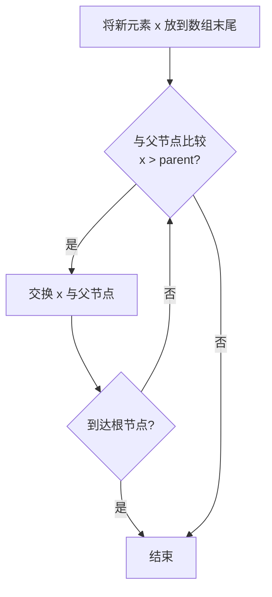
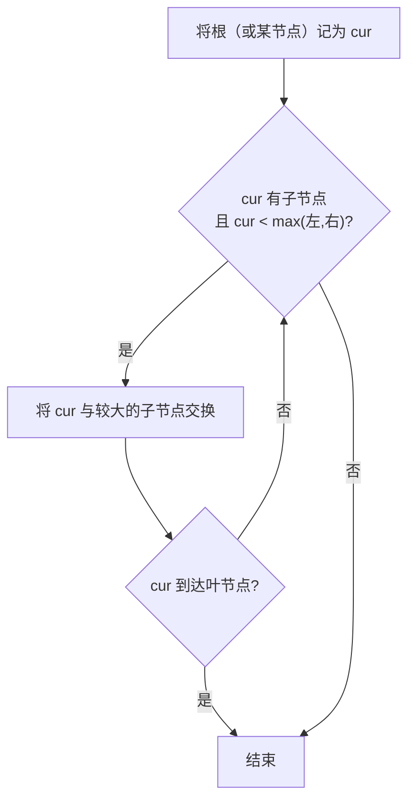

建议先阅读: [[A_容器_Container|A 容器 Container]]

---

## 原理

堆（Heap）是一种特殊的完全二叉树，满足堆性质：对于最大堆，每个节点的值 >= 其子节点的值；对于最小堆，每个节点的值 <= 其子节点的值。

> 注意：此"堆"与操作系统中的"堆内存"是完全不同的概念。

### 数组存储

虽然堆逻辑上是完全二叉树，但实际使用数组存储：
- 根节点在索引 0
- 对于索引 i 的节点：
  - 父节点: `(i - 1) / 2`
  - 左子节点: `2 * i + 1`
  - 右子节点: `2 * i + 2`

### 核心操作与时间复杂度

| 操作 | 描述 | 时间复杂度 |
|------|------|-----------|
| push / insert | 末尾追加 + sift-up 上浮 | O(log n) |
| pop / extract | 堆顶与末尾交换 + sift-down 下沉 | O(log n) |
| top / peek | 直接返回 arr[0] | O(1) |
| make_heap | Floyd 自底向上建堆 | O(n) |
| heap_sort | 建堆 + n 次弹出 | O(n log n) |

### 上浮与下沉

**上浮（sift-up）**: 新元素放在数组末尾，与父节点比较，违反堆性质则交换，重复直到满足或到根节点。



**下沉（sift-down）**: 新根与较大子节点比较（最大堆），违反堆性质则交换，重复直到满足或到叶节点。



### Floyd 建堆 O(n) 证明

从最后一个非叶节点（n/2 - 1）开始逐个下沉。虽然单次下沉为 O(log n)，但层越深节点越多而下沉距离越短。经级数求和可证明总时间复杂度为 O(n)。

---

## 实现

### 最大堆

```c
#include <stdlib.h>

typedef struct {
    int* data;
    size_t size;
    size_t capacity;
} MaxHeap;

void mh_init(MaxHeap* h) {
    h->data = NULL;
    h->size = 0;
    h->capacity = 0;
}

void mh_destroy(MaxHeap* h) {
    free(h->data);
    h->data = NULL;
    h->size = 0;
    h->capacity = 0;
}

static void swap(int* a, int* b) { int t = *a; *a = *b; *b = t; }

// 上浮：末尾新元素向上调整
static void sift_up(MaxHeap* h, size_t idx) {
    while (idx > 0) {
        size_t parent = (idx - 1) / 2;
        if (h->data[parent] >= h->data[idx]) break;
        swap(&h->data[parent], &h->data[idx]);
        idx = parent;
    }
}

// 下沉：堆顶向下调整
static void sift_down(MaxHeap* h, size_t idx) {
    size_t n = h->size;
    while (1) {
        size_t largest = idx;
        size_t left = 2 * idx + 1;
        size_t right = 2 * idx + 2;
        if (left < n && h->data[left] > h->data[largest])
            largest = left;
        if (right < n && h->data[right] > h->data[largest])
            largest = right;
        if (largest == idx) break;
        swap(&h->data[idx], &h->data[largest]);
        idx = largest;
    }
}

static int mh_expand(MaxHeap* h) {
    size_t new_cap = h->capacity == 0 ? 8 : h->capacity * 2;
    int* new_data = realloc(h->data, new_cap * sizeof(int));
    if (!new_data) return -1;
    h->data = new_data;
    h->capacity = new_cap;
    return 0;
}

int mh_push(MaxHeap* h, int value) {
    if (h->size >= h->capacity)
        if (mh_expand(h) != 0) return -1;
    h->data[h->size++] = value;
    sift_up(h, h->size - 1);
    return 0;
}

int mh_extract_max(MaxHeap* h, int* out) {
    if (h->size == 0) return -1;
    *out = h->data[0];
    h->data[0] = h->data[--h->size];
    if (h->size > 0) sift_down(h, 0);
    return 0;
}

int mh_top(MaxHeap* h, int* out) {
    if (h->size == 0) return -1;
    *out = h->data[0];
    return 0;
}

int mh_empty(MaxHeap* h) { return h->size == 0; }
size_t mh_size(MaxHeap* h) { return h->size; }

// Floyd 建堆：从最后一个非叶节点开始下沉，时间复杂度 O(n)
void mh_build(MaxHeap* h, int* arr, size_t n) {
    free(h->data);
    h->data = arr;
    h->size = n;
    h->capacity = n;
    for (int i = (int)n / 2 - 1; i >= 0; i--)
        sift_down(h, (size_t)i);
}
```

### 堆排序

```c
static void sift_down_range(int* arr, size_t n, size_t idx) {
    while (1) {
        size_t largest = idx;
        size_t left = 2 * idx + 1;
        size_t right = 2 * idx + 2;
        if (left < n && arr[left] > arr[largest]) largest = left;
        if (right < n && arr[right] > arr[largest]) largest = right;
        if (largest == idx) break;
        int t = arr[idx]; arr[idx] = arr[largest]; arr[largest] = t;
        idx = largest;
    }
}

void heap_sort(int* arr, size_t n) {
    // 建堆 O(n)
    for (int i = (int)n / 2 - 1; i >= 0; i--)
        sift_down_range(arr, n, (size_t)i);
    // 逐一提取最大值 O(n log n)
    for (size_t i = n - 1; i > 0; i--) {
        int t = arr[0]; arr[0] = arr[i]; arr[i] = t;
        sift_down_range(arr, i, 0);
    }
}
```

---

## 各语言标准库对比

| 语言 | 优先队列 / 堆 | 堆算法 |
|------|--------------|--------|
| C | 无（手写） | 无（手写） |
| C++ | priority_queue | make_heap / push_heap / pop_heap |
| Java | PriorityQueue | 无（手写或用 Collections.sort） |
| Python | heapq（最小堆） | heapq.heapify / heappush / heappop |
| Rust | BinaryHeap（最大堆） | 无独立堆算法 |

---

## 应用场景

- **优先队列**: 任务调度（优先级高的先执行）、Dijkstra 最短路径算法
- **Top-K 问题**: 用大小为 K 的最小堆维护最大的 K 个元素，每个新元素与堆顶比较决定是否替换
- **数据流中位数**: 用两个堆（最大堆存小的一半，最小堆存大的一半），O(log n) 插入，O(1) 查询中位数
- **合并 K 个有序链表**: 用最小堆每次取 K 个链表头中的最小值，总时间 O(N log K)

---

## 练习

| 题号 | 题目 | 难度 | 知识点 |
|------|------|------|--------|
| P3378 | 堆 | 普及 | 堆的基本操作 |
| P1090 | 合并果子 | 普及 | 优先队列、贪心 |
| P1168 | 中位数 | 普及+ | 两个堆维护中位数 |
