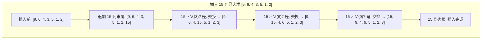
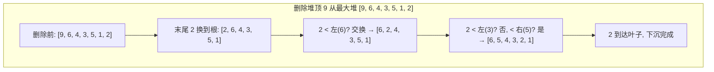

---
数据结构教程 — 堆 (Heap)
---

##  章节概述

堆（Heap）是一种特殊的完全二叉树数据结构，它满足"堆性质"：对于最大堆，每个节点
的值都大于或等于其子节点的值；对于最小堆，每个节点的值都小于或等于其子节点的值。

堆是实现优先队列（Priority Queue）的理想选择，广泛应用于堆排序、图算法
（Dijkstra最短路径）、任务调度、Top-K问题等场景。

️ 注意：这里的"堆"和操作系统中的"堆内存"是不同的概念，虽然名称相同，但本质不同。

>  **底层实现参考**：如果需要深入理解本章数据结构的底层实现（纯C手写、内存布局、指针操作），请参阅 [[../../C语言深化教程/3数据结构/07_堆|C语言教程: 堆]]。C教程侧重手动实现与内存本质，本教程侧重STL使用与算法优化，两者互补。

---
###  第一节: 基础语法 + 计算机底层原理
---

1.1 堆的基本概念
--------------------

堆的两种类型：

最大堆（Max Heap）：父节点的值 >= 子节点的值，根节点是最大值
最小堆（Min Heap）：父节点的值 <= 子节点的值，根节点是最小值

堆的物理存储方式：虽然堆逻辑上是完全二叉树，但实际上使用数组存储。
- 根节点在位置0
- 对于位置 i 的节点：
  - 左子节点位置: 2*i + 1
  - 右子节点位置: 2*i + 2
  - 父节点位置: (i-1) / 2

```pseudocode
// 堆的数组表示示意
// 最大堆:       100
//             /    \
//           80      60
//          /  \    /  \
//         40  30  50  20
//        /
//       10
//
// 数组存储: [100, 80, 60, 40, 30, 50, 20, 10]
//            0    1   2   3   4   5   6   7
```

1.2 堆的标准操作
------------------------

标准库中的堆操作函数：

```pseudocode
FUNCTION main()
    ARRAY v = [3, 1, 4, 1, 5, 9, 2, 6]

    // 1. make_heap: 将范围转换为堆（默认最大堆）
    make_heap(v)
    PRINT "堆化后: ", v
    // 输出: 9 6 4 3 5 1 2 1  (堆顶为9)

    // 2. push_heap: 将最后一个元素插入到堆中
    v.APPEND(10)
    push_heap(v)
    PRINT "插入10后: ", v

    // 3. pop_heap: 将堆顶移动到末尾
    pop_heap(v)
    PRINT "堆顶被弹出后: ", v
    PRINT "弹出的最大元素: ", v.BACK()
    v.POP_BACK()  // 真正移除

    // 4. sort_heap: 堆排序
    sort_heap(v)
    PRINT "堆排序后: ", v

    // 5. is_heap: 检查是否满足堆性质
    PRINT "是堆吗? ", is_heap(v)
END FUNCTION
```

---
**实现练习**: 用 C 或 C++ 自行实现上述结构。完成后与 AI 对话检查正确性。
- C 语言底层参考: [[../../c语言教程/3数据结构/07_堆]]
- C++ STL 参考: [[../../cpp教程/容器库/07_priority_queue]]
---

1.3 堆的底层原理：上浮与下沉
---------------------------------

堆的核心操作是"上浮"（sift-up / swim）和"下沉"（sift-down / sink）。

上浮（sift-up），用于插入操作：
1. 将新元素放在数组末尾
2. 与其父节点比较
3. 如果违反堆性质，与父节点交换
4. 重复直到满足堆性质或到达根节点



下沉（sift-down），用于删除堆顶操作：
1. 将根节点与最后一个元素交换，删除最后一个元素
2. 新的根节点与较大的子节点比较
3. 如果违反堆性质，与较大的子节点交换
4. 重复直到满足堆性质或到达叶子节点



| 操作 | 描述 | 时间复杂度 |
|------|------|-----------|
| push / insert | 末尾追加 + sift-up 上浮 | O(log n) |
| pop / extract | 堆顶与末尾交换 + sift-down 下沉 | O(log n) |
| top / peek | 直接返回堆顶 arr[0] | O(1) |
| heapify / make_heap | 自底向上对所有非叶节点下沉 | O(n) |
| increase-key | 更新值后上浮 | O(log n) |

```pseudocode
// 堆的伪代码实现
CLASS Heap(is_max_heap)
    data = NEW ARRAY
    count = 0

FUNCTION compare(a, b):
    IF is_max_heap:
        RETURN a > b
    ELSE:
        RETURN a < b
    END IF
END FUNCTION

FUNCTION sift_up(index):
    WHILE index > 0:
        parent = (index - 1) / 2
        IF compare(data[parent], data[index]):
            BREAK
        END IF
        SWAP(data[index], data[parent])
        index = parent
    END WHILE
END FUNCTION

FUNCTION sift_down(index):
    current_size = count
    WHILE TRUE:
        target = index
        left = 2 * index + 1
        right = 2 * index + 2

        IF left < current_size AND NOT compare(data[target], data[left]):
            target = left
        END IF
        IF right < current_size AND NOT compare(data[target], data[right]):
            target = right
        END IF

        IF target == index:
            BREAK
        END IF

        SWAP(data[index], data[target])
        index = target
    END WHILE
END FUNCTION

FUNCTION push(value):
    data.APPEND(value)
    count = count + 1
    sift_up(count - 1)
END FUNCTION

FUNCTION pop():
    IF count == 0:
        THROW "堆为空"
    END IF
    SWAP(data[0], data[count - 1])
    data.POP_BACK()
    count = count - 1
    IF count > 0:
        sift_down(0)
    END IF
END FUNCTION

FUNCTION top():
    IF count == 0:
        THROW "堆为空"
    END IF
    RETURN data[0]
END FUNCTION

FUNCTION empty():
    RETURN count == 0
END FUNCTION

FUNCTION size():
    RETURN count
END FUNCTION

// 使用示例
FUNCTION main()
    // 创建最大堆
    max_heap = NEW Heap(TRUE)
    max_heap.push(3)
    max_heap.push(1)
    max_heap.push(4)
    max_heap.push(1)
    max_heap.push(5)
    max_heap.push(9)

    PRINT "最大堆堆顶: ", max_heap.top()

    PRINT "依次取出: "
    WHILE NOT max_heap.empty():
        PRINT max_heap.top(), " "
        max_heap.pop()
    END WHILE
    PRINT newline

    // 创建最小堆
    min_heap = NEW Heap(FALSE)
    min_heap.push(3)
    min_heap.push(1)
    min_heap.push(4)
    min_heap.push(1)
    min_heap.push(5)
    min_heap.push(9)

    PRINT "最小堆堆顶: ", min_heap.top()

    PRINT "依次取出: "
    WHILE NOT min_heap.empty():
        PRINT min_heap.top(), " "
        min_heap.pop()
    END WHILE
    PRINT newline
END FUNCTION
```

---
**实现练习**: 用 C 或 C++ 自行实现上述结构。完成后与 AI 对话检查正确性。
- C 语言底层参考: [[../../c语言教程/3数据结构/07_堆]]
- C++ STL 参考: [[../../cpp教程/容器库/07_priority_queue]]
---

1.4 堆的构建时间复杂度
---------------------------

将一个无序数组构建成堆有两种方式：
- 自上而下建堆：逐个插入，O(n log n)
- 自下而上建堆（Floyd算法）：从最后一个非叶子节点开始逐个下沉，O(n)

```pseudocode
// Floyd建堆算法（自下而上下沉）
FUNCTION floyd_build_heap(arr):
    n = LENGTH(arr)
    // 从最后一个非叶子节点开始
    FOR i = n / 2 - 1 DOWNTO 0:
        // 下沉
        current = i
        WHILE TRUE:
            largest = current
            left = 2 * current + 1
            right = 2 * current + 2

            IF left < n AND arr[left] > arr[largest]:
                largest = left
            END IF
            IF right < n AND arr[right] > arr[largest]:
                largest = right
            END IF

            IF largest == current:
                BREAK
            END IF
            SWAP(arr[current], arr[largest])
            current = largest
        END WHILE
    END FOR
END FUNCTION

FUNCTION main()
    ARRAY arr = [3, 1, 4, 1, 5, 9, 2, 6, 5, 3, 5]

    PRINT "原数组: ", arr

    floyd_build_heap(arr)

    PRINT "构建堆后: ", arr
END FUNCTION
```

---
**实现练习**: 用 C 或 C++ 自行实现上述结构。完成后与 AI 对话检查正确性。
- C 语言底层参考: [[../../c语言教程/3数据结构/07_堆]]
- C++ STL 参考: [[../../cpp教程/容器库/07_priority_queue]]
---

复杂度分析：
- make_heap: O(n) —— 使用Floyd算法
- push_heap: O(log n)
- pop_heap: O(log n)
- sort_heap: O(n log n)

1.5 堆排序
--------------

堆排序利用堆结构，每次取最大(小)元素放到数组末尾：

```pseudocode
FUNCTION heap_sort(arr):
    // 1. 建堆
    make_heap(arr)

    // 2. 逐个弹出堆顶
    FOR i = LENGTH(arr) - 1 DOWNTO 1:
        pop_heap(arr[0 .. i])
    END FOR
END FUNCTION

FUNCTION main()
    ARRAY arr = [38, 27, 43, 3, 9, 82, 10]

    PRINT "排序前: ", arr

    heap_sort(arr)

    PRINT "排序后: ", arr
END FUNCTION
```

---
**实现练习**: 用 C 或 C++ 自行实现上述结构。完成后与 AI 对话检查正确性。
- C 语言底层参考: [[../../c语言教程/3数据结构/07_堆]]
- C++ STL 参考: [[../../cpp教程/容器库/07_priority_queue]]
---


---
###  第二节: 实现变体
---

2.1 优先队列（Priority Queue）
-----------------------------------------

优先队列是容器适配器，底层使用堆结构。支持以下操作：

```pseudocode
FUNCTION main()
    // ========== 1. 最大堆（默认） ==========
    max_pq = NEW PriorityQueue()    // 默认最大堆

    max_pq.push(30)
    max_pq.push(10)
    max_pq.push(50)
    max_pq.push(20)
    max_pq.push(40)

    PRINT "最大堆（默认）: "
    WHILE NOT max_pq.empty():
        PRINT max_pq.top(), " "
        max_pq.pop()
    END WHILE
    PRINT newline

    // ========== 2. 最小堆 ==========
    min_pq = NEW PriorityQueue(comparator = GREATER)  // 最小堆

    min_pq.push(30)
    min_pq.push(10)
    min_pq.push(50)
    min_pq.push(20)
    min_pq.push(40)

    PRINT "最小堆: "
    WHILE NOT min_pq.empty():
        PRINT min_pq.top(), " "
        min_pq.pop()
    END WHILE
    PRINT newline

    // ========== 3. 自定义比较器 ==========
    // 按个位数大小排序
    cmp = FUNCTION(a, b): RETURN (a MOD 10) > (b MOD 10)
    custom_pq = NEW PriorityQueue(cmp)

    custom_pq.push(33)
    custom_pq.push(12)
    custom_pq.push(45)
    custom_pq.push(28)
    custom_pq.push(51)

    PRINT "按个位数排序: "
    WHILE NOT custom_pq.empty():
        PRINT custom_pq.top(), " "
        custom_pq.pop()
    END WHILE
    PRINT newline

    // ========== 4. 存储自定义类型（使用记录/结构体） ==========
    STRUCT Task:
        priority: integer
        name: string
    END STRUCT

    // 最大堆：优先级高的先执行
    task_queue = NEW PriorityQueue(comparator = FUNCTION(a, b):
        RETURN a.priority < b.priority)

    task_queue.push(Task(3, "低优先级任务"))
    task_queue.push(Task(5, "高优先级任务"))
    task_queue.push(Task(4, "中优先级任务"))

    WHILE NOT task_queue.empty():
        task = task_queue.top()
        PRINT task.name, " (优先级: ", task.priority, ")"
        task_queue.pop()
    END WHILE

    // ========== 5. 从已有容器构造 ==========
    ARRAY v = [3, 1, 4, 1, 5]
    pq_from_array = NEW PriorityQueue(v)
END FUNCTION
```

---
**实现练习**: 用 C 或 C++ 自行实现上述结构。完成后与 AI 对话检查正确性。
- C 语言底层参考: [[../../c语言教程/3数据结构/07_堆]]
- C++ STL 参考: [[../../cpp教程/容器库/07_priority_queue]]
---

2.2 堆的其他高级操作
-----------------------

```pseudocode
FUNCTION main()
    ARRAY v = [3, 1, 4, 1, 5, 9, 2, 6]

    // push_heap 的完整用法
    // 注意: push_heap前必须先确保[0, len-1)已经是堆
    v.APPEND(10)
    push_heap(v)

    // pop_heap: 将堆顶移到末尾，然后[0, len-1)仍然是堆
    pop_heap(v)
    max_val = v.BACK()
    v.POP_BACK()

    // 使用自定义比较（最小堆）
    make_heap(v, GREATER)

    // is_heap / is_heap_until
    PRINT "是否是堆: ", is_heap(v)

    // 返回第一个违反堆性质的位置
    it = is_heap_until(v)

    // partial_sort 内部使用堆
    ARRAY unsorted = [9, 3, 7, 1, 8, 2, 6, 4, 5]
    // 找出前3个最大的元素
    partial_sort(unsorted, 0, 3, LENGTH(unsorted), GREATER)
    // unsorted的前3个元素是最大的3个（降序）

    // nth_element 也使用堆选择算法
    ARRAY data = [7, 3, 9, 1, 8, 2, 6, 4, 5]
    nth_element(data, 4)
    // data[4]是第5大的元素，左边都比它小，右边都比它大
END FUNCTION
```

---
**实现练习**: 用 C 或 C++ 自行实现上述结构。完成后与 AI 对话检查正确性。
- C 语言底层参考: [[../../c语言教程/3数据结构/07_堆]]
- C++ STL 参考: [[../../cpp教程/容器库/07_priority_queue]]
---


---
###  第三节: 应用场景
---

案例一：任务调度器
--------------------------

使用优先队列（最大堆）实现任务调度，优先级高的任务先执行：

```pseudocode
STRUCT Task:
    id: integer
    priority: integer
    description: string
    duration: integer    // 执行时间（秒）
END STRUCT

CLASS Scheduler:
    task_queue = NEW PriorityQueue(comparator = FUNCTION(a, b):
        RETURN a.priority < b.priority)
    next_id = 1

FUNCTION add_task(priority, desc, duration):
    task = Task(next_id, priority, desc, duration)
    task_queue.push(task)
    next_id = next_id + 1
    PRINT "添加任务: #", task.id, " [优先级=", priority, "] ", desc
    RETURN task.id
END FUNCTION

FUNCTION run_all():
    PRINT "========== 开始执行任务 =========="
    WHILE NOT task_queue.empty():
        task = task_queue.top()
        task_queue.pop()

        PRINT "执行任务 #", task.id,
              " (优先级:", task.priority, ")",
              " - ", task.description
        PRINT "  耗时: ", task.duration, "秒"
    END WHILE
    PRINT "所有任务执行完毕!"
END FUNCTION

FUNCTION main()
    scheduler = NEW Scheduler()

    scheduler.add_task(5, "系统安全检查", 3)
    scheduler.add_task(10, "处理用户支付请求", 2)
    scheduler.add_task(3, "日志清理", 1)
    scheduler.add_task(8, "更新库存数据", 2)
    scheduler.add_task(1, "发送营销邮件", 1)
    scheduler.add_task(7, "生成日终报表", 4)

    scheduler.run_all()
END FUNCTION
```

---
**实现练习**: 用 C 或 C++ 自行实现上述结构。完成后与 AI 对话检查正确性。
- C 语言底层参考: [[../../c语言教程/3数据结构/07_堆]]
- C++ STL 参考: [[../../cpp教程/容器库/07_priority_queue]]
---


案例二：Top-K 问题（数据流中最大的K个元素）
--------------------------------------------------

使用最小堆维护Top-K：

```pseudocode
CLASS TopKTracker:
    k: integer
    min_heap: PriorityQueue   // 最小堆

FUNCTION constructor(k_val):
    k = k_val
    min_heap = NEW PriorityQueue(GREATER)
END FUNCTION

FUNCTION add(value):
    min_heap.push(value)
    IF min_heap.size() > k:
        min_heap.pop()  // 移除最小的，保持堆中为最大的K个
    END IF
END FUNCTION

FUNCTION get_top_k():
    temp = COPY(min_heap)
    result = NEW ARRAY
    WHILE NOT temp.empty():
        result.APPEND(temp.top())
        temp.pop()
    END WHILE
    // 从大到小排序输出
    SORT(result, GREATER)
    RETURN result
END FUNCTION

FUNCTION print():
    result = get_top_k()
    PRINT "当前Top-", k, ": ", result
END FUNCTION

FUNCTION main()
    tracker = NEW TopKTracker(3)

    ARRAY stream = [3, 1, 5, 9, 2, 8, 7, 4, 6]

    FOR EACH v IN stream:
        tracker.add(v)
        tracker.print()
    END FOR
END FUNCTION
```

---
**实现练习**: 用 C 或 C++ 自行实现上述结构。完成后与 AI 对话检查正确性。
- C 语言底层参考: [[../../c语言教程/3数据结构/07_堆]]
- C++ STL 参考: [[../../cpp教程/容器库/07_priority_queue]]
---


案例三：合并K个有序链表
------------------------------

使用堆高效合并多个有序链表：

```pseudocode
STRUCT ListNode:
    val: integer
    next: pointer to ListNode
END STRUCT

FUNCTION create_list(values):
    dummy = NEW ListNode(0)
    tail = dummy
    FOR EACH v IN values:
        tail.next = NEW ListNode(v)
        tail = tail.next
    END FOR
    RETURN dummy.next
END FUNCTION

FUNCTION print_list(head):
    WHILE head != NULL:
        PRINT head.val
        IF head.next != NULL:
            PRINT " -> "
        END IF
        head = head.next
    END WHILE
    PRINT newline
END FUNCTION

FUNCTION merge_k_lists(lists):
    // 最小堆，按节点值排序
    pq = NEW PriorityQueue(comparator = FUNCTION(a, b):
        RETURN a.val > b.val)

    // 将所有链表的头节点入堆
    FOR EACH list IN lists:
        IF list != NULL:
            pq.push(list)
        END IF
    END FOR

    dummy = NEW ListNode(0)
    tail = dummy

    WHILE NOT pq.empty():
        // 取出最小节点
        node = pq.top()
        pq.pop()

        // 将该节点的后继入堆
        IF node.next != NULL:
            pq.push(node.next)
        END IF

        // 将节点接到结果链表
        tail.next = node
        tail = tail.next
    END WHILE

    RETURN dummy.next
END FUNCTION

FUNCTION main()
    lists = NEW ARRAY

    lists.APPEND(create_list([1, 4, 7]))
    lists.APPEND(create_list([2, 5, 8]))
    lists.APPEND(create_list([3, 6, 9]))

    PRINT "输入链表:"
    FOR EACH list IN lists:
        print_list(list)
    END FOR

    merged = merge_k_lists(lists)

    PRINT "合并结果: "
    print_list(merged)
END FUNCTION
```

---
**实现练习**: 用 C 或 C++ 自行实现上述结构。完成后与 AI 对话检查正确性。
- C 语言底层参考: [[../../c语言教程/3数据结构/07_堆]]
- C++ STL 参考: [[../../cpp教程/容器库/07_priority_queue]]
---


---
###  第四节: 课后习题
---

1. 基础题：手动实现一个最小堆。
   - 支持 push、pop、top、size、empty
   - 实现 sift_up 和 sift_down
   - 支持从数组建堆（Floyd算法）

2. 应用题：使用堆实现一个"数据流中位数查找器"。
   - 使用两个堆（最大堆 + 最小堆）
   - 支持 addNum(int num) 和 findMedian() 操作
   - 保证 addNum O(log n)，findMedian O(1)

3. 进阶题：实现"任务调度器"的进阶版。
   - 任务有优先级、到达时间、执行时间
   - CPU按优先级调度（抢占式）
   - 如果是相同优先级，按到达时间先到先得
   - 输出每个任务的完成时间

4. 综合题：实现一个网络包优先级队列。
   - 包类型：控制包（高优先级）、数据包（中优先级）、心跳包（低优先级）
   - 每种类型内部按发送时间排序
   - 支持带权重的优先级（控制包:数据包:心跳包 = 3:2:1 的出队比例）
   - 防止低优先级包被饿死

5. 挑战题：实现一个可持久化堆（Persistent Heap）。
   - 支持对任意历史版本的访问
   - 支持从历史版本派生出新版本
   - 分析空间复杂度

---


---
###  章节测试
---

> [!question] 判断题 1
> 堆是一种完全二叉树，所以堆的数组表示中不会有空隙 （ ）
> - [ ]  正确
> - [ ]  错误
>
> > [!success]- 点击查看答案
> > 答案: 正确
> > 
> > **解析**: 堆是完全二叉树，节点从上到下、从左到右紧密排列，因此用数组存储时元素连续，不会有空隙。

> [!question] 判断题 2
> 最大堆的根节点一定是整个堆中最大的元素 （ ）
> - [ ]  正确
> - [ ]  错误
>
> > [!success]- 点击查看答案
> > 答案: 正确
> > 
> > **解析**: 最大堆的性质保证每个节点的值都>=其子节点的值，因此根节点（最顶层）一定是最大值。

> [!question] 判断题 3
> 在最大堆中，某个节点的左子节点一定大于右子节点 （ ）
> - [ ]  正确
> - [ ]  错误
>
> > [!success]- 点击查看答案
> > 答案: 错误
> > 
> > **解析**: 堆只保证父节点>=子节点，不保证左子节点和右子节点之间的大小关系。左右子节点之间没有确定的大小顺序。

> [!question] 判断题 4
> 使用Floyd算法自下而上建堆的时间复杂度为O(n) （ ）
> - [ ]  正确
> - [ ]  错误
>
> > [!success]- 点击查看答案
> > 答案: 正确
> > 
> > **解析**: Floyd建堆从最后一个非叶子节点开始逐个执行下沉操作。虽然单次下沉是O(log n)，但由于大多数节点在底层（下沉距离短），总时间复杂度通过数学证明为O(n)。

> [!question] 判断题 5
> 堆排序是一种稳定的排序算法 （ ）
> - [ ]  正确
> - [ ]  错误
>
> > [!success]- 点击查看答案
> > 答案: 错误
> > 
> > **解析**: 堆排序是不稳定的排序算法。在下沉过程中，相同值的元素可能因为交换而改变相对顺序。

> [!question] 判断题 6
> 默认优先队列是最小堆（堆顶为最小元素） （ ）
> - [ ]  正确
> - [ ]  错误
>
> > [!success]- 点击查看答案
> > 答案: 错误
> > 
> > **解析**: 在大多数标准库实现中, 默认是最大堆, 堆顶为最大元素。要创建最小堆需要使用逆序比较器。

> [!question] 判断题 7
> 堆数据结构和操作系统中的堆内存（heap memory）是同一概念 （ ）
> - [ ]  正确
> - [ ]  错误
>
> > [!success]- 点击查看答案
> > 答案: 错误
> > 
> > **解析**: 虽然名称相同，但它们完全不同。堆数据结构是一种完全二叉树；堆内存是操作系统中动态内存分配的区域（malloc/new分配的内存来自堆内存）。

> [!question] 判断题 8
> 对于位置i的节点，其父节点的位置为 (i-1)/2（整数除法） （ ）
> - [ ]  正确
> - [ ]  错误
>
> > [!success]- 点击查看答案
> > 答案: 正确
> > 
> > **解析**: 在从0开始的数组索引中，位置i的左子节点为2*i+1，右子节点为2*i+2，父节点为(i-1)/2。

> [!question] 判断题 9
> 向堆中插入元素时使用"上浮"操作，删除堆顶时使用"下沉"操作 （ ）
> - [ ]  正确
> - [ ]  错误
>
> > [!success]- 点击查看答案
> > 答案: 正确
> > 
> > **解析**: 插入时将新元素放在数组末尾，然后向上与父节点比较交换（上浮）。删除堆顶时将末尾元素移到根，然后向下与子节点比较交换（下沉）。

> [!question] 判断题 10
> Top-K问题中，找最大的K个元素应该使用最大堆维护 （ ）
> - [ ]  正确
> - [ ]  错误
>
> > [!success]- 点击查看答案
> > 答案: 错误
> > 
> > **解析**: 找最大的K个元素应该使用大小为K的最小堆。堆顶是当前K个最大元素中最小的，新元素大于堆顶时替换堆顶，从而始终维护最大的K个元素。

---

> [!question] 选择题 1
> 在一个含有n个元素的最大堆中，最小元素可能出现在哪些位置？
> - [ ] A. 只能在根节点
> - [ ] B. 只能在叶子节点
> - [ ] C. 任意位置
> - [ ] D. 只能在最后一个节点
>
> > [!success]- 点击查看答案
> > 正确答案: B
> > 
> > **解析**: 在最大堆中，最小元素一定是叶子节点。因为如果它不是叶子，它的值必须>=子节点，但它是最小值，所以不可能有子节点比它更小。

> [!question] 选择题 2
> 堆排序的时间复杂度是？
> - [ ] A. O(n)
> - [ ] B. O(n log n)
> - [ ] C. O(n^2)
> - [ ] D. O(log n)
>
> > [!success]- 点击查看答案
> > 正确答案: B
> > 
> > **解析**: 堆排序分两步：建堆O(n) + n次弹出堆顶每次O(log n)。总时间复杂度为O(n) + O(n log n) = O(n log n)。

> [!question] 选择题 3
> 对数组 [3, 1, 4, 1, 5, 9] 执行 make_heap 后（最大堆），堆顶元素是？
> - [ ] A. 3
> - [ ] B. 1
> - [ ] C. 9
> - [ ] D. 5
>
> > [!success]- 点击查看答案
> > 正确答案: C
> > 
> > **解析**: make_heap建立最大堆，堆顶为数组中的最大元素，即9。

> [!question] 选择题 4
> 要创建一个最小堆的优先队列，需要使用的比较器是？
> - [ ] A. less
> - [ ] B. greater
> - [ ] C. equal
> - [ ] D. 不需要指定
>
> > [!success]- 点击查看答案
> > 正确答案: B
> > 
> > **解析**: 最小堆需要使用greater比较器（"大于"比较），即当子节点"大于"父节点时交换。less是默认比较器，产生最大堆。

> [!question] 选择题 5
> 以下哪个操作的时间复杂度不是O(log n)？
> - [ ] A. push_heap
> - [ ] B. pop_heap
> - [ ] C. make_heap
> - [ ] D. 堆中插入一个元素
>
> > [!success]- 点击查看答案
> > 正确答案: C
> > 
> > **解析**: make_heap使用Floyd算法建堆，时间复杂度为O(n)，而不是O(log n)。push_heap、pop_heap和单次插入都是O(log n)。

> [!question] 选择题 6
> 在一个最大堆中执行pop操作的正确步骤是？
> - [ ] A. 直接删除根节点，将左子节点作为新根
> - [ ] B. 将根节点与最后一个元素交换，删除最后一个元素，然后对新根执行下沉
> - [ ] C. 直接删除最后一个元素
> - [ ] D. 将所有元素重新建堆
>
> > [!success]- 点击查看答案
> > 正确答案: B
> > 
> > **解析**: pop操作先将根（最大值）与最后一个元素交换，删除末尾（原根），然后对新根执行下沉操作恢复堆性质。这样保持了完全二叉树结构。

> [!question] 选择题 7
> 使用堆解决Top-K问题的空间复杂度是？
> - [ ] A. O(1)
> - [ ] B. O(K)
> - [ ] C. O(n)
> - [ ] D. O(n log n)
>
> > [!success]- 点击查看答案
> > 正确答案: B
> > 
> > **解析**: Top-K问题只需要维护一个大小为K的堆，空间复杂度为O(K)。无需存储所有n个元素。

> [!question] 选择题 8
> Dijkstra最短路径算法中使用的是哪种堆？
> - [ ] A. 最大堆
> - [ ] B. 最小堆
> - [ ] C. 二叉搜索树
> - [ ] D. 红黑树
>
> > [!success]- 点击查看答案
> > 正确答案: B
> > 
> > **解析**: Dijkstra算法使用最小堆（优先队列）来每次取出当前距离最小的未访问顶点，贪心地更新最短路径。

> [!question] 选择题 9
> 一个含有15个元素的完全二叉树（堆），其叶子节点的个数是？
> - [ ] A. 7
> - [ ] B. 8
> - [ ] C. 6
> - [ ] D. 9
>
> > [!success]- 点击查看答案
> > 正确答案: B
> > 
> > **解析**: 15个节点的完全二叉树有4层（1+2+4+8=15），最后一层全满有8个叶子节点。公式：n个节点的完全二叉树有ceil(n/2)个叶子节点。

> [!question] 选择题 10
> 合并K个有序链表使用堆的时间复杂度是？（假设总共有N个元素）
> - [ ] A. O(N)
> - [ ] B. O(N log K)
> - [ ] C. O(N log N)
> - [ ] D. O(NK)
>
> > [!success]- 点击查看答案
> > 正确答案: B
> > 
> > **解析**: 维护一个大小为K的最小堆，每次取出堆顶（O(log K)），将其后继入堆（O(log K)）。总共N个元素，每个元素入堆和出堆各一次，总时间O(N log K)。

---

###  编程大题

> [!note] 编程题 1：实现一个支持动态修改的堆
> **要求**：
> 1. 实现一个最大堆类，除了基本的push/pop/top外，额外支持：
>    - `update(int old_val, int new_val)` — 将堆中值为old_val的元素修改为new_val，并调整堆结构
>    - `remove(int val)` — 删除堆中指定值的元素（不一定是堆顶）
> 2. update后根据新值与旧值的关系决定上浮还是下沉
> 3. 使用一个辅助的映射表记录每个值在数组中的位置以实现O(log n)的update/remove
> 4. 编写测试验证正确性
>
> **提示**: 维护 value->index 的映射，在swap时同步更新映射

> [!note] 编程题 2：实现堆排序并与标准排序对比
> **要求**：
> 1. 手动实现完整的堆排序算法（不使用标准库的heap函数）：
>    - 实现 sift_down 函数
>    - 实现 Floyd 建堆
>    - 实现排序主循环
> 2. 分别对 10000、100000、1000000 个随机整数排序
> 3. 与标准排序进行运行时间对比
> 4. 分析堆排序与快排的性能差异原因（缓存友好性）
>
> **提示**: 使用计时函数，注意堆排序对cache不友好导致实际性能较差

> [!note] 编程题 3：数据流中位数查找器
> **要求**：
> 1. 设计一个类 `MedianFinder`，支持从数据流中动态添加数字并随时查找中位数：
>    - `addNum(int num)` — 添加一个数字，O(log n)
>    - `findMedian()` — 返回当前所有数字的中位数，O(1)
> 2. 实现思路：使用两个堆
>    - 最大堆存储较小的一半数字（堆顶为较小半部分的最大值）
>    - 最小堆存储较大的一半数字（堆顶为较大半部分的最小值）
> 3. 保持两个堆大小平衡（差值不超过1）
> 4. 处理奇数/偶数个元素的中位数计算
>
> **提示**: 始终保持max_heap.size() == min_heap.size() 或 max_heap.size() == min_heap.size() + 1

###  推荐练习题（洛谷）

| 题号 | 题目 | 难度 | 知识点 |
|------|------|------|--------|
| [P3378](https://www.luogu.com.cn/problem/P3378) | 堆 | 普及- | 堆的基本操作 |
| [P1177](https://www.luogu.com.cn/problem/P1177) | 排序 | 普及- | 堆排序实现 |

---

***
##  知识网络
***

- **上一章**: [[G_哈希表_HashTable]] | **下一章**: [[I_树_Tree_BST_AVL]] | **返回**: [[DSA学习路线]]
- **相关容器**: [[容器库/07_priority_queue]]
- **算法技巧**: [[../算法技巧/贪心]] | [[../算法技巧/动态规划]] | [[../算法技巧/二分查找]]
