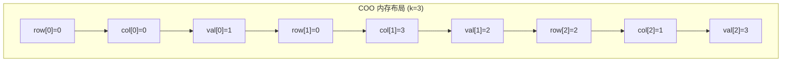
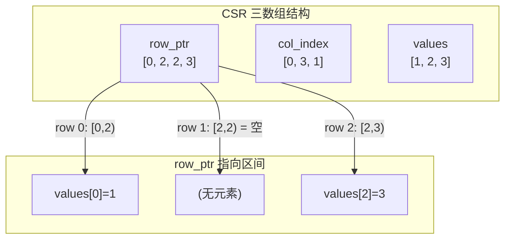
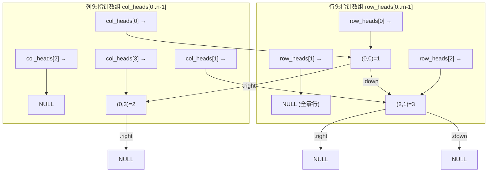
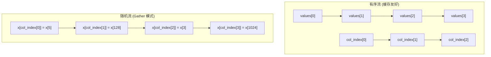

## 稀疏矩阵 (Sparse Matrix)

建议先阅读：[[A_数组_Array|数组]] — 稀疏矩阵的所有存储格式，最终都是把矩阵元素存在一维数组里，然后通过额外的索引数据重建二维索引。[[D_容器_Container|容器]] — 连续 vs 节点存储的性能模型直接影响三种格式的选择。

---

## 原理

### 什么是稀疏矩阵：定义与三元组顺序表

设矩阵有 $m \times n$ 个元素、其中非零元素 $k$ 个，密度 $\rho = k/(mn)$。当 $\rho$ 足够小（工程经验常以 $5\%$ 为参考线，教材一般不给绝对阈值而强调"远小于"），用 $m \times n$ 的二维数组存放就是在花钱租仓库堆空气——此时称它为**稀疏矩阵**。

它与数组章的特殊矩阵压缩有一条清晰的分界线：

| | 数组章的特殊矩阵 | 本章的稀疏矩阵 |
|---|---|---|
| 非零元分布 | 规律已知（对称 / 三角 / 带状） | 完全无规律 |
| 压缩手段 | 寻址公式直接映射下标 | 只存非零元 + 辅助索引 |
| 代表结构 | 一维数组 $sa[k]$ | **三元组顺序表**、十字链表 |

#### 三元组顺序表

把每个非零元素连同坐标打包成三元组 $(row,\ col,\ value)$，再按**行优先**次序存进一个数组——这就是教材所说的三元组顺序表：

```c
#define MAXSIZE 100         // 非零元素个数上限
#define MAXRC   32          // 行列上限

typedef struct {
    int row, col;           // 本例 0 起算；读题先确认约定
    int value;
} Triple;

typedef struct {
    Triple data[MAXSIZE];   // 行优先递增排列——快速转置正确性的前提
    int m, n, len;          // 行数、列数、非零元个数
} TSMatrix;
```

本章手算贯穿使用这个例子：

$$
M = \begin{pmatrix}
0 & 12 & 9 & 0 & 0 & 0 \\
0 & 0 & 0 & 0 & 0 & 0 \\
-3 & 0 & 0 & 0 & 0 & 14 \\
0 & 0 & 24 & 0 & 0 & 0 \\
0 & 18 & 0 & 0 & 0 & 0 \\
15 & 0 & 0 & -7 & 0 & 0
\end{pmatrix}_{6 \times 6}, \quad k = 8,\ \rho = 8/36 \approx 22\%
$$

对应的三元组顺序表（`data` 按 `len=8` 有效）：

| p | row | col | value |
|:-:|:---:|:---:|:-----:|
| 0 | 0 | 1 | 12 |
| 1 | 0 | 2 | 9 |
| 2 | 2 | 0 | -3 |
| 3 | 2 | 5 | 14 |
| 4 | 3 | 2 | 24 |
| 5 | 4 | 1 | 18 |
| 6 | 5 | 0 | 15 |
| 7 | 5 | 3 | -7 |

直观感受省掉了什么：36 个单元只留 8 条记录加 3 个标量。代价同样明显——访问 $a_{ij}$ 不再是 $O(1)$：最坏要扫描整个 `data` 数组（$O(k)$），或按行二分（$O(\log k)$）。**稀疏存储的本质是一笔交易：放弃随机访问的常数速度，换回被零元吃掉的内存。**

#### 固定容量的溢出问题

MAXSIZE 是静态上限：转置后非零元个数不变，安全；但**矩阵乘法的结果可能膨胀到 $k_A \times k_B$ 量级**（A 的每个非零元乘 B 的每个同号非零元都可能贡献一个累加项），固定数组可能装不下。工程对策是动态 realloc 扩容，或改用插入 $O(1)$ 的十字链表。笔试一般只问"结果最多可能有多少个非零元"——记住量级即可。

### 为什么要稀疏

上一节看到了稀疏矩阵长什么样，本节回答"为什么值得为它专门设计存储"。一个 $m \times n$ 的矩阵中若绝大多数元素为零，用标准二维数组存储就是在浪费内存和带宽。记矩阵非零元素个数为 $k$，"浪费"需要用更精确的量化来描述：

**内存浪费**：密集存储占用 $m \cdot n \cdot \text{sizeof}(T)$ 字节，但非零信息仅包含在 $k$ 个位置中。浪费率：

$$
\text{waste} = \frac{m \cdot n - k}{m \cdot n} = 1 - \frac{k}{m \cdot n} = 1 - \rho
$$

其中 $\rho = k / (m \cdot n)$ 称为密度（density）。一个 $100000 \times 100000$ 的推荐系统用户-物品矩阵（平均每位用户评价 50 个物品），$\rho \approx 5 \times 10^{-7}$，密集存储需要 40GB，稀疏 COO 格式只需约 $k \cdot (2 \cdot 4 + 4) \approx 600\text{KB}$——减少了四个数量级。

**计算浪费**：矩阵乘法 $C = A \times B$ 的朴素算法需要 $O(m \cdot n \cdot p)$ 的乘加操作，但其中与零元素相关的运算结果恒为零。这些零值不仅浪费 ALU 周期，还拖慢了有效计算——因为每个"与零相乘"仍需从内存加载该零元素。

### 稀疏度与存储格式的选择

不是所有非满矩阵都适合稀疏格式。需考虑两个因素：空间阈值和访问模式。

**空间阈值的推导**：

| 格式 | 每非零元素字节数 | 空间等价条件 |
|------|:--------------:|-------------|
| 密集矩阵（`int`） | 4 | 基准 |
| COO（int 索引） | $4(\text{val}) + 4(\text{row}) + 4(\text{col}) = 12$ | $k < \frac{1}{3}mn$ |
| CSR（int 索引） | $4(\text{val}) + 4(\text{col}) + \frac{4m}{k}$ | $k < \frac{1}{2}mn$（$m \ll k$ 时） |

对于 `double`（8 字节值）：
- COO 每元素 $8 + 8 = 16$ 字节（若使用 `size_t` 索引则更多），空间等价条件为 $k < \frac{1}{2}mn$
- CSR 每元素约 12 字节，空间等价条件更宽松

总而言之：元素类型越大（double > int），稀疏表示的空间收益越早出现。

| 密度 $\rho$ | 定性 | 推荐格式 |
|:----------:|------|---------|
| $\rho > 50\%$ | 密集 | 标准二维数组 |
| $10\% < \rho \leq 50\%$ | 半稀疏 | CSR（读取优化）或 LIL（构建中） |
| $1\% < \rho \leq 10\%$ | 稀疏 | CSR 标准计算格式 |
| $\rho \leq 1\%$ | 极稀疏 | COO（IO/交换格式） |

### 三种主要表示方法

#### COO（Coordinate Format）

将每个非零元素记录为一个三元组 $(r, c, v)$。逻辑上等价于一个无序列表。

**示例**：矩阵

$$
A = \begin{pmatrix}
1 & 0 & 0 & 2 \\
0 & 0 & 0 & 0 \\
0 & 3 & 0 & 0
\end{pmatrix}_{3 \times 4}, \quad k = 3
$$

COO 表示为三个等长数组：

| 下标 | `row[p]` | `col[p]` | `val[p]` |
|:----:|:--------:|:--------:|:--------:|
| 0 | 0 | 0 | 1 |
| 1 | 0 | 3 | 2 |
| 2 | 2 | 1 | 3 |

三个数组在内存中的布局如下——注意 row 的顺序取决于插入先后，而非行号的逻辑顺序：



**COO 的优点与陷阱**：
- 构造 O(k)：直接从文件/输入流追加三元组，不需要排序
- 但查找一个具体位置 $(i, j)$ 需要扫描全部 k 个三元组——O(k)
- 矩阵乘法需要找到所有 $(A.row = B.col)$ 的三元组对——这是一个 sparse-sparse 的 join 操作，在无序 COO 上是 $O(k_A \cdot k_B)$ 的

COO 最适合作为**交换格式**（从文件读入，导出到文件），而不是**计算格式**。几乎所有稀疏矩阵计算库都提供了 `coo_tocsr()` 函数，将 COO 转换为 CSR 再交给数值计算管线。

#### CSR（Compressed Sparse Row）

CSR 是工业界默认的稀疏矩阵计算格式。它将 COO 中的 `row` 数组替换为行指针数组 `row_ptr`。

**关键设计**：`row_ptr[i]` 指向第 $i$ 行的第一个非零元素在 `values` 和 `col_index` 中的起始位置。第 $i$ 行的非零元素存储在 `values[row_ptr[i] .. row_ptr[i+1]-1]` 区间内。

同一示例矩阵的 CSR：

| 数组 | 内容 | 长度 | 说明 |
|:----:|:----:|:----:|:-----|
| row_ptr | [0, 2, 2, 3] | m+1 = 4 | 每行在 values 中的起止位置 |
| col_index | [0, 3, 1] | k = 3 | 每个非零元素的列号 |
| values | [1, 2, 3] | k = 3 | 非零元素的值（按行优先排列） |

解读：
- 第 0 行：`values[0..1]` = `(1, 2)`，对应列 `col_index[0..1]` = `(0, 3)`
- 第 1 行：`values[2..1]` 为空区间（`row_ptr[1] == row_ptr[2]`），该行全为零
- 第 2 行：`values[2..2]` = `(3)`，对应列 `col_index[2]` = `(1)`



**CSR 的行遍历**——最能体现 CSR 设计优势的操作模式：
```c
// 稀疏矩阵-向量乘法 y = A * x (CSR 实现)
for (int i = 0; i < m; i++) {
 double sum = 0.0;
 for (int p = row_ptr[i]; p < row_ptr[i + 1]; p++)
 sum += values[p] * x[col_index[p]];
 y[i] = sum;
}
```

外层循环 $m$ 次，内层循环只遍历第 $i$ 行的非零元素。总共恰好 $k$ 次乘加操作——不浪费任何运算在零元素上。每个内循环中 `values[p]` 和 `col_index[p]` 在数组中连续排列，因此这 $k$ 次迭代对 cache 几乎完全友好。

**CSR 的"压缩"从何而来**——`row_ptr` 是一个长度为 $m+1$ 的前缀和数组。它消除了 COO 中每个元素显式存储的行号。节省的空间为 $k \times \text{sizeof(int)} - m \times \text{sizeof(int)}$。当 $k \gg m$（非零元素远多于行数）时，节省显著。

#### 十字链表（Orthogonal List）

十字链表将每个非零元素同时链入其所在行的链表和列的链表。每个节点有四个指针字段：

```c
typedef struct OLNode {
 int row, col;
 double value;
 struct OLNode *right; // 同行下一个非零元素
 struct OLNode *down; // 同列下一个非零元素
} OLNode;
```



**十字链表的独特优势**——当矩阵需要频繁的行/列插入/删除时，链表操作是 O(1)（已知前驱节点）。矩阵转置只需交换 `row_heads` 和 `col_heads` 指针数组——不需要移动任何数据。代价是每个非零元素的内存开销约为 CSR 的 3 倍（4 个指针 + row + col + value）。

**十字链表的陷阱**——每个节点占约 40 字节（4×8B 指针 + 3×4B 数据 + 4B padding）。遍历时不仅步进是间接访问（随机访存），而且每个节点本身跨越约 5 条 cache line。对于纯读取场景（如 SpMV），CSR 的紧凑布局碾压十字链表。

**十字链表的"转置"**——交换两套头指针数组即可按另一维度遍历，不移动任何结点：

```c
// 结构级转置：O(m + n)，仅换两套头指针与行列数
void ol_swap_axes(CrossList* mat) {
    OLNode** tmp   = mat->row_heads;
    mat->row_heads = mat->col_heads;
    mat->col_heads = tmp;
    int t = mat->m; mat->m = mat->n; mat->n = t;
}
```

注意这只是一个**视图级**操作：结点里携带的 `row`/`col` 字段仍是旧坐标，若后续算法要读取标签，还需 $O(k)$ 遍历全部结点把两个字段互换。对比三元组顺序表的转置（下一节必须重排整个数组），十字链表"免搬移、只改指针"的优势正在于此——这也是它虽贵却仍被教材保留的理由。

### 四种表示的时间复杂度对比

| 操作 | COO | CSR | CSC | 十字链表 |
|------|:---:|:---:|:---:|:------:|
| 构造 | $O(k)$ | $O(k)$（有序输入）或 $O(k \log k)$（排序） | 同 CSR | $O(k)$ |
| 查找 $(i,j)$ | $O(k)$ | $O(\text{row\_nnz})$ | $O(\text{col\_nnz})$ | $O(\min(\text{row\_nnz}, \text{col\_nnz}))$ |
| 行遍历 | $O(k)$ | $O(\text{row\_nnz})$ | $O(k)$ | $O(\text{row\_nnz})$ |
| 列遍历 | $O(k)$ | $O(k)$（需全扫描） | $O(\text{col\_nnz})$ | $O(\text{col\_nnz})$ |
| 插入元素 | 追加 O(1) | $O(k)$（搬移） | $O(k)$ | O(1)（已知前驱） |
| 每个元素开销 | 12B | ~8-12B | ~8-12B | ~40B |

CSC（Compressed Sparse Column）是 CSR 的列优先镜像——将 `row_ptr` 换为 `col_ptr`（列指针），将 `col_index` 换为 `row_index`。当算法以列遍历为主（如某些线性方程组解法）时，CSC 比 CSR 更合适。MATLAB 内部以 CSC 为主格式。

### 三元组顺序表的转置：核心算法

转置是稀疏矩阵章节的**头号核心知识点**。目标：把行优先存放的三元组表 $M$ 变成 $M^T$ 的行优先三元组表——注意不只是交换 `row`/`col` 两个字段，**输出还必须按新行优先重新排序**，这才是难点所在。

#### 方法一：顺序转置（按列扫描），O(n·k)

最直接的想法：转置后的第 0 行来自原矩阵第 0 列，第 1 行来自第 1 列……于是对每一列扫一遍全表：

```c
// 顺序转置 —— 时间 O(n * k)，空间 O(1)
TSMatrix slow_transpose(const TSMatrix* src) {
    TSMatrix dst;
    dst.m = src->n; dst.n = src->m; dst.len = src->len;
    int q = 0;
    for (int col = 0; col < src->n; col++)        // 依次找原矩阵的第 col 列
        for (int p = 0; p < src->len; p++)        // 扫描全部三元组
            if (src->data[p].col == col) {        // 命中：写入转置表
                dst.data[q].row   = src->data[p].col;
                dst.data[q].col   = src->data[p].row;
                dst.data[q].value = src->data[p].value;
                q++;
            }
    return dst;
}
```

外层 n 列、内层 k 个三元组，比较次数恰好 $n \cdot k$。它保证了输出有序（列号从小到大、同列内按输入次序即原行序），但把"有序"的代价付在了重复扫描上。

#### 方法二：快速转置（计数排序思想），O(n+k)

既然输入本来就按行优先有序，那么"每个元素在输出中的位置"其实可以**一次算出来**——这正是数组章前缀和思想的复用：

1. **计数**：`num[col]` = 原矩阵第 col 列的非零元个数（= 转置后第 col 行的元素个数）
2. **定位**：前缀和得 `cpot[col]` = 转置表中第 col 行的起始下标
3. **分发**：一趟扫描原表，把每个三元组放到 `cpot[它的列号]` 指定的位置并右移指针

```c
// 快速转置 —— 时间 O(n + k)，空间 O(n)
TSMatrix fast_transpose(const TSMatrix* src) {
    TSMatrix dst;
    dst.m = src->n; dst.n = src->m; dst.len = src->len;
    int num[MAXRC] = {0}, cpot[MAXRC] = {0};
    for (int p = 0; p < src->len; p++)            // ① 计数
        num[src->data[p].col]++;
    for (int col = 1; col < src->n; col++)        // ② 前缀和定起点
        cpot[col] = cpot[col-1] + num[col-1];
    for (int p = 0; p < src->len; p++) {          // ③ 一趟分发
        int col = src->data[p].col;
        dst.data[cpot[col]].row   = col;
        dst.data[cpot[col]].col   = src->data[p].row;
        dst.data[cpot[col]].value = src->data[p].value;
        cpot[col]++;
    }
    return dst;
}
```

#### 两种方法的对比

| | 顺序转置 | 快速转置 |
|---|---|---|
| 时间 | $O(n \cdot k)$ | $O(n + k)$ |
| 空间 | $O(1)$ | $O(n)$（num/cpot 辅助数组） |
| 核心动作 | 反复扫描 | 计数 + 前缀和 + 分发 |
| 适用 | 教学基线 / 极小矩阵 | 实际实现与考试答案 |

当 $k$ 达到几千时，$n \cdot k$ 与 $n+k$ 差出几个数量级——这就是教材花两页讲同一个问题的原因。

#### 手算示范：完整轨迹

用本章开头的 $M$（6×6，k=8）走一遍**快速转置**。

第一步，数每列非零元 → num；第二步做前缀和 → cpot：

| col | 0 | 1 | 2 | 3 | 4 | 5 |
|:---:|:-:|:-:|:-:|:-:|:-:|:-:|
| num | 2 | 2 | 2 | 1 | 0 | 1 |
| cpot（初始） | **0** | **2** | **4** | **6** | **7** | **7** |

第三步，按原表次序逐个分发（每次写入 cpot[col] 后该指针右移一位）：

| 取出三元组 | 写入位置 | 转置表内容 | cpot 更新后 |
|:----------:|:--------:|:----------:|:----------:|
| (0,1,12) | Q[2] | (1,0,12) | cpot[1]: 2→3 |
| (0,2,9) | Q[4] | (2,0,9) | cpot[2]: 4→5 |
| (2,0,-3) | Q[0] | (0,2,-3) | cpot[0]: 0→1 |
| (2,5,14) | Q[7] | (5,2,14) | cpot[5]: 7→8 |
| (3,2,24) | Q[5] | (2,3,24) | cpot[2]: 5→6 |
| (4,1,18) | Q[3] | (1,4,18) | cpot[1]: 3→4 |
| (5,0,15) | Q[1] | (0,5,15) | cpot[0]: 1→2 |
| (5,3,-7) | Q[6] | (3,5,-7) | cpot[3]: 6→7 |

最终转置表（已按新行优先有序）：

| p | row | col | value |
|:-:|:---:|:---:|:-----:|
| 0 | 0 | 2 | -3 |
| 1 | 0 | 5 | 15 |
| 2 | 1 | 0 | 12 |
| 3 | 1 | 4 | 18 |
| 4 | 2 | 0 | 9 |
| 5 | 2 | 3 | 24 |
| 6 | 3 | 5 | -7 |
| 7 | 5 | 2 | 14 |

抽查验证：$M^T$ 的第 0 行应是 $M$ 的第 0 列 $(0,0,-3,0,0,15)^T$ → 表中 Q[0]、Q[1] 两项，吻合。若用顺序转置，同样的结果需要 $6 \times 8 = 48$ 次比较才能得到。

**自测：转置手算**

① 写出 $M^T$ 的三元组表（不看上文）；② 若改用顺序转置，写出各列命中次序并统计总比较次数；③ 把 M 第 4 行改为全零后再算一遍 num 与 cpot。

> 答案：
>
> ① 见上表（8 个三元组）。② 各列命中次序：col=0 时依次命中 (2,0,-3)、(5,0,15)；col=1 命中 (0,1,12)、(4,1,18)；col=2 命中 (0,2,9)、(3,2,24)；col=3 命中 (5,3,-7)；col=4 无命中；col=5 命中 (2,5,14)。总比较次数 = 每列都完整扫过 8 个三元组 × 6 列 = **48 次**。③ 第 4 行全零后 k=7，num = [2,1,2,1,0,1]，cpot = [0,2,3,5,6,6]——注意 col=1 少了一个元素后，其后所有起点都要左移一格，这正是前缀和的意义所在。

### 三元组形式的矩阵乘法

CSR 的乘法代码在上一节已经给出，但另一种乘法是**三元组版本**：给定 A（$m \times s$）和 B（$s \times n$）的三元组表，求 C = A×B。

朴素做法：对 A 的每个非零元 $a_{ik}$，找到 B 中所有行号为 $k$ 的非零元 $b_{kj}$，累加 $a_{ik} \cdot b_{kj}$ 到 $C_{ij}$：

```c
// 三元组朴素乘法 —— O(k_A * k_B)，C 用密集数组暂存（已清零）
void triplet_multiply(const TSMatrix* A, const TSMatrix* B, int C[][MAXRC]) {
    for (int pa = 0; pa < A->len; pa++) {
        int i = A->data[pa].row, kk = A->data[pa].col, v = A->data[pa].value;
        for (int pb = 0; pb < B->len; pb++)
            if (B->data[pb].row == kk)                 // B 的行号必须等于 A 的列号
                C[i][B->data[pb].col] += v * B->data[pb].value;
    }
}
```

两个要点：① 结果用**密集数组暂存**——同一 $C_{ij}$ 可能被多对 $(a,b)$ 累加，稀疏乘法的输出未必稀疏；② 复杂度 $O(k_A \cdot k_B)$ 是内层无索引查找的代价，工业实现会先把 B 按 CSR 组织再逐行取用（见上一节的 CSR 乘法）。

**手算示范**：

$$
A = \begin{pmatrix} 1 & 0 & 2 \\ 0 & 3 & 0 \end{pmatrix}_{2\times3}, \quad
B = \begin{pmatrix} 4 & 0 \\ 0 & 5 \\ 6 & 0 \end{pmatrix}_{3\times2}
$$

A 的三元组：(0,0,1)、(0,2,2)、(1,1,3)；B 的三元组：(0,0,4)、(1,1,5)、(2,0,6)。逐个分发：

| A 元素 | 匹配的 B 元素 | 累加到 C |
|:------:|:------------:|:--------:|
| (0,0,1) | (0,0,4) | C[0][0] += 1×4 = 4 |
| (0,2,2) | (2,0,6) | C[0][0] += 2×6 = 12 |
| (1,1,3) | (1,1,5) | C[1][1] += 3×5 = 15 |

最终 $C = \begin{pmatrix} 16 & 0 \\ 0 & 15 \end{pmatrix}$，共 $3 \times 3 = 9$ 次比较完成。

**自测：乘法手算**

设 $A = \begin{pmatrix} 0 & 2 \\ 1 & 0 \end{pmatrix}$、$B = \begin{pmatrix} 3 & 0 \\ 0 & 4 \end{pmatrix}$，写出两者的三元组表，再用上表格式手算 C = A×B，并回答：C 最多可能有多少个非零元？

答案：

A：(0,1,2)、(1,0,1)；B：(0,0,3)、(1,1,4)。

| A 元素 | 匹配的 B 元素 | 累加到 C |
|:------:|:------------:|:--------:|
| (0,1,2) | (1,1,4) | C[0][1] += 8 |
| (1,0,1) | (0,0,3) | C[1][0] += 3 |

$C = \begin{pmatrix} 0 & 8 \\ 3 & 0 \end{pmatrix}$，2 个非零元。理论上限为 $\min(k_A \cdot k_B,\ m \times n) = \min(4,\ 4) = 4$ 个——本题实际只出现 2 个，但实际上限按公式计算。

### 稠密矩阵乘法 vs 稀疏矩阵乘法

标准稠密矩阵乘法 $C = A \times B$ 是三重嵌套循环，$O(m \cdot n \cdot p)$。对于稀疏矩阵，CSR 乘法只遍历非零元素：

```c
// C = A * B (CSR 实现, A 和 B 均采用 CSR 格式)
// 对于 A 的每个非零元素，需要知道它在 B 中对应的行
for (int i = 0; i < A_m; i++) { // A 的每一行
 for (int pa = A_row_ptr[i]; pa < A_row_ptr[i+1]; pa++) {
 int k_col = A_col_index[pa]; // A(i, k_col) 非零
 double a_val = A_values[pa];
 // 遍历 B 的第 k_col 行：B(k_col, :)
 for (int pb = B_row_ptr[k_col]; pb < B_row_ptr[k_col+1]; pb++) {
 int j_col = B_col_index[pb]; // B(k_col, j_col) 非零
 C[i][j_col] += a_val * B_values[pb];
 }
 }
}
```

复杂度为 $O(k_A \cdot \text{avg\_row\_nnz}_B)$。当两者均稀疏时，这远小于 $O(m \cdot n \cdot p)$。但这是 sparse-dense 混合模式——$C$ 通常需要以密集格式或哈希表暂存，因为稀疏乘法的结果可能比输入更密集。

---

## 深入底层

### CSR 行遍历的缓存命中模型

CSR 的 $y = A \cdot x$（稀疏矩阵-向量乘法，SpMV）被公认为数值计算中性能密度最低的操作之一——flop/byte 比极低，瓶颈在内存带宽而非计算。其访存模式分两路：

**顺序流**：`values[p]` 和 `col_index[p]` 按 $p$ 递增连续读取。二者都在同一数组内，内存控制器可以预热 DRAM 的行缓冲（row buffer），连续访问可以达到接近带宽极限的吞吐量。

**随机流**：`x[col_index[p]]` —— 根据列索引从向量 $x$ 中读取。这是一个经典的间接访存模式。当列索引分布随机时，每次访问 $x$ 的不同位置——如果 $x$ 超出 L3 缓存大小，每次几乎都是 cache miss 并读取 DRAM。



**SpMV 的 roofline 模型**：每次内循环做 2 次浮点操作（一次乘 + 一次加），但需要加载至少 12 字节（val 4B + col_idx 4B + x[col] 4B），加上遍历 row_ptr。内存带宽成为瓶颈，而非计算能力。这就是为什么各种稀疏矩阵格式的创新（ELLPACK、Sell-C-σ、CSR5、SELL）都聚焦于减少间接访存或提升 SIMD 利用率。

### COO → CSR 转换：计数排序的硬件行为

COO 转 CSR 的核心是计数排序重排三元组。算法分三步：

1. **计数**（scan and count）：遍历所有三元组，统计每行的非零元素个数 → 写入 `row_counts[0..m-1]`
2. **前缀和**（prefix sum）：`row_ptr[i] = row_ptr[i-1] + row_counts[i-1]`
3. **分发**（scatter）：再次遍历三元组，根据 `row_ptr[三元组.row]` 将值散布到 CSR 的正确位置

步骤 1 和 3 都是 O(k) 的顺序扫描。步骤 2 是 O(m) 的前缀和。整个转换是 $O(k + m)$，且不需要比较操作——它不是"排序"而是"按属性分类"。

**分发的 cache 行为**：步骤 3 中的写操作按三元组的原始行号散布到 CSR 的 `values` 数组的不同位置。如果原始 COO 按行号有序（或大致有序），则这些写入有较好的局部性。反之，若 COO 的行号完全随机，则每次写入可能命中不同的 cache line——发生 cache trashing。生产级的 COO → CSR 转换通常先在步骤 2 和 3 之间对三元组进行一趟"按行计数排序"的扫描，确保输出落点尽量连续。

### 稀疏矩阵的 SIMD 向量化挑战

向量化的本质是一次指令处理多个数据（SIMD：Single Instruction, Multiple Data）。对于密集矩阵，连续 8 或 16 个元素都在连续的 cache line 中，一条 `vfmadd` 指令可以并行处理 8 次乘加。但对于稀疏矩阵，每个非零元素对应的列索引是任意的——没有连续的对齐关系，SIMD 无法直接将 8 个随机的 $x[\text{col\_index}[p]]$ 加载到一个向量寄存器中。

为利用 SIMD：
- **ELLPACK 格式**：将每行的非零元素补齐到相同宽度（如按最大行 nnz），然后将列索引和值按列排列。这样 SIMD 可以直接加载同一"列位置"上多行的对齐数据
- **SELL-C-σ 格式**：将行按 nnz 分组（排序后重排），每组内的行具有相近的 nnz，然后对每组用 ELLPACK 方式排列。平衡了 zero-padding 浪费和 SIMD 友好性

这些先进格式超出了 COO/CSR 的本章范围，但它们揭示了"数据结构布局直接影响 SIMD 利用率"的核心思想。对于深入 SIMD 和向量化原理，见 [[../计算机原理/C_CPU架构#SIMD|计算机原理 — CPU 架构]]。

---

## 实现

### COO 稀疏矩阵转置

```c
#include <stdlib.h>
#include <string.h>

typedef struct {
 int row, col, value;
} Triplet;

typedef struct {
 int m, n, nnz;
 Triplet* elements;
} COOMatrix;

void coo_init(COOMatrix* mat, int m, int n, int nnz) {
 mat->m = m; mat->n = n; mat->nnz = nnz;
 mat->elements = calloc(nnz, sizeof(Triplet));
}

void coo_destroy(COOMatrix* mat) {
 free(mat->elements);
 mat->elements = NULL;
}

// 稀疏矩阵转置: O(k) — 使用计数排序按列号重新分组
COOMatrix coo_transpose(const COOMatrix* src) {
 COOMatrix dst;
 coo_init(&dst, src->n, src->m, src->nnz);

 // ① 统计目标矩阵每行的非零元素个数
 // 转置后 src 的"列"成为 dst 的"行"
 int* row_counts = calloc(dst.m, sizeof(int));
 for (int p = 0; p < src->nnz; p++)
 row_counts[src->elements[p].col]++;

 // ② 前缀和 → 每行在 CSR/目标 COO 中的起始写入偏移
 int* row_start = calloc(dst.m + 1, sizeof(int));
 for (int i = 1; i <= dst.m; i++)
 row_start[i] = row_start[i-1] + row_counts[i-1];

 // ③ 分发：按原列号写入目标矩阵
 int* cur = calloc(dst.m, sizeof(int)); // 当前已写入的偏移
 for (int p = 0; p < src->nnz; p++) {
 int col = src->elements[p].col; // 转置后变为行
 int dest = row_start[col] + cur[col]++;
 dst.elements[dest].row = src->elements[p].col;
 dst.elements[dest].col = src->elements[p].row;
 dst.elements[dest].value = src->elements[p].value;
 }

 free(row_counts); free(row_start); free(cur);
 return dst;
}
```

三步扫描均为 O(k+m)，不需要任何比较操作。计数排序之所以可行，是因为行号/列号的取值范围是 0..n-1（有限整数域），而非无界的键。

### COO → CSR 转换

```c
// 假设 COO 的三元组已按行号排序（或按行计数排序处理过）
void coo_to_csr(const COOMatrix* coo,
 int* values, int* col_index, int* row_ptr) {
 // ① 统计每行非零元素数
 memset(row_ptr, 0, (coo->m + 1) * sizeof(int));
 for (int p = 0; p < coo->nnz; p++)
 row_ptr[coo->elements[p].row + 1]++;

 // ② 前缀和 → 每行的起始偏移
 for (int i = 1; i <= coo->m; i++)
 row_ptr[i] += row_ptr[i - 1];

 // ③ 按行分发到 values/col_index
 int* cur = calloc(coo->m, sizeof(int));
 for (int p = 0; p < coo->nnz; p++) {
 int r = coo->elements[p].row;
 int dest = row_ptr[r] + cur[r]++;
 values[dest] = coo->elements[p].value;
 col_index[dest] = coo->elements[p].col;
 }
 free(cur);
}
```

注意 `row_ptr` 的含义：在步骤②完成后，`row_ptr[i]` 是第 i 行**之前**的所有行非零元素总数；在步骤③分发过程中，`row_ptr[r] + cur[r]` 定位到当前行的**下一个可写**位置。分发完成后，`row_ptr[i]` 仍是第 i 行的起始偏移。

### CSR 矩阵初始化与销毁

```c
typedef struct {
 int m, n, nnz;
 int* row_ptr;
 int* col_index;
 int* values;
} CSRMatrix;

// 从 COO 三元组构建 CSR 矩阵：O(k + m)
void csr_init(CSRMatrix* csr, int m, int n, const Triplet* coo, int nnz) {
 csr->m = m; csr->n = n; csr->nnz = nnz;
 csr->row_ptr   = calloc(m + 1, sizeof(int));
 csr->col_index = calloc(nnz, sizeof(int));
 csr->values    = calloc(nnz, sizeof(int));

 for (int p = 0; p < nnz; p++)
  csr->row_ptr[coo[p].row + 1]++;
 for (int i = 1; i <= m; i++)
  csr->row_ptr[i] += csr->row_ptr[i - 1];

 int* cur = calloc(m, sizeof(int));
 for (int p = 0; p < nnz; p++) {
  int r = coo[p].row;
  int dest = csr->row_ptr[r] + cur[r]++;
  csr->values[dest]    = coo[p].value;
  csr->col_index[dest] = coo[p].col;
 }
 free(cur);
}

void csr_destroy(CSRMatrix* csr) {
 free(csr->row_ptr);
 free(csr->col_index);
 free(csr->values);
 csr->row_ptr = csr->col_index = csr->values = NULL;
}
```

---

## 各语言标准库对比

| 语言 | 稀疏矩阵支持 | 说明 |
|------|:---:|------|
| C | 无标准库 | 手动实现 COO/CSR/CSC |
| C++ | Eigen / Armadillo | 第三方库；Eigen::SparseMatrix 内部用 CSC 格式 |
| Python | scipy.sparse | 格式全面：COO / CSR / CSC / LIL / DOK / BSR |
| MATLAB | 原生支持 | `sparse()` 函数构造，内部用 CSC 格式 |
| Julia | SparseArrays | 标准库，内部用 CSC |
| Rust | sprs crate | CSR / CSC/ COO |

---

## 应用场景

- **图论**：邻接矩阵。顶点数 10000、平均度 20 的图 → 密集矩阵 100M 个位置（400MB），CSR 仅需约 200K 个非零（~2MB）
- **推荐系统**：用户-物品评分矩阵。百万用户 × 百万物品，每行平均几十个评分 → CSR 行遍历对应"找出用户的所有评分"
- **NLP / 文本挖掘**：TF-IDF 矩阵。行 = 文档（百万），列 = 词汇（几十万），每篇文档仅包含几百个词
- **PDE / 有限元分析**：刚度矩阵。偏微分方程离散化后的稀疏矩阵——每行仅几个非零（邻居顶点的贡献），但矩阵的尺寸可达百万阶
- **PageRank 计算**：Web 图的邻接矩阵，使用稀疏矩阵-向量乘法的迭代

---

## 练习

| 题号 | 题目 | 难度 | 知识点 |
|------|------|:----:|--------|
| [867](https://leetcode.cn/problems/transpose-matrix/) | 转置矩阵 | 入门 | 密集转置 / 行列交换 |
| [73](https://leetcode.cn/problems/set-matrix-zeroes/) | 矩阵置零 | 中等 | 原地标记 |
| [48](https://leetcode.cn/problems/rotate-image/) | 旋转图像 | 中等 | 转置+翻转 |
| [311](https://leetcode.cn/problems/sparse-matrix-multiplication/) | 稀疏矩阵的乘法 | 中等 | COO/CSR 逐行点积（力扣英文版） |

### 核心推演清单

练习题与上面的 LeetCode 互补——侧重手算推演，全部在正文中带完整答案：

| 自测 | 位置 | 内容 |
|------|------|--------|
| 转置手算（3 问） | 快速转置轨迹之后 | 写 $M^T$ 三元组表、顺序法命中次序与比较次数、num/cpot 重算 |
| 乘法手算 | 三元组乘法示范之后 | 三元组表书写 + 逐对分发累加 + 非零元上限公式 |

---

## 动手实验

| 编号 | 题目 | 说明 |
|:----:|------|------|
| E1 | 稀疏度与内存效率验证 | 随机生成 $1000 \times 1000$ 的矩阵，用 COO 和密集二维数组分别存储。密度从 0.1% 到 80% 递增，画出两种存储的实际内存曲线（用 `mallinfo` 或 `valgrind massif` 测量）。标注理论交叉点 $\rho = \frac{\text{sizeof}(T)}{\text{sizeof}(\text{COO\_elem})}$ |
| E2 | SpMV CSR vs 密集对比 | 对同一个矩阵分别用 CSR 格式和密集二维数组执行 $y = A \cdot x$，密度从 5% 递减到 0.01%，绘制两种方法的耗时曲线。用 `perf stat -e cache-misses` 统计二者的 cache miss 差异 |
| E3 | COO 转置中计数排序的性能特征 | 生成两种 COO 矩阵：(a) 三元组按行号有序，(b) 三元组完全随机排列。分别对两者执行转置，计时并统计 cache miss。解释为何有序输入的 COO 转置更快 |
