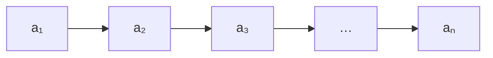
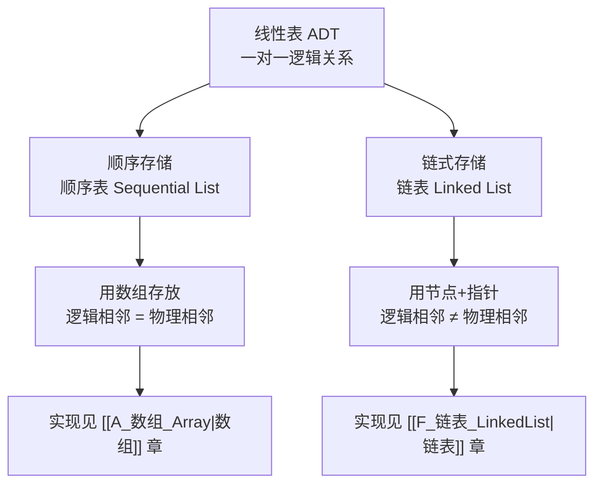

建议先阅读: [[A_数组_Array|数组]] — 顺序表的底层就是数组，寻址公式与动态扩容在本章会被直接引用。

> **本章定位**：线性表是最基础、最常用的数据结构，也是 408 的第一考点。数组章讲的是"连续内存怎么用"，链表章讲的是"节点怎么串"，而本章回答一个更上位的问题：**线性表这套 ADT 是什么，它的两种实现（顺序表/链表）如何取舍**。读完本章再进入 [[F_链表_LinkedList|链表]]，你会清楚链表到底在"替代"什么。

---

## 一、什么是线性表

### 1.1 定义

**线性表（Linear List）是 $n$ 个数据元素的有限序列**，记作：

$$
L = (a_1,\ a_2,\ \dots,\ a_i,\ \dots,\ a_n) \quad (n \ge 0)
$$

- $n$ 为表长；$n = 0$ 时称为**空表**
- $a_i$ 是第 $i$ 个元素，$i$ 是它的**位序**（从 1 开始，注意与数组下标从 0 开始的区别）
- 除第一个元素外，每个元素有且仅有一个**直接前驱**；除最后一个元素外，每个元素有且仅有一个**直接后继**

### 1.2 逻辑特征：一对一

线性表的逻辑结构是典型的**线性结构**（回顾 [[0 基本知识|基本知识]] 中的四类逻辑结构）：



| 位置 | 元素 | 直接前驱 | 直接后继 |
|------|------|:--------:|:--------:|
| 表头 | $a_1$ | 无 | $a_2$ |
| 中间 | $a_i$ | $a_{i-1}$ | $a_{i+1}$ |
| 表尾 | $a_n$ | $a_{n-1}$ | 无 |

注意：**"线性"指的是逻辑关系的一对一，不是物理存储的连续**。元素在内存里可以连续放（顺序表），也可以散落各处用指针相连（链表）——这正是本章后面要展开的两种实现。

### 1.3 生活中的线性表

| 场景 | 元素 | 特点 |
|------|------|------|
| 排队买票 | 每个人 | 有先后次序，只能在队尾加入 |
| 通讯录列表 | 每条联系人记录 | 按录入顺序排列，可插入、删除 |
| 播放列表 | 每首歌 | 有固定顺序，支持任意位置插播 |
| 学生成绩单 | 每个学生的成绩记录 | 按学号或录入顺序组织 |

---

## 二、线性表的 ADT 与基本操作

### 2.1 抽象数据类型视角

数据结构 = 逻辑结构 + 存储结构 + 运算。线性表的**运算**定义在逻辑层面，与存储方式无关——这就是 [[0 基本知识|基本知识]] 里说的"数据抽象"：对外只暴露能做什么，对内怎么存是实现细节。

### 2.2 基本操作一览

| 操作 | 语义 | 典型返回 |
|------|------|---------|
| `InitList(&L)` | 初始化，构造一个空表 | 成功/失败 |
| `DestroyList(&L)` | 销毁表，释放空间 | — |
| `ListEmpty(L)` | 判空 | true / false |
| `ListLength(L)` | 求表长 | 元素个数 |
| `GetElem(L, i, &e)` | **按位查找**：取第 $i$ 个元素 | 元素值 |
| `LocateElem(L, e)` | **按值查找**：找第一个值为 $e$ 的元素 | 位序或地址 |
| `PriorElem(L, e, &pre)` | 求 $e$ 的直接前驱 | 前驱值 |
| `NextElem(L, e, &next)` | 求 $e$ 的直接后继 | 后继值 |
| `ListInsert(&L, i, e)` | 在第 $i$ 个位置**插入** $e$ | 成功/失败 |
| `ListDelete(&L, i, &e)` | **删除**第 $i$ 个元素并返回其值 | 成功/失败 |
| `TraverseList(L)` | 遍历并访问每个元素 | — |

### 2.3 C 接口约定

本章代码统一采用教材风格的接口：用 `Status` 表示执行结果，用 `ElemType` 占位元素类型，参数传指针以便修改表。

```c
#define OK 1
#define ERROR 0
typedef int Status;
typedef int ElemType;      /* 实际使用时替换为具体类型 */

/* 线性表 ADT 的接口（实现可以是顺序表，也可以是链表） */
Status InitList(void *L);
Status ListInsert(void *L, int i, ElemType e);
Status ListDelete(void *L, int i, ElemType *e);
int    ListLength(void *L);
Status GetElem(void *L, int i, ElemType *e);
int    LocateElem(void *L, ElemType e);
```

> **关键思想**：同一套接口，底下换成数组就是顺序表，换成节点指针就是链表。调用者只关心"插入第 3 个位置"这个语义，不关心元素怎么搬。后面两章分别实现这套接口的两种版本。

---

## 三、两种实现：顺序表与链表

线性表只有两种基本存储方式（回顾 [[0 基本知识|基本知识]] 的物理结构）：



| 维度 | 顺序表 | 链表 |
|------|--------|------|
| 存储单元 | 连续内存块 | 任意位置独立节点 |
| 逻辑相邻 | 物理也相邻 | 靠指针建立联系 |
| 随机访问 | 支持，$O(1)$ | 不支持，$O(n)$ |
| 容量 | 固定或需扩容搬移 | 按需申请，天然动态 |

---

## 四、顺序表

### 4.1 定义与结构

**顺序表是用一段地址连续的存储单元依次存放线性表元素的实现**。因为逻辑相邻的元素物理也相邻，所以可以用"基地址 + 偏移"直接算出任意元素的地址——这正是 [[A_数组_Array|数组]] 章的寻址公式。

```c
#define MAXSIZE 100        /* 静态分配的最大容量 */

typedef struct {
    ElemType data[MAXSIZE];  /* 连续存储空间 */
    int length;              /* 当前表长 */
} SqList;
```

实际工程中更常用**动态分配**版本：

```c
typedef struct {
    ElemType *data;    /* 指向堆上申请的连续空间 */
    int length;        /* 当前元素个数 */
    int capacity;      /* 当前容量 */
} SeqList;
```

### 4.2 按位查找：$O(1)$

第 $i$ 个元素（位序从 1 开始）存放在下标 $i-1$ 处：

$$
\text{addr}(a_i) = \text{base} + (i-1) \times \text{sizeof(ElemType)}
$$

> **教材记号**：$LOC(a_i) = LOC(a_1) + (i-1) \times L$，其中 $LOC(a_1)$ 是第一个元素的地址，$L$ 是每个元素占用的字节数。随机访问 $O(1)$ 的秘密就藏在这个"基地址 + 偏移"公式里，与 [[A_数组_Array|数组]] 章的寻址公式是同一个。

```c
Status GetElem(SeqList *L, int i, ElemType *e) {
    if (i < 1 || i > L->length) return ERROR;   /* 位序越界检查 */
    *e = L->data[i - 1];
    return OK;
}
```

一次乘加即可定位，时间复杂度 $O(1)$。这是顺序表相对链表最大的优势。

### 4.3 按值查找：$O(n)$

从头到尾逐个比较，找到返回位序，找不到返回 0：

```c
int LocateElem(SeqList *L, ElemType e) {
    for (int i = 0; i < L->length; i++)
        if (L->data[i] == e) return i + 1;   /* 返回位序 */
    return 0;
}
```

- 最好情况：第 1 个就命中，比较 1 次
- 最坏情况：最后一个或不存在，比较 $n$ 次
- 等概率下查找成功的平均比较次数：$\frac{n+1}{2}$

### 4.4 插入操作与平均移动次数

![[seq_insert.gif]]


**目标**：在位序 $i$（$1 \le i \le n+1$）处插入新元素 $e$。

**算法**：先把第 $i$ 到第 $n$ 个元素**整体后移一位**（必须从后往前搬，否则会覆盖），再写入新元素，最后表长加一。

```c
Status ListInsert(SeqList *L, int i, ElemType e) {
    if (i < 1 || i > L->length + 1) return ERROR;   /* 位置非法 */
    if (L->length == L->capacity) {                 /* 容量不足，扩容 */
        if (GrowList(L) != OK) return ERROR;
    }
    for (int j = L->length; j >= i; j--)   /* 从后往前，后移一位 */
        L->data[j] = L->data[j - 1];
    L->data[i - 1] = e;
    L->length++;
    return OK;
}
```

**平均移动次数推导**：在位置 $i$ 插入，需要移动的元素个数为 $n - i + 1$。

| 插入位置 | 移动个数 |
|---------|---------|
| 表头（$i=1$） | $n$ |
| 表尾（$i=n+1$） | $0$ |
| 一般位置 $i$ | $n-i+1$ |

假设 $n+1$ 个插入位置等概率，平均移动次数为：

$$
E_{\text{insert}} = \frac{1}{n+1}\sum_{i=1}^{n+1}(n-i+1) = \frac{1}{n+1}\cdot\frac{n(n+1)}{2} = \frac{n}{2}
$$

即**插入平均要移动一半元素**，时间复杂度 $O(n)$。

### 4.5 删除操作与平均移动次数

![[seq_delete.gif]]


**目标**：删除位序 $i$（$1 \le i \le n$）处的元素，并用 $e$ 返回其值。

**算法**：保存被删元素，把第 $i+1$ 到第 $n$ 个元素**整体前移一位**（从前往后搬），表长减一。

```c
Status ListDelete(SeqList *L, int i, ElemType *e) {
    if (i < 1 || i > L->length) return ERROR;
    *e = L->data[i - 1];
    for (int j = i; j < L->length; j++)   /* 从前往后，前移一位 */
        L->data[j - 1] = L->data[j];
    L->length--;
    return OK;
}
```

**平均移动次数推导**：删除位置 $i$ 需要移动 $n-i$ 个元素。

| 删除位置 | 移动个数 |
|---------|---------|
| 表头（$i=1$） | $n-1$ |
| 表尾（$i=n$） | $0$ |
| 一般位置 $i$ | $n-i$ |

$n$ 个删除位置等概率，平均移动次数：

$$
E_{\text{delete}} = \frac{1}{n}\sum_{i=1}^{n}(n-i) = \frac{1}{n}\cdot\frac{n(n-1)}{2} = \frac{n-1}{2}
$$

**两个平均移动次数是 408 选择题的高频考点**：插入平均 $\frac{n}{2}$ 次，删除平均 $\frac{n-1}{2}$ 次。记忆技巧：插入可插 $n+1$ 个位置，删除只有 $n$ 个位置。

### 4.6 扩容：顺序表的动态化

静态顺序表容量写死，动态版本在容量不足时申请一块更大的连续空间（通常翻倍），把旧数据整体搬过去，再释放旧空间——这就是 [[A_数组_Array|数组]] 章讲过的**均摊分析**：虽然单次扩容是 $O(n)$，但均摊到每次插入只有 $O(1)$。

```c
Status GrowList(SeqList *L) {
    int newCap = L->capacity ? L->capacity * 2 : 8;
    ElemType *p = realloc(L->data, newCap * sizeof(ElemType));
    if (p == NULL) return ERROR;
    L->data = p;
    L->capacity = newCap;
    return OK;
}
```

> 扩容的代价是**搬移全部元素**且**要求内存有足够大的连续空闲区**，这是顺序表在工程上的主要痛点；链表用节点分散分配绕开了它，但付出了指针开销与缓存不友好的代价。

---

## 五、顺序表 vs 链表

### 5.1 八维度对比

| 维度 | 顺序表 | 链表 |
|------|--------|------|
| 存储方式 | 连续内存 | 离散节点 + 指针 |
| 随机访问 | $O(1)$ | $O(n)$（必须从头遍历） |
| 按值查找 | $O(n)$，平均 $\frac{n+1}{2}$ 次比较 | $O(n)$，比较次数相同但常数更大 |
| 插入/删除（已知位置） | $O(n)$，平均移动 $\frac{n}{2}$ / $\frac{n-1}{2}$ | $O(1)$，只改指针 |
| 插入/删除（需先查找位置） | $O(n)$ 查找 + $O(n)$ 移动 | $O(n)$ 查找 + $O(1)$ 改指针 |
| 空间分配 | 预先分配或扩容搬移，可能浪费 | 按需分配，无碎片浪费（但指针占空间） |
| 存储密度 | $= 1$（全部空间存数据） | $< 1$（每个节点含指针开销） |
| 缓存友好度 | 好（连续内存，空间局部性） | 差（节点分散，pointer chasing） |

**存储密度**定义为：

$$
\text{存储密度} = \frac{\text{数据元素本身占用的空间}}{\text{整个节点占用的空间}}
$$

顺序表节点只有数据，密度为 1；单链表每个节点还要存一个指针，密度明显小于 1（32 位指针 + int 数据时仅 50%）。

### 5.2 选型口诀

| 场景 | 选择 | 原因 |
|------|------|------|
| 频繁按位访问、很少插删 | 顺序表 | 随机访问 $O(1)$，缓存友好 |
| 频繁在已知位置插删 | 链表 | 改指针 $O(1)$，无需搬移 |
| 数据量无法预估、波动大 | 链表 | 按需分配，不浪费也不溢出 |
| 对内存连续性/缓存敏感 | 顺序表 | 链表 pointer chasing 代价高 |
| 需要二分查找 | 顺序表 | 链表无法随机访问，二分退化为 $O(n)$ |

> 现实中"数组 + 双指针 + 原地操作"往往比链表更快，因为缓存的收益远大于搬移的代价——这也是 [[A_数组_Array|数组]] 章反复强调的底层逻辑。

---

## 六、408 高频算法设计题

顺序表算法题是 408 综合应用题（13 分）的常客。以下六题覆盖主流题型，全部要求**手写代码 + 复杂度分析**。

### 6.1 合并两个有序顺序表

**题目**：将两个有序顺序表 $A$、$B$ 合并为新的有序顺序表 $C$，要求不破坏 $A$、$B$。

**思路**：双指针分别扫描 $A$、$B$，每次取较小的放入 $C$，最后把剩余部分直接接上。

```c
Status MergeSq(SeqList *A, SeqList *B, SeqList *C) {
    if (A->length + B->length > C->capacity) return ERROR;  /* 空间不足 */
    int i = 0, j = 0, k = 0;
    while (i < A->length && j < B->length)
        C->data[k++] = (A->data[i] <= B->data[j]) ? A->data[i++] : B->data[j++];
    while (i < A->length) C->data[k++] = A->data[i++];      /* A 剩余 */
    while (j < B->length) C->data[k++] = B->data[j++];      /* B 剩余 */
    C->length = k;
    return OK;
}
```

时间复杂度 $O(m+n)$，空间复杂度 $O(1)$（不算结果表）。

**比较次数分析（408 考点）**：两个长度均为 $n$ 的有序表归并时——

- **最少比较 $n$ 次**：一个表的全部元素都先被取完（例如 $A$ 的所有元素都小于 $B$ 的最小元素，每次都由 $A$ 胜出）；
- **最多比较 $2n-1$ 次**：两表元素交错到最后，当倒数第二个元素被取走时，剩余元素直接接上、不再比较。

> 归并排序的合并步骤正是这个结论的应用：每一层合并的比较次数不超过区间长度，整层累计 $O(n)$。

### 6.2 就地逆置

**题目**：设计算法将顺序表就地逆置，空间复杂度 $O(1)$。

**思路**：首尾双指针相向而行，交换对应元素。

```c
void ReverseSq(SeqList *L) {
    for (int i = 0, j = L->length - 1; i < j; i++, j--) {
        ElemType t = L->data[i];
        L->data[i] = L->data[j];
        L->data[j] = t;
    }
}
```

时间 $O(n)$，空间 $O(1)$。这道题是所有"原地修改"题型的母题。

### 6.3 删除所有值为 x 的元素

**题目**：删除顺序表中所有值为 $x$ 的元素，要求时间 $O(n)$、空间 $O(1)$。

**思路**：用 $k$ 记录不等于 $x$ 的元素个数，一次遍历边扫描边覆盖，避免每删一个就搬一次。

```c
void DeleteAllX(SeqList *L, ElemType x) {
    int k = 0;
    for (int i = 0; i < L->length; i++)
        if (L->data[i] != x) L->data[k++] = L->data[i];
    L->length = k;
}
```

这是顺序表删除的**标准写法**：把"删除"转化为"保留元素的重新写入"，全程只搬一次。

### 6.4 删除有序表中的重复元素

**题目**：有序顺序表中可能有重复值，删除重复元素使每个值只出现一次。

**思路**：因为有序，重复元素必然相邻。记录最后一个保留元素的下标，后续元素与之不同则保留。

```c
void DeleteDuplicates(SeqList *L) {
    if (L->length == 0) return;
    int k = 0;                              /* 已保留的最后一个位置 */
    for (int i = 1; i < L->length; i++)
        if (L->data[i] != L->data[k]) L->data[++k] = L->data[i];
    L->length = k + 1;
}
```

时间 $O(n)$，空间 $O(1)$。

### 6.5 两个等长有序序列的中位数

**题目**：两个长度均为 $n$ 的有序序列 $A$、$B$，求它们合并后的中位数。

**思路一（$O(n)$）**：归并式扫描，数到第 $n$ 个元素即为中位数。
**思路二（$O(\log n)$，408 加分项）**：分别取两序列的中位数 $a$、$b$ 比较——若 $a = b$ 直接返回；若 $a < b$，则中位数必在 $A$ 的右半段与 $B$ 的左半段中，每次砍掉一半。

```c
ElemType MedianOfTwo(SeqList *A, SeqList *B) {   /* O(n) 版本 */
    int i = 0, j = 0, n = A->length, cnt = 0;
    ElemType mid = 0;
    while (cnt < n) {                              /* 数到第 n 个 */
        if (A->data[i] <= B->data[j]) mid = A->data[i++];
        else                          mid = B->data[j++];
        cnt++;
    }
    return mid;
}
```

> 408 更常考 $O(n)$ 版本的正确性，$O(\log n)$ 版本考分治思想的表述。

### 6.6 循环左移 p 位

**题目**：将顺序表循环左移 $p$ 位（$0 < p < n$），要求空间 $O(1)$。

**思路（三次逆置法）**：左移 $p$ 位 = 把前 $p$ 个逆置 + 后 $n-p$ 个逆置 + 整体逆置。

```c
void LeftRotate(SeqList *L, int p) {
    ReverseRange(L, 0, p - 1);            /* 逆置前 p 个 */
    ReverseRange(L, p, L->length - 1);    /* 逆置剩余部分 */
    ReverseRange(L, 0, L->length - 1);    /* 整体逆置 */
}
```

时间 $O(n)$，空间 $O(1)$。这道题展示了"多次局部逆置合成置换"的经典技巧。

---

## 七、各语言中的线性表

| 语言 | 顺序实现 | 链式实现 | 说明 |
|------|---------|---------|------|
| C | 手写数组/动态数组 | 手写节点 | 标准库不提供，最能看清底层 |
| C++ | `std::vector` | `std::list` / `std::forward_list` | vector 是默认选择，list 极少用 |
| Python | `list` | 无内置 | `list` 实为动态数组，链表需自己写或用 `collections.deque` |
| Java | `ArrayList` | `LinkedList` | LinkedList 同时实现 Deque，实际性能常不如 ArrayList |
| Go | slice | 手写节点 | slice 是动态数组视图 |
| Rust | `Vec<T>` | `LinkedList<T>` | 标准库文档明确不推荐 LinkedList |

> 工程结论一致：**顺序表（动态数组）是绝大多数场景的默认选择**，链表只在特定插删模式或内存分配约束下才有优势。

---

## 八、应用场景

- **动态数组容器**：C++ `vector`、Java `ArrayList`、Python `list` 的底层都是顺序表
- **查找表与缓冲区**：需要按下标随机访问的场合（详见 [[A_数组_Array|数组]] 章）
- **LRU 与链式结构**：需要频繁在任意位置插删时用链表（详见 [[F_链表_LinkedList|链表]] 章）
- **操作系统内核**：进程就绪队列、空闲链表等大量使用链式线性表
- **哈希表冲突链**：链地址法用单链表串联同桶元素
- **大整数与多项式**：用顺序表或链表存储系数序列

---

## 练习

| 题号 | 题目 | 难度 | 知识点 |
|------|------|:----:|--------|
| [344](https://leetcode.cn/problems/reverse-string/) | 反转字符串 | 入门 | 首尾双指针就地逆置 |
| [1089](https://leetcode.cn/problems/duplicate-zeros/) | 复写零 | 入门 | 顺序表插入与元素移动 |
| [448](https://leetcode.cn/problems/find-all-numbers-disappeared-in-an-array/) | 找到所有数组中消失的数字 | 入门 | 原地标记、下标映射 |
| [80](https://leetcode.cn/problems/remove-duplicates-from-sorted-array-ii/) | 删除有序数组中的重复项 II | 中等 | 保留 k 个的通用删除写法 |
| [189](https://leetcode.cn/problems/rotate-array/) | 轮转数组 | 中等 | 三次逆置实现循环移位 |
| [4](https://leetcode.cn/problems/median-of-two-sorted-arrays/) | 寻找两个正序数组的中位数 | 困难 | 归并扫描 / 二分分治 |

### 核心推演清单

以下为 408 风格概念题——先自己算，再对照解析。

**题 1（插入平均移动次数）**：长度为 $n$ 的顺序表，在任意合法位置等概率插入一个元素，平均需要移动多少个元素？若只在表头插入呢？

> 插入位置共 $n+1$ 个，位置 $i$ 需移动 $n-i+1$ 个，平均为 $\frac{1}{n+1}\sum_{i=1}^{n+1}(n-i+1) = \frac{n}{2}$。只在表头插入则固定移动 $n$ 个——**"平均"的前提是等概率**，这是最常见的偷换概念陷阱。

**题 2（删除平均移动次数）**：长度为 $n$ 的顺序表，等概率删除任意元素，平均移动多少个？删除表尾呢？

> 删除位置共 $n$ 个，位置 $i$ 需移动 $n-i$ 个，平均为 $\frac{1}{n}\sum_{i=1}^{n}(n-i) = \frac{n-1}{2}$。删除表尾移动 0 个。

**题 3（空间对比）**：$n$ 个元素，顺序表与单链表分别占用多少空间？（设元素占 $d$ 字节，指针占 $p$ 字节，顺序表按满容量计算）

> 顺序表：$nd$ 字节（存储密度 1）；单链表：$n(d+p)$ 字节（存储密度 $\frac{d}{d+p}$）。指针开销是链表固有的空间税。

**题 4（结构选型）**：某系统需要频繁地在表中任意位置插入、删除，且元素个数变化剧烈，应选哪种存储结构？为什么？

> 选链表：插入删除只改指针（$O(1)$，不计查找），且按需分配不受容量限制。若选顺序表，每次插删平均要搬移一半元素，且容量难以预估。

---

## 动手实验

| 编号 | 题目 | 说明 |
|:----:|------|------|
| E1 | 插入/删除平均移动次数实测 | 实现动态顺序表，分别在随机位置执行 10 万次插入与删除，用计数器统计实际移动的元素总数，与理论值 $n/2$、$(n-1)/2$ 对比 |
| E2 | 顺序表 vs 链表遍历性能对比 | 分别构建 1000 万元素的顺序表与单链表，各遍历 10 次并计时。用 `perf stat -e cache-misses` 观察两者缓存缺失数量级差异，解释 pointer chasing 的代价 |
| E3 | 扩容策略对性能的影响 | 实现两种扩容策略（每次 +1 与每次 ×2），各插入 100 万个数并计时。验证均摊分析与实测差异，画出耗时曲线 |
| E4 | 合并两个有序表 | 用 6.1 的算法合并两个各 100 万元素的有序表，计时并与"合并后排序"的方案对比，验证 $O(m+n)$ 与 $O(n\log n)$ 的差距 |
