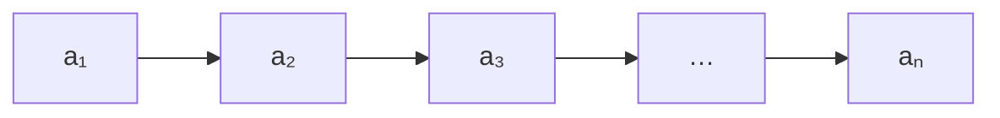
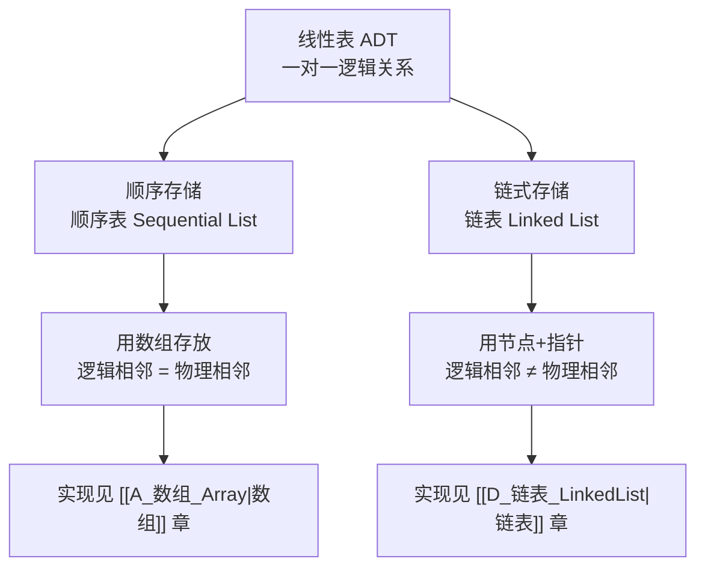

建议先阅读: [[A_数组_Array|数组]] — 顺序表的底层就是数组，寻址公式与动态扩容在本章会被直接引用。

线性表是最基础、最常用的数据结构，也是 408 的第一考点。数组章讲的是"连续内存怎么用"，链表章讲的是"节点怎么串"。本章回答一个更上位的问题：**线性表这套 ADT 是什么，它的两种实现（顺序表/链表）如何取舍**。读完本章再进入 [[D_链表_LinkedList|链表]]，你会清楚链表到底在"替代"什么。

相比于一般的数据结构教学内容，本章会多讲一些上层理论（数学与底层视角）。为了不干扰按考纲复习的同学，这些内容统一放在标注【延伸】的小节里——只准备考研或期末的同学可以先跳过，第二遍再回来读。

---

## 一、什么是线性表

### 1.1 定义

**线性表（Linear List）是 $n$ 个数据元素的有限序列**，记作：

$$
L = (a_1,\ a_2,\ \dots,\ a_i,\ \dots,\ a_n) \quad (n \ge 0)
$$

- $n$ 为表长；$n = 0$ 时称为**空表**
- $a_i$ 是第 $i$ 个元素，$i$ 是它的**位序**（从 1 开始，注意与数组下标从 0 开始的区别）
- 除第一个元素外，每个元素有且仅有一个**直接前驱**；除最后一个元素外，每个元素有且仅有一个**直接后继**

**数据元素与数据项**：线性表的单位是**数据元素**，一个数据元素可以由若干**数据项**组成。例如学生成绩表中的一条记录是数据元素，其中的姓名、学号、成绩是数据项（回顾 [[0 基本知识#数据元素|数据元素]]）。

### 1.2 逻辑特征：一对一

线性表的逻辑结构是典型的**线性结构**（回顾 [[0 基本知识|基本知识]] 中的四类逻辑结构）：



| 位置 | 元素 | 直接前驱 | 直接后继 |
|------|------|:--------:|:--------:|
| 表头 | $a_1$ | 无 | $a_2$ |
| 中间 | $a_i$ | $a_{i-1}$ | $a_{i+1}$ |
| 表尾 | $a_n$ | $a_{n-1}$ | 无 |

注意：**"线性"指的是逻辑关系的一对一，不是物理存储的连续**。元素在内存里可以连续放（顺序表），也可以散落各处用指针相连（链表）——这正是本章后面要展开的两种实现。

栈和队列是**操作受限的线性表**——只允许在端点插入/删除，但元素之间仍是一对一关系，逻辑上仍属于线性结构（详见 [[E_栈_Stack|栈]]、[[F_队列_Queue|队列]]）；串、数组同样是线性结构。

#### 生活中的线性表

| 场景    | 元素        | 特点             |
| ----- | --------- | -------------- |
| 排队买票  | 每个人       | 有先后次序，只能在队尾加入  |
| 通讯录列表 | 每条联系人记录   | 按录入顺序排列，可插入、删除 |
| 播放列表  | 每首歌       | 有固定顺序，支持任意位置插播 |
| 学生成绩单 | 每个学生的成绩记录 | 按学号或录入顺序组织     |

### 1.3 序列与函数【延伸】

> 这一节与考试无关，看不懂可以跳过，不影响后面的阅读。

抛开存储细节，线性表在数学上就是一个**有限序列**。用函数语言表述更严格：设元素取自集合 $D$，长度为 $n$ 的线性表是一个映射

$$
L:\ \{1, 2, \dots, n\} \to D, \qquad L(i) = a_i
$$

- 定义域是位序集合 $\{1, 2, \dots, n\}$，值域是元素集合 $D$ 的子集；
- 前驱/后继关系把 $a_1 \to a_2 \to \dots \to a_n$ 串成一条**链**：每个元素至多一个前驱、至多一个后继，这正是数学中"链（chain）"的结构；
- 空表 $n = 0$ 对应定义域为空集——它仍然是合法的线性表；
- 从这个定义出发，插入/删除只是改变映射的定义域与取值，与"怎么存"完全无关——这就是 [[0 基本知识#抽象数据类型（ADT）|抽象数据类型]] 的数学基础。

---

## 二、线性表的 ADT 与基本操作

### 2.1 抽象数据类型视角

数据结构 = 逻辑结构 + 存储结构 + 运算。线性表的**运算**定义在逻辑层面，与存储方式无关——这就是 [[0 基本知识|基本知识]] 里说的"数据抽象"：对外只暴露能做什么，对内怎么存是实现细节。

### 2.2 基本操作一览（C 语言接口）

下面的函数原型就是本章代码要实现的接口。**位序一律从 1 开始**，`SeqList` 是动态顺序表结构体（见 4.1），输出参数用指针带回结果。

| 函数原型 | 语义 | 调用示例 | 返回 |
|---------|------|---------|------|
| `Status InitList(SeqList *L)` | 初始化，构造空表 | `InitList(&L);` | `OK` / `ERROR` |
| `void DestroyList(SeqList *L)` | 销毁表，释放堆空间 | `DestroyList(&L);` | 无 |
| `int ListEmpty(SeqList *L)` | 判空 | `if (ListEmpty(&L))` | 1 空 / 0 非空 |
| `int ListLength(SeqList *L)` | 求表长 | `int n = ListLength(&L);` | 元素个数 |
| `Status GetElem(SeqList *L, int i, ElemType *e)` | 按位查找，取第 $i$ 个元素 | `GetElem(&L, 3, &x);` | `OK` / `ERROR` |
| `int LocateElem(SeqList *L, ElemType e)` | 按值查找 | `int pos = LocateElem(&L, 7);` | 位序，0 表示没找到 |
| `Status ListInsert(SeqList *L, int i, ElemType e)` | 在第 $i$ 位插入 $e$ | `ListInsert(&L, 2, 99);` | `OK` / `ERROR` |
| `Status ListDelete(SeqList *L, int i, ElemType *e)` | 删除第 $i$ 个元素并带回其值 | `ListDelete(&L, 2, &old);` | `OK` / `ERROR` |
| `Status SetElem(SeqList *L, int i, ElemType e)` | 修改第 $i$ 个元素的值 | `SetElem(&L, 2, 100);` | `OK` / `ERROR` |
| `void TraverseList(SeqList *L, void (*visit)(ElemType))` | 遍历并访问每个元素 | `TraverseList(&L, print_elem);` | 无 |

参数类型说明：

- `SeqList *L`：顺序表指针。C 语言按值传递，要修改表本身就必须传地址；
- `int i`：**位序**（第几个元素），不是数组下标；
- `ElemType e`：元素类型的占位名，实际使用时可替换为 `int`、`char`、结构体等；
- `ElemType *e`：输出参数，函数把结果写进这个地址，调用时用 `&变量` 传入；
- `Status`：`int` 的别名，用 `OK`（1）/ `ERROR`（0）表示执行结果。

### 2.3 C 接口约定

本章代码统一采用教材风格的接口：用 `Status` 表示执行结果，用 `ElemType` 占位元素类型，参数传指针以便修改表。

```c
#define OK 1
#define ERROR 0
typedef int Status;
typedef int ElemType;      /* 实际使用时替换为具体类型 */

/* 下面每个函数在 4.2 之后逐一实现 */
Status InitList(SeqList *L);
void   DestroyList(SeqList *L);
int    ListEmpty(SeqList *L);
int    ListLength(SeqList *L);
Status GetElem(SeqList *L, int i, ElemType *e);
int    LocateElem(SeqList *L, ElemType e);
Status ListInsert(SeqList *L, int i, ElemType e);
Status ListDelete(SeqList *L, int i, ElemType *e);
Status SetElem(SeqList *L, int i, ElemType e);
void   TraverseList(SeqList *L, void (*visit)(ElemType));
```

一个最小的使用例子：

```c
SeqList L;
InitList(&L);
ListInsert(&L, 1, 10);
ListInsert(&L, 2, 20);
ListInsert(&L, 1, 5);      /* 表变成 5, 10, 20 */
ElemType x;
GetElem(&L, 2, &x);        /* x = 10 */
DestroyList(&L);
```

> **关键思想**：同一套接口，底下换成数组就是顺序表，换成节点指针就是链表。调用者只关心"插入第 3 个位置"这个语义，不关心元素怎么搬。下一章实现同一套接口的链表版本。

### 2.4 与 C++ STL 的对照（选读）

如果平时用 C++，上面这些操作在 `std::vector` 里都有现成的对应物：

| 本章接口 | C++ `std::vector` | 说明 |
|---------|-------------------|------|
| `InitList` | 构造函数 `vector<int> v;` | 构造即初始化 |
| `DestroyList` | 析构函数（自动） | 离开作用域自动释放 |
| `ListLength` / `ListEmpty` | `v.size()` / `v.empty()` | 直接查询 |
| `GetElem(L, i)` | `v[i - 1]` 或 `v.at(i - 1)` | `at` 会做越界检查 |
| `SetElem(L, i, e)` | `v[i - 1] = e` | 同样 O(1) |
| `ListInsert(L, i, e)` | `v.insert(v.begin() + i - 1, e)` | 同样要搬移元素 |
| `ListDelete(L, i)` | `v.erase(v.begin() + i - 1)` | 同样要搬移元素 |
| `TraverseList` | 范围 for / 迭代器 | `for (int x : v)` |

看这张表可以知道：**STL 的 vector 就是顺序表的工程实现**，接口换了名字，底层的搬移逻辑完全一样。后面学容器章（[[G_容器_Container|容器]]）时会从内存和迭代器角度再讲一遍。

---

## 三、两种实现：顺序表与链表

线性表只有两种基本存储方式（回顾 [[0 基本知识|基本知识]] 的物理结构）：



| 维度 | 顺序表 | 链表 |
|------|--------|------|
| 存储单元 | 连续内存块 | 任意位置独立节点 |
| 逻辑相邻 | 物理也相邻 | 靠指针建立联系 |
| 随机访问 | 支持，$O(1)$ | 不支持，$O(n)$ |
| 容量 | 固定或需扩容搬移 | 按需申请，天然动态 |

---

## 四、顺序表

> 链表章节详见 [[D_链表_LinkedList|链表]]；两者同属线性结构，建议对照学习。

### 4.1 定义与结构

**顺序表是用一段地址连续的存储单元依次存放线性表元素的实现**。因为逻辑相邻的元素物理也相邻，所以可以用"基地址 + 偏移"直接算出任意元素的地址——这正是 [[A_数组_Array|数组]] 章的寻址公式。

可以知道顺序表有以下几种基本特征：

1. 元素之间存在一对一的线性关系，除去第一个和最后一个元素以外，每个元素有且仅有一个直接前驱和一个直接后继；
2. 逻辑上可以用有序数列进行表示 `{a, b, c, d, e, ...}`；
3. 逻辑相连与物理相邻一致：顺序表用一组连续的内存单元依次存放这些元素，空间紧密联系，只有一块连续内存。

从这些基本特征我们可以知道一些对于顺序表的注意事项。

1. 因为物理内存连续，插入、删除的时候要移动大量的元素：在第 $i$ 个位置插入，要把 $i$ 到末尾的元素整体后移；删除第 $i$ 个元素，要把 $i+1$ 到末尾的元素整体前移。所以平均时间复杂度都是 $O(n)$。
2. 插入时从后向前移动，删除时从前往后移动，这是为了避免丢数据。我们一般进行原地插入，尽量减少额外的空间开销，所以会对原表做数据位移，采用拷贝的方式；被拷贝到的位置会被新数据占用，如果方向错误，旧数据还没移动就被覆盖了。
3. 除了检查插入和删除位置的合法性以外，还要注意顺序表大小是否需要扩容；扩容后原先的指针、迭代器可能失效，因为扩容过程可能会把数据搬到新地址，如果外部保存了指向旧数据元素的指针，扩容后不能再用。
4. 适合"读多写少"、频繁随机访问、元素数量可预估的场景；不适合频繁在中间或头部插入、删除的场景，那种情况链表更合适。
5. 如果顺序表存的是指针，直接复制结构体只是复制指针，不复制指向的数据。是否需要深拷贝，取决于你的设计。

静态版本和动态版本的结构定义：

```c
#define MAXSIZE 100        /* 静态分配的最大容量 */

typedef struct {
    ElemType data[MAXSIZE];  /* 连续存储空间 */
    int length;              /* 当前表长 */
} SqList;
```

实际工程中更常用**动态分配**版本（注意动态分配需要手动销毁指针）：

```c
#define INIT_CAPACITY 8    /* 初始容量，可自行调整 */

typedef struct {
    ElemType *data;    /* 指向堆上申请的连续空间 */
    int length;        /* 当前元素个数 */
    int capacity;      /* 当前容量 */
} SeqList;
```

> **约定**：本节往后统一使用动态版本 `SeqList`；静态版本只需把 `data` 换成数组、删掉 `capacity` 与扩容逻辑，其余代码完全一致。

### 4.2 初始化、销毁、判空与求长

**先看核心版本**：初始化只做"申请空间 + 记下长度和容量"。

```c
void init_core(SeqList *L) {
    L->data = malloc(INIT_CAPACITY * sizeof(ElemType));
    L->length = 0;
    L->capacity = INIT_CAPACITY;
}
```

它假设内存一定申请成功，先跑通再说。可 `malloc` 在内存不足时会返回 `NULL`，这时 `L->data` 是空指针，后面任何一次访问都会崩溃。所以正规实现要能把这次失败告诉调用者：

```c
Status InitList(SeqList *L) {
    L->data = malloc(INIT_CAPACITY * sizeof(ElemType));
    if (L->data == NULL) return ERROR;     /* 申请失败，如实上报 */
    L->length = 0;
    L->capacity = INIT_CAPACITY;
    return OK;
}
```

相比核心版本多了两件事：**判空**挡住空指针解引用；**返回 `Status`** 让调用者能选择重试、报错或退出，而不是带着一个坏表继续跑。为什么用 `sizeof(ElemType)` 而不写死字节数？因为 `ElemType` 以后可能换成结构体，写死就要到处改。

销毁的核心版本只有一行 `free(L->data);`。正规版本在释放之后把字段清零：

```c
void DestroyList(SeqList *L) {
    free(L->data);
    L->data = NULL;            /* 防止悬空指针与重复释放 */
    L->length = 0;
    L->capacity = 0;
}
```

为什么要多这一步：`free` 之后指针仍指向已交还的内存，再访问是 use-after-free，再 `free` 一次是 double free。把它置 `NULL` 后，即使不小心重复调用销毁函数也不会出事——这是"防止误用"最常见的做法。

判空与求长只有一句，直接给完整版：

```c
int ListEmpty(SeqList *L)  { return L->length == 0; }
int ListLength(SeqList *L) { return L->length; }
```

为什么结构体里要专门维护一个 `length`，而不是每次都从头数一遍？因为数一遍是 $O(n)$，维护它是 $O(1)$——用一点点空间换时间，这是数据结构设计里最常见的取舍。

### 4.3 按位查找：$O(1)$

位置连续，知道下标可以直接访问。C 语言数组下标从 0 开始，而顺序表位序通常从 1（基本设计思路）开始。第 $i$ 个元素（位序从 1 开始）存放在下标 $i-1$ 处：

$$
\text{addr}(a_i) = \text{base} + (i-1) \times \text{sizeof(ElemType)}
$$

> **教材记号**：$LOC(a_i) = LOC(a_1) + (i-1) \times L$，其中 $LOC(a_1)$ 是第一个元素的地址，$L$ 是每个元素占用的字节数。随机访问 $O(1)$ 的秘密就藏在这个"基地址 + 偏移"公式里，与 [[A_数组_Array|数组]] 章的寻址公式是同一个。

**核心版本**只有一行：

```c
ElemType get_core(SeqList *L, int i) {
    return L->data[i - 1];
}
```

它直接按下标取值，不判断 `i` 是否合法。只要调用者保证 `i` 在范围内，它就能跑，而且是最快的写法。

**正规实现**把越界挡在函数内部，并把结果通过输出参数带回：

```c
Status GetElem(SeqList *L, int i, ElemType *e) {
    if (i < 1 || i > L->length) return ERROR;   /* 位序越界检查 */
    *e = L->data[i - 1];
    return OK;
}
```

补充的部分起两个作用：越界检查防止读到"已经不属于这张表"的内存——C 数组不会帮你检查，读越界就是读脏数据甚至崩溃；用"返回值 + 输出参数"代替直接返回元素，是为了让失败也有地方表达。如果元素类型本身没有空值，直接返回元素就没法区分"合法值"和"读取失败"。

一次乘加即可定位，时间复杂度 $O(1)$。这是顺序表相对链表最大的优势。顺带一提，求第 $i$ 个元素的直接前驱同样是 $O(1)$——前驱就是第 $i-1$ 个元素，代入公式 $LOC(a_{i-1}) = LOC(a_1) + (i-2)L$，仍然一次乘加定位。

**地址计算例题**：顺序表首地址为 100，每个元素长 2 字节，求第 5 个元素的地址。

> $LOC(a_5) = LOC(a_1) + (5-1) \times 2 = 100 + 8 = 108$。

**反向题型**：已知 $LOC(a_7) = 220$、每个元素长 4 字节，求首地址。

> 代入公式反解：$LOC(a_1) = 220 - (7-1) \times 4 = 220 - 24 = 196$。

### 4.4 按值查找：$O(n)$

![[seq_search.gif]]

外部不知道值在何处，只能从头访问。**核心版本**就是一次线性扫描：

```c
int locate_core(SeqList *L, ElemType x) {
    for (int i = 0; i < L->length; i++)
        if (L->data[i] == x) return i + 1;
    return 0;
}
```

为什么返回**位序**而不是下标：和 ADT 其它接口保持一致（`GetElem`、`ListInsert` 都用位序）。为什么找不到返回 0：位序从 1 开始，0 天然非法，调用者用 `if (pos > 0)` 就能判断。

核心版本有一个隐藏前提——`ElemType` 能用 `==` 比较。如果表里存的是结构体，`==` 要么编译不过，要么语义不对（比如只比较了地址）。**正规实现**把"怎么算相等"交给调用者：

```c
int LocateElem(SeqList *L, ElemType x, int (*eq)(ElemType, ElemType)) {
    for (int i = 0; i < L->length; i++)
        if (eq(L->data[i], x)) return i + 1;
    return 0;
}

/* 调用示例：比较整数 */
int eq_int(ElemType a, ElemType b) { return a == b; }
int pos = LocateElem(&L, 7, eq_int);
```

补充的函数指针参数让查找不再依赖元素类型，结构体、字符串都能复用同一份遍历代码——这是 C 里实现"泛型比较"的常规手段。

三种情况：最好第 1 个就命中（1 次比较），最坏最后一个或不存在（$n$ 次），等概率下查找成功的平均比较次数为 $\frac{n+1}{2}$。

### 4.5 插入

![[seq_insert.gif]]

我们需要：把新元素 $e$ 放到第 $i$ 个位置，原来第 $i$ 个及之后的元素依次后移，除 $e$ 以外其余元素的相对顺序不变。位序从 1 开始，$i$ 的合法范围是 $1 \le i \le n+1$（可以插在表尾之后）。

先别急着写代码，用一张表把过程推演一遍（下标 0 开始、位序 1 开始）：

| 下标 | 0 | 1 | 2 | 3 | 4 |
|------|---|---|---|---|---|
| 插入前（$n=3$） | 10 | 20 | 30 | — | — |
| 在 $i=2$（下标 1）插入 99 后 | 10 | 99 | 20 | 30 | — |

从表里能直接看出两件事：要空出下标 $i-1$，必须把下标 $i-1$ 到 $n-1$ 的元素**整体后移一格**；后移要从最后一格开始往前搬，否则前面的格子会把还没搬走的数据覆盖掉。另外，位置是否合法、容量是否够，都可能让操作失败，这两项检查要放在改动数据之前。

抽象为数学公式：在第 $i$ 位插入需要移动的元素个数为

$$
n - i + 1
$$

当 $i = n+1$（插到表尾）时移动 0 个；当 $i = 1$（插到表头）时移动 $n$ 个。

**核心版本**只有"搬移 + 写入 + 长度加一"：

```c
void insert_core(SeqList *L, int i, ElemType e) {
    for (int j = L->length; j >= i; j--)
        L->data[j] = L->data[j - 1];
    L->data[i - 1] = e;
    L->length++;
}
```

它假设位置一定合法、容量一定够。**正规实现**在外面补上这两类检查，并把执行结果返回给调用者：

```c
Status ListInsert(SeqList *L, int i, ElemType e) {
    if (i < 1 || i > L->length + 1) return ERROR;   /* 位置非法 */
    if (L->length == L->capacity) {                 /* 容量不足，扩容 */
        if (GrowList(L) != OK) return ERROR;
    }
    for (int j = L->length; j >= i; j--)   /* 从后往前，后移一位 */
        L->data[j] = L->data[j - 1];
    L->data[i - 1] = e;
    L->length++;
    return OK;
}
```

补充的部分分别防住三类问题：位置检查防止越界写（`i` 只能落在 $1 \sim n+1$）；容量检查防止写到表外，并在必要时调用扩容；返回 `Status` 让"插入失败"不再是静默的。

再逐行看核心机制为什么这么写：

- `j` 从 `L->length` 到 `i`，条件是 `j >= i`：正好表示下标 $n$ 到 $i-1$ 的元素后移，少移一格就会覆盖；
- 从后往前搬：先把最后一格腾出来，前面还没搬的数据就不会被覆盖；
- `L->data[i - 1] = e` 是位序到下标的一次换算，写代码时最容易在这里错；
- `L->length++` 必须最后做：`length` 是"当前元素个数"的唯一事实，搬移还没完成时不能提前加。

**C 语言注意事项**：

- 搬移用的是逐元素赋值。如果元素是结构体，赋值等价于逐字节拷贝，开销随结构体大小增长；工程里数据量大时可用 `memmove`：
  `memmove(L->data + i, L->data + i - 1, (L->length - i + 1) * sizeof(ElemType));`
  用 `memmove` 而不是 `memcpy`，因为源区间和目标区间重叠；
- 扩容用的是 `realloc`，它的返回值不能直接赋给原指针（见 4.8）；
- 如果表里存的是指针，搬移只是拷贝指针，不复制指向的数据。

**平均移动次数推导**：在位置 $i$ 插入，需要移动的元素个数为 $n - i + 1$。

| 插入位置 | 移动个数 |
|---------|---------|
| 表头（$i=1$） | $n$ |
| 表尾（$i=n+1$） | $0$ |
| 一般位置 $i$ | $n-i+1$ |

假设 $n+1$ 个插入位置等概率，平均移动次数为：

$$
E_{\text{insert}} = \frac{1}{n+1}\sum_{i=1}^{n+1}(n-i+1) = \frac{1}{n+1}\cdot\frac{n(n+1)}{2} = \frac{n}{2}
$$

即**插入平均要移动一半元素**，时间复杂度 $O(n)$。

### 4.6 删除

![[seq_delete.gif]]

我们需要：把第 $i$ 个元素从表里去掉，并用 $e$ 把它带回去，其余元素保持原来的相对顺序。$i$ 的合法范围是 $1 \le i \le n$。

注意两点：被删元素要先保存下来，否则前移一开始它就被覆盖了；前移要从前往后搬，先把前面的空位填上，才不会覆盖还没搬的数据。

**核心版本**只有"前移 + 长度减一"：

```c
void delete_core(SeqList *L, int i) {
    for (int j = i; j < L->length; j++)
        L->data[j - 1] = L->data[j];
    L->length--;
}
```

它不接收被删元素，也不检查位置。**正规实现**把被删值带回，并挡住越界：

```c
Status ListDelete(SeqList *L, int i, ElemType *e) {
    if (i < 1 || i > L->length) return ERROR;
    *e = L->data[i - 1];                   /* 先保存，再覆盖 */
    for (int j = i; j < L->length; j++)    /* 从前往后，前移一位 */
        L->data[j - 1] = L->data[j];
    L->length--;
    return OK;
}
```

补充的部分：`*e` 让调用者拿到被删的值，否则这条信息随着覆盖就丢了；越界检查防止读到表外；返回 `Status` 让删除失败可表达。

核心机制为什么这么写：

- `*e = L->data[i - 1]` 必须在搬移之前：一旦开始前移，原位置的值就被覆盖了；
- 前移从前往后：让每个元素先落到前面的空位，不会覆盖还没搬的数据（和插入方向刚好相反）；
- 这里不 `free`：顺序表存的元素是"值"，不是堆对象，删除只是从逻辑上不再算它；如果元素本身是指针，要不要释放由你的设计决定，顺序表本身不负责。

**平均移动次数推导**：删除位置 $i$ 需要移动 $n-i$ 个元素。

| 删除位置 | 移动个数 |
|---------|---------|
| 表头（$i=1$） | $n-1$ |
| 表尾（$i=n$） | $0$ |
| 一般位置 $i$ | $n-i$ |

$n$ 个删除位置等概率，平均移动次数：

$$
E_{\text{delete}} = \frac{1}{n}\sum_{i=1}^{n}(n-i) = \frac{1}{n}\cdot\frac{n(n-1)}{2} = \frac{n-1}{2}
$$

结论：插入平均移动 $\frac{n}{2}$ 个元素，删除平均移动 $\frac{n-1}{2}$ 个元素。

### 4.7 修改与遍历

**修改**和按位查找是对称操作，核心版本就是一次赋值：

```c
void set_core(SeqList *L, int i, ElemType e) {
    L->data[i - 1] = e;
}
```

加上越界检查与返回值就是正规实现——改越界和读越界一样危险，前者会破坏表外的内存：

```c
Status SetElem(SeqList *L, int i, ElemType e) {
    if (i < 1 || i > L->length) return ERROR;
    L->data[i - 1] = e;
    return OK;
}
```

修改本身是 $O(1)$。

**遍历**要把每个元素都访问一遍。

![[seq_traverse.gif]]

核心版本就是一层循环，"访问动作"直接写在循环里：

```c
void traverse_core(SeqList *L) {
    for (int i = 0; i < L->length; i++)
        printf("%d ", L->data[i]);
}
```

它的问题是"访问方式"和"遍历过程"绑死了：想改成求和、写文件、判断是否存在，都要把循环再抄一遍。正规实现把"做什么"抽成一个函数，用函数指针传进来：

```c
void TraverseList(SeqList *L, void (*visit)(ElemType)) {
    for (int i = 0; i < L->length; i++)
        visit(L->data[i]);      /* 对每个元素调用一次 visit */
}
```

用法示例：

```c
void print_elem(ElemType x) { printf("%d ", x); }

TraverseList(&L, print_elem);   /* 输出表中所有元素 */
```

补充的函数指针参数换来了复用：以后要改成求和、打印到文件、判断是否存在，只换一个函数，遍历代码不动。函数指针是 C 里最接近"回调"的手段，格式记成"返回类型 `(*名字)(参数类型)`"即可。

遍历本身是 $O(n)$。注意不要在 `visit` 里修改表长（增删），否则循环边界会失效。

### 4.8 扩容：顺序表的动态化

静态顺序表容量写死，动态版本在容量不足时申请一块更大的连续空间（通常翻倍），把旧数据整体搬过去，再释放旧空间——这就是 [[A_数组_Array|数组]] 章讲过的**均摊分析**：单次扩容是 $O(n)$，均摊到每次插入只有 $O(1)$。

**核心版本**直接"就地"扩容：

```c
void grow_core(SeqList *L) {
    L->data = realloc(L->data, L->capacity * 2 * sizeof(ElemType));
    L->capacity *= 2;
}
```

它有两处隐患：`realloc` 失败会返回 `NULL`，这条赋值就把原来的 `L->data` 直接弄丢了，造成内存泄漏；失败后 `capacity` 仍然翻倍，表的状态与真实内存也对不上。**正规实现**先把返回值接住，确认成功再改结构体：

```c
Status GrowList(SeqList *L) {
    int newCap = L->capacity ? L->capacity * 2 : 8;
    ElemType *p = realloc(L->data, newCap * sizeof(ElemType));
    if (p == NULL) return ERROR;    /* 先接住返回值，失败时原内存不动 */
    L->data = p;                    /* 成功后再改结构体 */
    L->capacity = newCap;
    return OK;
}
```

补充的部分防住"扩容失败还继续用旧表"：`realloc` 失败时原内存仍然有效，返回 `ERROR` 让上层决定重试或放弃，表里的数据不会丢。为什么要倍增而不是每次加 1？每次加 1 的话，插入第 $k$ 个元素要搬 $k-1$ 个，总代价 $O(n^2)$；倍增的均摊代价才是 $O(1)$。

> 扩容的代价是**搬移全部元素**且**要求内存有足够大的连续空闲区**，这是顺序表在工程上的主要痛点；链表用节点分散分配绕开了它，但付出了指针开销与缓存不友好的代价。

### 4.9 顺序表在硬件上是什么【延伸·底层视角】

> 这一节面向想弄明白"为什么数组快"的读者，纯应试可以跳过。

- **一块连续的虚拟内存**：`data` 指针指向一段虚拟地址连续的页；随机访问一次乘加算出地址，再由 MMU 翻译为物理地址，通常命中 TLB；首次写入触发缺页中断（按需分页）。
- **缓存友好**：顺序访问时一条 cache line（通常 64 字节）装下多个元素，硬件预取器能识别连续步长，命中率极高——这是"数组比链表快"的根本原因，详见 [[A_数组_Array|数组]] 与 [[../计算机原理/B_缓存层级|缓存层级]]。
- **扩容的物理代价**：容量不足时 `realloc` 需要申请更大的连续区间并整块拷贝；虚拟地址空间中缺少足够大的连续空洞时，即使总空闲内存充足也会失败。
- **SIMD 机会**：元素连续且类型固定时，编译器可以自动向量化批量运算（求和、点积等），一条指令处理多个元素。

---

## 五、顺序表 和 链表的区别

### 5.1 对比

| 维度 | 顺序表 | 链表 |
|------|--------|------|
| 存储方式 | 连续内存 | 离散节点 + 指针 |
| 随机访问 | $O(1)$ | $O(n)$（必须从头遍历） |
| 按值查找 | $O(n)$，平均 $\frac{n+1}{2}$ 次比较 | $O(n)$，比较次数相同但常数更大 |
| 插入/删除（已知位置） | $O(n)$，平均移动 $\frac{n}{2}$ / $\frac{n-1}{2}$ | $O(1)$，只改指针 |
| 插入/删除（需先查找位置） | $O(n)$ 查找 + $O(n)$ 移动 | $O(n)$ 查找 + $O(1)$ 改指针 |
| 空间分配 | 预先分配或扩容搬移，可能浪费 | 按需分配，无碎片浪费（但指针占空间） |
| 存储密度 | $= 1$（全部空间存数据） | $< 1$（每个节点含指针开销） |
| 缓存友好度 | 好（连续内存，空间局部性） | 差（节点分散，pointer chasing） |

**存储密度**定义为：

$$
\text{存储密度} = \frac{\text{数据元素本身占用的空间}}{\text{整个节点占用的空间}}
$$

顺序表节点只有数据，密度为 1；单链表每个节点还要存一个指针，密度明显小于 1（32 位指针 + int 数据时仅 50%）。

### 5.2 顺序表的优缺点

**优点**：

- **存储密度大（= 1）**：空间几乎全部用于存放数据，没有指针开销；
- **支持随机访问**：按位查找、求前驱都是 $O(1)$；
- **缓存友好**：连续内存、空间局部性好，遍历与批量运算快；
- **实现简单**：直接借助数组，无需动态分配节点。

**缺点**：

- **插入/删除平均要移动约一半元素**，时间复杂度 $O(n)$；
- **容量固定或扩容昂贵**：扩容需要申请新的连续空间并搬移全部元素；
- **要求连续内存**：内存碎片较多时可能分配失败；
- **按值查找仍需 $O(n)$**：随机访问只对"按下标"有效。

### 5.3 如何选型

| 场景 | 选择 | 原因 |
|------|------|------|
| 频繁按位访问、很少插删 | 顺序表 | 随机访问 $O(1)$，缓存友好 |
| 频繁在已知位置插删 | 链表 | 改指针 $O(1)$，无需搬移 |
| 数据量无法预估、波动大 | 链表 | 按需分配，不浪费也不溢出 |
| 对内存连续性/缓存敏感 | 顺序表 | 链表 pointer chasing 代价高 |
| 需要二分查找 | 顺序表 | 链表无法随机访问，二分退化为 $O(n)$ |

> 现实中"数组 + 双指针 + 原地操作"往往比链表更快，因为缓存的收益远大于搬移的代价——这也是 [[A_数组_Array|数组]] 章反复强调的底层逻辑。

---

## 六、高频考点（针对考研考点而总结，含算法设计题）

顺序表算法题是 408 综合应用题（13 分）的常客。下面先给一张真题索引，再逐题讲思路和代码。每道题基本要求都是**手写代码 + 复杂度分析**，后续的衍生题目不作为高频考点。

### 真题索引（2009-2020 顺序表相关综合题）

| 年份 | 题号 | 题目 | 本题解位置 |
|:----:|:----:|------|-----------|
| 2010 | 42 | 数组循环左移 $p$ 位 | [[#6.6 循环左移 p 位]] |
| 2011 | 42 | 两个等长升序序列的中位数 | [[#6.5 两个等长有序序列的中位数]] |
| 2013 | 41 | 主元素（出现次数超过一半） | [[#6.7 主元素]] |
| 2018 | 41 | 未出现的最小正整数 | [[#6.8 未出现的最小正整数]] |
| 2020 | 41 | 三元组的最小距离 | [[#6.9 三元组的最小距离]] |

### 6.1 合并两个有序顺序表

**题目**：将两个有序顺序表 $A$、$B$ 合并为新的有序顺序表 $C$，要求不破坏 $A$、$B$。（教材经典题，归并排序 merge 的基础）

**思路**：双指针分别扫描 $A$、$B$，每次取较小的放入 $C$，最后把剩余部分直接接上。

```c
Status MergeSq(SeqList *A, SeqList *B, SeqList *C) {
    if (A->length + B->length > C->capacity) return ERROR;  /* 空间不足 */
    int i = 0, j = 0, k = 0;
    while (i < A->length && j < B->length)
        C->data[k++] = (A->data[i] <= B->data[j]) ? A->data[i++] : B->data[j++];
    while (i < A->length) C->data[k++] = A->data[i++];      /* A 剩余 */
    while (j < B->length) C->data[k++] = B->data[j++];      /* B 剩余 */
    C->length = k;
    return OK;
}
```

时间复杂度 $O(m+n)$，空间复杂度 $O(1)$（不算结果表）。

> **考点（408 高频）——归并比较次数**：两个长度均为 $n$ 的有序表归并，**最少比较 $n$ 次、最多比较 $2n-1$ 次**。下面给出两种极端情况的解释：

- **最少比较 $n$ 次**：一个表的全部元素都先被取完（例如 $A$ 的所有元素都小于 $B$ 的最小元素，每次都由 $A$ 胜出）；
- **最多比较 $2n-1$ 次**：两表元素交错到最后，当倒数第二个元素被取走时，剩余元素直接接上、不再比较。

> 归并排序的合并步骤正是这个结论的应用：每一层合并的比较次数不超过区间长度，整层累计 $O(n)$。

### 6.2 就地逆置

**题目**：设计算法将顺序表就地逆置，空间复杂度 $O(1)$。（2010 年 42 题循环左移的核心子过程）

**思路**：首尾双指针相向而行，交换对应元素。

```c
void ReverseSq(SeqList *L) {
    for (int i = 0, j = L->length - 1; i < j; i++, j--) {
        ElemType t = L->data[i];
        L->data[i] = L->data[j];
        L->data[j] = t;
    }
}
```

时间 $O(n)$，空间 $O(1)$。这道题是所有"原地修改"题型的母题。

### 6.3 删除所有值为 x 的元素

**题目**：删除顺序表中所有值为 $x$ 的元素，要求时间 $O(n)$、空间 $O(1)$。（教材基础题，各校期末常考）

**思路**：用 $k$ 记录不等于 $x$ 的元素个数，一次遍历边扫描边覆盖，避免每删一个就搬一次。

```c
void DeleteAllX(SeqList *L, ElemType x) {
    int k = 0;
    for (int i = 0; i < L->length; i++)
        if (L->data[i] != x) L->data[k++] = L->data[i];
    L->length = k;
}
```

这是顺序表删除的**标准写法**：把"删除"转化为"保留元素的重新写入"，全程只搬一次。

### 6.4 删除有序表中的重复元素

**题目**：有序顺序表中可能有重复值，删除重复元素使每个值只出现一次。（教材基础题）

**思路**：因为有序，重复元素必然相邻。记录最后一个保留元素的下标，后续元素与之不同则保留。

```c
void DeleteDuplicates(SeqList *L) {
    if (L->length == 0) return;
    int k = 0;                              /* 已保留的最后一个位置 */
    for (int i = 1; i < L->length; i++)
        if (L->data[i] != L->data[k]) L->data[++k] = L->data[i];
    L->length = k + 1;
}
```

时间 $O(n)$，空间 $O(1)$。

### 6.5 两个等长有序序列的中位数

**真题题干（2011 年 408 第 42 题）**：

> 一个长度为 $L$（$L \ge 1$）的升序序列 $S$，处在第 $\lceil L/2 \rceil$ 个位置的数称为 $S$ 的中位数。例如，若序列 $S_1 = (11, 13, 15, 17, 19)$，则 $S_1$ 的中位数是 15；两个序列的中位数是含它们所有元素的升序序列的中位数。例如，若 $S_2 = (2, 4, 6, 8, 20)$，则 $S_1$ 和 $S_2$ 的中位数是 11。现有两个等长升序序列 $A$ 和 $B$，试设计一个在时间和空间两方面都尽可能高效的算法，找出两个序列 $A$ 和 $B$ 的中位数。要求：(1) 给出算法的基本设计思想；(2) 根据设计思想，采用 C 或 C++ 或 Java 语言描述算法，关键之处给出注释；(3) 说明你所设计算法的时间复杂度和空间复杂度。

**考察内容**：分治与减治——每次比较两段的中位数，能一次性排除掉不可能包含答案的一半元素；同时考"两个等长序列"这一条件带来的对称性（不等长时二分边界要另行处理）。

**思路一（$O(n)$）**：归并式扫描，数到第 $n$ 个元素即为中位数。
**思路二（$O(\log n)$，本题的满分要求）**：分别取两序列的中位数 $a$、$b$ 比较——若 $a = b$ 直接返回；若 $a < b$，则中位数必在 $A$ 的右半段与 $B$ 的左半段中，每次砍掉一半。

```c
ElemType MedianOfTwo(SeqList *A, SeqList *B) {   /* O(n) 版本 */
    int i = 0, j = 0, n = A->length, cnt = 0;
    ElemType mid = 0;
    while (cnt < n) {                              /* 数到第 n 个 */
        if (A->data[i] <= B->data[j]) mid = A->data[i++];
        else                          mid = B->data[j++];
        cnt++;
    }
    return mid;
}
```

> 本题真题要求"时间尽可能高效"，满分做法是 $O(\log n)$ 的分治版本；$O(n)$ 版本用来验证思路，考场上写对也能拿大部分步骤分。

### 6.6 循环左移 p 位

**真题题干（2010 年 408 第 42 题）**：

> 设将 $n$（$n > 1$）个整数存放到一维数组 $R$ 中。试设计一个在时间和空间两方面都尽可能高效的算法，将 $R$ 中保存的序列循环左移 $p$（$0 < p < n$）个位置，即把 $R$ 中的数据序列由 $(x_0, x_1, \dots, x_{n-1})$ 变换为 $(x_p, x_{p+1}, \dots, x_{n-1}, x_0, x_1, \dots, x_{p-1})$。要求：(1) 给出算法的基本设计思想；(2) 根据设计思想，采用 C 或 C++ 或 Java 语言描述算法，关键之处给出注释；(3) 说明你所设计算法的时间复杂度和空间复杂度。

**考察内容**：原地置换技巧（三次逆置）与空间 $O(1)$ 的约束；本质是考查能否把"移动"转化为"逆置"这种等价变换。

**思路（三次逆置法）**：左移 $p$ 位 = 把前 $p$ 个逆置 + 后 $n-p$ 个逆置 + 整体逆置。

```c
void ReverseRange(SeqList *L, int lo, int hi) {
    while (lo < hi) {
        ElemType t = L->data[lo];
        L->data[lo++] = L->data[hi];
        L->data[hi--] = t;
    }
}

void LeftRotate(SeqList *L, int p) {
    ReverseRange(L, 0, p - 1);            /* 逆置前 p 个 */
    ReverseRange(L, p, L->length - 1);    /* 逆置剩余部分 */
    ReverseRange(L, 0, L->length - 1);    /* 整体逆置 */
}
```

时间 $O(n)$，空间 $O(1)$。这道题展示了"多次局部逆置合成置换"的经典技巧。

> **【延伸·数学】为什么三次逆置等于循环移位？** 把逆置看成对序列的置换 $R$，它满足 $R^2 = id$（再逆置一次就还原），且对拼接满足 $(XY)^R = Y^R X^R$。设原序列为 $AB$（$A$ 是前 $p$ 个元素），左移 $p$ 位的目标是把 $AB$ 变成 $BA$。三次逆置依次得到：
> $$AB \;\to\; A^R B \;\to\; A^R B^R \;\to\; (A^R B^R)^R = (B^R)^R (A^R)^R = BA$$
> 最后一步正是"反序反序得原序"。这说明三次逆置不是巧合，而是置换代数的一个恒等式。

### 6.7 主元素

**真题题干（2013 年 408 第 41 题）**：

> 已知一个整数序列 $A = (a_0, a_1, \dots, a_{n-1})$，其中 $0 \le a_i < n$（$0 \le i < n$）。若存在 $a_{p_1} = a_{p_2} = \dots = a_{p_m} = x$ 且 $m > n/2$（$0 \le p_k < n$，$1 \le k \le m$），则称 $x$ 为 $A$ 的主元素。例如 $A = (0, 5, 5, 3, 5, 7, 5, 5)$，则 5 为主元素；又如 $A = (0, 5, 5, 3, 5, 1, 5, 7)$，则 $A$ 中没有主元素。假设 $A$ 中的 $n$ 个元素保存在一个一维数组中，请设计一个尽可能高效的算法，找出 $A$ 的主元素。若存在主元素，则输出该元素；否则输出 -1。要求：(1) 给出算法的基本设计思想；(2) 根据设计思想，采用 C 或 C++ 或 Java 语言描述算法，关键之处给出注释；(3) 说明你所设计算法的时间复杂度和空间复杂度。

**考察内容**：摩尔投票（候选消除）思想，以及"投票结果必须再验证一次"的严谨性；题干给出的 $0 \le a_i < n$ 值域条件，也暗示可以用计数数组另解。

**思路（摩尔投票，$O(n)$ 时间、$O(1)$ 空间）**：把主元素当成"候选人"，遇到相同值票数加一，不同值票数减一，票数为 0 就换候选人。最后再数一遍验证。

```c
int Majority(SeqList *L) {
    int cand = L->data[0], votes = 1;
    for (int i = 1; i < L->length; i++) {
        if (votes == 0) { cand = L->data[i]; votes = 1; }
        else if (L->data[i] == cand) votes++;
        else votes--;
    }
    int cnt = 0;
    for (int i = 0; i < L->length; i++)
        if (L->data[i] == cand) cnt++;
    return cnt > L->length / 2 ? cand : -1;   /* 必须验证 */
}
```

注意最后一步验证不能省：投票只能保证"如果存在主元素，候选人一定是它"，不存在时要返回 -1。

### 6.8 未出现的最小正整数

**真题题干（2018 年 408 第 41 题）**：

> 给定一个含 $n$（$n \ge 1$）个整数的数组，请设计一个在时间上尽可能高效的算法，找出数组中未出现的最小正整数。例如，数组 $(-5, 3, 2, 3)$ 中未出现的最小正整数是 1；数组 $(1, 2, 3)$ 中未出现的最小正整数是 4。要求：(1) 给出算法的基本设计思想；(2) 根据设计思想，采用 C 或 C++ 或 Java 语言描述算法，关键之处给出注释；(3) 说明你所设计算法的时间复杂度和空间复杂度。

**考察内容**：关键在于想清楚"答案的范围"——长度为 $n$ 的数组，答案一定落在 $1 \sim n+1$；再用原地交换把值放到对应下标（类似计数排序的一趟），把额外空间压到 $O(1)$。

**思路（原地标记，$O(n)$ 时间、$O(1)$ 额外空间）**：长度 $n$ 的数组里，答案一定在 $1 \sim n+1$ 之间。把值落在 $1 \sim n$ 的元素"归位"到下标 `值-1`，再从头找第一个不满足 `data[i] == i+1` 的位置，答案就是 `i+1`。

```c
int FirstMissingPositive(SeqList *L) {
    int n = L->length;
    for (int i = 0; i < n; i++) {
        while (L->data[i] >= 1 && L->data[i] <= n
               && L->data[i] != L->data[L->data[i] - 1]) {
            int j = L->data[i] - 1;             /* 目标下标 */
            ElemType t = L->data[i];            /* 交换归位 */
            L->data[i] = L->data[j];
            L->data[j] = t;
        }
    }
    for (int i = 0; i < n; i++)
        if (L->data[i] != i + 1) return i + 1;
    return n + 1;
}
```

交换必须用 `while` 而不是 `if`：换过来的新值可能也没归位。

### 6.9 三元组的最小距离

**真题题干（2020 年 408 第 41 题）**：

> 定义三元组 $(a, b, c)$（$a$、$b$、$c$ 均为正数）的距离 $D = |a - b| + |b - c| + |c - a|$。给定 3 个非空整数集合 $S_1$、$S_2$、$S_3$，按升序分别存储在 3 个数组中。请设计一个尽可能高效的算法，计算并输出所有可能的三元组 $(a, b, c)$（$a \in S_1$，$b \in S_2$，$c \in S_3$）中的最小距离。例如 $S_1 = (-1, 0, 9)$，$S_2 = (-25, -10, 10, 11)$，$S_3 = (2, 9, 17, 30, 41)$，则最小距离为 2，相应的三元组为 $(9, 10, 9)$。要求：(1) 给出算法的基本设计思想；(2) 根据设计思想，采用 C 或 C++ 或 Java 语言描述算法，关键之处给出注释；(3) 说明你所设计算法的时间复杂度和空间复杂度。

**考察内容**：把距离化简为 $2 \times (\max - \min)$ 的观察能力，以及"每次移动最小值指针"的贪心正确性说明；三个数组均有序这一条件决定了三指针扫描是 $O(n)$。

**思路（三指针，$O(n)$）**：$D$ 只由最大、最小值决定，等于 $2 \times (\max - \min)$。三个指针分别指向三个数组的当前元素，每次把**最小的那个指针往前走一步**，途中记录最小距离。

```c
int MinDistance3(SeqList *A, SeqList *B, SeqList *C) {
    int i = 0, j = 0, k = 0;
    int best = INT_MAX;
    while (i < A->length && j < B->length && k < C->length) {
        int a = A->data[i], b = B->data[j], c = C->data[k];
        int mx = a > b ? (a > c ? a : c) : (b > c ? b : c);
        int mn = a < b ? (a < c ? a : c) : (b < c ? b : c);
        int d = 2 * (mx - mn);
        if (d < best) best = d;
        if (mn == a) i++;
        else if (mn == b) j++;
        else k++;
    }
    return best;
}
```

时间 $O(n)$、空间 $O(1)$。真题还要求说明"为什么移动最小值不会漏掉最优解"——因为要让距离变小，只能抬高当前的最小值。（代码中的 `INT_MAX` 需要 `#include <limits.h>`。）

### 6.10 概念考点速记（选择题/填空题）

算法设计题之外，选择题和填空题更爱考下面这些概念性结论，集中放在这里对照复习。正文里不再穿插考点提示，以免打断原理的学习。

**1. 前驱与后继的范围**：线性表中不是每个元素都有直接前驱和直接后继——第一个元素无前驱，最后一个元素无后继，其余元素各有一个直接前驱和一个直接后继。

> 考察内容：判断题常考"有限序列""一对一"的表述；选择题问"哪些元素没有前驱/后继"。

**2. 栈、队列仍是线性结构**：栈和队列是操作受限的线性表——只允许在端点插入/删除，但元素之间仍是一对一关系，逻辑上属于线性结构；串、数组同样属于线性结构。

> 考察内容：概念辨析题，考"受限线性表"与线性结构的关系。

**3. 顺序表的两个 $O(1)$**：访问第 $i$ 个元素是 $O(1)$；求第 $i$ 个元素的直接前驱同样是 $O(1)$——前驱就是第 $i-1$ 个元素，代入 $LOC$ 公式一次乘加定位。

> 考察内容：复杂度判断、地址计算选择题。

**4. 平均移动次数**：长度为 $n$ 的顺序表，插入平均移动 $\frac{n}{2}$ 个元素，删除平均移动 $\frac{n-1}{2}$ 个元素。记忆技巧：插入可插 $n+1$ 个位置，删除只有 $n$ 个位置。

> 考察内容：填空题给 $n$ 求平均移动次数；选择题辨析"平均"与"最坏/最好"的区别。

**5. 随机访问与插删是一体两面**：连续存储带来寻址便利（随机访问 $O(1)$），也带来搬移代价（插入/删除 $O(n)$）。

> 考察内容：选择题常把两者颠倒设置干扰项，例如"顺序表插入是 $O(1)$"这种错误表述。

---

## 七、各语言中的线性表

| 语言 | 顺序实现 | 链式实现 | 说明 |
|------|---------|---------|------|
| C | 手写数组/动态数组 | 手写节点 | 标准库不提供，最能看清底层 |
| C++ | `std::vector` | `std::list` / `std::forward_list` | vector 是默认选择，list 极少用 |
| Python | `list` | 无内置 | `list` 实为动态数组，链表需自己写或用 `collections.deque` |
| Java | `ArrayList` | `LinkedList` | LinkedList 同时实现 Deque，实际性能常不如 ArrayList |
| Go | slice | 手写节点 | slice 是动态数组视图 |
| Rust | `Vec<T>` | `LinkedList<T>` | 标准库文档明确不推荐 LinkedList |

> 工程结论一致：**顺序表（动态数组）是绝大多数场景的默认选择**，链表只在特定插删模式或内存分配约束下才有优势。

---

## 八、应用场景

- **动态数组容器**：C++ `vector`、Java `ArrayList`、Python `list` 的底层都是顺序表
- **查找表与缓冲区**：需要按下标随机访问的场合（详见 [[A_数组_Array|数组]] 章）
- **LRU 与链式结构**：需要频繁在任意位置插删时用链表（详见 [[D_链表_LinkedList|链表]] 章）
- **操作系统内核**：进程就绪队列、空闲链表等大量使用链式线性表
- **哈希表冲突链**：链地址法用单链表串联同桶元素
- **大整数与多项式**：用顺序表或链表存储系数序列

---

## 九、扩展：存储管理与更多实现

顺序表是"连续存储 + 长度 + 容量"这套模型，围绕它能展开不少工程变体。

### 9.1 扩容因子的取舍

上一节一直用"容量翻倍"，但倍增不是唯一选择，常见的是 **1.5 倍**（C++ 的 GCC 实现、Rust 的 `Vec` 等）与 **2 倍**：

| 扩容因子 $k$ | 优点 | 缺点 |
|:---:|------|------|
| 2 | 扩容次数最少，均摊常数最小 | 新块总是比旧块大，旧块几乎不可能被复用，内存峰值接近 3 倍数据量 |
| 1.5 | 连续几次扩容后，旧块有可能被重新利用（内存分配器更容易回收） | 扩容更频繁，均摊常数略大 |

不管选哪个因子，只要 $k > 1$，均摊复杂度都是 $O(1)$。工程上更看重的是**内存峰值**与分配器行为，而不是那一点常数差距。

### 9.2 其他存储形态

| 变体 | 结构 | 特点 | 典型用途 |
|------|------|------|---------|
| 环形数组 | 首尾相接的一维数组，用取模回绕 | 空间固定、复用已出队的位置 | 循环队列、日志缓冲区（见 [[F_队列_Queue\|队列]]） |
| 双端数组 | 数组两端都可入队/出队 | 两端操作均摊 $O(1)$ | `deque` 的分块实现（见 [[G_容器_Container\|容器]]） |
| 块状数组 | 每块固定大小，块间用指针连接 | 兼具随机访问与按块扩容 | 大文件编辑、分块哈希 |
| 位图 | 每个元素只占 1 bit | 极省空间，适合布尔集合 | 布隆过滤器、位集合 |
| 紧凑数组 | 定长记录紧密排列 | 寻址公式可直接算偏移 | 数据库行存、协议解析 |

### 9.3 哨兵：给顺序表加"隐藏元素"

顺序查找里，每次循环都要判断 `i < n`；如果在表尾放一个**等于待查值的哨兵元素**，循环条件就能省掉边界判断：

```c
int locate_sentinel(SeqList *L, ElemType x) {
    L->data[L->length] = x;          /* 表尾放哨兵（表需留一个空位） */
    int i = 0;
    while (L->data[i] != x) i++;     /* 一定会停，不必判断越界 */
    return i < L->length ? i + 1 : 0;
}
```

这个"隐藏元素"不参与数据，却在最内层循环里省掉了一次比较——数据量大时收益可观。链表里对应的就是下面要讲的哑结点/头结点。

### 9.4 还想深入

- 内存分配器与 `realloc` 的内部行为：见 [[../操作系统/G_内存分配器|内存分配器]]
- 容器如何封装这套结构：见 [[G_容器_Container|容器]]
- 查找算法的完整工具箱（顺序、二分、分块、插值）：见 [[J_查找_Search|查找]]

---

## 练习

| 题号 | 题目 | 难度 | 知识点 |
|------|------|:----:|--------|
| [344](https://leetcode.cn/problems/reverse-string/) | 反转字符串 | 入门 | 首尾双指针就地逆置 |
| [1089](https://leetcode.cn/problems/duplicate-zeros/) | 复写零 | 入门 | 顺序表插入与元素移动 |
| [448](https://leetcode.cn/problems/find-all-numbers-disappeared-in-an-array/) | 找到所有数组中消失的数字 | 入门 | 原地标记、下标映射 |
| [80](https://leetcode.cn/problems/remove-duplicates-from-sorted-array-ii/) | 删除有序数组中的重复项 II | 中等 | 保留 k 个的通用删除写法 |
| [189](https://leetcode.cn/problems/rotate-array/) | 轮转数组 | 中等 | 三次逆置实现循环移位 |
| [4](https://leetcode.cn/problems/median-of-two-sorted-arrays/) | 寻找两个正序数组的中位数 | 困难 | 归并扫描 / 二分分治 |

### 核心推演清单（算是自测）

**题 1（插入平均移动次数）**：长度为 $n$ 的顺序表，在任意合法位置等概率插入一个元素，平均需要移动多少个元素？若只在表头插入呢？

> 插入位置共 $n+1$ 个，位置 $i$ 需移动 $n-i+1$ 个，平均为 $\frac{1}{n+1}\sum_{i=1}^{n+1}(n-i+1) = \frac{n}{2}$。只在表头插入则固定移动 $n$ 个——**"平均"的前提是等概率**，这是最常见的偷换概念陷阱。

**题 2（删除平均移动次数）**：长度为 $n$ 的顺序表，等概率删除任意元素，平均移动多少个？删除表尾呢？

> 删除位置共 $n$ 个，位置 $i$ 需移动 $n-i$ 个，平均为 $\frac{1}{n}\sum_{i=1}^{n}(n-i) = \frac{n-1}{2}$。删除表尾移动 0 个。

**题 3（空间对比）**：$n$ 个元素，顺序表与单链表分别占用多少空间？（设元素占 $d$ 字节，指针占 $p$ 字节，顺序表按满容量计算）

> 顺序表：$nd$ 字节（存储密度 1）；单链表：$n(d+p)$ 字节（存储密度 $\frac{d}{d+p}$）。指针开销是链表固有的空间税。

**题 4（结构选型）**：某系统需要频繁地在表中任意位置插入、删除，且元素个数变化剧烈，应选哪种存储结构？为什么？

> 选链表：插入删除只改指针（$O(1)$，不计查找），且按需分配不受容量限制。若选顺序表，每次插删平均要搬移一半元素，且容量难以预估。

---

## 动手实验

| 编号 | 题目 | 说明 |
|:----:|------|------|
| E1 | 插入/删除平均移动次数实测 | 实现动态顺序表，分别在随机位置执行 10 万次插入与删除，用计数器统计实际移动的元素总数，与理论值 $n/2$、$(n-1)/2$ 对比 |
| E2 | 顺序表 vs 链表遍历性能对比 | 分别构建 1000 万元素的顺序表与单链表，各遍历 10 次并计时。用 `perf stat -e cache-misses` 观察两者缓存缺失数量级差异，解释 pointer chasing 的代价 |
| E3 | 扩容策略对性能的影响 | 实现两种扩容策略（每次 +1 与每次 ×2），各插入 100 万个数并计时。验证均摊分析与实测差异，画出耗时曲线 |
| E4 | 合并两个有序表 | 用 6.1 的算法合并两个各 100 万元素的有序表，计时并与"合并后排序"的方案对比，验证 $O(m+n)$ 与 $O(n\log n)$ 的差距 |
