# DSA 数据结构与算法 学习路线

## 学习方式

每条学习步骤遵循四步法：

1. 通读概念 -- 理解数据结构的定义、性质、适用场景
2. 手写实现 -- 不看参考代码，手动实现核心操作（可用任何语言）
3. 标准库练习 -- 用语言的标准库容器/算法做题，熟悉接口
4. 力扣刷题 -- 按章节做推荐题目，每章 2-5 题

> 每章建议 2-3 天完成：概念+手写、标准库用法+案例、习题+刷题。

## 章节组织：线性在前，非线性在后

教程章节按**逻辑结构的线性/非线性**分组排列，便于建立整体框架：

```mermaid
flowchart LR
    subgraph 线性结构["线性结构（A-H）"]
        A[A 数组] --> B[B 字符串] --> C[C 顺序表] --> D[D 链表]
        D --> E[E 栈] --> F[F 队列] --> G[G 容器] --> H[H 稀疏矩阵]
    end
    subgraph 算法基础["算法基础（I-J）"]
        I[I 排序] --> J[J 查找]
    end
    subgraph 非线性["非线性结构（K-V）"]
        K[K 堆] --> L[L 树] --> M[M 红黑树] --> N[N B树] --> O[O 字典树]
        O --> P[P 哈希表] --> Q[Q 并查集] --> R[R 跳表]
        R --> S[S 线段树] --> T[T 树状数组] --> U[U 图] --> V[V 图高级算法]
    end
    H --> I
    J --> K
```



- **线性结构**：元素之间是一对一关系，包括数组、字符串、顺序表、链表，以及操作受限的栈、队列和压缩存储的稀疏矩阵；
- **算法基础**：排序与查找是后续所有结构都要用到的通用算法；
- **非线性结构**：树、图、哈希、集合等一对多/多对多结构。

---

## Phase 0 — 前置技能（建议在 Phase 1 之前完成）

### Step -2: [[0 基本知识]] -- 计算机基础

内存、CPU、缓存、指针、数学基础；算法定义与五大特性、评价标准、抽象数据类型（ADT）、数据类型与数据对象、逻辑结构与存储结构的关系等 408 概念考点；以及**语句频度的数法与时间/空间复杂度的数学计算**（求和公式、递推方程、主定理、平均情况期望）。所有数据结构的硬件、概念与数学根基，必须最先阅读。

### Step -1: [[0x_数据结构表达方式_Representation]] -- 表达方式

掌握自然语言、数学公式、流程图（Mermaid）三种数据结构表达语言。学会用文字精确定义结构，用 LaTeX 公式分析复杂度，用 Mermaid 画内存布局和算法流程。

### Step 0: [[0y_表达方式之间的转化_RepresentationConversion]] -- 表达方式之间的转化

在四种表达（文字 ↔ 流程图 ↔ 公式 ↔ 代码）之间自由转化。这是数据结构学习的核心技能：读论文（公式）能画流程图，画完流程图能写出代码，写完代码能推导出复杂度公式。

---

## Phase 1 — 线性结构（A-H）

> 线性结构的共同点：元素之间一对一。掌握"顺序存储 vs 链式存储"这对基本矛盾，后续所有结构都是它的变化与组合。

### Step 1: [[A_数组_Array]] -- 数组

数据结构中最基本的连续存储模型。理解数组的寻址公式、静态分配与动态分配的区别、多维数组的行优先/列优先布局，以及大数组对 cache 和虚拟内存的影响。

配合算法: [[../算法/算法技巧/数组]] -- 数组基础与遍历

必须手写的结构: StaticArray（带边界检查）

力扣刷题: 1 两数之和、268 丢失的数字、448 找到所有数组中消失的数字

---

### Step 2: [[B_字符串_String]] -- 字符串

字符串的底层表示：C 风格以 `\0` 结尾，长度前缀表示避免了 O(n) 的 strlen。字符串匹配从暴力的 BF 到 KMP，核心是前缀函数的数学推导与自动机思想。SSO 小字符串优化在 C++ 标准库中广泛使用。

配合算法: [[../算法/算法技巧/字符串]]

必须手写的结构: KMP 的前缀函数构建与匹配

力扣刷题: 28 实现 strStr()、459 重复的子字符串、214 最短回文串

---

### Step 3: [[C_顺序表_SequentialList]] -- 顺序表

线性表的定义、逻辑特征与 ADT；顺序表（线性表的顺序存储）的插入/删除算法与**平均移动次数推导**（插入 n/2、删除 (n-1)/2），以及 408 高频的顺序表算法设计题（合并、就地逆置、删除、中位数、循环移位）。

前置: [[A_数组_Array]] -- 顺序表的底层是数组

必须手写的结构: SeqList（含插入/删除/扩容）

力扣刷题: 344 反转字符串、189 轮转数组、4 寻找两个正序数组的中位数

---

### Step 4: [[D_链表_LinkedList]] -- 链表

链表是节点存储的典型代表，单链、双链、循环链表各有适用场景。核心操作包括增删查和反转，快慢指针是解决环检测、中点查找等问题的高频技巧。理解链表 vs 顺序表在 cache 行为和内存碎片上的本质差异，以及带头结点/判空条件等 408 考点。

配合算法: [[../算法/算法技巧/双指针]] -- 快慢指针部分

必须手写的结构: 单向链表、双向链表、循环链表

力扣刷题: 206 反转链表、141 环形链表、21 合并两个有序链表、160 相交链表

---

### Step 5: [[E_栈_Stack]] -- 栈

LIFO 原则的抽象数据结构。最经典的应用是函数调用栈，它直接对应 CPU 的 push/pop 指令。栈也用于括号匹配、中缀表达式转后缀、DFS 的非递归实现等场景。单调栈是一个高频的进阶变体。

必须手写的结构: ArrayStack、LinkedStack、MinStack

力扣刷题: 20 有效的括号、150 逆波兰表达式求值、155 最小栈、739 每日温度

---

### Step 6: [[F_队列_Queue]] -- 队列

FIFO 原则，从消息队列到 BFS 遍历，再到线程池的任务调度，无处不见队列的身影。循环队列用取模运算绕过了数组搬移的开销。双端队列（deque）和单调队列是进阶面试常客。

必须手写的结构: CircularQueue、LinkedQueue

力扣刷题: 622 设计循环队列、225 用队列实现栈、239 滑动窗口最大值

---

### Step 7: [[G_容器_Container]] -- 容器概览

建立容器的大图景：连续存储 vs 节点存储、迭代器抽象、vector 的扩容均摊分析、deque 的分块设计、以及各类容器的内存开销对比。本章还深入虚拟内存和 malloc 分配器底层。

配合算法: [[../算法/算法技巧/数组]]

必须手写的结构: SimpleVector（含扩容逻辑）

力扣刷题: 448 找到所有数组中消失的数字、1920 基于排列构建数组、344 反转字符串

---

### Step 8: [[H_稀疏矩阵_SparseMatrix]] -- 稀疏矩阵

实际工程中大量矩阵元素为零时，如何用更紧凑的格式存储？COO、CSR、十字链表三种表示法的空间/时间权衡，以及 COO 转 CSR 的 O(k) 计数排序思想。

必须手写的结构: COO 转置、COO 转 CSR

力扣刷题: 311 稀疏矩阵的乘法、1570 两个稀疏向量的点积

---

## Phase 2 — 算法基础（I-J）

> 排序与查找是通用的算法基础设施，后续的树、哈希、图都会反复用到。

### Step 9: [[I_排序_八大排序_Sorting]] -- 八大排序

排序是算法分析的入门课。O(n^2) 三种（冒泡、选择、插入）建立基本直觉，归并排序引领分治思想，快速排序在平均 O(nlogn) 的极致优雅，堆排序则关联堆数据结构。每种排序的稳定性、空间复杂度、是否原地的权衡是工程选型的基础。

学习顺序:
1. 冒泡排序 -> 选择排序 -> 插入排序 (O(n^2) 三种)
2. 希尔排序 (插入排序的改进)
3. 归并排序 (分治思想入门)
4. 快速排序 (分治 + 枢轴选择 + 优化策略)
5. 堆排序 (学完堆之后回来看)
6. 基数排序与桶排序

必须手写的排序: 冒泡、插入、归并、快排

力扣刷题: 912 排序数组、215 数组中的第K个最大元素、148 排序链表

---

### Step 10: [[J_查找_Search]] -- 查找

从顺序查找、二分查找、插值查找、斐波那契查找，到分块查找；掌握平均查找长度（ASL）的计算方法，以及二分查找的四种变体与边界写法。这是"在有序数据上高效定位"的完整工具箱。

前置知识: [[I_排序_八大排序_Sorting]]

必须手写的结构: 二分查找（含 lower_bound / upper_bound）

力扣刷题: 704 二分查找、35 搜索插入位置、34 在排序数组中查找元素的第一个和最后一个位置

---

## Phase 3 — 非线性结构（K-V）

> 一对多（树）与多对多（图）结构，以及哈希、集合等非线性组织方式。这里的章节按"先树后图、先基础后进阶"排列。

### Step 11: [[K_堆_Heap]] -- 堆与优先队列

堆是完全二叉树的数组实现，siftUp/siftDown 两个核心操作支撑起插入、删除和建堆。建堆 O(n) 的证明是均摊分析的经典案例。堆排序、Top-K、数据流中位数是堆的高频应用场景。

前置: [[L_树_Tree_BST_AVL]] 的前三节（二叉树概念 + 完全二叉树 + 数组表示）

配合算法:
- [[../算法/算法技巧/贪心]] -- 优先队列在贪心中的应用
- 回到 [[I_排序_八大排序_Sorting]] 复习堆排序

必须手写的结构: MaxHeap (insert / extractMax / heapify)

力扣刷题: 215 数组中的第K个最大元素、295 数据流的中位数、347 前K个高频元素

---

### Step 12: [[L_树_Tree_BST_AVL]] -- 树、BST、AVL

树是递归定义的典范。二叉树的基本结构、四种遍历（前中后序、层序）为后续所有树形结构打基础。二叉搜索树（BST）利用有序性质实现 O(logn) 的查找，AVL 通过四种旋转维持平衡，引出自平衡二叉树的思路。

配合算法:
- [[../算法/算法技巧/搜索]] -- 树的 DFS/BFS 遍历
- [[../算法/算法技巧/递推递归]] -- 树天然与递归绑定

必须手写的结构: BST (insert/search/delete)、AVL 四种旋转

力扣刷题: 94 二叉树的中序遍历、102 二叉树的层序遍历、98 验证二叉搜索树、108 将有序数组转换为二叉搜索树

---

### Step 13: [[M_红黑树_RedBlackTree]] -- 红黑树

工业界最常用的平衡树：五个性质、插入修复的三种情况、与 2-3-4 树的等价性。理解"为什么标准库选择红黑树而不是 AVL"——旋转次数更少，插入删除的均摊代价更低。

必须手写的结构: 红黑树插入（含修复）

---

### Step 14: [[N_B树_BTree]] -- B 树与 B+ 树

数据库与文件系统的核心索引结构：m 阶 B 树的定义、插入分裂、删除合并、高度分析，以及 B+ 树的叶子链表设计。理解磁盘 I/O 与多路平衡查找树的关系。

必须手写的结构: B 树插入（含分裂）

---

### Step 15: [[O_字典树_Trie]] -- 字典树/前缀树

Trie 用公共前缀压缩存储大量字符串，在自动补全、拼写检查、IP 路由等场景中广泛应用。01 字典树将 Trie 的思想迁移到整数域，用于解决最大异或对等问题。

必须手写的结构: Trie (insert / search / startsWith)

力扣刷题: 208 实现 Trie、211 添加与搜索单词、421 数组中两个数的最大异或值

---

### Step 16: [[P_哈希表_HashTable]] -- 哈希表

哈希函数将任意规模的键空间映射到有限的地址空间。冲突不可避免，链地址法与开放地址法各有优劣。装载因子的控制、再哈希策略、一致性哈希与布隆过滤器等工程话题同样重要。

必须手写的结构: 基于链地址法的 HashMap

力扣刷题: 1 两数之和、242 有效的字母异位词、128 最长连续序列、49 字母异位词分组

---

### Step 17: [[Q_并查集_UnionFind]] -- 并查集

并查集是维护集合合并与查询的数据结构，find 的路径压缩和 union 的按秩合并将均摊复杂度推至接近常数。在图连通性判断、Kruskal 最小生成树中频繁使用。

必须手写的结构: UnionFind（含路径压缩和按秩合并）

力扣刷题: 547 省份数量、684 冗余连接、200 岛屿数量（并查集解法）、1319 连通网络的操作次数

---

### Step 18: [[R_跳表_SkipList]] -- 跳表

用多级索引把链表的查找从 O(n) 降到 O(logn)：查找路径、随机层高、插入与删除。Redis 的有序集合（zset）正是用跳表实现的，对比平衡树的工程取舍。

力扣刷题: 1206 设计跳表

---

### Step 19: [[S_线段树_SegmentTree]] -- 线段树

区间查询与区间修改的通用结构：递归建树、区间查询、懒惰标记（Lazy Propagation），以及它解决的问题类型与复杂度。

前置: [[L_树_Tree_BST_AVL]]（完全二叉树数组表示）、[[../算法/算法技巧/递推递归]]

必须手写的结构: 区间和线段树（含懒标记）

---

### Step 20: [[T_树状数组_BIT]] -- 树状数组

用 lowbit 把前缀和与单点更新都做到 O(logn) 的极简结构：单点更新、区间查询、差分 BIT、权值 BIT 求第 K 小。与线段树对比理解"能解决的问题更少，但常数和代码量更小"。

前置: [[A_数组_Array]]（下标从 1 开始的技巧）、[[S_线段树_SegmentTree]]（对比学习）

必须手写的结构: 标准 BIT（update / query）

---

### Step 21: [[U_图_Graph]] -- 图基础

图的邻接矩阵/邻接表存储、BFS/DFS 遍历、Dijkstra 单源最短路径、Kruskal/Prim 最小生成树。

配合算法: [[../算法/算法技巧/图]] -- 图的最短路径、最小生成树

必须手写的结构: Graph(邻接表) + BFS + DFS、Dijkstra

力扣刷题: 200 岛屿数量、743 网络延迟时间、1584 连接所有点的最小费用

---

### Step 22: [[V_图的高级算法_AdvancedGraph]] -- 图的高级算法

拓扑排序（Kahn 与 DFS 两种写法）、Tarjan SCC 强连通分量、Floyd-Warshall 全源最短路径、Bellman-Ford 负权边最短路径、网络流 Dinic 算法。

前置: [[U_图_Graph]]

力扣刷题: 207 课程表、210 课程表 II、787 K 站中转内最便宜的航班、1192 查找集群内的关键连接

---

## Phase 4 — 算法技巧专题

> 掌握基础结构后转向算法技巧：二分答案、前缀和差分、贪心、滑动窗口、递推递归、搜索、动态规划。

### Step 23: [[../算法/算法技巧/二分答案]] -- 二分答案

前置: [[../算法/算法技巧/二分查找]]

力扣刷题: 875 爱吃香蕉的珂珂、1011 在 D 天内送达包裹的能力

---

### Step 24: [[../算法/算法技巧/前缀和]] + [[../算法/算法技巧/差分]] -- 前缀和与差分

力扣刷题:
- 前缀和: 303 区域和检索、560 和为K的子数组
- 差分: 1094 拼车、1109 航班预订统计

---

### Step 25: [[../算法/算法技巧/贪心]] -- 贪心算法

前置知识: [[K_堆_Heap]]、[[I_排序_八大排序_Sorting]]

力扣刷题: 455 分发饼干、435 无重叠区间、55 跳跃游戏

---

### Step 26: [[../算法/算法技巧/滑动窗口]] + [[../算法/算法技巧/双指针]] -- 滑动窗口与双指针

前置知识: [[F_队列_Queue]]、[[../算法/算法技巧/前缀和]]

力扣刷题: 3 无重复字符的最长子串、76 最小覆盖子串、11 盛最多水的容器

---

### Step 27: [[../算法/算法技巧/递推递归]] -- 递推与递归

前置知识: [[E_栈_Stack]]、[[I_排序_八大排序_Sorting]]

力扣刷题: 509 斐波那契数、70 爬楼梯、22 括号生成

---

### Step 28: [[../算法/算法技巧/搜索]] -- 搜索 (DFS / BFS)

前置知识: [[E_栈_Stack]]、[[F_队列_Queue]]、[[L_树_Tree_BST_AVL]]

力扣刷题: 200 岛屿数量、46 全排列、51 N 皇后、752 打开转盘锁

---

### Step 29: [[../算法/算法技巧/动态规划]] -- 动态规划

重点: 最优子结构、重叠子问题、状态定义与转移。经典模型：线性 DP、0/1 背包、完全背包。

前置知识: [[../算法/算法技巧/递推递归]]、[[G_容器_Container]]

力扣刷题: 53 最大子数组和、322 零钱兑换、416 分割等和子集、300 最长递增子序列

---

## Phase 5 — 进阶选学

| 顺序 | 文件 | 建议时机 |
|------|------|----------|
| 30 | [[../算法/字符串扩展/Trie字典树]] | 学完哈希、图后可选 |
| 31 | [[../算法/字符串扩展/字符串哈希]] | 学完哈希后可选 |
| 32 | [[../算法/字符串扩展/后缀数组]] | 学完排序、二分后可选 |
| 33 | [[../算法/字符串扩展/后缀自动机]] | 高级字符串 |
| 34 | [[../算法/DP进阶/区间DP]] | 学完基础 DP 后 |
| 35 | [[../算法/DP进阶/背包DP]] | 学完基础 DP 后 |
| 36 | [[../算法/DP进阶/树形DP]] | 学完树、DP 后 |
| 37 | [[../算法/DP进阶/状态压缩DP]] | 进阶优化 |
| 38 | [[../算法/DP进阶/数位DP]] | 进阶优化 |

---

## 算法技巧速查表

| 算法技巧文件 | 前置知识 | 对应数据结构章节 |
|-------------|----------|---------------|
| [[../算法/算法技巧/数组]] | 无 | [[G_容器_Container]] |
| [[../算法/算法技巧/循环]] | 无 | [[G_容器_Container]] |
| [[../算法/算法技巧/暴力枚举]] | 循环 + 数组 | [[I_排序_八大排序_Sorting]] |
| [[../算法/算法技巧/二分查找]] | 排序 | [[J_查找_Search]] |
| [[../算法/算法技巧/双指针]] | 数组 + 循环 | [[D_链表_LinkedList]]、[[C_顺序表_SequentialList]] |
| [[../算法/算法技巧/前缀和]] | 数组 + 循环 | [[A_数组_Array]] |
| [[../算法/算法技巧/差分]] | 前缀和 | [[A_数组_Array]] |
| [[../算法/算法技巧/二分答案]] | 二分查找 | [[J_查找_Search]] |
| [[../算法/算法技巧/贪心]] | 排序 | [[K_堆_Heap]] |
| [[../算法/算法技巧/滑动窗口]] | 双指针 + 前缀和 | [[F_队列_Queue]] |
| [[../算法/算法技巧/递推递归]] | 函数 + 数组 | [[E_栈_Stack]] |
| [[../算法/算法技巧/搜索]] | 递推递归 | [[E_栈_Stack]]、[[F_队列_Queue]]、[[L_树_Tree_BST_AVL]] |
| [[../算法/算法技巧/动态规划]] | 递推递归 + 堆 | [[G_容器_Container]] |
| [[../算法/算法技巧/图]] | 搜索 + 贪心 | [[U_图_Graph]] |
| [[../算法/算法技巧/连通性]] | 图 + 搜索 | [[Q_并查集_UnionFind]] |
| [[../算法/算法技巧/优化]] | 全部 | [[S_线段树_SegmentTree]]、[[T_树状数组_BIT]] |

---

## 学习节奏建议

```
Phase 1 (三周): 线性结构集训 -- 每天 1 个数据结构 + 少量算法题
Phase 2 (一周): 排序与查找 -- 建立算法分析的直觉
Phase 3 (四周): 非线性结构 -- 每 2-3 天一个主题，多手写
Phase 4 (两周): 算法技巧 -- 每天一个算法技巧，大量刷题
Phase 5 (选学): 按需深入字符串与 DP 进阶
```

每一章的标准动作:
1. 阅读本章文件（先概念，再代码）
2. 关掉文件，手写核心数据结构的实现
3. 用语言标准库快速刷 2-3 道力扣题
4. 阅读本章推荐的相关算法技巧文件

---

## 扩展阅读：数据结构背后的底层原理

数据结构回答"怎么做"，深入底层回答"为什么这样做"。以下两个模块提供支撑数据结构性能分析所需的硬件和操作系统知识：

- [[../操作系统/操作系统_索引|操作系统教程]] — 虚拟内存、缺页中断、malloc 分配器原理
- [[../计算机原理/计算机原理_索引|计算机原理教程]] — CPU 缓存层级、cache line、内存对齐、流水线
- [[../计算机网络/计算机网络_索引|计算机网络教程]] — 网络协议与网络应用

> 建议在学完 Phase 1（线性结构）之后，通读操作系统教程的前四章和计算机原理的前三章，再回头继续 Phase 2-3。
