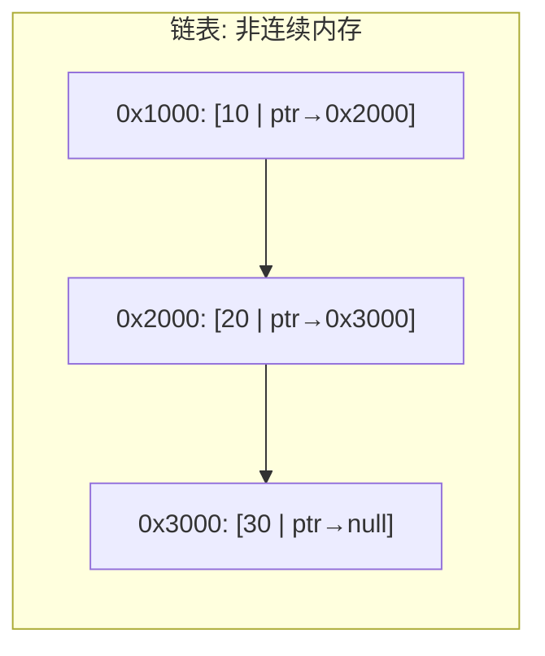
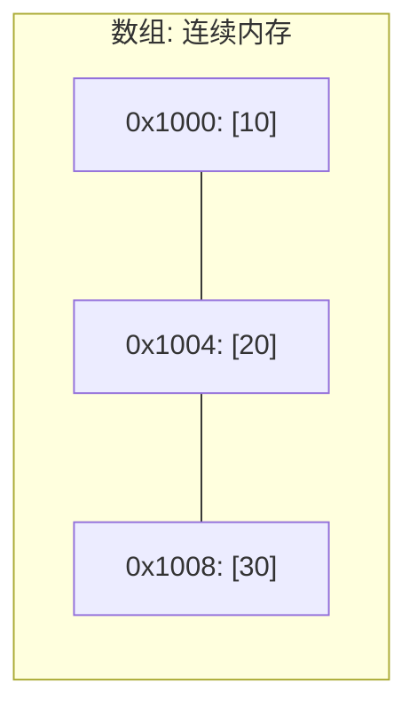
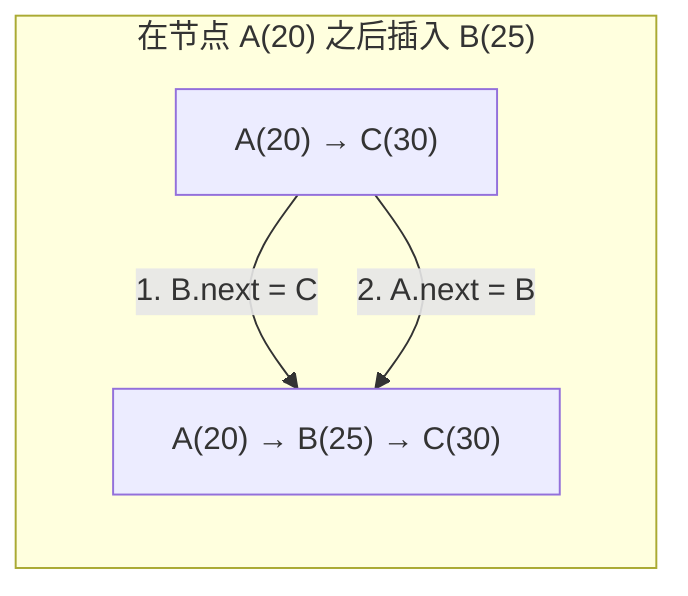
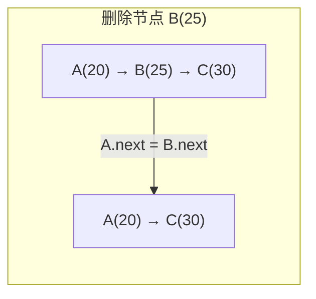

---
数据结构教程 — 链表 (Linked List)
---

##  章节概述

链表（Linked List）是一种线性数据结构，其中的元素通过指针链接在一起，而不是像
数组那样在内存中连续存储。链表的每个节点包含数据域和指针域，指针指向下一个节点。

链表的优点：插入和删除操作高效（O(1)），不需要移动其他元素；空间动态分配，不
需要预分配。
链表的缺点：不支持随机访问（O(n)才能访问任意元素）；每个节点需要额外的指针
存储空间；对缓存不友好（节点分散在内存各处）。

>  **底层实现参考**：如果需要深入理解本章数据结构的底层实现（纯C手写、内存布局、指针操作），请参阅 [[../../C语言深化教程/3数据结构/02_链表|C语言教程: 链表]]。C教程侧重手动实现与内存本质，本教程侧重STL使用与算法优化，两者互补。

---
###  第一节: 基础语法 + 计算机底层原理
---

1.1 链表的基本概念
-----------------------

常见的链表类型：

单向链表（Singly Linked List）：每个节点包含数据 + 指向下一个节点的指针。
双向链表（Doubly Linked List）：每个节点包含数据 + 指向前一个和后一个节点的指针。
循环链表（Circular Linked List）：尾节点指向头节点，形成环。

```pseudocode
STRUCT SinglyNode:
    data: integer
    next: pointer to SinglyNode
END STRUCT

STRUCT DoublyNode:
    data: integer
    prev: pointer to DoublyNode
    next: pointer to DoublyNode
END STRUCT

FUNCTION main()
    // 创建单向链表: 10 -> 20 -> 30
    head = NEW SinglyNode(10)
    head.next = NEW SinglyNode(20)
    head.next.next = NEW SinglyNode(30)

    // 遍历单向链表
    PRINT "单向链表: "
    cur = head
    WHILE cur != NULL:
        PRINT cur.data
        IF cur.next != NULL:
            PRINT " -> "
        END IF
        cur = cur.next
    END WHILE
    PRINT newline

    // 创建双向链表: 10 <-> 20 <-> 30
    dhead = NEW DoublyNode(10)
    dsecond = NEW DoublyNode(20)
    dthird = NEW DoublyNode(30)

    dhead.next = dsecond
    dsecond.prev = dhead
    dsecond.next = dthird
    dthird.prev = dsecond

    // 正向遍历
    PRINT "双向链表(正向): "
    dcur = dhead
    WHILE dcur != NULL:
        PRINT dcur.data
        IF dcur.next != NULL:
            PRINT " <-> "
        END IF
        dcur = dcur.next
    END WHILE
    PRINT newline

    // 反向遍历
    PRINT "双向链表(反向): "
    dcur = dthird
    WHILE dcur != NULL:
        PRINT dcur.data
        IF dcur.prev != NULL:
            PRINT " <-> "
        END IF
        dcur = dcur.prev
    END WHILE
    PRINT newline

    // 清理内存（略）
END FUNCTION
```

---
**实现练习**: 用 C 或 C++ 自行实现上述结构。完成后与 AI 对话检查正确性。
- C 语言底层参考: [[../../c语言教程/3数据结构/02_链表]]
- C++ STL 参考: [[../../cpp教程/容器库/08_list_forward_list]]
---

1.2 链表的底层原理：内存布局
---------------------------------

链表节点在内存中是非连续存储的。每个节点通过动态内存在堆上独立分配。





这种非连续存储意味着：
1. 无法通过索引直接访问（需要从头遍历）
2. CPU缓存命中率低（空间局部性差）
3. 插入/删除只需要修改指针，不需要移动数据





| 操作 | 数组 | 链表 | 说明 |
|------|------|------|------|
| 随机访问 | O(1) | O(n) | 链表须从头遍历 |
| 头部插入 | O(n) | O(1) | 数组需整体后移 |
| 尾部插入 | O(1)* | O(1) | *数组需考虑扩容 |
| 中间插入 | O(n) | O(1)** | **前提: 已知插入位置节点 |
| 删除 | O(n) | O(1)** | **前提: 已知删除节点前驱 |
| 空间利用率 | 100% | ~50% | 链表每个节点额外存指针 |

1.3 手动实现单向链表
-----------------------

```pseudocode
STRUCT Node:
    data: T
    next: pointer to Node
END STRUCT

CLASS LinkedList:
    head = NULL
    count = 0

FUNCTION destructor():
    WHILE head != NULL:
        temp = head
        head = head.next
        DELETE temp
    END WHILE
END FUNCTION

// 头插
FUNCTION push_front(value):
    new_node = NEW Node(value)
    new_node.next = head
    head = new_node
    count = count + 1
END FUNCTION

// 尾插
FUNCTION push_back(value):
    new_node = NEW Node(value)
    IF head == NULL:
        head = new_node
    ELSE:
        cur = head
        WHILE cur.next != NULL:
            cur = cur.next
        END WHILE
        cur.next = new_node
    END IF
    count = count + 1
END FUNCTION

// 中间插入（在指定位置之后）
FUNCTION insert_after(index, value):
    IF index >= count:
        THROW "索引越界"
    END IF
    cur = head
    FOR i = 0 TO index - 1:
        cur = cur.next
    END FOR

    new_node = NEW Node(value)
    new_node.next = cur.next
    cur.next = new_node
    count = count + 1
END FUNCTION

// 头删
FUNCTION pop_front():
    IF head == NULL:
        THROW "链表为空"
    END IF
    temp = head
    head = head.next
    DELETE temp
    count = count - 1
END FUNCTION

// 尾删
FUNCTION pop_back():
    IF head == NULL:
        THROW "链表为空"
    END IF
    IF head.next == NULL:
        DELETE head
        head = NULL
    ELSE:
        cur = head
        WHILE cur.next.next != NULL:
            cur = cur.next
        END WHILE
        DELETE cur.next
        cur.next = NULL
    END IF
    count = count - 1
END FUNCTION

// 按值删除（删除第一个匹配的）
FUNCTION remove(value):
    IF head == NULL:
        RETURN
    END IF

    IF head.data == value:
        temp = head
        head = head.next
        DELETE temp
        count = count - 1
        RETURN
    END IF

    cur = head
    WHILE cur.next != NULL AND cur.next.data != value:
        cur = cur.next
    END WHILE
    IF cur.next != NULL:
        temp = cur.next
        cur.next = cur.next.next
        DELETE temp
        count = count - 1
    END IF
END FUNCTION

// 查找
FUNCTION contains(value):
    cur = head
    WHILE cur != NULL:
        IF cur.data == value:
            RETURN TRUE
        END IF
        cur = cur.next
    END WHILE
    RETURN FALSE
END FUNCTION

// 反转链表
FUNCTION reverse():
    prev = NULL
    cur = head
    WHILE cur != NULL:
        next = cur.next
        cur.next = prev
        prev = cur
        cur = next
    END WHILE
    head = prev
END FUNCTION

// 获取第index个元素（0-based）
FUNCTION at(index):
    IF index >= count:
        THROW "索引越界"
    END IF
    cur = head
    FOR i = 0 TO index - 1:
        cur = cur.next
    END FOR
    RETURN cur.data
END FUNCTION

FUNCTION print():
    cur = head
    WHILE cur != NULL:
        PRINT cur.data
        IF cur.next != NULL:
            PRINT " -> "
        END IF
        cur = cur.next
    END WHILE
    PRINT " (size=", count, ")"
END FUNCTION

FUNCTION size():
    RETURN count
END FUNCTION

FUNCTION empty():
    RETURN count == 0
END FUNCTION

FUNCTION main()
    lst = NEW LinkedList()

    lst.push_back(10)
    lst.push_back(20)
    lst.push_back(30)
    lst.push_front(5)
    lst.print()

    lst.insert_after(1, 15)
    lst.print()

    lst.pop_front()
    lst.print()

    lst.reverse()
    PRINT "反转后: "
    lst.print()

    PRINT "含有20? ", lst.contains(20)
    PRINT "at(2) = ", lst.at(2)

    lst.remove(20)
    lst.print()
END FUNCTION
```

---
**实现练习**: 用 C 或 C++ 自行实现上述结构。完成后与 AI 对话检查正确性。
- C 语言底层参考: [[../../c语言教程/3数据结构/02_链表]]
- C++ STL 参考: [[../../cpp教程/容器库/08_list_forward_list]]
---

1.4 手动实现双向链表
------------------------

```pseudocode
STRUCT DNode:
    data: T
    prev: pointer to DNode
    next: pointer to DNode
END STRUCT

CLASS DoublyLinkedList:
    head = NULL
    tail = NULL
    count = 0

FUNCTION destructor():
    WHILE head != NULL:
        temp = head
        head = head.next
        DELETE temp
    END WHILE
END FUNCTION

FUNCTION push_back(value):
    new_node = NEW DNode(value)
    IF head == NULL:
        head = new_node
        tail = new_node
    ELSE:
        new_node.prev = tail
        tail.next = new_node
        tail = new_node
    END IF
    count = count + 1
END FUNCTION

FUNCTION push_front(value):
    new_node = NEW DNode(value)
    IF head == NULL:
        head = new_node
        tail = new_node
    ELSE:
        new_node.next = head
        head.prev = new_node
        head = new_node
    END IF
    count = count + 1
END FUNCTION

FUNCTION pop_back():
    IF tail == NULL:
        THROW "链表为空"
    END IF
    temp = tail
    tail = tail.prev
    IF tail != NULL:
        tail.next = NULL
    ELSE:
        head = NULL
    END IF
    DELETE temp
    count = count - 1
END FUNCTION

FUNCTION print_forward():
    cur = head
    WHILE cur != NULL:
        PRINT cur.data
        IF cur.next != NULL:
            PRINT " <-> "
        END IF
        cur = cur.next
    END WHILE
    PRINT newline
END FUNCTION

FUNCTION print_backward():
    cur = tail
    WHILE cur != NULL:
        PRINT cur.data
        IF cur.prev != NULL:
            PRINT " <-> "
        END IF
        cur = cur.prev
    END WHILE
    PRINT newline
END FUNCTION

FUNCTION size():
    RETURN count
END FUNCTION

FUNCTION main()
    dll = NEW DoublyLinkedList()
    dll.push_back(10)
    dll.push_back(20)
    dll.push_back(30)
    dll.push_front(5)

    PRINT "正向: "
    dll.print_forward()
    PRINT "反向: "
    dll.print_backward()
END FUNCTION
```

---
**实现练习**: 用 C 或 C++ 自行实现上述结构。完成后与 AI 对话检查正确性。
- C 语言底层参考: [[../../c语言教程/3数据结构/02_链表]]
- C++ STL 参考: [[../../cpp教程/容器库/08_list_forward_list]]
---


---
###  第二节: 实现变体
---

2.1 单向链表（Singly Linked List）
---------------------------------------

单向链表更节省内存（只有一个指针），支持头部操作和在指定位置之后操作。

```pseudocode
FUNCTION main()
    flst = NEW SinglyLinkedList()
    flst.push_back(1)
    flst.push_back(2)
    flst.push_back(3)
    flst.push_back(4)
    flst.push_back(5)

    // 头部操作
    flst.push_front(0)
    flst.pop_front()

    // 在指定位置之后插入（需要前驱迭代器）
    it = flst.before_begin()   // 头部哨兵
    flst.insert_after(it, 99)  // 在头部之后插入

    // 查找并插入
    cur = flst.begin()
    WHILE cur != flst.end():
        IF cur.data == 3:
            flst.insert_after(cur, 100)  // 在3之后插入100
            BREAK
        END IF
        cur = cur.next
    END WHILE

    // 删除
    flst.erase_after(flst.before_begin())  // 删除第一个元素

    // 特有操作
    flst.sort()
    flst.unique()        // 删除连续重复元素
    flst.reverse()

    // 拼接
    other = NEW SinglyLinkedList([200, 300])
    flst.splice_after(flst.before_begin(), other)  // 将other拼接到头部

    // 合并（两个list必须已排序）
    a = NEW SinglyLinkedList([1, 3, 5])
    b = NEW SinglyLinkedList([2, 4, 6])
    a.merge(b)

    a.print()    // 输出: 1 2 3 4 5 6
END FUNCTION
```

---
**实现练习**: 用 C 或 C++ 自行实现上述结构。完成后与 AI 对话检查正确性。
- C 语言底层参考: [[../../c语言教程/3数据结构/02_链表]]
- C++ STL 参考: [[../../cpp教程/容器库/08_list_forward_list]]
---

2.2 双向链表（Doubly Linked List）
------------------------------

```pseudocode
FUNCTION main()
    lst = NEW DoublyLinkedList()
    lst.push_back(3)
    lst.push_back(1)
    lst.push_back(4)
    lst.push_back(1)
    lst.push_back(5)
    lst.push_back(9)

    // 两端操作
    lst.push_front(0)
    lst.push_back(10)
    lst.pop_front()
    lst.pop_back()

    // 插入（在pos之前）
    it = lst.find(4)
    IF it != lst.end():
        lst.insert(it, 100)      // 在4之前插入
    END IF

    // 删除
    lst.remove(1)                // 删除所有值为1的元素
    lst.remove_if(FUNCTION(x): RETURN x > 5) // 条件删除

    // 链表特有操作
    lst.sort()
    lst.unique()                 // 去重
    lst.reverse()

    // 拼接（将other的元素移动到lst中）
    other = NEW DoublyLinkedList([100, 200])
    lst.splice(lst.end(), other)  // other变为空

    // 合并（两个list必须都已排序）
    a = NEW DoublyLinkedList([1, 3, 5])
    b = NEW DoublyLinkedList([2, 4, 6])
    a.merge(b)  // a变为{1,2,3,4,5,6}, b为空

    // resize
    lst.resize(10)    // 扩展或截断
    lst.resize(20, -1) // 用-1填充新元素

    // 赋值
    lst.assign(5, 100)  // 全部替换为5个100

    // 遍历
    lst.print()
END FUNCTION
```

---
**实现练习**: 用 C 或 C++ 自行实现上述结构。完成后与 AI 对话检查正确性。
- C 语言底层参考: [[../../c语言教程/3数据结构/02_链表]]
- C++ STL 参考: [[../../cpp教程/容器库/08_list_forward_list]]
---

2.3 链表算法（常见操作）
---------------------------

```pseudocode
STRUCT ListNode:
    val: integer
    next: pointer to ListNode
END STRUCT

// 1. 检测链表是否有环（快慢指针）
FUNCTION has_cycle(head):
    slow = head
    fast = head

    WHILE fast != NULL AND fast.next != NULL:
        slow = slow.next
        fast = fast.next.next
        IF slow == fast:
            RETURN TRUE
        END IF
    END WHILE
    RETURN FALSE
END FUNCTION

// 2. 找到链表中间节点
FUNCTION find_middle(head):
    slow = head
    fast = head

    WHILE fast != NULL AND fast.next != NULL:
        slow = slow.next
        fast = fast.next.next
    END WHILE
    RETURN slow
END FUNCTION

// 3. 合并两个有序链表
FUNCTION merge_two_lists(l1, l2):
    dummy = NEW ListNode(0)
    tail = dummy

    WHILE l1 != NULL AND l2 != NULL:
        IF l1.val <= l2.val:
            tail.next = l1
            l1 = l1.next
        ELSE:
            tail.next = l2
            l2 = l2.next
        END IF
        tail = tail.next
    END WHILE
    IF l1 != NULL:
        tail.next = l1
    ELSE:
        tail.next = l2
    END IF

    RETURN dummy.next
END FUNCTION

// 4. 删除倒数第N个节点
FUNCTION remove_nth_from_end(head, n):
    dummy = NEW ListNode(0)
    dummy.next = head
    fast = dummy
    slow = dummy

    // fast 先走 n+1 步
    FOR i = 0 TO n:
        fast = fast.next
    END FOR

    WHILE fast != NULL:
        fast = fast.next
        slow = slow.next
    END WHILE

    to_delete = slow.next
    slow.next = slow.next.next
    DELETE to_delete

    RETURN dummy.next
END FUNCTION

FUNCTION print_list(head):
    WHILE head != NULL:
        PRINT head.val
        IF head.next != NULL:
            PRINT " -> "
        END IF
        head = head.next
    END WHILE
    PRINT newline
END FUNCTION

FUNCTION main()
    // 合并有序链表
    l1 = NEW ListNode(1)
    l1.next = NEW ListNode(3)
    l1.next.next = NEW ListNode(5)

    l2 = NEW ListNode(2)
    l2.next = NEW ListNode(4)
    l2.next.next = NEW ListNode(6)

    merged = merge_two_lists(l1, l2)
    PRINT "合并后: "
    print_list(merged)

    // 中间节点
    mid = find_middle(merged)
    PRINT "中间节点: ", mid.val

    // 删除倒数第3个
    after_remove = remove_nth_from_end(merged, 3)
    PRINT "删除倒数第3个: "
    print_list(after_remove)
END FUNCTION
```

---
**实现练习**: 用 C 或 C++ 自行实现上述结构。完成后与 AI 对话检查正确性。
- C 语言底层参考: [[../../c语言教程/3数据结构/02_链表]]
- C++ STL 参考: [[../../cpp教程/容器库/08_list_forward_list]]
---


---
###  第三节: 应用场景
---

案例一：浏览器的前进后退（双向链表版）
----------------------------------------------

与栈实现不同，这里使用双向链表更直观地管理页面历史：

```pseudocode
STRUCT Page:
    url: string
    prev: pointer to Page
    next: pointer to Page
END STRUCT

CLASS BrowserHistory:
    current: pointer to Page

FUNCTION constructor(homepage):
    current = NEW Page(homepage)
END FUNCTION

FUNCTION visit(url):
    // 清空前进历史
    temp = current.next
    WHILE temp != NULL:
        to_del = temp
        temp = temp.next
        DELETE to_del
    END WHILE

    current.next = NEW Page(url)
    current.next.prev = current
    current = current.next
    PRINT "访问: ", url
END FUNCTION

FUNCTION back(steps):
    WHILE steps > 0 AND current.prev != NULL:
        current = current.prev
        steps = steps - 1
    END WHILE
    PRINT "后退到: ", current.url
    RETURN current.url
END FUNCTION

FUNCTION forward(steps):
    WHILE steps > 0 AND current.next != NULL:
        current = current.next
        steps = steps - 1
    END WHILE
    PRINT "前进到: ", current.url
    RETURN current.url
END FUNCTION

FUNCTION destructor():
    WHILE current.prev != NULL:
        current = current.prev
    END WHILE
    WHILE current != NULL:
        temp = current
        current = current.next
        DELETE temp
    END WHILE
END FUNCTION

FUNCTION main()
    bh = NEW BrowserHistory("google.com")

    bh.visit("github.com")
    bh.visit("stackoverflow.com")
    bh.visit("cppreference.com")

    bh.back(1)   // stackoverflow.com
    bh.back(1)   // github.com
    bh.forward(1) // stackoverflow.com
    bh.visit("reddit.com")  // 前进历史被清空

    bh.back(2)   // github.com -> google.com
END FUNCTION
```

---
**实现练习**: 用 C 或 C++ 自行实现上述结构。完成后与 AI 对话检查正确性。
- C 语言底层参考: [[../../c语言教程/3数据结构/02_链表]]
- C++ STL 参考: [[../../cpp教程/容器库/08_list_forward_list]]
---


案例二：约瑟夫问题（循环链表）
--------------------------------------

经典的约瑟夫问题：n个人围成一圈，从第一个人开始报数，报到m的人出列，求最后
剩下的人。

```pseudocode
STRUCT Person:
    id: integer
    next: pointer to Person
END STRUCT

FUNCTION josephus(n, m):
    // 创建循环链表
    head = NEW Person(1)
    prev = head

    FOR i = 2 TO n:
        p = NEW Person(i)
        prev.next = p
        prev = p
    END FOR
    prev.next = head  // 形成环

    // 开始游戏
    cur = head
    last = prev

    WHILE cur.next != cur:  // 只剩一个人时结束
        // 报数到m-1
        FOR i = 1 TO m - 1:
            last = cur
            cur = cur.next
        END FOR

        // cur出列
        PRINT cur.id, " 出列"
        last.next = cur.next
        DELETE cur
        cur = last.next
    END WHILE

    survivor = cur.id
    DELETE cur
    RETURN survivor
END FUNCTION

FUNCTION main()
    n = 7
    m = 3
    survivor = josephus(n, m)
    PRINT n, "个人, 报数", m, ", 幸存者: ", survivor
END FUNCTION
```

---
**实现练习**: 用 C 或 C++ 自行实现上述结构。完成后与 AI 对话检查正确性。
- C 语言底层参考: [[../../c语言教程/3数据结构/02_链表]]
- C++ STL 参考: [[../../cpp教程/容器库/08_list_forward_list]]
---


案例三：多项式的链表表示与运算
-------------------------------------------

使用链表表示多项式，实现加法运算：

```pseudocode
STRUCT Term:
    coefficient: integer   // 系数
    exponent: integer      // 指数
    next: pointer to Term
END STRUCT

CLASS Polynomial:
    head = NULL

// 辅助：在尾部添加项
FUNCTION append(coeff, exp):
    IF coeff == 0:
        RETURN   // 系数为0的项不添加
    END IF
    IF head == NULL:
        head = NEW Term(coeff, exp)
        RETURN
    END IF
    cur = head
    WHILE cur.next != NULL:
        cur = cur.next
    END WHILE
    cur.next = NEW Term(coeff, exp)
END FUNCTION

FUNCTION constructor(terms):
    FOR EACH (coeff, exp) IN terms:
        append(coeff, exp)
    END FOR
END FUNCTION

FUNCTION destructor():
    WHILE head != NULL:
        temp = head
        head = head.next
        DELETE temp
    END WHILE
END FUNCTION

// 多项式加法
FUNCTION add(other):
    result = NEW Polynomial()
    p = head
    q = other.head

    WHILE p != NULL AND q != NULL:
        IF p.exponent > q.exponent:
            result.append(p.coefficient, p.exponent)
            p = p.next
        ELSE IF p.exponent < q.exponent:
            result.append(q.coefficient, q.exponent)
            q = q.next
        ELSE:
            result.append(p.coefficient + q.coefficient, p.exponent)
            p = p.next
            q = q.next
        END IF
    END WHILE

    WHILE p != NULL:
        result.append(p.coefficient, p.exponent)
        p = p.next
    END WHILE
    WHILE q != NULL:
        result.append(q.coefficient, q.exponent)
        q = q.next
    END WHILE

    RETURN result
END FUNCTION

FUNCTION print():
    IF head == NULL:
        PRINT "0"
        RETURN
    END IF
    cur = head
    WHILE cur != NULL:
        IF cur != head AND cur.coefficient > 0:
            PRINT " + "
        END IF
        IF cur.coefficient < 0:
            PRINT " - "
        END IF
        abs_c = ABS(cur.coefficient)

        IF cur.exponent == 0:
            PRINT abs_c
        ELSE IF cur.exponent == 1:
            PRINT abs_c, "x"
        ELSE:
            PRINT abs_c, "x^", cur.exponent
        END IF
        cur = cur.next
    END WHILE
END FUNCTION

FUNCTION main()
    p1 = NEW Polynomial([(3, 2), (2, 1), (1, 0)])     // 3x^2 + 2x + 1
    p2 = NEW Polynomial([(5, 3), (-1, 2), (4, 0)])    // 5x^3 - x^2 + 4

    sum = p1.add(p2)

    PRINT "P1 = "; p1.print(); PRINT newline
    PRINT "P2 = "; p2.print(); PRINT newline
    PRINT "和 = "; sum.print(); PRINT newline
END FUNCTION
```

---
**实现练习**: 用 C 或 C++ 自行实现上述结构。完成后与 AI 对话检查正确性。
- C 语言底层参考: [[../../c语言教程/3数据结构/02_链表]]
- C++ STL 参考: [[../../cpp教程/容器库/08_list_forward_list]]
---


---
###  第四节: 课后习题
---

1. 基础题：手动实现一个带哨兵节点的单向链表。
   - 使用 dummy head（哨兵头节点）简化边界条件处理
   - 实现 insert、erase、find、reverse 操作
   - 分析各操作的时间复杂度

2. 应用题：判断一个链表是否为回文链表。
   - 时间复杂度O(n)，空间复杂度O(1)
   - 使用快慢指针找到中点
   - 反转后半部分链表进行比较

3. 进阶题：实现一个跳表（Skip List）。
   - 跳表是一种多层链表结构，支持O(log n)的查找
   - 随机决定节点层数
   - 实现 insert、erase、find 操作

4. 综合题：使用链表实现一个简单的内存分配器。
   - 维护空闲块链表（free list）
   - 支持 malloc(size) 和 free(ptr) 操作
   - 实现首次适应（first-fit）和最佳适应（best-fit）策略
   - 处理内存碎片问题

5. 挑战题：实现一个并发安全的链表。
   - 支持读写锁（读多写少）
   - 或者实现无锁链表（lock-free，使用CAS原子操作）
   - 验证线程安全性

---


---
###  章节测试
---

> [!question] 判断题 1
> 单向链表中每个节点包含数据域和两个指针域（前驱和后继） （ ）
> - [ ]  正确
> - [ ]  错误
>
> > [!success]- 点击查看答案
> > 答案: 错误
> > 
> > **解析**: 单向链表每个节点只有一个指针域（指向下一个节点）。包含两个指针域（前驱和后继）的是双向链表。

> [!question] 判断题 2
> 链表的随机访问时间复杂度为O(1) （ ）
> - [ ]  正确
> - [ ]  错误
>
> > [!success]- 点击查看答案
> > 答案: 错误
> > 
> > **解析**: 链表不支持随机访问，访问第n个元素需要从头节点开始逐个遍历，时间复杂度为O(n)。只有数组/vector支持O(1)随机访问。

> [!question] 判断题 3
> 在链表中间位置插入一个节点的时间复杂度为O(1)（假设已有指向该位置的指针） （ ）
> - [ ]  正确
> - [ ]  错误
>
> > [!success]- 点击查看答案
> > 答案: 正确
> > 
> > **解析**: 如果已经有指向插入位置的指针，只需要修改几个指针即可完成插入，时间复杂度为O(1)。查找位置可能需要O(n)，但插入操作本身是O(1)。

> [!question] 判断题 4
> 循环链表的尾节点的next指针指向NULL （ ）
> - [ ]  正确
> - [ ]  错误
>
> > [!success]- 点击查看答案
> > 答案: 错误
> > 
> > **解析**: 循环链表的尾节点的next指针指向头节点，形成一个环。普通链表的尾节点next才指向NULL。

> [!question] 判断题 5
> 使用快慢指针可以在O(n)时间、O(1)空间内判断链表是否有环 （ ）
> - [ ]  正确
> - [ ]  错误
>
> > [!success]- 点击查看答案
> > 答案: 正确
> > 
> > **解析**: 快指针每次走2步，慢指针每次走1步。如果链表有环，快指针最终会追上慢指针（两者相遇）。无需额外空间，时间O(n)。

> [!question] 判断题 6
> 标准库中链表的 sort() 函数使用的是快速排序算法 （ ）
> - [ ]  正确
> - [ ]  错误
>
> > [!success]- 点击查看答案
> > 答案: 错误
> > 
> > **解析**: 链表的sort()通常使用归并排序，因为链表不支持随机访问，快排需要随机访问不适合链表。归并排序只需要顺序访问，适合链表结构。

> [!question] 判断题 7
> 删除链表中的某个节点时，必须知道该节点的前驱节点（单向链表） （ ）
> - [ ]  正确
> - [ ]  错误
>
> > [!success]- 点击查看答案
> > 答案: 正确
> > 
> > **解析**: 在单向链表中，删除节点需要将前驱节点的next指向被删节点的下一个节点。如果不知道前驱，无法完成连接（除非使用"值替换"技巧）。

> [!question] 判断题 8
> 哨兵节点（dummy head）可以简化链表头部插入/删除的边界条件处理 （ ）
> - [ ]  正确
> - [ ]  错误
>
> > [!success]- 点击查看答案
> > 答案: 正确
> > 
> > **解析**: 使用哨兵节点后，链表始终非空，头部操作和中间操作的逻辑统一，不再需要特殊处理head为NULL的情况。

> [!question] 判断题 9
> 单向链表标准容器支持 push_back() 操作 （ ）
> - [ ]  正确
> - [ ]  错误
>
> > [!success]- 点击查看答案
> > 答案: 错误
> > 
> > **解析**: 单向链表通常只支持 push_front()。要在尾部插入需要先遍历到末尾，效率低，因此标准库通常不提供push_back()。

> [!question] 判断题 10
> 链表相比数组的主要缺点是缓存命中率低 （ ）
> - [ ]  正确
> - [ ]  错误
>
> > [!success]- 点击查看答案
> > 答案: 正确
> > 
> > **解析**: 链表节点分散在内存各处，遍历时频繁跳转到不同内存位置，导致CPU缓存命中率低。数组/vector连续存储，遍历时缓存友好，性能更好。

---

> [!question] 选择题 1
> 反转一个单向链表的时间复杂度和空间复杂度分别是？
> - [ ] A. O(n), O(n)
> - [ ] B. O(n), O(1)
> - [ ] C. O(n^2), O(1)
> - [ ] D. O(1), O(1)
>
> > [!success]- 点击查看答案
> > 正确答案: B
> > 
> > **解析**: 反转链表只需遍历一次（O(n)），使用三个指针（prev, curr, next）原地修改指针方向，空间O(1)。

> [!question] 选择题 2
> 以下哪种方法可以找到链表的中间节点（不知道链表长度）？
> - [ ] A. 先计数再遍历到n/2
> - [ ] B. 使用快慢指针
> - [ ] C. 使用递归
> - [ ] D. 以上都可以
>
> > [!success]- 点击查看答案
> > 正确答案: D
> > 
> > **解析**: 三种方法都可以找到中间节点。快慢指针法最高效（一次遍历），快指针到末尾时慢指针恰好在中间。

> [!question] 选择题 3
> 双向链表相比单向链表的主要优势是？
> - [ ] A. 节省内存
> - [ ] B. 支持反向遍历和O(1)删除当前节点
> - [ ] C. 插入更快
> - [ ] D. 支持随机访问
>
> > [!success]- 点击查看答案
> > 正确答案: B
> > 
> > **解析**: 双向链表有prev指针，可以反向遍历。知道要删除的节点时可以直接访问其前驱，实现O(1)删除。代价是每个节点多一个指针的内存开销。

> [!question] 选择题 4
> 在一个长度为n的有序链表中查找某个元素，最优时间复杂度是？
> - [ ] A. O(1)
> - [ ] B. O(log n)
> - [ ] C. O(n)
> - [ ] D. O(n log n)
>
> > [!success]- 点击查看答案
> > 正确答案: C
> > 
> > **解析**: 即使链表有序，由于不支持随机访问，无法使用二分查找。查找只能从头开始顺序扫描，时间复杂度为O(n)。（跳表可以做到O(log n)但那是不同的数据结构）

> [!question] 选择题 5
> 约瑟夫问题（Josephus Problem）最适合用哪种链表实现？
> - [ ] A. 单向链表
> - [ ] B. 双向链表
> - [ ] C. 循环链表
> - [ ] D. 跳表
>
> > [!success]- 点击查看答案
> > 正确答案: C
> > 
> > **解析**: 约瑟夫问题中人们围成一圈依次报数出列，循环链表的尾节点连接头节点形成环，天然模拟了"围成一圈"的场景。

> [!question] 选择题 6
> 链表的 splice() 操作的时间复杂度是？
> - [ ] A. O(1)
> - [ ] B. O(n)
> - [ ] C. O(n log n)
> - [ ] D. O(n^2)
>
> > [!success]- 点击查看答案
> > 正确答案: A
> > 
> > **解析**: splice将另一个list的节点移动到当前list，只需修改几个指针（O(1)），不需要复制或移动元素。这是链表的独特优势。

> [!question] 选择题 7
> 检测链表中环的入口节点，需要使用什么算法？
> - [ ] A. 只用快慢指针即可
> - [ ] B. Floyd判圈算法（快慢指针相遇后，一个从头开始同步走）
> - [ ] C. 哈希表记录访问过的节点
> - [ ] D. B和C都可以
>
> > [!success]- 点击查看答案
> > 正确答案: D
> > 
> > **解析**: Floyd判圈算法快慢指针相遇后，将一个指针放回头部，两个指针同时每次走一步，再次相遇即为环入口（O(1)空间）。哈希表法也可以但空间O(n)。

> [!question] 选择题 8
> 对两个已排序链表进行合并，最优时间复杂度是？
> - [ ] A. O(n + m)
> - [ ] B. O(n * m)
> - [ ] C. O((n+m) log(n+m))
> - [ ] D. O(max(n, m))
>
> > [!success]- 点击查看答案
> > 正确答案: A
> > 
> > **解析**: 使用双指针法（类似归并排序的merge步骤），每次比较两个链表的当前节点取较小者，时间复杂度O(n+m)。

> [!question] 选择题 9
> 下面哪个操作在链表上比数组更高效？
> - [ ] A. 随机访问第i个元素
> - [ ] B. 在已知位置插入/删除元素
> - [ ] C. 排序
> - [ ] D. 二分查找
>
> > [!success]- 点击查看答案
> > 正确答案: B
> > 
> > **解析**: 链表在已知位置（有迭代器）插入/删除只需O(1)修改指针，而数组需要O(n)移动元素。其他操作（随机访问、排序、查找）数组都更快。

> [!question] 选择题 10
> 以下哪种数据结构可以视为"带有多层链表索引"的升级链表？
> - [ ] A. 红黑树
> - [ ] B. B树
> - [ ] C. 跳表（Skip List）
> - [ ] D. 哈希链表
>
> > [!success]- 点击查看答案
> > 正确答案: C
> > 
> > **解析**: 跳表（Skip List）在普通有序链表上增加多层索引链表，通过随机化决定节点层数，实现O(log n)的查找/插入/删除，是Redis中有序集合的底层实现。

---

###  编程大题

> [!note] 编程题 1：实现一个双向循环链表
> **要求**：
> 1. 实现双向循环链表类 `CircularDoublyLinkedList`
> 2. 支持以下操作：
>    - `push_front(val)` / `push_back(val)` — 头部/尾部插入
>    - `pop_front()` / `pop_back()` — 头部/尾部删除
>    - `insert(pos, val)` — 在第pos个位置之前插入
>    - `erase(pos)` — 删除第pos个位置的元素
>    - `find(val)` — 查找元素，返回位置
>    - `reverse()` — 反转链表
>    - `size()` / `empty()` / `print()`
> 3. 使用哨兵节点简化实现
> 4. 验证循环性质：从任一节点出发可以遍历回该节点
>
> **提示**: 哨兵节点的next指向第一个元素，prev指向最后一个元素

> [!note] 编程题 2：链表排序（归并排序）
> **要求**：
> 1. 对单向链表实现归并排序
> 2. 要求：时间O(n log n)，空间O(log n)（递归栈空间）或O(1)（迭代实现）
> 3. 实现步骤：
>    - 使用快慢指针找到链表中点
>    - 递归地对两半链表排序
>    - 合并两个有序链表
> 4. 额外：实现自底向上的迭代归并排序（O(1)空间）
> 5. 与标准链表sort()进行性能对比
>
> **提示**: 自底向上先两两合并长度为1的子链表，再合并长度为2的，依此类推

> [!note] 编程题 3：LRU缓存的链表+哈希表实现
> **要求**：
> 1. 使用双向链表 + 哈希表 实现LRU（最近最少使用）缓存
> 2. 支持操作：
>    - `get(key)` — 获取key对应的value，如果key不存在返回-1，O(1)
>    - `put(key, value)` — 插入或更新键值对，如果超出容量则淘汰最久未使用的，O(1)
> 3. 不使用标准链表，手动实现双向链表部分
> 4. 正确处理边界情况：空缓存、容量为1、重复key等
> 5. 编写完整测试验证
>
> **提示**: 链表头部为最近使用，尾部为最久未使用。每次get/put都将节点移到头部

###  推荐练习题（洛谷）

| 题号 | 题目 | 难度 | 知识点 |
|------|------|------|--------|
| [P1996](https://www.luogu.com.cn/problem/P1996) | 约瑟夫问题 | 入门 | 循环链表模拟 |

---

***
##  知识网络
***

- **上一章**: [[B_栈_Stack]] | **下一章**: [[F_队列_Queue]] | **返回**: [[DSA学习路线]]
- **相关容器**: [[容器库/08_list_forward_list]]
- **算法技巧**: [[../算法技巧/双指针]] | [[../算法技巧/数组]]
