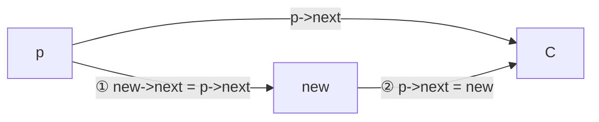
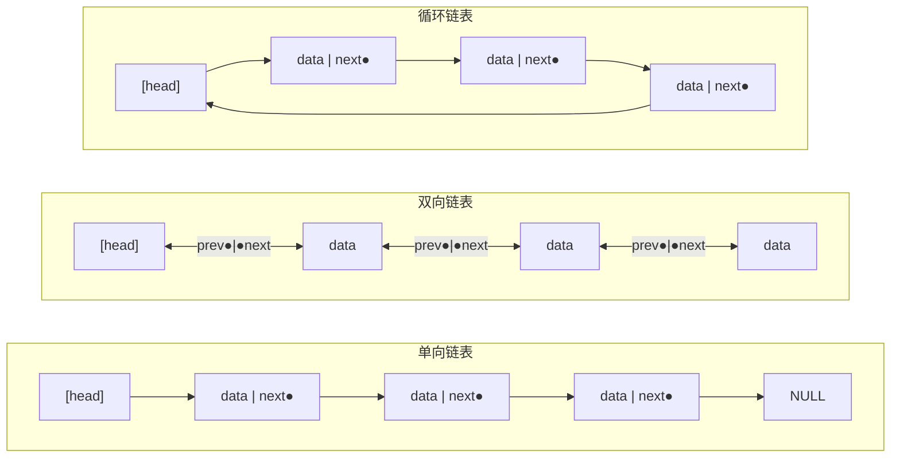
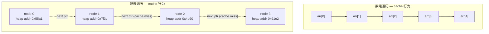
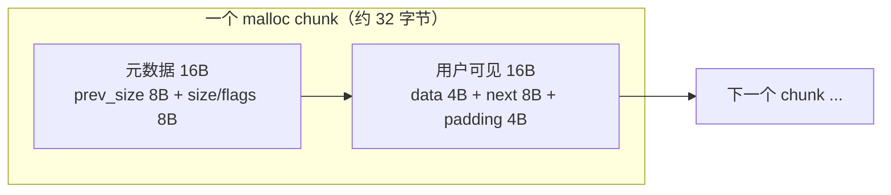
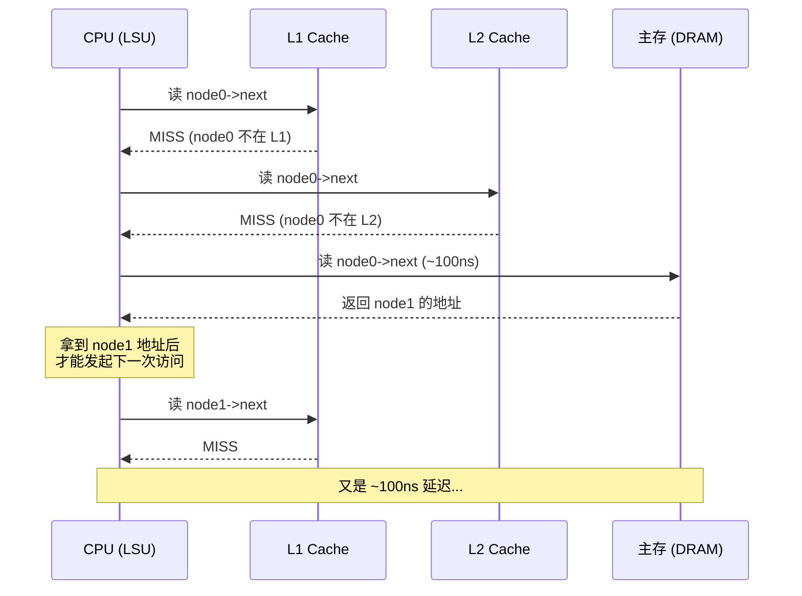
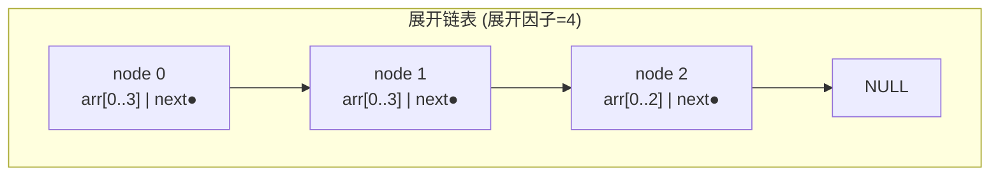
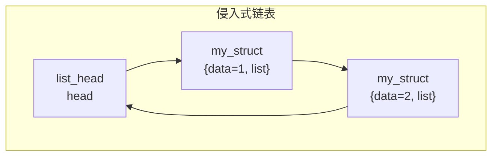
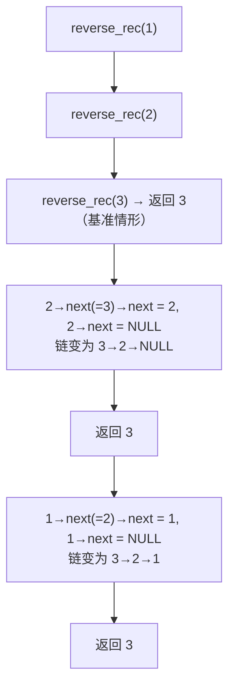

建议先阅读: [[C_顺序表_SequentialList|线性表与顺序表]] — 建立线性表 ADT 与两种存储实现的全局观；[[G_容器_Container|容器概览]] — 理解连续存储 vs 节点存储的本质分歧。

本章正文按考纲和通用教材的口径讲实现；标注【延伸】的小节（数学视角、深入底层）属于拓展内容，只准备考研或期末的同学可以先跳过，第二遍再回来看。


---

## 从零理解链表

### 为什么需要链表

数组有一个致命缺陷：**大小固定**。声明 `int arr[100]` 后，要么浪费 90 个空间，要么第 101 个数据放不下。即使使用动态数组（`realloc`），扩容时需要复制整个数组到新地址，代价是 $O(n)$。

链表解决了这个问题：**每个节点独立分配，需要多少就加多少，不需要时就删除**。代价是失去了按下标随机访问的能力——鱼和熊掌不可兼得。

### 什么是指针

在 C 语言中，变量存储在内存的某个地址上。**指针就是存储地址的变量**。

```c
int x = 42;       // x 存储在地址 0x7fff5a3b，值为 42
int* p = &x;      // p 存储了 x 的地址，即 p 指向 x
```

| 概念 | 类比 | 说明 |
|------|------|------|
| 变量 | 房间 | 存储数据的内存空间 |
| 地址 | 房间号 | 内存中每个字节的唯一编号 |
| 指针 | 纸条上写的房间号 | 存储地址的变量，通过它能找到对应的房间 |

### 为什么链表节点需要指针

链表节点散落在堆内存的不同位置（不像数组那样连续存放）。要找到下一个节点，就必须知道它的地址。**指针就是"通往下一个节点的地图"**。

| 节点 | 物理地址 | data | next 指向 |
|------|---------|:----:|-----------|
| A | 0x1000 | 1 | 0x3000（节点 B） |
| B | 0x3000 | 2 | 0x2000（节点 C） |
| C | 0x2000 | 3 | NULL |

注意：节点在内存中的物理地址是 0x1000 → 0x3000 → 0x2000，**不是连续的**！这就是链表与数组的根本区别。

### 为什么新节点的 next 是 NULL

当你创建一个新节点时，它还不属于任何链表。此时它的 `next` 指针没有意义的目标，所以设为 `NULL` 表示"没有后继"：

```c
SNode* new_node = malloc(sizeof(SNode));
new_node->data = 42;
new_node->next = NULL;   // 还没链接到任何链表，先标记为"无后继"
```

`NULL` 是一个特殊值（通常为 0），表示"这个指针不指向任何有效内存"。链表尾节点的 `next` 也是 `NULL`，表示"后面没有节点了"。

### 头指针：链表的入口

整条链表只需要一个入口——**头指针** head。通过 head 可以找到第一个节点，通过第一个节点的 `next` 可以找到第二个节点，以此类推。

```c
SNode* head = NULL;   // 空链表：head 指向 NULL
```

空链表的 `head == NULL`，就像一个空的电话本——里面没有任何条目。

---

## 最小实现：单向链表

### 节点定义

```c
typedef struct SNode {
    int data;            /* 数据域：存放结点的值 */
    struct SNode* next;  /* 指针域：存放下一个结点的地址；尾结点为 NULL */
} SNode;
```

> **术语（考点）**：链接存储的存储空间分为两部分——**数据域**存放结点的值，**指针域**存放结点之间的关系。单链表每个结点额外带一个指针，**存储密度小于 1**；顺序表只存数据，**存储密度为 1**（公式见 [[C_顺序表_SequentialList|顺序表]] 第 5 章）。

**为什么 `next` 的类型是 `struct SNode*`？** 因为在结构体定义内部，编译器还不知道 `SNode` 这个名字（它还没定义完），所以必须用 `struct SNode*` 完整写法。

### 创建节点

```c
SNode* create_node(int value) {
    SNode* node = malloc(sizeof(SNode));  // 在堆上分配一个节点大小的内存
    node->data = value;                   // 设置数据
    node->next = NULL;                    // 新节点还没链接，先设为 NULL
    return node;
}
```

**为什么用 `malloc`？** 栈上的变量在函数返回时自动销毁。链表需要长期存活，所以必须在堆上分配。注意 `malloc` 有可能失败返回 `NULL`，实际工程里紧接着要做判空；这里的示例为了简短省略了它，但这是健壮性的一个典型检查点。

### 插入节点

![[list_insert.gif]]


在节点 `p` 之后插入新节点 `new`：

```c
void insert_after(SNode* p, SNode* new) {
    new->next = p->next;   // ① 新节点先指向 p 的后继
    p->next = new;          // ② p 再指向新节点
}
```

**为什么顺序不能反？** 如果先写 `p->next = new`，那 `p` 原来的后继地址就丢失了（`new->next` 还没指向它），链表就断了。

> **考点（408 高频）——两种"插入"的复杂度截然不同**：
> - 在**已知结点 `*p` 之后**插入新结点：只改两条指针，$O(1)$；
> - 在**给定值为 `x` 的结点之后**插入：必须先按值查找，查找本身 $O(n)$，总时间 $O(n)$。
>
> 题目问"插入的时间复杂度"时，先判断位置是**已知**还是**查找得到**的——这是选择题最常见的陷阱。



### 删除节点

删除节点 `p` 之后的节点：

```c
void delete_after(SNode* p) {
    SNode* victim = p->next;      // ① 先记住要删除的节点
    if (victim != NULL) {
        p->next = victim->next;   // ② p 跳过 victim，直接指向 victim 的后继
        free(victim);              // ③ 释放 victim 的内存
    }
}
```

**为什么要先记住 `victim`？** 因为 `free(victim)` 之后，`victim` 指向的内存已经无效。如果先 `free` 再读 `victim->next`，就是访问已释放的内存（use-after-free），属于未定义行为。

> **考点（填空高频）——删除 `p` 的后继结点**，标准三步：
> ```c
> q = p->next;
> p->next = q->next;
> free(q);
> ```
> 只做逻辑删除（不释放）时可简写为 `p->next = p->next->next;`。顺序不能颠倒：必须先让 `p` 跳过 `q`，再释放 `q`。

### 遍历链表

```c
void print_list(SNode* head) {
    SNode* cur = head;           // 从头开始
    while (cur != NULL) {        // 直到 NULL（链表末尾）
        printf("%d -> ", cur->data);
        cur = cur->next;         // 移动到下一个节点
    }
    printf("NULL\n");
}
```

### 完整示例：构建链表并遍历

```c
#include <stdio.h>
#include <stdlib.h>

typedef struct SNode {
    int data;
    struct SNode* next;
} SNode;

SNode* create_node(int value) {
    SNode* node = malloc(sizeof(SNode));
    node->data = value;
    node->next = NULL;
    return node;
}

void insert_after(SNode* p, SNode* new) {
    new->next = p->next;
    p->next = new;
}

void delete_after(SNode* p) {
    SNode* victim = p->next;
    if (victim != NULL) {
        p->next = victim->next;
        free(victim);
    }
}

void print_list(SNode* head) {
    SNode* cur = head;
    while (cur != NULL) {
        printf("%d -> ", cur->data);
        cur = cur->next;
    }
    printf("NULL\n");
}

int main() {
    // 创建三个节点: 1 -> 2 -> 3 -> NULL
    SNode* head = create_node(1);
    insert_after(head, create_node(2));
    insert_after(head->next, create_node(3));

    print_list(head);           // 输出: 1 -> 2 -> 3 -> NULL

    delete_after(head);         // 删除节点 2
    print_list(head);           // 输出: 1 -> 3 -> NULL

    // 释放剩余节点
    delete_after(head);
    free(head);
    return 0;
}
```

### 按位查找与按值查找

**按位查找（第 k 个结点，k 从 1 起算）**：链表不能像顺序表那样"算地址"，只能从头一格一格走。

```c
SNode* get_node(SNode* head, int k) {
    SNode* cur = head;
    int i = 1;
    while (cur != NULL && i < k) {
        cur = cur->next;
        i++;
    }
    return cur;          /* 越界时返回 NULL */
}
```

为什么这样写：循环条件是"没走到头且还没数到 k"，返回的 `cur` 要么是第 k 个结点，要么是 `NULL`（表长不足）。时间复杂度 $O(k)$，最坏 $O(n)$——这是链表相对顺序表最大的劣势，也是选择题常考的对比点。

**按值查找（返回第一个值为 x 的结点）**：

```c
SNode* locate_node(SNode* head, int x) {
    SNode* cur = head;
    while (cur != NULL && cur->data != x)
        cur = cur->next;
    return cur;          /* 找不到返回 NULL */
}
```

为什么返回结点指针而不是位序：链表的插入、删除都要用到"结点地址"，返回指针调用者可以直接接着操作；如果只需要判断存在性，检查是否为 `NULL` 即可。等概率下查找成功的平均比较次数同样是 $\frac{n+1}{2}$。

### 修改结点

```c
int set_node(SNode* head, int k, int value) {
    SNode* p = get_node(head, k);
    if (p == NULL) return -1;    /* 第 k 个不存在 */
    p->data = value;
    return 0;
}
```

修改本身是 $O(1)$，但要先花 $O(k)$ 找到结点——**"操作本身快"和"整个操作快"是两回事**，这是链表题里最容易搞混的地方。

### 销毁整条链表

```c
void destroy_list(SNode** head) {
    SNode* cur = *head;
    while (cur != NULL) {
        SNode* nxt = cur->next;   /* 先记住下一个 */
        free(cur);                /* 再释放当前 */
        cur = nxt;
    }
    *head = NULL;                 /* 头指针置空，防止悬空 */
}
```

为什么参数是 `SNode**`：函数里要把头指针改成 `NULL`，C 按值传递改不了调用者的变量，必须传"头指针的地址"。释放顺序必须是"先存 `next`，再 `free` 当前"——和删除结点时先记住 `victim` 是同一个道理。

### 头插与尾插：两种建表方式

```c
SNode* push_front(SNode* head, int value) {   /* 头插 */
    SNode* node = create_node(value);
    node->next = head;
    return node;                              /* 返回新的头指针 */
}

SNode* push_back(SNode* head, int value) {    /* 尾插（无尾指针，O(n)） */
    SNode* node = create_node(value);
    if (head == NULL) return node;
    SNode* cur = head;
    while (cur->next != NULL) cur = cur->next;
    cur->next = node;
    return head;
}
```

两种方式的选择：

- **头插**：$O(1)$，但得到的是输入顺序的**逆序**。给一个序列建链表时，头插天然适合造逆序；
- **尾插**：不破坏顺序，但每次都要走到表尾，$O(n)$；建整条表就是 $O(n^2)$。改进办法是额外维护一个**尾指针**，每次插入 $O(1)$。

> **考点**：头插法得到的序列与输入相反，这个性质常和"就地逆置""链表重排"一起考。

### C 语言书写注意事项

写链表代码，出错的地方往往不是算法，而是下面这些细节：

1. `malloc` 之后先判空再使用：内存不足时直接写 `node->data` 会崩溃；
2. `free` 之后不要再访问，也不要把指针留着不置 `NULL`（悬空指针与重复释放都是未定义行为）；
3. 删除**首元结点**要修改头指针：函数内改不了调用者的 `head`，要么返回新头指针，要么用 `SNode**`，要么干脆带头结点；
4. `malloc(sizeof(SNode))` 而不是写死字节数，结构体改字段时这里不用动；
5. 结构体自引用必须写 `struct SNode*`：`typedef` 的名字在结构体内部还不可见；
6. 函数参数里的 `head` 是指针的**值传递**：函数内写 `head = head->next` 只改局部变量，不影响调用者。

---

## 原理

### 三种基本形态

| | 单向链表 | 双向链表 | 循环链表 |
|------|---------|---------|---------|
| 每个节点指针数 | 1 | 2 | 1 或 2 |
| 遍历方向 | 仅正向 | 正向 + 反向 | 正向（或双向） |
| 尾部操作 | 需遍历 O(n) | O(1)，tail 指针直达 | 视形态而定（见下表） |
| 删除节点（已知节点） | 需前驱 O(n) | O(1)，通过 prev 找到前驱 | 同双向或单向 |



![[../assets/images/链表.png]]
![[../assets/images/线性结构.png]]

双向链表的两个指针赋予了对称性——可以从任意节点向两个方向遍历。Linux 内核大量使用双向循环链表（`struct list_head`），正是因为这种对称性允许在不知道"容器头部"的情况下执行节点删除和拼接。

> **考点（408 高频）——不同形态在"首部/尾部"插删的效率差异**：

| 链表形态 | 末尾插入 | 删除尾结点 | 表头插删 |
|----------|:--------:|:----------:|:--------:|
| 单链表 | $O(n)$（需遍历到尾） | $O(n)$（需找前驱） | $O(1)$（不带头结点也可，但需改头指针） |
| 带尾指针的单循环链表 | $O(1)$ | $O(n)$（需找前驱） | $O(1)$ |
| 带头结点单链表 | $O(n)$ | $O(n)$ | $O(1)$ |
| 带头结点双循环链表 | $O(1)$ | $O(1)$ | $O(1)$ |

> **结论**：
> - 频繁"末尾插入 + 删除尾结点" → 选**带头结点双循环链表**（两端都 $O(1)$）；
> - 频繁"第一个结点之前插入 / 删除第一个结点" → 考试常选**带头结点双循环链表**，因为头指针不变、空表与非空表的边界统一；
> - 若只考表头操作，**带头结点单链表**也能做到 $O(1)$——"带头结点"的意义正在于简化首元结点的插删与统一空表处理。

### 数学视角：链表的归纳定义【延伸】

抛开指针与内存，链表在数学上是一个**递归定义**的序列：

- **空链表**是链表；
- 若 $L$ 是链表、$x$ 是一个数据元素，则 $(x, L)$ 也是链表（把 $x$ 接到 $L$ 前面）。

这与 Lisp 的 `cons`、函数式语言中的 `List` 完全同构：`cons(x, rest)` 对应"新建结点并让 `next` 指向 rest"。由此得到一组自然对应：

| 数学操作 | 链表操作 | C 代码 |
|----------|---------|--------|
| 判空 | 判断是否为空 | `head == NULL`（带头结点时 `head->next == NULL`） |
| 取头 | 取首元结点 | `head->data` |
| 取尾 | 取后继子表 | `head->next` |
| 构造 | 头插一个结点 | `new->next = head; head = new;` |

> "递归定义 + 头插构造"正是函数式语言里链表的写法；迭代版（循环 + 指针）只是它的等价实现。"反转、合并、删除、复制"等所有链表操作，本质上都是对这个递归结构的一次遍历或重构——这也是链表题几乎都能用递归解决的原因。

### 操作的数学精确分析

设链表长度为 $n$，理解每个操作的精确代价需要区分三种场景：

**1. 查找第 $k$ 个元素**：

$$
\text{期望访问节点数} = \begin{cases}
\frac{n}{2} & \text{均匀随机查找} \\
k & \text{按位置查找}
\end{cases}
$$

时间复杂度 $O(n)$。每次 `cur = cur->next` 是一个指针追踪（pointer chase）——CPU 必须先完成当前节点的加载，才能知道下一个节点的地址。这个过程无法被流水线或分支预测隐藏。

**2. 插入（已知位置 `p`）**：

单向链表：两条赋值指令。
```
new->next = p->next;
p->next = new;
```
时间复杂度 $O(1)$，但前提是已持有 `p` 的地址。如果只知道"插到第 $k$ 个位置之后"，需要先 $O(k)$ 找到位置。

双向链表：四条赋值（同时更新前后节点的指针）。
```
new->prev = p;
new->next = p->next;
p->next->prev = new;
p->next = new;
```

在 CPU 指令层，这 4 条赋值是独立的 store 操作，彼此之间没有数据依赖——现代 CPU 的 store buffer 可以将它们合并后批量写入 L1 缓存。但如果 `p->next` 与 `new` 位于不同的 cache line，就涉及两条 cache line 的 ownership 获取。

**3. 删除（已知节点 `cur`）**：

双向链表的删除是真正的 $O(1)$（不需要前驱指针）：
```
cur->prev->next = cur->next;
cur->next->prev = cur->prev;
free(cur);
```

单向链表删除一个已知节点 $O(n)$，除非该节点就是 head（此时 $O(1)$）。这个不对称性是双向链表多付出的一个指针（多 8 字节）的核心收益。

> **408 常考的指针操作顺序**（设 `p` 为当前结点，`q` 为新结点）：
> - 删除 `p`：`p->next->prior = p->prior;` 然后 `p->prior->next = p->next;`
> - 在 `p` 之后插入 `q`：`q->prior = p; q->next = p->next; p->next->prior = q; p->next = q;`
>
> 插入的四条语句顺序不能随意调换：必须先执行 `q->next = p->next` 让新结点接上原后继，再执行 `p->next = q` 修改前驱的后继指针；顺序颠倒会先丢失原后继的地址。删除时先让后继的 `prior` 指向前驱，再让前驱的 `next` 指向后继。

**4. 创建有序单链表（$n$ 个结点）**：

每插入一个结点，都要从头查找插入位置：第 $i$ 次插入平均需要 $O(i)$ 次比较，总代价为

$$
\sum_{i=1}^{n} O(i) = O(n^2)
$$

所以**创建一个含 $n$ 个结点的有序单链表，时间复杂度是 $O(n^2)$**。

> **考点（填空高频）**：对比两种情况——
> - 元素**已有序**，用头插法（得到逆序）或尾插法创建：只需 $O(n)$；
> - 元素**无序**，要建成有序单链表：每插一个都要找位置，$O(n^2)$。

### 数组 VS 链表：不是 O(n) vs O(1)【延伸·底层视角】

> 这一节从硬件缓存的角度对比两者，考纲内的复杂度对比表见 [[C_顺序表_SequentialList#5.1 对比|顺序表 5.1]]。

教科书通常用操作复杂度表来对比数组和链表。但这个视角遗漏了最重要的因素：**硬件行为**。

| 操作 | 数组 | 链表 | 实际差距 |
|------|:---:|:---:|------|
| 随机访问第 k 个 | $O(1)$ | $O(n)$ | 数组 ~1ns（L1 hit），链表 ~100ns * k（每次 node deref 可能是 miss） |
| 头部插入 | $O(n)$ | $O(1)$ | 数组需移动所有元素，链表只需改 head |
| 中间插入（已知位置） | $O(n)$ | $O(1)$ | 数组移动 n-k 个元素，链表改 2 条指针 |
| 顺序遍历 | $O(n)$ | $O(n)$ | 数组 ~0.03s/1千万（cache 全命中），链表 ~3s/1千万（cache miss） |



**数组的遍历开销**：一次 `arr[0]` 的 cache miss（加载一条 cache line），后续 15 次访问 `arr[1..15]` 全部命中 L1。

**链表的遍历开销**：每个 `node->next` 是一次指针追踪。由于每个节点在堆上独立分配（`malloc` 每次返回的地址不可预测），相邻节点大概率不在同一条 cache line 内。即使 `malloc` 恰巧分配了相邻地址（如从空闲链表的相邻 chunk 切割），缓存预取器（cache prefetcher）也无法识别"下一个地址"——因为下一个地址存储在 `node->next` 字段中，必须先用当前节点的地址加载 `next` 字段后才能知道。

### 存储密度

**存储密度 = 数据本身占用的空间 / 结点占用的总空间**：

$$
\text{存储密度} = \frac{\text{数据本身占用的空间}}{\text{结点占用的总空间}}
$$

顺序表每个单元只存数据，存储密度为 1；单链表每个结点还要存一个指针，存储密度小于 1。仅看结点结构（不含 malloc 元数据），`int` 数据 + 8 字节指针的存储密度为 $4/(4+8) = 1/3$——数据越小、指针越"贵"，密度越低。

> **考点**：存储密度是选择题里比较两种存储结构的常用指标，顺序表必为 1，链式存储必小于 1（若结点还带其他辅助字段，会更低）。

### 内存碎片与 malloc 元数据开销【延伸·底层】

> 这一小节面向想理解"链表为什么费内存"的读者，考纲不要求。

每个链表节点的 `malloc` 调用不仅分配用户请求的字节，还附带 glibc malloc 的 chunk 元数据：



| 区域 | 大小 | 内容 |
|------|:----:|------|
| malloc chunk 元数据 | 16B | prev_size(8B) + size/flags(8B) |
| 用户可见空间 | 16B | data(4B) + next(8B) + padding(4B) |

对于一个存储 `int` 的单向链表节点（用户请求 `sizeof(SNode)` = 16 字节），`malloc` 实际消耗约 32 字节。有效载荷效率 = 数据大小 / 总内存 = 4B / 32B = 12.5%。换句话说，一万个 `int` 元素的链表实际占用约 320KB，而等量的数组仅需 40KB。

此外，长期运行的链表经过多次插入和删除后，节点散布在堆的各处，形成**内存碎片**——空闲内存在总量上足够但无法合并为连续大块。当后续需要分配大数组时，即使总空闲内存远大于请求量，`malloc` 仍可能失败。

---

## 深入底层【延伸】

### 硬件层面的指针追踪（Pointer Chasing）

链表遍历的性能瓶颈来自指针追踪（pointer chasing）。从 CPU 的角度看，遍历链表是这样的串行流水线：

```
1. 加载 node 的地址 (在 rax 中)
2. 读 [rax + 8] → 获取 node->next 的值
3. 读 [rax + 0] → 获取 node->data 的值 (如果需要)
4. 将 node->next 的值放入 rax，跳回步骤 1
```

步骤 2 和步骤 4 之间存在 RAW（Read After Write）数据依赖——CPU 无法在知道 `node->next` 的值之前开始下一次迭代的加载。这是不可流水化的串行依赖链（serial dependency chain）。

相比之下，数组遍历中，`arr[i+1]` 的地址可以直接从 `arr[i]` 的地址推算（只是加上 `sizeof(T)`），不需要加载任何指针。CPU 的预取器（prefetcher）可以提前几轮循环就将未来的 cache line 拉入缓存。

**内存级并行（Memory-Level Parallelism, MLP）**：现代 CPU 支持同时处理多个未完成的 cache miss。但在链表中，MLP 无法发挥作用——因为每次迭代依赖上一次迭代的结果，CPU 必须等待每个 `node->next` 加载完成后才能发起下一个加载。与之相反，数组遍历中 CPU 可以同时预取 `arr[i+1]`, `arr[i+2]`, `arr[i+3]` 等多条 cache line。



这个串行依赖链意味着：无论 CPU 有多快，链表遍历的速度受限于 DRAM 延迟（~100ns）乘以节点数。10 万个节点约需 10ms——而等量的数组遍历约需 30μs，差距约 300 倍。

### 展开链表（Unrolled Linked List）

展开链表是缓存友好性和链表灵活性的折中：每个节点不再只存一个元素，而是存一个小数组（如 8-16 个元素）。遍历一个节点（一次 cache miss）可连续访问节点内的多个元素（缓存命中），等价于将链表的"逐元素 miss"降为"每 8 个元素一次 miss"。



在 C++ 中，`std::deque` 使用了类似的思想——分块连续存储（block-based contiguous storage），但 deque 的块由中央控制结构管理，与展开链表的手动指针链接不同。详见 [[G_容器_Container|容器章节]]。

### 静态链表（数组模拟链表）

静态链表用**数组**存储结点，用**游标**（数组下标）代替指针来串联结点：

```c
#define MAXSIZE 100
typedef struct {
    int data;
    int next;          /* 游标：下一个结点的下标，0 表示空 */
} SLinkList[MAXSIZE];
```

- 每个"结点"占据数组的一个位置，`next` 存放的是下一个结点的**下标**而不是内存地址；
- 插入/删除只修改游标，不移动元素，逻辑与链式链表一致；
- 需要预先确定最大结点数（静态分配）；被删除的结点通常挂到"备用链表"上供后续复用；
- **典型用途**：不支持指针的语言、嵌入式等需要预分配内存的场景；408 中常考其插入/删除时的游标操作。

| 对比 | 单链表 | 静态链表 |
|------|--------|---------|
| "指针"形式 | 内存地址 | 数组下标（游标） |
| 容量 | 动态申请 | 预先固定 |
| 插入/删除 | 改指针 | 改游标 |
| 每个结点的额外开销 | 一个指针 | 一个游标（通常是 `int`） |

### XOR 链表（异或链表，XOR Linked List）

XOR 链表是一种仅使用一个指针字段存储双向链表中两个指针信息的技巧——利用异或运算（$\oplus$）的可逆性：

$$
\text{node.link} = \text{addr}(\text{prev}) \oplus \text{addr}(\text{next})
$$

正向遍历时，已知 `prev` 和 `node.link`，则 `next = prev ^ node.link`。反向遍历同理。每个节点少存一个指针（节省 8 字节），但代价是遍历时必须保留前一个节点的地址，且无法仅导航到"下一个"——必须同时持有当前节点和其前驱。

XOR 链表几乎从未在通用库中使用，主要原因：在 64 位系统上，把指针值当作整数做异或运算违反了类型安全，且在 GC 环境中移动节点会破坏异或一致性。但它的思想——用代数运算压缩信息——在有限内存的嵌入式系统中偶有应用。

### 侵入式链表（Intrusive Linked List）

Linux 内核不使用"节点包含数据"的链表，而使用侵入式链表——链表指针嵌入在节点结构体内部。

```c
// Linux 内核风格 (定义在 <linux/list.h>)
struct list_head {
 struct list_head *prev, *next;
};

struct my_struct {
 int data;
 struct list_head list; // 嵌入的链节点，而非包含
};
```



侵入式链表的优势：
1. **零额外分配**：`list_head` 是结构体的字段，不需要单独的 `malloc` 给链节点
2. **通用性**：同一套 `list_add`、`list_del` 函数操作任何嵌入 `list_head` 的结构体（通过 `container_of` 宏从 `list_head*` 逆向获取外覆结构体指针）
3. **一个对象可在多个链表中**：嵌入多个 `list_head` 字段即可

代价是使用者必须理解 `container_of` 的偏移量技巧，且链表操作不直接返回数据指针（需手动 `container_of`）。

### 链表与安全：use-after-free 和 double-free

链表删除操作是 C 语言中悬垂指针（dangling pointer）的重灾区：

```c
// 危险的删除——释放后未断开链接
void dangerous_delete(DNode* cur) {
 cur->prev->next = cur->next; // 先改链表
 cur->next->prev = cur->prev;
 free(cur); // 释放内存
 // 此时 cur 是悬垂指针，但链表中的其他节点可能不再引用它
}

// 更危险的场景——
DNode* victim = list->head;
list->head = victim->next;
free(victim);
// ... 稍后 ...
victim->data = 42; // use-after-free! 写入已释放的内存
```

在链表操作中，释放节点前必须确保：(a) 已从链表中断开（所有指向它的指针已修改），(b) 不保留悬垂指针，(c) 不重复释放（double-free）。侵入式链表将内存管理交给外覆对象的创建者，在一定程度上避免了这个问题——链表操作不负责 `free`，只负责断开链接。

---

## 实现

### 单向链表（带大小缓存和尾部指针）

```c
#include <stdlib.h>

typedef struct SNode {
 int data;
 struct SNode* next;
} SNode;

typedef struct {
 SNode* head;
 SNode* tail; // O(1) 尾部插入
 size_t size;
} SinglyLinkedList;

void sll_init(SinglyLinkedList* list) {
 list->head = list->tail = NULL;
 list->size = 0;
}

void sll_destroy(SinglyLinkedList* list) {
 while (list->head) {
 SNode* tmp = list->head;
 list->head = list->head->next;
 free(tmp);
 }
 list->tail = NULL;
 list->size = 0;
}

int sll_push_front(SinglyLinkedList* list, int value) {
 SNode* node = malloc(sizeof(SNode));
 if (!node) return -1;
 node->data = value;
 node->next = list->head;
 list->head = node;
 if (!list->tail) list->tail = node; // 首个元素，tail 也指向它
 list->size++;
 return 0;
}

int sll_push_back(SinglyLinkedList* list, int value) {
 SNode* node = malloc(sizeof(SNode));
 if (!node) return -1;
 node->data = value;
 node->next = NULL;
 if (list->tail) {
 list->tail->next = node;
 list->tail = node;
 } else {
 list->head = list->tail = node; // 空链表的首个元素
 }
 list->size++;
 return 0;
}

int sll_pop_front(SinglyLinkedList* list) {
 if (!list->head) return -1;
 SNode* tmp = list->head;
 list->head = list->head->next;
 if (!list->head) list->tail = NULL; // 链表变空，tail 也置 NULL
 free(tmp);
 list->size--;
 return 0;
}

// 原地反转（迭代）
void sll_reverse(SinglyLinkedList* list) {
 SNode *prev = NULL, *cur = list->head;
 list->tail = list->head; // 原 head 变新 tail
 while (cur) {
 SNode* nxt = cur->next;
 cur->next = prev;
 prev = cur;
 cur = nxt;
 }
 list->head = prev;
}
```

![[list_reverse.gif]]

#### 递归版反转

```c
// 递归反转 —— 时间 O(n)，空间 O(n)（调用栈）
SNode* sll_reverse_rec(SNode* head) {
    if (!head || !head->next) return head;    // 空表或单节点：自身即新表头
    SNode* new_head = sll_reverse_rec(head->next);   // 信任：后半段已完全逆转
    head->next->next = head;                  // 后继回头指向自己
    head->next = NULL;                        // 自己成为新尾巴
    return new_head;
}
```

理解关键：递归信任"后半段已经逆转完毕"，当前层只做两件事——让后继指回自己、把自己封为新尾。以 1→2→3 为例的调用栈展开：



迭代版 vs 递归版：时间同为 $O(n)$；空间 $O(1)$ vs $O(n)$——递归的隐藏代价是调用栈深度等于链长，长链表可能栈溢出。这正呼应容器章的论断：所有递归都可改写为迭代 + 显式栈。

### 双向链表（含哨兵节点）

哨兵节点（sentinel node / dummy node）是一个不存数据、只作为链表头尾标志的节点。使用哨兵可以消除大量 `NULL` 检查，将边界情况统一化：

> **408 教材术语对照**：哨兵节点通常就称为**头结点**。头结点不存放有效数据（或只存表长等辅助信息），其作用可以概括为三条：
> 1. **方便首元结点的插入和删除**——头指针永远指向头结点，不会因首元结点变化而需要修改头指针；
> 2. **统一空表和非空表的处理**——空表也总有一个头结点，`head->next == NULL` 即可判空；
> 3. **简化边界条件**——在表头、表尾、中间插入/删除都能用同一段代码完成。
>
> 注意区分**头指针**与**头结点**：头指针是指向链表第一个结点的指针，是链表的必要入口；头结点是附加的哑结点。带头结点时头指针指向头结点；不带头结点时头指针直接指向首元结点。

```c
#include <stdlib.h>

typedef struct DNode {
 int data;
 struct DNode* prev;
 struct DNode* next;
} DNode;

typedef struct {
 DNode sentinel; // 哨兵：sentinel.next = 真头，sentinel.prev = 真尾
 size_t size;
} DoublyLinkedList;

void dll_init(DoublyLinkedList* list) {
 list->sentinel.prev = &list->sentinel;
 list->sentinel.next = &list->sentinel;
 list->size = 0;
}

// 哨兵链表无需区分空/非空——统一在哨兵后插入
// 在 node 之前插入 new_node
static void dll_insert_before(DNode* node, DNode* new_node) {
 new_node->next = node;
 new_node->prev = node->prev;
 node->prev->next = new_node;
 node->prev = new_node;
}

int dll_push_back(DoublyLinkedList* list, int value) {
 DNode* node = malloc(sizeof(DNode));
 if (!node) return -1;
 node->data = value;
 dll_insert_before(&list->sentinel, node); // 插到哨兵前 = 尾部
 list->size++;
 return 0;
}

int dll_push_front(DoublyLinkedList* list, int value) {
 DNode* node = malloc(sizeof(DNode));
 if (!node) return -1;
 node->data = value;
 dll_insert_before(list->sentinel.next, node); // 插到真头前 = 头部
 list->size++;
 return 0;
}

// 从链表中摘除节点（不释放内存）
static void dll_unlink(DNode* node) {
 node->prev->next = node->next;
 node->next->prev = node->prev;
}

int dll_remove(DoublyLinkedList* list, DNode* node) {
 if (node == &list->sentinel) return -1; // 不能删除哨兵
 dll_unlink(node);
 free(node);
 list->size--;
 return 0;
}

void dll_destroy(DoublyLinkedList* list) {
 while (list->sentinel.next != &list->sentinel)
 dll_remove(list, list->sentinel.next);
}
```

哨兵设计的核心收益：`dll_init` 后链表就处于"空但结构完备"状态（哨兵自环），`dll_insert_before` 对所有情况（空链表、头、尾、中间）使用同一段代码——没有 if-else 分支。

### 循环链表与约瑟夫问题

把尾节点的 next 指回头节点（或哨兵），链表首尾相接成环。**判空与单元素条件是本章最高频的填空题**，务必背熟：

> **考点（408 高频）——判空对照表**：

| 链表形态 | 判空条件 |
|----------|---------|
| 不带头结点单链表 | `head == NULL` |
| **带头结点单链表** | `head->next == NULL` |
| 带头结点循环单链表 | `head->next == head` |
| 带头结点循环双链表 | `head->next == head`（或 `head->prior == head`） |

> **考点（408 高频）——带头结点双循环链表"只有一个元素结点"的条件**：
> ```c
> L->next != L && L->next->next == L
> ```
> 等价写法：`L->next->next == L && L->prior == L->next`。
> 前半句排除空表（`L->next == L`），后半句说明首元结点的后继回到头结点，即环上只有一个数据结点。

| 形态 | 判空 | 特点 |
|------|------|------|
| 循环单链表（不带哨兵） | `head == NULL` | 尾节点 next 指回 head |
| 循环单链表（带哨兵） | `head->next == head` | 从任意节点出发可达全表 |
| 循环双链表（带哨兵） | `head->next == head` | `sentinel.prev` 即尾节点，头尾操作全 $O(1)$ |

循环双链表正是深入底层节 Linux 内核 `list_head` 的形态——知道任何一个节点就能 $O(1)$ 到达头、尾并自删，这就是"对称性允许在不知道容器头部的情况下执行删除"的结构基础。

经典应用：**约瑟夫问题**——n 人围成一圈，从第 1 人开始报数，数到 m 的人出列，下一人重新从 1 报起，求出列顺序与幸存者。普通单链表每次走到尾部都要 $O(n)$ 回跳到头，循环结构天然衔接：

```c
// 约瑟夫问题：打印出列序列，n 人报数、数到 m 出列
void josephus(int n, int m) {
    ListNode* head = malloc(sizeof(ListNode));   // 建环：1..n
    head->data = 1;
    ListNode* tail = head;
    for (int i = 2; i <= n; i++) {
        tail->next = malloc(sizeof(ListNode));
        tail->next->data = i;
        tail = tail->next;
    }
    tail->next = head;                    // 成环

    ListNode* prev = tail;                // prev 始终指向当前报数人的前驱
    while (prev->next != prev) {          // 圈内还剩多于一人
        for (int cnt = 1; cnt < m; cnt++) // 走 m-1 步，停在报数为 m 者的前驱
            prev = prev->next;
        ListNode* out = prev->next;
        printf("%d ", out->data);
        prev->next = out->next;           // 摘除出列者
        free(out);
    }
    printf("幸存者: %d\n", prev->data);   // 最后剩下的节点
}
```

**手算示范**：n=5、m=3 → 出列顺序 **3, 1, 5, 2**，最后只剩 **4**——它就是幸存者。逐步验证：从 1 报起数到 3 → 3 出列；从 4 数到 3（4,5,1）→ 1 出列；从 2 数到 3（2,4,5）→ 5 出列；剩 (2,4)，从 2 数三下（2,4,2）→ 2 出列；幸存 4。

**自测：循环链表**

① n=6、m=2 的约瑟夫问题，写出完整出列顺序与幸存者。
② 带哨兵的循环双链表 L，如何 O(1) 访问首节点和尾节点？判空条件是什么？
③ 循环单链表（不带哨兵）中，只给指针 p 指向某节点，能否在 O(1) 内把它插入为表头？

> 答案：
>
> ① 从 1 报起：数到 2 → 2 出列；3,4 → 4 出列；5,6 → 6 出列；1,3 → 3 出列；剩 (1,5)，5,1 → 1 出列。顺序 **2, 4, 6, 3, 1**，幸存者 **5**。
> ② 首节点 `L.next`、尾节点 `L.prev`——哨兵的两个方向各直达一端；判空 `L.next == &L`。
> ③ **能，且这正是循环链表的招牌技巧**：把新节点插到 p 之后（O(1)），然后交换两节点的 data 字段——新数据落位表头语义，原 p 的数据顺移到新节点。数据换位代替指针重排，无需遍历找前驱。

### 快慢指针 --- 环检测与中点查找

![[cycle_detect.gif]]


```c
typedef struct ListNode {
 int data;
 struct ListNode* next;
} ListNode;

// Floyd's cycle detection (tortoise and hare)
int has_cycle(ListNode* head) {
 ListNode *slow = head, *fast = head;
 while (fast && fast->next) {
 slow = slow->next;
 fast = fast->next->next;
 if (slow == fast) return 1; // 相遇 = 有环
 }
 return 0;
}

// 确定环的入口: Floyd 算法的第二阶段
// 相遇后，slow 退回 head，两者同速度前进，再次相遇即环入口
ListNode* detect_cycle_entry(ListNode* head) {
 ListNode *slow = head, *fast = head;
 while (fast && fast->next) {
 slow = slow->next;
 fast = fast->next->next;
 if (slow == fast) { // 第一阶段：确认有环
 slow = head; // 第二阶段：slow 回起点
 while (slow != fast) {
 slow = slow->next;
 fast = fast->next; // 两者同速
 }
 return slow; // 再次相遇 = 环入口
 }
 }
 return NULL;
}

ListNode* find_middle(ListNode* head) {
 ListNode *slow = head, *fast = head;
 while (fast && fast->next) {
 slow = slow->next;
 fast = fast->next->next;
 }
 return slow; // fast 到达末尾时，slow 正好到中间
}
```

Floyd 算法的数学保证基于模运算：设非环部分长度为 $a$，环长度为 $b$。第一阶段相遇时，fast 比 slow 多走了 $n \cdot b$ 步（恰好多走整数圈）。slow 从 head 到相遇点走了 $s$ 步，fast 走了 $2s$ 步，且 $2s - s = n \cdot b$，即 $s = n \cdot b$。slow 在环内，距环入口为 $s - a$。第二阶段 slow 从 head 再走 $a$ 步到达环入口，fast 从相遇点走 $a$ 步（$(s - a) + a = s = n \cdot b$，即刚好到达环入口），两者同时抵达。因此再次相遇位置就是环入口。

---

## 高频手写题型专练

下面这些是历年统考和面试反复出现的模板，值得默写到肌肉记忆。先看真题索引：

| 年份 | 题号 | 题目 | 本题解位置 |
|:----:|:----:|------|-----------|
| 2009 | 42 | 单链表倒数第 k 个结点 | [[#倒数第 k 个节点（2009 年 408 第 42 题）]] |
| 2012 | 42 | 两个单词链表的共同后缀 | [[#两个链表的共同后缀（2012 年 408 第 42 题）]] |
| 2015 | 41 | 删除单链表中绝对值重复的结点 | [[#删除绝对值重复的节点（2015 年 408 第 41 题）]] |
| 2019 | 41 | 重排链表 $a_1, a_n, a_2, a_{n-1}, \dots$ | [[#链表重排（2019 年 408 第 41 题）]] |

### 倒数第 k 个节点（2009 年 408 第 42 题）

**真题题干**：

> 已知一个带有表头结点的单链表，结点结构为 `[data|link]`。假设该链表只给出了头指针 `list`。在不改变链表的前提下，请设计一个尽可能高效的算法，查找链表中倒数第 k 个位置上的结点（k 为正整数）。若查找成功，算法输出该结点的 data 域的值，并返回 1；否则，只返回 0。要求：(1) 描述算法的基本设计思想；(2) 描述算法的详细实现步骤；(3) 根据设计思想和实现步骤，采用程序设计语言描述算法（使用 C、C++ 或 Java 语言实现），关键之处请给出简要注释。

**考察内容**：一趟遍历的双指针技巧（快慢指针相差 k 步）；同时要处理头结点与"k 超过表长"的边界。

快慢指针拉开 k 的间隔，fast 到达末尾时 slow 恰在倒数第 k：

```c
// 返回倒数第 k 个节点（k 从 1 起算）；链长短于 k 返回 NULL
ListNode* kth_from_end(ListNode* head, int k) {
    ListNode *fast = head, *slow = head;
    while (k-- > 0) {
        if (!fast) return NULL;      // 提前越界检查
        fast = fast->next;
    }
    while (fast) { fast = fast->next; slow = slow->next; }
    return slow;
}
```

一趟遍历完成，无需先数长度再二次扫描——这是考试偏爱的解法。

**自测**：链表 1→2→3→4→5、k=2，写出 fast/slow 的完整轨迹。

> 答案：预备阶段 fast 先走 2 步停在 3；随后同步前进——fast=4/slow=2 → fast=5/slow=3 → fast=NULL/slow=4。slow 停在 **4**，正是倒数第 2 个。

### 合并两个有序链表（教材经典题）

归并排序 merge 在链表上的翻版；哑结点让结果首节点不再特判：

```c
ListNode* merge_sorted(ListNode* a, ListNode* b) {
    ListNode dummy = {0, NULL};
    ListNode* tail = &dummy;
    while (a && b) {
        if (a->data <= b->data) { tail->next = a; a = a->next; }
        else                    { tail->next = b; b = b->next; }
        tail = tail->next;
    }
    tail->next = a ? a : b;          // 一句接走剩余整段
    return dummy.next;
}
```

时间 $O(m+n)$。核心要点：循环结束后 `tail->next = a ? a : b`——漏掉这句是最常见的失分点。

**自测**：合并 1→3→5 与 2→4，写出每步 tail->next 的取值与收尾动作。

> 答案：1≤2 取 1；3>2 取 2；3≤4 取 3；5>4 取 4；此时 a 剩 5、b 为空 → 接上整段 5。结果 **1→2→3→4→5**。

### 回文链表（与 2019 年 41 题同套路）

三步模板：找中点 → 逆转后半段 → 双向比对，全程 O(1) 额外空间：

```c
int is_palindrome(ListNode* head) {
    if (!head || !head->next) return 1;
    // ① 快慢指针找中点：slow 停在前半段的最后一个节点
    ListNode *slow = head, *fast = head;
    while (fast->next && fast->next->next) {
        slow = slow->next;
        fast = fast->next->next;
    }
    // ② 逆转后半段
    ListNode *second = slow->next, *prev = NULL;
    slow->next = NULL;
    while (second) {
        ListNode* nxt = second->next;
        second->next = prev;
        prev = second;
        second = nxt;
    }
    // ③ 前半段与逆序的后半段逐对比较（后半段更短或等长）
    ListNode *p = head, *q = prev;
    while (q) {
        if (p->data != q->data) return 0;
        p = p->next; q = q->next;
    }
    return 1;
}
```

注意 `while (fast->next && fast->next->next)` 让 slow 停在**前半段末尾**而非正中——奇偶长度都能正确切分。若题目只要求判断且允许额外空间，复制进数组再双指针更简单，但面试与考试的标准答案是这个 O(1) 空间版本。

**自测**：判断 1→2→3→2→1 是否回文，写出切分点与两段内容。

> 答案：slow 最终停在中间的 **3**（fast 被条件挡在末节点）；前半 1→2→3，后半逆转后 1→2；逐对比较 1=1、2=2 全部相等 → **是回文**。

### 分隔链表（模板题）

保持相对次序地把 < x 与 ≥ x 分成两条链再拼接：

```c
ListNode* partition(ListNode* head, int x) {
    ListNode small_d = {0, NULL}, great_d = {0, NULL};
    ListNode *s = &small_d, *g = &great_d;
    while (head) {
        if (head->data < x) { s->next = head; s = s->next; }
        else                { g->next = head; g = g->next; }
        head = head->next;
    }
    s->next = great_d.next;   // 小链尾接大链头
    g->next = NULL;           // 大链必须封口！
    return small_d.next;
}
```

两个哑结点 + 尾插天然保序。陷阱在大链封口：原链表中大链尾节点的 next 可能还挂着小链成员，不置 NULL 就会成环——这是本题最隐蔽的错误来源。

**自测**：把 1→4→3→2→5→2 按 x=3 分隔，写出两条临时链的形成过程与最终结果。

> 答案：<3 链依次收集 **1、2、2**；≥3 链依次收集 **4、3、5**。拼接得 **1→2→2→4→3→5**——两组内部各自保持原有相对次序。

### 两个链表的共同后缀（2012 年 408 第 42 题）

**真题题干**：

> 假定采用带头结点的单链表保存单词，当两个单词有相同的后缀时，则可共享相同的后缀存储空间，例如 "loading" 和 "being" 共享 "ing" 的存储。设 str1 和 str2 分别指向两个单词所在单链表的头结点，链表结点结构为 `[data|next]`。请设计一个时间上尽可能高效的算法，找出由 str1 和 str2 所指向两个链表共同后缀的起始位置。要求：(1) 给出算法的基本设计思想；(2) 根据设计思想，采用 C 或 C++ 或 Java 语言描述算法，关键之处给出注释；(3) 说明你所设计算法的时间复杂度。

**考察内容**：链表长度差 + 同步前进；核心是发现"共享后缀必然是 Y 形"这一结构性质。

**思路**：共享后缀只可能是"Y 形"而不是"X 形"——两个链表一旦在某个结点重合，之后所有结点都相同。所以先求两个链表的长度差，让长链表先走差值步，再同步前进，第一次指针相同的位置就是答案。

```c
ListNode* common_suffix(ListNode* a, ListNode* b) {
    int la = 0, lb = 0;
    for (ListNode* p = a; p; p = p->next) la++;
    for (ListNode* p = b; p; p = p->next) lb++;
    ListNode *p = a, *q = b;
    while (la > lb) { p = p->next; la--; }   /* 长表先走差值步 */
    while (lb > la) { q = q->next; lb--; }
    while (p != q) { p = p->next; q = q->next; }
    return p;                                 /* 同步走到重合点 */
}
```

时间 $O(m+n)$，空间 $O(1)$。

> 常见错误：想用"逆序后比较"或双重循环——前者会改动链表结构，后者是 $O(m \cdot n)$。

### 删除绝对值重复的节点（2015 年 408 第 41 题）

**真题题干**：

> 用单链表保存 m 个整数，结点的结构为 `[data|link]`，且 $|data| \le n$（n 为正整数）。现要求设计一个时间复杂度尽可能高效的算法，对于链表中 data 的绝对值相等的结点，仅保留第一次出现的结点而删除其余绝对值相等的结点。例如，若给定的单链表 head 为 `head→21→-15→-15→-7→15`，则删除结点后的 head 为 `head→21→-15→-7`。要求：(1) 给出算法的基本设计思想；(2) 使用 C 或 C++ 语言给出算法，关键之处给出注释；(3) 说明你所设计算法的时间复杂度。

**考察内容**：值域受限时用辅助数组记录"是否出现过"，时间 $O(m)$；对比不借助辅助空间的 $O(m^2)$ 暴力法，体会"用空间换时间"。

**思路**：因为值域有限（$\le n$），开一个大小为 $n+1$ 的标记数组——出现过的绝对值打标记，再次出现就删除。典型的"用空间换时间"。

```c
void delete_abs_dup(ListNode** head, int n) {
    int* seen = calloc(n + 1, sizeof(int));   /* 全 0 */
    ListNode dummy = {0, *head};              /* 哑结点，统一处理首元结点 */
    ListNode* prev = &dummy;
    while (prev->next) {
        ListNode* cur = prev->next;
        int v = cur->data < 0 ? -cur->data : cur->data;
        if (seen[v]) {
            prev->next = cur->next;           /* 删除 cur */
            free(cur);
        } else {
            seen[v] = 1;
            prev = cur;
        }
    }
    *head = dummy.next;
    free(seen);
}
```

时间 $O(m)$，空间 $O(n)$。如果没有值域限制，就得改用哈希表，思路完全一样。

### 链表重排（2019 年 408 第 41 题）

**真题题干**：

> 设线性表 $L = (a_1, a_2, \dots, a_n)$ 采用带头结点的单链表保存，链表中结点定义如下：
> ```c
> typedef struct node {
>     int data;
>     struct node *next;
> } NODE;
> ```
> 请设计一个空间复杂度为 $O(1)$ 且时间上尽可能高效的算法，重新排列 L 中的各结点，得到线性表 $L' = (a_1, a_n, a_2, a_{n-1}, a_3, a_{n-2}, \dots)$。要求：(1) 给出算法的基本设计思想；(2) 根据设计思想，采用 C 或 C++ 语言描述算法，关键之处给出注释；(3) 说明你所设计算法的时间复杂度。

**考察内容**：综合运用"快慢指针找中点、原地逆置、合并链表"三个基本操作；考点是能否把大问题拆解成已经掌握的小操作。

**思路**：三步走，全部是练过的基础操作——**找中点、逆置后半、交替合并**。

```c
void reorder(ListNode* head) {
    if (!head || !head->next) return;
    ListNode *slow = head, *fast = head;       /* 1. 找中点 */
    while (fast->next && fast->next->next) {
        slow = slow->next;
        fast = fast->next->next;
    }
    ListNode* mid = slow->next;
    slow->next = NULL;                         /* 切成前后两段 */

    ListNode* prev = NULL;                     /* 2. 逆置后半段 */
    while (mid) {
        ListNode* nxt = mid->next;
        mid->next = prev;
        prev = mid;
        mid = nxt;
    }

    ListNode *p = head, *q = prev;             /* 3. 交替合并 */
    while (q) {
        ListNode* pn = p->next;
        ListNode* qn = q->next;
        p->next = q;
        q->next = pn;
        p = pn;
        q = qn;
    }
}
```

时间 $O(n)$，空间 $O(1)$。回文链表和重排链表共用同一套三步模板，把其中一个背熟即可。

---

## 各语言标准库对比

| 语言 | 单向链表 | 双向链表 | 说明 |
|------|----------|----------|------|
| C | 无（手写） | 无（手写） | 内核提供侵入式 `list_head` |
| C++ | `std::forward_list` | `std::list` | `std::list::size()` 在 C++11 前为 O(n) |
| Java | 无 | `LinkedList` | 实现 `Deque` 接口，可用作队列 |
| Python | 无 | `collections.deque` | 用双向链表实现，O(1) 两端操作 |
| Rust | 无（`LinkedList` 已标记 deprecated 倾向） | `LinkedList` | Rust 社区推荐用 `VecDeque` |
| Go | 无 | `container/list` | 侵入式设计，存储 `interface{}` |

---

## 应用场景

- **LRU 缓存**：双向链表 + 哈希表。哈希表将 key 映射到链表节点——O(1) 定位，链表将节点移到头部 O(1)。淘汰时删除尾部节点。详见 [[P_哈希表_HashTable|哈希表]]
- **空闲块管理器**：`malloc` 的空闲链表。操作系统和内存分配器用双向链表或循环链表管理空闲物理页框（free page list）。详见 [[../操作系统/G_内存分配器|内存分配器]]
- **多项式表示**：每个节点存储一个项（系数 + 指数），按指数排序。加法操作即归并两个有序链表。O(m+n) 而非 O(mn)
- **图的邻接表**：每个顶点的邻接顶点列表。在邻接表中使用链表（而非 `vector`）允许 O(1) 增量插入边。详见 [[U_图_Graph|图]]

---

## 练习

| 题号 | 题目 | 说明 |
|------|------|------|
| [206](https://leetcode.cn/problems/reverse-linked-list/) | 反转链表 | 迭代/递归双解（见正文两版实现） |
| [141](https://leetcode.cn/problems/linked-list-cycle/) | 环形链表 | Floyd 快慢指针 |
| [142](https://leetcode.cn/problems/linked-list-cycle-ii/) | 环形链表 II | 定位入口（正文 Floyd 第二阶段 + 数学证明） |
| [21](https://leetcode.cn/problems/merge-two-sorted-lists/) | 合并两个有序链表 | 归并思想（见手写题型专练） |
| [19](https://leetcode.cn/problems/remove-nth-node-from-end-of-list/) | 删除链表的倒数第 N 个结点 | 倒数第 k 模板 + 前驱处理 |
| [234](https://leetcode.cn/problems/palindrome-linked-list/) | 回文链表 | 找中点 + 逆转 + 比对三步模板 |
| [160](https://leetcode.cn/problems/intersection-of-two-linked-lists/) | 相交链表 | 双指针消除长度差 |
| [86](https://leetcode.cn/problems/partition-list/) | 分隔链表 | 双哑结点保序分隔 |

### 核心推演清单

练习题与上面的 LeetCode 互补——侧重手算推演与代码默写，全部在正文中带完整答案：

| 自测 | 位置 | 内容 |
|------|------|--------|
| 循环链表 ×3 问 | 约瑟夫问题之后 | 出列序列推演、哨兵环的首尾访问、数据换位插表头技巧 |
| 倒数第 k | 手写题型专练 | 双指针间隔轨迹 |
| 合并有序 | 同上 | 归并取值次序与剩余段收尾 |
| 回文链表 | 同上 | 中点切分与逐对比较 |
| 分隔链表 | 同上 | 保序收集与封口陷阱 |

## 动手实验

| 编号 | 题目 | 说明 |
|:----:|------|------|
| E1 | 链表 vs 数组遍历硬件计时 | 构建 1 千万个 int 元素，分别用链表和数组顺序遍历并累加求和。用 `perf stat -e cycles,instructions,cache-references,cache-misses` 统计两者的 IPC（instructions per cycle）和 cache miss 率。验证数组 IPC 接近 2（超标量流水线满负荷），链表 IPC 接近 0.1（停顿在等待 DRAM） |
| E2 | malloc 元数据开销测量 | 分配 N=100000 个链表节点并记录每个节点的地址。计算相邻节点之间的地址差分布——展示 `malloc` 分配的不可预测性。再通过 `malloc_usable_size` 获取每个节点实际占用的堆内存（包括元数据），与 `sizeof(SNode)` 对比 |
| E3 | 哨兵设计 vs 非哨兵设计的边界条件统计 | 分别用哨兵链表和无哨兵链表实现 push_front/push_back/pop_front/pop_back 的完整测试（含空链表、单元素、多元素边界情况）。统计两版代码中 `if (head == NULL)` 类条件判断的数量 |
| E4 | 展开链表构建与遍历 | 实现展开链表（展开因子 8），与普通链表同时插入 100 万个元素，然后顺序遍历累加求和。计时对比，用 `perf stat` 统计 cache miss |
