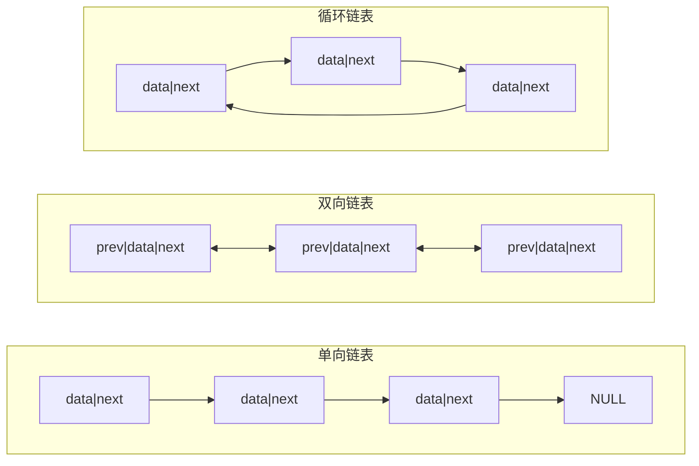

建议先阅读: [[A_容器_Container|A 容器 Container]]

---

## 原理

链表（Linked List）是一种线性数据结构，元素通过指针链接在一起，在内存中非连续存储。每个节点包含数据域和指针域。

### 链表类型

- **单向链表**: 每个节点包含数据 + 指向下一个节点的指针
- **双向链表**: 每个节点包含数据 + 前驱指针 + 后继指针
- **循环链表**: 尾节点指向头节点，形成环



### 数组 vs 链表

| 操作 | 数组 | 链表 | 说明 |
|------|------|------|------|
| 随机访问 | O(1) | O(n) | 链表须从头遍历 |
| 头部插入 | O(n) | O(1) | 数组需整体后移 |
| 尾部插入 | O(1)* | O(1) | *数组需考虑扩容 |
| 中间插入（已知位置） | O(n) | O(1) | 链表只需改指针 |
| 删除（已知位置） | O(n) | O(1) | 链表只需改指针 |
| 缓存友好 | 好 | 差 | 数组连续，链表散列。详见 [[../计算机原理/B_缓存层级|缓存层级]] |
| 额外空间 | 无 | 每个节点存指针 | - |

### 内存布局

链表节点在堆上独立分配，节点间通过指针连接。这意味着：无法通过索引直接访问、CPU 缓存命中率低，但插入/删除只需修改指针。

### 链表操作的数学分析

设链表长度为 n：

**查找第 k 个元素**：需要从 head 遍历 k-1 步，期望 O(n/2) = O(n)。

**插入（已知前驱节点 p）**：
- 单向链表：`new->next = p->next; p->next = new;` → 2 条赋值，O(1)
- 双向链表：`new->prev = p; new->next = p->next; p->next->prev = new; p->next = new;` → 4 条赋值，O(1)
- 对比数组：插入需要将 [k, n-1] 全部后移 → n-k 次移动，O(n)

**删除（已知节点 cur）**：
- 单向链表（需已知前驱 p）：`p->next = cur->next; free(cur);` → O(1)
- 单向链表（未知前驱）：需先遍历找到前驱 → O(n)
- 双向链表（未知前驱）：`cur->prev->next = cur->next; cur->next->prev = cur->prev; free(cur);` → O(1)
- 对比数组：删除需要将 [k+1, n-1] 全部前移 → n-k-1 次移动，O(n)

**空间开销**：
- 单向链表：每个节点额外存 1 个指针，在 64 位系统上每节点多 8 字节
- 双向链表：每个节点额外存 2 个指针，在 64 位系统上每节点多 16 字节
- 对比数组：无额外指针开销，但可能存在内部碎片（cap > size）

---

### 插入操作可视化

以单向链表为例，在节点值为 5 的节点后插入值为 8 的新节点：

```mermaid
graph TD
    subgraph 插入前
        A1["[3|●]"] --> B1["[5|●]"] --> C1["[7|●]"] --> D1["NULL"]
    end
    subgraph 步骤1：创建新节点
        A2["[3|●]"] --> B2["[5|●]"] --> C2["[7|●]"] --> D2["NULL"]
        NEW["[8|?]"]
    end
    subgraph 步骤2：new->next = p->next
        A3["[3|●]"] --> B3["[5|●]"] --> C3["[7|●]"] --> D3["NULL"]
        NEW3["[8|●]"] -.-> C3
    end
    subgraph 步骤3：p->next = new  ✓
        A4["[3|●]"] --> B4["[5|●]"] --> NEW4["[8|●]"] --> C4["[7|●]"] --> D4["NULL"]
    end
```

---

## 实现

### 单向链表

```c
#include <stdlib.h>

typedef struct SNode {
    int data;
    struct SNode* next;
} SNode;

typedef struct {
    SNode* head;
    size_t size;
} SinglyLinkedList;

void sll_init(SinglyLinkedList* list) {
    list->head = NULL;
    list->size = 0;
}

void sll_destroy(SinglyLinkedList* list) {
    while (list->head) {
        SNode* tmp = list->head;
        list->head = list->head->next;
        free(tmp);
    }
    list->size = 0;
}

int sll_push_front(SinglyLinkedList* list, int value) {
    SNode* node = malloc(sizeof(SNode));
    if (!node) return -1;
    node->data = value;
    node->next = list->head;
    list->head = node;
    list->size++;
    return 0;
}

int sll_push_back(SinglyLinkedList* list, int value) {
    SNode* node = malloc(sizeof(SNode));
    if (!node) return -1;
    node->data = value;
    node->next = NULL;
    if (!list->head) {
        list->head = node;
    } else {
        SNode* cur = list->head;
        while (cur->next) cur = cur->next;
        cur->next = node;
    }
    list->size++;
    return 0;
}

int sll_pop_front(SinglyLinkedList* list) {
    if (!list->head) return -1;
    SNode* tmp = list->head;
    list->head = list->head->next;
    free(tmp);
    list->size--;
    return 0;
}

// 删除第一个等于 value 的节点
int sll_remove(SinglyLinkedList* list, int value) {
    if (!list->head) return -1;
    if (list->head->data == value)
        return sll_pop_front(list);
    SNode* cur = list->head;
    while (cur->next && cur->next->data != value)
        cur = cur->next;
    if (cur->next) {
        SNode* tmp = cur->next;
        cur->next = cur->next->next;
        free(tmp);
        list->size--;
        return 0;
    }
    return -1;
}

// 反转链表（原地）
void sll_reverse(SinglyLinkedList* list) {
    SNode* prev = NULL;
    SNode* cur = list->head;
    while (cur) {
        SNode* nxt = cur->next;
        cur->next = prev;
        prev = cur;
        cur = nxt;
    }
    list->head = prev;
}

int sll_contains(SinglyLinkedList* list, int value) {
    for (SNode* cur = list->head; cur; cur = cur->next)
        if (cur->data == value) return 1;
    return 0;
}

size_t sll_size(SinglyLinkedList* list) { return list->size; }
int sll_empty(SinglyLinkedList* list) { return list->head == NULL; }
```

### 双向链表（核心操作）

```c
#include <stdlib.h>

typedef struct DNode {
    int data;
    struct DNode* prev;
    struct DNode* next;
} DNode;

typedef struct {
    DNode* head;
    DNode* tail;
    size_t size;
} DoublyLinkedList;

void dll_init(DoublyLinkedList* list) {
    list->head = NULL;
    list->tail = NULL;
    list->size = 0;
}

void dll_destroy(DoublyLinkedList* list) {
    while (list->head) {
        DNode* tmp = list->head;
        list->head = list->head->next;
        free(tmp);
    }
    list->tail = NULL;
    list->size = 0;
}

int dll_push_back(DoublyLinkedList* list, int value) {
    DNode* node = malloc(sizeof(DNode));
    if (!node) return -1;
    node->data = value;
    node->prev = list->tail;
    node->next = NULL;
    if (list->tail)
        list->tail->next = node;
    else
        list->head = node;
    list->tail = node;
    list->size++;
    return 0;
}

int dll_push_front(DoublyLinkedList* list, int value) {
    DNode* node = malloc(sizeof(DNode));
    if (!node) return -1;
    node->data = value;
    node->prev = NULL;
    node->next = list->head;
    if (list->head)
        list->head->prev = node;
    else
        list->tail = node;
    list->head = node;
    list->size++;
    return 0;
}

int dll_pop_back(DoublyLinkedList* list) {
    if (!list->tail) return -1;
    DNode* tmp = list->tail;
    list->tail = list->tail->prev;
    if (list->tail) list->tail->next = NULL;
    else list->head = NULL;
    free(tmp);
    list->size--;
    return 0;
}

int dll_pop_front(DoublyLinkedList* list) {
    if (!list->head) return -1;
    DNode* tmp = list->head;
    list->head = list->head->next;
    if (list->head) list->head->prev = NULL;
    else list->tail = NULL;
    free(tmp);
    list->size--;
    return 0;
}

size_t dll_size(DoublyLinkedList* list) { return list->size; }
int dll_empty(DoublyLinkedList* list) { return list->head == NULL; }
```

### 链表算法：快慢指针

```c
typedef struct ListNode {
    int data;
    struct ListNode* next;
} ListNode;

// 检测链表是否有环
int has_cycle(ListNode* head) {
    ListNode* slow = head;
    ListNode* fast = head;
    while (fast && fast->next) {
        slow = slow->next;
        fast = fast->next->next;
        if (slow == fast) return 1;
    }
    return 0;
}

// 找中间节点
ListNode* find_middle(ListNode* head) {
    ListNode* slow = head;
    ListNode* fast = head;
    while (fast && fast->next) {
        slow = slow->next;
        fast = fast->next->next;
    }
    return slow;
}

// 合并两个有序链表
ListNode* merge_two_lists(ListNode* l1, ListNode* l2) {
    ListNode dummy;
    ListNode* tail = &dummy;
    while (l1 && l2) {
        if (l1->data <= l2->data) {
            tail->next = l1; l1 = l1->next;
        } else {
            tail->next = l2; l2 = l2->next;
        }
        tail = tail->next;
    }
    tail->next = l1 ? l1 : l2;
    return dummy.next;
}
```

---

## 各语言标准库对比

| 语言 | 单向链表 | 双向链表 |
|------|----------|----------|
| C | 无（手写） | 无（手写） |
| C++ | forward_list | list |
| Java | 无（用 LinkedList） | LinkedList |
| Python | 无（直接用 list） | 无（用 list 或 deque） |
| Rust | LinkedList（双向） | LinkedList |

---

---

## 应用场景

- **LRU 缓存**: 双向链表 + 哈希表，O(1) 访问和淘汰
- **约瑟夫问题**: 用循环链表模拟 n 个人围圈报数
- **多项式表示与加法**: 每个节点存一个项（系数+指数），按指数排序

---

## 练习

| 题号 | 题目 | 难度 | 知识点 |
|------|------|------|--------|
| P1996 | 约瑟夫问题 | 入门 | 循环链表模拟 |
| P1160 | 队列安排 | 普及 | 双向链表 |
