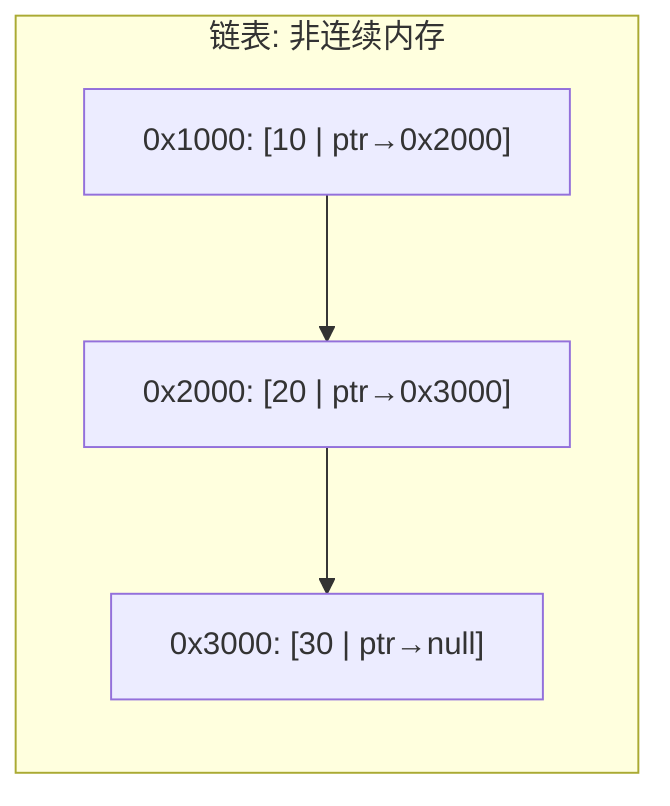
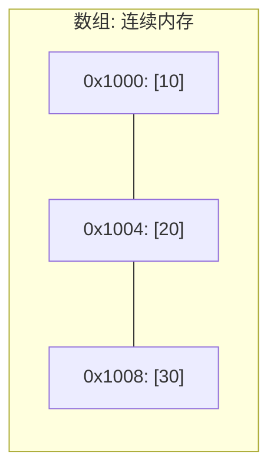
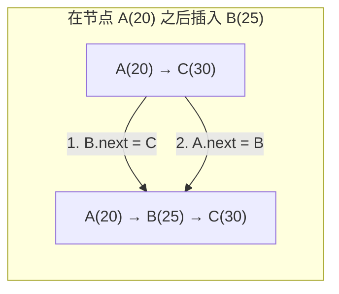
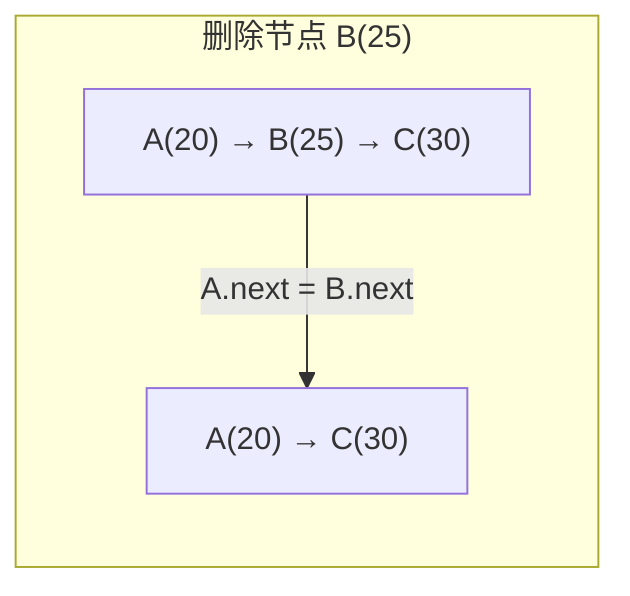

## ==========================================================================
C++ 数据结构教程 — 链表 (Linked List)
## ==========================================================================

## 📋 章节概述

链表（Linked List）是一种线性数据结构，其中的元素通过指针链接在一起，而不是像
数组那样在内存中连续存储。链表的每个节点包含数据域和指针域，指针指向下一个节点。

链表的优点：插入和删除操作高效（O(1)），不需要移动其他元素；空间动态分配，不
需要预分配。
链表的缺点：不支持随机访问（O(n)才能访问任意元素）；每个节点需要额外的指针
存储空间；对缓存不友好（节点分散在内存各处）。

> 📌 **底层实现参考**：如果需要深入理解本章数据结构的底层实现（纯C手写、内存布局、指针操作），请参阅 [[../../C语言深化教程/3数据结构/02_链表|C语言教程: 链表]]。C教程侧重手动实现与内存本质，本教程侧重STL使用与算法优化，两者互补。

## ==========================================================================
### 📖 第一节: 基础语法 + 计算机底层原理
## ==========================================================================

1.1 链表的基本概念
-----------------------

常见的链表类型：

单向链表（Singly Linked List）：每个节点包含数据 + 指向下一个节点的指针。
双向链表（Doubly Linked List）：每个节点包含数据 + 指向前一个和后一个节点的指针。
循环链表（Circular Linked List）：尾节点指向头节点，形成环。

```cpp
#include <iostream>

struct SinglyNode {
    int data;
    SinglyNode* next;

    SinglyNode(int val) : data(val), next(nullptr) {}
};

struct DoublyNode {
    int data;
    DoublyNode* prev;
    DoublyNode* next;

    DoublyNode(int val) : data(val), prev(nullptr), next(nullptr) {}
};

int main() {
    // 创建单向链表: 10 -> 20 -> 30
    SinglyNode* head = new SinglyNode(10);
    head->next = new SinglyNode(20);
    head->next->next = new SinglyNode(30);

    // 遍历单向链表
    std::cout << "单向链表: ";
    SinglyNode* cur = head;
    while (cur) {
        std::cout << cur->data;
        if (cur->next) std::cout << " -> ";
        cur = cur->next;
    }
    std::cout << std::endl;

    // 创建双向链表: 10 <-> 20 <-> 30
    DoublyNode* dhead = new DoublyNode(10);
    DoublyNode* dsecond = new DoublyNode(20);
    DoublyNode* dthird = new DoublyNode(30);

    dhead->next = dsecond;
    dsecond->prev = dhead;
    dsecond->next = dthird;
    dthird->prev = dsecond;

    // 正向遍历
    std::cout << "双向链表(正向): ";
    DoublyNode* dcur = dhead;
    while (dcur) {
        std::cout << dcur->data;
        if (dcur->next) std::cout << " <-> ";
        dcur = dcur->next;
    }
    std::cout << std::endl;

    // 反向遍历
    std::cout << "双向链表(反向): ";
    dcur = dthird;
    while (dcur) {
        std::cout << dcur->data;
        if (dcur->prev) std::cout << " <-> ";
        dcur = dcur->prev;
    }
    std::cout << std::endl;

    // 清理内存（略）

    return 0;
}
```

1.2 链表的底层原理：内存布局
---------------------------------

链表节点在内存中是非连续存储的。每个节点通过 new 在堆上独立分配。





这种非连续存储意味着：
1. 无法通过索引直接访问（需要从头遍历）
2. CPU缓存命中率低（空间局部性差）
3. 插入/删除只需要修改指针，不需要移动数据





| 操作 | 数组 | 链表 | 说明 |
|------|------|------|------|
| 随机访问 | O(1) | O(n) | 链表须从头遍历 |
| 头部插入 | O(n) | O(1) | 数组需整体后移 |
| 尾部插入 | O(1)* | O(1) | *数组需考虑扩容 |
| 中间插入 | O(n) | O(1)** | **前提: 已知插入位置节点 |
| 删除 | O(n) | O(1)** | **前提: 已知删除节点前驱 |
| 空间利用率 | 100% | ~50% | 链表每个节点额外存指针 |

1.3 手动实现单向链表
-----------------------

```cpp
#include <iostream>
#include <stdexcept>

template<typename T>
class LinkedList {
private:
    struct Node {
        T data;
        Node* next;
        Node(const T& val) : data(val), next(nullptr) {}
    };

    Node* head;
    size_t count;

public:
    LinkedList() : head(nullptr), count(0) {}

    ~LinkedList() {
        while (head) {
            Node* temp = head;
            head = head->next;
            delete temp;
        }
    }

    // 头插
    void push_front(const T& value) {
        Node* new_node = new Node(value);
        new_node->next = head;
        head = new_node;
        ++count;
    }

    // 尾插
    void push_back(const T& value) {
        Node* new_node = new Node(value);
        if (!head) {
            head = new_node;
        } else {
            Node* cur = head;
            while (cur->next) cur = cur->next;
            cur->next = new_node;
        }
        ++count;
    }

    // 中间插入（在指定位置之后）
    void insert_after(size_t index, const T& value) {
        if (index >= count) {
            throw std::out_of_range("索引越界");
        }
        Node* cur = head;
        for (size_t i = 0; i < index; ++i) cur = cur->next;

        Node* new_node = new Node(value);
        new_node->next = cur->next;
        cur->next = new_node;
        ++count;
    }

    // 头删
    void pop_front() {
        if (!head) throw std::underflow_error("链表为空");
        Node* temp = head;
        head = head->next;
        delete temp;
        --count;
    }

    // 尾删
    void pop_back() {
        if (!head) throw std::underflow_error("链表为空");
        if (!head->next) {
            delete head;
            head = nullptr;
        } else {
            Node* cur = head;
            while (cur->next->next) cur = cur->next;
            delete cur->next;
            cur->next = nullptr;
        }
        --count;
    }

    // 按值删除（删除第一个匹配的）
    void remove(const T& value) {
        if (!head) return;

        if (head->data == value) {
            Node* temp = head;
            head = head->next;
            delete temp;
            --count;
            return;
        }

        Node* cur = head;
        while (cur->next && cur->next->data != value) {
            cur = cur->next;
        }
        if (cur->next) {
            Node* temp = cur->next;
            cur->next = cur->next->next;
            delete temp;
            --count;
        }
    }

    // 查找
    bool contains(const T& value) const {
        Node* cur = head;
        while (cur) {
            if (cur->data == value) return true;
            cur = cur->next;
        }
        return false;
    }

    // 反转链表
    void reverse() {
        Node* prev = nullptr;
        Node* cur = head;
        Node* next = nullptr;

        while (cur) {
            next = cur->next;
            cur->next = prev;
            prev = cur;
            cur = next;
        }
        head = prev;
    }

    // 获取第index个元素（0-based）
    T& at(size_t index) {
        if (index >= count) throw std::out_of_range("索引越界");
        Node* cur = head;
        for (size_t i = 0; i < index; ++i) cur = cur->next;
        return cur->data;
    }

    void print() const {
        Node* cur = head;
        while (cur) {
            std::cout << cur->data;
            if (cur->next) std::cout << " -> ";
            cur = cur->next;
        }
        std::cout << " (size=" << count << ")" << std::endl;
    }

    size_t size() const { return count; }
    bool empty() const { return count == 0; }
};

int main() {
    LinkedList<int> lst;

    lst.push_back(10);
    lst.push_back(20);
    lst.push_back(30);
    lst.push_front(5);
    lst.print();

    lst.insert_after(1, 15);
    lst.print();

    lst.pop_front();
    lst.print();

    lst.reverse();
    std::cout << "反转后: ";
    lst.print();

    std::cout << "含有20? " << lst.contains(20) << std::endl;
    std::cout << "at(2) = " << lst.at(2) << std::endl;

    lst.remove(20);
    lst.print();

    return 0;
}
```

1.4 手动实现双向链表
------------------------

```cpp
#include <iostream>
#include <stdexcept>

template<typename T>
class DoublyLinkedList {
private:
    struct Node {
        T data;
        Node* prev;
        Node* next;
        Node(const T& val) : data(val), prev(nullptr), next(nullptr) {}
    };

    Node* head;
    Node* tail;
    size_t count;

public:
    DoublyLinkedList() : head(nullptr), tail(nullptr), count(0) {}

    ~DoublyLinkedList() {
        while (head) {
            Node* temp = head;
            head = head->next;
            delete temp;
        }
    }

    void push_back(const T& value) {
        Node* new_node = new Node(value);
        if (!head) {
            head = tail = new_node;
        } else {
            new_node->prev = tail;
            tail->next = new_node;
            tail = new_node;
        }
        ++count;
    }

    void push_front(const T& value) {
        Node* new_node = new Node(value);
        if (!head) {
            head = tail = new_node;
        } else {
            new_node->next = head;
            head->prev = new_node;
            head = new_node;
        }
        ++count;
    }

    void pop_back() {
        if (!tail) throw std::underflow_error("链表为空");
        Node* temp = tail;
        tail = tail->prev;
        if (tail) tail->next = nullptr;
        else head = nullptr;
        delete temp;
        --count;
    }

    void print_forward() const {
        Node* cur = head;
        while (cur) {
            std::cout << cur->data;
            if (cur->next) std::cout << " <-> ";
            cur = cur->next;
        }
        std::cout << std::endl;
    }

    void print_backward() const {
        Node* cur = tail;
        while (cur) {
            std::cout << cur->data;
            if (cur->prev) std::cout << " <-> ";
            cur = cur->prev;
        }
        std::cout << std::endl;
    }

    size_t size() const { return count; }
};

int main() {
    DoublyLinkedList<int> dll;
    dll.push_back(10);
    dll.push_back(20);
    dll.push_back(30);
    dll.push_front(5);

    std::cout << "正向: ";
    dll.print_forward();
    std::cout << "反向: ";
    dll.print_backward();

    return 0;
}
```


## ==========================================================================
### 📖 第二节: 所有用法大全
## ==========================================================================

2.1 std::forward_list —— 单向链表
---------------------------------------

C++11引入，比list更节省内存（只有一个指针）。

```cpp
#include <iostream>
#include <forward_list>

int main() {
    std::forward_list<int> flst = {1, 2, 3, 4, 5};

    // 头部操作
    flst.push_front(0);
    flst.pop_front();

    // 在指定位置之后操作（需要前驱迭代器）
    auto it = flst.before_begin();  // 头部哨兵
    flst.insert_after(it, 99);     // 在头部之后插入

    // 查找并插入
    auto prev = flst.before_begin();
    for (auto cur = flst.begin(); cur != flst.end(); ++cur, ++prev) {
        if (*cur == 3) {
            flst.insert_after(cur, 100);  // 在3之后插入100
            break;
        }
    }

    // 删除
    flst.erase_after(flst.before_begin());  // 删除第一个元素

    // 特有操作
    flst.sort();
    flst.unique();        // 删除连续重复元素
    flst.reverse();

    // 拼接
    std::forward_list<int> other = {200, 300};
    flst.splice_after(flst.before_begin(), other);  // 将other拼接到头部

    // 合并（两个list必须已排序）
    std::forward_list<int> a = {1, 3, 5};
    std::forward_list<int> b = {2, 4, 6};
    a.merge(b);

    for (int x : a) std::cout << x << " ";
    std::cout << std::endl;

    return 0;
}
```

2.2 std::list —— 双向链表
------------------------------

```cpp
#include <iostream>
#include <list>
#include <algorithm>

int main() {
    std::list<int> lst = {3, 1, 4, 1, 5, 9};

    // 两端操作
    lst.push_front(0);
    lst.push_back(10);
    lst.pop_front();
    lst.pop_back();

    // 插入（在pos之前）
    auto it = std::find(lst.begin(), lst.end(), 4);
    if (it != lst.end()) {
        lst.insert(it, 100);      // 在4之前插入
        lst.emplace(it, 200);     // C++11就地构造
    }

    // 删除
    lst.remove(1);                // 删除所有值为1的元素
    lst.remove_if([](int x) { return x > 5; });  // 条件删除

    // 链表特有操作
    lst.sort();
    lst.unique();                 // 去重
    lst.reverse();

    // 拼接（将other的元素移动到lst中）
    std::list<int> other = {100, 200};
    lst.splice(lst.end(), other);  // other变为空

    // 合并（两个list必须都已排序）
    std::list<int> a = {1, 3, 5};
    std::list<int> b = {2, 4, 6};
    a.merge(b);  // a变为{1,2,3,4,5,6}, b为空

    // resize
    lst.resize(10);    // 扩展或截断
    lst.resize(20, -1); // 用-1填充新元素

    // 赋值
    lst.assign(5, 100);  // 全部替换为5个100

    // 遍历
    for (int x : lst) std::cout << x << " ";
    std::cout << std::endl;

    return 0;
}
```

2.3 链表算法（常见操作）
---------------------------

```cpp
#include <iostream>
#include <forward_list>
#include <unordered_set>

// 1. 检测链表是否有环（快慢指针）
struct ListNode {
    int val;
    ListNode* next;
    ListNode(int v) : val(v), next(nullptr) {}
};

bool hasCycle(ListNode* head) {
    ListNode* slow = head;
    ListNode* fast = head;

    while (fast && fast->next) {
        slow = slow->next;
        fast = fast->next->next;
        if (slow == fast) return true;
    }
    return false;
}

// 2. 找到链表中间节点
ListNode* findMiddle(ListNode* head) {
    ListNode* slow = head;
    ListNode* fast = head;

    while (fast && fast->next) {
        slow = slow->next;
        fast = fast->next->next;
    }
    return slow;
}

// 3. 合并两个有序链表
ListNode* mergeTwoLists(ListNode* l1, ListNode* l2) {
    ListNode dummy(0);
    ListNode* tail = &dummy;

    while (l1 && l2) {
        if (l1->val <= l2->val) {
            tail->next = l1;
            l1 = l1->next;
        } else {
            tail->next = l2;
            l2 = l2->next;
        }
        tail = tail->next;
    }
    tail->next = l1 ? l1 : l2;

    return dummy.next;
}

// 4. 删除倒数第N个节点
ListNode* removeNthFromEnd(ListNode* head, int n) {
    ListNode dummy(0);
    dummy.next = head;
    ListNode* fast = &dummy;
    ListNode* slow = &dummy;

    // fast 先走 n+1 步
    for (int i = 0; i <= n; ++i) fast = fast->next;

    while (fast) {
        fast = fast->next;
        slow = slow->next;
    }

    ListNode* to_delete = slow->next;
    slow->next = slow->next->next;
    delete to_delete;

    return dummy.next;
}

// 辅助函数
void printList(ListNode* head) {
    while (head) {
        std::cout << head->val;
        if (head->next) std::cout << " -> ";
        head = head->next;
    }
    std::cout << std::endl;
}

int main() {
    // 合并有序链表
    ListNode* l1 = new ListNode(1);
    l1->next = new ListNode(3);
    l1->next->next = new ListNode(5);

    ListNode* l2 = new ListNode(2);
    l2->next = new ListNode(4);
    l2->next->next = new ListNode(6);

    ListNode* merged = mergeTwoLists(l1, l2);
    std::cout << "合并后: ";
    printList(merged);

    // 中间节点
    ListNode* mid = findMiddle(merged);
    std::cout << "中间节点: " << mid->val << std::endl;

    // 删除倒数第3个
    ListNode* after_remove = removeNthFromEnd(merged, 3);
    std::cout << "删除倒数第3个: ";
    printList(after_remove);

    return 0;
}
```


## ==========================================================================
### 📖 第三节: 实用案例
## ==========================================================================

案例一：浏览器的前进后退（双向链表版）
----------------------------------------------

与栈实现不同，这里使用双向链表更直观地管理页面历史：

```cpp
#include <iostream>
#include <string>

class BrowserHistory {
private:
    struct Page {
        std::string url;
        Page* prev;
        Page* next;
        Page(const std::string& u) : url(u), prev(nullptr), next(nullptr) {}
    };

    Page* current;

public:
    BrowserHistory(const std::string& homepage) {
        current = new Page(homepage);
    }

    void visit(const std::string& url) {
        // 清空前进历史
        Page* temp = current->next;
        while (temp) {
            Page* to_del = temp;
            temp = temp->next;
            delete to_del;
        }

        current->next = new Page(url);
        current->next->prev = current;
        current = current->next;
        std::cout << "访问: " << url << std::endl;
    }

    std::string back(int steps) {
        while (steps-- > 0 && current->prev) {
            current = current->prev;
        }
        std::cout << "后退到: " << current->url << std::endl;
        return current->url;
    }

    std::string forward(int steps) {
        while (steps-- > 0 && current->next) {
            current = current->next;
        }
        std::cout << "前进到: " << current->url << std::endl;
        return current->url;
    }

    ~BrowserHistory() {
        while (current->prev) current = current->prev;
        while (current) {
            Page* temp = current;
            current = current->next;
            delete temp;
        }
    }
};

int main() {
    BrowserHistory bh("google.com");

    bh.visit("github.com");
    bh.visit("stackoverflow.com");
    bh.visit("cppreference.com");

    bh.back(1);   // stackoverflow.com
    bh.back(1);   // github.com
    bh.forward(1); // stackoverflow.com
    bh.visit("reddit.com");  // 前进历史被清空

    bh.back(2);   // github.com -> google.com

    return 0;
}
```


案例二：约瑟夫问题（循环链表）
--------------------------------------

经典的约瑟夫问题：n个人围成一圈，从第一个人开始报数，报到m的人出列，求最后
剩下的人。

```cpp
#include <iostream>

struct Person {
    int id;
    Person* next;
    Person(int i) : id(i), next(nullptr) {}
};

int josephus(int n, int m) {
    // 创建循环链表
    Person* head = new Person(1);
    Person* prev = head;

    for (int i = 2; i <= n; ++i) {
        Person* p = new Person(i);
        prev->next = p;
        prev = p;
    }
    prev->next = head;  // 形成环

    // 开始游戏
    Person* cur = head;
    Person* last = prev;

    while (cur->next != cur) {  // 只剩一个人时结束
        // 报数到m-1
        for (int i = 1; i < m; ++i) {
            last = cur;
            cur = cur->next;
        }

        // cur出列
        std::cout << cur->id << " 出列" << std::endl;
        last->next = cur->next;
        delete cur;
        cur = last->next;
    }

    int survivor = cur->id;
    delete cur;
    return survivor;
}

int main() {
    int n = 7, m = 3;
    int survivor = josephus(n, m);
    std::cout << n << "个人, 报数" << m << ", 幸存者: " << survivor << std::endl;

    return 0;
}
```


案例三：多项式的链表表示与运算
-------------------------------------------

使用链表表示多项式，实现加法运算：

```cpp
#include <iostream>

struct Term {
    int coefficient;  // 系数
    int exponent;     // 指数
    Term* next;
    Term(int c, int e) : coefficient(c), exponent(e), next(nullptr) {}
};

class Polynomial {
private:
    Term* head;

    // 辅助：在尾部添加项
    void append(int coeff, int exp) {
        if (coeff == 0) return;  // 系数为0的项不添加
        if (!head) {
            head = new Term(coeff, exp);
            return;
        }
        Term* cur = head;
        while (cur->next) cur = cur->next;
        cur->next = new Term(coeff, exp);
    }

public:
    Polynomial() : head(nullptr) {}

    Polynomial(const std::initializer_list<std::pair<int, int>>& terms) : head(nullptr) {
        for (auto& [c, e] : terms) {
            append(c, e);
        }
    }

    ~Polynomial() {
        while (head) {
            Term* temp = head;
            head = head->next;
            delete temp;
        }
    }

    // 多项式加法
    Polynomial add(const Polynomial& other) const {
        Polynomial result;
        Term* p = head;
        Term* q = other.head;

        while (p && q) {
            if (p->exponent > q->exponent) {
                result.append(p->coefficient, p->exponent);
                p = p->next;
            } else if (p->exponent < q->exponent) {
                result.append(q->coefficient, q->exponent);
                q = q->next;
            } else {
                result.append(p->coefficient + q->coefficient, p->exponent);
                p = p->next;
                q = q->next;
            }
        }

        while (p) { result.append(p->coefficient, p->exponent); p = p->next; }
        while (q) { result.append(q->coefficient, q->exponent); q = q->next; }

        return result;
    }

    void print() const {
        if (!head) { std::cout << "0"; return; }
        Term* cur = head;
        while (cur) {
            if (cur != head && cur->coefficient > 0) std::cout << " + ";
            if (cur->coefficient < 0) std::cout << " - ";
            int abs_c = cur->coefficient > 0 ? cur->coefficient : -cur->coefficient;

            if (cur->exponent == 0) {
                std::cout << abs_c;
            } else if (cur->exponent == 1) {
                std::cout << abs_c << "x";
            } else {
                std::cout << abs_c << "x^" << cur->exponent;
            }
            cur = cur->next;
        }
    }
};

int main() {
    Polynomial p1({{3, 2}, {2, 1}, {1, 0}});     // 3x^2 + 2x + 1
    Polynomial p2({{5, 3}, {-1, 2}, {4, 0}});    // 5x^3 - x^2 + 4

    Polynomial sum = p1.add(p2);

    std::cout << "P1 = "; p1.print(); std::cout << std::endl;
    std::cout << "P2 = "; p2.print(); std::cout << std::endl;
    std::cout << "和 = "; sum.print(); std::cout << std::endl;

    return 0;
}
```


## ==========================================================================
### 📖 第四节: 课后习题
## ==========================================================================

1. 基础题：手动实现一个带哨兵节点的单向链表。
   - 使用 dummy head（哨兵头节点）简化边界条件处理
   - 实现 insert、erase、find、reverse 操作
   - 分析各操作的时间复杂度

2. 应用题：判断一个链表是否为回文链表。
   - 时间复杂度O(n)，空间复杂度O(1)
   - 使用快慢指针找到中点
   - 反转后半部分链表进行比较

3. 进阶题：实现一个跳表（Skip List）。
   - 跳表是一种多层链表结构，支持O(log n)的查找
   - 随机决定节点层数
   - 实现 insert、erase、find 操作

4. 综合题：使用链表实现一个简单的内存分配器。
   - 维护空闲块链表（free list）
   - 支持 malloc(size) 和 free(ptr) 操作
   - 实现首次适应（first-fit）和最佳适应（best-fit）策略
   - 处理内存碎片问题

5. 挑战题：实现一个并发安全的链表。
   - 支持读写锁（读多写少）
   - 或者实现无锁链表（lock-free，使用CAS原子操作）
   - 验证线程安全性

## ==========================================================================


## ==========================================================================
### 📝 章节测试
## ==========================================================================

> [!question] 判断题 1
> 单向链表中每个节点包含数据域和两个指针域（前驱和后继） （ ）
> - [ ] ✅ 正确
> - [ ] ❌ 错误
>
> > [!success]- 点击查看答案
> > 答案: 错误
> > 
> > **解析**: 单向链表每个节点只有一个指针域（指向下一个节点）。包含两个指针域（前驱和后继）的是双向链表。

> [!question] 判断题 2
> 链表的随机访问时间复杂度为O(1) （ ）
> - [ ] ✅ 正确
> - [ ] ❌ 错误
>
> > [!success]- 点击查看答案
> > 答案: 错误
> > 
> > **解析**: 链表不支持随机访问，访问第n个元素需要从头节点开始逐个遍历，时间复杂度为O(n)。只有数组/vector支持O(1)随机访问。

> [!question] 判断题 3
> 在链表中间位置插入一个节点的时间复杂度为O(1)（假设已有指向该位置的指针） （ ）
> - [ ] ✅ 正确
> - [ ] ❌ 错误
>
> > [!success]- 点击查看答案
> > 答案: 正确
> > 
> > **解析**: 如果已经有指向插入位置的指针，只需要修改几个指针即可完成插入，时间复杂度为O(1)。查找位置可能需要O(n)，但插入操作本身是O(1)。

> [!question] 判断题 4
> 循环链表的尾节点的next指针指向nullptr （ ）
> - [ ] ✅ 正确
> - [ ] ❌ 错误
>
> > [!success]- 点击查看答案
> > 答案: 错误
> > 
> > **解析**: 循环链表的尾节点的next指针指向头节点，形成一个环。普通链表的尾节点next才指向nullptr。

> [!question] 判断题 5
> 使用快慢指针可以在O(n)时间、O(1)空间内判断链表是否有环 （ ）
> - [ ] ✅ 正确
> - [ ] ❌ 错误
>
> > [!success]- 点击查看答案
> > 答案: 正确
> > 
> > **解析**: 快指针每次走2步，慢指针每次走1步。如果链表有环，快指针最终会追上慢指针（两者相遇）。无需额外空间，时间O(n)。

> [!question] 判断题 6
> std::list 的 sort() 函数使用的是快速排序算法 （ ）
> - [ ] ✅ 正确
> - [ ] ❌ 错误
>
> > [!success]- 点击查看答案
> > 答案: 错误
> > 
> > **解析**: std::list::sort()通常使用归并排序，因为链表不支持随机访问，快排需要随机访问不适合链表。归并排序只需要顺序访问，适合链表结构。

> [!question] 判断题 7
> 删除链表中的某个节点时，必须知道该节点的前驱节点（单向链表） （ ）
> - [ ] ✅ 正确
> - [ ] ❌ 错误
>
> > [!success]- 点击查看答案
> > 答案: 正确
> > 
> > **解析**: 在单向链表中，删除节点需要将前驱节点的next指向被删节点的下一个节点。如果不知道前驱，无法完成连接（除非使用"值替换"技巧）。

> [!question] 判断题 8
> 哨兵节点（dummy head）可以简化链表头部插入/删除的边界条件处理 （ ）
> - [ ] ✅ 正确
> - [ ] ❌ 错误
>
> > [!success]- 点击查看答案
> > 答案: 正确
> > 
> > **解析**: 使用哨兵节点后，链表始终非空，头部操作和中间操作的逻辑统一，不再需要特殊处理head为nullptr的情况。

> [!question] 判断题 9
> std::forward_list 支持 push_back() 操作 （ ）
> - [ ] ✅ 正确
> - [ ] ❌ 错误
>
> > [!success]- 点击查看答案
> > 答案: 错误
> > 
> > **解析**: std::forward_list 是单向链表，只支持 push_front()。要在尾部插入需要先遍历到末尾，效率低，因此标准库不提供push_back()。

> [!question] 判断题 10
> 链表相比数组的主要缺点是缓存命中率低 （ ）
> - [ ] ✅ 正确
> - [ ] ❌ 错误
>
> > [!success]- 点击查看答案
> > 答案: 正确
> > 
> > **解析**: 链表节点分散在内存各处，遍历时频繁跳转到不同内存位置，导致CPU缓存命中率低。数组/vector连续存储，遍历时缓存友好，性能更好。

---

> [!question] 选择题 1
> 反转一个单向链表的时间复杂度和空间复杂度分别是？
> - [ ] A. O(n), O(n)
> - [ ] B. O(n), O(1)
> - [ ] C. O(n^2), O(1)
> - [ ] D. O(1), O(1)
>
> > [!success]- 点击查看答案
> > 正确答案: B
> > 
> > **解析**: 反转链表只需遍历一次（O(n)），使用三个指针（prev, curr, next）原地修改指针方向，空间O(1)。

> [!question] 选择题 2
> 以下哪种方法可以找到链表的中间节点（不知道链表长度）？
> - [ ] A. 先计数再遍历到n/2
> - [ ] B. 使用快慢指针
> - [ ] C. 使用递归
> - [ ] D. 以上都可以
>
> > [!success]- 点击查看答案
> > 正确答案: D
> > 
> > **解析**: 三种方法都可以找到中间节点。快慢指针法最高效（一次遍历），快指针到末尾时慢指针恰好在中间。

> [!question] 选择题 3
> 双向链表相比单向链表的主要优势是？
> - [ ] A. 节省内存
> - [ ] B. 支持反向遍历和O(1)删除当前节点
> - [ ] C. 插入更快
> - [ ] D. 支持随机访问
>
> > [!success]- 点击查看答案
> > 正确答案: B
> > 
> > **解析**: 双向链表有prev指针，可以反向遍历。知道要删除的节点时可以直接访问其前驱，实现O(1)删除。代价是每个节点多一个指针的内存开销。

> [!question] 选择题 4
> 在一个长度为n的有序链表中查找某个元素，最优时间复杂度是？
> - [ ] A. O(1)
> - [ ] B. O(log n)
> - [ ] C. O(n)
> - [ ] D. O(n log n)
>
> > [!success]- 点击查看答案
> > 正确答案: C
> > 
> > **解析**: 即使链表有序，由于不支持随机访问，无法使用二分查找。查找只能从头开始顺序扫描，时间复杂度为O(n)。（跳表可以做到O(log n)但那是不同的数据结构）

> [!question] 选择题 5
> 约瑟夫问题（Josephus Problem）最适合用哪种链表实现？
> - [ ] A. 单向链表
> - [ ] B. 双向链表
> - [ ] C. 循环链表
> - [ ] D. 跳表
>
> > [!success]- 点击查看答案
> > 正确答案: C
> > 
> > **解析**: 约瑟夫问题中人们围成一圈依次报数出列，循环链表的尾节点连接头节点形成环，天然模拟了"围成一圈"的场景。

> [!question] 选择题 6
> std::list 的 splice() 操作的时间复杂度是？
> - [ ] A. O(1)
> - [ ] B. O(n)
> - [ ] C. O(n log n)
> - [ ] D. O(n^2)
>
> > [!success]- 点击查看答案
> > 正确答案: A
> > 
> > **解析**: splice将另一个list的节点移动到当前list，只需修改几个指针（O(1)），不需要复制或移动元素。这是链表的独特优势。

> [!question] 选择题 7
> 检测链表中环的入口节点，需要使用什么算法？
> - [ ] A. 只用快慢指针即可
> - [ ] B. Floyd判圈算法（快慢指针相遇后，一个从头开始同步走）
> - [ ] C. 哈希表记录访问过的节点
> - [ ] D. B和C都可以
>
> > [!success]- 点击查看答案
> > 正确答案: D
> > 
> > **解析**: Floyd判圈算法快慢指针相遇后，将一个指针放回头部，两个指针同时每次走一步，再次相遇即为环入口（O(1)空间）。哈希表法也可以但空间O(n)。

> [!question] 选择题 8
> 对两个已排序链表进行合并，最优时间复杂度是？
> - [ ] A. O(n + m)
> - [ ] B. O(n * m)
> - [ ] C. O((n+m) log(n+m))
> - [ ] D. O(max(n, m))
>
> > [!success]- 点击查看答案
> > 正确答案: A
> > 
> > **解析**: 使用双指针法（类似归并排序的merge步骤），每次比较两个链表的当前节点取较小者，时间复杂度O(n+m)。

> [!question] 选择题 9
> 下面哪个操作在std::list上比std::vector更高效？
> - [ ] A. 随机访问第i个元素
> - [ ] B. 在已知位置插入/删除元素
> - [ ] C. 排序
> - [ ] D. 二分查找
>
> > [!success]- 点击查看答案
> > 正确答案: B
> > 
> > **解析**: list在已知位置（有迭代器）插入/删除只需O(1)修改指针，而vector需要O(n)移动元素。其他操作（随机访问、排序、查找）vector都更快。

> [!question] 选择题 10
> 以下哪种数据结构可以视为"带有多层链表索引"的升级链表？
> - [ ] A. 红黑树
> - [ ] B. B树
> - [ ] C. 跳表（Skip List）
> - [ ] D. 哈希链表
>
> > [!success]- 点击查看答案
> > 正确答案: C
> > 
> > **解析**: 跳表（Skip List）在普通有序链表上增加多层索引链表，通过随机化决定节点层数，实现O(log n)的查找/插入/删除，是Redis中有序集合的底层实现。

---

### 💻 编程大题

> [!note] 编程题 1：实现一个双向循环链表
> **要求**：
> 1. 实现模板类 `CircularDoublyLinkedList<T>`
> 2. 支持以下操作：
>    - `push_front(val)` / `push_back(val)` — 头部/尾部插入
>    - `pop_front()` / `pop_back()` — 头部/尾部删除
>    - `insert(pos, val)` — 在第pos个位置之前插入
>    - `erase(pos)` — 删除第pos个位置的元素
>    - `find(val)` — 查找元素，返回位置
>    - `reverse()` — 反转链表
>    - `size()` / `empty()` / `print()`
> 3. 使用哨兵节点简化实现
> 4. 验证循环性质：从任一节点出发可以遍历回该节点
>
> **提示**: 哨兵节点的next指向第一个元素，prev指向最后一个元素

> [!note] 编程题 2：链表排序（归并排序）
> **要求**：
> 1. 对单向链表实现归并排序
> 2. 要求：时间O(n log n)，空间O(log n)（递归栈空间）或O(1)（迭代实现）
> 3. 实现步骤：
>    - 使用快慢指针找到链表中点
>    - 递归地对两半链表排序
>    - 合并两个有序链表
> 4. 额外：实现自底向上的迭代归并排序（O(1)空间）
> 5. 与std::list::sort()进行性能对比
>
> **提示**: 自底向上先两两合并长度为1的子链表，再合并长度为2的，依此类推

> [!note] 编程题 3：LRU缓存的链表+哈希表实现
> **要求**：
> 1. 使用双向链表 + unordered_map 实现LRU（最近最少使用）缓存
> 2. 支持操作：
>    - `get(key)` — 获取key对应的value，如果key不存在返回-1，O(1)
>    - `put(key, value)` — 插入或更新键值对，如果超出容量则淘汰最久未使用的，O(1)
> 3. 不使用std::list，手动实现双向链表部分
> 4. 正确处理边界情况：空缓存、容量为1、重复key等
> 5. 编写完整测试验证
>
> **提示**: 链表头部为最近使用，尾部为最久未使用。每次get/put都将节点移到头部

### 🔗 推荐练习题（洛谷）

| 题号 | 题目 | 难度 | 知识点 |
|------|------|------|--------|
| [P1996](https://www.luogu.com.cn/problem/P1996) | 约瑟夫问题 | 入门 | 循环链表模拟 |

---

## --------------------------------------------------------------------------
## 🔗 知识网络
## --------------------------------------------------------------------------

- **上一章**: [[数据结构/C_堆_Heap]] | **下一章**: [[数据结构/E_红黑树_RedBlackTree]] | **返回**: [[目录]]
- **相关**: [[容器类/08_list_forward_list]] | [[算法技巧/数组]]
