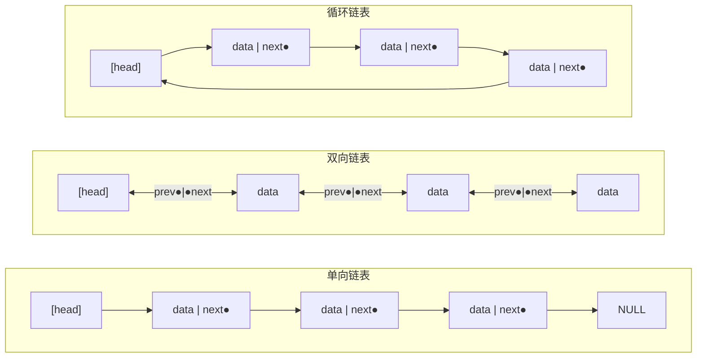
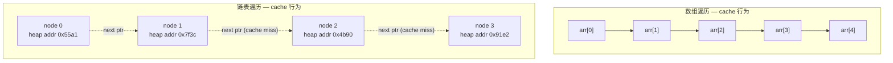
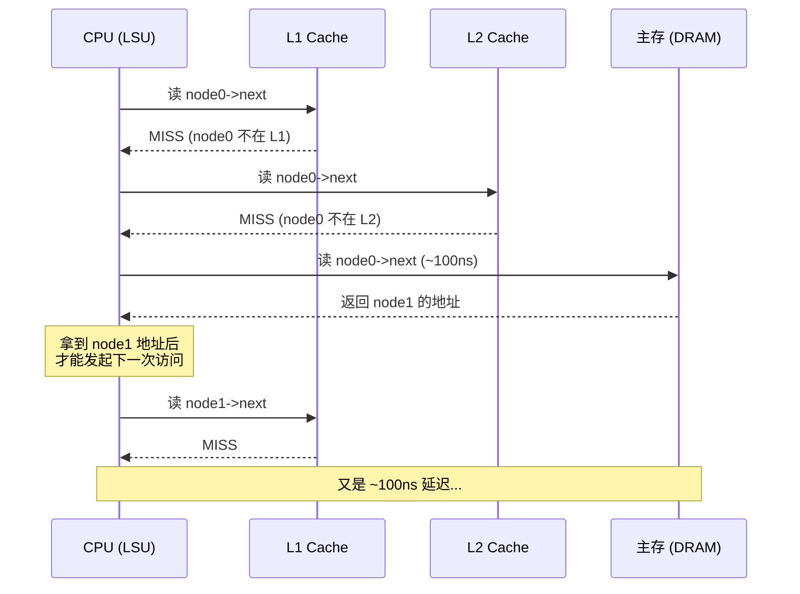
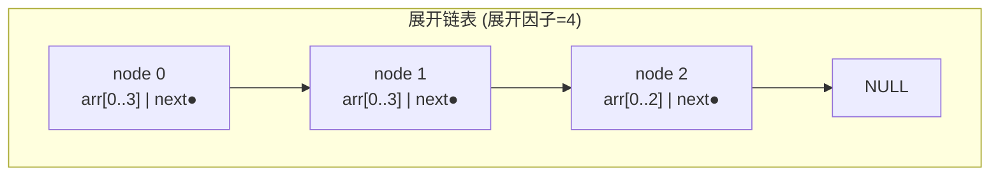
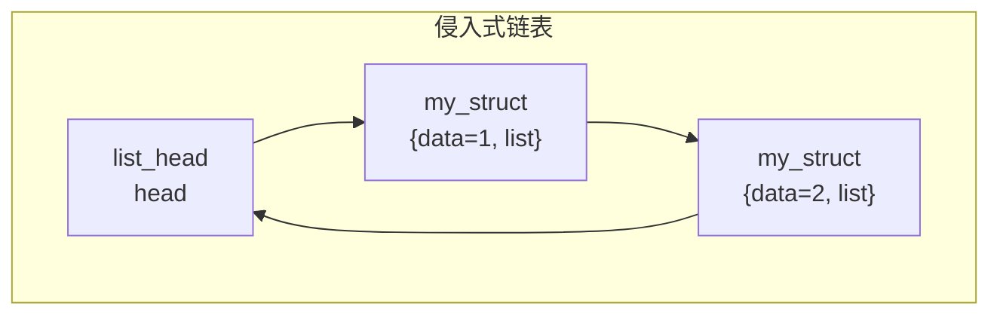

建议先阅读: [[D_容器_Container|容器概览]] — 理解连续存储 vs 节点存储的本质分歧。

---

## 原理

链表是节点存储（node-based storage）的原型。每个节点在堆上独立分配，通过指针将各节点串联起来。链表与数组的对立不仅仅是"插入 O(1) vs O(n)"的操作复杂度差异——更深层的分歧在于内存布局：连续（contiguous） vs 散列（non-contiguous）。

### 三种基本形态

| | 单向链表 | 双向链表 | 循环链表 |
|------|---------|---------|---------|
| 每个节点指针数 | 1 | 2 | 1 或 2 |
| 遍历方向 | 仅正向 | 正向 + 反向 | 正向（或双向） |
| 尾部操作 | 需遍历 O(n) | O(1)，tail 指针直达 | O(1) |
| 删除节点（已知节点） | 需前驱 O(n) | O(1)，通过 prev 找到前驱 | 同双向或单向 |



双向链表的两个指针赋予了对称性——可以从任意节点向两个方向遍历。Linux 内核大量使用双向循环链表（`struct list_head`），正是因为这种对称性允许在不知道"容器头部"的情况下执行节点删除和拼接。

### 操作的数学精确分析

设链表长度为 $n$，理解每个操作的精确代价需要区分三种场景：

**1. 查找第 $k$ 个元素**：

$$
\text{期望访问节点数} = \begin{cases}
\frac{n}{2} & \text{均匀随机查找} \\
k & \text{按位置查找}
\end{cases}
$$

时间复杂度 $O(n)$。每次 `cur = cur->next` 是一个指针追踪（pointer chase）——CPU 必须先完成当前节点的加载，才能知道下一个节点的地址。这个过程无法被流水线或分支预测隐藏。

**2. 插入（已知位置 `p`）**：

单向链表：两条赋值指令。
```
new->next = p->next;
p->next = new;
```
时间复杂度 $O(1)$，但前提是已持有 `p` 的地址。如果只知道"插到第 $k$ 个位置之后"，需要先 $O(k)$ 找到位置。

双向链表：四条赋值（同时更新前后节点的指针）。
```
new->prev = p;
new->next = p->next;
p->next->prev = new;
p->next = new;
```

在 CPU 指令层，这 4 条赋值是独立的 store 操作，彼此之间没有数据依赖——现代 CPU 的 store buffer 可以将它们合并后批量写入 L1 缓存。但如果 `p->next` 与 `new` 位于不同的 cache line，就涉及两条 cache line 的 ownership 获取。

**3. 删除（已知节点 `cur`）**：

双向链表的删除是真正的 $O(1)$（不需要前驱指针）：
```
cur->prev->next = cur->next;
cur->next->prev = cur->prev;
free(cur);
```

单向链表删除一个已知节点 $O(n)$，除非该节点就是 head（此时 $O(1)$）。这个不对称性是双向链表多付出的一个指针（多 8 字节）的核心收益。

### 数组 vs 链表：不是 O(n) vs O(1)

教科书通常用操作复杂度表来对比数组和链表。但这个视角遗漏了最重要的因素：**硬件行为**。

| 操作 | 数组 | 链表 | 实际差距 |
|------|:---:|:---:|------|
| 随机访问第 k 个 | $O(1)$ | $O(n)$ | 数组 ~1ns（L1 hit），链表 ~100ns * k（每次 node deref 可能是 miss） |
| 头部插入 | $O(n)$ | $O(1)$ | 数组需移动所有元素，链表只需改 head |
| 中间插入（已知位置） | $O(n)$ | $O(1)$ | 数组移动 n-k 个元素，链表改 2 条指针 |
| 顺序遍历 | $O(n)$ | $O(n)$ | 数组 ~0.03s/1千万（cache 全命中），链表 ~3s/1千万（cache miss） |



**数组的遍历开销**：一次 `arr[0]` 的 cache miss（加载一条 cache line），后续 15 次访问 `arr[1..15]` 全部命中 L1。

**链表的遍历开销**：每个 `node->next` 是一次指针追踪。由于每个节点在堆上独立分配（`malloc` 每次返回的地址不可预测），相邻节点大概率不在同一条 cache line 内。即使 `malloc` 恰巧分配了相邻地址（如从空闲链表的相邻 chunk 切割），缓存预取器（cache prefetcher）也无法识别"下一个地址"——因为下一个地址存储在 `node->next` 字段中，必须先用当前节点的地址加载 `next` 字段后才能知道。

### 内存碎片与 malloc 元数据开销

每个链表节点的 `malloc` 调用不仅分配了用户请求的字节，还附带 glibc malloc 的 chunk 元数据：

```
| prev_size (8B) | size+flags (8B) | node->data (4B) | node->next (8B) | padding (4B) | next_chunk |
|----------------|-----------------|-----------------|-----------------|--------------|------------|
|<------------- malloc chunk 元数据 16B ------------->|<---- 用户可见 16B --->|
```

对于一个存储 `int` 的单向链表节点（用户请求 `sizeof(SNode)` = 16 字节），`malloc` 实际消耗约 32 字节（16B 元数据 + 16B 用户数据，4B padding 对齐到 16B）。有效载荷效率 = 数据大小 / 总内存 = 4B / 32B = 12.5%。换句话说，一万个 `int` 元素的链表实际占用约 320KB，而等量的数组仅需 40KB。

此外，长期运行的链表经过多次插入和删除后，节点散布在堆的各处，形成**内存碎片**——空闲内存在总量上足够但无法合并为连续大块。当后续需要分配大数组时，即使总空闲内存远大于请求量，`malloc` 仍可能失败。

---

## 深入底层

### 硬件层面的指针追踪（Pointer Chasing）

链表遍历的性能瓶颈来自指针追踪（pointer chasing）。从 CPU 的角度看，遍历链表是这样的串行流水线：

```
1. 加载 node 的地址 (在 rax 中)
2. 读 [rax + 8] → 获取 node->next 的值
3. 读 [rax + 0] → 获取 node->data 的值 (如果需要)
4. 将 node->next 的值放入 rax，跳回步骤 1
```

步骤 2 和步骤 4 之间存在 RAW（Read After Write）数据依赖——CPU 无法在知道 `node->next` 的值之前开始下一次迭代的加载。这是不可流水化的串行依赖链（serial dependency chain）。

相比之下，数组遍历中，`arr[i+1]` 的地址可以直接从 `arr[i]` 的地址推算（只是加上 `sizeof(T)`），不需要加载任何指针。CPU 的预取器（prefetcher）可以提前几轮循环就将未来的 cache line 拉入缓存。

**内存级并行（Memory-Level Parallelism, MLP）**：现代 CPU 支持同时处理多个未完成的 cache miss。但在链表中，MLP 无法发挥作用——因为每次迭代依赖上一次迭代的结果，CPU 必须等待每个 `node->next` 加载完成后才能发起下一个加载。与之相反，数组遍历中 CPU 可以同时预取 `arr[i+1]`, `arr[i+2]`, `arr[i+3]` 等多条 cache line。



这个串行依赖链意味着：无论 CPU 有多快，链表遍历的速度受限于 DRAM 延迟（~100ns）乘以节点数。10 万个节点约需 10ms——而等量的数组遍历约需 30μs，差距约 300 倍。

### 展开链表（Unrolled Linked List）

展开链表是缓存友好性和链表灵活性的折中：每个节点不再只存一个元素，而是存一个小数组（如 8-16 个元素）。遍历一个节点（一次 cache miss）可连续访问节点内的多个元素（缓存命中），等价于将链表的"逐元素 miss"降为"每 8 个元素一次 miss"。



在 C++ 中，`std::deque` 使用了类似的思想——分块连续存储（block-based contiguous storage），但 deque 的块由中央控制结构管理，与展开链表的手动指针链接不同。详见 [[D_容器_Container|容器章节]]。

### XOR 链表（异或链表，XOR Linked List）

XOR 链表是一种仅使用一个指针字段存储双向链表中两个指针信息的技巧——利用异或运算（$\oplus$）的可逆性：

$$
\text{node.link} = \text{addr}(\text{prev}) \oplus \text{addr}(\text{next})
$$

正向遍历时，已知 `prev` 和 `node.link`，则 `next = prev ^ node.link`。反向遍历同理。每个节点少存一个指针（节省 8 字节），但代价是遍历时必须保留前一个节点的地址，且无法仅导航到"下一个"——必须同时持有当前节点和其前驱。

XOR 链表几乎从未在通用库中使用，主要原因：在 64 位系统上，把指针值当作整数做异或运算违反了类型安全，且在 GC 环境中移动节点会破坏异或一致性。但它的思想——用代数运算压缩信息——在有限内存的嵌入式系统中偶有应用。

### 侵入式链表（Intrusive Linked List）

Linux 内核不使用"节点包含数据"的链表，而使用侵入式链表——链表指针嵌入在节点结构体内部。

```c
// Linux 内核风格 (定义在 <linux/list.h>)
struct list_head {
    struct list_head *prev, *next;
};

struct my_struct {
    int data;
    struct list_head list;  // 嵌入的链节点，而非包含
};
```



侵入式链表的优势：
1. **零额外分配**：`list_head` 是结构体的字段，不需要单独的 `malloc` 给链节点
2. **通用性**：同一套 `list_add`、`list_del` 函数操作任何嵌入 `list_head` 的结构体（通过 `container_of` 宏从 `list_head*` 逆向获取外覆结构体指针）
3. **一个对象可在多个链表中**：嵌入多个 `list_head` 字段即可

代价是使用者必须理解 `container_of` 的偏移量技巧，且链表操作不直接返回数据指针（需手动 `container_of`）。

### 链表与安全：use-after-free 和 double-free

链表删除操作是 C 语言中悬垂指针（dangling pointer）的重灾区：

```c
// 危险的删除——释放后未断开链接
void dangerous_delete(DNode* cur) {
    cur->prev->next = cur->next;  // 先改链表
    cur->next->prev = cur->prev;
    free(cur);                    // 释放内存
    // 此时 cur 是悬垂指针，但链表中的其他节点可能不再引用它
}

// 更危险的场景——
DNode* victim = list->head;
list->head = victim->next;
free(victim);
// ... 稍后 ...
victim->data = 42;  // use-after-free! 写入已释放的内存
```

在链表操作中，释放节点前必须确保：(a) 已从链表中断开（所有指向它的指针已修改），(b) 不保留悬垂指针，(c) 不重复释放（double-free）。侵入式链表将内存管理交给外覆对象的创建者，在一定程度上避免了这个问题——链表操作不负责 `free`，只负责断开链接。

---

## 实现

### 单向链表（带大小缓存和尾部指针）

```c
#include <stdlib.h>

typedef struct SNode {
    int data;
    struct SNode* next;
} SNode;

typedef struct {
    SNode* head;
    SNode* tail;    // O(1) 尾部插入
    size_t size;
} SinglyLinkedList;

void sll_init(SinglyLinkedList* list) {
    list->head = list->tail = NULL;
    list->size = 0;
}

void sll_destroy(SinglyLinkedList* list) {
    while (list->head) {
        SNode* tmp = list->head;
        list->head = list->head->next;
        free(tmp);
    }
    list->tail = NULL;
    list->size = 0;
}

int sll_push_front(SinglyLinkedList* list, int value) {
    SNode* node = malloc(sizeof(SNode));
    if (!node) return -1;
    node->data = value;
    node->next = list->head;
    list->head = node;
    if (!list->tail) list->tail = node;  // 首个元素，tail 也指向它
    list->size++;
    return 0;
}

int sll_push_back(SinglyLinkedList* list, int value) {
    SNode* node = malloc(sizeof(SNode));
    if (!node) return -1;
    node->data = value;
    node->next = NULL;
    if (list->tail) {
        list->tail->next = node;
        list->tail = node;
    } else {
        list->head = list->tail = node;   // 空链表的首个元素
    }
    list->size++;
    return 0;
}

int sll_pop_front(SinglyLinkedList* list) {
    if (!list->head) return -1;
    SNode* tmp = list->head;
    list->head = list->head->next;
    if (!list->head) list->tail = NULL;  // 链表变空，tail 也置 NULL
    free(tmp);
    list->size--;
    return 0;
}

// 原地反转（迭代）
void sll_reverse(SinglyLinkedList* list) {
    SNode *prev = NULL, *cur = list->head;
    list->tail = list->head;         // 原 head 变新 tail
    while (cur) {
        SNode* nxt = cur->next;
        cur->next = prev;
        prev = cur;
        cur = nxt;
    }
    list->head = prev;
}
```

### 双向链表（含哨兵节点）

哨兵节点（sentinel node / dummy node）是一个不存数据、只作为链表头尾标志的节点。使用哨兵可以消除大量 `NULL` 检查，将边界情况统一化：

```c
#include <stdlib.h>

typedef struct DNode {
    int data;
    struct DNode* prev;
    struct DNode* next;
} DNode;

typedef struct {
    DNode sentinel;    // 哨兵：sentinel.next = 真头，sentinel.prev = 真尾
    size_t size;
} DoublyLinkedList;

void dll_init(DoublyLinkedList* list) {
    list->sentinel.prev = &list->sentinel;
    list->sentinel.next = &list->sentinel;
    list->size = 0;
}

// 哨兵链表无需区分空/非空——统一在哨兵后插入
// 在 node 之前插入 new_node
static void dll_insert_before(DNode* node, DNode* new_node) {
    new_node->next = node;
    new_node->prev = node->prev;
    node->prev->next = new_node;
    node->prev = new_node;
}

int dll_push_back(DoublyLinkedList* list, int value) {
    DNode* node = malloc(sizeof(DNode));
    if (!node) return -1;
    node->data = value;
    dll_insert_before(&list->sentinel, node);  // 插到哨兵前 = 尾部
    list->size++;
    return 0;
}

int dll_push_front(DoublyLinkedList* list, int value) {
    DNode* node = malloc(sizeof(DNode));
    if (!node) return -1;
    node->data = value;
    dll_insert_before(list->sentinel.next, node);  // 插到真头前 = 头部
    list->size++;
    return 0;
}

// 从链表中摘除节点（不释放内存）
static void dll_unlink(DNode* node) {
    node->prev->next = node->next;
    node->next->prev = node->prev;
}

int dll_remove(DoublyLinkedList* list, DNode* node) {
    if (node == &list->sentinel) return -1;  // 不能删除哨兵
    dll_unlink(node);
    free(node);
    list->size--;
    return 0;
}

void dll_destroy(DoublyLinkedList* list) {
    while (list->sentinel.next != &list->sentinel)
        dll_remove(list, list->sentinel.next);
}
```

哨兵设计的核心收益：`dll_init` 后链表就处于"空但结构完备"状态（哨兵自环），`dll_insert_before` 对所有情况（空链表、头、尾、中间）使用同一段代码——没有 if-else 分支。

### 快慢指针 --- 环检测与中点查找

```c
typedef struct ListNode {
    int data;
    struct ListNode* next;
} ListNode;

// Floyd's cycle detection (tortoise and hare)
int has_cycle(ListNode* head) {
    ListNode *slow = head, *fast = head;
    while (fast && fast->next) {
        slow = slow->next;
        fast = fast->next->next;
        if (slow == fast) return 1;   // 相遇 = 有环
    }
    return 0;
}

// 确定环的入口: Floyd 算法的第二阶段
// 相遇后，slow 退回 head，两者同速度前进，再次相遇即环入口
ListNode* detect_cycle_entry(ListNode* head) {
    ListNode *slow = head, *fast = head;
    while (fast && fast->next) {
        slow = slow->next;
        fast = fast->next->next;
        if (slow == fast) {              // 第一阶段：确认有环
            slow = head;                  // 第二阶段：slow 回起点
            while (slow != fast) {
                slow = slow->next;
                fast = fast->next;        // 两者同速
            }
            return slow;                  // 再次相遇 = 环入口
        }
    }
    return NULL;
}

ListNode* find_middle(ListNode* head) {
    ListNode *slow = head, *fast = head;
    while (fast && fast->next) {
        slow = slow->next;
        fast = fast->next->next;
    }
    return slow;  // fast 到达末尾时，slow 正好到中间
}
```

Floyd 算法的数学保证基于模运算：设非环部分长度为 $a$，环长度为 $b$。第一阶段相遇时，fast 比 slow 多走了 $n \cdot b$ 步（恰好多走整数圈）。slow 从 head 到相遇点走了 $s$ 步，fast 走了 $2s$ 步，且 $2s - s = n \cdot b$，即 $s = n \cdot b$。slow 在环内，距环入口为 $s - a$。第二阶段 slow 从 head 再走 $a$ 步到达环入口，fast 从相遇点走 $a$ 步（$(s - a) + a = s = n \cdot b$，即刚好到达环入口），两者同时抵达。因此再次相遇位置就是环入口。

---

## 各语言标准库对比

| 语言 | 单向链表 | 双向链表 | 说明 |
|------|----------|----------|------|
| C | 无（手写） | 无（手写） | 内核提供侵入式 `list_head` |
| C++ | `std::forward_list` | `std::list` | `std::list::size()` 在 C++11 前为 O(n) |
| Java | 无 | `LinkedList` | 实现 `Deque` 接口，可用作队列 |
| Python | 无 | `collections.deque` | 用双向链表实现，O(1) 两端操作 |
| Rust | 无（`LinkedList` 已标记 deprecated 倾向） | `LinkedList` | Rust 社区推荐用 `VecDeque` |
| Go | 无 | `container/list` | 侵入式设计，存储 `interface{}` |

---

## 应用场景

- **LRU 缓存**：双向链表 + 哈希表。哈希表将 key 映射到链表节点——O(1) 定位，链表将节点移到头部 O(1)。淘汰时删除尾部节点。详见 [[N_哈希表_HashTable|哈希表]]
- **空闲块管理器**：`malloc` 的空闲链表。操作系统和内存分配器用双向链表或循环链表管理空闲物理页框（free page list）。详见 [[../操作系统/G_内存分配器|内存分配器]]
- **多项式表示**：每个节点存储一个项（系数 + 指数），按指数排序。加法操作即归并两个有序链表。O(m+n) 而非 O(mn)
- **图的邻接表**：每个顶点的邻接顶点列表。在邻接表中使用链表（而非 `vector`）允许 O(1) 增量插入边。详见 [[S_图_Graph|图]]

---

## 练习

| 题号 | 题目 | 说明 |
|------|------|------|
| [206](https://leetcode.cn/problems/reverse-linked-list/) | 反转链表 | 迭代/递归双解 |
| [141](https://leetcode.cn/problems/linked-list-cycle/) | 环形链表 | Floyd 快慢指针 |
| [21](https://leetcode.cn/problems/merge-two-sorted-lists/) | 合并两个有序链表 | 归并思想 |
| [160](https://leetcode.cn/problems/intersection-of-two-linked-lists/) | 相交链表 | 双指针消除长度差 |

## 动手实验

| 编号 | 题目 | 说明 |
|:----:|------|------|
| E1 | 链表 vs 数组遍历硬件计时 | 构建 1 千万个 int 元素，分别用链表和数组顺序遍历并累加求和。用 `perf stat -e cycles,instructions,cache-references,cache-misses` 统计两者的 IPC（instructions per cycle）和 cache miss 率。验证数组 IPC 接近 2（超标量流水线满负荷），链表 IPC 接近 0.1（停顿在等待 DRAM） |
| E2 | malloc 元数据开销测量 | 分配 N=100000 个链表节点并记录每个节点的地址。计算相邻节点之间的地址差分布——展示 `malloc` 分配的不可预测性。再通过 `malloc_usable_size` 获取每个节点实际占用的堆内存（包括元数据），与 `sizeof(SNode)` 对比 |
| E3 | 哨兵设计 vs 非哨兵设计的边界条件统计 | 分别用哨兵链表和无哨兵链表实现 push_front/push_back/pop_front/pop_back 的完整测试（含空链表、单元素、多元素边界情况）。统计两版代码中 `if (head == NULL)` 类条件判断的数量 |
| E4 | 展开链表构建与遍历 | 实现展开链表（展开因子 8），与普通链表同时插入 100 万个元素，然后顺序遍历累加求和。计时对比，用 `perf stat` 统计 cache miss |
