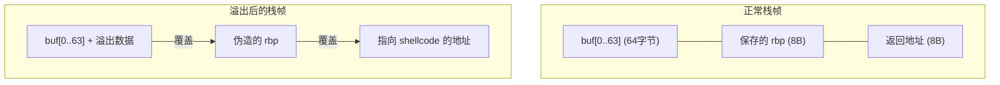
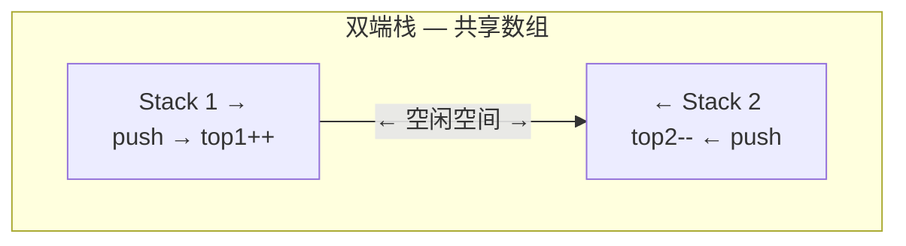
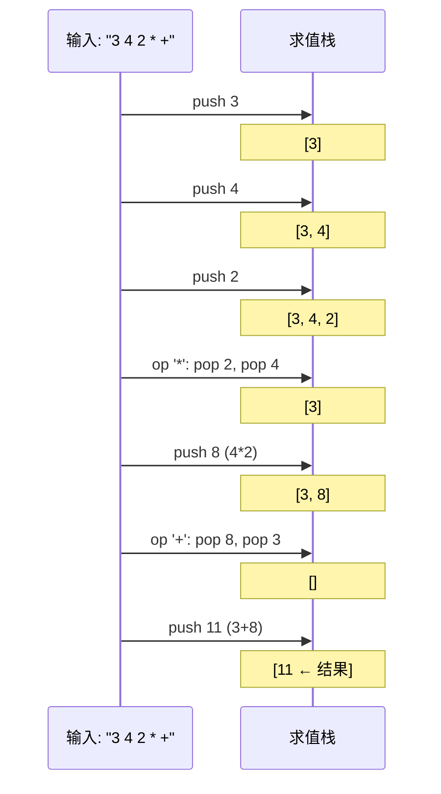

建议先阅读: [[D_容器_Container|容器概览]] — 理解栈的底层存储（数组 vs 链表）和扩容机制。

---

## 原理

栈（Stack）是受限的线性数据结构——所有操作均发生在同端（栈顶），遵循后进先出（LIFO: Last In, First Out）。这种"单向开口"的约束看似限制了灵活性，实则赋予了栈一种精确的时序语义：最近入栈的数据最优先被处理。

| 操作 | 描述 | 时间复杂度 |
|------|------|:---------:|
| `push(x)` | 将 x 压入栈顶 | $O(1)$ |
| `pop()` | 弹出栈顶元素 | $O(1)$ |
| `top()` | 不弹出，只读栈顶 | $O(1)$ |
| `empty()` | 是否为空 | $O(1)$ |
| `size()` | 元素个数 | $O(1)$ |

### 栈的物理实现

栈作为抽象数据类型，有两种物理实现方式。选择取决于对容量、内存开销和缓存行为的需求。

**数组实现**（连续存储）：
- 在内存中预留一块连续区域，用 `top` 索引标记栈顶
- 扩容策略见 [[D_容器_Container|容器章节]] 的均摊分析
- 缓存友好——push/pop 都是顺序访问栈顶附近的内存

**链表实现**（节点存储）：
- 无容量上限，每个节点单独 `malloc`
- 每次 push 带有堆分配开销（~50-200ns），pop 有释放开销
- 由于只在头部操作，链表的"指针追踪"问题比完整链表遍历轻微——但连续 10 万次 push/pop 的累计堆开销远超数组版

### 硬件级栈：x86-64 调用栈

栈不仅是抽象数据结构，更是 CPU 硬件原生支持的核心机制。x86-64 架构通过 `rsp`（栈指针寄存器）和 `rbp`（基址指针寄存器）提供硬件级栈支持：

```
高地址
┌─────────────────┐
│   main 的栈帧   │  ← rbp (main 的基址指针)
│  (局部变量等)   │
├─────────────────┤
│  返回地址       │  ← call 指令推入的 rip, 8 字节
├─────────────────┤
│  foo 的栈帧     │  ← rbp (foo 的基址指针) ← rsp
│  int a = 3      │  [rbp-4]
│  int b = 5      │  [rbp-8]
│  char buf[32]   │  [rbp-40]
└─────────────────┘
低地址
```

```nasm
; C 代码: int add(int a, int b) { return a + b; }

add:
    push    rbp              ; 保存调用者的 rbp
    mov     rbp, rsp         ; 建立自己的栈帧基址
    mov     DWORD PTR [rbp-4], edi   ; 参数 a (通过 edi 传入)
    mov     DWORD PTR [rbp-8], esi   ; 参数 b (通过 esi 传入)
    mov     eax, DWORD PTR [rbp-4]
    add     eax, DWORD PTR [rbp-8]   ; eax = a + b
    pop     rbp              ; 恢复调用者的 rbp
    ret                      ; 弹出返回地址并跳转
```

`call` 指令等价于 `push rip; jmp target`。`ret` 指令等价于 `pop rip`。这两个指令在硬件层面由 CPU 的返回栈缓冲器（Return Stack Buffer, RSB）加速——RSB 是 CPU 内部的一个微型硬件栈，专门缓存返回地址，使得 `ret` 指令可以达到接近 0 周期的延迟。

**栈溢出（Stack Overflow）**：

栈段的大小受操作系统限制（Linux 默认 8MB，`ulimit -s`）。以下场景触发栈溢出：
- 递归过深（如无终止条件的递归）
- 局部变量过大（如在栈上声明 `int arr[1000000]`，占 4MB，超出剩余栈空间）
- 无限递归相互调用（A 调 B，B 调 A）

栈溢出的后果是 **SIGSEGV**——CPU 访存时 MMU 检测到访问地址超出栈的映射范围，硬件触发 page fault，内核检查发现地址不合法后向进程发送段错误信号。

**栈溢出利用（Stack Smashing）**：

在安全领域，栈溢出是最经典的攻击向量。当程序向栈上的局部缓冲区写入超出其大小的数据时，溢出数据会覆盖更高的栈帧内容——包括返回地址。攻击者构造恶意输入，使返回地址指向其注入的 shellcode 或 ROP 链中的 gadget。

```c
// 典型的栈溢出漏洞
void vulnerable(char* input) {
    char buf[64];
    strcpy(buf, input);  // 如果 input 长度 > 64，覆盖返回地址
}
```



现代防御：栈 canary（返回地址前放随机值，`ret` 前检查）、W^X（栈页不可执行）、ASLR（随机化地址）、影子栈（shadow stack，硬件/软件维护一份返回地址副本用于验证）。

---

## 深入底层

### 双端栈（Two Stacks in One Array）

在固定大小的内存区域中，两个栈可以从两端向中间生长，共享同一块内存：



```c
typedef struct {
    int* data;
    size_t capacity;
    size_t top1;    // Stack 1: 从左向右增长
    size_t top2;    // Stack 2: 从右向左增长
} TwoStacks;

// push 到栈 1
int ts_push1(TwoStacks* ts, int value) {
    if (ts->top1 > ts->top2) return -1;  // 两栈碰撞
    ts->data[ts->top1++] = value;
    return 0;
}

// push 到栈 2
int ts_push2(TwoStacks* ts, int value) {
    if (ts->top1 > ts->top2) return -1;
    ts->data[ts->top2--] = value;  // 索引递减
    return 0;
}
```

两栈碰撞的条件是 `top1 > top2`。这种设计最大化了固定内存的利用率——当 Stack 1 空闲多、Stack 2 空闲少时，两者的增长空间会动态调整。这比两块独立固定大小的数组更灵活，且避免了 `realloc` 的开销。

### 单调栈（Monotonic Stack）

单调栈是栈的最强大变体之一——它维护栈内元素的单调性（递增或递减），通过 pop 掉破坏单调性的元素来找到"下一个更大/更小"的位置。

**问题**：给定数组 $A[0..n-1]$，对每个位置 $i$，找出右侧第一个比 $A[i]$ 大的元素的下标。

```
例: A = [73, 74, 75, 71, 69, 72, 76, 73]

i=0 (73): 栈空，push 0
i=1 (74): A[1]=74 > A[栈顶=0]=73 → 答案[0]=1, pop 0, push 1
i=2 (75): A[2]=75 > A[栈顶=1]=74 → 答案[1]=2, pop 1, push 2
i=3 (71): A[3]=71 < A[栈顶=2]=75 → 栈单调递减，直接 push 3
i=4 (69): push 4
i=5 (72): A[5]=72 > A[栈顶=4]=69 → 答案[4]=5, pop 4
           A[5]=72 > A[栈顶=3]=71 → 答案[3]=5, pop 3, push 5
i=6 (76): A[6]=76 逐个弹出 5,2 → 答案[5]=6, 答案[2]=6, push 6
i=7 (73): A[7]=73 < A[栈顶=6]=76 → push 7
```

```c
// 单调递减栈：找右侧第一个更大元素
void next_greater(const int* A, int n, int* result) {
    int* stk = malloc(n * sizeof(int));
    int top = 0;
    for (int i = 0; i < n; i++) {
        while (top > 0 && A[i] > A[stk[top - 1]]) {
            result[stk[--top]] = i;   // 当前元素是栈顶的"第一个更大"
        }
        stk[top++] = i;
    }
    while (top > 0)
        result[stk[--top]] = -1;      // 无更大元素
    free(stk);
}
```

时间复杂度 $O(n)$ —— 每个元素入栈一次、出栈至多一次，总操作数不超过 $2n$。这是均摊分析在栈上的典型应用。

单调栈揭示了一个深层原理：需要比较"前后元素关系"的问题，往往可以通过维护一个单调序列来避免 $O(n^2)$ 的朴素扫描。从直方图最大矩形到每日温度，单调栈是这类问题的统一解法框架。

---

## 实现

### 基于动态数组的栈

```c
#include <stdlib.h>

typedef struct {
    int* data;
    size_t capacity;
    size_t top;    // 指向下一个空位，也是元素个数
} ArrayStack;

void as_init(ArrayStack* s) {
    s->data = NULL;
    s->capacity = 0;
    s->top = 0;
}

void as_destroy(ArrayStack* s) {
    free(s->data);
    s->data = NULL;
    s->capacity = s->top = 0;
}

static int as_expand(ArrayStack* s) {
    size_t new_cap = s->capacity == 0 ? 8 : s->capacity * 2;
    int* new_data = realloc(s->data, new_cap * sizeof(int));
    if (!new_data) return -1;
    s->data = new_data;
    s->capacity = new_cap;
    return 0;
}

int as_push(ArrayStack* s, int value) {
    if (s->top >= s->capacity)
        if (as_expand(s) != 0) return -1;
    s->data[s->top++] = value;
    return 0;
}

int as_pop(ArrayStack* s) {
    if (s->top == 0) return -1;
    s->top--;
    return 0;
}

int as_top(const ArrayStack* s, int* out) {
    if (s->top == 0) return -1;
    *out = s->data[s->top - 1];
    return 0;
}
```

### 基于链表的栈

链表版栈所有操作均在头部——单向链表的 `push_front` + `pop_front`：

```c
#include <stdlib.h>

typedef struct SNode {
    int data;
    struct SNode* next;
} SNode;

typedef struct {
    SNode* head;
    size_t count;
} LinkedStack;

void ls_init(LinkedStack* s) { s->head = NULL; s->count = 0; }

void ls_destroy(LinkedStack* s) {
    while (s->head) {
        SNode* tmp = s->head;
        s->head = s->head->next;
        free(tmp);
    }
    s->count = 0;
}

int ls_push(LinkedStack* s, int value) {
    SNode* node = malloc(sizeof(SNode));
    if (!node) return -1;
    node->data = value;
    node->next = s->head;
    s->head = node;
    s->count++;
    return 0;
}

int ls_pop(LinkedStack* s) {
    if (!s->head) return -1;
    SNode* tmp = s->head;
    s->head = s->head->next;
    free(tmp);
    s->count--;
    return 0;
}
```

### 最小栈（MinStack）—— 用差值压缩空间

常规 MinStack 用两个同步栈（一个存数据，一个存前缀最小值）。更紧凑的做法是只存差值：栈内不存原始值，而存"当前值与当前最小值的差值"。

```c
// 差值法：栈存储 value - min_sofar。通过差值的正负恢复 value 和 min
typedef struct {
    long* diff;      // value - min_sofar (可能需要 long 防溢出)
    int* min_val;    // 栈顶元素对应的当前最小值
    size_t capacity;
    size_t top;
} MinStackDiff;
```

此方案将空间从 2n 降至 n+1（只需 `diff` 数组和当前 `min_val` 变量），但每个 push 都涉及一次减法计算和溢出判断。常规的双栈法（空间 2n）因其简单性和无溢出风险，在实际工程中更为常用。

### 表达式求值

#### 中缀 → 后缀（调度场算法）

```c
int precedence(char op) {
    if (op == '+' || op == '-') return 1;
    if (op == '*' || op == '/') return 2;
    return 0;
}

// 将中缀表达式转为后缀（RPN）表示
void infix_to_postfix(const char* expr, char* output) {
    int len = strlen(expr);
    char* stk = malloc(len);
    int top = 0, out_idx = 0;
    for (int i = 0; i < len; i++) {
        char ch = expr[i];
        if (ch >= '0' && ch <= '9') {
            output[out_idx++] = ch;
        } else if (ch == '(') {
            stk[top++] = ch;
        } else if (ch == ')') {
            while (top > 0 && stk[top - 1] != '(')
                output[out_idx++] = stk[--top];
            top--;  // 丢弃 '('
        } else {  // 运算符
            while (top > 0 && precedence(stk[top - 1]) >= precedence(ch))
                output[out_idx++] = stk[--top];
            stk[top++] = ch;
        }
    }
    while (top > 0)
        output[out_idx++] = stk[--top];
    output[out_idx] = '\0';
    free(stk);
}
```

#### 后缀表达式求值

```c
// 计算后缀表达式（操作数为单个数字 0-9）
int eval_postfix(const char* postfix) {
    int len = strlen(postfix);
    int* stk = malloc(len * sizeof(int));
    int top = 0;
    for (int i = 0; i < len; i++) {
        char ch = postfix[i];
        if (ch >= '0' && ch <= '9') {
            stk[top++] = ch - '0';
        } else {
            int b = stk[--top];  // 弹出右操作数
            int a = stk[--top];  // 弹出左操作数
            switch (ch) {
                case '+': stk[top++] = a + b; break;
                case '-': stk[top++] = a - b; break;
                case '*': stk[top++] = a * b; break;
                case '/': stk[top++] = a / b; break;
            }
        }
    }
    int result = stk[0];
    free(stk);
    return result;
}
```



---

## 各语言标准库对比

| 语言 | 栈类型 | 说明 |
|------|--------|------|
| C | 无（手写） | 标准库不提供容器 |
| C++ | `std::stack<T>` | 适配器，默认底层 `std::deque` |
| Java | `ArrayDeque<T>` | 推荐；`Stack` 是遗留类 |
| Python | `list` | `append()` / `pop()` |
| Rust | `Vec<T>` | `push()` / `pop()` |
| Go | 无内置 | 用 slice 模拟：`stack = append(stack, x)` |

---

## 应用场景

- **函数调用**：x86-64 的硬件栈。每次函数调用（`call` 指令）自动 push 返回地址，返回时（`ret`）自动 pop。C++ 异常处理中的栈展开（stack unwinding）沿调用链逐帧 destroy 局部对象
- **表达式求值**：编译器将中缀表达式转后缀（RPN），用栈求值。计算器、SQL 查询引擎的表达式树求值均依赖此模型
- **括号匹配**：编译器/编辑器的语法验证。左括号 push，右括号时检查栈顶是否匹配。栈空但仍有右括号 = 多余右括号；结束时栈非空 = 多余左括号
- **DFS 非递归**：手动用显式栈替代递归，避免系统调用栈的深度限制。详见 [[S_图_Graph|图的 DFS]]
- **撤销（Undo）**：编辑器将每个编辑操作推入栈。Ctrl-Z = pop 栈顶操作并执行反向操作。Text Editor 的 Undo/Redo 用两个栈（undo stack + redo stack）
- **浏览器的前进/后退**：两个栈分别维护后退历史与前进历史。每次跳转将当前页面推入后退栈，清空前进栈

---

## 练习

| 题号 | 题目 | 说明 |
|------|------|------|
| [20](https://leetcode.cn/problems/valid-parentheses/) | 有效的括号 | 栈匹配 |
| [150](https://leetcode.cn/problems/evaluate-reverse-polish-notation/) | 逆波兰表达式求值 | 后缀表达式 |
| [155](https://leetcode.cn/problems/min-stack/) | 最小栈 | 辅助栈 |
| [739](https://leetcode.cn/problems/daily-temperatures/) | 每日温度 | 单调栈 |

## 动手实验

| 编号 | 题目 | 说明 |
|:----:|------|------|
| E1 | 中缀→后缀→求值流水线 | 手写中缀表达式 `(3+4)*(5-2)/2`，先后通过调度场算法转后缀和求值，验证结果。对比直接用 C 的运算符优先级计算，确认两者结果一致 |
| E2 | 递归深度 vs 手动栈 | 实现深度优先遍历二叉树：(a) 递归方式，(b) 手动栈方式。对深度为 100000 的退化树（链）分别运行，记录递归的栈溢出阈值和手动栈的无限制特性 |
| E3 | 单调栈图形化验证 | 随机生成长度 100 的数组 A，用单调递减栈计算每个位置的"右侧第一个更大元素"。打印 A 和结果数组，人工检查：对每个 i，`A[result[i]]` 确实是 i 右侧第一个 > A[i] 的元素 |
