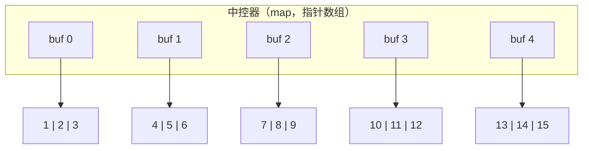

---
数据结构教程 — 队列 (Queue)
---

##  章节概述

队列（Queue）是一种受限的线性数据结构，它遵循"先进先出"（FIFO, First In First
Out）的原则。元素只能从一端（队尾）插入，从另一端（队首）删除。

队列在计算机科学中应用广泛：CPU任务调度、IO缓冲区、广度优先搜索（BFS）、
消息队列、打印任务队列、生产者消费者模型等。

>  **底层实现参考**：如果需要深入理解本章数据结构的底层实现（纯C手写、内存布局、指针操作），请参阅 [[../../C语言深化教程/3数据结构/04_队列|C语言教程: 队列]]。C教程侧重手动实现与内存本质，本教程侧重STL使用与算法优化，两者互补。

---
###  第一节: 基础语法 + 计算机底层原理
---

1.1 队列的基本概念
--------------------

核心操作：
- enqueue (push): 在队尾插入元素
- dequeue (pop): 删除队首元素
- front: 获取队首元素
- back: 获取队尾元素
- empty: 判断队列是否为空
- size: 返回队列中元素个数

最基础的队列使用示例：

```pseudocode
FUNCTION main()
    q = NEW Queue()

    // 入队
    q.push(10)
    q.push(20)
    q.push(30)

    // 访问队首和队尾
    PRINT "队首: ", q.front()    // 10
    PRINT "队尾: ", q.back()     // 30

    // 出队
    q.pop()
    PRINT "出队后队首: ", q.front()  // 20

    // 大小
    PRINT "队列大小: ", q.size()

    // 遍历并清空
    WHILE NOT q.empty():
        PRINT q.front(), " "
        q.pop()
    END WHILE
    PRINT newline
END FUNCTION
```

---
**实现练习**: 用 C 或 C++ 自行实现上述结构。完成后与 AI 对话检查正确性。
- C 语言底层参考: [[../../c语言教程/3数据结构/04_队列]]
- C++ STL 参考: [[../../cpp教程/容器库/05_queue]]
---

1.2 队列的底层原理：数组实现 vs 链表实现
-----------------------------------------------

数组实现（循环队列）：
- 避免假溢出（假溢出指数组前面有空位但tail到了末尾）
- 通过取模运算实现循环

```pseudocode
// 假溢出示意
// 队列 [_, _, _, _, _, _, _, _]
//       ↑              ↑
//      front          tail
// 前面都出队了，但tail已到末尾，无法再入队
// 循环队列解决此问题：tail重新回到前面

CLASS CircularQueue(MAX_SIZE):
    data = NEW ARRAY[MAX_SIZE]
    head = 0     // 队首位置
    tail = 0     // 队尾位置（下一个插入的位置）
    count = 0    // 当前元素个数

FUNCTION push(value):
    IF count >= MAX_SIZE:
        THROW "队列已满"
    END IF
    data[tail] = value
    tail = (tail + 1) MOD MAX_SIZE
    count = count + 1
END FUNCTION

FUNCTION pop():
    IF count == 0:
        THROW "队列为空"
    END IF
    head = (head + 1) MOD MAX_SIZE
    count = count - 1
END FUNCTION

FUNCTION front():
    IF count == 0:
        THROW "队列为空"
    END IF
    RETURN data[head]
END FUNCTION

FUNCTION empty():
    RETURN count == 0
END FUNCTION

FUNCTION size():
    RETURN count
END FUNCTION

FUNCTION print():
    idx = head
    FOR i = 0 TO count - 1:
        PRINT data[idx], " "
        idx = (idx + 1) MOD MAX_SIZE
    END FOR
    PRINT "(size=", count, ")"
END FUNCTION

FUNCTION main()
    cq = NEW CircularQueue(5)

    cq.push(10)
    cq.push(20)
    cq.push(30)
    cq.print()

    cq.pop()
    cq.pop()
    cq.push(40)
    cq.push(50)
    cq.push(60)
    cq.print()

    PRINT "队首: ", cq.front()
END FUNCTION
```

---
**实现练习**: 用 C 或 C++ 自行实现上述结构。完成后与 AI 对话检查正确性。
- C 语言底层参考: [[../../c语言教程/3数据结构/04_队列]]
- C++ STL 参考: [[../../cpp教程/容器库/05_queue]]
---

链表实现队列：

```pseudocode
STRUCT Node:
    data: T
    next: pointer to Node
END STRUCT

CLASS LinkedQueue:
    head = NULL   // 队首（出队端）
    tail = NULL   // 队尾（入队端）
    count = 0

FUNCTION destructor():
    WHILE head != NULL:
        temp = head
        head = head.next
        DELETE temp
    END WHILE
END FUNCTION

FUNCTION push(value):
    new_node = NEW Node(value)
    IF tail != NULL:
        tail.next = new_node
    ELSE:
        head = new_node
    END IF
    tail = new_node
    count = count + 1
END FUNCTION

FUNCTION pop():
    IF head == NULL:
        THROW "队列为空"
    END IF
    temp = head
    head = head.next
    IF head == NULL:
        tail = NULL
    END IF
    DELETE temp
    count = count - 1
END FUNCTION

FUNCTION front():
    IF head == NULL:
        THROW "队列为空"
    END IF
    RETURN head.data
END FUNCTION

FUNCTION back():
    IF tail == NULL:
        THROW "队列为空"
    END IF
    RETURN tail.data
END FUNCTION

FUNCTION empty():
    RETURN count == 0
END FUNCTION

FUNCTION size():
    RETURN count
END FUNCTION

FUNCTION main()
    lq = NEW LinkedQueue()

    FOR i = 1 TO 5:
        lq.push(i * 10)
    END FOR
    PRINT "队首: ", lq.front(), ", 队尾: ", lq.back()

    WHILE NOT lq.empty():
        PRINT lq.front(), " "
        lq.pop()
    END WHILE
    PRINT newline
END FUNCTION
```

---
**实现练习**: 用 C 或 C++ 自行实现上述结构。完成后与 AI 对话检查正确性。
- C 语言底层参考: [[../../c语言教程/3数据结构/04_队列]]
- C++ STL 参考: [[../../cpp教程/容器库/05_queue]]
---

1.3 双端队列（Deque）的底层原理
------------------------------------

deque（double-ended queue）是两端都可以插入和删除的队列。标准实现通常
采用"分段连续存储"结构：



每个缓冲区（buffer）是固定大小的连续数组。中控器维护所有缓冲区的指针。
当在一端插入时，如果当前缓冲区已满，就分配一个新的缓冲区。


---
###  第二节: 实现变体
---

2.1 队列容器适配器
-------------------------------------

队列可以基于不同的底层容器实现：

```pseudocode
FUNCTION main()
    // 默认底层容器：双端队列（deque）
    q1 = NEW Queue()

    // 使用链表作为底层容器
    q2 = NEW Queue(container = LinkedList)

    // 从已有容器构造
    ARRAY deq = [1, 2, 3, 4, 5]
    q3 = NEW Queue(deq)  // 1在队首，5在队尾

    // 核心操作
    q = NEW Queue()
    q.push(100)
    q.push(200)

    PRINT "size: ", q.size()
    PRINT "front: ", q.front()  // 100
    PRINT "back: ", q.back()    // 200

    q.pop()  // 弹出队首
    PRINT "after pop, front: ", q.front()  // 200

    // 交换
    other = NEW Queue()
    other.push(999)
    SWAP(q, other)

    // 关系运算符（逐个比较元素）
    a = NEW Queue()
    b = NEW Queue()
    a.push(1); a.push(2)
    b.push(1); b.push(2)
    PRINT "a == b: ", (a == b)      // TRUE
    a.push(3)
    b.push(4)
    PRINT "a < b: ", (a < b)        // TRUE (1,2,3 < 1,2,4)
END FUNCTION
```

---
**实现练习**: 用 C 或 C++ 自行实现上述结构。完成后与 AI 对话检查正确性。
- C 语言底层参考: [[../../c语言教程/3数据结构/04_队列]]
- C++ STL 参考: [[../../cpp教程/容器库/05_queue]]
---

2.2 双端队列（Deque）
-------------------------------

```pseudocode
FUNCTION main()
    dq = NEW Deque()
    dq.push_back(10)
    dq.push_back(20)
    dq.push_back(30)

    // 两端操作
    dq.push_front(5)
    dq.push_back(35)
    dq.pop_front()
    dq.pop_back()

    // 插入（deque支持随机访问，但中间插入较慢）
    dq.insert(1, 15)
    dq.insert(LENGTH(dq) - 1, 25)

    // 随机访问
    PRINT "dq[0]: ", dq[0]
    PRINT "dq.at(2): ", dq.at(2)

    // resize
    dq.resize(10, -1)  // 扩展到10个，新元素填-1
    dq.resize(5)       // 缩小到5个

    // 遍历
    FOR EACH x IN dq:
        PRINT x, " "
    END FOR
    PRINT newline

    // 算法支持
    dq.sort()
    it = dq.find(25)
END FUNCTION
```

---
**实现练习**: 用 C 或 C++ 自行实现上述结构。完成后与 AI 对话检查正确性。
- C 语言底层参考: [[../../c语言教程/3数据结构/04_队列]]
- C++ STL 参考: [[../../cpp教程/容器库/05_queue]]
---

2.3 优先队列（Priority Queue）的队列视角
----------------------------------------------

```pseudocode
STRUCT Patient:
    name: string
    severity: integer       // 病情严重程度（越大越优先）
    arrival_time: integer   // 到达时间
END STRUCT

// 比较器：严重程度高者优先；相同则先到者优先
FUNCTION compare_patient(a, b):
    IF a.severity != b.severity:
        RETURN a.severity < b.severity
    END IF
    RETURN a.arrival_time > b.arrival_time
END FUNCTION

FUNCTION main()
    er_queue = NEW PriorityQueue(compare_patient)

    er_queue.push(Patient("张三", 5, 1))
    er_queue.push(Patient("李四", 8, 2))    // 更严重
    er_queue.push(Patient("王五", 8, 3))    // 同样严重但到得晚
    er_queue.push(Patient("赵六", 3, 4))

    PRINT "急诊顺序:"
    WHILE NOT er_queue.empty():
        p = er_queue.top()
        PRINT "  ", p.name, " (严重程度:", p.severity,
              ", 到达:", p.arrival_time, ")"
        er_queue.pop()
    END WHILE
END FUNCTION
```

---
**实现练习**: 用 C 或 C++ 自行实现上述结构。完成后与 AI 对话检查正确性。
- C 语言底层参考: [[../../c语言教程/3数据结构/04_队列]]
- C++ STL 参考: [[../../cpp教程/容器库/05_queue]]
---


---
###  第三节: 应用场景
---

案例一：广度优先搜索（BFS）—— 社交网络好友推荐
-------------------------------------------------------

```pseudocode
CLASS SocialGraph:
    friends = NEW Map(string -> List of string)

FUNCTION add_friendship(a, b):
    friends[a].APPEND(b)
    friends[b].APPEND(a)
END FUNCTION

// 使用BFS找指定用户的好友推荐（好友的好友，且不是直接好友）
FUNCTION recommend_friends(user, max_depth):
    q = NEW Queue()   // 存储 (人名, 距离)
    visited = NEW Set()
    recommendations = NEW Map(string -> integer)

    // 标记自己为已访问
    visited.ADD(user)
    // 标记所有直接好友为已访问
    FOR EACH f IN friends[user]:
        visited.ADD(f)
    END FOR

    // 将直接好友加入队列
    FOR EACH f IN friends[user]:
        q.push((f, 1))
    END FOR

    WHILE NOT q.empty():
        (person, depth) = q.front()
        q.pop()

        IF depth >= max_depth:
            CONTINUE
        END IF

        FOR EACH fof IN friends[person]:
            IF fof NOT IN visited:
                visited.ADD(fof)
                recommendations[fof] = depth + 1
                q.push((fof, depth + 1))
            END IF
        END FOR
    END WHILE

    // 按推荐度排序
    sorted = SORT(recommendations, by_value ASC)
    result = NEW ARRAY
    FOR EACH (name, dist) IN sorted:
        result.APPEND(name)
    END FOR
    RETURN result
END FUNCTION

FUNCTION main()
    sg = NEW SocialGraph()

    sg.add_friendship("Alice", "Bob")
    sg.add_friendship("Alice", "Charlie")
    sg.add_friendship("Bob", "David")
    sg.add_friendship("Bob", "Eve")
    sg.add_friendship("Charlie", "Frank")
    sg.add_friendship("David", "Grace")
    sg.add_friendship("Eve", "Grace")

    PRINT "Alice的好友推荐: "
    FOR EACH name IN sg.recommend_friends("Alice"):
        PRINT name, " "
    END FOR
    PRINT newline
END FUNCTION
```

---
**实现练习**: 用 C 或 C++ 自行实现上述结构。完成后与 AI 对话检查正确性。
- C 语言底层参考: [[../../c语言教程/3数据结构/04_队列]]
- C++ STL 参考: [[../../cpp教程/容器库/05_queue]]
---


案例二：消息队列（生产者-消费者模型）
---------------------------------------------

```pseudocode
CLASS ThreadSafeQueue(max_size):
    q = NEW Queue()
    mtx = NEW Mutex()
    cv = NEW ConditionVariable()
    max_size = max_size

FUNCTION push(item):
    LOCK mtx
    WHILE q.size() >= max_size:
        cv.WAIT(mtx)
    END WHILE
    q.push(item)
    cv.NOTIFY_ALL()
    UNLOCK mtx
END FUNCTION

FUNCTION pop():
    LOCK mtx
    WHILE q.empty():
        cv.WAIT(mtx)
    END WHILE
    item = q.front()
    q.pop()
    cv.NOTIFY_ALL()
    UNLOCK mtx
    RETURN item
END FUNCTION

FUNCTION try_pop(item, timeout_ms):
    LOCK mtx
    IF NOT cv.WAIT_FOR(mtx, timeout_ms, FUNCTION(): RETURN NOT q.empty()):
        UNLOCK mtx
        RETURN FALSE
    END IF
    item = q.front()
    q.pop()
    cv.NOTIFY_ALL()
    UNLOCK mtx
    RETURN TRUE
END FUNCTION

FUNCTION size():
    LOCK mtx
    result = q.size()
    UNLOCK mtx
    RETURN result
END FUNCTION

FUNCTION producer(queue, id):
    FOR i = 0 TO 4:
        msg = "生产者" + STRING(id) + " 的消息 #" + STRING(i)
        queue.push(msg)
        PRINT "[生产] ", msg
        SLEEP(100 * id)
    END FOR
END FUNCTION

FUNCTION consumer(queue, id):
    FOR i = 0 TO 4:
        msg = queue.pop()
        PRINT "[消费", id, "] ", msg
        SLEEP(150)
    END FOR
END FUNCTION

// 多线程协作示意：
//   创建 queue(5)
//   启动 producer(queue, 1)  在独立线程
//   启动 producer(queue, 2)  在独立线程
//   启动 consumer(queue, 1)  在独立线程
//   启动 consumer(queue, 2)  在独立线程
//   等待所有线程完成
//   PRINT "队列处理完毕"
```

---
**实现练习**: 用 C 或 C++ 自行实现上述结构。完成后与 AI 对话检查正确性。
- C 语言底层参考: [[../../c语言教程/3数据结构/04_队列]]
- C++ STL 参考: [[../../cpp教程/容器库/05_queue]]
---


案例三：银行叫号系统
---------------------------

```pseudocode
STRUCT Customer:
    number: integer
    service_type: string   // 存款、取款、理财等
    arrival_time: integer
END STRUCT

CLASS BankQueue:
    normal_queue = NEW Queue()
    vip_queue = NEW Queue()
    counter = 0

FUNCTION take_number(service_type, is_vip):
    counter = counter + 1
    c = Customer(counter, service_type, counter)

    IF is_vip:
        vip_queue.push(c)
        PRINT "VIP客户 ", counter, " 取号 (", service_type, ")"
    ELSE:
        normal_queue.push(c)
        PRINT "普通客户 ", counter, " 取号 (", service_type, ")"
    END IF
    RETURN counter
END FUNCTION

FUNCTION call_next():
    IF NOT vip_queue.empty():
        c = vip_queue.front()
        vip_queue.pop()
        PRINT ">>> 请VIP ", c.number, " 号到VIP窗口办理 (", c.service_type, ")"
    ELSE IF NOT normal_queue.empty():
        c = normal_queue.front()
        normal_queue.pop()
        PRINT ">>> 请 ", c.number, " 号到普通窗口办理 (", c.service_type, ")"
    ELSE:
        PRINT "当前无等待客户"
    END IF
END FUNCTION

FUNCTION print_status():
    PRINT "当前排队情况:"
    PRINT "  VIP队列: ", vip_queue.size(), "人"
    PRINT "  普通队列: ", normal_queue.size(), "人"
    PRINT "  总等待人数: ", vip_queue.size() + normal_queue.size()
END FUNCTION

FUNCTION main()
    bq = NEW BankQueue()

    bq.take_number("存款", FALSE)
    bq.take_number("取款", FALSE)
    bq.take_number("理财", TRUE)   // VIP
    bq.take_number("转账", FALSE)
    bq.take_number("开户", TRUE)   // VIP

    bq.print_status()

    PRINT "开始叫号:"
    bq.call_next()  // VIP优先
    bq.call_next()
    bq.call_next()
    bq.call_next()
    bq.call_next()
    bq.call_next()  // 空
END FUNCTION
```

---
**实现练习**: 用 C 或 C++ 自行实现上述结构。完成后与 AI 对话检查正确性。
- C 语言底层参考: [[../../c语言教程/3数据结构/04_队列]]
- C++ STL 参考: [[../../cpp教程/容器库/05_queue]]
---


---
###  第四节: 课后习题
---

1. 基础题：手动实现一个循环队列。
   - 使用定长数组实现
   - 支持 push、pop、front、back、empty、size
   - 正确处理队满和队空条件
   - 支持动态扩容

2. 应用题：使用两个栈实现一个队列。
   - push: O(1)
   - pop: 均摊O(1)
   - 分析为什么使用两个栈可以实现FIFO

3. 进阶题：实现一个滑动窗口最大值队列。
   - 给定一个数组和一个窗口大小k
   - 使用双端队列（deque）在O(n)时间内输出每个窗口的最大值
   - 单调队列的应用

4. 综合题：实现一个阻塞队列（Blocking Queue）。
   - 支持固定容量
   - push操作在队列满时阻塞
   - pop操作在队列空时阻塞
   - 支持超时机制

5. 挑战题：实现一个无锁队列（Lock-Free Queue）。
   - 使用CAS（Compare-And-Swap）原子操作
   - 支持多生产者多消费者（MPMC）
   - 验证无锁队列的正确性和性能优势

---


---
###  章节测试
---

> [!question] 判断题 1
> 队列是一种先进先出（FIFO）的数据结构 （ ）
> - [ ]  正确
> - [ ]  错误
>
> > [!success]- 点击查看答案
> > 答案: 正确
> > 
> > **解析**: 队列遵循FIFO（First In First Out）原则，最先入队的元素最先出队，就像现实中的排队一样。

> [!question] 判断题 2
> 默认的队列适配器使用动态数组（vector）作为底层容器 （ ）
> - [ ]  正确
> - [ ]  错误
>
> > [!success]- 点击查看答案
> > 答案: 错误
> > 
> > **解析**: 标准队列适配器默认使用双端队列（deque）作为底层容器。deque支持两端高效操作，适合队列的front弹出和back插入。

> [!question] 判断题 3
> 循环队列使用数组实现时，可以避免"假溢出"问题 （ ）
> - [ ]  正确
> - [ ]  错误
>
> > [!success]- 点击查看答案
> > 答案: 正确
> > 
> > **解析**: 普通数组队列出队后前面的空间浪费（假溢出）。循环队列通过取模运算使队尾绕回数组开头，充分利用已释放的空间。

> [!question] 判断题 4
> 双端队列（deque）既可以当栈使用，也可以当队列使用 （ ）
> - [ ]  正确
> - [ ]  错误
>
> > [!success]- 点击查看答案
> > 答案: 正确
> > 
> > **解析**: deque支持两端的push和pop操作。只使用一端操作就是栈（LIFO），一端入另一端出就是队列（FIFO）。

> [!question] 判断题 5
> BFS（广度优先搜索）使用栈作为辅助数据结构 （ ）
> - [ ]  正确
> - [ ]  错误
>
> > [!success]- 点击查看答案
> > 答案: 错误
> > 
> > **解析**: BFS使用队列作为辅助数据结构，先发现的节点先处理（层序遍历）。DFS才使用栈（或递归）。

> [!question] 判断题 6
> 队列的 pop() 操作会返回被弹出的队首元素 （ ）
> - [ ]  正确
> - [ ]  错误
>
> > [!success]- 点击查看答案
> > 答案: 错误
> > 
> > **解析**: 与栈类似，队列的pop()通常返回void（或不返回值），只负责删除队首元素。需要先用front()获取队首元素，再调用pop()删除。

> [!question] 判断题 7
> 单调队列可以在O(n)时间内解决滑动窗口最大值问题 （ ）
> - [ ]  正确
> - [ ]  错误
>
> > [!success]- 点击查看答案
> > 答案: 正确
> > 
> > **解析**: 单调队列（使用deque实现）维护窗口内的递减序列，每个元素最多入队出队各一次，总时间O(n)，比暴力法O(nk)高效。

> [!question] 判断题 8
> 循环队列中判断队满的条件是 front == rear （ ）
> - [ ]  正确
> - [ ]  错误
>
> > [!success]- 点击查看答案
> > 答案: 错误
> > 
> > **解析**: front == rear 是队空的条件。队满的常用判断条件是 (rear + 1) % capacity == front（牺牲一个存储位），或使用额外的size计数。

> [!question] 判断题 9
> 优先队列本质上是一个队列，遵循先进先出原则 （ ）
> - [ ]  正确
> - [ ]  错误
>
> > [!success]- 点击查看答案
> > 答案: 错误
> > 
> > **解析**: 优先队列按优先级出队而非按入队顺序，不遵循FIFO。它底层通常用堆实现，每次出队的是优先级最高（或最低）的元素。

> [!question] 判断题 10
> 使用两个栈可以模拟一个队列，使得入队和出队的均摊时间复杂度都为O(1) （ ）
> - [ ]  正确
> - [ ]  错误
>
> > [!success]- 点击查看答案
> > 答案: 正确
> > 
> > **解析**: 一个栈用于入队（push栈），另一个用于出队（pop栈）。出队时如果pop栈为空，将push栈全部倒入pop栈。每个元素最多被移动两次，均摊O(1)。

---

> [!question] 选择题 1
> 以下哪个是队列的合法操作序列？（队列初始为空）
> - [ ] A. push(1), push(2), front() → 2
> - [ ] B. push(1), push(2), front() → 1
> - [ ] C. push(1), pop(), front() → 1
> - [ ] D. pop(), push(1), front() → 空
>
> > [!success]- 点击查看答案
> > 正确答案: B
> > 
> > **解析**: 队列FIFO，先入先出。push(1)后push(2)，front()返回最先入队的元素1。

> [!question] 选择题 2
> 循环队列中，已知 front=3, rear=1, capacity=5，当前队列中有几个元素？
> - [ ] A. 2
> - [ ] B. 3
> - [ ] C. 4
> - [ ] D. 1
>
> > [!success]- 点击查看答案
> > 正确答案: B
> > 
> > **解析**: 元素个数 = (rear - front + capacity) % capacity = (1 - 3 + 5) % 5 = 3。队列包含位置3、4、0上的3个元素。

> [!question] 选择题 3
> 以下哪种算法不使用队列作为核心数据结构？
> - [ ] A. BFS广度优先搜索
> - [ ] B. 树的层序遍历
> - [ ] C. DFS深度优先搜索
> - [ ] D. 拓扑排序（Kahn算法）
>
> > [!success]- 点击查看答案
> > 正确答案: C
> > 
> > **解析**: DFS使用栈（或递归）而不是队列。BFS、层序遍历和Kahn拓扑排序都使用队列。

> [!question] 选择题 4
> 双端队列（deque）内部使用什么存储结构？
> - [ ] A. 单一连续数组
> - [ ] B. 链表
> - [ ] C. 分段连续的缓冲区 + 中控器（map）
> - [ ] D. 红黑树
>
> > [!success]- 点击查看答案
> > 正确答案: C
> > 
> > **解析**: deque由多个固定大小的连续缓冲区（block）组成，通过一个中控器（指针数组）管理各缓冲区。这样实现了两端O(1)操作和O(1)随机访问。

> [!question] 选择题 5
> 在操作系统中，进程调度最常使用哪种数据结构？
> - [ ] A. 栈
> - [ ] B. 队列
> - [ ] C. 链表
> - [ ] D. 数组
>
> > [!success]- 点击查看答案
> > 正确答案: B
> > 
> > **解析**: 操作系统的进程调度通常使用队列（就绪队列），按照FIFO或优先级顺序分配CPU时间片。

> [!question] 选择题 6
> 单调队列中，为了维护窗口最大值，队列中的元素应该保持什么顺序？
> - [ ] A. 严格递增
> - [ ] B. 严格递减
> - [ ] C. 从队头到队尾非递增（递减）
> - [ ] D. 无特殊要求
>
> > [!success]- 点击查看答案
> > 正确答案: C
> > 
> > **解析**: 维护窗口最大值时，队列中元素从队头到队尾保持非递增（递减）。队头始终是当前窗口最大值。新元素入队时，从队尾弹出所有比它小的元素。

> [!question] 选择题 7
> 以下哪种队列变体支持在两端进行入队和出队操作？
> - [ ] A. 循环队列
> - [ ] B. 优先队列
> - [ ] C. 双端队列（deque）
> - [ ] D. 阻塞队列
>
> > [!success]- 点击查看答案
> > 正确答案: C
> > 
> > **解析**: 双端队列（deque）支持在头部和尾部都进行插入和删除操作（push_front, push_back, pop_front, pop_back），是最灵活的线性队列。

> [!question] 选择题 8
> 一个循环队列的容量为10（实际可用9个位置），当front=7, rear=2时，再入队几个元素会队满？
> - [ ] A. 3
> - [ ] B. 4
> - [ ] C. 5
> - [ ] D. 6
>
> > [!success]- 点击查看答案
> > 正确答案: B
> > 
> > **解析**: 当前元素数=(2-7+10)%10=5，可用空间=9-5=4。再入队4个元素后rear=6，(6+1)%10=7=front，队满。

> [!question] 选择题 9
> 消息队列（Message Queue）在分布式系统中的主要作用是？
> - [ ] A. 数据排序
> - [ ] B. 异步通信和解耦
> - [ ] C. 加速计算
> - [ ] D. 数据压缩
>
> > [!success]- 点击查看答案
> > 正确答案: B
> > 
> > **解析**: 消息队列实现生产者-消费者模式，用于系统间异步通信和解耦。生产者发送消息到队列，消费者从队列取出处理，二者不需要同时在线。

> [!question] 选择题 10
> 阻塞队列（Blocking Queue）在队列为空时执行pop操作会怎样？
> - [ ] A. 返回null/默认值
> - [ ] B. 抛出异常
> - [ ] C. 阻塞当前线程直到有元素入队
> - [ ] D. 未定义行为
>
> > [!success]- 点击查看答案
> > 正确答案: C
> > 
> > **解析**: 阻塞队列在队列为空时，pop操作会阻塞调用线程，直到有其他线程往队列中添加了元素。这是多线程生产者-消费者模式的基础。

---

###  编程大题

> [!note] 编程题 1：实现一个循环队列（支持动态扩容）
> **要求**：
> 1. 使用数组实现循环队列 `CircularQueue`
> 2. 支持操作：push, pop, front, back, empty, size, full
> 3. 初始容量为8，队满时自动扩容为2倍
> 4. 扩容时正确处理元素的搬迁（注意循环排列）
> 5. 正确处理 front > rear 的环绕情况
> 6. 编写测试：连续push/pop操作后验证正确性
>
> **提示**: 扩容时按逻辑顺序（从front到rear）复制元素到新数组，然后重置front=0

> [!note] 编程题 2：实现滑动窗口最大值（单调队列）
> **要求**：
> 1. 给定一个整数数组和窗口大小k，输出每个窗口位置的最大值
> 2. 使用双端队列(deque)实现单调队列，保证总时间O(n)
> 3. 单调队列中存储数组下标（而非值），便于判断元素是否在窗口内
> 4. 实现逻辑：
>    - 入队前，从队尾弹出所有值小于当前元素的下标
>    - 检查队头下标是否已超出窗口范围，超出则弹出
>    - 队头即为当前窗口最大值
> 5. 处理边界：k=1、k>=数组长度、数组为空等情况
>
> **提示**: 队列中维护的是"可能成为最大值"的元素下标，呈递减排列

> [!note] 编程题 3：多级反馈队列调度模拟器
> **要求**：
> 1. 模拟操作系统的多级反馈队列（MLFQ）CPU调度算法
> 2. 设计3个优先级队列，时间片分别为：高=2, 中=4, 低=8
> 3. 每个进程有：PID、到达时间、所需CPU时间
> 4. 调度规则：
>    - 新进程进入最高优先级队列
>    - 在当前队列用完时间片但未完成，降级到下一队列
>    - 低优先级队列为FCFS（先来先服务）
> 5. 输出：每个进程的完成时间、等待时间、周转时间
> 6. 计算平均等待时间和平均周转时间
>
> **提示**: 使用时间驱动模拟，每个时间单位检查是否有新进程到达

###  推荐练习题（洛谷）

| 题号 | 题目 | 难度 | 知识点 |
|------|------|------|--------|
| [P1540](https://www.luogu.com.cn/problem/P1540) | 机器翻译 | 入门 | 队列模拟、缓存淘汰 |
| [P1886](https://www.luogu.com.cn/problem/P1886) | 滑动窗口 | 普及+ | 单调队列、滑动窗口最值 |

---

***
##  知识网络
***

- **上一章**: [[B_栈_Stack]] | **下一章**: [[Q_排序_八大排序_Sorting]] | **返回**: [[DSA学习路线]]
- **相关容器**: [[容器库/05_queue]]
- **算法技巧**: [[../算法/算法技巧/搜索]] | [[../算法/算法技巧/滑动窗口]]
