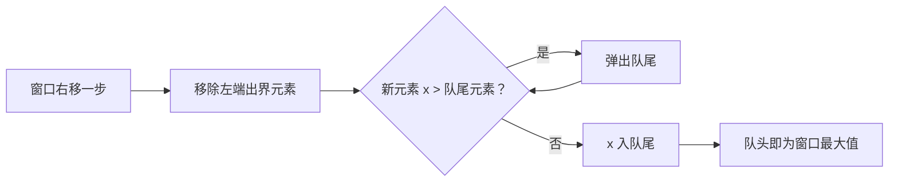

建议先阅读: [[A_容器_Container|A 容器 Container]], [[B_栈_Stack|B 栈 Stack]]

---

## 原理

队列（Queue）是一种受限的线性数据结构，遵循先进先出（FIFO, First In First Out）原则。元素只能从队尾插入，从队首删除。

### 核心操作

| 操作 | 描述 | 时间复杂度 |
|------|------|-----------|
| push / enqueue | 在队尾插入元素 | O(1) |
| pop / dequeue | 删除队首元素 | O(1) |
| front | 获取队首元素 | O(1) |
| back | 获取队尾元素 | O(1) |
| empty | 判断队列是否为空 | O(1) |
| size | 返回队列中元素个数 | O(1) |

### 底层实现方式

- **循环队列（数组）**: 通过取模运算避免假溢出，固定容量或动态扩容
- **链表队列**: head 指向队首（出队端），tail 指向队尾（入队端），无容量限制
- **双端队列（deque）**: 分段连续存储，两端都可插入/删除，也支持随机访问

### 假溢出与循环队列

普通数组实现中，队首元素出队后空间被浪费，tail 可能到达数组末尾无法入队。循环队列通过 `(index + 1) % capacity` 使 tail 绕回数组开头，充分利用空间。

---

## 实现

### 循环队列

```c
#include <stdlib.h>

typedef struct {
    int* data;
    size_t head;     // 队首位置
    size_t tail;     // 队尾位置（下一个插入位置）
    size_t capacity;
    size_t count;
} CircularQueue;

void cq_init(CircularQueue* q, size_t cap) {
    q->data = malloc(cap * sizeof(int));
    q->head = 0;
    q->tail = 0;
    q->capacity = cap;
    q->count = 0;
}

void cq_destroy(CircularQueue* q) {
    free(q->data);
}

static int cq_resize(CircularQueue* q) {
    size_t new_cap = q->capacity * 2;
    int* new_data = malloc(new_cap * sizeof(int));
    if (!new_data) return -1;
    for (size_t i = 0; i < q->count; i++)
        new_data[i] = q->data[(q->head + i) % q->capacity];
    free(q->data);
    q->data = new_data;
    q->head = 0;
    q->tail = q->count;
    q->capacity = new_cap;
    return 0;
}

int cq_push(CircularQueue* q, int value) {
    if (q->count >= q->capacity)
        if (cq_resize(q) != 0) return -1;
    q->data[q->tail] = value;
    q->tail = (q->tail + 1) % q->capacity;
    q->count++;
    return 0;
}

int cq_pop(CircularQueue* q) {
    if (q->count == 0) return -1;
    q->head = (q->head + 1) % q->capacity;
    q->count--;
    return 0;
}

int cq_front(CircularQueue* q, int* out) {
    if (q->count == 0) return -1;
    *out = q->data[q->head];
    return 0;
}

int cq_back(CircularQueue* q, int* out) {
    if (q->count == 0) return -1;
    *out = q->data[(q->tail + q->capacity - 1) % q->capacity];
    return 0;
}

int cq_empty(CircularQueue* q) { return q->count == 0; }
size_t cq_size(CircularQueue* q) { return q->count; }
```

### 链表队列

```c
#include <stdlib.h>

typedef struct QNode {
    int data;
    struct QNode* next;
} QNode;

typedef struct {
    QNode* head;  // 队首
    QNode* tail;  // 队尾
    size_t count;
} LinkedQueue;

void lq_init(LinkedQueue* q) {
    q->head = NULL;
    q->tail = NULL;
    q->count = 0;
}

void lq_destroy(LinkedQueue* q) {
    while (q->head) {
        QNode* tmp = q->head;
        q->head = q->head->next;
        free(tmp);
    }
    q->tail = NULL;
    q->count = 0;
}

int lq_push(LinkedQueue* q, int value) {
    QNode* node = malloc(sizeof(QNode));
    if (!node) return -1;
    node->data = value;
    node->next = NULL;
    if (q->tail)
        q->tail->next = node;
    else
        q->head = node;
    q->tail = node;
    q->count++;
    return 0;
}

int lq_pop(LinkedQueue* q) {
    if (!q->head) return -1;
    QNode* tmp = q->head;
    q->head = q->head->next;
    if (!q->head) q->tail = NULL;
    free(tmp);
    q->count--;
    return 0;
}

int lq_front(LinkedQueue* q, int* out) {
    if (!q->head) return -1;
    *out = q->head->data;
    return 0;
}

int lq_back(LinkedQueue* q, int* out) {
    if (!q->tail) return -1;
    *out = q->tail->data;
    return 0;
}

int lq_empty(LinkedQueue* q) { return q->head == NULL; }
size_t lq_size(LinkedQueue* q) { return q->count; }
```

---

## 各语言标准库对比

| 语言 | 队列 | 双端队列 |
|------|------|----------|
| C | 无（手写） | 无（手写） |
| C++ | queue（deque 封装） | deque |
| Java | LinkedList / ArrayDeque | ArrayDeque |
| Python | collections.deque | collections.deque |
| Rust | VecDeque | VecDeque |

---

## 应用场景

- **广度优先搜索（BFS）**: 层序遍历树/图，先发现的节点先处理
- **消息队列**: 生产者-消费者模型，异步通信与解耦
- **CPU 任务调度**: 就绪队列按 FIFO 分配时间片
- **滑动窗口**: 用单调队列维护窗口内的最大值/最小值

### 单调队列求滑动窗口最大值

核心思想：维护一个**递减队列**，队头始终是当前窗口的最大值。每次窗口右移时，移除过期元素（出左边），加入新元素（踢掉比它小的队尾），队头即为答案。



```c
// 返回结果需要调用者 free
int* max_sliding_window(const int* nums, int n, int k, int* result_size) {
    int* result = malloc((n - k + 1) * sizeof(int));
    int* dq = malloc(n * sizeof(int));  // 存下标，队头到队尾递减
    int head = 0, tail = 0;
    int ri = 0;
    for (int i = 0; i < n; i++) {
        // 移除超出窗口的队头
        while (tail > head && dq[head] <= i - k)
            head++;
        // 保持递减
        while (tail > head && nums[dq[tail - 1]] <= nums[i])
            tail--;
        dq[tail++] = i;
        if (i >= k - 1)
            result[ri++] = nums[dq[head]];
    }
    *result_size = ri;
    free(dq);
    return result;
}
```

---

## 练习

| 题号 | 题目 | 难度 | 知识点 |
|------|------|------|--------|
| P1540 | 机器翻译 | 入门 | 队列模拟 |
| P1996 | 约瑟夫问题 | 入门 | 队列模拟 |
| P1886 | 滑动窗口 | 普及+ | 单调队列 |
