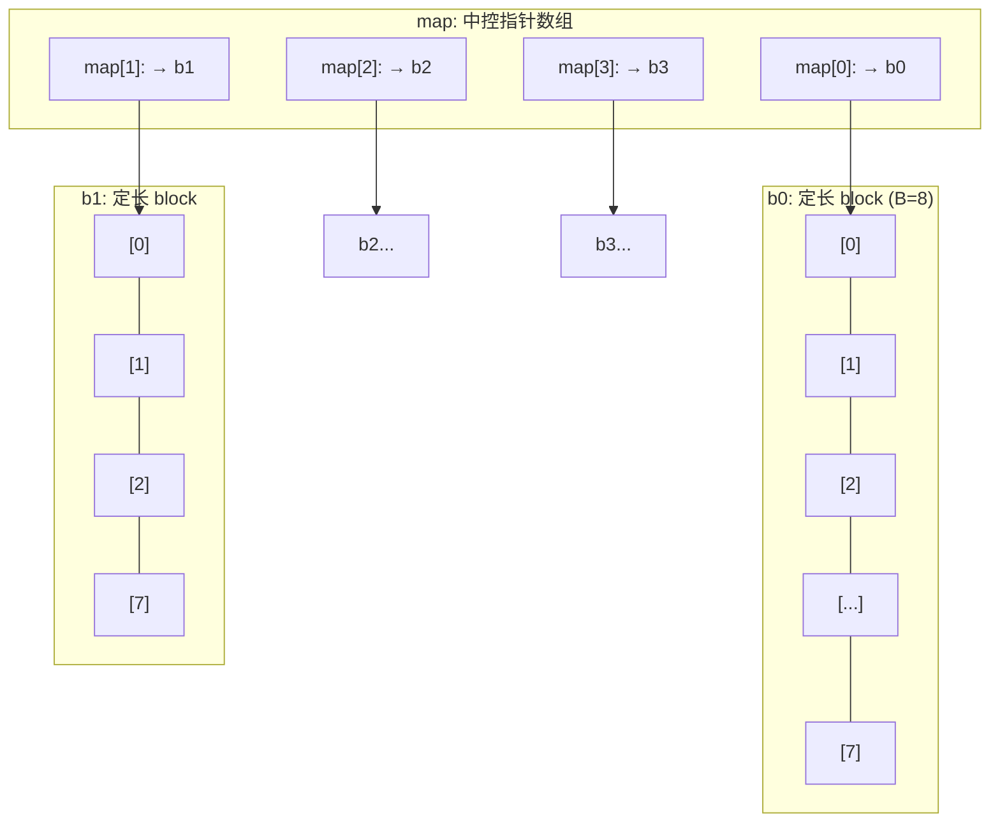
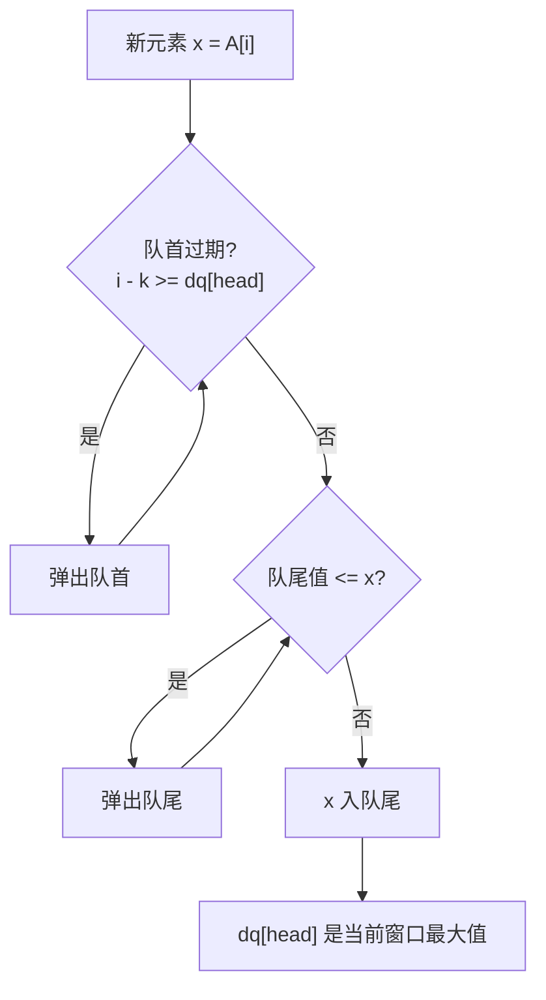
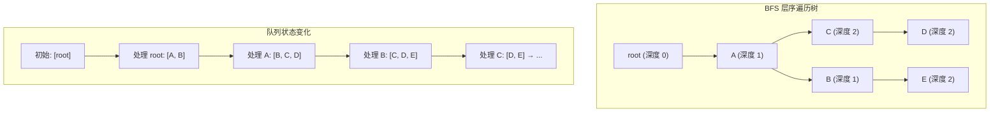
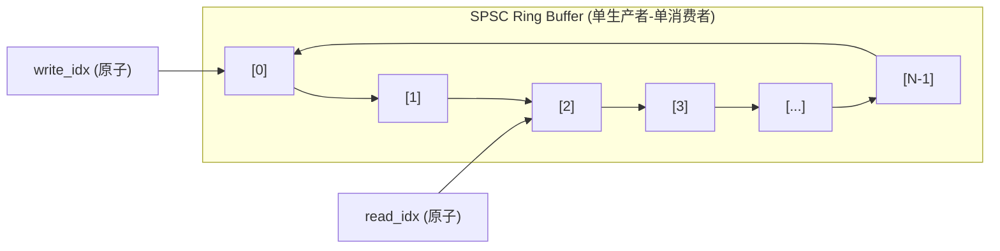

建议先阅读: [[D_容器_Container|容器概览]], [[F_栈_Stack|栈]]

> **考研 408 导引**：本章应试核心是**循环队列**——判空/判满两种策略（牺牲一格 vs 显式计数）的表达式差异、元素个数公式、给定操作序列的 head/tail 状态推演；链表队列注意"出队至空须置 tail=NULL"的陷阱。双端队列架构、单调队列、Ring Buffer 为超纲增值内容。正文备有 2 组闭卷手算自测。

---

## 原理

队列（Queue）遵循先进先出（FIFO: First In First Out）。元素从队尾（back）入队，从队首（front）出队。与栈的"后进先出"形成对称——栈模拟"时间倒流"（最近 = 最重要），队列模拟"时间流逝"（最早 = 最优先）。

### 队列在哪里

打印任务按提交顺序输出；操作系统把就绪进程排成等待 CPU 的队列，先来先服务；消息中间件让生产者与消费者解耦，请求按到达顺序被处理；BFS 逐层展开图节点，靠的正是队列的 FIFO 次序。这些场景的共同主题——**保持到达顺序的公平性：先到先服务**——正是 FIFO 的用武之地。本章沿这条线展开：先解决数组实现中的假溢出问题（循环队列），再看两端都要进出的双端队列，最后深入内核 Ring Buffer 与网卡 DMA 的硬件队列。

| 操作 | 描述 | 时间复杂度 |
|------|------|:---------:|
| `push(x)` / `enqueue(x)` | 从队尾插入 x | $O(1)$ |
| `pop()` / `dequeue()` | 弹出队首元素 | $O(1)$ |
| `front()` | 读取队首（不弹出） | $O(1)$ |
| `back()` | 读取队尾 | $O(1)$ |
| `empty()` | 是否为空 | $O(1)$ |

### 队列的三种实现

| | 循环队列（数组） | 链表队列 | 双端队列（deque） |
|------|:---:|:---:|:---:|
| 存储 | 连续数组 + 取模 | 节点链式 | 分段连续（map+block） |
| 随机访问 | $O(1)$（下标映射） | 不支持 | $O(1)$（两层寻址） |
| 两端 Push/Pop | 仅单向或需额外设计 | 仅单向 | $O(1)$ 双向 |
| 扩容 | 需 realloc + 重排 | 无容量限制 | map 扩容 + 新 block |
| 缓存友好 | 好（连续访问） | 差（指针追踪） | 中等（block 内好，跨 block 差） |

### 循环队列的假溢出与取模运算

最简单的数组队列：head 指向队首，tail 指向队尾。入队 tail++，出队 head++。随着 push/pop 交替，可用空间从 [0, capacity-1] 退化为 [head, capacity-1]，head 前方的空间无法利用——称为**假溢出**。

循环队列通过取模运算将一维数组在逻辑上卷成环：

```
物理数组: [s0] [s1] [s2] [s3] [s4] [s5] [s6] [s7]
 ┌─────────────────────────────────────┐
 │ (7) ──→ (0) ──→ (1) ──→ (2) │
 │ ↑ ↓ │
 │ (6) ←── (5) ←── (4) ←── (3) │
 └─────────────────────────────────────┘
tail=5 → 指向下一个插入位
head=2 → 指向队首元素
当前元素: [2], [3], [4]
```

核心操作：
```
push: data[tail] = x; tail = (tail + 1) % capacity;
pop: head = (head + 1) % capacity;
```

#### 取模的硬件代价

`% capacity` 在 CPU 层对应 `idiv` 指令（整数除法），延迟约 20-80 个周期。对于高频 push/pop 循环，取模可能成为瓶颈。**技巧**：当 `capacity` 是 2 的幂时，`% capacity` 可替换为 `& (capacity - 1)`——位与操作仅 1 个周期。

```c
// 如果 capacity = 256 (2^8 = 0x100)
// tail % 256 → 等效于 tail & 0xFF
// 编译器在 -O2 下会自动优化，但需 capacity 是编译时常量
```

实际上，大多数编译器的 `-O2` 优化可以在常量 capacity 时自动将取模转为位与，但若 capacity 是运行时变量，这一优化无法生效。因此高性能循环队列实现中，常显式使用 `capacity` 为 2 的幂并手动 `& (capacity - 1)`。

#### 满队列的判定：浪费一个槽位

当 head == tail 时，可能是空队列也可能是满队列。两种区分策略：

**浪费一个槽位**（最常见）：保证 tail 永远不追上 head——当 `(tail + 1) % capacity == head` 时视为满，此时数组中始终有一个空闲槽位：
```
capacity=8, head=0, tail=7 → 满 (尾部 slot 保持空, 防止混淆)
capacity=8, head=0, tail=0 → 空
```

**显式计数**（本章采用）：维护 `count` 变量单独计数。`count == 0` 为空，`count == capacity` 为满。多一个变量但不需要浪费槽位。

#### 两种策略的 408 对比

408 选择题最爱把两种策略放在一起考表达式差异——并排背：

| | 牺牲一格（空闲单元法） | 显式计数（计数器法） |
|--|--|--|
| 额外变量 | 无 | 一个 `count` |
| 判空 | `head == tail` | `count == 0` |
| 判满 | `(tail + 1) % capacity == head` | `count == capacity` |
| 实际容量 | capacity − 1 | capacity |
| 元素个数公式 | `(tail - head + capacity) % capacity` | 直接读 `count` |

**手算示范**（牺牲一格法）：capacity=8，head=5，tail=2。元素个数 $= (2-5+8)\%8 = 5$；判满：$(2+1)\%8 = 3 \ne 5$，未满；还能连续入队几次？入队推进 tail 直到 $(tail+1)\%8 = 5$ 即 tail=4——从 2 走到 4 需 **2 次**。

**408 自测：循环队列状态推演**

① 牺牲一格法，capacity=10，head=3，tail=9。当前元素个数？还能连续入队几次？
② 同一物理状态下改用显式计数法：实际容量是多少？
③ 牺牲一格法，capacity=4，从空队开始依次执行：push A、push B、push C、pop ×2、push E、push F、pop——写出每步后 head/tail 与队内内容；哪一步之后队列满？

> 答案：
>
> ① 元素个数 $=(9-3+10)\%10=6$；满的条件是 tail 绕回到 2（$(2+1)\%10=3=head$），从 9 出发经 0、1 到 2，还能入队 **3 次**。
> ② 计数法不牺牲槽位，实际容量就是 **10**（牺牲一格法只有 9）。同一 head/tail 下若 count=9，则还能入队 **1 次**。
> ③ 逐步轨迹：
>
> | 操作 | head | tail | 队内（首→尾）| 说明 |
> |------|:---:|:---:|------|------|
> | push A/B/C | 0 | 3 | A B C | 再 push 会撞上 head，被拒 |
> | pop ×2 | 2 | 3 | C | A、B 出队 |
> | push E | 2 | 0 | C E | tail 绕环到 0——wrap-around |
> | push F | 2 | 1 | C E F | $(1+1)\%4=2=head$ → **满** |
> | pop | 3 | 1 | E F | C 出队，又腾出一格 |
>
> 满发生在 push F 之后。注意第 4 步正是"绕环追上"的经典场景：tail 从 3 绕回 0 再走到 1，靠取模保持下标合法。

### 双端队列（Deque）的内部架构

Deque 支持 $O(1)$ 两端插入/删除和 $O(1)$ 随机访问。它既不是 vector（插入非尾部 O(n)）也不是 list（随机访问 O(n)），而是用**分段连续存储**在两者之间取得平衡：



- **map**：动态指针数组，每个元素指向一个 block
- **block**：固定大小（通常为 `max(1, 512/sizeof(T))` 或 8），真正存储数据
- **随机访问**：`arr[i] = map[(start_block + (head_offset + i) / B) % map_size][(head_offset + i) % B]`。两次算术运算，仍然是 O(1)，但比 vector 多了一次间接寻址

**Deque 的 map 扩容**：当 head 或 tail 侧的 map 已无空闲 slot 时，分配 2 倍大的新 map，将旧 map 拷贝到新 map 的**中央区域**，预留两侧空间：

```
旧 map (4 slots, 满): [b0][b1][b2][b3]
新 map (8 slots): [ ][ ][b0][b1][b2][b3][ ][ ]
 ↑ 中央对齐，两侧各 2 个空闲 slot
```

这个"中央对齐"技巧保证了后续 `push_front` 和 `push_back` 都有足够的两侧扩展空间，避免了频繁的 map 重分配。

#### 简易 Deque 实现

```c
#define BLOCK_SIZE 8

typedef struct {
 int** map;
 int map_cap; // map 总 slot 数
 int map_start; // map 中第一个有效 block 的索引
 int block_count; // 已用 block 数
 int head_off; // 第一个 block 内的偏移
 int tail_off; // 最后一个 block 内的偏移
 int total;
} SimpleDeque;

// 随机访问: arr[i]
int sd_at(SimpleDeque* dq, int i) {
 int global_idx = dq->head_off + i;
 int blk = (dq->map_start + global_idx / BLOCK_SIZE) % dq->map_cap;
 return dq->map[blk][global_idx % BLOCK_SIZE];
}
```

### 单调队列（Monotonic Queue）

单调队列是滑动窗口问题的标准解法。它在队列中维护元素值的单调性（递减或递增），利用单调性使得队首始终是窗口内的极值。

**核心性质**：对于给定的数组 $A$ 和滑动窗口大小 $k$，维护一个单调递减队列 `dq`（存的是下标）。窗口取闭区间 $[i-k+1,\ i]$（以 $i$ 为右端、长度为 $k$）。对于每个新元素 $A[i]$：
1. 若队首下标已滑出窗口（`i - k >= dq[head]`，即下标 $\le i-k$ 都已过期），弹出队首
2. 弹出队尾所有 $\leq A[i]$ 的元素（因为它们永远不会成为之后窗口的最大值——它们位置在前，值却不大，当它们还"活着"时不可能赢 $A[i]$）
3. 将 $i$ 入队尾



单调队列的时间复杂度 $O(n)$——每个下标入队一次、出队至多一次。这是一个典型的均摊线性算法：表面上每个新元素都可能"踢掉"多个元素，但每个元素被踢最多一次，总操作数不超过 $2n$。

```c
int* max_sliding_window(const int* nums, int n, int k, int* result_size) {
 int* result = malloc((n - k + 1) * sizeof(int));
 int* dq = malloc(n * sizeof(int));
 int head = 0, tail = 0, ri = 0;
 for (int i = 0; i < n; i++) {
 // 窗口为闭区间 [i-k+1, i]：下标 <= i-k 均已过期
 while (tail > head && dq[head] <= i - k)
 head++;
 while (tail > head && nums[dq[tail-1]] <= nums[i]) // 保持递减
 tail--;
 dq[tail++] = i;
 if (i >= k - 1)
 result[ri++] = nums[dq[head]];
 }
 *result_size = ri;
 free(dq);
 return result;
}
```

---

## 深入底层

### 队列与 BFS：深度的天性

广度优先搜索（BFS）使用队列实现。BFS 的一个核心保证——首次发现某节点的路径即是最短路径——源于队列的 FIFO 性质：同一层的所有节点先于下一层的任何节点被处理。



BFS 用队列的 FIFO 顺序保证了"先发现先处理"。在无权重图中，节点在 BFS 树中的深度 = 从起点到该节点的最短路径长度。Dijkstra 算法是 BFS 的加权推广——将队列替换为优先队列（堆）。详见 [[S_图_Graph|图的 BFS]]。

### Lock-Free 队列：环形缓冲区（Ring Buffer）

在并发编程和操作系统内核中，无锁队列（lock-free queue）使用**环形缓冲区**实现——生产者（writer）和消费者（reader）各自持有一个原子变量（`head` 和 `tail`），通过 CAS（Compare-And-Swap）无锁地更新：



Linux 内核的 `kfifo`（kernel FIFO buffer）和 DPDK 的 `rte_ring` 是典型的无锁环形队列实现。它们使用 `power-of-two` 容量和内存屏障（memory barrier）确保多核环境下的正确性。关键设计：write_idx 仅由生产者更新，read_idx 仅由消费者更新——避免了需要 CAS 的复杂争用。但在多生产者/多消费者（MPMC）场景，仍然需要原子比较交换。

### 硬件中的队列：DMA 环形描述符

网卡驱动程序中的数据包收发使用与队列结构同构的**DMA 环形描述符**（DMA ring descriptor）。网卡通过 DMA 引擎将接收到的数据包直接写入主机内存中的环形缓冲区，通过 head/tail 指针（由硬件和驱动分别管理）协调读写：

```
网卡 → DMA 写入 → [接收缓冲区环形队列] → 驱动软件读取 → 网络栈
```

这个结构在硬件层面利用了队列的 FIFO 语义——数据包按到达顺序被软件处理。队列的"先进先出"在硬件层面对应"先到达的数据包先被处理"，保证各层网络协议的时序正确性。

---

## 实现

### 循环队列（数组版）

```c
#include <stdlib.h>

typedef struct {
 int* data;
 size_t head, tail;
 size_t capacity;
 size_t count;
} CircularQueue;

void cq_init(CircularQueue* q, size_t cap) {
 q->data = malloc(cap * sizeof(int));
 q->head = q->tail = 0;
 q->capacity = cap;
 q->count = 0;
}

void cq_destroy(CircularQueue* q) { free(q->data); }

static int cq_resize(CircularQueue* q) {
 size_t new_cap = q->capacity * 2;
 int* new_data = malloc(new_cap * sizeof(int));
 if (!new_data) return -1;
 // 按逻辑顺序拷贝: [head .. tail) wrap-around 后平坦化
 for (size_t i = 0; i < q->count; i++)
 new_data[i] = q->data[(q->head + i) % q->capacity];
 free(q->data);
 q->data = new_data;
 q->head = 0;
 q->tail = q->count;
 q->capacity = new_cap;
 return 0;
}

int cq_push(CircularQueue* q, int value) {
 if (q->count >= q->capacity)
 if (cq_resize(q) != 0) return -1;
 q->data[q->tail] = value;
 q->tail = (q->tail + 1) % q->capacity;
 q->count++;
 return 0;
}

int cq_pop(CircularQueue* q) {
 if (q->count == 0) return -1;
 q->head = (q->head + 1) % q->capacity;
 q->count--;
 return 0;
}

int cq_front(const CircularQueue* q, int* out) {
 if (q->count == 0) return -1;
 *out = q->data[q->head];
 return 0;
}
```

### 链表队列

```c
#include <stdlib.h>

typedef struct QNode {
 int data;
 struct QNode* next;
} QNode;

typedef struct {
 QNode* head;
 QNode* tail;
 size_t count;
} LinkedQueue;

void lq_init(LinkedQueue* q) { q->head = q->tail = NULL; q->count = 0; }

void lq_destroy(LinkedQueue* q) {
 while (q->head) {
 QNode* tmp = q->head;
 q->head = q->head->next;
 free(tmp);
 }
 q->tail = NULL; q->count = 0;
}

int lq_push(LinkedQueue* q, int value) {
 QNode* node = malloc(sizeof(QNode));
 if (!node) return -1;
 node->data = value;
 node->next = NULL;
 if (q->tail) q->tail->next = node;
 else q->head = node;
 q->tail = node;
 q->count++;
 return 0;
}

int lq_pop(LinkedQueue* q) {
 if (!q->head) return -1;
 QNode* tmp = q->head;
 q->head = q->head->next;
 if (!q->head) q->tail = NULL;
 free(tmp);
 q->count--;
 return 0;
}
```

---

## 各语言标准库对比

| 语言 | 队列 | 双端队列 | 说明 |
|------|------|----------|------|
| C | 无 | 无 | 手写或使用 TAILQ 宏 |
| C++ | `std::queue<T>` | `std::deque<T>` | queue 是 deque 适配器 |
| Java | `Queue<T>`（interface） | `ArrayDeque<T>` | 推荐 ArrayDeque 而非 LinkedList |
| Python | `collections.deque` | `collections.deque` | 线程安全的 `queue.Queue` |
| Rust | `VecDeque<T>` | `VecDeque<T>` | 环形缓冲区实现 |

---

## 应用场景

- **BFS 遍历**：图的层序遍历、迷宫最短路径。BFS 的 FIFO 性质天然保证"先发现=最短"
- **生产者-消费者模型**：消息队列（message queue）、线程池任务队列。RabbitMQ 等中间件的核心数据结构
- **操作系统调度**：就绪队列（ready queue）按 FIFO 分配 CPU 时间片。详见 [[../操作系统/D_CPU调度|操作系统 — CPU 调度]]
- **网络数据包缓冲**：网卡驱动的环形缓冲区、TCP 重组缓冲区。DMA 引擎通过环形队列与驱动的软件栈交互
- **滑动窗口**：任意固定窗口内的最大/最小值查询，用单调队列从 $O(nk)$ 暴力降至 $O(n)$
- **IO 请求队列**：NVMe 驱动中的 Submission Queue / Completion Queue，使用环形缓冲区实现

---

## 练习

| 题号 | 题目 | 说明 |
|------|------|------|
| [622](https://leetcode.cn/problems/design-circular-queue/) | 设计循环队列 | 循环队列实现 |
| [225](https://leetcode.cn/problems/implement-stack-using-queues/) | 用队列实现栈 | 队列适配 |
| [232](https://leetcode.cn/problems/implement-queue-using-stacks/) | 用栈实现队列 | 与 225 成对的另一侧 |
| [239](https://leetcode.cn/problems/sliding-window-maximum/) | 滑动窗口最大值 | 单调队列 |

### 408 手算自测清单

笔试题与上面的 LeetCode 互补——考的是闭卷手算，全部在正文中带完整答案：

| 自测 | 位置 | 考什么 |
|------|------|--------|
| 状态推演 ×3 问 | 循环队列判定节 | 两种策略的表达式差异、剩余容量、wrap-around 轨迹与判满时刻 |

## 动手实验

| 编号 | 题目 | 说明 |
|:----:|------|------|
| E1 | 循环队列边界条件测试 | 实现循环队列（capacity=8），依次执行：空队 pop、满队 push（填满后继续 push）、half-full 时的 wrap-around push/pop。所有操作均用 `assert` 验证状态（count, head, tail 的一致性） |
| E2 | 取模 vs 位与微基准 | 实现两个版本的循环队列 push：一个用 `% capacity`（capacity 为质数），一个用 `& (capacity-1)`（capacity 为 2 的幂）。各做 1000 万次 push/pop，记录 cpu 周期数差异 |
| E3 | BFS 层边界统计 | 在 20x20 的随机迷宫中运行 BFS 搜索，每处理完一层打印当前队列长度。观察 BFS 层宽度变化（随搜索半径扩大，队列长度先增后减） |
