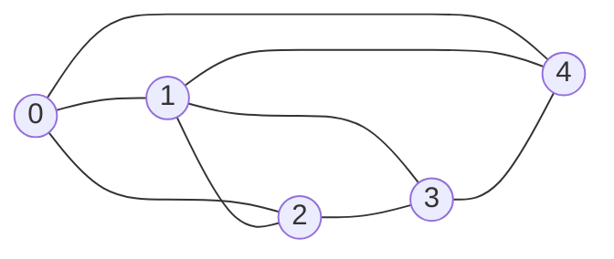
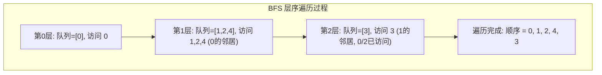

## ==========================================================================
C++ 数据结构教程 — 图 (Graph)
## ==========================================================================

## 📋 章节概述

图（Graph）是一种非线性数据结构，由顶点（Vertex）和连接顶点的边（Edge）组成。
图是最灵活的数据结构之一，可以表示各种复杂关系：社交网络、地图导航、网页链接、
依赖关系、电路设计等。

图论是计算机科学的重要分支，本章将从图的基本概念讲起，深入图的存储和遍历原理，
全面覆盖常见图算法，最后通过实例和习题巩固所学知识。

> 📌 **底层实现参考**：如果需要深入理解本章数据结构的底层实现（纯C手写、内存布局、指针操作），请参阅 [[../../C语言深化教程/3数据结构/08_图|C语言教程: 图]]。C教程侧重手动实现与内存本质，本教程侧重STL使用与算法优化，两者互补。

## ==========================================================================
### 📖 第一节: 基础语法 + 计算机底层原理
## ==========================================================================

1.1 图的基本概念
--------------------

图的组成元素：
- 顶点（Vertex）：图中的节点
- 边（Edge）：连接两个顶点的线

图的分类：
- 有向图 vs 无向图
- 加权图 vs 无权图
- 连通图 vs 非连通图
- 稠密图 vs 稀疏图

相关术语：
- 度（Degree）：顶点连接的边数
- 出度（Out-degree）：有向图中从该顶点出发的边数
- 入度（In-degree）：有向图中指向该顶点的边数
- 路径（Path）：顶点序列，相邻顶点间有边连接
- 环（Cycle）：起点等于终点的路径



上图是一个无向图，顶点集合 V = {0, 1, 2, 3, 4}，边集合 E = {(0,1), (0,2), (0,4), (1,2), (1,3), (1,4), (2,3), (3,4)}。
顶点 1 的度 = 4（连接了 0, 2, 3, 4）。

1.2 图的存储方式
--------------------

(1) 邻接矩阵（Adjacency Matrix）
用二维数组表示图，arr[i][j] = 1(或权重) 表示顶点i到j有边。

优点：判断两顶点间是否有边O(1)
缺点：空间O(V^2)，稀疏图浪费空间

```cpp
#include <iostream>
#include <vector>

class AdjacencyMatrixGraph {
private:
    int vertices;
    std::vector<std::vector<int>> matrix;  // 0=无边, 1=有边

public:
    AdjacencyMatrixGraph(int v) : vertices(v), matrix(v, std::vector<int>(v, 0)) {}

    void addEdge(int u, int v, bool directed = false) {
        matrix[u][v] = 1;
        if (!directed) matrix[v][u] = 1;
    }

    void removeEdge(int u, int v) {
        matrix[u][v] = 0;
        matrix[v][u] = 0;
    }

    bool hasEdge(int u, int v) const {
        return matrix[u][v] != 0;
    }

    void print() const {
        std::cout << "   ";
        for (int i = 0; i < vertices; ++i) std::cout << i << " ";
        std::cout << std::endl;

        for (int i = 0; i < vertices; ++i) {
            std::cout << i << ": ";
            for (int j = 0; j < vertices; ++j) {
                std::cout << matrix[i][j] << " ";
            }
            std::cout << std::endl;
        }
    }
};

int main() {
    AdjacencyMatrixGraph g(4);
    g.addEdge(0, 1);
    g.addEdge(0, 2);
    g.addEdge(1, 2);
    g.addEdge(2, 3);

    g.print();

    std::cout << "0-2有边? " << g.hasEdge(0, 2) << std::endl;
    std::cout << "0-3有边? " << g.hasEdge(0, 3) << std::endl;

    return 0;
}
```

(2) 邻接表（Adjacency List）
每个顶点维护一个链表/vector，存储与其相邻的顶点。

优点：空间O(V+E)，适合稀疏图
缺点：判断两顶点间是否有边需要O(degree)

```cpp
#include <iostream>
#include <vector>
#include <list>

class AdjacencyListGraph {
private:
    int vertices;
    std::vector<std::list<int>> adj_list;

public:
    AdjacencyListGraph(int v) : vertices(v), adj_list(v) {}

    void addEdge(int u, int v, bool directed = false) {
        adj_list[u].push_back(v);
        if (!directed) adj_list[v].push_back(u);
    }

    void removeEdge(int u, int v) {
        adj_list[u].remove(v);
        adj_list[v].remove(u);
    }

    bool hasEdge(int u, int v) const {
        for (int w : adj_list[u]) {
            if (w == v) return true;
        }
        return false;
    }

    std::list<int> getNeighbors(int v) const {
        return adj_list[v];
    }

    void print() const {
        for (int i = 0; i < vertices; ++i) {
            std::cout << i << ": ";
            for (int neighbor : adj_list[i]) {
                std::cout << neighbor << " ";
            }
            std::cout << std::endl;
        }
    }
};

int main() {
    AdjacencyListGraph g(5);
    g.addEdge(0, 1);
    g.addEdge(0, 4);
    g.addEdge(1, 2);
    g.addEdge(1, 3);
    g.addEdge(1, 4);
    g.addEdge(2, 3);
    g.addEdge(3, 4);

    std::cout << "邻接表:" << std::endl;
    g.print();

    std::cout << "\n顶点1的邻居: ";
    for (int v : g.getNeighbors(1)) std::cout << v << " ";
    std::cout << std::endl;

    return 0;
}
```

1.3 图的遍历：广度优先搜索（BFS）
---------------------------------------

BFS使用队列，按"层"遍历，可用于求最短路径（无权图）。

以 0-1-2-3-4 图为例，从顶点 0 开始 BFS：



```cpp
#include <iostream>
#include <vector>
#include <list>
#include <queue>

class Graph {
private:
    int vertices;
    std::vector<std::list<int>> adj_list;

public:
    Graph(int v) : vertices(v), adj_list(v) {}

    void addEdge(int u, int v, bool directed = false) {
        adj_list[u].push_back(v);
        if (!directed) adj_list[v].push_back(u);
    }

    // BFS遍历
    void bfs(int start) const {
        std::vector<bool> visited(vertices, false);
        std::queue<int> q;

        visited[start] = true;
        q.push(start);

        std::cout << "BFS从" << start << "开始: ";
        while (!q.empty()) {
            int current = q.front();
            q.pop();
            std::cout << current << " ";

            for (int neighbor : adj_list[current]) {
                if (!visited[neighbor]) {
                    visited[neighbor] = true;
                    q.push(neighbor);
                }
            }
        }
        std::cout << std::endl;
    }

    // BFS求最短路径（无权图）
    std::vector<int> shortestPath(int start, int end) const {
        std::vector<bool> visited(vertices, false);
        std::vector<int> parent(vertices, -1);
        std::queue<int> q;

        visited[start] = true;
        q.push(start);

        while (!q.empty()) {
            int current = q.front();
            q.pop();

            if (current == end) break;

            for (int neighbor : adj_list[current]) {
                if (!visited[neighbor]) {
                    visited[neighbor] = true;
                    parent[neighbor] = current;
                    q.push(neighbor);
                }
            }
        }

        // 重构路径
        std::vector<int> path;
        if (!visited[end]) return path;  // 无法到达

        for (int v = end; v != -1; v = parent[v]) {
            path.push_back(v);
        }
        std::reverse(path.begin(), path.end());
        return path;
    }
};

int main() {
    Graph g(6);
    g.addEdge(0, 1);
    g.addEdge(0, 2);
    g.addEdge(1, 3);
    g.addEdge(2, 3);
    g.addEdge(2, 4);
    g.addEdge(3, 4);
    g.addEdge(3, 5);
    g.addEdge(4, 5);

    g.bfs(0);

    auto path = g.shortestPath(0, 5);
    std::cout << "0->5的最短路径: ";
    for (int v : path) std::cout << v << " ";
    std::cout << std::endl;

    return 0;
}
```

1.4 图的遍历：深度优先搜索（DFS）
---------------------------------------

DFS使用栈（递归或显式栈），沿一条路径走到尽头再回溯。

```cpp
#include <iostream>
#include <vector>
#include <list>
#include <stack>

class GraphDFS {
private:
    int vertices;
    std::vector<std::list<int>> adj_list;

    void dfsRecursive(int v, std::vector<bool>& visited) const {
        visited[v] = true;
        std::cout << v << " ";

        for (int neighbor : adj_list[v]) {
            if (!visited[neighbor]) {
                dfsRecursive(neighbor, visited);
            }
        }
    }

public:
    GraphDFS(int v) : vertices(v), adj_list(v) {}

    void addEdge(int u, int v, bool directed = false) {
        adj_list[u].push_back(v);
        if (!directed) adj_list[v].push_back(u);
    }

    // 递归DFS
    void dfsRecursive(int start) const {
        std::vector<bool> visited(vertices, false);
        std::cout << "DFS(递归)从" << start << "开始: ";
        dfsRecursive(start, visited);
        std::cout << std::endl;
    }

    // 迭代DFS（使用栈）
    void dfsIterative(int start) const {
        std::vector<bool> visited(vertices, false);
        std::stack<int> stk;

        stk.push(start);

        std::cout << "DFS(迭代)从" << start << "开始: ";
        while (!stk.empty()) {
            int v = stk.top();
            stk.pop();

            if (visited[v]) continue;
            visited[v] = true;
            std::cout << v << " ";

            // 逆序入栈以保持与递归相同的遍历顺序
            for (auto it = adj_list[v].rbegin(); it != adj_list[v].rend(); ++it) {
                if (!visited[*it]) {
                    stk.push(*it);
                }
            }
        }
        std::cout << std::endl;
    }

    // 判断是否有环（有向图）
    bool hasCycle() const {
        std::vector<bool> visited(vertices, false);
        std::vector<bool> on_path(vertices, false);

        for (int i = 0; i < vertices; ++i) {
            if (!visited[i]) {
                if (dfsCycleDetect(i, visited, on_path)) return true;
            }
        }
        return false;
    }

private:
    bool dfsCycleDetect(int v, std::vector<bool>& visited,
                        std::vector<bool>& on_path) const {
        visited[v] = true;
        on_path[v] = true;

        for (int neighbor : adj_list[v]) {
            if (!visited[neighbor]) {
                if (dfsCycleDetect(neighbor, visited, on_path)) return true;
            } else if (on_path[neighbor]) {
                return true;  // 发现环
            }
        }

        on_path[v] = false;
        return false;
    }
};

int main() {
    GraphDFS g(5);
    g.addEdge(0, 1, true);
    g.addEdge(1, 2, true);
    g.addEdge(2, 0, true);   // 形成环 0->1->2->0
    g.addEdge(1, 3, true);
    g.addEdge(3, 4, true);

    g.dfsRecursive(0);
    g.dfsIterative(0);

    std::cout << "有环? " << g.hasCycle() << std::endl;

    return 0;
}
```


## ==========================================================================
### 📖 第二节: 所有用法大全
## ==========================================================================

2.1 加权图与最短路径（Dijkstra算法）
-----------------------------------------

```cpp
#include <iostream>
#include <vector>
#include <queue>
#include <limits>
#include <list>

class WeightedGraph {
private:
    int vertices;
    std::vector<std::list<std::pair<int, int>>> adj_list;  // {neighbor, weight}

public:
    WeightedGraph(int v) : vertices(v), adj_list(v) {}

    void addEdge(int u, int v, int weight, bool directed = false) {
        adj_list[u].push_back({v, weight});
        if (!directed) adj_list[v].push_back({u, weight});
    }

    // Dijkstra最短路径算法
    std::vector<int> dijkstra(int start) const {
        std::vector<int> dist(vertices, std::numeric_limits<int>::max());
        std::vector<bool> visited(vertices, false);

        // 最小堆：{距离, 顶点}
        std::priority_queue<std::pair<int, int>,
                            std::vector<std::pair<int, int>>,
                            std::greater<std::pair<int, int>>> pq;

        dist[start] = 0;
        pq.push({0, start});

        while (!pq.empty()) {
            int u = pq.top().second;
            pq.pop();

            if (visited[u]) continue;
            visited[u] = true;

            for (const auto& [v, w] : adj_list[u]) {
                if (!visited[v] && dist[u] + w < dist[v]) {
                    dist[v] = dist[u] + w;
                    pq.push({dist[v], v});
                }
            }
        }

        return dist;
    }

    // Bellman-Ford算法（处理负权边）
    std::vector<int> bellmanFord(int start) const {
        std::vector<int> dist(vertices, std::numeric_limits<int>::max());
        dist[start] = 0;

        // 松弛V-1次
        for (int i = 0; i < vertices - 1; ++i) {
            for (int u = 0; u < vertices; ++u) {
                for (const auto& [v, w] : adj_list[u]) {
                    if (dist[u] != std::numeric_limits<int>::max() &&
                        dist[u] + w < dist[v]) {
                        dist[v] = dist[u] + w;
                    }
                }
            }
        }

        // 检查负权环
        for (int u = 0; u < vertices; ++u) {
            for (const auto& [v, w] : adj_list[u]) {
                if (dist[u] != std::numeric_limits<int>::max() &&
                    dist[u] + w < dist[v]) {
                    std::cout << "图中存在负权环！" << std::endl;
                    return {};
                }
            }
        }

        return dist;
    }
};

int main() {
    WeightedGraph g(6);
    g.addEdge(0, 1, 4);
    g.addEdge(0, 2, 2);
    g.addEdge(1, 2, 1);
    g.addEdge(1, 3, 5);
    g.addEdge(2, 3, 8);
    g.addEdge(2, 4, 10);
    g.addEdge(3, 4, 2);
    g.addEdge(3, 5, 6);
    g.addEdge(4, 5, 3);

    auto dist = g.dijkstra(0);

    std::cout << "从0到各点的最短距离:" << std::endl;
    for (int i = 0; i < dist.size(); ++i) {
        std::cout << "  0 -> " << i << ": "
                  << (dist[i] == std::numeric_limits<int>::max() ? "INF" :
                      std::to_string(dist[i])) << std::endl;
    }

    return 0;
}
```

Dijkstra 算法逐步推演（以图中 0 到各点的最短路径为例）：

```mermaid
graph TD
    subgraph "Dijkstra 从顶点 0 出发"
        S0["初始: dist=[0, INF, INF, INF, INF, INF]"]
        S1["弹出0(dist=0): 松弛1(4), 2(2)"]
        S2["dist=[0, 4, 2, INF, INF, INF]"]
        S3["弹出2(dist=2): 松弛3(10), 4(12)"]
        S4["dist=[0, 4, 2, 10, 12, INF]"]
        S5["弹出1(dist=4): 松弛3→min(10,9)=9"]
        S6["dist=[0, 4, 2, 9, 12, INF]"]
        S7["弹出3(dist=9): 松弛4(11), 5(15)"]
        S8["弹出4(dist=11): 松弛5→min(15,14)=14"]
        S9["最终: dist=[0, 4, 2, 9, 11, 14]"]
        S0 --> S1 --> S2 --> S3 --> S4 --> S5 --> S6 --> S7 --> S8 --> S9
    end
```



| 算法 | 适用图 | 时间复杂度 | 空间 | 核心思想 |
|------|--------|-----------|------|---------|
| BFS | 无权图 | O(V+E) | O(V) | 队列层序遍历 |
| DFS | 任意图 | O(V+E) | O(V) | 栈/递归深度优先 |
| Dijkstra | 非负权图 | O((V+E)logV) | O(V) | 贪心 + 最小堆 |
| Bellman-Ford | 任意权图 | O(VE) | O(V) | V-1 轮松弛 |
| Floyd-Warshall | 任意权图 | O(V^3) | O(V^2) | 动态规划所有点对 |

2.2 最小生成树（Prim算法 & Kruskal算法）
---------------------------------------------

```cpp
#include <iostream>
#include <vector>
#include <list>
#include <queue>
#include <algorithm>

class MST {
private:
    // 并查集（Union-Find）
    struct UnionFind {
        std::vector<int> parent, rank;
        UnionFind(int n) : parent(n), rank(n, 0) {
            for (int i = 0; i < n; ++i) parent[i] = i;
        }

        int find(int x) {
            if (parent[x] != x)
                parent[x] = find(parent[x]);
            return parent[x];
        }

        bool unite(int x, int y) {
            int px = find(x), py = find(y);
            if (px == py) return false;
            if (rank[px] < rank[py]) std::swap(px, py);
            parent[py] = px;
            if (rank[px] == rank[py]) ++rank[px];
            return true;
        }
    };

public:
    // Kruskal算法
    static std::vector<std::tuple<int, int, int>>
    kruskalMST(int vertices, std::vector<std::tuple<int, int, int>>& edges) {
        // 按权重排序
        std::sort(edges.begin(), edges.end(),
                  [](const auto& a, const auto& b) {
                      return std::get<2>(a) < std::get<2>(b);
                  });

        UnionFind uf(vertices);
        std::vector<std::tuple<int, int, int>> mst;

        for (const auto& [u, v, w] : edges) {
            if (uf.unite(u, v)) {
                mst.push_back({u, v, w});
                if (mst.size() == (size_t)vertices - 1) break;
            }
        }

        return mst;
    }

    // Prim算法
    static std::vector<std::pair<int, int>>
    primMST(const std::vector<std::list<std::pair<int, int>>>& adj_list) {
        int vertices = adj_list.size();
        std::vector<bool> in_mst(vertices, false);
        std::vector<int> key(vertices, std::numeric_limits<int>::max());
        std::vector<int> parent(vertices, -1);

        // 最小堆：{权重, 顶点}
        std::priority_queue<std::pair<int, int>,
                            std::vector<std::pair<int, int>>,
                            std::greater<std::pair<int, int>>> pq;

        key[0] = 0;
        pq.push({0, 0});

        while (!pq.empty()) {
            int u = pq.top().second;
            pq.pop();

            if (in_mst[u]) continue;
            in_mst[u] = true;

            for (const auto& [v, w] : adj_list[u]) {
                if (!in_mst[v] && w < key[v]) {
                    key[v] = w;
                    parent[v] = u;
                    pq.push({key[v], v});
                }
            }
        }

        // 构建MST边列表
        std::vector<std::pair<int, int>> mst;
        for (int i = 1; i < vertices; ++i) {
            if (parent[i] != -1) {
                mst.push_back({parent[i], i});
            }
        }
        return mst;
    }
};

int main() {
    int V = 5;

    // 边: (u, v, w)
    std::vector<std::tuple<int, int, int>> edges = {
        {0, 1, 2}, {0, 3, 6}, {1, 2, 3},
        {1, 3, 8}, {1, 4, 5}, {2, 4, 7}, {3, 4, 9}
    };

    auto mst = MST::kruskalMST(V, edges);
    int total_weight = 0;

    std::cout << "Kruskal最小生成树:" << std::endl;
    for (const auto& [u, v, w] : mst) {
        std::cout << "  " << u << " - " << v << "  权重: " << w << std::endl;
        total_weight += w;
    }
    std::cout << "总权重: " << total_weight << std::endl;

    return 0;
}
```

2.3 拓扑排序（Topological Sort）
-------------------------------------

```cpp
#include <iostream>
#include <vector>
#include <list>
#include <queue>

class TopologicalSort {
private:
    int vertices;
    std::vector<std::list<int>> adj_list;

public:
    TopologicalSort(int v) : vertices(v), adj_list(v) {}

    void addEdge(int u, int v) {
        adj_list[u].push_back(v);
    }

    // Kahn算法（基于入度）
    std::vector<int> topologicalSort() {
        std::vector<int> in_degree(vertices, 0);

        for (int u = 0; u < vertices; ++u) {
            for (int v : adj_list[u]) {
                ++in_degree[v];
            }
        }

        std::queue<int> q;
        for (int i = 0; i < vertices; ++i) {
            if (in_degree[i] == 0) q.push(i);
        }

        std::vector<int> result;
        while (!q.empty()) {
            int u = q.front();
            q.pop();
            result.push_back(u);

            for (int v : adj_list[u]) {
                if (--in_degree[v] == 0) {
                    q.push(v);
                }
            }
        }

        if (result.size() != (size_t)vertices) {
            std::cout << "图中存在环，无法拓扑排序！" << std::endl;
            return {};
        }

        return result;
    }
};

int main() {
    // 课程依赖图
    TopologicalSort ts(6);
    ts.addEdge(0, 2);  // C++基础 -> 数据结构
    ts.addEdge(0, 3);  // C++基础 -> 算法
    ts.addEdge(1, 2);  // 数学 -> 数据结构
    ts.addEdge(2, 3);  // 数据结构 -> 算法
    ts.addEdge(2, 4);  // 数据结构 -> 数据库
    ts.addEdge(3, 5);  // 算法 -> 图形学
    ts.addEdge(4, 5);  // 数据库 -> 图形学

    auto order = ts.topologicalSort();

    std::cout << "学习顺序: ";
    for (int course : order) {
        std::cout << "C" << course << " ";
    }
    std::cout << std::endl;

    return 0;
}
```


## ==========================================================================
### 📖 第三节: 实用案例
## ==========================================================================

案例一：社交网络的影响力分析
------------------------------------

```cpp
#include <iostream>
#include <vector>
#include <list>
#include <queue>
#include <unordered_map>
#include <string>
#include <algorithm>

class SocialNetwork {
private:
    std::unordered_map<std::string, int> name_to_id;
    std::vector<std::string> id_to_name;
    std::vector<std::list<int>> friends;

    int getOrCreateId(const std::string& name) {
        auto it = name_to_id.find(name);
        if (it != name_to_id.end()) return it->second;
        int id = id_to_name.size();
        name_to_id[name] = id;
        id_to_name.push_back(name);
        friends.emplace_back();
        return id;
    }

public:
    void addFriendship(const std::string& a, const std::string& b) {
        int id_a = getOrCreateId(a);
        int id_b = getOrCreateId(b);
        friends[id_a].push_back(id_b);
        friends[id_b].push_back(id_a);
    }

    // 计算影响力（影响力 = 粉丝数 + 粉丝的粉丝数 * 0.5）
    std::vector<std::pair<std::string, double>> getInfluenceRank() {
        int n = id_to_name.size();
        std::vector<double> influence(n, 0);

        for (int i = 0; i < n; ++i) {
            influence[i] = friends[i].size();  // 直接粉丝

            // 间接粉丝（二度关系）
            for (int f : friends[i]) {
                influence[i] += friends[f].size() * 0.5;
            }
        }

        std::vector<std::pair<std::string, double>> result;
        for (int i = 0; i < n; ++i) {
            result.push_back({id_to_name[i], influence[i]});
        }

        std::sort(result.begin(), result.end(),
                  [](const auto& a, const auto& b) {
                      return a.second > b.second;
                  });

        return result;
    }

    // 寻找最短联系路径（六度分隔理论）
    std::vector<std::string> findConnectionPath(const std::string& from,
                                                 const std::string& to) {
        if (name_to_id.find(from) == name_to_id.end() ||
            name_to_id.find(to) == name_to_id.end()) {
            return {};
        }

        int start = name_to_id[from];
        int end = name_to_id[to];
        int n = id_to_name.size();

        std::vector<bool> visited(n, false);
        std::vector<int> parent(n, -1);
        std::queue<int> q;

        visited[start] = true;
        q.push(start);

        while (!q.empty()) {
            int cur = q.front();
            q.pop();

            if (cur == end) break;

            for (int neighbor : friends[cur]) {
                if (!visited[neighbor]) {
                    visited[neighbor] = true;
                    parent[neighbor] = cur;
                    q.push(neighbor);
                }
            }
        }

        if (!visited[end]) return {};

        std::vector<std::string> path;
        for (int v = end; v != -1; v = parent[v]) {
            path.push_back(id_to_name[v]);
        }
        std::reverse(path.begin(), path.end());
        return path;
    }
};

int main() {
    SocialNetwork sn;

    sn.addFriendship("Alice", "Bob");
    sn.addFriendship("Alice", "Charlie");
    sn.addFriendship("Bob", "David");
    sn.addFriendship("Charlie", "David");
    sn.addFriendship("David", "Eve");
    sn.addFriendship("Eve", "Frank");
    sn.addFriendship("Bob", "Grace");

    std::cout << "影响力排名:" << std::endl;
    for (const auto& [name, score] : sn.getInfluenceRank()) {
        std::cout << "  " << name << ": " << score << std::endl;
    }

    std::cout << "\nAlice到Frank的联系路径: ";
    for (const auto& name : sn.findConnectionPath("Alice", "Frank")) {
        std::cout << name << " -> ";
    }
    std::cout << "End" << std::endl;

    return 0;
}
```


案例二：地图导航系统
---------------------------

```cpp
#include <iostream>
#include <vector>
#include <list>
#include <queue>
#include <limits>
#include <string>
#include <unordered_map>

class MapNavigator {
private:
    struct Location {
        std::string name;
        double lat, lon;
    };

    std::vector<Location> locations;
    std::vector<std::list<std::pair<int, double>>> roads;  // {neighbor, distance(km)}
    std::unordered_map<std::string, int> name_to_id;

public:
    int addLocation(const std::string& name, double lat, double lon) {
        int id = locations.size();
        name_to_id[name] = id;
        locations.push_back({name, lat, lon});
        roads.emplace_back();
        return id;
    }

    void addRoad(const std::string& a, const std::string& b, double distance) {
        int id_a = name_to_id[a];
        int id_b = name_to_id[b];
        roads[id_a].push_back({id_b, distance});
        roads[id_b].push_back({id_a, distance});
    }

    std::pair<std::vector<std::string>, double>
    findShortestPath(const std::string& from, const std::string& to) {
        int start = name_to_id[from];
        int end = name_to_id[to];
        int n = locations.size();

        std::vector<double> dist(n, std::numeric_limits<double>::max());
        std::vector<int> parent(n, -1);
        std::vector<bool> visited(n, false);

        std::priority_queue<std::pair<double, int>,
                            std::vector<std::pair<double, int>>,
                            std::greater<std::pair<double, int>>> pq;

        dist[start] = 0;
        pq.push({0, start});

        while (!pq.empty()) {
            int u = pq.top().second;
            pq.pop();

            if (visited[u]) continue;
            visited[u] = true;

            if (u == end) break;

            for (const auto& [v, w] : roads[u]) {
                if (!visited[v] && dist[u] + w < dist[v]) {
                    dist[v] = dist[u] + w;
                    parent[v] = u;
                    pq.push({dist[v], v});
                }
            }
        }

        std::vector<std::string> path;
        if (dist[end] == std::numeric_limits<double>::max()) {
            return {path, -1};
        }

        for (int v = end; v != -1; v = parent[v]) {
            path.push_back(locations[v].name);
        }
        std::reverse(path.begin(), path.end());

        return {path, dist[end]};
    }
};

int main() {
    MapNavigator nav;

    nav.addLocation("北京", 39.9, 116.4);
    nav.addLocation("天津", 39.1, 117.2);
    nav.addLocation("上海", 31.2, 121.5);
    nav.addLocation("南京", 32.1, 118.8);
    nav.addLocation("济南", 36.7, 117.0);

    nav.addRoad("北京", "天津", 120);
    nav.addRoad("北京", "济南", 400);
    nav.addRoad("天津", "济南", 320);
    nav.addRoad("济南", "南京", 600);
    nav.addRoad("南京", "上海", 300);
    nav.addRoad("天津", "上海", 1000);

    auto [path, distance] = nav.findShortestPath("北京", "上海");

    std::cout << "北京到上海的最短路线: ";
    for (size_t i = 0; i < path.size(); ++i) {
        std::cout << path[i];
        if (i < path.size() - 1) std::cout << " -> ";
    }
    std::cout << std::endl;
    std::cout << "总距离: " << distance << "公里" << std::endl;

    return 0;
}
```


## ==========================================================================
### 📖 第四节: 课后习题
## ==========================================================================

1. 基础题：手动实现图的邻接表表示和邻接矩阵表示。
   - 支持添加/删除顶点和边
   - 实现BFS和DFS遍历
   - 比较两种存储方式的空间和时间差异

2. 应用题：使用图实现一个简单的依赖管理器。
   - 使用有向无环图（DAG）表示包依赖关系
   - 实现拓扑排序确定安装顺序
   - 检测循环依赖

3. 进阶题：实现Floyd-Warshall全源最短路径算法。
   - 计算图中所有顶点对之间的最短路径
   - 处理负权边（但不含负权环）
   - 时间复杂度O(V^3)

4. 综合题：实现一个简单的搜索引擎PageRank算法。
   - 将网页和超链接建模为有向图
   - 迭代计算每个页面的排名
   - 处理悬挂节点（没有出链的页面）

5. 挑战题：实现一个A*寻路算法。
   - 在网格地图上寻找最短路径
   - 使用启发式函数（曼哈顿距离或欧几里得距离）
   - 与Dijkstra算法进行性能对比
   - 可视化路径

## ==========================================================================


## ==========================================================================
### 📝 章节测试
## ==========================================================================

> [!question] 判断题 1
> 无向图中，每条边对两个顶点各贡献1度，因此所有顶点度数之和等于边数的2倍 （ ）
> - [ ] ✅ 正确
> - [ ] ❌ 错误
>
> > [!success]- 点击查看答案
> > 答案: 正确
> > 
> > **解析**: 在无向图中，每条边连接两个顶点，为每个端点贡献1度。因此所有顶点度数之和 = 2 × 边数，这是图论中的"握手定理"。

> [!question] 判断题 2
> 邻接矩阵适合表示稀疏图，邻接表适合表示稠密图 （ ）
> - [ ] ✅ 正确
> - [ ] ❌ 错误
>
> > [!success]- 点击查看答案
> > 答案: 错误
> > 
> > **解析**: 恰好相反。邻接矩阵空间O(V^2)，适合稠密图（边多时矩阵利用率高）。邻接表空间O(V+E)，适合稀疏图（边少时节省空间）。

> [!question] 判断题 3
> DFS可以使用递归或显式栈实现，BFS只能使用队列实现 （ ）
> - [ ] ✅ 正确
> - [ ] ❌ 错误
>
> > [!success]- 点击查看答案
> > 答案: 正确
> > 
> > **解析**: DFS使用栈（递归隐式使用系统栈，或显式栈）。BFS需要按层访问，必须使用队列保证先发现的节点先处理。

> [!question] 判断题 4
> Dijkstra算法可以处理带负权边的图 （ ）
> - [ ] ✅ 正确
> - [ ] ❌ 错误
>
> > [!success]- 点击查看答案
> > 答案: 错误
> > 
> > **解析**: Dijkstra算法基于贪心策略，假设已确定最短路径的节点不会再被更新。负权边可能使已确定的路径不再最短，导致算法失效。需要用Bellman-Ford处理负权边。

> [!question] 判断题 5
> 拓扑排序只能对有向无环图（DAG）进行 （ ）
> - [ ] ✅ 正确
> - [ ] ❌ 错误
>
> > [!success]- 点击查看答案
> > 答案: 正确
> > 
> > **解析**: 拓扑排序要求图中不存在环。如果有环，则不存在拓扑排序（无法确定环中节点的先后顺序）。因此拓扑排序只适用于DAG。

> [!question] 判断题 6
> 无向连通图中一定存在欧拉回路 （ ）
> - [ ] ✅ 正确
> - [ ] ❌ 错误
>
> > [!success]- 点击查看答案
> > 答案: 错误
> > 
> > **解析**: 无向连通图存在欧拉回路的充要条件是所有顶点的度数都为偶数。仅仅连通不足以保证欧拉回路的存在。

> [!question] 判断题 7
> 最小生成树(MST)中的边权之和在所有生成树中是最小的 （ ）
> - [ ] ✅ 正确
> - [ ] ❌ 错误
>
> > [!success]- 点击查看答案
> > 答案: 正确
> > 
> > **解析**: 最小生成树的定义就是在所有可能的生成树中，边权总和最小的那棵。Kruskal和Prim算法都能找到MST。

> [!question] 判断题 8
> BFS可以在无权图中找到最短路径 （ ）
> - [ ] ✅ 正确
> - [ ] ❌ 错误
>
> > [!success]- 点击查看答案
> > 答案: 正确
> > 
> > **解析**: 在无权图（或所有边权相同的图）中，BFS按层扩展，第一次到达某节点时的路径就是最短路径（经过最少边数）。

> [!question] 判断题 9
> Kruskal算法每次选择当前权值最小的边，是一种贪心算法 （ ）
> - [ ] ✅ 正确
> - [ ] ❌ 错误
>
> > [!success]- 点击查看答案
> > 答案: 正确
> > 
> > **解析**: Kruskal算法将边按权值排序，依次选择不构成环的最小边加入MST，是典型的贪心策略。使用并查集判断是否形成环。

> [!question] 判断题 10
> 有向图中，如果从顶点u到v存在路径，则从v到u也一定存在路径 （ ）
> - [ ] ✅ 正确
> - [ ] ❌ 错误
>
> > [!success]- 点击查看答案
> > 答案: 错误
> > 
> > **解析**: 有向图中边有方向，u→v的路径不意味着v→u也有路径。只有在强连通分量中，任意两点间才存在双向路径。

---

> [!question] 选择题 1
> 一个有V个顶点的无向完全图有多少条边？
> - [ ] A. V
> - [ ] B. V^2
> - [ ] C. V*(V-1)/2
> - [ ] D. V*(V-1)
>
> > [!success]- 点击查看答案
> > 正确答案: C
> > 
> > **解析**: 完全图中每对顶点之间都有边。从V个顶点中选2个的组合数 = C(V,2) = V*(V-1)/2。

> [!question] 选择题 2
> Dijkstra算法使用优先队列优化后的时间复杂度是？
> - [ ] A. O(V^2)
> - [ ] B. O(V + E)
> - [ ] C. O((V+E) log V)
> - [ ] D. O(V * E)
>
> > [!success]- 点击查看答案
> > 正确答案: C
> > 
> > **解析**: 使用二叉堆优先队列优化的Dijkstra，每个顶点出队O(log V)，每条边松弛时可能入队O(log V)，总时间O((V+E) log V)。

> [!question] 选择题 3
> 以下哪种算法用于检测有向图中是否存在环？
> - [ ] A. Dijkstra算法
> - [ ] B. 拓扑排序
> - [ ] C. Prim算法
> - [ ] D. Floyd算法
>
> > [!success]- 点击查看答案
> > 正确答案: B
> > 
> > **解析**: 拓扑排序如果能处理所有顶点则图无环；如果有顶点无法被处理（入度始终不为0），则图中存在环。DFS染色法也可以检测环。

> [!question] 选择题 4
> Bellman-Ford算法相比Dijkstra的主要优势是？
> - [ ] A. 更快
> - [ ] B. 可以处理负权边
> - [ ] C. 空间更少
> - [ ] D. 适合稠密图
>
> > [!success]- 点击查看答案
> > 正确答案: B
> > 
> > **解析**: Bellman-Ford可以处理带负权边的图，还能检测负权环。时间复杂度O(VE)比Dijkstra的O((V+E)logV)慢，但适用范围更广。

> [!question] 选择题 5
> 在邻接表表示的图中，BFS的时间复杂度是？
> - [ ] A. O(V)
> - [ ] B. O(E)
> - [ ] C. O(V + E)
> - [ ] D. O(V * E)
>
> > [!success]- 点击查看答案
> > 正确答案: C
> > 
> > **解析**: BFS访问每个顶点一次O(V)，检查每条边一次（无向图每条边被检查两次）O(E)，总时间O(V+E)。

> [!question] 选择题 6
> 以下哪种情况说明图中存在负权环？
> - [ ] A. Dijkstra算法无法正常结束
> - [ ] B. Bellman-Ford第V次松弛仍能更新距离
> - [ ] C. 图中有负权边
> - [ ] D. BFS无法到达某些节点
>
> > [!success]- 点击查看答案
> > 正确答案: B
> > 
> > **解析**: Bellman-Ford算法对所有边进行V-1次松弛后应收敛。如果第V次仍能松弛成功，说明存在负权环（可以无限减小路径长度）。

> [!question] 选择题 7
> Floyd-Warshall算法的时间复杂度和功能分别是？
> - [ ] A. O(V^2)，单源最短路径
> - [ ] B. O(V^3)，全源最短路径
> - [ ] C. O(V^2 log V)，最小生成树
> - [ ] D. O(VE)，单源最短路径
>
> > [!success]- 点击查看答案
> > 正确答案: B
> > 
> > **解析**: Floyd-Warshall使用动态规划计算所有顶点对之间的最短路径，三重循环时间O(V^3)。适合顶点数较少、需要全局最短路径的场景。

> [!question] 选择题 8
> Kruskal算法使用哪种数据结构来高效判断两个顶点是否在同一连通分量中？
> - [ ] A. 哈希表
> - [ ] B. 并查集（Union-Find）
> - [ ] C. 优先队列
> - [ ] D. 邻接矩阵
>
> > [!success]- 点击查看答案
> > 正确答案: B
> > 
> > **解析**: Kruskal算法使用并查集（Union-Find）快速判断两个顶点是否已连通。如果已连通则跳过该边（避免形成环），否则合并两个集合并加入该边。

> [!question] 选择题 9
> 以下哪个问题不能用图来建模？
> - [ ] A. 社交网络中的好友关系
> - [ ] B. 城市间的道路连接
> - [ ] C. 数组元素的排序
> - [ ] D. 课程之间的先修关系
>
> > [!success]- 点击查看答案
> > 正确答案: C
> > 
> > **解析**: 社交网络（无向图）、道路连接（加权图）、先修关系（有向图）都是图的经典应用。数组排序是线性结构问题，不需要用图建模。

> [!question] 选择题 10
> 强连通分量（SCC）的定义是？
> - [ ] A. 无向图中的连通子图
> - [ ] B. 有向图中任意两点互相可达的最大子图
> - [ ] C. 图中权值最小的子图
> - [ ] D. 包含所有顶点的子图
>
> > [!success]- 点击查看答案
> > 正确答案: B
> > 
> > **解析**: 强连通分量是有向图中的最大子图，其中任意两个顶点u和v，都存在从u到v的路径和从v到u的路径。Tarjan和Kosaraju算法可以找到所有SCC。

---

### 💻 编程大题

> [!note] 编程题 1：实现图的BFS/DFS遍历和最短路径
> **要求**：
> 1. 使用邻接表实现图类 `Graph`
> 2. 支持有向图和无向图（通过参数控制）
> 3. 实现以下功能：
>    - `void addEdge(int u, int v, int weight = 1)` — 添加边
>    - `vector<int> bfs(int start)` — BFS遍历顺序
>    - `vector<int> dfs(int start)` — DFS遍历顺序（非递归）
>    - `vector<int> shortestPath(int start, int end)` — BFS最短路径（无权图）
>    - `bool hasCycle()` — 检测是否有环
> 4. 输出BFS/DFS的访问顺序和层次信息
> 5. 处理非连通图（遍历所有连通分量）
>
> **提示**: BFS最短路径需要记录每个节点的前驱，然后从终点回溯

> [!note] 编程题 2：实现Dijkstra和Bellman-Ford最短路径算法
> **要求**：
> 1. 实现带权图的两种最短路径算法：
>    - Dijkstra（优先队列优化版）— O((V+E)logV)
>    - Bellman-Ford — O(VE)，支持负权边检测
> 2. 功能：
>    - 计算从源点到所有其他顶点的最短距离
>    - 输出最短路径的完整路径序列
>    - Bellman-Ford检测并报告负权环
> 3. 对比测试：
>    - 生成随机图，比较两种算法的结果一致性
>    - 统计运行时间差异
> 4. 处理不可达顶点（输出INF/无穷大）
>
> **提示**: Dijkstra使用priority_queue<pair<dist,node>>，注意处理重复入队的情况

> [!note] 编程题 3：实现最小生成树（Kruskal + Prim）
> **要求**：
> 1. 实现两种MST算法并对比：
>    - Kruskal: 边排序 + 并查集，O(E log E)
>    - Prim: 优先队列版，O((V+E) log V)
> 2. 并查集实现：
>    - 路径压缩（Path Compression）
>    - 按秩合并（Union by Rank）
> 3. 输出：
>    - MST包含的所有边及其权值
>    - MST的总权值
>    - 验证两种算法结果一致
> 4. 处理非连通图（输出"不存在生成树"）
> 5. 对不同规模的图进行性能对比
>
> **提示**: Kruskal适合稀疏图，Prim适合稠密图

### 🔗 推荐练习题（洛谷）

| 题号 | 题目 | 难度 | 知识点 |
|------|------|------|--------|
| [P3371](https://www.luogu.com.cn/problem/P3371) | 单源最短路径 | 普及 | Dijkstra/Bellman-Ford |
| [P4779](https://www.luogu.com.cn/problem/P4779) | 单源最短路径(标准版) | 提高 | 堆优化Dijkstra |
| [P3366](https://www.luogu.com.cn/problem/P3366) | 最小生成树 | 普及+ | Kruskal/Prim算法 |

---

## --------------------------------------------------------------------------
## 🔗 知识网络
## --------------------------------------------------------------------------

- **上一章**: [[数据结构/G_哈希表_HashTable]] | **下一章**: [[数据结构/I_树_Tree_BST_AVL]] | **返回**: [[目录]]
- **相关**: [[算法技巧/图]] | [[算法技巧/连通性]] | [[算法技巧/搜索]]
