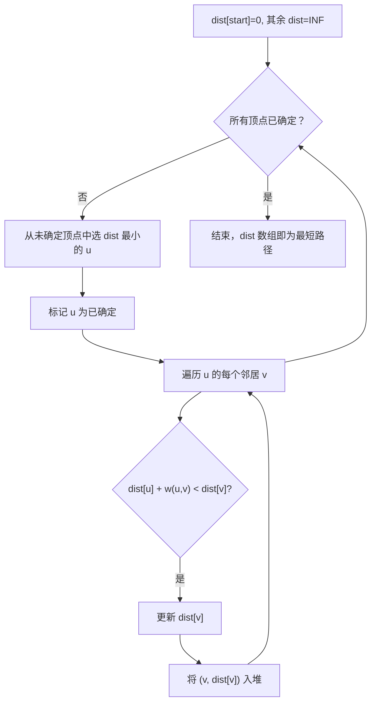
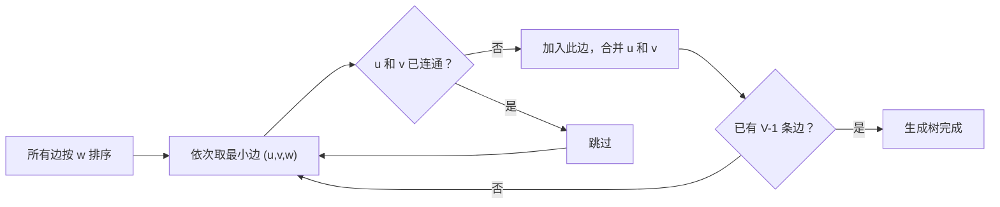

建议先阅读: [[B_栈_Stack|B 栈 Stack]], [[F_队列_Queue|F 队列 Queue]]

---

## 原理

图（Graph）由顶点（Vertex）和连接顶点的边（Edge）组成，是最灵活的数据结构之一，可表示社交网络、地图导航、依赖关系等。

### 图的分类

- **有向图 vs 无向图**: 边是否有方向
- **加权图 vs 无权图**: 边是否有权重
- **连通图 vs 非连通图**: 任意两点是否可达
- **稠密图 vs 稀疏图**: E ~ V^2（稠密）或 E ~ V（稀疏）

### 相关术语

- 度（Degree）: 顶点连接的边数
- 出度/入度: 有向图中从该顶点出发/指向该顶点的边数
- 路径: 顶点序列，相邻顶点间有边
- 环: 起点等于终点的路径

### 存储方式

| 方式 | 空间 | 判边 | 遍历邻居 | 适用 |
|------|------|------|----------|------|
| 邻接矩阵 | O(V^2) | O(1) | O(V) | 稠密图 |
| 邻接表 | O(V+E) | O(degree) | O(degree) | 稀疏图 |

---

## 实现

### 加权邻接表

无权图的 BFS 只能求最短路径长度（边数），而 Dijkstra 需要边权重。我们用加权邻接表：

```c
#include <stdlib.h>
#include <limits.h>

// 加权邻接表边节点
typedef struct WeightedAdjNode {
    int vertex;
    int weight;
    struct WeightedAdjNode* next;
} WeightedAdjNode;

typedef struct {
    int V;
    WeightedAdjNode** adj;
} WeightedGraph;

WeightedAdjNode* create_wadj_node(int v, int w) {
    WeightedAdjNode* node = malloc(sizeof(WeightedAdjNode));
    node->vertex = v;
    node->weight = w;
    node->next = NULL;
    return node;
}

void wgraph_init(WeightedGraph* g, int V) {
    g->V = V;
    g->adj = calloc(V, sizeof(WeightedAdjNode*));
}

void wgraph_destroy(WeightedGraph* g) {
    for (int i = 0; i < g->V; i++) {
        WeightedAdjNode* cur = g->adj[i];
        while (cur) {
            WeightedAdjNode* tmp = cur;
            cur = cur->next;
            free(tmp);
        }
    }
    free(g->adj);
}

// directed=1 有向，directed=0 无向
void wgraph_add_edge(WeightedGraph* g, int u, int v, int w, int directed) {
    WeightedAdjNode* node = create_wadj_node(v, w);
    node->next = g->adj[u];
    g->adj[u] = node;
    if (!directed)
        wgraph_add_edge(g, v, u, w, 1);
}
```

### BFS / DFS 遍历（无权图）

```c
typedef struct AdjNode { int vertex; struct AdjNode* next; } AdjNode;

void graph_bfs(AdjNode** adj, int V, int start) {
    int* visited = calloc(V, sizeof(int));
    int* queue = malloc(V * sizeof(int));
    int head = 0, tail = 0;
    visited[start] = 1;
    queue[tail++] = start;
    while (head < tail) {
        int u = queue[head++];
        for (AdjNode* cur = adj[u]; cur; cur = cur->next)
            if (!visited[cur->vertex]) {
                visited[cur->vertex] = 1;
                queue[tail++] = cur->vertex;
            }
    }
    free(visited); free(queue);
}

void graph_dfs(AdjNode** adj, int V, int start) {
    int* visited = calloc(V, sizeof(int));
    int stack[V], top = 0;
    stack[top++] = start;
    while (top > 0) {
        int u = stack[--top];
        if (visited[u]) continue;
        visited[u] = 1;
        for (AdjNode* cur = adj[u]; cur; cur = cur->next)
            if (!visited[cur->vertex])
                stack[top++] = cur->vertex;
    }
    free(visited);
}
```

### Dijkstra 最短路径

Dijkstra 的核心思想是**贪心**：每次从未确定的顶点中选出距离起点最近的顶点，用它去松弛其邻居。重复 V 次，每次选最近顶点需要 O(V)，总 O(V^2)。用最小堆优化后选顶点降为 O(log V)，总 O((V+E)log V)。



C 实现：用数组模拟最小堆作为优先队列。

```c
// ---------- 最小堆优先队列 ----------
typedef struct { int dist; int vertex; } PQNode;

typedef struct { PQNode* data; int size; int cap; } MinPQ;

void pq_init(MinPQ* pq, int cap) {
    pq->data = malloc(cap * sizeof(PQNode));
    pq->size = 0; pq->cap = cap;
}
void pq_destroy(MinPQ* pq) { free(pq->data); }

static void pq_swap(PQNode* a, PQNode* b) {
    PQNode t = *a; *a = *b; *b = t;
}

void pq_push(MinPQ* pq, int dist, int v) {
    int i = pq->size++;
    pq->data[i] = (PQNode){dist, v};
    while (i > 0) {
        int p = (i - 1) / 2;
        if (pq->data[p].dist <= pq->data[i].dist) break;
        pq_swap(&pq->data[p], &pq->data[i]);
        i = p;
    }
}

int pq_pop(MinPQ* pq, int* out_dist, int* out_v) {
    if (pq->size == 0) return -1;
    *out_dist = pq->data[0].dist;
    *out_v = pq->data[0].vertex;
    pq->data[0] = pq->data[--pq->size];
    int i = 0;
    while (1) {
        int smallest = i;
        int left = 2 * i + 1, right = 2 * i + 2;
        if (left < pq->size && pq->data[left].dist < pq->data[smallest].dist)
            smallest = left;
        if (right < pq->size && pq->data[right].dist < pq->data[smallest].dist)
            smallest = right;
        if (smallest == i) break;
        pq_swap(&pq->data[i], &pq->data[smallest]);
        i = smallest;
    }
    return 0;
}

int pq_empty(MinPQ* pq) { return pq->size == 0; }
// ---------- 堆结束 ----------

void dijkstra(WeightedGraph* g, int start, int* dist) {
    for (int i = 0; i < g->V; i++) dist[i] = INT_MAX / 2;
    dist[start] = 0;

    MinPQ pq;
    pq_init(&pq, g->V * 2);
    pq_push(&pq, 0, start);

    while (!pq_empty(&pq)) {
        int d, u;
        pq_pop(&pq, &d, &u);
        if (d != dist[u]) continue;   // 过期条目跳过

        for (WeightedAdjNode* cur = g->adj[u]; cur; cur = cur->next) {
            int v = cur->vertex, w = cur->weight;
            if (dist[u] + w < dist[v]) {
                dist[v] = dist[u] + w;
                pq_push(&pq, dist[v], v);
            }
        }
    }
    pq_destroy(&pq);
}
```

### Kruskal 最小生成树

Kruskal 的核心思想：将所有边按权重排序，从小到大依次加入，若加入后不形成环则保留，直到有 V-1 条边。



C 实现需要并查集，这里直接内联一个简易版：

```c
#include <stdlib.h>

typedef struct { int u, v, w; } KEdge;

int kedge_cmp(const void* a, const void* b) {
    return ((KEdge*)a)->w - ((KEdge*)b)->w;
}

static int kruskal_find(int* parent, int x) {
    return parent[x] == x ? x : (parent[x] = kruskal_find(parent, parent[x]));
}

int kruskal(int V, KEdge* edges, int E) {
    int* parent = malloc(V * sizeof(int));
    int* rank = calloc(V, sizeof(int));
    for (int i = 0; i < V; i++) parent[i] = i;

    qsort(edges, E, sizeof(KEdge), kedge_cmp);

    int total_weight = 0, cnt = 0;
    for (int i = 0; i < E && cnt < V - 1; i++) {
        int pu = kruskal_find(parent, edges[i].u);
        int pv = kruskal_find(parent, edges[i].v);
        if (pu != pv) {
            if (rank[pu] < rank[pv]) { int t = pu; pu = pv; pv = t; }
            parent[pv] = pu;
            if (rank[pu] == rank[pv]) rank[pu]++;
            total_weight += edges[i].w;
            cnt++;
        }
    }
    free(parent); free(rank);
    return total_weight;
}
```

---

## 常用算法复杂度

| 算法 | 用途 | 时间复杂度 | 条件 |
|------|------|-----------|------|
| BFS | 无权最短路径、层序遍历 | O(V+E) | 任意图 |
| DFS | 遍历、环检测、连通分量 | O(V+E) | 任意图 |
| Dijkstra | 单源最短路径 | O((V+E)logV) | 非负权 |
| Bellman-Ford | 单源最短路径（可负权） | O(VE) | 可检负环 |
| Floyd-Warshall | 全源最短路径 | O(V^3) | 稠密图 |
| Kruskal | 最小生成树 | O(E log E) | 任意图 |
| Prim | 最小生成树 | O((V+E)logV) | 任意图 |

---

## 应用场景

- **地图导航**: 加权图 + Dijkstra/A* 寻路
- **社交网络**: 好友推荐（二度好友）、影响力分析（连通分量大小）
- **包依赖管理**: 有向无环图（DAG）+ 拓扑排序确定安装顺序

---

## 练习

| 题号 | 题目 | 难度 | 知识点 |
|------|------|------|--------|
| P3371 | 单源最短路径 | 普及 | Dijkstra/Bellman-Ford |
| P4779 | 单源最短路径（标准版） | 提高 | 堆优化 Dijkstra |
| P3366 | 最小生成树 | 普及+ | Kruskal/Prim |
| P5318 | 查找文献 | 入门 | BFS/DFS 遍历 |
