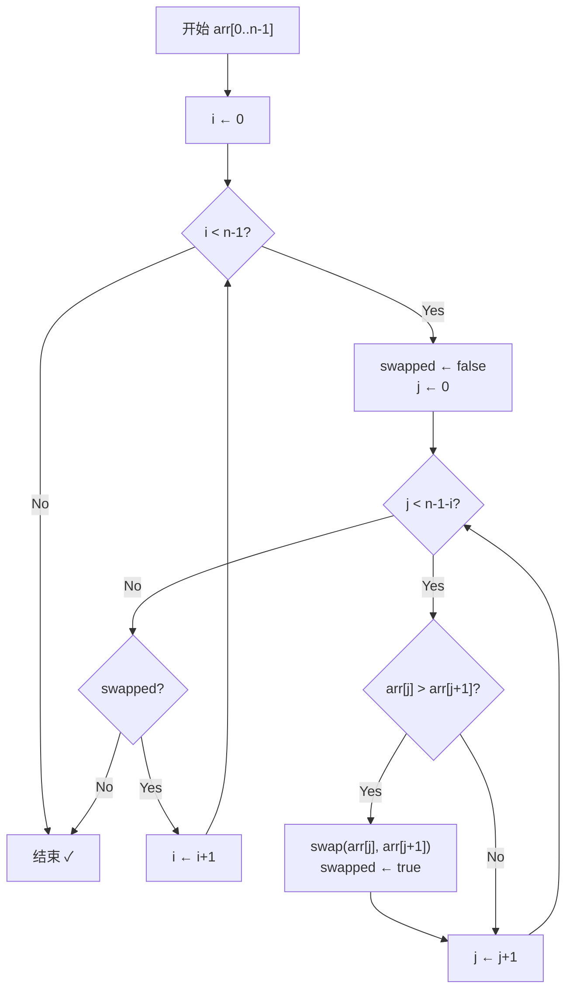
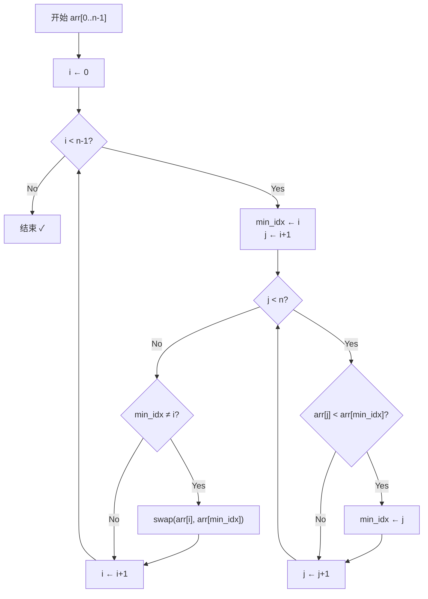
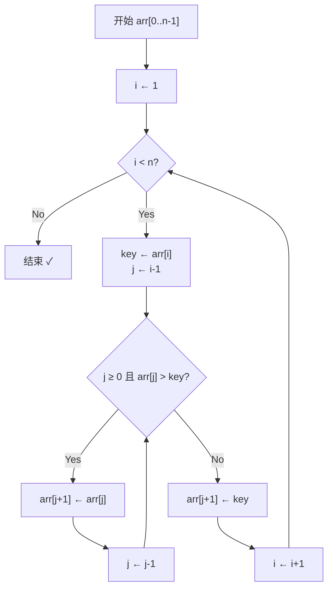
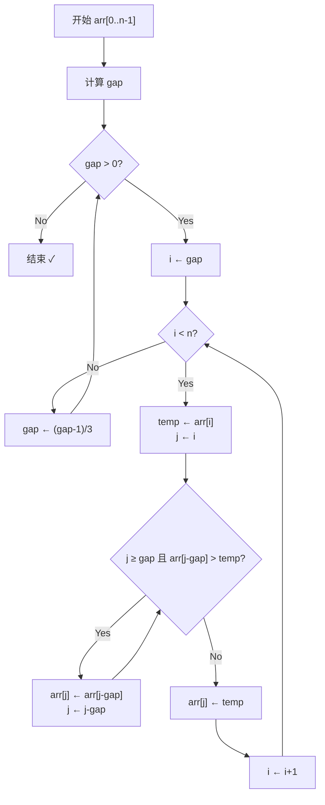
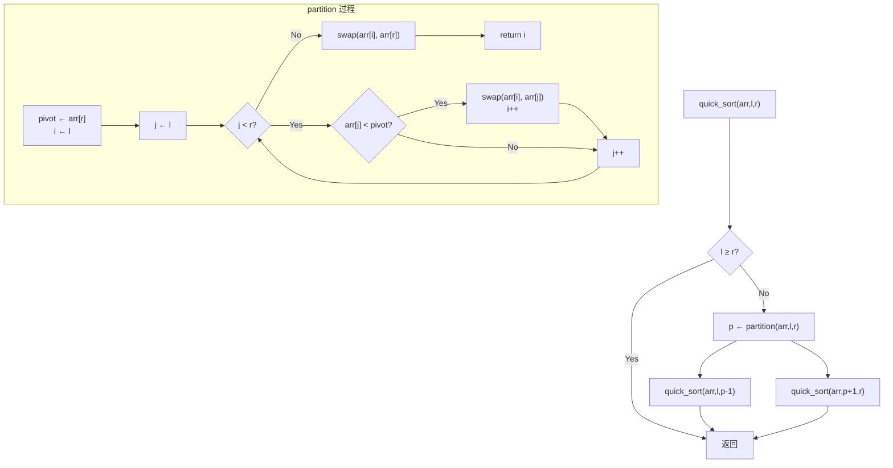
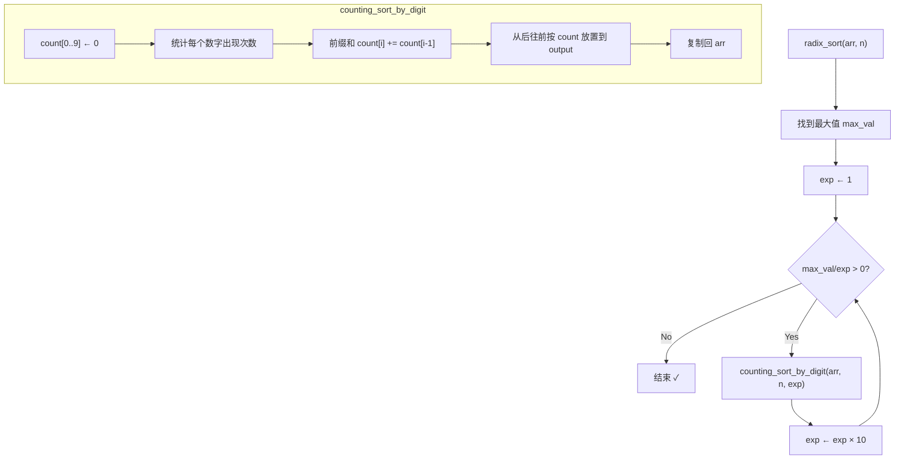

建议先阅读: [[D_容器_Container|容器概览]], [[../算法/算法技巧/递推递归|递推递归]]

---

## 原理

排序是将一组无序数据按特定规则重新排列的过程。

### 八大排序总览

| 算法 | 平均 | 最好 | 最坏 | 空间 | 稳定 |
|------|------|------|------|------|------|
| 冒泡排序 | O(n^2) | O(n) | O(n^2) | O(1) | 稳定 |
| 选择排序 | O(n^2) | O(n^2) | O(n^2) | O(1) | 不稳定 |
| 插入排序 | O(n^2) | O(n) | O(n^2) | O(1) | 稳定 |
| 希尔排序 | O(n^1.3) | O(n) | O(n^2) | O(1) | 不稳定 |
| 归并排序 | O(n log n) | O(n log n) | O(n log n) | O(n) | 稳定 |
| 快速排序 | O(n log n) | O(n log n) | O(n^2) | O(log n) | 不稳定 |
| 堆排序 | O(n log n) | O(n log n) | O(n log n) | O(1) | 不稳定 |
| 基数排序 | $O(n \cdot k)$ | $O(n \cdot k)$ | $O(n \cdot k)$ | $O(n + k)$ | 稳定 |

> 注：$k$ 是最大数字的位数（基数排序）或计数范围。堆排序的 $O(n \log n)$ 建堆是参考而非必须（线性建堆 $O(n)$ 可行），但总体复杂度由 $\log n$ 层下沉操作主导。

### 比较排序的理论下界

任何只通过比较元素大小来决定排序顺序的算法在最坏情况下至少需要 $\Omega(n \log n)$ 次比较。这不是针对某个算法的限制，而是对所有基于比较的排序的统一生物学极限。

$$
\text{最坏情况比较次数} \geq \log_2(n!)
$$

证明思路：$n$ 个元素有 $n!$ 种可能的排列。每次比较只能产生两种结果（大于或小于），即每次比较将可能结果集最多减半——每个比较最多提供 1 bit 信息。要从 $n!$ 种可能中找到正确的排列，需要 $\log_2(n!)$ 次比较。由 Stirling 近似公式：

$$
\log_2(n!) \approx n \log_2 n - n \log_2 e + \Theta(\log n) \approx n \log_2 n - 1.44n
$$

这一下界在渐近意义下解释了为什么冒泡/选择/插入排序（$O(n^2)$）在 $n$ 足够大时的本质劣势——它们每次比较获取的信息远低于 1 bit 的理论上限。

**非比较排序如何打破下界**：基数排序和计数排序不通过比较——它们利用键的数值结构直接映射到输出位置。计数排序的 $O(n+k)$ 复杂度不受 $\log_2(n!)$ 约束，因为它不需要比较任意两个元素的大小。

### 排序的稳定性

稳定的排序保证相等元素的相对顺序不变。在多关键字排序中，稳定性是基础性质：

```
按 (年级, 姓名) 排序 → 先按姓名稳定排序，再按年级稳定排序
两次稳定排序 = 多关键字排序（基数排序的思想推广）
```

| 稳定 | 不稳定 | 
|------|------|
| 冒泡、插入、归并、基数 | 选择、希尔、快速、堆 |

快速排序在 partition 过程中，与 pivot 相等的元素可能被交换到 pivot 的任意一侧，破坏与 pivot 相等的其他元素的顺序。归并排序在合并阶段保证了相等元素先取左半部分的元素，自然维护稳定性。堆排序的父子交换操作跳过了相等元素的顺序保证。

---

## 实现

### 冒泡排序



```c
void bubble_sort(int* arr, int n) {
    for (int i = 0; i < n - 1; i++) {
        int swapped = 0;
        for (int j = 0; j < n - 1 - i; j++) {
            if (arr[j] > arr[j + 1]) {
                int t = arr[j]; arr[j] = arr[j + 1]; arr[j + 1] = t;
                swapped = 1;
            }
        }
        if (!swapped) break;
    }
}
```

每轮把最大值冒泡到最右端。优化版通过 swapped 标志检测提前退出，最好情况 O(n)。

### 冒泡排序逐步推导

数组: `[5, 3, 8, 6, 2, 7, 1, 4]` (n=8)

**核心原理**：相邻元素两两比较，如果逆序则交换。每轮将当前未排序区间的最大值"冒泡"到最右端。通过 swapped 标志检测是否已有序。

| 轮次 | 操作区间 | 数组状态 | 交换次数 | 操作原理 |
|:---:|:---:|:---|:---:|:---|
| 初始 | - | `[5, 3, 8, 6, 2, 7, 1, 4]` | - | 原始未排序数组 |
| 第1轮 | j=0..6 | `[3, 5, 6, 2, 7, 1, 4, **8**]` | 5 | 5>3→交换, 5<8→不变, 8>6→交换, 8>2→交换, 8>7→交换, 8>1→交换, 8>4→交换, 8到达正确位置 |
| 第2轮 | j=0..5 | `[3, 5, 2, 6, 1, 4, **7**, 8]` | 3 | 5>2→交换, 6>1→交换, 6>4→交换, 7到达正确位置 |
| 第3轮 | j=0..4 | `[3, 2, 5, 1, 4, **6**, 7, 8]` | 3 | 3>2→交换, 5>1→交换, 5>4→交换, 6到达正确位置 |
| 第4轮 | j=0..3 | `[2, 3, 1, 4, **5**, 6, 7, 8]` | 2 | 3>1→交换, 5已在正确位置 |
| 第5轮 | j=0..2 | `[2, 1, 3, **4**, 5, 6, 7, 8]` | 1 | 2>1→交换 |
| 第6轮 | j=0..1 | `[1, 2, **3**, 4, 5, 6, 7, 8]` | 1 | 2>1→交换 |
| 第7轮 | j=0..0 | `[1, 2, 3, 4, 5, 6, 7, 8]` | 0 | swapped=false → 提前退出 |
| 结果 | - | `[1, 2, 3, 4, 5, 6, 7, 8]` ✓ | 15 | 共8个数，最多C(8,2)=28次交换，实际15次 |

**数学分析**：
- 比较次数：最好 O(n)，最坏 O(n²)，平均 O(n²)
- 交换次数：等于逆序对数量，平均 n(n-1)/4
- 每轮可确定一个元素的位置，至多 n-1 轮

### 选择排序



```c
void selection_sort(int* arr, int n) {
    for (int i = 0; i < n - 1; i++) {
        int min_idx = i;
        for (int j = i + 1; j < n; j++)
            if (arr[j] < arr[min_idx]) min_idx = j;
        if (min_idx != i) {
            int t = arr[i]; arr[i] = arr[min_idx]; arr[min_idx] = t;
        }
    }
}
```

每轮从未排序区找最小值放到最前。比较次数恒为 O(n^2)，但交换次数最多 n-1 次。

### 选择排序逐步推导

数组: `[5, 3, 8, 6, 2, 7, 1, 4]` (n=8)

**核心原理**：每轮从未排序区间中找到最小值，与未排序区间的第一个元素交换。已排序区间逐步扩大。

**数学公式**：第 i 轮从未排序区 arr[i..n-1] 中找最小值，比较次数 = n-1-i

| 轮次 | 未排序区间 | 最小值 | 数组状态 | 操作原理 |
|:---:|:---|:---:|:---|:---|
| 初始 | [0..7] | - | `[5, 3, 8, 6, 2, 7, 1, 4]` | 原始未排序 |
| 第1轮 | [0..7] min=6 | 1 | `[**1**, 3, 8, 6, 2, 7, 5, 4]` | 遍历找到最小值1(位置6)，与arr[0]=5交换 |
| 第2轮 | [1..7] min=4 | 2 | `[1, **2**, 8, 6, 3, 7, 5, 4]` | 剩余中最小值2(位置4)，与arr[1]=3交换 |
| 第3轮 | [2..7] min=3 | 3 | `[1, 2, **3**, 6, 8, 7, 5, 4]` | 最小值3(位置4)，与arr[2]=8交换 |
| 第4轮 | [3..7] min=4 | 4 | `[1, 2, 3, **4**, 8, 7, 5, 6]` | 最小值4(位置7)，与arr[3]=6交换 |
| 第5轮 | [4..7] min=5 | 5 | `[1, 2, 3, 4, **5**, 7, 8, 6]` | 最小值5(位置6)，与arr[4]=8交换 |
| 第6轮 | [5..7] min=6 | 6 | `[1, 2, 3, 4, 5, **6**, 8, 7]` | 最小值6(位置7)，与arr[5]=7交换 |
| 第7轮 | [6..7] min=7 | 7 | `[1, 2, 3, 4, 5, 6, **7**, 8]` | 最小值7(位置7)，与arr[6]=8交换 |
| 结果 | - | - | `[1, 2, 3, 4, 5, 6, 7, 8]` ✓ | 经过7轮选择-交换，共比较28次，交换7次 |

**数学分析**：
- 比较次数：∑(n-i-1) = n(n-1)/2 = O(n²)，与初始顺序无关
- 交换次数：n-1（每次最多1次交换），优于冒泡
- 不稳定：如 `[5a, 5b, 1]` → 第1轮将1与5a交换 → `[1, 5b, 5a]`，5a与5b相对顺序改变

### 插入排序



```c
void insertion_sort(int* arr, int n) {
    for (int i = 1; i < n; i++) {
        int key = arr[i];
        int j = i - 1;
        while (j >= 0 && arr[j] > key) {
            arr[j + 1] = arr[j];
            j--;
        }
        arr[j + 1] = key;
    }
}
```

像整理扑克牌，逐张插入到已排序区的正确位置。对基本有序数据接近 O(n)。

### 插入排序逐步推导

数组: `[5, 3, 8, 6, 2, 7, 1, 4]` (n=8)

**核心原理**：将数组分为已排序区[0..i-1]和未排序区[i..n-1]。每次取未排序区的第一个元素 key，在已排序区中从右向左扫描，找到合适位置插入。

**数学公式**：第 i 轮插入 key = arr[i]，最坏需比较 i 次，移动 i 次

| 轮次 | 已排序区间 | key | 插入位置 | 数组状态 | 操作原理 |
|:---:|:---|:---:|:---:|:---|:---|
| 初始 | [0..0] | - | - | `[**5**, 3, 8, 6, 2, 7, 1, 4]` | 首元素视为已排序 |
| 第1轮 | [0..1] | 3 | j=0 | `[**3, 5**, 8, 6, 2, 7, 1, 4]` | 3<5→5右移，3插入arr[0] |
| 第2轮 | [0..2] | 8 | j=2 | `[**3, 5, 8**, 6, 2, 7, 1, 4]` | 8>5→不动，8插入arr[2] |
| 第3轮 | [0..3] | 6 | j=2 | `[**3, 5, 6, 8**, 2, 7, 1, 4]` | 6<8→8右移，6>5→插入arr[2] |
| 第4轮 | [0..4] | 2 | j=0 | `[**2, 3, 5, 6, 8**, 7, 1, 4]` | 2依次与8,6,5,3比较→全部右移，2插入arr[0] |
| 第5轮 | [0..5] | 7 | j=4 | `[**2, 3, 5, 6, 7, 8**, 1, 4]` | 7<8→8右移，7>6→插入arr[4] |
| 第6轮 | [0..6] | 1 | j=0 | `[**1, 2, 3, 5, 6, 7, 8**, 4]` | 1依次与8,7,6,5,3,2比较→右移，1插入arr[0] |
| 第7轮 | [0..7] | 4 | j=3 | `[**1, 2, 3, 4, 5, 6, 7, 8**]` | 4与8,7,6,5比较→右移，4>3→插入arr[3] |
| 结果 | - | - | - | `[1, 2, 3, 4, 5, 6, 7, 8]` ✓ | 共7轮插入，比较+移动约20次 |

**数学分析**：
- 最好情况（已有序）：每轮比较1次，O(n)
- 最坏情况（逆序）：每轮比较i次，∑i = n(n-1)/2 = O(n²)
- 平均情况：每轮比较约i/2次，O(n²)
- 稳定排序（相等时不移动）

### 希尔排序



```c
void shell_sort(int* arr, int n) {
    int gap = 1;
    while (gap < n / 3) gap = 3 * gap + 1;
    while (gap > 0) {
        for (int i = gap; i < n; i++) {
            int temp = arr[i];
            int j = i;
            while (j >= gap && arr[j - gap] > temp) {
                arr[j] = arr[j - gap];
                j -= gap;
            }
            arr[j] = temp;
        }
        gap = (gap - 1) / 3;
    }
}
```

大间隔分组插入排序（粗调），逐步缩小间隔（精调），最后 gap=1 时数据已基本有序。

### 希尔排序逐步推导

数组: `[5, 3, 8, 6, 2, 7, 1, 4]` (n=8)

**核心原理**：先进行大间隔的插入排序（宏观粗调），使数组近似有序；再逐步缩小间隔进行微观精调。比普通插入排序更好地利用了"基本有序时插入排序高效"的特点。

**增量序列**：Knuth 序列 gap = 1, 4, 13, 40, ...（按 gap = 3·gap + 1 递增，再反向使用）

| gap | 子序列 | 对子序列排序后 | 操作原理 |
|:---:|:---|:---|:---|
| 4 | `[5, 2]`, `[3, 7]`, `[8, 1]`, `[6, 4]` | `[2, 5]`, `[3, 7]`, `[1, 8]`, `[4, 6]` | gap=4 将数组分成4组：(0,4), (1,5), (2,6), (3,7)；每组内部做插入排序 |
| 4 | 整体 | `[**2**, **3**, **1**, **4**, **5**, **7**, **8**, **6**]` | 经过 gap=4 粗调后，每个元素距离正确位置不超过 4 |
| 1 | 整体 | `[1, 2, 3, 4, 5, 6, 7, 8]` | gap=1 即为普通插入排序。由于数组已基本有序（每个元素离正确位置很近），只需少量比较和移动 |

**详细演示（gap=4 分组）**：

分组1 (i=0,4): `[5, 2]` 插入排序 → `[2, 5]`
- 原理：间隔4的插入排序，将2插入到5前面

分组2 (i=1,5): `[3, 7]` 插入排序 → `[3, 7]`
- 原理：已有序，无需移动

分组3 (i=2,6): `[8, 1]` 插入排序 → `[1, 8]`
- 原理：1<8→8右移，1插入arr[2]

分组4 (i=3,7): `[6, 4]` 插入排序 → `[4, 6]`
- 原理：4<6→6右移，4插入arr[3]

gap=4 后结果: `[2, 3, 1, 4, 5, 7, 8, 6]`

**详细演示（gap=1 插入排序）**：

| i | key | 操作 | 数组 |
|:---:|:---:|:---|:---|
| 1 | 3 | 3<2→不移动 | `[2, 3, 1, 4, 5, 7, 8, 6]` |
| 2 | 1 | 1<3→3右移, 1<2→2右移, 1插入arr[0] | `[1, 2, 3, 4, 5, 7, 8, 6]` |
| 3 | 4 | 4>3→不移动 | `[1, 2, 3, 4, 5, 7, 8, 6]` |
| 4 | 5 | 5>4→不移动 | `[1, 2, 3, 4, 5, 7, 8, 6]` |
| 5 | 7 | 7>5→不移动 | `[1, 2, 3, 4, 5, 7, 8, 6]` |
| 6 | 8 | 8>7→不移动 | `[1, 2, 3, 4, 5, 7, 8, 6]` |
| 7 | 6 | 6<8→8右移, 6<7→7右移, 6>5→插入arr[5] | `[1, 2, 3, 4, 5, 6, 7, 8]` |

**数学分析**：
- 时间复杂度依赖于增量序列
- Knuth 序列（gap = 3·gap + 1）：平均 O(n^(3/2)) ≈ O(n^(1.3))
- Hibbard 序列（gap = 2^k - 1）：最坏 O(n^(3/2))
- Sedgewick 序列：最坏 O(n^(4/3))
- 空间复杂度：O(1) 原地排序
- 不稳定：间隔分组导致相同元素可能交换位置

### 归并排序

```mermaid
graph TD
    A["arr[l..r]"] --> B{"l ≥ r?"}
    B -->|Yes| C["返回"]
    B -->|No| D["m ← (l+r)/2"]
    D --> E["排序左半: merge_sort(arr,l,m)"]
    D --> F["排序右半: merge_sort(arr,m+1,r)"]
    E --> G["合并: merge(arr,l,m,r)"]
    F --> G
    G --> H["返回"]
    subgraph merge 过程
        I["i=l, j=m+1, k=0"] --> J{"i≤m 且 j≤r?"}
        J -->|arr[i]≤arr[j]| K["temp[k++] = arr[i++]"]
        J -->|arr[i]>arr[j]| L["temp[k++] = arr[j++]"]
        K --> J
        L --> J
        J -->|左半有剩余| M["复制 arr[i..m]"]
        J -->|右半有剩余| N["复制 arr[j..r]"]
        M --> O["复制回 arr[l..r]"]
        N --> O
    end
```

```c
#include <stdlib.h>
#include <string.h>

static void merge(int* arr, int l, int m, int r) {
    int* temp = malloc((r - l + 1) * sizeof(int));
    int i = l, j = m + 1, k = 0;
    while (i <= m && j <= r)
        temp[k++] = (arr[i] <= arr[j]) ? arr[i++] : arr[j++];
    while (i <= m) temp[k++] = arr[i++];
    while (j <= r) temp[k++] = arr[j++];
    memcpy(arr + l, temp, k * sizeof(int));
    free(temp);
}

void merge_sort(int* arr, int l, int r) {
    if (l >= r) return;
    int m = l + (r - l) / 2;
    merge_sort(arr, l, m);
    merge_sort(arr, m + 1, r);
    merge(arr, l, m, r);
}
```

分治法：递归拆半 -> 分别排序 -> 合并两个有序数组。T(n) = 2T(n/2) + O(n) => O(n log n)。

### 归并排序逐步推导

数组: `[5, 3, 8, 6, 2, 7, 1, 4]` (n=8)

**核心原理**：分治法。递归地将数组从中间拆分为两半，分别排序，再合并两个有序数组。T(n) = 2T(n/2) + O(n)。

**递归树（分治过程）**：

```
                    [5, 3, 8, 6, 2, 7, 1, 4]         ← 原始
                   /                            \
          [5, 3, 8, 6]                    [2, 7, 1, 4]       ← 第1层拆分
         /              \                /              \
     [5, 3]           [8, 6]         [2, 7]           [1, 4]   ← 第2层拆分
    /      \         /      \        /      \         /      \
  [5]     [3]      [8]     [6]     [2]     [7]      [1]     [4]  ← 第3层：单元素
```

**合并过程（自底向上）**：

| 层次 | 合并区间 | 操作 | 合并后数组 |
|:---:|:---|:---|:---|
| 第3层 | `[3,5]` | 合并 `[5]`和`[3]` | `[**3, 5**, 8, 6, 2, 7, 1, 4]` |
| 第3层 | `[6,8]` | 合并 `[8]`和`[6]` | `[3, 5, **6, 8**, 2, 7, 1, 4]` |
| 第3层 | `[2,7]` | 合并 `[2]`和`[7]` | `[3, 5, 6, 8, **2, 7**, 1, 4]` |
| 第3层 | `[1,4]` | 合并 `[1]`和`[4]` | `[3, 5, 6, 8, 2, 7, **1, 4**]` |
| 第2层 | `[3,5,6,8]` | 合并 `[3,5]`和`[6,8]` | `[**3, 5, 6, 8**, 2, 7, 1, 4]` |
| 第2层 | `[1,2,4,7]` | 合并 `[2,7]`和`[1,4]` | `[3, 5, 6, 8, **1, 2, 4, 7**]` |
| 第1层 | `[1..8]` | 合并 `[3,5,6,8]`和`[1,2,4,7]` | `[**1, 2, 3, 4, 5, 6, 7, 8**]` ✓ |

**最后一步合并详解（合并 [3,5,6,8] 和 [1,2,4,7]）**：

- 原理：两个指针 i 和 j 分别指向两个有序数组开头，每次取较小的放入临时数组
- 3>1 → temp[0]=1, j++ → 3>2 → temp[1]=2, j++ → 3<4 → temp[2]=3, i++ 
- 5>4 → temp[3]=4, j++ → 5<7 → temp[4]=5, i++ → 6<7 → temp[5]=6, i++
- 8>7 → temp[6]=7, j++ → 左半剩余[8] → temp[7]=8

**数学分析**：
- 递推式：T(n) = 2T(n/2) + O(n)，由主定理得 T(n) = O(n log n)
- 空间复杂度：O(n)（需要临时数组）
- 稳定排序：合并时左半小或相等时先取左半

### 快速排序



```c
    int pivot = arr[high];
    int i = low;
    for (int j = low; j < high; j++) {
        if (arr[j] < pivot) {
            int t = arr[i]; arr[i] = arr[j]; arr[j] = t;
            i++;
        }
    }
    int t = arr[i]; arr[i] = arr[high]; arr[high] = t;
    return i;
}

void quick_sort(int* arr, int low, int high) {
    if (low >= high) return;
    int p = partition(arr, low, high);
    quick_sort(arr, low, p - 1);
    quick_sort(arr, p + 1, high);
}
```

选基准 -> 分区（小的放左，大的放右）-> 递归排左右。最坏 O(n^2)（有序时最右 pivot），可通过三数取中或随机 pivot 避免。

### 三数取中优化

```c
int median_of_three(int* arr, int low, int high) {
    int mid = low + (high - low) / 2;
    if (arr[low] > arr[mid]) { int t = arr[low]; arr[low] = arr[mid]; arr[mid] = t; }
    if (arr[low] > arr[high]) { int t = arr[low]; arr[low] = arr[high]; arr[high] = t; }
    if (arr[mid] > arr[high]) { int t = arr[mid]; arr[mid] = arr[high]; arr[high] = t; }
    int t = arr[mid]; arr[mid] = arr[high]; arr[high] = t;
    return arr[high];
}
```

### 快速排序逐步推导

数组: `[5, 3, 8, 6, 2, 7, 1, 4]` (n=8)

**核心原理**：选一个基准（pivot），将数组分为小于基准和大于基准两部分（partition），然后递归排序两部分。pivot 最终在正确位置。

**详细步骤（使用最右元素作为 pivot）**：

#### 第1层分区: arr[0..7], pivot=4

| j | arr[j] | arr[j] < 4? | 操作 | 数组状态 |
|:---:|:---:|:---:|:---|:---|
| 0 | 5 | 否 | i=0不变 | `[5, 3, 8, 6, 2, 7, 1, **4**]` |
| 1 | 3 | 是 | swap(arr[0],arr[1]), i=1 | `[**3**, 5, 8, 6, 2, 7, 1, **4**]` |
| 2 | 8 | 否 | i=1不变 | `[3, 5, 8, 6, 2, 7, 1, **4**]` |
| 3 | 6 | 否 | i=1不变 | `[3, 5, 8, 6, 2, 7, 1, **4**]` |
| 4 | 2 | 是 | swap(arr[1],arr[4]), i=2 | `[3, **2**, 8, 6, 5, 7, 1, **4**]` |
| 5 | 7 | 否 | i=2不变 | `[3, 2, 8, 6, 5, 7, 1, **4**]` |
| 6 | 1 | 是 | swap(arr[2],arr[6]), i=3 | `[3, 2, **1**, 6, 5, 7, 8, **4**]` |
| - | last | - | swap(arr[3],arr[7]), pivot=4归位 | `[3, 2, 1, **4**, 5, 7, 8, 6]` ✓ |

partition 返回 p=3，分治：
- 左半 `[3, 2, 1]` 递归排序
- 右半 `[5, 7, 8, 6]` 递归排序

#### 第2层左半: arr[0..2]=[3, 2, 1], pivot=1

| j | arr[j] | <1? | 操作 | 数组状态 |
|:---:|:---:|:---:|:---|:---|
| 0 | 3 | 否 | i=0 | `[3, 2, **1**]` |
| 1 | 2 | 否 | i=0 | `[3, 2, **1**]` |
| - | last | - | swap(arr[0],arr[2]) | `[**1**, 2, 3]` ✓ |

p=0，左半无数据，右半 `[2, 3]` 递归

#### 第2层右半: arr[4..7]=[5, 7, 8, 6], pivot=6

| j | arr[j] | <6? | 操作 | 数组状态 |
|:---:|:---:|:---:|:---|:---|
| 4 | 5 | 是 | swap(arr[4],arr[4]), i=5 | `[**5**, 7, 8, **6**]` |
| 5 | 7 | 否 | i=5不变 | `[5, 7, 8, **6**]` |
| 6 | 8 | 否 | i=5不变 | `[5, 7, 8, **6**]` |
| - | last | - | swap(arr[5],arr[7]) | `[5, **6**, 8, 7]` ✓ |

p=5，左半 `[5]` 已有序，右半 `[8, 7]` 递归

继续递归得到最终结果：`[1, 2, 3, 4, 5, 6, 7, 8]`

**数学分析**：
- 平均 T(n) = 2T(n/2) + O(n) → O(n log n)，前提是每次 partition 均衡
- 最坏（有序数组+最右pivot）：T(n) = T(n-1) + O(n) → O(n²)
- 优化：三数取中（low, mid, high 的中位数作为 pivot）避免最坏情况
- 不稳定：partition 交换可能改变相同元素的相对顺序

### 堆排序

```mermaid
graph TD
    A["heap_sort(arr, n)"] --> B["建堆: i=n/2-1 → 0"]
    B --> C["heapify(arr, n, i)"]
    C --> D{"i--"}
    D -->|i≥0| C
    D -->|i<0| E["排序: i=n-1 → 1"]
    E --> F["swap(arr[0], arr[i])"]
    F --> G["heapify(arr, i, 0)"]
    G --> H{"i--"}
    H -->|i>0| F
    H -->|i≤0| I["结束 ✓"]
    subgraph heapify(arr, n, i)
        J["largest ← i\nleft ← 2i+1, right ← 2i+2"] --> K{"arr[left] > arr[largest]?"}
        K -->|Yes| L["largest ← left"]
        K -->|No| M{"arr[right] > arr[largest]?"}
        L --> M
        M -->|Yes| N["largest ← right"]
        M -->|No| O{"largest ≠ i?"}
        O -->|Yes| P["swap(arr[i], arr[largest])"]
        P --> Q["heapify(arr, n, largest)"]
        O -->|No| R["返回"]
    end
```

```c
    int largest = i;
    int left = 2 * i + 1, right = 2 * i + 2;
    if (left < n && arr[left] > arr[largest]) largest = left;
    if (right < n && arr[right] > arr[largest]) largest = right;
    if (largest != i) {
        int t = arr[i]; arr[i] = arr[largest]; arr[largest] = t;
        heapify(arr, n, largest);
    }
}

void heap_sort(int* arr, int n) {
    for (int i = n / 2 - 1; i >= 0; i--)
        heapify(arr, n, i);
    for (int i = n - 1; i > 0; i--) {
        int t = arr[0]; arr[0] = arr[i]; arr[i] = t;
        heapify(arr, i, 0);
    }
}
```

### 堆排序逐步推导

数组: `[5, 3, 8, 6, 2, 7, 1, 4]` (n=8)

**核心原理**：将数组看作完全二叉树，先构建最大堆（父节点 ≥ 子节点），然后反复将堆顶（最大值）与堆尾交换，缩小堆范围并调整。

**建堆过程（heapify 从 i=3 到 i=0）**：

```
初始数组:      [5, 3, 8, 6, 2, 7, 1, 4]
二叉树下标:    0  1  2  3  4  5  6  7
```

| i | 子树 | 操作 | 数组 |
|:---:|:---|:---|:---|
| 3 | [6, 4] | 6<4? 否 → 不变 | `[5, 3, 8, 6, 2, 7, 1, 4]` |
| 2 | [8, 7, 1] | 8最大 → 不变 | `[5, 3, 8, 6, 2, 7, 1, 4]` |
| 1 | [3, 6, 2, 4] | 6最大 → swap(3,6) | `[5, **6**, 8, **3**, 2, 7, 1, 4]` |
| 0 | [5, 6, 8] | 8最大 → swap(5,8) | `[**8**, 6, **5**, 3, 2, 7, 1, 4]` |
| 0续 | [5, 7, 1] | 7最大 → swap(5,7) | `[8, 6, **7**, 3, 2, **5**, 1, 4]` |

建堆完成: `[8, 6, 7, 3, 2, 5, 1, 4]` ✓（最大堆）

**排序过程（反复取堆顶交换到末尾）**：

| i | swap | heapify | 数组状态 | 操作原理 |
|:---:|:---:|:---|:---|:---|
| 7 | swap(0,7) | heapify(0..6) | `[**4**, 6, 7, 3, 2, 5, 1, **8**]` | 堆顶8→末尾，8已固定 |
| 7→6 | - | 4<6→4下沉 | `[**7**, 6, **4**, 3, 2, 5, 1, 8]` | 4与较大的子节点7交换 |
| 6 | swap(0,6) | heapify(0..5) | `[**1**, 6, 4, 3, 2, 5, **7**, 8]` | 堆顶7→末尾，7固定 |
| 6→5 | - | 1<6→1下沉 | `[**6**, **1**, 4, 3, 2, 5, 7, 8]` | 1与较大的子节点6交换 |
| 5 | swap(0,5) | heapify(0..4) | `[**5**, 1, 4, 3, 2, **6**, 7, 8]` | 堆顶6→末尾，6固定 |
| 5→4 | - | 5已最大 | `[**5**, 1, 4, 3, 2, 6, 7, 8]` | 5大于两个子节点，不交换 |
| 4 | swap(0,4) | heapify(0..3) | `[**2**, 1, 4, 3, **5**, 6, 7, 8]` | 堆顶5→末尾，5固定 |
| 4→3 | - | 2<4→2下沉 | `[**4**, 1, **2**, 3, 5, 6, 7, 8]` | 2与较大的子节点4交换 |
| 3 | swap(0,3) | heapify(0..2) | `[**3**, 1, 2, **4**, 5, 6, 7, 8]` | 堆顶4→末尾，4固定 |
| 3→2 | - | 3已最大 | `[**3**, 1, 2, 4, 5, 6, 7, 8]` | 3大于两个子节点，不交换 |
| 2 | swap(0,2) | heapify(0..1) | `[**2**, 1, **3**, 4, 5, 6, 7, 8]` | 堆顶3→末尾，3固定 |
| 1 | swap(0,1) | heapify(0..0) | `[**1**, **2**, 3, 4, 5, 6, 7, 8]` | 堆顶2→末尾，2固定 |
| 0 | - | - | `[**1**, 2, 3, 4, 5, 6, 7, 8]` ✓ | 只剩1个元素，排序完成 |

**数学分析**：
- 建堆：O(n)（每个非叶节点执行 heapify，实际复杂度 ∑(n/2^(h+1) * O(h)) = O(n)）
- 每次取堆顶 + heapify：O(log n)，共 n-1 次 → O(n log n)
- 总时间：O(n log n)，最坏也是 O(n log n)
- 空间：O(1) 原地
- 不稳定：堆顶与末尾交换可能改变顺序

### 基数排序



```c

static void counting_sort_by_digit(int* arr, int n, int exp) {
    int* output = malloc(n * sizeof(int));
    int count[10] = {0};
    for (int i = 0; i < n; i++) count[(arr[i] / exp) % 10]++;
    for (int i = 1; i < 10; i++) count[i] += count[i - 1];
    for (int i = n - 1; i >= 0; i--) {
        int digit = (arr[i] / exp) % 10;
        output[count[digit] - 1] = arr[i];
        count[digit]--;
    }
    memcpy(arr, output, n * sizeof(int));
    free(output);
}

void radix_sort(int* arr, int n) {
    if (n == 0) return;
    int max_val = arr[0];
    for (int i = 1; i < n; i++)
        if (arr[i] > max_val) max_val = arr[i];
    for (int exp = 1; max_val / exp > 0; exp *= 10)
        counting_sort_by_digit(arr, n, exp);
}
```

不比较大小，按每位数字稳定排序，从低位到高位依次进行。适用于整数，O(n*k)，k 为位数。

### 基数排序逐步推导

数组: `[5, 3, 8, 6, 2, 7, 1, 4]` (n=8)

**核心原理**：不基于比较，而是按数字的每一位（个位→十位→百位→...）分别进行稳定计数排序。低位排序后，高位排序时低位已有序。

**扩展为含两位数的数组**：`[53, 18, 62, 91, 37, 45, 84, 29]`（所有数 ≤ 99）

| exp | 按位排序 | 本轮依据 | count[0..9] | 结果 |
|:---:|:---|:---:|:---|:---|
| 1（个位） | 按个位数稳定排序 | 个位决定本轮顺序 | [0,1,1,1,1,1,1,1,1,1] | `[91, 62, 53, 84, 45, 37, 18, 29]` |
| 10（十位） | 按十位数稳定排序 | 十位作为主键，个位作为次键 | [1,1,1,2,1,1,0,0,1,1] | `[18, 29, 37, 45, 53, 62, 84, 91]` ✓ |

**逐位详解**：

**exp=1（个位排序）**：
```
原始: [53, 18, 62, 91, 37, 45, 84, 29]
个位: [ 3,  8,  2,  1,  7,  5,  4,  9]
```
- count 统计个位数字出现次数：`[0,1,1,1,1,1,1,1,1,1]`
- 前缀和：`[0,1,2,3,4,5,6,7,8,9]`
- 从后往前按 count 放置：
  - 29(个位9) → output[8]   | count[9]=9→8
  - 84(个位4) → output[3]   | count[4]=4→3
  - 45(个位5) → output[4]   | count[5]=5→4
  - ...
- 结果：`[91, 62, 53, 84, 45, 37, 18, 29]`（按个位升序）

**exp=10（十位排序）**：
```
上轮结果: [91, 62, 53, 84, 45, 37, 18, 29]
十位:     [ 9,  6,  5,  8,  4,  3,  1,  2]
```
- count 统计十位数字：`[0,1,1,1,1,1,1,1,1,1]`
- 前缀和：`[0,1,2,3,4,5,6,7,8,9]`
- 从后往前放置：
  - 29(十位2) → output[1]   | count[2]=2→1
  - 18(十位1) → output[0]   | count[1]=1→0
  - 37(十位3) → output[2]   | count[3]=3→2
  - ...
- 结果：`[18, 29, 37, 45, 53, 62, 84, 91]` ✓ 已完全有序

**对原始数组 [5, 3, 8, 6, 2, 7, 1, 4] 的基数排序**：

这些数只有个位（≤9），所以仅需 exp=1 一轮：

| i | arr[i] | 个位数 | count[0..9] |
|:---:|:---:|:---:|:---:|
| 0 | 5 | 5 | [0,0,0,0,0,1,0,0,0,0] |
| 1 | 3 | 3 | [0,0,0,1,0,1,0,0,0,0] |
| 2 | 8 | 8 | [0,0,0,1,0,1,0,0,1,0] |
| 3 | 6 | 6 | [0,0,0,1,0,1,0,1,1,0] |
| 4 | 2 | 2 | [0,0,1,1,0,1,0,1,1,0] |
| 5 | 7 | 7 | [0,0,1,1,0,1,0,1,1,1] |
| 6 | 1 | 1 | [0,1,1,1,0,1,0,1,1,1] |
| 7 | 4 | 4 | [0,1,1,1,1,1,0,1,1,1] |

前缀和：`[0,1,2,3,4,5,5,6,7,8]`

从后往前放：
- arr[7]=4, digit=4 → output[count[4]-1]=output[3] | count[4]=4→3
- arr[6]=1, digit=1 → output[count[1]-1]=output[0] | count[1]=1→0
- ...

最终结果：`[1, 2, 3, 4, 5, 6, 7, 8]` ✓

**数学分析**：
- 时间复杂度：O(k·n)，k 为位数（最大数字的十进制位数）
- 空间复杂度：O(n + k) ≈ O(n)（需要一个 output 数组和 count[10]）
- 稳定排序：计数排序从后往前保证稳定性
- 适用条件：非负整数（可扩展处理负数）
- 对比基于比较的排序（O(n log n)下界），当 k 很小时基数排序更优

---

## 各语言标准库对比

| 语言 | 标准库排序 |
|------|-----------|
| C | qsort（快速排序，O(n log n) 平均） |
| C++ | sort / stable_sort / partial_sort / nth_element |
| Java | Arrays.sort / Collections.sort（Dual-Pivot QuickSort / TimSort） |
| Python | list.sort / sorted（Timsort，稳定 O(n log n)） |
| Rust | slice::sort / sort_by（稳定归并排序 + 插入排序混合） |

### 选型指南

- **n < 50**: 插入排序（常数因子极小，cache 内全命中）
- **n < 1000**: 希尔排序或快速排序
- **n 很大，需要稳定**: 归并排序
- **n 很大，不要求稳定**: 快速排序（通用首选）
- **需要原地 + 最坏 $O(n \log n)$** : 堆排序
- **整数，范围小**: 基数排序
- **生产环境**: `std::sort`（Introsort：快排 + 堆排 + 插排混合）

### 为什么快速排序在实践中快于归并排序

快速排序和归并排序都是 $O(n \log n)$，但在实际运行中，快速排序通常快 2-3 倍。原因不在算法复杂度，而在硬件：

1. **原地操作 vs 额外数组**：快速排序的 partition 完全在原数组上进行，不需要临时数组。归并排序每次合并都需要一个 $O(n)$ 的临时数组，分配 + 拷贝 + 释放的成本累积后非常可观
2. **缓存空间局部性**：partition 阶段在数组的一个连续区间内双向扫描（Lomuto 从左到右，Hoare 从两端向中间），相邻访问密集。归并排序在合并时交替访问两个分散的区间（左半和右半），且输出到第三个临时数组——这是两倍的内存带宽消耗
3. **更少的移动**：partition 的 swap 移动了整个元素但在关键路径上是 2 次写操作。归并排序的合并在每一步都必然有一次写操作到临时数组，然后一次回拷贝到原数组——双倍写

**最坏情况 $O(n^2)$ 的解决：Introsort**

C++ 标准库的 `std::sort` 使用 Introsort——以快速排序为主，但跟踪递归深度。当深度超过 $2 \cdot \lfloor \log_2 n \rfloor$ 时（即怀疑退化为 $O(n^2)$ 的迹象），切换到堆排序。对于小数组（$n < 16$ 左右），切换到插入排序。

这个三层结构是工程排序的黄金标准：
- 快速排序：正常情况下的主力
- 堆排序：退化情况下的保底（最坏 $O(n \log n)$）
- 插入排序：小数组的最优解（常数因子最小）

**Timsort（Python / Java 的默认排序）**

Timsort 是归并排序的极致优化版——利用数据中存在的自然有序段（run）。它扫描数组找到已排序的连续区段，通过归并这些区段完成排序。对部分有序的数据（现实世界中最常见的情况），Timsort 接近 $O(n)$。它是稳定排序中实际表现最好的算法，也是 Python 和 Java 的 `sort` 默认实现。

---

## 练习

| 题号 | 题目 | 说明 |
|------|------|------|
| [912](https://leetcode.cn/problems/sort-an-array/) | 排序数组 | 排序基本功 |
| [215](https://leetcode.cn/problems/kth-largest-element-in-an-array/) | 数组中的第K个最大元素 | 快速选择 / 堆 |
| [148](https://leetcode.cn/problems/sort-list/) | 排序链表 | 归并排序链表 |
| [179](https://leetcode.cn/problems/largest-number/) | 最大数 | 自定义比较排序 |

## 动手实验

| 编号 | 题目 | 说明 |
|:----:|------|------|
| E1 | 排序稳定性验证 | 准备结构体 `{int id; char grade;}` ，分别用稳定和不稳定排序按 grade 排序，比较相同 grade 的 id 顺序。验证归并排序稳定、快速排序不稳定 |
| E2 | 不同枢轴策略对比 | 对随机、近乎有序、全相等三种输入，分别用"固定首元素""随机枢轴""三数取中"的快速排序，比较递归深度和耗时 |
| E3 | 小数组阈值优化 | 在快速排序中，当子数组大小 < t 时切换为插入排序。测试 t=5,10,20,50,100 的实际耗时，找到最优阈值 |
