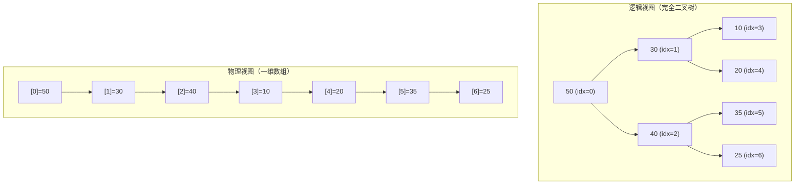
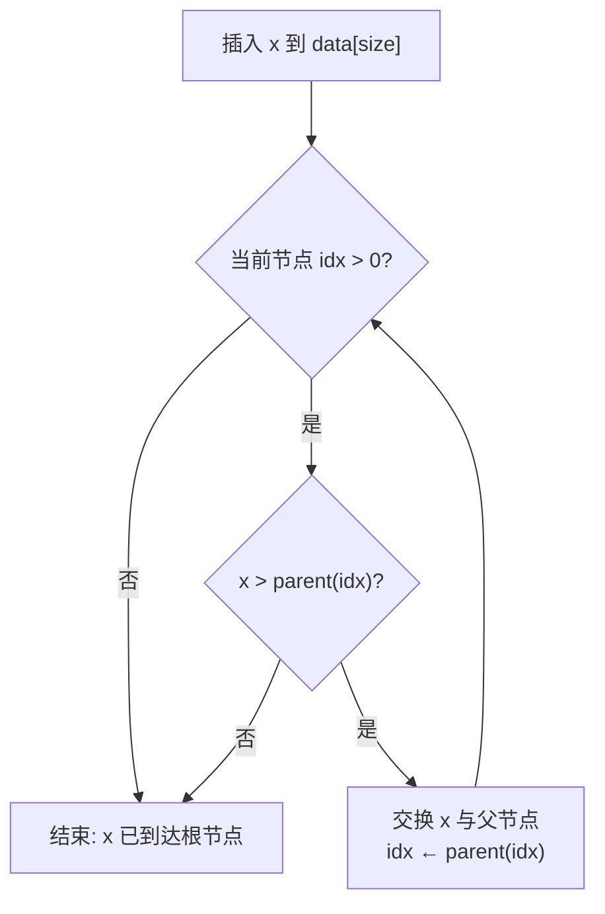
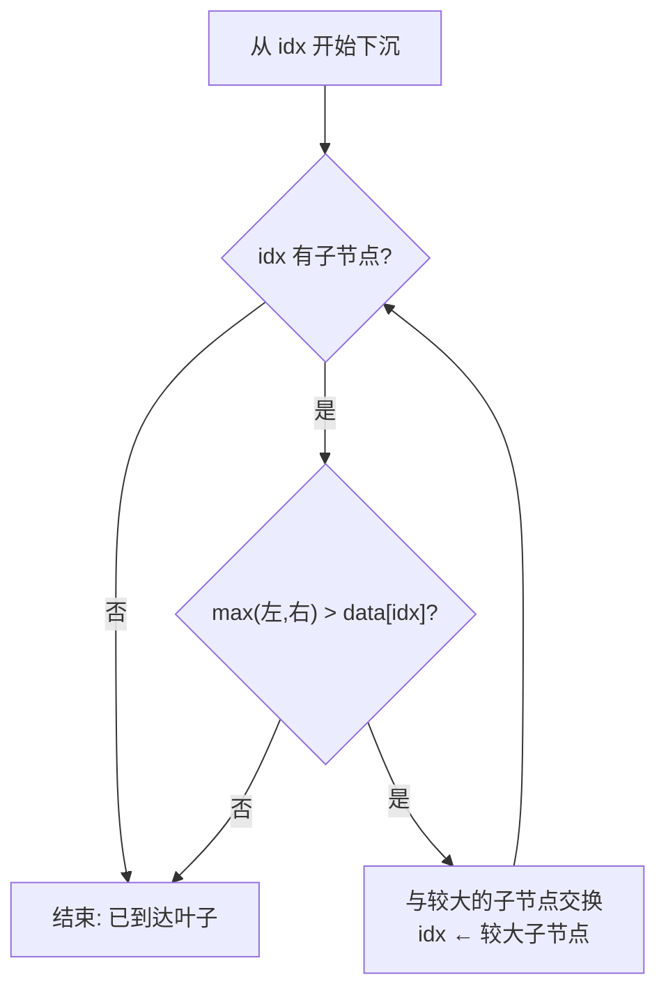

建议先阅读: [[D_容器_Container|容器概览]], [[J_树_Tree_BST_AVL|树 BST AVL]]（二叉树概念 + 完全二叉树 + 数组表示）

> **考研 408 导引**：本章应试核心是**完全二叉树的数组表示**（父子下标公式）、**sift-up / sift-down 的操作语句**（含交换条件与终止条件）、**Floyd 建堆过程**（从最后一个非叶子节点起逐个下沉的逐步轨迹）和**堆排序过程**（n 次交换 + 下沉的逐步轨迹）。Top-K、优先队列为应用常客。d-ary 堆、堆排序比快排慢的访存分析为超纲增值内容。正文备有 2 组闭卷手算自测。

---

## 原理

堆（Heap）是一种特殊的完全二叉树，满足堆性质：对于**最大堆**，每个节点的值 $\geq$ 其所有后代节点的值；对于**最小堆**，每个节点的值 $\leq$ 其所有后代节点的值。

> 注意：数据结构中的"堆"与操作系统中表示动态内存区域的"堆内存（heap memory）"是完全无关的两个概念。

### 堆在哪里

Dijkstra 最短路径算法每次从候选顶点中取距离最小的那个——底层是**最小堆**的 `extract_min`。服务器要从百万条日志中实时排出 Top-K 最大值，用大小为 K 的**最小堆**维护，每次只与堆顶比较。操作系统的任务调度器把就绪进程按优先级排成堆，每次取最高优先级执行。这些场景的共同主题——**需要反复取极值，且数据动态到达**——正是堆（优先队列）的核心用武之地。

### 数组存储：为什么堆不需要指针

虽然堆逻辑上是一棵二叉树，但物理存储是**一个一维数组**。这是完全二叉树的双重映射——因为完全二叉树的所有层除最后一层外均为满的，且最后一层的节点靠左对齐，所以它的节点可以完美地映射到一个没有空位的一维数组上：



![[../assets/images/二叉堆.png]]
![[../assets/images/二叉堆与数据存储的索引.png]]

数组索引之间的跳转公式完全替代了指针：
- 父节点：$\text{parent}(i) = \lfloor (i-1) / 2 \rfloor$
- 左子节点：$\text{left}(i) = 2i + 1$
- 右子节点：$\text{right}(i) = 2i + 2$

这些公式在层与层之间跳转只需一条单周期指令。堆的遍历因此获得了数组的内存连续性——父节点与子节点可能在同一条 cache line 中，虽然不如纯顺序扫描那样完美，但远优于链表的指针追踪。

### 核心操作与复杂度

| 操作 | 描述 | 时间复杂度 | 最坏情况 |
|------|------|:---------:|------|
| `push(x)` / insert | 末尾追加 + 从下向上冒泡 | $O(\log n)$ | 新元素比所有现存元素都大——上浮到根 |
| `pop()` / extract | 将堆顶与末尾交换 + 从顶向下沉降 | $O(\log n)$ | 新堆顶比两个子树的所有元素都小——沉到底 |
| `top()` / peek | 读 `data[0]` | $O(1)$ | |
| `build_heap()` | Floyd 自底向上 heapify | $O(n)$ | 见下方证明 |
| `heap_sort()` | 建堆 + n 次弹出 | $O(n \log n)$ | |

### 上浮与下沉的精确分析

**上浮（sift-up）**：新元素放在数组末尾（`data[size++] = x`），然后与父节点比较——如果违反堆性质（最大堆：新元素 > 父节点），就交换位置并继续向根方向推进。



上浮的最坏情况路径长度 = 树的高度 = $\lfloor \log_2 n \rfloor$。但实际中，随机插入的元素预期上浮距离很短——新元素在 50% 概率下小于父节点（无需交换），75% 概率下只需至多 1 次交换。均摊分析类似 vector 扩容。

**下沉（sift-down）**：将堆顶的值与两个子节点中的较大者比较——如果违反堆性质，交换位置并继续向叶子方向推进。



**上浮 vs 下沉的成本差异**：下沉在每一步中需要读取两个子节点、比较两次、交换一次，而上浮只需读一次父节点、比较一次、交换一次。建堆时主要使用下沉（因根节点附近的节点少数下沉很长距离），插入时使用上浮。

### Floyd 建堆 O(n) 的数学证明

Floyd 建堆算法从最后一个非叶子节点（下标 $\lfloor n/2 \rfloor - 1$）开始，向上逐个节点做下沉操作。直觉上会认为每个下沉 $O(\log n)$，乘以 $n/2$ 个非叶子节点，总复杂度似乎是 $O(n \log n)$。实际并非如此——绝大多数节点位于底层，下沉距离非常短。

**精确分析**：

设 $h = \lfloor \log_2 n \rfloor$ 为树的高度。第 $k$ 层（0-indexed，根为第 0 层）有至多 $2^k$ 个节点，从该层出发至多需要下沉 $h - k$ 层。总下沉交换次数：

$$
T(n) = \sum_{k=0}^{h-1} 2^k \cdot (h - k)
$$

换元 $j = h - k$（$j$ 表示从该层到叶子的距离）：

$$
T(n) = \sum_{j=1}^{h} 2^{h-j} \cdot j = 2^h \sum_{j=1}^{h} \frac{j}{2^j}
$$

等比级数-等差混合求和，已知 $\sum_{j=1}^{\infty} j/2^j = 2$：

$$
T(n) \leq 2^h \cdot 2 \leq 2n
$$

因此 Floyd 建堆的总操作次数 $\leq 2n$，时间复杂度为 $O(n)$，**不是** $O(n \log n)$。

**验证**：$n = 1000000$ 时，Floyd 建堆的交换次数约 200 万次（$2n$），而如果每下沉都走到叶层（$n \cdot \log_2 n \approx 20n$），则需要约 2000 万次——差了一个数量级。

#### Floyd 建堆手算轨迹

以数组 `[4, 1, 3, 2, 16, 9, 10]`（7 个元素，树高 2）为例，逐个节点下沉：

**初始状态**：`[4, 1, 3, 2, 16, 9, 10]`

**树形结构**：
```
        4 (0)
      /   \
    1(1)   3(2)
   / \    / \
  2(3) 16(4) 9(5) 10(6)
```

**第 1 步**：从 idx=2（值 3）开始，最后一个非叶子节点
- 子节点：left=5(值 9)，right=6(值 10)，最大子 = 6(值 10)
- `10 > 3`，交换 → idx=6，已是叶子，停止

```
        4 (0)
      /   \
    1(1)   10(2)
   / \    / \
  2(3) 16(4) 9(5) 3(6)
```
数组：`[4, 1, 10, 2, 16, 9, 3]`

**第 2 步**：从 idx=1（值 1）开始
- 子节点：left=3(值 2)，right=4(值 16)，最大子 = 4(值 16)
- `16 > 1`，交换 → idx=4，已是叶子，停止

```
        4 (0)
      /   \
    16(1)   10(2)
   / \    / \
  2(3) 1(4) 9(5) 3(6)
```
数组：`[4, 16, 10, 2, 1, 9, 3]`

**第 3 步**：从 idx=0（值 4）开始，根节点
- 子节点：left=1(值 16)，right=2(值 10)，最大子 = 1(值 16)
- `16 > 4`，交换 → idx=1
- idx=1 的子节点：left=3(值 2)，right=4(值 1)，最大子 = 3(值 2)
- `2 > 4` 不成立，停止

```
       16(0)
      /   \
    4(1)   10(2)
   / \    / \
  2(3) 1(4) 9(5) 3(6)
```
数组：`[16, 4, 10, 2, 1, 9, 3]`

最终状态 `16 ≥ 4,10 ≥ 2,1,9,3`——最大堆性质满足。

**408 自测：Floyd 建堆**

给定数组 `[5, 3, 8, 1, 2, 7, 4]`（7 个元素），写出 Floyd 建堆的每一步（哪些节点被下沉、交换了几次、最终数组）。

> 答案：
>
> 初始：`[5, 3, 8, 1, 2, 7, 4]`
>
> ① idx=2(值8)：子节点 5(值7)、6(值4)，最大=7 < 8 不成立 → 不动。数组不变。
>
> ② idx=1(值3)：子节点 3(值1)、4(值2)，最大=2 < 3 不成立 → 不动。数组不变。
>
> ③ idx=0(值5)：子节点 1(值3)、2(值8)，最大=8 > 5 → 交换，数组变为 `[8, 3, 5, 1, 2, 7, 4]`，idx=2。继续下沉：idx=2 的子节点 5(值7)、6(值4)，最大=7 > 5 → 再交换，数组变为 `[8, 3, 7, 1, 2, 5, 4]`，idx=5 为叶子，停止。
>
> 最终：`[8, 3, 7, 1, 2, 5, 4]`，共 **2 次交换**。
>
> 验证：8 ≥ 3,7,1,2,5,4（最大堆成立），3 ≥ 1,2（成立），7 ≥ 5,4（成立）

### d-ary 堆（多叉堆）

二叉堆的每个节点有 2 个子节点。将分支因子从 2 推广到 $d$，得到 d-ary 堆：

| | 二叉堆 ($d=2$) | 四叉堆 ($d=4$) |
|------|:---:|:---:|
| 树高 | $\log_2 n$ | $\log_4 n \approx 0.5 \cdot \log_2 n$ |
| sift-up 开销 | 每层 1 次比较 | 每层 3 次比较（找父节点中最大/小） |
| sift-down 开销 | 每层 1 次比较 | 每层约 $d-1$ 次比较 |
| cache 友好性 | 一般 | **更好**——同一层内 4 个连续 slot 在同一 cache line |

d-ary 堆在减少树高和增加每层比较次数之间做了折中。对于在特定内存层次结构下某些操作比例（如 extract-heavy），$d=4$ 的四叉堆由于减少的层数和增加的 cache 局部性，在实际中常优于二叉堆。

---

## 深入底层

### 堆排序为什么比快速排序慢

堆排序与快速排序同为 $O(n \log n)$，但在实践中通常慢 2-3 倍。深层原因不在算法，而在访存模式：

1. **不规则的访存模式**：堆排序的下沉操作遵循父子跳转。节点 $i$ 的子节点在 $2i+1$ 和 $2i+2$ 处——随着 $i$ 的增大，这两个位置越来越远。数组中间附近的节点，其父子在完全不同的内存页

2. **缺乏引用局部性**：堆排序在提取最大值时将堆顶与堆尾交换——$data[0]$ 与 $data[n-1]$、$data[0]$ 与 $data[n-2]$……每次交换跨越的距离越来越大，访问模式极不利于缓存

3. **比较次数多**：每次下沉需要两次比较（左子 vs 右子、最大子 vs 当前节点），而快速排序的 partition 每次只需一次比较

4. **分支数多**：下沉操作的 while 循环内有 3 个条件判断（左子存在？右子存在？谁更大？），而快速排序的内循环通常只有 1 个条件判断

综合而言，快速排序的 $O(n \log n)$ 与堆排序的 $O(n \log n)$ 在常数因子上的差距本质上是内存访问密度（memory access density）的差距——快速排序的每次 cache miss 获取更多可用数据。

---

## 实现

### 最大堆

```c
#include <stdlib.h>

typedef struct {
 int* data;
 size_t size;
 size_t capacity;
} MaxHeap;

void mh_init(MaxHeap* h) { h->data = NULL; h->size = 0; h->capacity = 0; }
void mh_destroy(MaxHeap* h) { free(h->data); h->data = NULL; h->size = h->capacity = 0; }

static void swap(int* a, int* b) { int t = *a; *a = *b; *b = t; }

static void sift_up(MaxHeap* h, size_t idx) {
 while (idx > 0) {
 size_t parent = (idx - 1) / 2;
 if (h->data[parent] >= h->data[idx]) break;
 swap(&h->data[parent], &h->data[idx]);
 idx = parent;
 }
}

static void sift_down(MaxHeap* h, size_t idx) {
 size_t n = h->size;
 while (1) {
 size_t largest = idx;
 size_t left = 2 * idx + 1, right = 2 * idx + 2;
 if (left < n && h->data[left] > h->data[largest]) largest = left;
 if (right < n && h->data[right] > h->data[largest]) largest = right;
 if (largest == idx) break;
 swap(&h->data[idx], &h->data[largest]);
 idx = largest;
 }
}

static int mh_expand(MaxHeap* h) {
 size_t new_cap = h->capacity == 0 ? 8 : h->capacity * 2;
 int* new_data = realloc(h->data, new_cap * sizeof(int));
 if (!new_data) return -1;
 h->data = new_data;
 h->capacity = new_cap;
 return 0;
}

int mh_push(MaxHeap* h, int value) {
 if (h->size >= h->capacity)
 if (mh_expand(h) != 0) return -1;
 h->data[h->size++] = value;
 sift_up(h, h->size - 1);
 return 0;
}

int mh_extract_max(MaxHeap* h, int* out) {
 if (h->size == 0) return -1;
 *out = h->data[0];
 h->data[0] = h->data[--h->size];
 if (h->size > 0) sift_down(h, 0);
 return 0;
}

int mh_top(const MaxHeap* h, int* out) {
 if (h->size == 0) return -1;
 *out = h->data[0];
 return 0;
}

// Floyd build-heap: O(n)
void mh_build(MaxHeap* h, int* arr, size_t n) {
 free(h->data);
 h->data = arr;
 h->size = n;
 h->capacity = n;
 for (int i = (int)n / 2 - 1; i >= 0; i--)
 sift_down(h, (size_t)i);
}
```

### 堆排序

```c
static void sift_down_range(int* arr, size_t n, size_t idx) {
 while (1) {
 size_t largest = idx;
 size_t left = 2 * idx + 1, right = 2 * idx + 2;
 if (left < n && arr[left] > arr[largest]) largest = left;
 if (right < n && arr[right] > arr[largest]) largest = right;
 if (largest == idx) break;
 int t = arr[idx]; arr[idx] = arr[largest]; arr[largest] = t;
 idx = largest;
 }
}

void heap_sort(int* arr, size_t n) {
 for (int i = (int)n / 2 - 1; i >= 0; i--) // Floyd build-heap O(n)
 sift_down_range(arr, n, (size_t)i);
 for (size_t i = n - 1; i > 0; i--) { // extract n times O(n log n)
 int t = arr[0]; arr[0] = arr[i]; arr[i] = t;
 sift_down_range(arr, i, 0);
 }
}
```

#### 堆排序手算轨迹

以上方建好的堆 `[16, 10, 14, 8, 7, 3, 9, 2, 4, 1]`（10 个元素）为例，执行堆排序的每一步：

**初始**：`[16, 10, 14, 8, 7, 3, 9, 2, 4, 1]`（已是最大堆）

**第 1 步**：交换 16↔1 → `[1, 10, 14, 8, 7, 3, 9, 2, 4] | 16`
- 1 下沉：与 14(右子) 交换 → `[14, 10, 1, 8, 7, 3, 9, 2, 4]`
- 1 下沉：与 9(右子) 交换 → `[14, 10, 9, 8, 7, 3, 1, 2, 4]`
- 状态：`[14, 10, 9, 8, 7, 3, 1, 2, 4, 16]`

**第 2 步**：交换 14↔4 → `[4, 10, 9, 8, 7, 3, 1, 2] | 14, 16`
- 4 下沉：与 10(左子) 交换 → `[10, 4, 9, 8, 7, 3, 1, 2]`
- 4 下沉：与 8(左子) 交换 → `[10, 8, 9, 4, 7, 3, 1, 2]`
- 状态：`[10, 8, 9, 4, 7, 3, 1, 2, 14, 16]`

**第 3 步**：交换 10↔2 → `[2, 8, 9, 4, 7, 3, 1] | 10, 14, 16`
- 2 下沉：与 9(右子) 交换 → `[2, 8, 9, 4, 7, 3, 1]`（无变化，停止）
- 状态：`[9, 8, 2, 4, 7, 3, 1, 10, 14, 16]`

**第 4 步**：交换 9↔1 → `[1, 8, 2, 4, 7, 3] | 9, 10, 14, 16]
- 1 下沉：与 8(左子) 交换 → `[8, 1, 2, 4, 7, 3]`
- 1 下沉：与 4(左子) 交换 → `[8, 4, 2, 1, 7, 3]`
- 状态：`[8, 4, 2, 1, 7, 3, 9, 10, 14, 16]`

**第 5 步**：交换 8↔3 → `[3, 4, 2, 1, 7] | 8, 9, 10, 14, 16]
- 3 下沉：与 7(右子) 交换 → `[3, 4, 2, 1, 7]`
- 3 下沉：与 4(左子) 交换 → `[4, 3, 2, 1, 7]`
- 状态：`[7, 3, 2, 1, 4, 8, 9, 10, 14, 16]`

**第 6 步**：交换 7↔4 → `[4, 3, 2, 1] | 7, 8, 9, 10, 14, 16]
- 4 下沉：与 3(左子) 交换 → `[4, 3, 2, 1]`（无变化，停止）
- 状态：`[4, 3, 2, 1, 7, 8, 9, 10, 14, 16]`

**第 7 步**：交换 4↔1 → `[1, 3, 2] | 4, 7, 8, 9, 10, 14, 16]
- 1 下沉：与 3(左子) 交换 → `[3, 1, 2]`
- 状态：`[3, 1, 2, 4, 7, 8, 9, 10, 14, 16]`

**第 8 步**：交换 3↔2 → `[2, 1] | 3, 4, 7, 8, 9, 10, 14, 16]
- 2 下沉：与 1(左子) 交换 → `[2, 1]`（无变化，停止）
- 状态：`[2, 1, 3, 4, 7, 8, 9, 10, 14, 16]`

**第 9 步**：交换 2↔1 → `[1] | 2, 3, 4, 7, 8, 9, 10, 14, 16]
- 堆大小=1，无需下沉
- 最终：`[1, 2, 3, 4, 7, 8, 9, 10, 14, 16]`

共 **9 步**，总比较次数约 $9 \times 4 = 36$ 次（$n \log_2 n$ 的量级）。

**408 自测：堆排序**

给定最大堆 `[20, 15, 18, 10, 12, 16, 14]`，执行堆排序的前 3 步，写出每步交换+下沉后的数组。

> 答案：
>
> 初始：`[20, 15, 18, 10, 12, 16, 14]`
>
> ① 交换 20↔14 → `[14, 15, 18, 10, 12, 16] | 20`
>    14 下沉：与 18(右子) 交换 → `[18, 15, 14, 10, 12, 16]`；14 在 idx=2，子节点 5(值16)、6(值14)，16 > 14 → 再交换 → `[18, 15, 16, 10, 12, 14]`
>    状态：`[18, 15, 16, 10, 12, 14, 20]`
>
> ② 交换 18↔14 → `[14, 15, 16, 10, 12] | 18, 20`
>    14 下沉：与 16(右子) 交换 → `[14, 15, 16, ...]`；14 在 idx=2，子节点 5(值12)，12 < 14 不成立 → 不动
>    状态：`[16, 15, 14, 10, 12, 18, 20]`
>
> ③ 交换 16↔12 → `[12, 15, 14, 10] | 16, 18, 20`
>    12 下沉：与 15(左子) 交换 → `[15, 12, 14, 10]`；12 在 idx=1，子节点 3(值10)，10 < 12 不成立 → 不动
>    状态：`[15, 12, 14, 10, 16, 18, 20]`

---

## 各语言标准库对比

| 语言 | 优先队列 / 堆 | 堆算法 |
|------|--------------|--------|
| C | 无 | 无 |
| C++ | `std::priority_queue<T>` | `std::make_heap` / `push_heap` / `pop_heap` |
| Java | `PriorityQueue<T>`（最小堆） | 无独立算法（可通过构造函数 `heapify`） |
| Python | `heapq`（最小堆） | `heapq.heapify` / `heappush` / `heappop` |
| Rust | `BinaryHeap<T>`（最大堆） | 无独立算法 |

---

## 应用场景

- **优先队列**：操作系统任务调度器中按优先级排序的任务列表。Dijkstra 中每次取最近顶点，时间复杂度从 $O(V^2)$ 降至 $O(E \log V)$。详见 [[../操作系统/D_CPU调度|CPU 调度]] 和 [[S_图_Graph|图的最短路径]]
- **Top-K**：用大小为 K 的**最小堆**维护最大的 K 个元素——每个新元素与堆顶（当前 K 个中的最小值）比较，只有更大时才替换。总时间 $O(n \log K)$，空间 $O(K)$
- **数据流中位数**：用两个堆——**最大堆**存较小的一半，**最小堆**存较大的一半——插入 $O(\log n)$，查询中位数 $O(1)$
- **合并 K 个有序链表/数组**：用最小堆存 K 个链表头中的最小值，弹出后推进对应链表，总时间 $O(N \log K)$
- **哈夫曼编码**：贪心算法的典型——每次取两个最小频率合并再放回，用最小堆加速

---

## 练习

| 题号 | 题目 | 说明 |
|------|------|------|
| [215](https://leetcode.cn/problems/kth-largest-element-in-an-array/) | 数组中的第K个最大元素 | 堆 / 快速选择 |
| [295](https://leetcode.cn/problems/find-median-from-data-stream/) | 数据流的中位数 | 双堆 |
| [347](https://leetcode.cn/problems/top-k-frequent-elements/) | 前K个高频元素 | 堆 + 哈希表 |
| [1046](https://leetcode.cn/problems/last-stone-weight/) | 最后一块石头的重量 | 最大堆模拟 |
| [23](https://leetcode.cn/problems/merge-k-sorted-lists/) | 合并K个升序链表 | 最小堆 + 链表 |

### 408 手算自测清单

笔试题与上面的 LeetCode 互补——考的是闭卷手算，全部在正文中带完整答案：

| 自测 | 位置 | 考什么 |
|------|------|--------|
| Floyd 建堆 ×1 问 | 建堆手算轨迹节 | 从序列建堆的逐步下沉过程 |
| 堆排序 ×1 问 | 堆排序手算轨迹节 | 交换 + 下沉的逐步数组状态 |

## 动手实验

| 编号 | 题目 | 说明 |
|:----:|------|------|
| E1 | Floyd O(n) vs 逐个插入 O(n log n) | 对 n=100000 的随机数组，分别用 Floyd 建堆和 n 次 push（逐个插入）构建最大堆。计时并统计总 swap 次数——Floyd 应约为 2n，push 应约为 1.4n log n |
| E2 | d-ary 堆性能对比 | 实现二叉堆和四叉堆（d=4），分别插入/弹出 100 万个随机 int。计时并统计 cache miss（`perf stat -e cache-misses`），验证四叉堆因降低树高而在 cache 友好性上的优势 |
| E3 | 堆排序 vs 快速排序 访存模式分析 | 对 10 万元素分别用堆排序和快速排序，用 `perf stat -e cache-references,cache-misses,L1-dcache-load-misses` 统计缓存行为。解释为什么同是 O(n log n)，访存模式决定了实际性能差距 |
