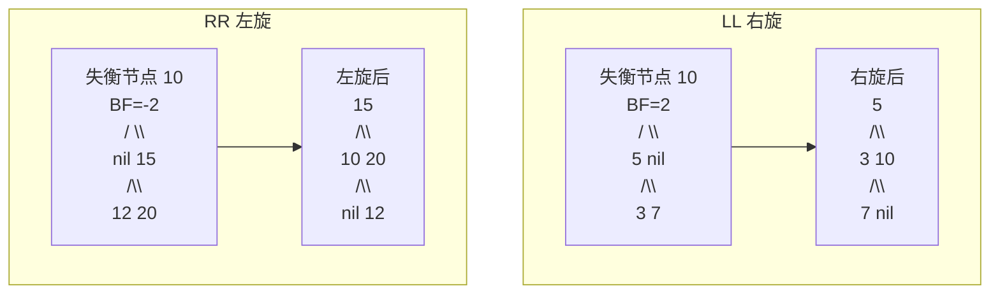
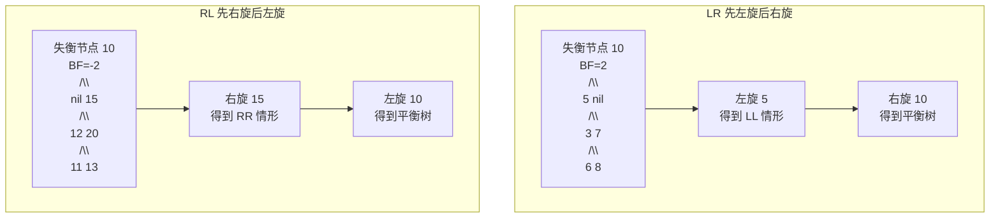

建议先阅读: [[A_容器_Container|A 容器 Container]], [[B_栈_Stack|B 栈 Stack]], [[F_队列_Queue|F 队列 Queue]]

---

## 原理

树（Tree）是一种非线性层次结构，由节点和边组成。二叉树每个节点最多有两个子节点。

### 基本术语

- 根节点（Root）: 树的顶端，无父节点
- 叶子节点（Leaf）: 无子节点的节点
- 深度（Depth）: 从根到该节点的路径长度
- 高度（Height）: 从该节点到最远叶子的路径长度

### 二叉树的四种遍历

| 遍历方式 | 顺序 | 说明 |
|----------|------|------|
| 前序遍历 Pre-order | 根 -> 左 -> 右 | 复制树、前缀表达式 |
| 中序遍历 In-order | 左 -> 根 -> 右 | BST 有序输出 |
| 后序遍历 Post-order | 左 -> 右 -> 根 | 释放内存、后缀表达式 |
| 层序遍历 Level-order | 逐层从左到右 | BFS |

### 二叉搜索树（BST）

性质：左子树所有节点 < 根 < 右子树所有节点。

| 操作 | 平均 | 最坏 | 说明 |
|------|------|------|------|
| 查找 | O(log n) | O(n) | 退化为链表时 O(n) |
| 插入 | O(log n) | O(n) | 同上 |
| 删除 | O(log n) | O(n) | 同上 |

### AVL 树

AVL 是自平衡 BST，任意节点左右子树高度差 <= 1（平衡因子 BF = 左高 - 右高，BF ∈ {-1, 0, 1}）。

四种旋转（图中红色节点为失衡节点，蓝色为旋转轴）：





AVL 高度 ≤ 1.44 * log(n)，保证查找/插入/删除均为 O(log n)。

---

## 实现

### BST

```c
#include <stdlib.h>

typedef struct BSTNode {
    int data;
    struct BSTNode* left;
    struct BSTNode* right;
} BSTNode;

typedef struct {
    BSTNode* root;
} BST;

BSTNode* bst_create_node(int val) {
    BSTNode* node = malloc(sizeof(BSTNode));
    node->data = val;
    node->left = NULL;
    node->right = NULL;
    return node;
}

static BSTNode* bst_insert_rec(BSTNode* node, int val) {
    if (!node) return bst_create_node(val);
    if (val < node->data)
        node->left = bst_insert_rec(node->left, val);
    else if (val > node->data)
        node->right = bst_insert_rec(node->right, val);
    return node;
}

void bst_insert(BST* t, int val) {
    t->root = bst_insert_rec(t->root, val);
}

static BSTNode* bst_search_rec(BSTNode* node, int val) {
    if (!node || node->data == val) return node;
    if (val < node->data) return bst_search_rec(node->left, val);
    return bst_search_rec(node->right, val);
}

int bst_find(BST* t, int val) {
    return bst_search_rec(t->root, val) != NULL;
}

static BSTNode* bst_find_min(BSTNode* node) {
    while (node && node->left) node = node->left;
    return node;
}

static BSTNode* bst_remove_rec(BSTNode* node, int val) {
    if (!node) return NULL;
    if (val < node->data)
        node->left = bst_remove_rec(node->left, val);
    else if (val > node->data)
        node->right = bst_remove_rec(node->right, val);
    else {
        if (!node->left) {
            BSTNode* tmp = node->right;
            free(node);
            return tmp;
        }
        if (!node->right) {
            BSTNode* tmp = node->left;
            free(node);
            return tmp;
        }
        BSTNode* min_node = bst_find_min(node->right);
        node->data = min_node->data;
        node->right = bst_remove_rec(node->right, min_node->data);
    }
    return node;
}

void bst_remove(BST* t, int val) {
    t->root = bst_remove_rec(t->root, val);
}

static void bst_destroy_rec(BSTNode* node) {
    if (!node) return;
    bst_destroy_rec(node->left);
    bst_destroy_rec(node->right);
    free(node);
}

void bst_destroy(BST* t) {
    bst_destroy_rec(t->root);
    t->root = NULL;
}
```

### AVL 树

```c
#include <stdlib.h>

typedef struct AVLNode {
    int data;
    int height;
    struct AVLNode* left;
    struct AVLNode* right;
} AVLNode;

typedef struct {
    AVLNode* root;
} AVLTree;

static int avl_height(AVLNode* n) { return n ? n->height : 0; }
static int avl_bf(AVLNode* n) {
    return n ? avl_height(n->left) - avl_height(n->right) : 0;
}
static void avl_update_height(AVLNode* n) {
    int lh = avl_height(n->left);
    int rh = avl_height(n->right);
    n->height = 1 + (lh > rh ? lh : rh);
}

static AVLNode* avl_right_rotate(AVLNode* y) {
    AVLNode* x = y->left;
    AVLNode* T2 = x->right;
    x->right = y;
    y->left = T2;
    avl_update_height(y);
    avl_update_height(x);
    return x;
}

static AVLNode* avl_left_rotate(AVLNode* x) {
    AVLNode* y = x->right;
    AVLNode* T2 = y->left;
    y->left = x;
    x->right = T2;
    avl_update_height(x);
    avl_update_height(y);
    return y;
}

AVLNode* avl_create_node(int val) {
    AVLNode* node = malloc(sizeof(AVLNode));
    node->data = val;
    node->height = 1;
    node->left = NULL;
    node->right = NULL;
    return node;
}

static AVLNode* avl_insert_rec(AVLNode* node, int val) {
    if (!node) return avl_create_node(val);
    if (val < node->data)
        node->left = avl_insert_rec(node->left, val);
    else if (val > node->data)
        node->right = avl_insert_rec(node->right, val);
    else
        return node;

    avl_update_height(node);
    int bf = avl_bf(node);

    // LL
    if (bf > 1 && val < node->left->data)
        return avl_right_rotate(node);
    // RR
    if (bf < -1 && val > node->right->data)
        return avl_left_rotate(node);
    // LR
    if (bf > 1 && val > node->left->data) {
        node->left = avl_left_rotate(node->left);
        return avl_right_rotate(node);
    }
    // RL
    if (bf < -1 && val < node->right->data) {
        node->right = avl_right_rotate(node->right);
        return avl_left_rotate(node);
    }
    return node;
}

void avl_insert(AVLTree* t, int val) {
    t->root = avl_insert_rec(t->root, val);
}

static AVLNode* avl_find_min(AVLNode* node) {
    while (node && node->left) node = node->left;
    return node;
}

static AVLNode* avl_remove_rec(AVLNode* node, int val) {
    if (!node) return NULL;
    if (val < node->data)
        node->left = avl_remove_rec(node->left, val);
    else if (val > node->data)
        node->right = avl_remove_rec(node->right, val);
    else {
        if (!node->left || !node->right) {
            AVLNode* tmp = node->left ? node->left : node->right;
            free(node);
            return tmp;
        }
        AVLNode* min_node = avl_find_min(node->right);
        node->data = min_node->data;
        node->right = avl_remove_rec(node->right, min_node->data);
    }
    if (!node) return NULL;

    avl_update_height(node);
    int bf = avl_bf(node);

    // LL
    if (bf > 1 && avl_bf(node->left) >= 0)
        return avl_right_rotate(node);
    // LR
    if (bf > 1 && avl_bf(node->left) < 0) {
        node->left = avl_left_rotate(node->left);
        return avl_right_rotate(node);
    }
    // RR
    if (bf < -1 && avl_bf(node->right) <= 0)
        return avl_left_rotate(node);
    // RL
    if (bf < -1 && avl_bf(node->right) > 0) {
        node->right = avl_right_rotate(node->right);
        return avl_left_rotate(node);
    }
    return node;
}

void avl_remove(AVLTree* t, int val) {
    t->root = avl_remove_rec(t->root, val);
}

static void avl_destroy_rec(AVLNode* node) {
    if (!node) return;
    avl_destroy_rec(node->left);
    avl_destroy_rec(node->right);
    free(node);
}

void avl_destroy(AVLTree* t) {
    avl_destroy_rec(t->root);
    t->root = NULL;
}
```

---

## 应用场景

- **文件系统**: 目录树，用多叉树表示
- **表达式树**: 编译器解析数学表达式为语法树
- **数据库索引**: BST/AVL/红黑树/B+树
- **字典序存储**: BST 中序遍历即有序输出

---

## 练习

| 题号 | 题目 | 难度 | 知识点 |
|------|------|------|--------|
| P3369 | 普通平衡树 | 提高 | BST/AVL 基本操作 |
| P1364 | 医院设置 | 普及 | 树的遍历、带权路径 |
| P1030 | 求先序排列 | 普及 | 遍历序列重建树 |
