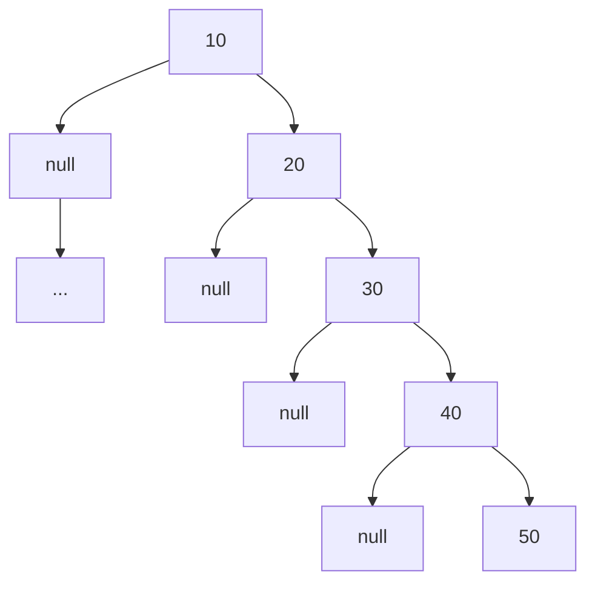
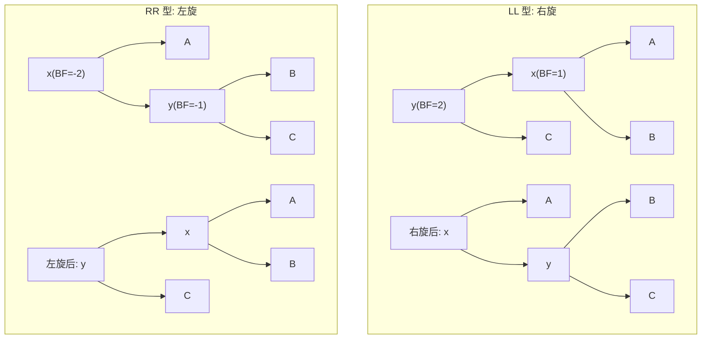

---
数据结构教程 — 树 (Tree) — 二叉搜索树与AVL树
---

##  章节概述

树（Tree）是一种非线性的层次结构，由节点和连接节点的边组成。树结构在计算机
科学中无处不在：文件系统、HTML DOM树、编译器语法树、数据库索引、网络路由等。

本章重点讲解二叉搜索树（BST）和自平衡二叉搜索树AVL树，理解从普通树到平衡树的
演进思路，以及旋转操作如何维持树的平衡。

>  **底层实现参考**：如果需要深入理解本章数据结构的底层实现（纯C手写、内存布局、指针操作），请参阅 [[../../C语言深化教程/3数据结构/06_树与二叉树|C语言教程: 树与二叉树]]。C教程侧重手动实现与内存本质，本教程侧重STL使用与算法优化，两者互补。

---
###  第一节: 基础语法 + 计算机底层原理
---

1.1 树的基本概念
--------------------

树的术语：
- 根节点（Root）：树的顶端节点，没有父节点
- 叶子节点（Leaf）：没有子节点的节点
- 父节点（Parent）和子节点（Child）
- 兄弟节点（Sibling）：同一父节点的子节点
- 子树（Subtree）：树中任意节点及其所有后代
- 深度（Depth）：从根节点到某节点的路径长度
- 高度（Height）：从某节点到最远叶子节点的路径长度

二叉树（Binary Tree）：每个节点最多有两个子节点（左子节点和右子节点）。

二叉树的遍历方式：
- 前序遍历（Pre-order）：根 → 左 → 右
- 中序遍历（In-order）：左 → 根 → 右
- 后序遍历（Post-order）：左 → 右 → 根
- 层序遍历（Level-order）：从上到下，从左到右

```pseudocode
STRUCT TreeNode:
    data: integer
    left: pointer to TreeNode
    right: pointer to TreeNode
END STRUCT

CLASS BinaryTree:
    root = NULL

FUNCTION destructor():
    destroy(root)
END FUNCTION

FUNCTION destroy(node):
    IF node == NULL:
        RETURN
    END IF
    destroy(node.left)
    destroy(node.right)
    DELETE node
END FUNCTION

FUNCTION preorder(node):
    IF node == NULL:
        RETURN
    END IF
    PRINT node.data, " "
    preorder(node.left)
    preorder(node.right)
END FUNCTION

FUNCTION inorder(node):
    IF node == NULL:
        RETURN
    END IF
    inorder(node.left)
    PRINT node.data, " "
    inorder(node.right)
END FUNCTION

FUNCTION postorder(node):
    IF node == NULL:
        RETURN
    END IF
    postorder(node.left)
    postorder(node.right)
    PRINT node.data, " "
END FUNCTION

FUNCTION print_preorder():
    PRINT "前序遍历: "
    preorder(root)
    PRINT newline
END FUNCTION

FUNCTION print_inorder():
    PRINT "中序遍历: "
    inorder(root)
    PRINT newline
END FUNCTION

FUNCTION print_postorder():
    PRINT "后序遍历: "
    postorder(root)
    PRINT newline
END FUNCTION

FUNCTION print_levelorder():
    IF root == NULL:
        RETURN
    END IF
    q = NEW Queue()
    q.push(root)

    PRINT "层序遍历: "
    WHILE NOT q.empty():
        node = q.front()
        q.pop()
        PRINT node.data, " "

        IF node.left != NULL:
            q.push(node.left)
        END IF
        IF node.right != NULL:
            q.push(node.right)
        END IF
    END WHILE
    PRINT newline
END FUNCTION

// 非递归中序遍历（了解栈在树遍历中的作用）
FUNCTION print_inorder_iterative():
    stk = NEW Stack()
    cur = root

    PRINT "中序遍历(迭代): "
    WHILE cur != NULL OR NOT stk.empty():
        WHILE cur != NULL:
            stk.push(cur)
            cur = cur.left
        END WHILE
        cur = stk.top()
        stk.pop()
        PRINT cur.data, " "
        cur = cur.right
    END WHILE
    PRINT newline
END FUNCTION

FUNCTION height(node):
    IF node == NULL:
        RETURN 0
    END IF
    RETURN 1 + MAX(height(node.left), height(node.right))
END FUNCTION

FUNCTION get_height():
    RETURN height(root)
END FUNCTION
```

---
**实现练习**: 用 C 或 C++ 自行实现上述结构。完成后与 AI 对话检查正确性。
- C 语言底层参考: [[../../c语言教程/3数据结构/06_树与二叉树]]
- C++ STL 参考: [[../../cpp教程/容器库/09_set_multiset]]
---

1.2 二叉搜索树（BST）
--------------------------

二叉搜索树的性质：
1. 左子树所有节点的值 < 根节点的值
2. 右子树所有节点的值 > 根节点的值
3. 左右子树也是二叉搜索树

```pseudocode
CLASS BST EXTENDS BinaryTree:

FUNCTION insert_node(node, value):
    IF node == NULL:
        RETURN NEW TreeNode(value)
    END IF

    IF value < node.data:
        node.left = insert_node(node.left, value)
    ELSE IF value > node.data:
        node.right = insert_node(node.right, value)
    END IF
    // 值相等时不插入（不允许重复）
    RETURN node
END FUNCTION

FUNCTION search_node(node, value):
    IF node == NULL OR node.data == value:
        RETURN node
    END IF
    IF value < node.data:
        RETURN search_node(node.left, value)
    END IF
    RETURN search_node(node.right, value)
END FUNCTION

FUNCTION find_min(node):
    WHILE node != NULL AND node.left != NULL:
        node = node.left
    END WHILE
    RETURN node
END FUNCTION

FUNCTION delete_node(node, value):
    IF node == NULL:
        RETURN NULL
    END IF

    IF value < node.data:
        node.left = delete_node(node.left, value)
    ELSE IF value > node.data:
        node.right = delete_node(node.right, value)
    ELSE:
        // 找到要删除的节点
        IF node.left == NULL:
            temp = node.right
            DELETE node
            RETURN temp
        END IF
        IF node.right == NULL:
            temp = node.left
            DELETE node
            RETURN temp
        END IF

        // 有两个子节点：用右子树的最小节点替换
        min_node = find_min(node.right)
        node.data = min_node.data
        node.right = delete_node(node.right, min_node.data)
    END IF
    RETURN node
END FUNCTION

FUNCTION insert(value):
    root = insert_node(root, value)
END FUNCTION

FUNCTION search(value):
    RETURN search_node(root, value) != NULL
END FUNCTION

FUNCTION remove(value):
    root = delete_node(root, value)
END FUNCTION

// 使用示例
FUNCTION main()
    tree = NEW BST()

    // 插入节点
    ARRAY values = [50, 30, 80, 20, 40, 70, 90, 10, 35, 45, 85]
    FOR EACH v IN values:
        tree.insert(v)
    END FOR

    tree.print_inorder()    // 应输出有序序列
    tree.print_preorder()
    tree.print_postorder()
    tree.print_levelorder()
    tree.print_inorder_iterative()

    PRINT "查找40: ", IF tree.search(40) THEN "找到" ELSE "未找到"
    PRINT "查找100: ", IF tree.search(100) THEN "找到" ELSE "未找到"
    PRINT "树高: ", tree.get_height()

    tree.remove(40)
    PRINT "删除40后: "
    tree.print_inorder()
END FUNCTION
```

---
**实现练习**: 用 C 或 C++ 自行实现上述结构。完成后与 AI 对话检查正确性。
- C 语言底层参考: [[../../c语言教程/3数据结构/06_树与二叉树]]
- C++ STL 参考: [[../../cpp教程/容器库/09_set_multiset]]
---

BST的问题：当插入有序数据时，BST退化为链表（斜树），树高为O(n)，
查找复杂度退化到O(n)。这就是为什么需要平衡树。



> 插入顺序 [10, 20, 30, 40, 50] 时，每个新元素都比当前最大值大，全部挂在右子树上。
> 查找 50 需要比较 5 次，而平衡树中只需要约 log2(5) = 2 次。


1.3 AVL树的底层原理
-----------------------

AVL树是自平衡二叉搜索树，任何节点的左右子树高度差不超过1（平衡因子BF ∈ {-1,0,1}）。

平衡因子 = 左子树高度 - 右子树高度

当插入或删除导致某节点|BF| > 1时，通过旋转恢复平衡。

四种旋转情况：
1. LL（左左）：左子树的左子树插入 → 右旋
2. RR（右右）：右子树的右子树插入 → 左旋
3. LR（左右）：左子树的右子树插入 → 先左旋再右旋
4. RL（右左）：右子树的左子树插入 → 先右旋再左旋



| 旋转类型 | 触发条件 | 操作 | 涉及节点 |
|----------|----------|------|----------|
| LL | 左子树的左子树过深 | 右旋失衡节点 | 失衡节点 + 左子节点 |
| RR | 右子树的右子树过深 | 左旋失衡节点 | 失衡节点 + 右子节点 |
| LR | 左子树的右子树过深 | 左旋左子 + 右旋失衡节点 | 失衡节点 + 左子 + 左子的右子 |
| RL | 右子树的左子树过深 | 右旋右子 + 左旋失衡节点 | 失衡节点 + 右子 + 右子的左子 |

> 数学推导: AVL 树的最少节点数 N(h) 满足递推式 N(h) = N(h-1) + N(h-2) + 1,
> 与斐波那契数列相关, N(0)=1, N(1)=2。可证明高度 h ≤ 1.44 * log2(n),
> 因此查找、插入、删除均为 O(log n)。

```pseudocode
STRUCT AVLNode:
    data: integer
    left: pointer to AVLNode
    right: pointer to AVLNode
    height: integer
END STRUCT

CLASS AVLTree:
    root = NULL

FUNCTION get_height(node):
    IF node == NULL:
        RETURN 0
    END IF
    RETURN node.height
END FUNCTION

FUNCTION get_balance(node):
    IF node == NULL:
        RETURN 0
    END IF
    RETURN get_height(node.left) - get_height(node.right)
END FUNCTION

FUNCTION update_height(node):
    IF node != NULL:
        node.height = 1 + MAX(get_height(node.left),
                              get_height(node.right))
    END IF
END FUNCTION

// 右旋
FUNCTION right_rotate(y):
    x = y.left
    T2 = x.right

    x.right = y
    y.left = T2

    update_height(y)
    update_height(x)

    RETURN x
END FUNCTION

// 左旋
FUNCTION left_rotate(x):
    y = x.right
    T2 = y.left

    y.left = x
    x.right = T2

    update_height(x)
    update_height(y)

    RETURN y
END FUNCTION

FUNCTION find_min(node):
    WHILE node != NULL AND node.left != NULL:
        node = node.left
    END WHILE
    RETURN node
END FUNCTION

FUNCTION insert_node(node, value):
    // 1. 普通BST插入
    IF node == NULL:
        RETURN NEW AVLNode(value)
    END IF

    IF value < node.data:
        node.left = insert_node(node.left, value)
    ELSE IF value > node.data:
        node.right = insert_node(node.right, value)
    ELSE:
        RETURN node  // 不允许重复
    END IF

    // 2. 更新高度
    update_height(node)

    // 3. 检查平衡因子并旋转
    balance = get_balance(node)

    // LL情况: 右旋
    IF balance > 1 AND value < node.left.data:
        RETURN right_rotate(node)
    END IF

    // RR情况: 左旋
    IF balance < -1 AND value > node.right.data:
        RETURN left_rotate(node)
    END IF

    // LR情况: 先左旋再右旋
    IF balance > 1 AND value > node.left.data:
        node.left = left_rotate(node.left)
        RETURN right_rotate(node)
    END IF

    // RL情况: 先右旋再左旋
    IF balance < -1 AND value < node.right.data:
        node.right = right_rotate(node.right)
        RETURN left_rotate(node)
    END IF

    RETURN node
END FUNCTION

FUNCTION delete_node(node, value):
    // 1. 普通BST删除
    IF node == NULL:
        RETURN NULL
    END IF

    IF value < node.data:
        node.left = delete_node(node.left, value)
    ELSE IF value > node.data:
        node.right = delete_node(node.right, value)
    ELSE:
        IF node.left == NULL OR node.right == NULL:
            temp = IF node.left != NULL THEN node.left ELSE node.right
            DELETE node
            RETURN temp
        END IF

        min_node = find_min(node.right)
        node.data = min_node.data
        node.right = delete_node(node.right, min_node.data)
    END IF

    IF node == NULL:
        RETURN NULL
    END IF

    // 2. 更新高度
    update_height(node)

    // 3. 检查平衡
    balance = get_balance(node)

    // LL
    IF balance > 1 AND get_balance(node.left) >= 0:
        RETURN right_rotate(node)
    END IF

    // LR
    IF balance > 1 AND get_balance(node.left) < 0:
        node.left = left_rotate(node.left)
        RETURN right_rotate(node)
    END IF

    // RR
    IF balance < -1 AND get_balance(node.right) <= 0:
        RETURN left_rotate(node)
    END IF

    // RL
    IF balance < -1 AND get_balance(node.right) > 0:
        node.right = right_rotate(node.right)
        RETURN left_rotate(node)
    END IF

    RETURN node
END FUNCTION

FUNCTION inorder(node):
    IF node == NULL:
        RETURN
    END IF
    inorder(node.left)
    PRINT node.data, "(BF=", get_balance(node), ") "
    inorder(node.right)
END FUNCTION

FUNCTION destroy(node):
    IF node == NULL:
        RETURN
    END IF
    destroy(node.left)
    destroy(node.right)
    DELETE node
END FUNCTION

FUNCTION insert(value):
    root = insert_node(root, value)
END FUNCTION

FUNCTION remove(value):
    root = delete_node(root, value)
END FUNCTION

FUNCTION print():
    PRINT "AVL树中序遍历(带平衡因子): "
    inorder(root)
    PRINT newline
    PRINT "树高: ", IF root != NULL THEN root.height ELSE 0
END FUNCTION

// 使用示例
FUNCTION main()
    avl = NEW AVLTree()

    PRINT "插入有序序列 10, 20, 30, 40, 50, 25"
    avl.insert(10)
    avl.insert(20)
    avl.insert(30)
    avl.insert(40)
    avl.insert(50)
    avl.insert(25)

    avl.print()

    PRINT "删除30:"
    avl.remove(30)
    avl.print()
END FUNCTION
```

---
**实现练习**: 用 C 或 C++ 自行实现上述结构。完成后与 AI 对话检查正确性。
- C 语言底层参考: [[../../c语言教程/3数据结构/06_树与二叉树]]
- C++ STL 参考: [[../../cpp教程/容器库/09_set_multiset]]
---


---
###  第二节: 实现变体
---

2.1 其他常见树结构
-----------------------

除了二叉搜索树和AVL树，还有其他重要的树结构：

(1) 完全二叉树（Complete Binary Tree）
- 除最后一层外，其他层节点都是满的
- 最后一层节点从左到右排列
- 可用数组高效存储：父节点i，子节点为2i+1和2i+2

(2) 满二叉树（Full Binary Tree）
- 每个节点要么是叶子节点，要么有两个子节点

(3) 线段树（Segment Tree）
- 用于区间查询和更新

(4) 字典树 / 前缀树（Trie）
- 用于字符串搜索和前缀匹配

2.2 字典树（Trie）实现
--------------------------

```pseudocode
STRUCT TrieNode:
    children: Map(char -> pointer to TrieNode)
    is_end: boolean
    count: integer   // 经过该节点的单词数
END STRUCT

CLASS Trie:
    root = NEW TrieNode()

FUNCTION destructor():
    destroy(root)
END FUNCTION

FUNCTION destroy(node):
    FOR EACH (ch, child) IN node.children:
        destroy(child)
    END FOR
    DELETE node
END FUNCTION

FUNCTION insert(word):
    cur = root
    FOR EACH ch IN word:
        IF ch NOT IN cur.children:
            cur.children[ch] = NEW TrieNode()
        END IF
        cur = cur.children[ch]
        cur.count = cur.count + 1
    END FOR
    cur.is_end = TRUE
END FUNCTION

FUNCTION search(word):
    cur = root
    FOR EACH ch IN word:
        IF ch NOT IN cur.children:
            RETURN FALSE
        END IF
        cur = cur.children[ch]
    END FOR
    RETURN cur.is_end
END FUNCTION

FUNCTION starts_with(prefix):
    cur = root
    FOR EACH ch IN prefix:
        IF ch NOT IN cur.children:
            RETURN FALSE
        END IF
        cur = cur.children[ch]
    END FOR
    RETURN TRUE
END FUNCTION

// 获取所有以prefix为前缀的单词
FUNCTION get_words_with_prefix(prefix):
    cur = root
    FOR EACH ch IN prefix:
        IF ch NOT IN cur.children:
            RETURN NEW ARRAY
        END IF
        cur = cur.children[ch]
    END FOR

    result = NEW ARRAY
    current = COPY(prefix)
    dfs_collect(cur, current, result)
    RETURN result
END FUNCTION

FUNCTION dfs_collect(node, current, result):
    IF node.is_end:
        result.APPEND(current)
    END IF
    FOR EACH (ch, child) IN node.children:
        current = current + ch
        dfs_collect(child, current, result)
        current = current WITHOUT LAST CHAR
    END FOR
END FUNCTION

FUNCTION main()
    trie = NEW Trie()

    trie.insert("apple")
    trie.insert("app")
    trie.insert("application")
    trie.insert("apt")
    trie.insert("bat")
    trie.insert("batch")
    trie.insert("bath")

    PRINT "search(app): ", trie.search("app")
    PRINT "search(apple): ", trie.search("apple")
    PRINT "starts_with(app): ", trie.starts_with("app")

    PRINT "以 'ap' 为前缀的单词: "
    FOR EACH word IN trie.get_words_with_prefix("ap"):
        PRINT word, " "
    END FOR
    PRINT newline

    PRINT "以 'bat' 为前缀的单词: "
    FOR EACH word IN trie.get_words_with_prefix("bat"):
        PRINT word, " "
    END FOR
    PRINT newline
END FUNCTION
```

---
**实现练习**: 用 C 或 C++ 自行实现上述结构。完成后与 AI 对话检查正确性。
- C 语言底层参考: [[../../c语言教程/3数据结构/06_树与二叉树]]
- C++ STL 参考: [[../../cpp教程/容器库/09_set_multiset]]
---

2.3 树与数组的转换（堆的树形表示）
----------------------------------------

```pseudocode
// 用数组表示的完全二叉树（堆）
CLASS HeapTree:
    data = NEW ARRAY

FUNCTION insert(value):
    data.APPEND(value)
    sift_up(LENGTH(data) - 1)
END FUNCTION

FUNCTION sift_up(index):
    WHILE index > 0:
        parent = (index - 1) / 2
        IF data[parent] >= data[index]:
            BREAK
        END IF
        SWAP(data[parent], data[index])
        index = parent
    END WHILE
END FUNCTION

FUNCTION print_as_tree():
    IF data IS EMPTY:
        RETURN
    END IF

    level = 0
    count = 0
    total = LENGTH(data)

    PRINT "数组表示的完全二叉树:"

    WHILE count < total:
        nodes_in_level = 1 << level   // 2^level
        FOR i = 0 TO nodes_in_level - 1:
            IF count >= total:
                BREAK
            END IF
            PRINT data[count], " "
            count = count + 1
        END FOR
        PRINT newline
        level = level + 1
    END WHILE

    // 打印父子关系
    PRINT "父子关系:"
    FOR i = 0 TO total - 1:
        PRINT "节点[", i, "]=", data[i]
        left = 2 * i + 1
        right = 2 * i + 2
        IF left < total:
            PRINT " 左子[", left, "]=", data[left]
        END IF
        IF right < total:
            PRINT " 右子[", right, "]=", data[right]
        END IF
        PRINT newline
    END FOR
END FUNCTION

FUNCTION main()
    ht = NEW HeapTree()

    FOR EACH v IN [3, 1, 4, 1, 5, 9, 2, 6]:
        ht.insert(v)
    END FOR

    ht.print_as_tree()
END FUNCTION
```

---
**实现练习**: 用 C 或 C++ 自行实现上述结构。完成后与 AI 对话检查正确性。
- C 语言底层参考: [[../../c语言教程/3数据结构/06_树与二叉树]]
- C++ STL 参考: [[../../cpp教程/容器库/09_set_multiset]]
---


---
###  第三节: 应用场景
---

案例一：文件系统目录树
------------------------------

```pseudocode
STRUCT FSNode:
    name: string
    is_directory: boolean
    children: list of pointer to FSNode
END STRUCT

FUNCTION add_child(parent, child):
    parent.children.APPEND(child)
END FUNCTION

FUNCTION print(node, depth):
    FOR i = 0 TO depth - 1:
        PRINT "  "
    END FOR
    IF node.is_directory:
        PRINT "[dir]  ", node.name
    ELSE:
        PRINT "[file] ", node.name
    END IF

    // 按类型排序：目录在前，文件在后
    dirs = NEW ARRAY
    files = NEW ARRAY
    FOR EACH child IN node.children:
        IF child.is_directory:
            dirs.APPEND(child)
        ELSE:
            files.APPEND(child)
        END IF
    END FOR

    FOR EACH child IN dirs:
        print(child, depth + 1)
    END FOR
    FOR EACH child IN files:
        print(child, depth + 1)
    END FOR
END FUNCTION

FUNCTION find(node, target_name):
    IF node.name == target_name:
        RETURN node
    END IF
    FOR EACH child IN node.children:
        result = find(child, target_name)
        IF result != NULL:
            RETURN result
        END IF
    END FOR
    RETURN NULL
END FUNCTION

FUNCTION total_size(node):
    count = IF node.is_directory THEN 0 ELSE 1
    FOR EACH child IN node.children:
        count = count + total_size(child)
    END FOR
    RETURN count
END FUNCTION

FUNCTION main()
    root = NEW FSNode("root", TRUE)

    home = NEW FSNode("home", TRUE)
    user = NEW FSNode("user", TRUE)
    docs = NEW FSNode("docs", TRUE)
    pics = NEW FSNode("pics", TRUE)

    readme = NEW FSNode("readme.txt", FALSE)
    notes = NEW FSNode("notes.md", FALSE)
    photo1 = NEW FSNode("vacation.jpg", FALSE)
    photo2 = NEW FSNode("family.png", FALSE)

    etc = NEW FSNode("etc", TRUE)
    config = NEW FSNode("config.ini", FALSE)

    add_child(root, home)
    add_child(root, etc)

    add_child(home, user)
    add_child(user, docs)
    add_child(user, pics)

    add_child(docs, readme)
    add_child(docs, notes)
    add_child(pics, photo1)
    add_child(pics, photo2)

    add_child(etc, config)

    PRINT "文件系统树:"
    print(root, 0)

    PRINT "查找 pics: "
    found = find(root, "pics")
    PRINT IF found != NULL THEN "找到" ELSE "未找到"

    PRINT "非目录文件总数: ", total_size(root)
END FUNCTION
```

---
**实现练习**: 用 C 或 C++ 自行实现上述结构。完成后与 AI 对话检查正确性。
- C 语言底层参考: [[../../c语言教程/3数据结构/06_树与二叉树]]
- C++ STL 参考: [[../../cpp教程/容器库/09_set_multiset]]
---


案例二：表达式树（语法树）
------------------------------

将数学表达式表示为树结构，支持求值和打印：

```pseudocode
ABSTRACT CLASS ExprNode:
    FUNCTION evaluate()  // 纯虚函数
    FUNCTION to_string() // 纯虚函数
END CLASS

CLASS NumberNode EXTENDS ExprNode:
    value: double

FUNCTION evaluate():
    RETURN value
END FUNCTION

FUNCTION to_string():
    RETURN STRING(value)
END FUNCTION

CLASS BinaryOpNode EXTENDS ExprNode:
    left: pointer to ExprNode
    right: pointer to ExprNode
    op: char

FUNCTION destructor():
    DELETE left
    DELETE right
END FUNCTION

FUNCTION to_string():
    RETURN "(" + left.to_string() + " " + op + " " + right.to_string() + ")"
END FUNCTION

CLASS AddNode EXTENDS BinaryOpNode:
FUNCTION evaluate():
    RETURN left.evaluate() + right.evaluate()
END FUNCTION

CLASS SubNode EXTENDS BinaryOpNode:
FUNCTION evaluate():
    RETURN left.evaluate() - right.evaluate()
END FUNCTION

CLASS MulNode EXTENDS BinaryOpNode:
FUNCTION evaluate():
    RETURN left.evaluate() * right.evaluate()
END FUNCTION

CLASS DivNode EXTENDS BinaryOpNode:
FUNCTION evaluate():
    RETURN left.evaluate() / right.evaluate()
END FUNCTION

FUNCTION main()
    // 构建表达式: (3 + 4) * (5 - 2)
    //        *
    //      /   \
    //     +     -
    //    / \   / \
    //   3   4 5   2

    expr = NEW MulNode(
        NEW AddNode(NEW NumberNode(3), NEW NumberNode(4)),
        NEW SubNode(NEW NumberNode(5), NEW NumberNode(2))
    )

    PRINT "表达式: ", expr.to_string()
    PRINT "计算结果: ", expr.evaluate()

    DELETE expr
END FUNCTION
```

---
**实现练习**: 用 C 或 C++ 自行实现上述结构。完成后与 AI 对话检查正确性。
- C 语言底层参考: [[../../c语言教程/3数据结构/06_树与二叉树]]
- C++ STL 参考: [[../../cpp教程/容器库/09_set_multiset]]
---


---
###  第四节: 课后习题
---

1. 基础题：手动实现BST的完整操作。
   - 插入、删除、查找、遍历（全部四种）
   - 查找最小值和最大值
   - 查找前驱和后继节点
   - 判断一棵树是否为BST

2. 应用题：实现BST的中序后继查找器。
   - 给定一个BST和一个目标值
   - 找出BST中比目标值大的最小节点（中序后继）
   - 要求O(h)时间，h为树高

3. 进阶题：实现AVL树的完整操作并验证正确性。
   - 插入和删除后验证平衡性
   - 随机插入大量节点，统计树高和log n的关系
   - 与普通BST进行性能对比

4. 综合题：实现一个基于BST的订单簿系统。
   - 使用BST按价格排序存储买卖订单
   - 支持添加订单、取消订单、执行交易
   - 输出当前最优买卖价格

5. 挑战题：实现一个B树（B-Tree）。
   - 多路平衡搜索树，广泛应用于数据库索引
   - 实现最小度数为t的B树
   - 支持插入、删除、查找
   - 验证B树的高度平衡性质

---


---
###  章节测试
---

> [!question] 判断题 1
> 二叉搜索树（BST）中，左子树所有节点的值都小于根节点 （ ）
> - [ ]  正确
> - [ ]  错误
>
> > [!success]- 点击查看答案
> > 答案: 正确
> > 
> > **解析**: BST的定义：对于任意节点，其左子树所有节点的值都小于该节点的值，右子树所有节点的值都大于该节点的值。

> [!question] 判断题 2
> BST的中序遍历结果一定是有序的（升序） （ ）
> - [ ]  正确
> - [ ]  错误
>
> > [!success]- 点击查看答案
> > 答案: 正确
> > 
> > **解析**: 中序遍历顺序为"左-根-右"，由于BST左<根<右的性质，中序遍历必然按升序输出所有节点值。这是BST的重要性质。

> [!question] 判断题 3
> AVL树是一种严格平衡的二叉搜索树，任意节点左右子树高度差不超过1 （ ）
> - [ ]  正确
> - [ ]  错误
>
> > [!success]- 点击查看答案
> > 答案: 正确
> > 
> > **解析**: AVL树的平衡条件：任意节点的平衡因子（左子树高度-右子树高度）的绝对值不超过1。通过旋转操作维持这个性质。

> [!question] 判断题 4
> 在最坏情况下，BST的查找时间复杂度为O(n) （ ）
> - [ ]  正确
> - [ ]  错误
>
> > [!success]- 点击查看答案
> > 答案: 正确
> > 
> > **解析**: 如果元素按有序顺序（升序或降序）插入BST，树会退化为链表（每个节点只有一个子节点），此时查找时间为O(n)。AVL树通过平衡保证O(log n)。

> [!question] 判断题 5
> 二叉树的前序遍历顺序为：左子树 → 根节点 → 右子树 （ ）
> - [ ]  正确
> - [ ]  错误
>
> > [!success]- 点击查看答案
> > 答案: 错误
> > 
> > **解析**: 前序遍历的顺序是"根→左→右"。左→根→右是中序遍历，左→右→根是后序遍历。

> [!question] 判断题 6
> AVL树的插入操作最多需要一次旋转（单旋或双旋）即可恢复平衡 （ ）
> - [ ]  正确
> - [ ]  错误
>
> > [!success]- 点击查看答案
> > 答案: 正确
> > 
> > **解析**: AVL树插入后最多只有一个节点失衡（最近的失衡祖先），对该节点进行一次旋转（LL/RR单旋或LR/RL双旋）即可恢复整棵树的平衡。

> [!question] 判断题 7
> 完全二叉树一定是BST （ ）
> - [ ]  正确
> - [ ]  错误
>
> > [!success]- 点击查看答案
> > 答案: 错误
> > 
> > **解析**: 完全二叉树只要求节点从上到下、从左到右紧密排列，不要求满足BST的大小顺序性质。堆是完全二叉树但不是BST。

> [!question] 判断题 8
> 删除BST中有两个子节点的节点时，可以用其中序后继替换 （ ）
> - [ ]  正确
> - [ ]  错误
>
> > [!success]- 点击查看答案
> > 答案: 正确
> > 
> > **解析**: 删除有两个子节点的BST节点时，找到其中序后继（右子树中最小节点）或中序前驱（左子树中最大节点），用其值替换待删节点，再删除那个后继/前驱节点。

> [!question] 判断题 9
> 一棵含有n个节点的AVL树，其高度为O(log n) （ ）
> - [ ]  正确
> - [ ]  错误
>
> > [!success]- 点击查看答案
> > 答案: 正确
> > 
> > **解析**: AVL树保证任意节点左右子树高度差≤1，可以证明高度最大约为1.44*log2(n)，因此高度为O(log n)，保证了查找/插入/删除都是O(log n)。

> [!question] 判断题 10
> 已知前序遍历和后序遍历，可以唯一确定一棵二叉树 （ ）
> - [ ]  正确
> - [ ]  错误
>
> > [!success]- 点击查看答案
> > 答案: 错误
> > 
> > **解析**: 前序+后序不能唯一确定二叉树（当某节点只有一个子节点时有歧义）。唯一确定需要：前序+中序，或后序+中序。

---

> [!question] 选择题 1
> 以下哪个遍历方式可以得到BST中所有元素的升序排列？
> - [ ] A. 前序遍历
> - [ ] B. 中序遍历
> - [ ] C. 后序遍历
> - [ ] D. 层序遍历
>
> > [!success]- 点击查看答案
> > 正确答案: B
> > 
> > **解析**: BST的中序遍历（左-根-右）按升序输出所有节点值，因为左子树<根<右子树，递归地对所有子树都成立。

> [!question] 选择题 2
> 向一棵空的BST中依次插入 5, 3, 7, 2, 4, 6, 8，树的高度是？
> - [ ] A. 2
> - [ ] B. 3
> - [ ] C. 4
> - [ ] D. 7
>
> > [!success]- 点击查看答案
> > 正确答案: B
> > 
> > **解析**: 插入后形成完美二叉树：5为根，3和7为第二层，2,4,6,8为第三层。高度=3（根到叶子的路径长度为2，层数为3）。

> [!question] 选择题 3
> AVL树中，平衡因子（Balance Factor）的定义是？
> - [ ] A. 左子树节点数 - 右子树节点数
> - [ ] B. 左子树高度 - 右子树高度
> - [ ] C. 左子节点值 - 右子节点值
> - [ ] D. 树的高度 - log(n)
>
> > [!success]- 点击查看答案
> > 正确答案: B
> > 
> > **解析**: 平衡因子 = 左子树高度 - 右子树高度。AVL树要求所有节点的平衡因子∈{-1, 0, 1}，否则需要旋转修复。

> [!question] 选择题 4
> AVL树中，LL型失衡需要执行什么旋转操作？
> - [ ] A. 对失衡节点左旋
> - [ ] B. 对失衡节点右旋
> - [ ] C. 先左旋再右旋
> - [ ] D. 先右旋再左旋
>
> > [!success]- 点击查看答案
> > 正确答案: B
> > 
> > **解析**: LL型（插入到左子树的左子树）导致左偏，对失衡节点执行一次右旋即可恢复平衡。RR型则执行左旋。LR和RL需要双旋。

> [!question] 选择题 5
> 一棵含有7个节点的完全二叉树有几个叶子节点？
> - [ ] A. 3
> - [ ] B. 4
> - [ ] C. 5
> - [ ] D. 2
>
> > [!success]- 点击查看答案
> > 正确答案: B
> > 
> > **解析**: 7个节点的完全二叉树：第1层1个，第2层2个，第3层4个。第3层的4个节点都是叶子。公式：ceil(n/2) = ceil(7/2) = 4。

> [!question] 选择题 6
> BST中查找最小值应该？
> - [ ] A. 一直往右走到底
> - [ ] B. 一直往左走到底
> - [ ] C. 返回根节点
> - [ ] D. 进行中序遍历取第一个
>
> > [!success]- 点击查看答案
> > 正确答案: B
> > 
> > **解析**: BST中左子树的值都小于根，因此最小值一定在最左端。从根节点一直往左走到没有左子节点为止，该节点即为最小值。时间O(h)。

> [!question] 选择题 7
> 以下哪种树不是自平衡二叉搜索树？
> - [ ] A. AVL树
> - [ ] B. 红黑树
> - [ ] C. B树
> - [ ] D. Splay树
>
> > [!success]- 点击查看答案
> > 正确答案: C
> > 
> > **解析**: B树是多路搜索树（每个节点可以有多个子节点），不是二叉树。AVL树、红黑树、Splay树都是自平衡的二叉搜索树。

> [!question] 选择题 8
> 层序遍历二叉树使用的数据结构是？
> - [ ] A. 栈
> - [ ] B. 队列
> - [ ] C. 优先队列
> - [ ] D. 哈希表
>
> > [!success]- 点击查看答案
> > 正确答案: B
> > 
> > **解析**: 层序遍历（从上到下、从左到右逐层访问）使用队列。将根入队，每次出队一个节点并将其子节点入队，保证了同层节点按顺序访问。

> [!question] 选择题 9
> AVL树删除一个节点后，最多需要几次旋转才能恢复平衡？
> - [ ] A. 1次
> - [ ] B. 2次
> - [ ] C. O(log n)次
> - [ ] D. O(n)次
>
> > [!success]- 点击查看答案
> > 正确答案: C
> > 
> > **解析**: AVL树插入最多需要1次旋转，但删除可能需要从被删节点到根的路径上每个祖先节点都进行旋转，最坏需要O(log n)次旋转。

> [!question] 选择题 10
> 给定中序遍历 [1,2,3,4,5] 和前序遍历 [3,1,2,4,5]，根节点是？
> - [ ] A. 1
> - [ ] B. 3
> - [ ] C. 5
> - [ ] D. 4
>
> > [!success]- 点击查看答案
> > 正确答案: B
> > 
> > **解析**: 前序遍历的第一个元素就是根节点。前序为[3,1,2,4,5]，所以根节点为3。在中序中3将序列分为左子树[1,2]和右子树[4,5]。

---

###  编程大题

> [!note] 编程题 1：实现完整的AVL树
> **要求**：
> 1. 实现AVL树类，支持以下操作：
>    - `insert(int val)` — 插入并自动平衡
>    - `remove(int val)` — 删除并自动平衡
>    - `bool find(int val)` — 查找
>    - `int getMin()` / `int getMax()` — 最值
>    - 四种遍历（前序、中序、后序、层序）
> 2. 实现四种旋转：LL（右旋）、RR（左旋）、LR（先左旋再右旋）、RL（先右旋再左旋）
> 3. 正确维护每个节点的高度和平衡因子
> 4. 验证：随机插入/删除1000个节点后，检查所有节点平衡因子∈{-1,0,1}
> 5. 打印树形结构（可视化）
>
> **提示**: 插入/删除后从当前节点回溯到根，逐层检查并修复平衡

> [!note] 编程题 2：BST转有序双向链表
> **要求**：
> 1. 给定一棵BST，将其原地转换为排序的双向循环链表
> 2. 要求：
>    - 不能创建新节点，只能修改已有节点的指针
>    - 左指针作为prev，右指针作为next
>    - 转换后的链表按升序排列
>    - 头节点的prev指向尾节点，尾节点的next指向头节点（循环）
> 3. 实现两种方法：
>    - 方法一：中序遍历 + 前驱指针记录
>    - 方法二：分治法（递归地转换左子树和右子树，再连接）
> 4. 时间O(n)，空间O(log n)递归栈
>
> **提示**: 中序遍历时维护上一个访问的节点，当前节点的left指向它，它的right指向当前节点

> [!note] 编程题 3：根据遍历序列重建二叉树
> **要求**：
> 1. 实现以下重建功能：
>    - 给定前序+中序遍历，重建二叉树
>    - 给定后序+中序遍历，重建二叉树
> 2. 实现步骤：
>    - 从前序/后序确定根节点
>    - 在中序中找到根的位置，划分左右子树
>    - 递归重建左右子树
> 3. 优化：使用哈希表存储中序遍历中各值的位置，实现O(1)查找
> 4. 验证：重建后对树进行前序/中序/后序遍历，与原输入对比
> 5. 处理异常：输入不合法（无法构成有效树）时报错
>
> **提示**: 前序第一个为根，在中序中找到根的位置idx，左子树元素数=idx-inStart

###  推荐练习题（洛谷）

| 题号 | 题目 | 难度 | 知识点 |
|------|------|------|--------|
| [P3369](https://www.luogu.com.cn/problem/P3369) | 普通平衡树 | 提高 | BST/AVL/Treap基本操作 |
| [P1364](https://www.luogu.com.cn/problem/P1364) | 医院设置 | 普及 | 树的遍历、带权路径 |

---

***
##  知识网络
***

- **上一章**: [[C_堆_Heap]] | **下一章**: [[J_字典树_Trie]] | **返回**: [[DSA学习路线]]
- **相关结构**: [[E_红黑树_RedBlackTree]]
- **算法技巧**: [[../算法/算法技巧/搜索]] | [[../算法/算法技巧/递推递归]] | [[../算法/算法技巧/二分查找]]
