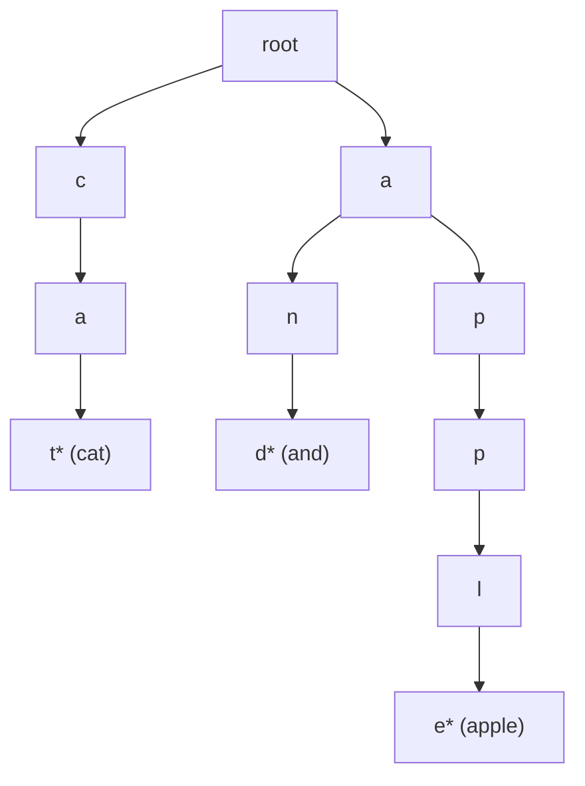

## ==========================================================================
数据结构教程 — 字典树 (Trie)
## ==========================================================================

## 📋 章节概述

字典树（Trie），又称前缀树或单词查找树，是一种用于高效存储和检索字符串集合的
树形数据结构。每个节点代表一个字符，从根节点到某个标记节点的路径构成一个完整字符串。

字典树在搜索引擎自动补全、拼写检查、IP路由表、电话簿查找等场景中广泛应用。
本章将从字典树的基本概念讲起，深入实现原理，全面覆盖各种变体和操作，
最后通过实例和习题巩固所学知识。

> 📌 **底层实现参考**：如果需要深入理解本章数据结构的底层实现（纯C手写、内存布局、指针操作），请参阅 [[../../C语言深化教程/3数据结构/09_高级数据结构|C语言教程: 高级数据结构]]。C教程侧重手动实现与内存本质，本教程侧重STL使用与算法优化，两者互补。

## ==========================================================================
### 📖 第一节: 基础语法 + 计算机底层原理
## ==========================================================================

1.1 字典树的基本概念
-----------------------

字典树的核心特征：
- 根节点不包含字符，其余每个节点包含一个字符
- 从根节点到某一节点的路径上字符连接起来即为该节点对应的字符串
- 每个节点的所有子节点包含的字符各不相同
- 标记节点（isEnd）表示从根到该节点构成一个完整单词

时间复杂度：
- 插入：O(m)，m为字符串长度
- 查找：O(m)
- 前缀匹配：O(m)

空间复杂度：最坏情况O(字符集大小 × 字符串总长度)

1.2 字典树的底层结构
-----------------------

存储单词集合 {apple, and, cat}：



> 带 "*" 的节点标记为 isEnd=true，表示从根到该节点构成完整单词。

| 操作 | 时间复杂度 | 说明 |
|------|-----------|------|
| 插入单词 | O(m) | m = 单词长度，每个字符一层 |
| 查找单词 | O(m) | 沿途检查每层字符是否存在 |
| 前缀匹配 | O(m) | 找到前缀最后一个字符的节点 |
| 删除单词 | O(m) | 找到后从叶向上清理无用节点 |
| 列出所有单词 | O(节点数) | DFS 遍历所有标记节点 |

1.3 标准实现（数组方式）

```pseudocode
CLASS Trie {
PRIVATE:
    STRUCT TrieNode {
        TrieNode* children[26];
        bool isEnd;
        int prefixCount;

        TrieNode() : isEnd(FALSE), prefixCount(0) {
            for (int i = 0; i < 26; ++i)
                children[i] = NULL;
        }
    };

    TrieNode* root;

    FUNCTION destroy(TrieNode* node) {
        if (!node) return;
        for (int i = 0; i < 26; ++i)
            destroy(node->children[i]);
        DELETE node;
    }

PUBLIC:
    Trie() { root = NEW TrieNode(); }

    ~Trie() { destroy(root); }

    FUNCTION insert(string word) {
        TrieNode* curr = root;
        for (char c : word) {
            int idx = c - 'a';
            if (!curr->children[idx])
                curr->children[idx] = NEW TrieNode();
            curr = curr->children[idx];
            curr->prefixCount++;
        }
        curr->isEnd = TRUE;
    }

    FUNCTION search(string word) {
        TrieNode* curr = root;
        for (char c : word) {
            int idx = c - 'a';
            if (!curr->children[idx]) return FALSE;
            curr = curr->children[idx];
        }
        return curr->isEnd;
    }

    FUNCTION startsWith(string prefix) {
        TrieNode* curr = root;
        for (char c : prefix) {
            int idx = c - 'a';
            if (!curr->children[idx]) return FALSE;
            curr = curr->children[idx];
        }
        return TRUE;
    }

    FUNCTION countPrefix(string prefix) {
        TrieNode* curr = root;
        for (char c : prefix) {
            int idx = c - 'a';
            if (!curr->children[idx]) return 0;
            curr = curr->children[idx];
        }
        return curr->prefixCount;
    }

    FUNCTION remove(string word) {
        return removeHelper(root, word, 0);
    }

PRIVATE:
    FUNCTION removeHelper(TrieNode* node, string word, int depth) {
        if (!node) return FALSE;
        if (depth == word.size()) {
            if (!node->isEnd) return FALSE;
            node->isEnd = FALSE;
            return TRUE;
        }
        int idx = word[depth] - 'a';
        if (!removeHelper(node->children[idx], word, depth + 1))
            return FALSE;
        node->children[idx]->prefixCount--;
        if (node->children[idx]->prefixCount == 0 && !node->children[idx]->isEnd) {
            destroy(node->children[idx]);
            node->children[idx] = NULL;
        }
        return TRUE;
    }
};

FUNCTION main() {
    Trie trie;
    trie.insert("apple");
    trie.insert("app");
    trie.insert("application");
    trie.insert("banana");

    PRINT boolalpha;
    PRINT "search 'apple': " + trie.search("apple") + NEWLINE;
    PRINT "search 'app': " + trie.search("app") + NEWLINE;
    PRINT "search 'ap': " + trie.search("ap") + NEWLINE;
    PRINT "startsWith 'app': " + trie.startsWith("app") + NEWLINE;
    PRINT "countPrefix 'app': " + trie.countPrefix("app") + NEWLINE;

    return 0;
}

```

---
**实现练习**: 用 C 或 C++ 自行实现上述结构。完成后与 AI 对话检查正确性。
---

1.4 哈希表实现（支持任意字符集）

```pseudocode
CLASS TrieMap {
PRIVATE:
    STRUCT TrieNode {
        unordered_map<char, TrieNode*> children;
        bool isEnd = FALSE;
        int value = 0;
    };

    TrieNode* root;

PUBLIC:
    TrieMap() { root = NEW TrieNode(); }

    FUNCTION insert(string key, int val) {
        TrieNode* curr = root;
        for (char c : key) {
            if (curr->children.find(c) == curr->children.end())
                curr->children[c] = NEW TrieNode();
            curr = curr->children[c];
        }
        curr->isEnd = TRUE;
        curr->value = val;
    }

    FUNCTION get(string key) {
        TrieNode* curr = root;
        for (char c : key) {
            it = curr->children.find(c);
            if (it == curr->children.end()) return -1;
            curr = it->second;
        }
        return curr->isEnd ? curr->value : -1;
    }

    vector<string> getAllWithPrefix(string prefix) {
        vector<string> result;
        TrieNode* curr = root;
        for (char c : prefix) {
            it = curr->children.find(c);
            if (it == curr->children.end()) return result;
            curr = it->second;
        }
        dfs(curr, prefix, result);
        return result;
    }

PRIVATE:
    FUNCTION dfs(TrieNode* node, string current, vector<string> result) {
        if (node->isEnd) result.push_back(current);
        for ( [ch, child] : node->children) {
            dfs(child, current + ch, result);
        }
    }
};

FUNCTION main() {
    TrieMap trie;
    trie.insert("hello", 1);
    trie.insert("help", 2);
    trie.insert("heap", 3);
    trie.insert("world", 4);

    words = trie.getAllWithPrefix("he");
    PRINT "以'he'开头的词: ";
    for ( w : words)
        PRINT w + " ";
    PRINT endl;

    return 0;
}

```

---
**实现练习**: 用 C 或 C++ 自行实现上述结构。完成后与 AI 对话检查正确性。
---

## ==========================================================================
### 📖 第二节: 实现思路
## ==========================================================================

2.1 自动补全功能

```pseudocode
CLASS AutoComplete {
PRIVATE:
    STRUCT TrieNode {
        TrieNode* children[26]{};
        bool isEnd = FALSE;
        int frequency = 0;
    };

    TrieNode* root;

    FUNCTION collectWords(TrieNode* node, string current,
                      vector<pair<string, int>> results) {
        if (node->isEnd)
            results.emplace_back(current, node->frequency);
        for (int i = 0; i < 26; ++i) {
            if (node->children[i]) {
                current.push_back('a' + i);
                collectWords(node->children[i], current, results);
                current.pop_back();
            }
        }
    }

PUBLIC:
    AutoComplete() { root = NEW TrieNode(); }

    FUNCTION addWord(string word, int freq = 1) {
        TrieNode* curr = root;
        for (char c : word) {
            int idx = c - 'a';
            if (!curr->children[idx])
                curr->children[idx] = NEW TrieNode();
            curr = curr->children[idx];
        }
        curr->isEnd = TRUE;
        curr->frequency += freq;
    }

    vector<string> suggest(string prefix, int topK = 5) {
        TrieNode* curr = root;
        for (char c : prefix) {
            int idx = c - 'a';
            if (!curr->children[idx]) return {};
            curr = curr->children[idx];
        }

        vector<pair<string, int>> candidates;
        string current = prefix;
        collectWords(curr, current, candidates);

        SORT(candidates.begin(), candidates.end(),
                  []( a,  b) { return a.second > b.second; });

        vector<string> result;
        for (int i = 0; i < MIN(topK, candidates.size()); ++i)
            result.push_back(candidates[i].first);
        return result;
    }
};

FUNCTION main() {
    AutoComplete ac;
    ac.addWord("algorithm", 100);
    ac.addWord("alpha", 80);
    ac.addWord("algebra", 60);
    ac.addWord("allocate", 40);
    ac.addWord("apple", 120);
    ac.addWord("application", 200);

    suggestions = ac.suggest("al", 3);
    PRINT "输入'al'的补全建议: ";
    for ( s : suggestions)
        PRINT s + " ";
    PRINT endl;

    return 0;
}

```

---
**实现练习**: 用 C 或 C++ 自行实现上述结构。完成后与 AI 对话检查正确性。
---

2.2 字典序排序

```pseudocode
CLASS TrieSorter {
PRIVATE:
    STRUCT TrieNode {
        TrieNode* children[26]{};
        int wordCount = 0;
    };
    TrieNode* root;

PUBLIC:
    TrieSorter() { root = NEW TrieNode(); }

    FUNCTION insert(string word) {
        TrieNode* curr = root;
        for (char c : word) {
            int idx = c - 'a';
            if (!curr->children[idx])
                curr->children[idx] = NEW TrieNode();
            curr = curr->children[idx];
        }
        curr->wordCount++;
    }

    vector<string> getSorted() {
        vector<string> result;
        string current;
        dfs(root, current, result);
        return result;
    }

PRIVATE:
    FUNCTION dfs(TrieNode* node, string current, vector<string> result) {
        for (int i = 0; i < node->wordCount; ++i)
            result.push_back(current);
        for (int i = 0; i < 26; ++i) {
            if (node->children[i]) {
                current.push_back('a' + i);
                dfs(node->children[i], current, result);
                current.pop_back();
            }
        }
    }
};

FUNCTION main() {
    TrieSorter sorter;
    vector<string> words = {"banana", "apple", "cherry", "avocado", "blueberry"};

    for ( w : words)
        sorter.insert(w);

    sorted = sorter.getSorted();
    PRINT "字典序排序: ";
    for ( w : sorted)
        PRINT w + " ";
    PRINT endl;

    return 0;
}

```

---
**实现练习**: 用 C 或 C++ 自行实现上述结构。完成后与 AI 对话检查正确性。
---

2.3 最长公共前缀

```pseudocode
CLASS TrieLCP {
PRIVATE:
    STRUCT TrieNode {
        TrieNode* children[26]{};
        int childCount = 0;
        bool isEnd = FALSE;
    };
    TrieNode* root;

PUBLIC:
    TrieLCP() { root = NEW TrieNode(); }

    FUNCTION insert(string word) {
        TrieNode* curr = root;
        for (char c : word) {
            int idx = c - 'a';
            if (!curr->children[idx]) {
                curr->children[idx] = NEW TrieNode();
                curr->childCount++;
            }
            curr = curr->children[idx];
        }
        curr->isEnd = TRUE;
    }

    FUNCTION longestCommonPrefix() {
        string lcp;
        TrieNode* curr = root;
        while (curr->childCount == 1 && !curr->isEnd) {
            for (int i = 0; i < 26; ++i) {
                if (curr->children[i]) {
                    lcp.push_back('a' + i);
                    curr = curr->children[i];
                    break;
                }
            }
        }
        return lcp;
    }
};

FUNCTION main() {
    TrieLCP trie;
    trie.insert("flower");
    trie.insert("flow");
    trie.insert("flight");

    PRINT "最长公共前缀: " + trie.longestCommonPrefix() + NEWLINE;
    return 0;
}

```

---
**实现练习**: 用 C 或 C++ 自行实现上述结构。完成后与 AI 对话检查正确性。
---

2.4 01字典树（求最大异或值）

```pseudocode
CLASS XORTrie {
PRIVATE:
    STRUCT TrieNode {
        TrieNode* children[2]{};
    };
    TrieNode* root;

PUBLIC:
    XORTrie() { root = NEW TrieNode(); }

    FUNCTION insert(int num) {
        TrieNode* curr = root;
        for (int i = 31; i >= 0; --i) {
            int bit = (num >> i)  1;
            if (!curr->children[bit])
                curr->children[bit] = NEW TrieNode();
            curr = curr->children[bit];
        }
    }

    FUNCTION queryMaxXor(int num) {
        TrieNode* curr = root;
        int result = 0;
        for (int i = 31; i >= 0; --i) {
            int bit = (num >> i)  1;
            int want = 1 - bit;
            if (curr->children[want]) {
                result |= (1 << i);
                curr = curr->children[want];
            } else {
                curr = curr->children[bit];
            }
        }
        return result;
    }

    FUNCTION findMaxXorPair(vector<int> nums) {
        int maxXor = 0;
        for (int num : nums) {
            insert(num);
            maxXor = MAX(maxXor, queryMaxXor(num));
        }
        return maxXor;
    }
};

FUNCTION main() {
    XORTrie trie;
    vector<int> nums = {3, 10, 5, 25, 2, 8};
    PRINT "最大异或值: " + trie.findMaxXorPair(nums) + NEWLINE;
    return 0;
}

```

---
**实现练习**: 用 C 或 C++ 自行实现上述结构。完成后与 AI 对话检查正确性。
---

## ==========================================================================
### 📖 第三节: 应用场景
## ==========================================================================

3.1 案例一：拼写检查器

```pseudocode
CLASS SpellChecker {
PRIVATE:
    STRUCT TrieNode {
        TrieNode* children[26]{};
        bool isEnd = FALSE;
    };
    TrieNode* root;

    FUNCTION suggestHelper(TrieNode* node, string current,
                       vector<string> suggestions, int limit) {
        if (suggestions.size() >= limit) return;
        if (node->isEnd)
            suggestions.push_back(current);
        for (int i = 0; i < 26; ++i) {
            if (node->children[i]) {
                current.push_back('a' + i);
                suggestHelper(node->children[i], current, suggestions, limit);
                current.pop_back();
            }
        }
    }

PUBLIC:
    SpellChecker() { root = NEW TrieNode(); }

    FUNCTION loadDictionary(vector<string> words) {
        for ( word : words)
            insert(word);
    }

    FUNCTION insert(string word) {
        TrieNode* curr = root;
        for (char c : word) {
            int idx = c - 'a';
            if (!curr->children[idx])
                curr->children[idx] = NEW TrieNode();
            curr = curr->children[idx];
        }
        curr->isEnd = TRUE;
    }

    FUNCTION isCorrect(string word) {
        TrieNode* curr = root;
        for (char c : word) {
            int idx = c - 'a';
            if (!curr->children[idx]) return FALSE;
            curr = curr->children[idx];
        }
        return curr->isEnd;
    }

    vector<string> getSuggestions(string prefix, int limit = 5) {
        TrieNode* curr = root;
        for (char c : prefix) {
            int idx = c - 'a';
            if (!curr->children[idx]) return {};
            curr = curr->children[idx];
        }
        vector<string> suggestions;
        string current = prefix;
        suggestHelper(curr, current, suggestions, limit);
        return suggestions;
    }
};

FUNCTION main() {
    SpellChecker checker;
    checker.loadDictionary({"apple", "application", "apply", "approach",
                            "banana", "band", "bank", "bar",
                            "cat", "car", "card", "care"});

    string input = "appl";
    if (!checker.isCorrect(input)) {
        PRINT "'" + input + "' 拼写不正确，您是否想输入：" + NEWLINE;
        suggestions = checker.getSuggestions(input);
        for ( s : suggestions)
            PRINT "  - " + s + NEWLINE;
    }

    return 0;
}

```

---
**实现练习**: 用 C 或 C++ 自行实现上述结构。完成后与 AI 对话检查正确性。
---

3.2 案例二：IP路由表（最长前缀匹配）

```pseudocode
CLASS IPRouter {
PRIVATE:
    STRUCT TrieNode {
        TrieNode* children[2]{};
        int nextHop = -1;
    };
    TrieNode* root;

    vector<int> ipToBits(string ip) {
        vector<int> bits;
        int num = 0;
        int dotCount = 0;
        for (char c : ip) {
            if (c == '.') {
                for (int i = 7; i >= 0; --i)
                    bits.push_back((num >> i)  1);
                num = 0;
                dotCount++;
            } else {
                num = num * 10 + (c - '0');
            }
        }
        for (int i = 7; i >= 0; --i)
            bits.push_back((num >> i)  1);
        return bits;
    }

PUBLIC:
    IPRouter() { root = NEW TrieNode(); }

    FUNCTION addRoute(string ip, int prefixLen, int hop) {
        bits = ipToBits(ip);
        TrieNode* curr = root;
        for (int i = 0; i < prefixLen; ++i) {
            int bit = bits[i];
            if (!curr->children[bit])
                curr->children[bit] = NEW TrieNode();
            curr = curr->children[bit];
        }
        curr->nextHop = hop;
    }

    FUNCTION lookup(string ip) {
        bits = ipToBits(ip);
        TrieNode* curr = root;
        int lastHop = -1;
        for (int bit : bits) {
            if (!curr->children[bit]) break;
            curr = curr->children[bit];
            if (curr->nextHop != -1)
                lastHop = curr->nextHop;
        }
        return lastHop;
    }
};

FUNCTION main() {
    IPRouter router;
    router.addRoute("192.168.0.0", 16, 1);
    router.addRoute("192.168.1.0", 24, 2);
    router.addRoute("10.0.0.0", 8, 3);

    PRINT "192.168.1.100 -> 端口 " + router.lookup("192.168.1.100") + NEWLINE;
    PRINT "192.168.2.50 -> 端口 " + router.lookup("192.168.2.50") + NEWLINE;
    PRINT "10.1.2.3 -> 端口 " + router.lookup("10.1.2.3") + NEWLINE;

    return 0;
}

```

---
**实现练习**: 用 C 或 C++ 自行实现上述结构。完成后与 AI 对话检查正确性。
---

3.3 案例三：敏感词过滤（AC自动机简化版）

```pseudocode
CLASS SensitiveFilter {
PRIVATE:
    STRUCT TrieNode {
        TrieNode* children[256]{};
        bool isEnd = FALSE;
        int wordLen = 0;
    };
    TrieNode* root;

PUBLIC:
    SensitiveFilter() { root = NEW TrieNode(); }

    FUNCTION addWord(string word) {
        TrieNode* curr = root;
        for (unsigned char c : word) {
            if (!curr->children[c])
                curr->children[c] = NEW TrieNode();
            curr = curr->children[c];
        }
        curr->isEnd = TRUE;
        curr->wordLen = word.size();
    }

    FUNCTION filter(string text, char replacement = '*') {
        string result = text;
        for (int i = 0; i < text.size(); ++i) {
            TrieNode* curr = root;
            for (int j = i; j < text.size(); ++j) {
                unsigned char c = text[j];
                if (!curr->children[c]) break;
                curr = curr->children[c];
                if (curr->isEnd) {
                    for (int k = i; k <= j; ++k)
                        result[k] = replacement;
                }
            }
        }
        return result;
    }
};

FUNCTION main() {
    SensitiveFilter filter;
    filter.addWord("bad");
    filter.addWord("ugly");
    filter.addWord("hate");

    string text = "This is a bad example with ugly words and hate speech.";
    PRINT "原文: " + text + NEWLINE;
    PRINT "过滤: " + filter.filter(text) + NEWLINE;

    return 0;
}

```

---
**实现练习**: 用 C 或 C++ 自行实现上述结构。完成后与 AI 对话检查正确性。
---

## ==========================================================================
### 📖 第四节: 课后习题
## ==========================================================================

1. 基础题：实现一个支持插入、查找、删除和前缀统计的字典树。

2. 应用题：使用字典树实现一个T9键盘输入法（手机九宫格）。
   - 每个数字键对应多个字母
   - 根据按键序列给出候选词

3. 进阶题：实现一个支持通配符匹配的字典树。
   - 支持 '.' 匹配任意单个字符
   - 支持 '*' 匹配任意数量字符

4. 洛谷练习：[P2580 于是他错误的点名开始了](https://www.luogu.com.cn/problem/P2580)

## ==========================================================================


## --------------------------------------------------------------------------
## 🔗 知识网络
## --------------------------------------------------------------------------

- **上一章**: [[I_树_Tree_BST_AVL]] | **下一章**: [[H_图_Graph]] | **返回**: [[DSA学习路线]]
- **算法技巧**: [[../算法/算法技巧/字符串]], [[../算法/算法技巧/字符串哈希|字符串哈希]], [[../算法/算法技巧/KMP|KMP]]
- **进阶应用**: [[../算法/算法技巧/AC自动机|AC 自动机]] (Trie + KMP 的多模式串匹配)
- **竞赛实战**: [[../路径D-DSA算法刷题|竞赛策略路线图 → Phase 6 字符串算法]]

## ==========================================================================
## 章节测试
## ==========================================================================

### 判断题

> [!question] 判断题 1
> 字典树的查找时间复杂度与树中存储的字符串数量成正比。（ ）
> - [ ] ✅ 正确
> - [ ] ❌ 错误
>
> > [!success]- 点击查看答案
> > 答案: 错误
> > 
> > **解析**: 字典树查找时间复杂度为O(m)，m为待查找字符串的长度，与存储的字符串数量无关。

> [!question] 判断题 2
> 字典树的每个节点最多有26个子节点（仅考虑小写英文字母）。（ ）
> - [ ] ✅ 正确
> - [ ] ❌ 错误
>
> > [!success]- 点击查看答案
> > 答案: 正确
> > 
> > **解析**: 对于仅存储小写英文字母的字典树，每个节点最多有26个子节点，分别对应a-z。

> [!question] 判断题 3
> 字典树中，从根节点到任意节点的路径都代表一个已插入的完整字符串。（ ）
> - [ ] ✅ 正确
> - [ ] ❌ 错误
>
> > [!success]- 点击查看答案
> > 答案: 错误
> > 
> > **解析**: 只有标记了isEnd=true的节点才表示一个完整字符串的结尾，中间节点只是前缀路径的一部分。

> [!question] 判断题 4
> 字典树可以用来进行字典序排序。（ ）
> - [ ] ✅ 正确
> - [ ] ❌ 错误
>
> > [!success]- 点击查看答案
> > 答案: 正确
> > 
> > **解析**: 对字典树进行前序遍历（按字符顺序遍历子节点），即可获得所有字符串的字典序排序。

> [!question] 判断题 5
> 01字典树只能用于处理非负整数。（ ）
> - [ ] ✅ 正确
> - [ ] ❌ 错误
>
> > [!success]- 点击查看答案
> > 答案: 错误
> > 
> > **解析**: 01字典树也可以处理负整数，只需要在最高位做特殊处理（如加偏移量或将符号位取反）。

> [!question] 判断题 6
> 字典树相比哈希表，在前缀匹配操作上具有明显优势。（ ）
> - [ ] ✅ 正确
> - [ ] ❌ 错误
>
> > [!success]- 点击查看答案
> > 答案: 正确
> > 
> > **解析**: 哈希表只能精确匹配整个键，无法高效进行前缀查询，而字典树天然支持前缀匹配。

> [!question] 判断题 7
> 压缩字典树（Compressed Trie/Patricia Tree）中每个内部节点至少有2个子节点。（ ）
> - [ ] ✅ 正确
> - [ ] ❌ 错误
>
> > [!success]- 点击查看答案
> > 答案: 正确
> > 
> > **解析**: 压缩字典树将只有一个子节点的路径合并为一条边，因此每个内部节点至少有2个子节点。

> [!question] 判断题 8
> 字典树的空间复杂度总是优于哈希表。（ ）
> - [ ] ✅ 正确
> - [ ] ❌ 错误
>
> > [!success]- 点击查看答案
> > 答案: 错误
> > 
> > **解析**: 字典树在稀疏情况下（字符串间共享前缀少）可能比哈希表消耗更多空间，因为每个节点需要维护子节点数组。

> [!question] 判断题 9
> 使用哈希表实现的字典树可以支持任意字符集。（ ）
> - [ ] ✅ 正确
> - [ ] ❌ 错误
>
> > [!success]- 点击查看答案
> > 答案: 正确
> > 
> > **解析**: 使用unordered_map作为子节点映射可以支持任意字符集，不受固定数组大小限制。

> [!question] 判断题 10
> 字典树删除操作的时间复杂度为O(1)。（ ）
> - [ ] ✅ 正确
> - [ ] ❌ 错误
>
> > [!success]- 点击查看答案
> > 答案: 错误
> > 
> > **解析**: 字典树删除操作需要沿路径回溯，时间复杂度为O(m)，m为字符串长度。

### 选择题

> [!question] 选择题 1
> 在一个只存储小写字母的标准字典树中，插入n个平均长度为m的字符串，最坏情况下空间复杂度为？
> - [ ] A. O(n)
> - [ ] B. O(n×m)
> - [ ] C. O(26×n×m)
> - [ ] D. O(26^m)
>
> > [!success]- 点击查看答案
> > 正确答案: C
> > 
> > **解析**: 最坏情况下每个字符串没有公共前缀，每个节点需要26个指针空间，总共n×m个节点，故为O(26×n×m)。

> [!question] 选择题 2
> 字典树最适合解决以下哪个问题？
> - [ ] A. 查找数组中第K大的元素
> - [ ] B. 查找所有以某前缀开头的字符串
> - [ ] C. 对整数数组进行排序
> - [ ] D. 查找字符串中的最长回文子串
>
> > [!success]- 点击查看答案
> > 正确答案: B
> > 
> > **解析**: 字典树的核心优势就是前缀匹配，可以高效找到所有共享某个前缀的字符串。

> [!question] 选择题 3
> 以下关于字典树和哈希表的比较，哪个说法是正确的？
> - [ ] A. 哈希表的精确查找比字典树快
> - [ ] B. 字典树不支持精确查找
> - [ ] C. 字典树支持有序遍历，哈希表不支持
> - [ ] D. 哈希表的空间效率总是比字典树差
>
> > [!success]- 点击查看答案
> > 正确答案: C
> > 
> > **解析**: 字典树按字典序组织数据，天然支持有序遍历；哈希表的元素是无序存储的。哈希表精确查找平均O(1)但字典树是O(m)；两者都支持精确查找；空间效率取决于具体场景。

> [!question] 选择题 4
> 01字典树主要用于解决什么问题？
> - [ ] A. 字符串匹配
> - [ ] B. 最大异或值
> - [ ] C. 最短路径
> - [ ] D. 最长公共子序列
>
> > [!success]- 点击查看答案
> > 正确答案: B
> > 
> > **解析**: 01字典树将整数按二进制位存储，通过贪心策略在每一位尽量选择相反的方向，从而找到最大异或值。

> [!question] 选择题 5
> 向字典树中插入字符串"abc"和"abd"后，树中共有多少个非根节点？
> - [ ] A. 3
> - [ ] B. 4
> - [ ] C. 5
> - [ ] D. 6
>
> > [!success]- 点击查看答案
> > 正确答案: B
> > 
> > **解析**: "abc"和"abd"共享前缀"ab"，所以节点为：a、b、c、d，共4个非根节点。

> [!question] 选择题 6
> 压缩字典树（Patricia Tree）的主要优势是什么？
> - [ ] A. 查找更快
> - [ ] B. 节省空间
> - [ ] C. 支持更多字符集
> - [ ] D. 支持并发操作
>
> > [!success]- 点击查看答案
> > 正确答案: B
> > 
> > **解析**: 压缩字典树将只有一个子节点的连续路径压缩为一条边上的字符串，显著减少节点数量，节省空间。

> [!question] 选择题 7
> 在字典树中查找前缀"app"是否存在，需要访问多少个节点（不含根节点）？
> - [ ] A. 1
> - [ ] B. 2
> - [ ] C. 3
> - [ ] D. 取决于树中存储的字符串数量
>
> > [!success]- 点击查看答案
> > 正确答案: C
> > 
> > **解析**: 需要依次访问'a'、'p'、'p'对应的3个节点，与树中存储的字符串数量无关。

> [!question] 选择题 8
> 以下哪个不是字典树的典型应用场景？
> - [ ] A. 搜索引擎自动补全
> - [ ] B. 拼写检查
> - [ ] C. IP路由最长前缀匹配
> - [ ] D. 图的最短路径计算
>
> > [!success]- 点击查看答案
> > 正确答案: D
> > 
> > **解析**: 图的最短路径计算使用Dijkstra、Floyd等图算法，与字典树无关。字典树常用于字符串前缀相关的问题。

> [!question] 选择题 9
> 如果要在字典树中存储中文词语，最合适的实现方式是？
> - [ ] A. 使用大小为26的数组
> - [ ] B. 使用大小为256的数组
> - [ ] C. 使用哈希表（unordered_map）作为子节点映射
> - [ ] D. 无法使用字典树存储中文
>
> > [!success]- 点击查看答案
> > 正确答案: C
> > 
> > **解析**: 中文字符数量庞大，使用固定大小数组不现实。使用哈希表可以按需存储子节点，适合大字符集场景。

> [!question] 选择题 10
> 对字典树进行DFS遍历（按子节点字母顺序），等价于对所有存储的字符串进行什么操作？
> - [ ] A. 按长度排序
> - [ ] B. 按字典序排序
> - [ ] C. 按插入顺序输出
> - [ ] D. 按频率排序
>
> > [!success]- 点击查看答案
> > 正确答案: B
> > 
> > **解析**: 字典树按字符组织，DFS时按字母顺序遍历子节点，输出结果自然是字典序。

### 编程大题

> [!question] 编程大题 1
> **题目**: 实现一个单词搜索系统，支持以下操作：
> 1. `addWord(word)` - 添加单词
> 2. `search(pattern)` - 搜索单词，pattern中'.'可以匹配任意一个字符
> 
> 例如：添加"bad","dad","mad"后，search("pad")返回false，search(".ad")返回true，search("b..")返回true。
>
> > [!success]- 点击查看提示
> > 使用字典树存储单词，search时遇到'.'对当前节点的所有子节点进行递归搜索。

> [!question] 编程大题 2
> **题目**: 洛谷 [P2580 于是他错误的点名开始了](https://www.luogu.com.cn/problem/P2580)
> 
> 给定n个学生姓名，进行m次点名。如果该学生存在且是第一次被点到，输出"OK"；如果已经被点过，输出"REPEAT"；如果不存在，输出"WRONG"。
>
> > [!success]- 点击查看提示
> > 使用字典树存储所有学生姓名，在终止节点添加一个状态标记（0=未点名，1=已点名），查询时根据状态输出不同结果。

> [!question] 编程大题 3
> **题目**: 给定一个整数数组，找出数组中任意两个数的最大异或值。要求时间复杂度O(n×logMAX)。
> 
> 示例：输入[3, 10, 5, 25, 2, 8]，输出28（5 XOR 25 = 28）。
>
> > [!success]- 点击查看提示
> > 使用01字典树，将每个数字的32位二进制表示插入字典树。对每个数字查询时，在每一位贪心地选择与当前位相反的方向以最大化异或值。
