建议先阅读: [[D_容器_Container|容器概览]], [[F_栈_Stack|栈]]（递归与栈的关系），[[G_队列_Queue|队列]]（层序遍历依赖队列）

---

## 原理

树（Tree）是计算机科学中最丰富的非线性结构。它是递归定义的自然体现——一棵树的子树仍然是树。这种自相似性使得递归成为树操作的首选范式。

### 树在哪里

文件系统是一棵倒挂的树——根目录 `/` 在顶部，子目录层层展开。编译器把源代码解析成抽象语法树（AST），每个表达式是一棵子树。HTML 的 DOM 是一棵树——`<html>` 是根，每个标签是子节点，CSS 选择器沿着树路径匹配。数据库的 B+ 树索引让百万行查询从全表扫描的 $O(n)$ 降到 $O(\log n)$。这些场景的共同主题——**层次关系的自然表达与高效检索**——正是树的核心用武之地。

### 术语体系

![[../assets/images/二叉树.png]]
![[../assets/images/树形结构.png]]

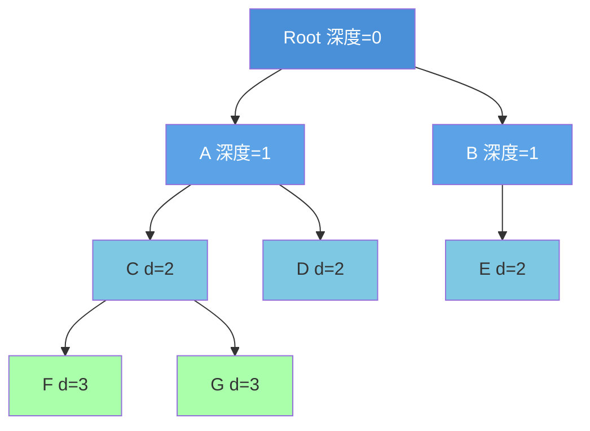

节点 F 的高度 = 0 (叶子), 节点 A 的高度 = 2, 树的高度 = 3
节点 F 的深度 = 3 (从根起的边数)

| 术语 | 定义 | 例（以 F 为参考） |
|------|------|---------|
| 深度（Depth） | 从根到该节点的边数 | 3 |
| 高度（Height） | 该节点到最深叶子的边数 | 0（叶子） |
| 层（Level） | 深度 + 1 | 第 4 层 |
| 平衡因子（BF） | 左子树高度 - 右子树高度 | — |

### 二叉树的四种遍历

二叉树遍历是递归应用的经典场景。每种遍历将"处理当前节点"的动作放在递归调用的不同位置：

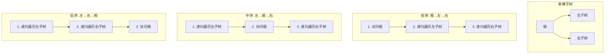

| 遍历方式 | 顺序 | 典型应用 |
|----------|------|---------|
| 前序（Pre-order） | 根 → 左 → 右 | 序列化/反序列化（`[根, 左子树序列, 右子树序列]` 唯一确定一棵树）、前缀表达式 |
| 中序（In-order） | 左 → 根 → 右 | BST 的中序遍历输出升序序列 |
| 后序（Post-order） | 左 → 右 → 根 | 释放树的内存（必须先释放子树再释放根）、后缀表达式、计算目录总大小 |
| 层序（Level-order） | 逐层、从左到右 | BFS 搜索、判断完全二叉树、二叉树的最大宽度 |

![[../assets/images/二叉树遍历.png]]

#### 遍历手算轨迹

以这棵完全二叉树为例：

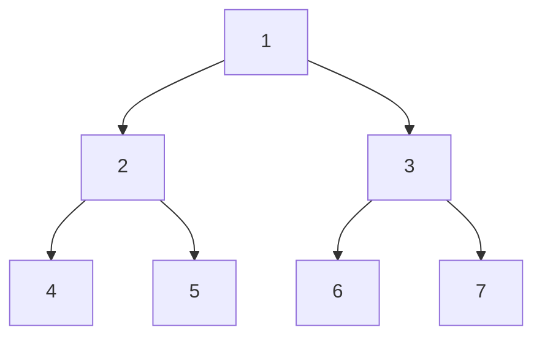

| 遍历 | 序列 | 过程 |
|------|------|------|
| 前序 | 1, 2, 4, 5, 3, 6, 7 | 根→左→右：先访问 1，递归左子树(2→4→5)，递归右子树(3→6→7) |
| 中序 | 4, 2, 5, 1, 6, 3, 7 | 左→根→右：最左 4，回退 2，右 5，回退 1，右子树同理 |
| 后序 | 4, 5, 2, 6, 7, 3, 1 | 左→右→根：叶子先输出，根最后 |
| 层序 | 1, 2, 3, 4, 5, 6, 7 | 逐层从左到右：BFS 遍历 |

**自测：遍历序列**

给定二叉树：
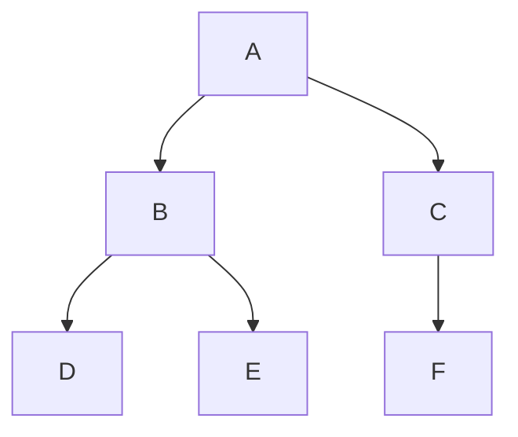
写出前序、中序、后序、层序遍历序列。

> 答案：
>
> 前序：A, B, D, E, C, F
> 中序：D, B, E, A, C, F
> 后序：D, E, B, F, C, A
> 层序：A, B, C, D, E, F

**前序+中序唯一确定二叉树**：给定前序和中序遍历序列，可以重建一棵二叉树。前序的第一个元素是根，在中序中找出根的位置后，左边是左子树的中序序列，右边是右子树的中序序列。递归即可构建。这是分治思想的典型应用——每个子问题是一个子树的构建。

#### 前序+中序重建手算

给定前序 `[A,B,D,E,C,F]` 和中序 `[D,B,E,A,F,C]`，重建二叉树：

**第 1 步**：前序首元素 A 是根。在中序中 A 的位置 → 左子树中序 `[D,B,E]`，右子树中序 `[F,C]`。

**第 2 步**：左子树的前序为 `[B,D,E]`，首元素 B 是左子树的根。中序 `[D,B,E]` 中 B 的位置 → B 的左子树中序 `[D]`，右子树中序 `[E]`。

**第 3 步**：D 和 E 都是叶子。

**第 4 步**：右子树的前序为 `[C,F]`，首元素 C 是右子树的根。中序 `[F,C]` 中 C 的位置 → C 的左子树中序 `[F]`。

**第 5 步**：F 是叶子。


**自测**：前序 `[1,2,4,5,3,6,7]` + 中序 `[4,2,5,1,6,3,7]`，画出二叉树。

> 答案：即正文遍历手算轨迹中的完全二叉树——根 1，左子树(2,4,5)，右子树(3,6,7)。

### 二叉搜索树（BST）

BST 通过有序性约束将查找从 $O(n)$ 加速到 $O(\log n)$（平衡情况下）：

```
性质：对于任意节点 X，
 左子树中的所有节点值 < X 的值 < 右子树中的所有节点值
```

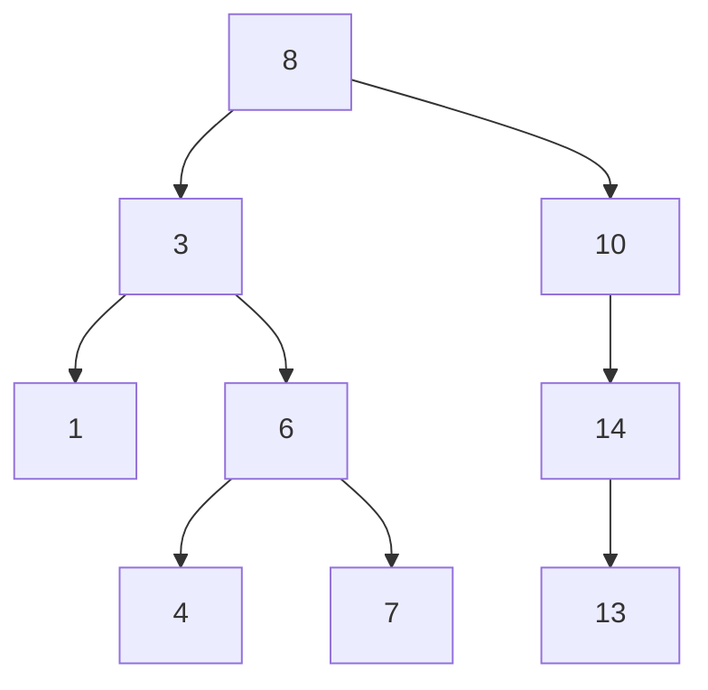

中序遍历这棵 BST：1 → 3 → 4 → 6 → 7 → 8 → 10 → 13 → 14。即升序输出。

**BST 的三个操作**：

| 操作 | 平均 | 最坏 | 核心步骤 |
|------|:---:|:---:|------|
| 查找（search） | $O(\log n)$ | $O(n)$ | 与根比较：小则走左，大则走右 |
| 插入（insert） | $O(\log n)$ | $O(n)$ | 查找到失败位置，在 leaf 的空位上插入 |
| 删除（delete） | $O(\log n)$ | $O(n)$ | 三种情况：叶子（直删）、单子（用子代替）、双子（用后继代替） |

**BST 删除的三个情况**：


中序后继是 BST 中 key 排序下"正好比当前节点大的下一个节点"。选择它替代被删节点，可以保证 BST 性质完全保持不变——所有左子树的值 < 后继的值 < 所有右子树的值。

#### BST 删除手算轨迹

以 BST `[8, 3, 10, 1, 6, 14, 4, 7, 13]` 为例，逐步删除：

**初始树**：


**删除 7（情况 1：叶子）**：直接删除，父节点 6 的 right 置 NULL。
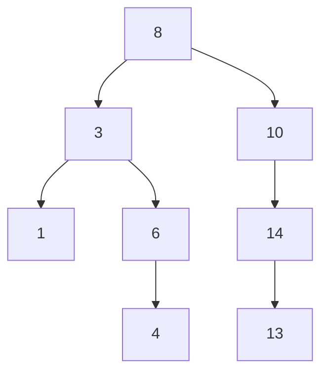

**删除 6（情况 2：单子）**：6 只有左子 4，用 4 代替 6 的位置。
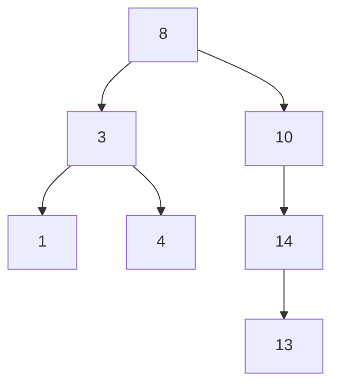

**删除 3（情况 3：双子）**：3 有左子 1 和右子 4。找中序后继——右子树最小值 = 4。将 4 复制到 3 的位置，删除原 4 节点（叶子）。
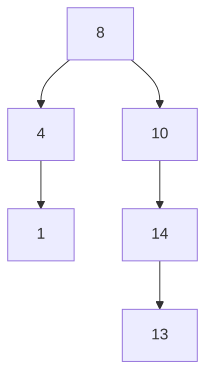

**自测：BST 删除**

给定 BST `[15, 6, 18, 3, 7, 17, 20, 2, 4, 13, 9]`，删除 6 后画出新树（写出所用情况）。

> 答案：
>
> 6 有左子(3)和右子(7) → 情况 3。中序后继 = 右子树最小值 = 7。
> 用 7 替换 6，删除原 7（叶子）。
> ```mermaid
> graph TD
>     N15["15"] --> N7["7"]
>     N15 --> N18["18"]
>     N7 --> N3["3"]
>     N18 --> N17["17"]
>     N18 --> N20["20"]
>     N3 --> N2["2"]
>     N3 --> N4["4"]
> ```
> 右子树：13 和 9 仍在 15 的左子树中——等一下，需要重新检查原始树的结构。
>
> 更正：原始 BST 中 13 在 18 的左子树路径上（15→18→17→13 不对）。按 BST 性质，13 < 15 应在 15 的左子树。实际原始树为：15(根), 左子树(6→3→(2,4), 7→(...)), 右子树(18→17, 20)。13 应在 15 的左子树中——它大于 6 小于 15，所以在 6 的右子树中。6 的右子树有 7 和 13。13 > 7 所以在 7 的右子树。删除 6 后 7 替上来，13 仍在 7 的右子树：
>
> ```mermaid
> graph TD
>     N15["15"] --> N7["7"]
>     N15 --> N18["18"]
>     N7 --> N3["3"]
>     N7 --> N13["13"]
>     N18 --> N17["17"]
>     N18 --> N20["20"]
>     N3 --> N2["2"]
>     N3 --> N4["4"]
> ```
> 情况 3（双子）：用中序后继 7 替换 6。

**BST 退化的致命性**：

按递增顺序插入 $n$ 个元素到空 BST：
- 第一个元素成为根
- 每个后续元素都比之前的所有元素大
- 因此每个新元素都是在"最右叶子"上追加

结果是一棵深度为 $n$ 的单链——退化为链表。此时查找从 $O(\log n)$ 变为 $O(n)$。这正是自平衡二叉搜索树存在的根本原因。

![[../assets/images/二叉树退化为链表示意图.png]]

### AVL 树——通过旋转维持平衡

AVL 树是最早的自平衡 BST（Adelson-Velsky & Landis, 1962）。核心约束：任意节点的左右子树高度差 $\in \{-1, 0, 1\}$。

**平衡因子（BF）**：

$$
\text{BF}(node) = \text{height}(\text{left}) - \text{height}(\text{right})
$$

$$
\text{BF}(node) \in \{-1, 0, 1\}
$$

当插入或删除导致某个节点的 $|\text{BF}| \geq 2$ 时，需要通过旋转恢复平衡。

**四种旋转场景**：

```mermaid
graph TD
 subgraph "LL — 右旋"
 LL_BEFORE["节点 X (BF=2)<br/> /<br/> Y (BF=1)<br/> /<br/>Z<br/>失衡: 左子树的左子树太重"]
 LL_BEFORE -->|"右旋(X)"| LL_AFTER["Y<br/>/<br/>Z X<br/>平衡恢复"]
 end
 subgraph "RR — 左旋"
 RR_BEFORE["节点 X (BF=-2)<br/> \\<br/> Y (BF=-1)<br/> \\<br/> Z<br/>失衡: 右子树的右子树太重"]
 RR_BEFORE -->|"左旋(X)"| RR_AFTER["Y<br/>/<br/>X Z<br/>平衡恢复"]
 end
 subgraph "LR — 先左旋后右旋"
 LR_BEFORE["节点 X (BF=2)<br/> /<br/> Y (BF=-1)<br/> \\<br/> Z<br/>失衡: 左子树的右子树太重"]
 LR_BEFORE -->|"左旋(Y) → LL"| LR_MID["X (BF=2)<br/> /<br/> Z<br/> /<br/>Y<br/>变成 LL 情形"]
 LR_MID -->|"右旋(X)"| LR_AFTER["Z<br/>/<br/>Y X<br/>平衡恢复"]
 end
 subgraph "RL — 先右旋后左旋"
 RL_BEFORE["节点 X (BF=-2)<br/> \\<br/> Y (BF=1)<br/> /<br/> Z<br/>失衡: 右子树的左子树太重"]
 RL_BEFORE -->|"右旋(Y) → RR"| RL_MID["X (BF=-2)<br/> \\<br/> Z<br/> \\<br/> Y<br/>变成 RR 情形"]
 RL_MID -->|"左旋(X)"| RL_AFTER["Z<br/>/<br/>X Y<br/>平衡恢复"]
 end
```

**旋转的原理**——以 LL 右旋为例：将失衡节点的左子节点"提上来"成为新的子树根，原根成为新根的右子节点。旋转保持了 BST 性质（中序遍历不变），同时将左子树的高度降低了 1，右子树的高度增加了 1——左右高度从不平衡的 2 恢复到 0 或 1。

#### AVL 建树手算轨迹

给定插入序列 `[3, 2, 1, 4, 5, 6, 7]`，逐步构建 AVL 树并标注旋转类型：

| 步 | 插入 | 树状态（简化） | 失衡节点 | 旋转 | 结果 |
|:-:|:---:|------|:---:|:---:|------|
| 1 | 3 | `(3)` | — | — | BF(3)=0 |
| 2 | 2 | `(3,(2))` | — | — | BF(3)=-1 |
| 3 | 1 | `(3,(2,(1)))` | 3 | **LL** | 右旋 → `(2,(1),(3))` |
| 4 | 4 | `(2,(1),(3,(4)))` | — | — | BF(3)=-1, BF(2)=-1 |
| 5 | 5 | `(2,(1),(3,(4,(5))))` | 3 | **RR** | 左旋 → `(2,(1),(4,(3),(5)))` |
| 6 | 6 | `(2,(1),(4,(3),(5,(6))))` | 4,2 | **RR** x2 | 先左旋4 → `(2,(1),(5,(3),(4),(6)))`；BF(2)=-2 再左旋2 → `(5,(2,(1),(4)),(6))` |
| 7 | 7 | `(5,(2,(1),(4)),(6,(7)))` | 6 | **RR** | 左旋 → `(5,(2,(1),(4)),(7,(6)))`，检查 5 的 BF：左高=2，右高=1 → BF=1 OK |

**关键判断**：每插入一个节点后，沿路径回溯更新高度，遇到 $|BF| \geq 2$ 时根据 BF 值和新插入值的方向判定旋转类型：
- BF=2 且新值 < 左子值 → **LL**（右旋）
- BF=-2 且新值 > 右子值 → **RR**（左旋）
- BF=2 且新值 > 左子值 → **LR**（先左旋后右旋）
- BF=-2 且新值 < 右子值 → **RL**（先右旋后左旋）

**自测：AVL 建树**

插入序列 `[10, 20, 30, 25, 28, 27]`，画出每次插入后的 AVL 树并标注旋转类型。

> 答案：
>
> ① 插入 10：`(10)` — BF=0
>
> ② 插入 20：`(10,(20))` — BF(10)=-1
>
> ③ 插入 30：`(10,(20,(30)))` — BF(10)=-2，RR → 左旋 → `(20,(10),(30))`
>
> ④ 插入 25：`(20,(10),(30,(25)))` — BF(30)=-1, BF(20)=-1
>
> ⑤ 插入 28：`(20,(10),(30,(25,(28))))` — BF(30)=-2，RR → 左旋 → `(20,(10),(28,(25),(30)))`，BF(20)=-1 OK
>
> ⑥ 插入 27：`(20,(10),(28,(25,(27)),(30)))` — BF(28)=1, BF(20)=-1 → OK 无需旋转
>
> 旋转汇总：第 3 步 LL 一次，第 5 步 RR 一次，第 6 步 RR 两次，第 7 步 RR 一次，共 **4 次旋转**。

**AVL 高度上界的推导**：

设 $N_h$ 为高度为 $h$ 的 AVL 树中的最小节点数。最"瘦"的 AVL 树是斐波那契树——左右子树高度差恰好为 1：

$$
N_h = N_{h-1} + N_{h-2} + 1
$$

这与斐波那契数列 $F_h$ 有相同的递推关系，因此 $N_h \approx \phi^h / \sqrt{5}$，其中 $\phi = (\sqrt{5}+1)/2 \approx 1.618$（黄金比）。由此反推：

$$
h \leq \log_{\phi}(n+2) - 1 \approx 1.44 \cdot \log_2 n
$$

即 AVL 树的高度不超过 $1.44 \log_2 n$，保证查找、插入、删除均为 $O(\log n)$。AVL 是最严格的平衡二叉搜索树——代价是插入/删除时可能需要 $O(\log n)$ 次旋转（向根方向传播）。

---

## 实现

### BST

```c
#include <stdlib.h>

typedef struct BSTNode {
 int data;
 struct BSTNode* left;
 struct BSTNode* right;
} BSTNode;

BSTNode* bst_insert(BSTNode* root, int value) {
 if (!root) {
 BSTNode* node = malloc(sizeof(BSTNode));
 node->data = value;
 node->left = node->right = NULL;
 return node;
 }
 if (value < root->data)
 root->left = bst_insert(root->left, value);
 else if (value > root->data)
 root->right = bst_insert(root->right, value);
 return root;
}

BSTNode* bst_search(BSTNode* root, int value) {
 if (!root || root->data == value) return root;
 if (value < root->data) return bst_search(root->left, value);
 return bst_search(root->right, value);
}

// 删除节点: 返回新的子树根
BSTNode* bst_delete(BSTNode* root, int value) {
 if (!root) return NULL;
 if (value < root->data)
 root->left = bst_delete(root->left, value);
 else if (value > root->data)
 root->right = bst_delete(root->right, value);
 else {
 // 情况1/2: 叶子或单子节点
 if (!root->left) { BSTNode* tmp = root->right; free(root); return tmp; }
 if (!root->right) { BSTNode* tmp = root->left; free(root); return tmp; }
 // 情况3: 双子节点 — 找中序后继
 BSTNode* succ = root->right;
 while (succ->left) succ = succ->left;
 root->data = succ->data; // 替换值
 root->right = bst_delete(root->right, succ->data); // 删除后继
 }
 return root;
}

void bst_destroy(BSTNode* root) {
 if (!root) return;
 bst_destroy(root->left);
 bst_destroy(root->right);
 free(root);
}

// 树的三种递归遍历
void preorder(BSTNode* root) {
 if (!root) return;
 printf("%d ", root->data);
 preorder(root->left);
 preorder(root->right);
}

void inorder(BSTNode* root) {
 if (!root) return;
 inorder(root->left);
 printf("%d ", root->data);
 inorder(root->right);
}

void postorder(BSTNode* root) {
 if (!root) return;
 postorder(root->left);
 postorder(root->right);
 printf("%d ", root->data);
}

// 层序遍历 (BFS): 依赖队列
void level_order(BSTNode* root) {
 if (!root) return;
 BSTNode** q = malloc(sizeof(BSTNode*) * 1024);
 int front = 0, back = 0;
 q[back++] = root;
 while (front < back) {
  BSTNode* n = q[front++];
  printf("%d ", n->data);
  if (n->left) q[back++] = n->left;
  if (n->right) q[back++] = n->right;
 }
 free(q);
}
```

### AVL 树

```c
typedef struct AVLNode {
 int data;
 int height; // 该节点子树的高度 (叶子=0)
 struct AVLNode* left;
 struct AVLNode* right;
} AVLNode;

static int height(AVLNode* n) { return n ? n->height : -1; }
static int max(int a, int b) { return a > b ? a : b; }
static int bf(AVLNode* n) { return height(n->left) - height(n->right); }

// 右旋
static AVLNode* rotate_right(AVLNode* y) {
 AVLNode* x = y->left;
 AVLNode* T2 = x->right;
 x->right = y;
 y->left = T2;
 y->height = max(height(y->left), height(y->right)) + 1;
 x->height = max(height(x->left), height(x->right)) + 1;
 return x; // 新根
}

// 左旋
static AVLNode* rotate_left(AVLNode* x) {
 AVLNode* y = x->right;
 AVLNode* T2 = y->left;
 y->left = x;
 x->right = T2;
 x->height = max(height(x->left), height(x->right)) + 1;
 y->height = max(height(y->left), height(y->right)) + 1;
 return y;
}

AVLNode* avl_insert(AVLNode* root, int value) {
 if (!root) {
 AVLNode* node = malloc(sizeof(AVLNode));
 node->data = value; node->height = 0;
 node->left = node->right = NULL;
 return node;
 }
 if (value < root->data)
 root->left = avl_insert(root->left, value);
 else if (value > root->data)
 root->right = avl_insert(root->right, value);
 else
 return root; // 重复值不插入

 root->height = max(height(root->left), height(root->right)) + 1;
 int balance = bf(root);

 // LL: 左子树的左子树过重
 if (balance > 1 && value < root->left->data)
 return rotate_right(root);
 // RR: 右子树的右子树过重
 if (balance < -1 && value > root->right->data)
 return rotate_left(root);
 // LR: 左子树的右子树过重
 if (balance > 1 && value > root->left->data) {
 root->left = rotate_left(root->left);
 return rotate_right(root);
 }
 // RL: 右子树的左子树过重
 if (balance < -1 && value < root->right->data) {
 root->right = rotate_right(root->right);
 return rotate_left(root);
 }
 return root;
}
```

### AVL 删除

删除比插入复杂——删除后沿路径回溯更新高度时，失衡可能出现在任意祖先节点，且旋转类型需根据**左右子树的高度**判断（而非插入时的值比较）。

```c
AVLNode* avl_delete(AVLNode* root, int value) {
 if (!root) return NULL;
 if (value < root->data)
  root->left = avl_delete(root->left, value);
 else if (value > root->data)
  root->right = avl_delete(root->right, value);
 else {
  // 找到目标节点
  if (!root->left || !root->right) {
   AVLNode* tmp = root->left ? root->left : root->right;
   free(root);
   return tmp;
  }
  // 双子节点: 用中序后继替换
  AVLNode* succ = root->right;
  while (succ->left) succ = succ->left;
  root->data = succ->data;
  root->right = avl_delete(root->right, succ->data);
 }

 root->height = max(height(root->left), height(root->right)) + 1;
 int balance = bf(root);

 // LL: 左子树过高
 if (balance > 1 && bf(root->left) >= 0)
  return rotate_right(root);
 // LR: 左子树的右子树过高
 if (balance > 1 && bf(root->left) < 0) {
  root->left = rotate_left(root->left);
  return rotate_right(root);
 }
 // RR: 右子树过高
 if (balance < -1 && bf(root->right) <= 0)
  return rotate_left(root);
 // RL: 右子树的左子树过高
 if (balance < -1 && bf(root->right) > 0) {
  root->right = rotate_right(root->right);
  return rotate_left(root);
 }
 return root;
}
```

> **与插入的关键区别**：插入时只需检查一次旋转（因为插入只影响一条路径上的一个节点）。删除后回溯过程中，**每个祖先都可能失衡**，且旋转后子树高度可能继续变化，因此旋转判断条件不同——插入用 `value` 与子节点值比较，删除用 `bf()` 直接判断子树平衡因子。

### 哈夫曼树构建

从频率数组构建哈夫曼树——每次取两个最小频率节点合并为新节点，直到剩余一个根节点。使用最小堆加速选取过程。

```c
typedef struct HuffNode {
 int freq;
 struct HuffNode *left, *right;
} HuffNode;

// 用最小堆构建哈夫曼树
// freq: 字符频率数组, n: 字符数
HuffNode* huffman_build(int* freq, int n) {
 if (n <= 0) return NULL;

 // 构建叶子节点最小堆
 HuffNode** heap = malloc(sizeof(HuffNode*) * n);
 int heap_size = 0;
 for (int i = 0; i < n; i++) {
  if (freq[i] <= 0) continue;
  HuffNode* node = malloc(sizeof(HuffNode));
  node->freq = freq[i];
  node->left = node->right = NULL;
  heap[heap_size++] = node;
 }

 // Floyd 建堆 O(n)
 for (int i = heap_size / 2 - 1; i >= 0; i--) {
  int idx = i;
  while (1) {
   int smallest = idx;
   int l = 2 * idx + 1, r = 2 * idx + 2;
   if (l < heap_size && heap[l]->freq < heap[smallest]->freq) smallest = l;
   if (r < heap_size && heap[r]->freq < heap[smallest]->freq) smallest = r;
   if (smallest == idx) break;
   HuffNode* t = heap[idx]; heap[idx] = heap[smallest]; heap[smallest] = t;
   idx = smallest;
  }
 }

 // 反复合并最小的两个
 while (heap_size > 1) {
  // extract min
  HuffNode* min1 = heap[0];
  heap[0] = heap[--heap_size];
  int idx = 0;
  while (1) {
   int smallest = idx;
   int l = 2 * idx + 1, r = 2 * idx + 2;
   if (l < heap_size && heap[l]->freq < heap[smallest]->freq) smallest = l;
   if (r < heap_size && heap[r]->freq < heap[smallest]->freq) smallest = r;
   if (smallest == idx) break;
   HuffNode* t = heap[idx]; heap[idx] = heap[smallest]; heap[smallest] = t;
   idx = smallest;
  }

  // extract min
  HuffNode* min2 = heap[0];
  heap[0] = heap[--heap_size];
  idx = 0;
  while (1) {
   int smallest = idx;
   int l = 2 * idx + 1, r = 2 * idx + 2;
   if (l < heap_size && heap[l]->freq < heap[smallest]->freq) smallest = l;
   if (r < heap_size && heap[r]->freq < heap[smallest]->freq) smallest = r;
   if (smallest == idx) break;
   HuffNode* t = heap[idx]; heap[idx] = heap[smallest]; heap[smallest] = t;
   idx = smallest;
  }

  // 合并
  HuffNode* parent = malloc(sizeof(HuffNode));
  parent->freq = min1->freq + min2->freq;
  parent->left = min1;
  parent->right = min2;

  // 插入堆并上浮
  heap[heap_size++] = parent;
  int pos = heap_size - 1;
  while (pos > 0) {
   int p = (pos - 1) / 2;
   if (heap[p]->freq <= heap[pos]->freq) break;
   HuffNode* t = heap[p]; heap[p] = heap[pos]; heap[pos] = t;
   pos = p;
  }
 }

 HuffNode* root = heap[0];
 free(heap);
 return root;
}
```

> 时间复杂度 $O(n \log n)$（$n$ 次 extract + insert，每次 $O(\log n)$）。空间 $O(n)$。

### 树的其他重要变体

**表达式树**（Expression Tree）：编译器将数学表达式解析为二叉树——操作数在叶子，运算符在内部节点。后序遍历即得到后缀表达式（RPN），可以直接求值。

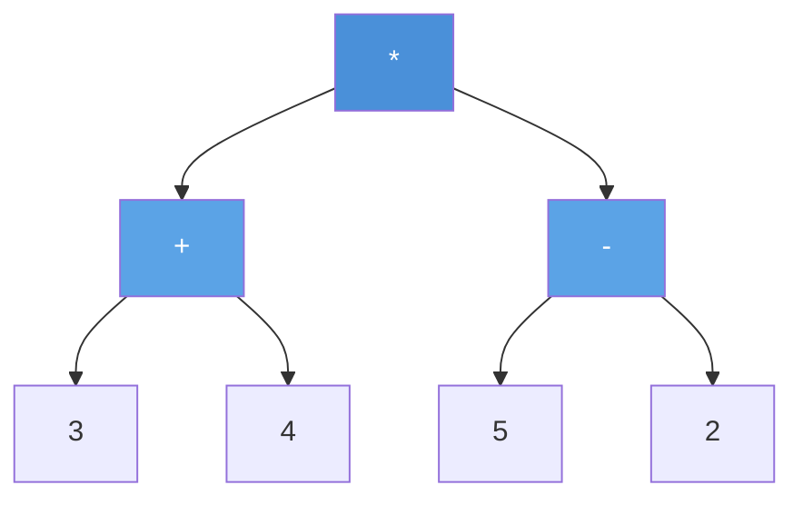

> 后序遍历: 3 4 + 5 2 - * → 后缀表达式 → 求值结果 21

**线索二叉树**（Threaded Binary Tree）：将空的 left/right 指针改为指向中序的前驱/后继的线索（thread）。遍历时无需递归或栈——从第一个节点出发，沿线索可以连续访问中序后继。内存开销为每个节点 2 bit（标记 left/right 是真指针还是线索）。线索二叉树将 $O(n)$ 空间的遍历栈需求压缩到常数空间。

#### 线索二叉树详解

**定义**：对于二叉树中的空指针：
- 若节点的 `left` 为空，令 `left` 指向其中序前驱（in-order predecessor）
- 若节点的 `right` 为空，令 `right` 指向其中序后继（in-order successor）
- 增加标志位 `ltag/rtag`：0 表示真子节点，1 表示线索

**线索化过程**：中序遍历一遍，在遍历过程中记录前一个访问的节点 `prev`。若当前节点 `left` 为空，则 `left = prev`（指向前驱）；若 `prev` 的 `right` 为空，则 `prev->right = curr`（指向后继）。

```c
typedef struct ThreadNode {
 int data;
 struct ThreadNode *left, *right;
 int ltag, rtag; // 0=子节点, 1=线索
} ThreadNode;

static ThreadNode* prev = NULL;

void inorder_thread(ThreadNode* node) {
 if (!node) return;
 inorder_thread(node->left); // 左

 // 处理当前节点的线索
 if (!node->left) {
 node->ltag = 1;
 node->left = prev; // 指向前驱
 }
 if (prev && !prev->right) {
 prev->rtag = 1;
 prev->right = node; // 前驱的右指针指向当前（后继）
 }
 prev = node;

 inorder_thread(node->right); // 右
}
```

#### 线索化手算轨迹

给定二叉树（中序序列为 D, B, A, E, C）：

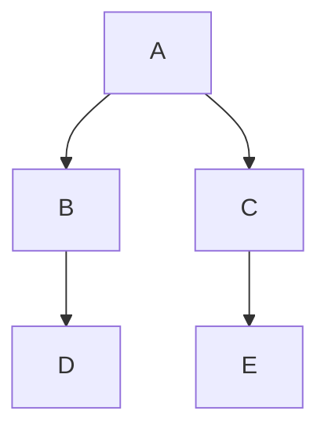

| 步 | 当前节点 | left | right | 动作 | 线索状态 |
|:--:|:--------:|:----:|:-----:|------|---------|
| 1 | D | NULL | NULL | D 的 left 指向 NULL（无前驱），D 的 right 指向 B（后继） | D→B |
| 2 | B | D | NULL | B 的 right 指向 A（后继） | D→B→A |
| 3 | A | B | C | A 的 left/right 都非空，无线索 | — |
| 4 | E | NULL | NULL | E 的 left 指向 A（前驱），E 的 right 指向 C（后继） | A→E→C |
| 5 | C | E | NULL | C 的 left = E（已处理），C 的 right 指向 NULL（无后继） | — |

最终线索化后，沿线索遍历：D → B → A → E → C（中序序列），无需栈。

**自测：线索二叉树**

二叉树中序序列为 `G, D, H, B, E, A, C, F`。① 画出线索二叉树（标注 ltag/rtag）。② 写出从节点 G 出发沿线索遍历的序列。

> 答案：
>
> ① 线索（ltag=1 表示线索，rtag=1 表示线索）：
> - G: left=NULL(ltag=1,无前驱), right=D(rtag=1,后继)
> - D: left=G(ltag=1,前驱), right=H(rtag=1,后继)
> - H: left=D(ltag=1,前驱), right=B(rtag=1,后继)
> - B: left=D(ltag=1,前驱), right=E(rtag=1,后继)
> - E: left=B(ltag=1,前驱), right=A(rtag=1,后继)
> - A: left=B(ltag=1,前驱), right=C(rtag=1,后继)
> - C: left=A(ltag=1,前驱), right=F(rtag=1,后继)
> - F: left=C(ltag=1,前驱), right=NULL(rtag=1,无后继)
>
> ② 从 G 出发沿线索遍历：G → D → H → B → E → A → C → F

**哈夫曼树**（Huffman Tree）：贪心构造的最优前缀编码二叉树。权值最小的两个节点不断合并为新节点，最终形成一棵最优的二叉树——高频字符靠近根，低频字符在深层。这是数据压缩的基础算法。

#### 哈夫曼编码手算

给定字符频率表：a=5, b=9, c=12, d=13, e=16, f=45。

**构建过程**（每次合并两个最小频率）：

| 步 | 合并 | 结果频率 | 剩余节点 |
|:-:|------|:---:|------|
| 1 | a(5) + b(9) | (14) | (14), c(12), d(13), e(16), f(45) |
| 2 | c(12) + d(13) | (25) | (14), e(16), (25), f(45) |
| 3 | (14) + e(16) | (30) | (25), (30), f(45) |
| 4 | (25) + (30) | (55) | f(45), (55) |
| 5 | f(45) + (55) | (100) | (100) ← 根 |

**编码**（左分支=0，右分支=1）：

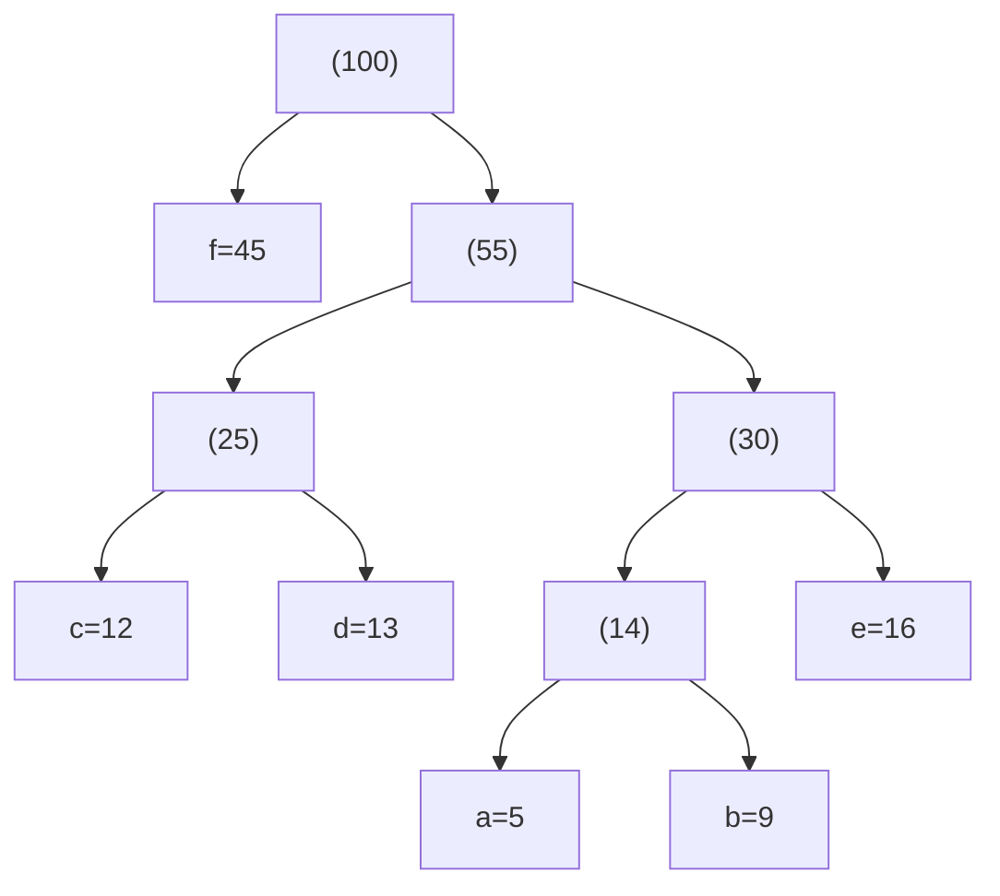

| 字符 | 编码 | 频率x位数 |
|------|------|:---------:|
| f | 0 | 45x1 = 45 |
| c | 100 | 12x3 = 36 |
| d | 101 | 13x3 = 39 |
| a | 1100 | 5x4 = 20 |
| b | 1101 | 9x4 = 36 |
| e | 111 | 16x3 = 48 |

总加权路径长度 $= 45+36+39+20+36+48 = 224$。若用等长编码（3 位/字符），总位数 $= (5+9+12+13+16+45) \times 3 = 300$。哈夫曼编码节省 $25\%$。

**自测：哈夫曼**

频率表：A=27, B=8, C=15, D=15, E=30, F=5。构建哈夫曼树并写出 F 和 B 的编码。

> 答案：
>
> 步骤：F(5)+B(8)→13；13+C(15)→28；D(15)+A(27)→42；28+E(30)→58；42+58→100
>
> ```mermaid
> graph TD
>     ROOT["(100)"] --> N42["(42)"]
>     ROOT --> N58["(58)"]
>     N42 --> D["D=15"]
>     N42 --> A["A=27"]
>     N58 --> N28["(28)"]
>     N58 --> E["E=30"]
>     N28 --> N13["(13)"]
>     N28 --> C["C=15"]
>     N13 --> F["F=5"]
>     N13 --> B["B=8"]
> ```
>
> F 的编码：**1000**（根→右→左→左→左）
> B 的编码：**1001**（根→右→左→左→右）


---

## 应用场景

- **文件系统 (目录树)**：Linux 的 dentry cache 使用树结构组织路径。每个目录是一个节点，子目录/文件是子节点
- **数据库索引**：BST → AVL → 红黑树 → B+树。自平衡 BST 是 B+树的元实现基础。详见 [[K_红黑树_RedBlackTree|红黑树]] 和 [[M_B树_BTree|B树]]
- **编译器 语法树 (AST)**：编译器将源代码解析为抽象语法树——每个产生式规则对应一个节点，终结符在叶子
- **域名系统 (DNS)**：域名本身就是一棵倒挂的树——根域 `.` → 顶级域 `.com` → 二级域 `example` → 主机名 `www`
- **计算机网络 路由表**：IP 路由的最长前缀匹配算法使用 Patricia Trie（压缩二叉 Trie）

---

## 练习

| 题号 | 题目 | 说明 |
|------|------|------|
| [94](https://leetcode.cn/problems/binary-tree-inorder-traversal/) | 二叉树的中序遍历 | 树遍历 |
| [98](https://leetcode.cn/problems/validate-binary-search-tree/) | 验证二叉搜索树 | BST 性质 |
| [108](https://leetcode.cn/problems/convert-sorted-array-to-binary-search-tree/) | 将有序数组转换为 BST | 构建平衡树 |
| [450](https://leetcode.cn/problems/delete-node-in-a-bst/) | 删除二叉搜索树中的节点 | BST 删除三种情况 |
| [105](https://leetcode.cn/problems/construct-binary-tree-from-preorder-and-inorder-traversal/) | 从前序与中序构造二叉树 | 前序+中序重建 |
| [222](https://leetcode.cn/problems/count-complete-tree-nodes/) | 完全二叉树的节点个数 | 树的性质 |

### 核心推演清单

练习题与上面的 LeetCode 互补——侧重手算推演，全部在正文中带完整答案：

| 自测 | 位置 | 内容 |
|------|------|------|
| 遍历序列 ×1 问 | 遍历手算轨迹节 | 四种遍历的序列输出 |
| 前序+中序重建 ×1 问 | 重建手算节 | 从序列画出二叉树 |
| BST 删除 ×1 问 | BST 删除手算节 | 三种情况的逐步操作 |
| AVL 建树 ×1 问 | AVL 建树手算节 | 逐步画树+标注旋转类型 |
| 哈夫曼编码 ×1 问 | 哈夫曼手算节 | 构建树+写出编码 |

## 动手实验

| 编号 | 题目 | 说明 |
|:----:|------|------|
| E1 | 四种遍历递归 vs 迭代 | 实现中序遍历的递归版和迭代版（用显式栈），对随机生成的 1000 节点 BST 分别执行并计时。对比递归的隐式栈和迭代的显式栈的性能差异 |
| E2 | BST 退化的渐进分析 | 随机顺序插入 1..10000 到 BST，每插入 1000 个测量一次树高，画出"树高 vs 插入量"曲线。再以递增顺序（1,2,3...）插入同样值——观察退化链的高 = n。解释差距的数学来源 |
| E3 | AVL 旋转计数 | 随机插入 1..10000 到 AVL，统计 LL/RR/LR/RL 四种旋转各自发生了多少次。验证 LR 和 RL 的发生频率是否显著低于 LL 和 RR |
