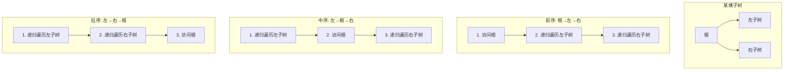
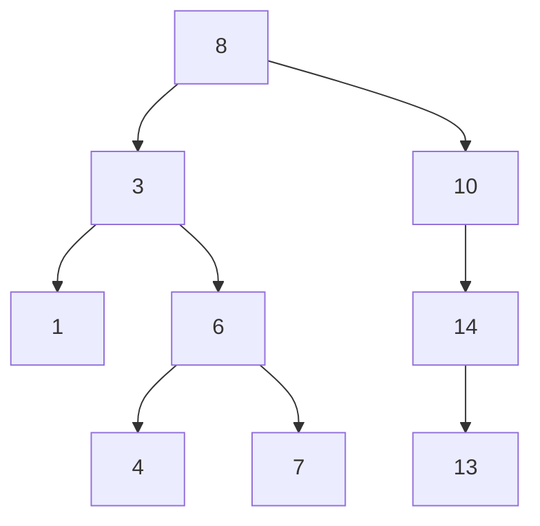

建议先阅读: [[D_容器_Container|容器概览]], [[F_栈_Stack|栈]]（递归与栈的关系），[[G_队列_Queue|队列]]（层序遍历依赖队列）

---

## 原理

树（Tree）是计算机科学中最丰富的非线性结构。它是递归定义的自然体现——一棵树的子树仍然是树。这种自相似性使得递归成为树操作的首选范式。

### 术语体系

![[../assets/images/二叉树.png]]
![[../assets/images/树形结构.png]]

```
 [Root 深度=0] ← 层 0
 / \
 [A 深度=1] [B 深度=1] ← 层 1
 / \ \
 [C d=2] [D d=2] [E d=2] ← 层 2
 / \
[F d=3] [G d=3] ← 层 3 (叶子)

节点 F 的高度 = 0 (叶子), 节点 A 的高度 = 2, 树的高度 = 3
节点 F 的深度 = 3 (从根起的边数)
```

| 术语 | 定义 | 例（以 F 为参考） |
|------|------|---------|
| 深度（Depth） | 从根到该节点的边数 | 3 |
| 高度（Height） | 该节点到最深叶子的边数 | 0（叶子） |
| 层（Level） | 深度 + 1 | 第 4 层 |
| 平衡因子（BF） | 左子树高度 - 右子树高度 | — |

### 二叉树的四种遍历

二叉树遍历是递归应用的经典场景。每种遍历将"处理当前节点"的动作放在递归调用的不同位置：



| 遍历方式 | 顺序 | 典型应用 |
|----------|------|---------|
| 前序（Pre-order） | 根 → 左 → 右 | 序列化/反序列化（`[根, 左子树序列, 右子树序列]` 唯一确定一棵树）、前缀表达式 |
| 中序（In-order） | 左 → 根 → 右 | BST 的中序遍历输出升序序列 |
| 后序（Post-order） | 左 → 右 → 根 | 释放树的内存（必须先释放子树再释放根）、后缀表达式、计算目录总大小 |
| 层序（Level-order） | 逐层、从左到右 | BFS 搜索、判断完全二叉树、二叉树的最大宽度 |

![[../assets/images/二叉树遍历.png]]

**前序+中序唯一确定二叉树**：给定前序和中序遍历序列，可以重建一棵二叉树。前序的第一个元素是根，在中序中找出根的位置后，左边是左子树的中序序列，右边是右子树的中序序列。递归即可构建。这是分治思想的典型应用——每个子问题是一个子树的构建。

### 二叉搜索树（BST）

BST 通过有序性约束将查找从 $O(n)$ 加速到 $O(\log n)$（平衡情况下）：

```
性质：对于任意节点 X，
 左子树中的所有节点值 < X 的值 < 右子树中的所有节点值
```



中序遍历这棵 BST：1 → 3 → 4 → 6 → 7 → 8 → 10 → 13 → 14。即升序输出。

**BST 的三个操作**：

| 操作 | 平均 | 最坏 | 核心步骤 |
|------|:---:|:---:|------|
| 查找（search） | $O(\log n)$ | $O(n)$ | 与根比较：小则走左，大则走右 |
| 插入（insert） | $O(\log n)$ | $O(n)$ | 查找到失败位置，在 leaf 的空位上插入 |
| 删除（delete） | $O(\log n)$ | $O(n)$ | 三种情况：叶子（直删）、单子（用子代替）、双子（用后继代替） |

**BST 删除的三个情况**：


中序后继是 BST 中 key 排序下"正好比当前节点大的下一个节点"。选择它替代被删节点，可以保证 BST 性质完全保持不变——所有左子树的值 < 后继的值 < 所有右子树的值。

**BST 退化的致命性**：

按递增顺序插入 $n$ 个元素到空 BST：
- 第一个元素成为根
- 每个后续元素都比之前的所有元素大
- 因此每个新元素都是在"最右叶子"上追加

结果是一棵深度为 $n$ 的单链——退化为链表。此时查找从 $O(\log n)$ 变为 $O(n)$。这正是自平衡二叉搜索树存在的根本原因。

![[../assets/images/二叉树退化为链表示意图.png]]

### AVL 树——通过旋转维持平衡

AVL 树是最早的自平衡 BST（Adelson-Velsky & Landis, 1962）。核心约束：任意节点的左右子树高度差 $\in \{-1, 0, 1\}$。

**平衡因子（BF）**：

$$
\text{BF}(node) = \text{height}(\text{left}) - \text{height}(\text{right})
$$

$$
\text{BF}(node) \in \{-1, 0, 1\}
$$

当插入或删除导致某个节点的 $|\text{BF}| \geq 2$ 时，需要通过旋转恢复平衡。

**四种旋转场景**：

```mermaid
graph TD
 subgraph "LL — 右旋"
 LL_BEFORE["节点 X (BF=2)<br/> /<br/> Y (BF=1)<br/> /<br/>Z<br/>失衡: 左子树的左子树太重"]
 LL_BEFORE -->|"右旋(X)"| LL_AFTER["Y<br/>/<br/>Z X<br/>平衡恢复"]
 end
 subgraph "RR — 左旋"
 RR_BEFORE["节点 X (BF=-2)<br/> \\<br/> Y (BF=-1)<br/> \\<br/> Z<br/>失衡: 右子树的右子树太重"]
 RR_BEFORE -->|"左旋(X)"| RR_AFTER["Y<br/>/<br/>X Z<br/>平衡恢复"]
 end
 subgraph "LR — 先左旋后右旋"
 LR_BEFORE["节点 X (BF=2)<br/> /<br/> Y (BF=-1)<br/> \\<br/> Z<br/>失衡: 左子树的右子树太重"]
 LR_BEFORE -->|"左旋(Y) → LL"| LR_MID["X (BF=2)<br/> /<br/> Z<br/> /<br/>Y<br/>变成 LL 情形"]
 LR_MID -->|"右旋(X)"| LR_AFTER["Z<br/>/<br/>Y X<br/>平衡恢复"]
 end
 subgraph "RL — 先右旋后左旋"
 RL_BEFORE["节点 X (BF=-2)<br/> \\<br/> Y (BF=1)<br/> /<br/> Z<br/>失衡: 右子树的左子树太重"]
 RL_BEFORE -->|"右旋(Y) → RR"| RL_MID["X (BF=-2)<br/> \\<br/> Z<br/> \\<br/> Y<br/>变成 RR 情形"]
 RL_MID -->|"左旋(X)"| RL_AFTER["Z<br/>/<br/>X Y<br/>平衡恢复"]
 end
```



**旋转的原理**——以 LL 右旋为例：将失衡节点的左子节点"提上来"成为新的子树根，原根成为新根的右子节点。旋转保持了 BST 性质（中序遍历不变），同时将左子树的高度降低了 1，右子树的高度增加了 1——左右高度从不平衡的 2 恢复到 0 或 1。

**AVL 高度上界的推导**：

设 $N_h$ 为高度为 $h$ 的 AVL 树中的最小节点数。最"瘦"的 AVL 树是斐波那契树——左右子树高度差恰好为 1：

$$
N_h = N_{h-1} + N_{h-2} + 1
$$

这与斐波那契数列 $F_h$ 有相同的递推关系，因此 $N_h \approx \phi^h / \sqrt{5}$，其中 $\phi = (\sqrt{5}+1)/2 \approx 1.618$（黄金比）。由此反推：

$$
h \leq \log_{\phi}(n+2) - 1 \approx 1.44 \cdot \log_2 n
$$

即 AVL 树的高度不超过 $1.44 \log_2 n$，保证查找、插入、删除均为 $O(\log n)$。AVL 是最严格的平衡二叉搜索树——代价是插入/删除时可能需要 $O(\log n)$ 次旋转（向根方向传播）。

### 树的其他重要变体

**表达式树**（Expression Tree）：编译器将数学表达式解析为二叉树——操作数在叶子，运算符在内部节点。后序遍历即得到后缀表达式（RPN），可以直接求值。

```
表达式: (3 + 4) * (5 - 2)
表达式树: [*]
 / \
 [+] [-]
 / \ / \
 3 4 5 2

后序遍历: 3 4 + 5 2 - * → 后缀表达式 → 求值结果 21
```

**线索二叉树**（Threaded Binary Tree）：将空的 left/right 指针改为指向中序的前驱/后继的线索（thread）。遍历时无需递归或栈——从第一个节点出发，沿线索可以连续访问中序后继。内存开销为每个节点 2 bit（标记 left/right 是真指针还是线索）。线索二叉树将 $O(n)$ 空间的遍历栈需求压缩到常数空间。

**哈夫曼树**（Huffman Tree）：贪心构造的最优前缀编码二叉树。权值最小的两个节点不断合并为新节点，最终形成一棵最优的二叉树——高频字符靠近根，低频字符在深层。这是数据压缩的基础算法。

---

## 实现

### BST

```c
#include <stdlib.h>

typedef struct BSTNode {
 int data;
 struct BSTNode* left;
 struct BSTNode* right;
} BSTNode;

BSTNode* bst_insert(BSTNode* root, int value) {
 if (!root) {
 BSTNode* node = malloc(sizeof(BSTNode));
 node->data = value;
 node->left = node->right = NULL;
 return node;
 }
 if (value < root->data)
 root->left = bst_insert(root->left, value);
 else if (value > root->data)
 root->right = bst_insert(root->right, value);
 return root;
}

BSTNode* bst_search(BSTNode* root, int value) {
 if (!root || root->data == value) return root;
 if (value < root->data) return bst_search(root->left, value);
 return bst_search(root->right, value);
}

// 删除节点: 返回新的子树根
BSTNode* bst_delete(BSTNode* root, int value) {
 if (!root) return NULL;
 if (value < root->data)
 root->left = bst_delete(root->left, value);
 else if (value > root->data)
 root->right = bst_delete(root->right, value);
 else {
 // 情况1/2: 叶子或单子节点
 if (!root->left) { BSTNode* tmp = root->right; free(root); return tmp; }
 if (!root->right) { BSTNode* tmp = root->left; free(root); return tmp; }
 // 情况3: 双子节点 — 找中序后继
 BSTNode* succ = root->right;
 while (succ->left) succ = succ->left;
 root->data = succ->data; // 替换值
 root->right = bst_delete(root->right, succ->data); // 删除后继
 }
 return root;
}

void bst_destroy(BSTNode* root) {
 if (!root) return;
 bst_destroy(root->left);
 bst_destroy(root->right);
 free(root);
}

// 树的三种递归遍历
void preorder(BSTNode* root) {
 if (!root) return;
 printf("%d ", root->data);
 preorder(root->left);
 preorder(root->right);
}

void inorder(BSTNode* root) {
 if (!root) return;
 inorder(root->left);
 printf("%d ", root->data);
 inorder(root->right);
}

void postorder(BSTNode* root) {
 if (!root) return;
 postorder(root->left);
 postorder(root->right);
 printf("%d ", root->data);
}
```

### AVL 树

```c
typedef struct AVLNode {
 int data;
 int height; // 该节点子树的高度 (叶子=0)
 struct AVLNode* left;
 struct AVLNode* right;
} AVLNode;

static int height(AVLNode* n) { return n ? n->height : -1; }
static int max(int a, int b) { return a > b ? a : b; }
static int bf(AVLNode* n) { return height(n->left) - height(n->right); }

// 右旋
static AVLNode* rotate_right(AVLNode* y) {
 AVLNode* x = y->left;
 AVLNode* T2 = x->right;
 x->right = y;
 y->left = T2;
 y->height = max(height(y->left), height(y->right)) + 1;
 x->height = max(height(x->left), height(x->right)) + 1;
 return x; // 新根
}

// 左旋
static AVLNode* rotate_left(AVLNode* x) {
 AVLNode* y = x->right;
 AVLNode* T2 = y->left;
 y->left = x;
 x->right = T2;
 x->height = max(height(x->left), height(x->right)) + 1;
 y->height = max(height(y->left), height(y->right)) + 1;
 return y;
}

AVLNode* avl_insert(AVLNode* root, int value) {
 if (!root) {
 AVLNode* node = malloc(sizeof(AVLNode));
 node->data = value; node->height = 0;
 node->left = node->right = NULL;
 return node;
 }
 if (value < root->data)
 root->left = avl_insert(root->left, value);
 else if (value > root->data)
 root->right = avl_insert(root->right, value);
 else
 return root; // 重复值不插入

 root->height = max(height(root->left), height(root->right)) + 1;
 int balance = bf(root);

 // LL: 左子树的左子树过重
 if (balance > 1 && value < root->left->data)
 return rotate_right(root);
 // RR: 右子树的右子树过重
 if (balance < -1 && value > root->right->data)
 return rotate_left(root);
 // LR: 左子树的右子树过重
 if (balance > 1 && value > root->left->data) {
 root->left = rotate_left(root->left);
 return rotate_right(root);
 }
 // RL: 右子树的左子树过重
 if (balance < -1 && value < root->right->data) {
 root->right = rotate_right(root->right);
 return rotate_left(root);
 }
 return root;
}
```

---

## 应用场景

- **文件系统 (目录树)**：Linux 的 dentry cache 使用树结构组织路径。每个目录是一个节点，子目录/文件是子节点
- **数据库索引**：BST → AVL → 红黑树 → B+树。自平衡 BST 是 B+树的元实现基础。详见 [[K_红黑树_RedBlackTree|红黑树]] 和 [[M_B树_BTree|B树]]
- **编译器 语法树 (AST)**：编译器将源代码解析为抽象语法树——每个产生式规则对应一个节点，终结符在叶子
- **域名系统 (DNS)**：域名本身就是一棵倒挂的树——根域 `.` → 顶级域 `.com` → 二级域 `example` → 主机名 `www`
- **计算机网络 路由表**：IP 路由的最长前缀匹配算法使用 Patricia Trie（压缩二叉 Trie）

---

## 练习

| 题号 | 题目 | 说明 |
|------|------|------|
| [94](https://leetcode.cn/problems/binary-tree-inorder-traversal/) | 二叉树的中序遍历 | 树遍历 |
| [98](https://leetcode.cn/problems/validate-binary-search-tree/) | 验证二叉搜索树 | BST 性质 |
| [108](https://leetcode.cn/problems/convert-sorted-array-to-binary-search-tree/) | 将有序数组转换为 BST | 构建平衡树 |
| [450](https://leetcode.cn/problems/delete-node-in-a-bst/) | 删除二叉搜索树中的节点 | BST 删除三种情况 |

## 动手实验

| 编号 | 题目 | 说明 |
|:----:|------|------|
| E1 | 四种遍历递归 vs 迭代 | 实现中序遍历的递归版和迭代版（用显式栈），对随机生成的 1000 节点 BST 分别执行并计时。对比递归的隐式栈和迭代的显式栈的性能差异 |
| E2 | BST 退化的渐进分析 | 随机顺序插入 1..10000 到 BST，每插入 1000 个测量一次树高，画出"树高 vs 插入量"曲线。再以递增顺序（1,2,3...）插入同样值——观察退化链的高 = n。解释差距的数学来源 |
| E3 | AVL 旋转计数 | 随机插入 1..10000 到 AVL，统计 LL/RR/LR/RL 四种旋转各自发生了多少次。验证 LR 和 RL 的发生频率是否显著低于 LL 和 RR |
