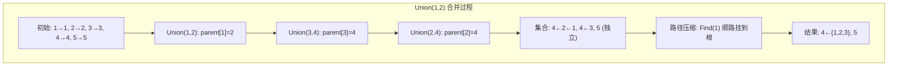

## ==========================================================================
数据结构教程 — 并查集 (Union-Find)
## ==========================================================================

## 📋 章节概述

并查集（Union-Find），也称不相交集合（Disjoint Set），是一种用于处理元素分组和
连通性问题的数据结构。它支持两种核心操作：合并（Union）两个集合和查找（Find）
某个元素所属的集合。

并查集在网络连通性判断、最小生成树（Kruskal算法）、社交网络分组、图像分割等
场景中有广泛应用。本章将从并查集的基本概念讲起，深入路径压缩和按秩合并的优化原理，
全面覆盖各种变体和操作，最后通过实例和习题巩固所学知识。

> 📌 **底层实现参考**：如果需要深入理解本章数据结构的底层实现（纯C手写、内存布局、指针操作），请参阅 [[../../C语言深化教程/3数据结构/09_高级数据结构|C语言教程: 高级数据结构]]。C教程侧重手动实现与内存本质，本教程侧重STL使用与算法优化，两者互补。

## ==========================================================================
### 📖 第一节: 基础语法 + 计算机底层原理
## ==========================================================================

1.1 并查集的基本概念
-----------------------

并查集维护若干个不相交的集合，每个集合用一棵树表示，树的根节点作为集合的代表元素。

核心操作：
- Find(x)：找到元素x所在集合的代表（根节点）
- Union(x, y)：将x和y所在的两个集合合并为一个集合



| 操作 | 无优化 | 路径压缩 | 按秩合并 | 两者都用 |
|------|--------|----------|----------|---------|
| Find | O(n) | 均摊 O(log n) | O(log n) | 均摊 O(alpha(n)) |
| Union | O(n) | 均摊 O(log n) | O(log n) | 均摊 O(alpha(n)) |

> alpha(n) 是反阿克曼函数，对任何实际输入值都 ≤ 5，可视为常数 O(1)。

时间复杂度（使用路径压缩+按秩合并）：
- Find: 均摊O(α(n))，α为反阿克曼函数，实际可视为O(1)
- Union: 均摊O(α(n))

1.2 基本实现（无优化）

```pseudocode
CLASS NaiveUnionFind {
PRIVATE:
    vector<int> parent;

PUBLIC:
    NaiveUnionFind(int n) : parent(n) {
        for (int i = 0; i < n; ++i)
            parent[i] = i;
    }

    FUNCTION find(int x) {
        while (parent[x] != x)
            x = parent[x];
        return x;
    }

    FUNCTION unite(int x, int y) {
        int rootX = find(x);
        int rootY = find(y);
        if (rootX != rootY)
            parent[rootX] = rootY;
    }

    FUNCTION connected(int x, int y) {
        return find(x) == find(y);
    }
};

```

---
**实现练习**: 用 C 或 C++ 自行实现上述结构。完成后与 AI 对话检查正确性。
---

1.3 路径压缩优化

路径压缩的核心思想：在Find操作时，将路径上所有节点直接连接到根节点，使得后续查找更快。

```pseudocode
FUNCTION find(int x) {
    if (parent[x] != x)
        parent[x] = find(parent[x]);
    return parent[x];
}

```

---
**实现练习**: 用 C 或 C++ 自行实现上述结构。完成后与 AI 对话检查正确性。
---

1.4 按秩合并优化

按秩合并的思想：将较矮的树连接到较高的树下面，避免树退化为链表。

```pseudocode
CLASS UnionFind {
PRIVATE:
    vector<int> parent;
    vector<int> rank;
    int count;

PUBLIC:
    UnionFind(int n) : parent(n), rank(n, 0), count(n) {
        IOTA(parent.begin(), parent.end(), 0);
    }

    FUNCTION find(int x) {
        if (parent[x] != x)
            parent[x] = find(parent[x]);
        return parent[x];
    }

    FUNCTION unite(int x, int y) {
        int rootX = find(x);
        int rootY = find(y);
        if (rootX == rootY) return FALSE;

        if (rank[rootX] < rank[rootY])
            parent[rootX] = rootY;
        else if (rank[rootX] > rank[rootY])
            parent[rootY] = rootX;
        else {
            parent[rootY] = rootX;
            rank[rootX]++;
        }
        count--;
        return TRUE;
    }

    FUNCTION connected(int x, int y) {
        return find(x) == find(y);
    }

    FUNCTION getCount() { return count; }
};

FUNCTION main() {
    UnionFind uf(10);

    uf.unite(0, 1);
    uf.unite(2, 3);
    uf.unite(1, 3);
    uf.unite(5, 6);

    PRINT boolalpha;
    PRINT "0和3连通: " + uf.connected(0, 3) + NEWLINE;
    PRINT "0和5连通: " + uf.connected(0, 5) + NEWLINE;
    PRINT "连通分量数: " + uf.getCount() + NEWLINE;

    return 0;
}

```

---
**实现练习**: 用 C 或 C++ 自行实现上述结构。完成后与 AI 对话检查正确性。
---

1.5 按大小合并（另一种优化策略）

```pseudocode
CLASS UnionFindBySize {
PRIVATE:
    vector<int> parent;
    vector<int> size;
    int count;

PUBLIC:
    UnionFindBySize(int n) : parent(n), size(n, 1), count(n) {
        IOTA(parent.begin(), parent.end(), 0);
    }

    FUNCTION find(int x) {
        if (parent[x] != x)
            parent[x] = find(parent[x]);
        return parent[x];
    }

    FUNCTION unite(int x, int y) {
        int rootX = find(x);
        int rootY = find(y);
        if (rootX == rootY) return FALSE;

        if (size[rootX] < size[rootY]) SWAP(rootX, rootY);
        parent[rootY] = rootX;
        size[rootX] += size[rootY];
        count--;
        return TRUE;
    }

    FUNCTION connected(int x, int y) { return find(x) == find(y); }
    FUNCTION getSize(int x) { return size[find(x)]; }
    FUNCTION getCount() { return count; }
};

```

---
**实现练习**: 用 C 或 C++ 自行实现上述结构。完成后与 AI 对话检查正确性。
---

## ==========================================================================
### 📖 第二节: 实现思路
## ==========================================================================

2.1 带权并查集

```pseudocode
CLASS WeightedUnionFind {
PRIVATE:
    vector<int> parent;
    vector<int> rank;
    vector<long long> weight;

PUBLIC:
    WeightedUnionFind(int n) : parent(n), rank(n, 0), weight(n, 0) {
        IOTA(parent.begin(), parent.end(), 0);
    }

    pair<int, long long> find(int x) {
        if (parent[x] == x) return {x, 0};
        [root, w] = find(parent[x]);
        parent[x] = root;
        weight[x] += w;
        return {root, weight[x]};
    }

    FUNCTION unite(int x, int y, long long w) {
        [rootX, wx] = find(x);
        [rootY, wy] = find(y);
        if (rootX == rootY) return (wx - wy) == w;

        if (rank[rootX] < rank[rootY]) {
            parent[rootX] = rootY;
            weight[rootX] = wy - wx + w;
        } else if (rank[rootX] > rank[rootY]) {
            parent[rootY] = rootX;
            weight[rootY] = wx - wy - w;
        } else {
            parent[rootY] = rootX;
            weight[rootY] = wx - wy - w;
            rank[rootX]++;
        }
        return TRUE;
    }

    long long query(int x, int y) {
        [rootX, wx] = find(x);
        [rootY, wy] = find(y);
        if (rootX != rootY) return LLONG_MAX;
        return wx - wy;
    }
};

FUNCTION main() {
    WeightedUnionFind wuf(5);
    wuf.unite(0, 1, 3);
    wuf.unite(1, 2, 5);
    wuf.unite(3, 4, 2);

    PRINT "0到2的距离: " + wuf.query(0, 2) + NEWLINE;
    PRINT "0到4的距离: " + (wuf.query(0, 4) == LLONG_MAX ? -1 : wuf.query(0, 4)) + NEWLINE;

    return 0;
}

```

---
**实现练习**: 用 C 或 C++ 自行实现上述结构。完成后与 AI 对话检查正确性。
---

2.2 可撤销并查集（不使用路径压缩）

```pseudocode
CLASS RollbackUnionFind {
PRIVATE:
    vector<int> parent;
    vector<int> rank;
    stack<tuple<int, int, int, int>> history;
    int count;

PUBLIC:
    RollbackUnionFind(int n) : parent(n), rank(n, 0), count(n) {
        IOTA(parent.begin(), parent.end(), 0);
    }

    FUNCTION find(int x) {
        while (parent[x] != x)
            x = parent[x];
        return x;
    }

    FUNCTION unite(int x, int y) {
        int rootX = find(x);
        int rootY = find(y);
        if (rootX == rootY) {
            history.push({-1, -1, -1, count});
            return FALSE;
        }
        if (rank[rootX] < rank[rootY]) SWAP(rootX, rootY);
        history.push({rootY, parent[rootY], rank[rootX], count});
        parent[rootY] = rootX;
        if (rank[rootX] == rank[rootY]) rank[rootX]++;
        count--;
        return TRUE;
    }

    FUNCTION rollback() {
        if (history.empty()) return;
        [node, oldParent, oldRank, oldCount] = history.top();
        history.pop();
        if (node == -1) return;
        parent[node] = oldParent;
        rank[find(node)] = oldRank;
        count = oldCount;
    }

    FUNCTION connected(int x, int y) { return find(x) == find(y); }
    FUNCTION getCount() { return count; }
};

```

---
**实现练习**: 用 C 或 C++ 自行实现上述结构。完成后与 AI 对话检查正确性。
---

2.3 并查集求连通分量

```pseudocode
CLASS ConnectedComponents {
PRIVATE:
    vector<int> parent;
    vector<int> rank;

PUBLIC:
    ConnectedComponents(int n) : parent(n), rank(n, 0) {
        IOTA(parent.begin(), parent.end(), 0);
    }

    FUNCTION find(int x) {
        if (parent[x] != x)
            parent[x] = find(parent[x]);
        return parent[x];
    }

    FUNCTION unite(int x, int y) {
        int rootX = find(x);
        int rootY = find(y);
        if (rootX == rootY) return;
        if (rank[rootX] < rank[rootY]) SWAP(rootX, rootY);
        parent[rootY] = rootX;
        if (rank[rootX] == rank[rootY]) rank[rootX]++;
    }

    vector<vector<int>> getComponents(int n) {
        unordered_map<int, vector<int>> groups;
        for (int i = 0; i < n; ++i)
            groups[find(i)].push_back(i);

        vector<vector<int>> result;
        for ( [root, members] : groups)
            result.push_back(MOVE(members));
        return result;
    }
};

FUNCTION main() {
    int n = 7;
    ConnectedComponents cc(n);
    cc.unite(0, 1);
    cc.unite(1, 2);
    cc.unite(3, 4);
    cc.unite(5, 6);

    components = cc.getComponents(n);
    PRINT "连通分量数: " + components.size() + NEWLINE;
    for (int i = 0; i < components.size(); ++i) {
        PRINT "分量" + i + ": ";
        for (int v : components[i])
            PRINT v + " ";
        PRINT endl;
    }
    return 0;
}

```

---
**实现练习**: 用 C 或 C++ 自行实现上述结构。完成后与 AI 对话检查正确性。
---

2.4 并查集判环

```pseudocode
CLASS CycleDetector {
PRIVATE:
    vector<int> parent;
    vector<int> rank;

PUBLIC:
    CycleDetector(int n) : parent(n), rank(n, 0) {
        IOTA(parent.begin(), parent.end(), 0);
    }

    FUNCTION find(int x) {
        if (parent[x] != x)
            parent[x] = find(parent[x]);
        return parent[x];
    }

    FUNCTION addEdge(int u, int v) {
        int rootU = find(u);
        int rootV = find(v);
        if (rootU == rootV) return TRUE;
        if (rank[rootU] < rank[rootV]) SWAP(rootU, rootV);
        parent[rootV] = rootU;
        if (rank[rootU] == rank[rootV]) rank[rootU]++;
        return FALSE;
    }
};

FUNCTION main() {
    CycleDetector cd(5);
    vector<pair<int,int>> edges = {{0,1},{1,2},{2,3},{3,0},{3,4}};

    for ([u, v] : edges) {
        if (cd.addEdge(u, v)) {
            PRINT "边(" + u + "," + v + ")形成了环!" + NEWLINE;
        }
    }
    return 0;
}

```

---
**实现练习**: 用 C 或 C++ 自行实现上述结构。完成后与 AI 对话检查正确性。
---

## ==========================================================================
### 📖 第三节: 应用场景
## ==========================================================================

3.1 案例一：Kruskal最小生成树

```pseudocode
CLASS KruskalMST {
PRIVATE:
    STRUCT Edge {
        int u, v, weight;
        bool operator<(Edge other) { return weight < other.weight; }
    };

    vector<int> parent, rank_;

    FUNCTION find(int x) {
        if (parent[x] != x)
            parent[x] = find(parent[x]);
        return parent[x];
    }

    FUNCTION unite(int x, int y) {
        int rootX = find(x), rootY = find(y);
        if (rootX == rootY) return FALSE;
        if (rank_[rootX] < rank_[rootY]) SWAP(rootX, rootY);
        parent[rootY] = rootX;
        if (rank_[rootX] == rank_[rootY]) rank_[rootX]++;
        return TRUE;
    }

PUBLIC:
    pair<int, vector<Edge>> solve(int n, vector<Edge> edges) {
        parent.resize(n);
        rank_.assign(n, 0);
        IOTA(parent.begin(), parent.end(), 0);

        SORT(edges.begin(), edges.end());

        int totalWeight = 0;
        vector<Edge> mst;

        for ( edge : edges) {
            if (unite(edge.u, edge.v)) {
                totalWeight += edge.weight;
                mst.push_back(edge);
                if (mst.size() == n - 1) break;
            }
        }
        return {totalWeight, mst};
    }
};

FUNCTION main() {
    KruskalMST kruskal;
    vector<KruskalMST::Edge> edges;

    int n = 6;
    edges.push_back({0, 1, 4});
    edges.push_back({0, 2, 3});
    edges.push_back({1, 2, 1});
    edges.push_back({1, 3, 2});
    edges.push_back({2, 3, 4});
    edges.push_back({3, 4, 2});
    edges.push_back({4, 5, 6});

    // 需要将Edge定义移到外部或使用公有结构
    // 此处简化演示
    [weight, mst] = kruskal.solve(n, edges);
    PRINT "最小生成树总权重: " + weight + NEWLINE;
    PRINT "选择的边: " + NEWLINE;
    for ( e : mst)
        PRINT "  " + e.u + " - " + e.v + " (权重" + e.weight + ")" + NEWLINE;

    return 0;
}

```

---
**实现练习**: 用 C 或 C++ 自行实现上述结构。完成后与 AI 对话检查正确性。
---

3.2 案例二：社交网络朋友圈

```pseudocode
CLASS FriendCircle {
PRIVATE:
    vector<int> parent;
    vector<int> size;
    int groupCount;

    FUNCTION find(int x) {
        if (parent[x] != x)
            parent[x] = find(parent[x]);
        return parent[x];
    }

PUBLIC:
    FriendCircle(int n) : parent(n), size(n, 1), groupCount(n) {
        IOTA(parent.begin(), parent.end(), 0);
    }

    FUNCTION makeFriend(int a, int b) {
        int ra = find(a), rb = find(b);
        if (ra == rb) return;
        if (size[ra] < size[rb]) SWAP(ra, rb);
        parent[rb] = ra;
        size[ra] += size[rb];
        groupCount--;
    }

    FUNCTION areFriends(int a, int b) { return find(a) == find(b); }
    FUNCTION getCircleSize(int a) { return size[find(a)]; }
    FUNCTION getGroupCount() { return groupCount; }
};

FUNCTION main() {
    vector<string> names = {"Alice", "Bob", "Charlie", "David", "Eve", "Frank"};
    FriendCircle fc(names.size());

    fc.makeFriend(0, 1);  // Alice - Bob
    fc.makeFriend(2, 3);  // Charlie - David
    fc.makeFriend(1, 2);  // Bob - Charlie (合并两个圈子)
    fc.makeFriend(4, 5);  // Eve - Frank

    PRINT "朋友圈数量: " + fc.getGroupCount() + NEWLINE;
    PRINT "Alice的圈子大小: " + fc.getCircleSize(0) + NEWLINE;
    PRINT "Alice和David是朋友: " + boolalpha + fc.areFriends(0, 3) + NEWLINE;
    PRINT "Alice和Eve是朋友: " + fc.areFriends(0, 4) + NEWLINE;

    return 0;
}

```

---
**实现练习**: 用 C 或 C++ 自行实现上述结构。完成后与 AI 对话检查正确性。
---

3.3 案例三：动态连通性（在线判断）

```pseudocode
CLASS DynamicConnectivity {
PRIVATE:
    vector<int> parent;
    vector<int> size;
    int components;

PUBLIC:
    DynamicConnectivity(int n) : parent(n), size(n, 1), components(n) {
        IOTA(parent.begin(), parent.end(), 0);
    }

    FUNCTION find(int x) {
        if (parent[x] != x)
            parent[x] = find(parent[x]);
        return parent[x];
    }

    FUNCTION connect(int x, int y) {
        int rx = find(x), ry = find(y);
        if (rx == ry) return;
        if (size[rx] < size[ry]) SWAP(rx, ry);
        parent[ry] = rx;
        size[rx] += size[ry];
        components--;
    }

    FUNCTION isConnected(int x, int y) { return find(x) == find(y); }
    FUNCTION componentCount() { return components; }
    FUNCTION componentSize(int x) { return size[find(x)]; }
    FUNCTION isFullyConnected() { return components == 1; }
};

FUNCTION main() {
    int n = 8;
    DynamicConnectivity dc(n);

    vector<pair<int,int>> connections = {
        {0, 1}, {2, 3}, {4, 5}, {6, 7},
        {0, 2}, {4, 6}, {0, 4}
    };

    for ([u, v] : connections) {
        dc.connect(u, v);
        PRINT "连接 " + u + "-" + v
                  << " | 分量数: " << dc.componentCount()
                  << " | 全连通: " << boolalpha << dc.isFullyConnected()
                  + NEWLINE;
    }

    return 0;
}

```

---
**实现练习**: 用 C 或 C++ 自行实现上述结构。完成后与 AI 对话检查正确性。
---

## ==========================================================================
### 📖 第四节: 课后习题
## ==========================================================================

1. 基础题：实现支持路径压缩和按秩合并的并查集，处理n个元素m次合并/查询操作。

2. 应用题：给定一个无向图，使用并查集判断图中是否存在环。

3. 进阶题：实现带权并查集，支持维护元素之间的相对关系（如食物链问题）。

4. 洛谷练习：[P3367 并查集](https://www.luogu.com.cn/problem/P3367)

## ==========================================================================


## --------------------------------------------------------------------------
## 🔗 知识网络
## --------------------------------------------------------------------------

- **上一章**: [[H_图_Graph]] | **下一章**: [[P_图的高级算法_AdvancedGraph]] | **返回**: [[DSA学习路线]]
- **算法技巧**: [[../算法/算法技巧/连通性]]

## ==========================================================================
## 章节测试
## ==========================================================================

### 判断题

> [!question] 判断题 1
> 并查集的Find操作在使用路径压缩后，单次操作的最坏时间复杂度为O(1)。（ ）
> - [ ] ✅ 正确
> - [ ] ❌ 错误
>
> > [!success]- 点击查看答案
> > 答案: 错误
> > 
> > **解析**: 路径压缩后单次Find操作最坏仍可能是O(log n)，但均摊时间复杂度为O(α(n))，接近O(1)。

> [!question] 判断题 2
> 按秩合并可以保证并查集的树高不超过O(log n)。（ ）
> - [ ] ✅ 正确
> - [ ] ❌ 错误
>
> > [!success]- 点击查看答案
> > 答案: 正确
> > 
> > **解析**: 按秩合并确保较矮的树接到较高的树下面，可以证明树高不超过O(log n)。

> [!question] 判断题 3
> 并查集只能处理无向图的连通性问题。（ ）
> - [ ] ✅ 正确
> - [ ] ❌ 错误
>
> > [!success]- 点击查看答案
> > 答案: 正确
> > 
> > **解析**: 标准并查集的合并操作是对称的，只能处理无向图。有向图的强连通分量需要使用Tarjan等算法。

> [!question] 判断题 4
> 路径压缩会改变树的结构，因此不能与按秩合并同时使用。（ ）
> - [ ] ✅ 正确
> - [ ] ❌ 错误
>
> > [!success]- 点击查看答案
> > 答案: 错误
> > 
> > **解析**: 路径压缩和按秩合并可以同时使用，虽然路径压缩会使rank不再精确表示树高，但rank仍可作为合并时的启发式指标。

> [!question] 判断题 5
> 并查集支持高效的集合拆分（将一个集合分成两个）操作。（ ）
> - [ ] ✅ 正确
> - [ ] ❌ 错误
>
> > [!success]- 点击查看答案
> > 答案: 错误
> > 
> > **解析**: 标准并查集只支持合并操作，不支持拆分。如需拆分功能，需要使用可撤销并查集或其他数据结构。

> [!question] 判断题 6
> 在Kruskal算法中，并查集用于判断添加一条边是否会形成环。（ ）
> - [ ] ✅ 正确
> - [ ] ❌ 错误
>
> > [!success]- 点击查看答案
> > 答案: 正确
> > 
> > **解析**: 如果边的两个端点已经在同一集合中（connected），则添加该边会形成环，应跳过。

> [!question] 判断题 7
> 带权并查集可以维护任意两个元素之间的距离关系。（ ）
> - [ ] ✅ 正确
> - [ ] ❌ 错误
>
> > [!success]- 点击查看答案
> > 答案: 错误
> > 
> > **解析**: 带权并查集只能维护同一连通分量内元素之间的相对关系，不同连通分量的元素之间无法确定关系。

> [!question] 判断题 8
> 并查集的空间复杂度为O(n)，其中n为元素个数。（ ）
> - [ ] ✅ 正确
> - [ ] ❌ 错误
>
> > [!success]- 点击查看答案
> > 答案: 正确
> > 
> > **解析**: 并查集只需要parent数组和rank/size数组，空间为O(n)。

> [!question] 判断题 9
> 可撤销并查集不能使用路径压缩优化。（ ）
> - [ ] ✅ 正确
> - [ ] ❌ 错误
>
> > [!success]- 点击查看答案
> > 答案: 正确
> > 
> > **解析**: 路径压缩会修改多个节点的parent指针，撤销时无法恢复所有修改。可撤销并查集只使用按秩合并，每次操作只修改一个节点。

> [!question] 判断题 10
> 对n个元素执行n-1次合并操作后，所有元素一定在同一个集合中。（ ）
> - [ ] ✅ 正确
> - [ ] ❌ 错误
>
> > [!success]- 点击查看答案
> > 答案: 错误
> > 
> > **解析**: 如果某些合并操作的两个元素已经在同一集合中（合并无效），则n-1次操作可能无法将所有元素合并到一个集合。

### 选择题

> [!question] 选择题 1
> 使用路径压缩和按秩合并后，并查集的m次操作的总时间复杂度为？
> - [ ] A. O(m)
> - [ ] B. O(m log n)
> - [ ] C. O(m × α(n))
> - [ ] D. O(m × n)
>
> > [!success]- 点击查看答案
> > 正确答案: C
> > 
> > **解析**: 同时使用路径压缩和按秩合并时，m次操作的总时间复杂度为O(m×α(n))，其中α是反阿克曼函数，增长极为缓慢。

> [!question] 选择题 2
> 反阿克曼函数α(n)对于所有实际可能的n值（n ≤ 2^65536），其值不超过？
> - [ ] A. 3
> - [ ] B. 4
> - [ ] C. 5
> - [ ] D. 10
>
> > [!success]- 点击查看答案
> > 正确答案: C
> > 
> > **解析**: 反阿克曼函数增长极其缓慢，对于宇宙中原子数量级别的n，α(n)都不会超过5，实际可视为常数。

> [!question] 选择题 3
> 以下哪个问题不适合使用并查集解决？
> - [ ] A. 判断图中是否有环
> - [ ] B. 求图的连通分量数
> - [ ] C. 求两点之间的最短路径
> - [ ] D. Kruskal最小生成树
>
> > [!success]- 点击查看答案
> > 正确答案: C
> > 
> > **解析**: 并查集只能判断两点是否连通，无法得到具体路径信息。最短路径需要BFS或Dijkstra等算法。

> [!question] 选择题 4
> 初始有5个元素{0,1,2,3,4}，依次执行unite(0,1), unite(2,3), unite(0,2), unite(3,4)后，连通分量数为？
> - [ ] A. 1
> - [ ] B. 2
> - [ ] C. 3
> - [ ] D. 4
>
> > [!success]- 点击查看答案
> > 正确答案: A
> > 
> > **解析**: unite(0,1)后{0,1}{2}{3}{4}；unite(2,3)后{0,1}{2,3}{4}；unite(0,2)后{0,1,2,3}{4}；unite(3,4)后{0,1,2,3,4}。最终只有1个连通分量。

> [!question] 选择题 5
> 在不使用任何优化的情况下，并查集Find操作的最坏时间复杂度为？
> - [ ] A. O(1)
> - [ ] B. O(log n)
> - [ ] C. O(n)
> - [ ] D. O(n log n)
>
> > [!success]- 点击查看答案
> > 正确答案: C
> > 
> > **解析**: 不使用路径压缩和按秩合并时，树可能退化为链表（每次将新元素接到末端），此时Find需要遍历整条链，复杂度O(n)。

> [!question] 选择题 6
> 关于按秩合并中的"秩"，以下说法正确的是？
> - [ ] A. 秩始终等于树的精确高度
> - [ ] B. 秩是树高的上界
> - [ ] C. 秩等于子树中节点的数量
> - [ ] D. 秩等于直接子节点的数量
>
> > [!success]- 点击查看答案
> > 正确答案: B
> > 
> > **解析**: 使用路径压缩后秩不再精确等于树高，但秩始终是树高的上界。不使用路径压缩时秩等于精确树高。

> [!question] 选择题 7
> 带权并查集在路径压缩时需要做什么额外操作？
> - [ ] A. 更新节点的秩
> - [ ] B. 累加路径上的权值
> - [ ] C. 记录压缩前的父节点
> - [ ] D. 不需要额外操作
>
> > [!success]- 点击查看答案
> > 正确答案: B
> > 
> > **解析**: 带权并查集中每条边有权值，路径压缩时需要将当前节点到根的路径上所有边的权值累加，作为新边（直接连到根）的权值。

> [!question] 选择题 8
> 并查集处理n个元素的初始化时间复杂度为？
> - [ ] A. O(1)
> - [ ] B. O(log n)
> - [ ] C. O(n)
> - [ ] D. O(n log n)
>
> > [!success]- 点击查看答案
> > 正确答案: C
> > 
> > **解析**: 初始化时需要将每个元素的parent设为自身，需要遍历所有n个元素，时间复杂度O(n)。

> [!question] 选择题 9
> 以下哪种场景最适合使用可撤销并查集？
> - [ ] A. 在线连通性查询
> - [ ] B. 离线分治处理边的插入和删除
> - [ ] C. 求最小生成树
> - [ ] D. 统计连通分量大小
>
> > [!success]- 点击查看答案
> > 正确答案: B
> > 
> > **解析**: 可撤销并查集常用于线段树分治等离线算法中，需要在处理完某个时间段后撤销操作恢复状态。

> [!question] 选择题 10
> 如果要用并查集处理10^6个元素和10^7次操作，实际运行时间约等于？
> - [ ] A. O(10^7)，因为每次操作均摊O(1)
> - [ ] B. O(10^7 × 5)，因为α(10^6)≈5
> - [ ] C. O(10^7 × 20)，因为log(10^6)≈20
> - [ ] D. O(10^13)，因为每次操作O(n)
>
> > [!success]- 点击查看答案
> > 正确答案: A
> > 
> > **解析**: 使用路径压缩+按秩合并后，α(n)对于实际规模的n几乎为常数（≤5），所以总时间约为O(m×α(n))≈O(m)≈O(10^7)。选项A最接近实际情况。

### 编程大题

> [!question] 编程大题 1
> **题目**: 洛谷 [P3367 并查集](https://www.luogu.com.cn/problem/P3367)
> 
> 给定n个元素和m个操作，操作分两种：1 x y表示合并x和y所在集合；2 x y表示查询x和y是否在同一集合。对每个查询操作输出Y或N。
>
> > [!success]- 点击查看提示
> > 使用路径压缩+按秩合并的标准并查集模板即可通过。注意元素编号从1开始。

> [!question] 编程大题 2
> **题目**: 食物链问题。动物王国中有三类动物A、B、C，A吃B，B吃C，C吃A。给出n个动物和k条描述（"X和Y是同类"或"X吃Y"），判断哪些描述与之前的真实情况矛盾。
>
> > [!success]- 点击查看提示
> > 使用带权并查集，权值表示与根节点的关系（0=同类，1=吃根，2=被根吃）。合并时通过模3运算维护关系。也可以使用扩展域并查集（开3n大小的数组）。

> [!question] 编程大题 3
> **题目**: 给定一个n×m的网格，初始全为陆地。依次将一些格子变为水域，每次操作后输出当前岛屿的数量（四连通的陆地块数）。
>
> > [!success]- 点击查看提示
> > 将二维坐标映射为一维编号，初始时每个陆地格子为独立集合。每次新增水域时，检查四个邻居是否也是水域并合并。初始连通分量数为陆地格子数，每次成功合并减1。注意这里是反向思维：用并查集维护水域连通性，或者逆向处理（从最终状态开始逐步添加陆地）。
