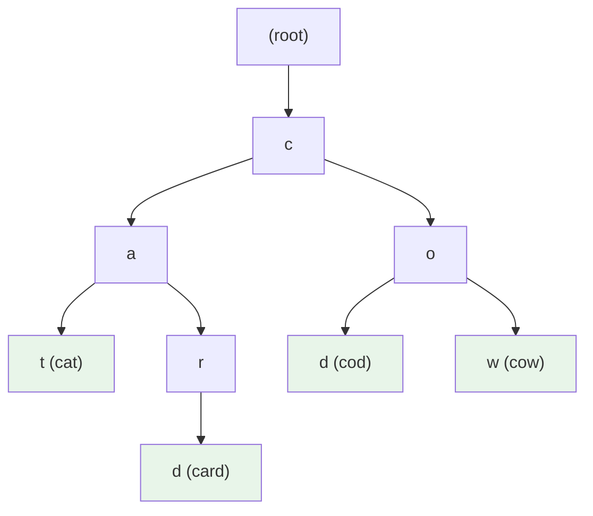
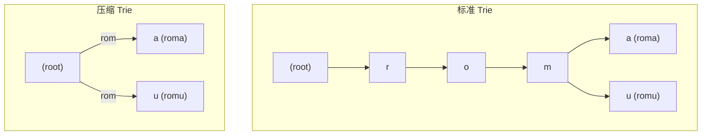
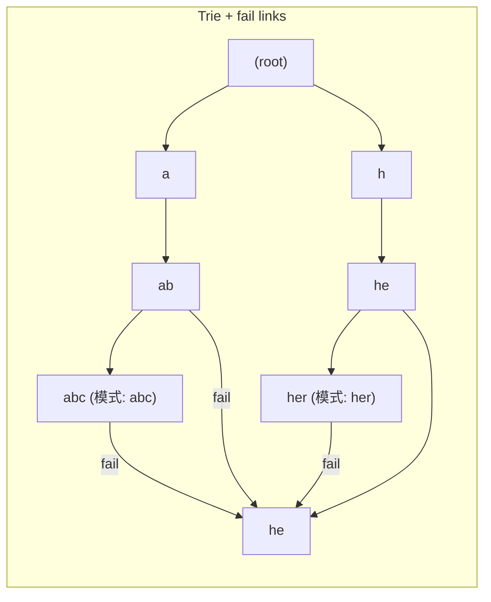

建议先阅读: [[J_树_Tree_BST_AVL|树 BST AVL]], [[B_字符串_String|字符串]] — KMP 的自动机思想在 Trie 和 Aho-Corasick 中有直接应用。

---

## 原理

字典树（Trie，取自 retrieval）是专为字符串集合设计的树形结构。每个节点对应一个字符，从根到有标记节点的路径组成一个完整单词。Trie 的核心创新是**前缀共享**——多个拥有公共前缀的单词共享树上的前几步路径，将冗余的前缀存储压缩为唯一增长。

### 前缀共享的量化分析

设 $n$ 个单词的平均长度为 $L$，两两之间的公共前缀平均长度为 $P$。哈希表存储需要 $O(n \cdot L)$ 空间（每个单词独立存储）。Trie 通过共享相同前缀，空间可降至 $O(n \cdot (L - P))$。在实际词典中（英语词典的 $P \approx 2$，中文分词的 $P \approx 1$），Trie 相较于独立存储的空间节省通常显著。



四个单词 `cat`, `card`, `cod`, `cow` 共享了公共前缀 `c`。`cat` 和 `card` 又共享了 `ca`。如果没有共享前缀，这 14 个字符独立存放需要约 56 字节（含元数据）；Trie 中共享后只需约 20 字节。

### 复杂度

| 操作 | 时间复杂度 | 说明 |
|------|:---------:|------|
| 插入 | $O(m)$ | $m$ 是字符串长度 |
| 精确查找 | $O(m)$ | 沿路径走到叶子或标记节点 |
| 前缀匹配 | $O(p)$ | $p$ 是前缀长度 |
| 前缀计数 | $O(p)$ | 走到前缀末尾节点，读 `prefixCount` |
| 删除 | $O(m)$ | 回溯清理无人经过的节点 |

Trie 的时间复杂度与 $n$（集合中单词总数）无关——只与操作涉及的字符串长度相关。这是 Trie 相对于 BST/哈希表的独特优势：无论集合多大，查找 "apple" 的耗时是固定的（5 步）。

### 节点实现的三种方案

| 方案 | 查找 | 空间 | 适用场景 |
|------|:---:|------|---------|
| 定长数组（26 个字母） | $O(1)$ 子节点定位 | 每节点 26 指针（208B） | 小字母表 |
| 哈希表（动态子节点） | $O(1)$ 均摊 | 仅存实际子节点 | 大字母表（Unicode） |
| 排序数组 + 二分 | $O(\log |\Sigma|)$ | 最少指针 | 紧凑存储，查找较少 |

**定长数组方案的致命缺陷**：每个节点预分配 $|\Sigma|$ 个指针——对于 ASCII（128）已很浪费，对于 Unicode（100 万+ 码点）不可能。实际工程中的 Trie（如数据库的索引、DNS 解析器）通常使用方案 2（哈希表子节点）或方案 3（排序数组 + 二分搜索子节点）。

### 01-Trie：数字的 Trie

将整数视为二进制串，Trie 即可用于数值域。01-Trie（二进制字典树）按 bit 位从高位到低位建树——每一步根据当前 bit 是 0 还是 1 选择子节点。数据结构不变，但应用场景从字符串匹配转移到数值的最优查询：

**最大异或对**：找出一组数中异或值的最大值。暴力 O(n²)。01-Trie 解法：将每个数插入 01-Trie，然后对每个数 $x$，在 Trie 中贪心地走"与 $x$ 当前 bit 相反的方向"——因为 $0 \oplus 0 = 0, 0 \oplus 1 = 1, 1 \oplus 0 = 1, 1 \oplus 1 = 0$，相反 bit 产生 1。

$$
\text{贪心步进}: \text{如果 bit } b \text{ 对应的反方向子节点存在，就走反方向（贡献 } 2^b \text{）; 否则走同方向}
$$

**复杂度**：每个数 32 步（32-bit int），总计 $O(n \cdot 32) = O(n)$。这是将 Trie 的"前缀共享"思想推广到"bit 前缀共享"上的直接应用。

---

## 深入底层

### 压缩 Trie（Patricia Trie / Radix Tree）

当多个连续节点只有一个子节点时（字符串集合的稀疏性），标准 Trie 有大量"单链"。压缩 Trie 将这种单链压缩为一个边——边不再标记单个字符，而是标记一个子串：



Linux 内核的 **radix tree**（`lib/radix-tree.c`）就是压缩 Trie 的生产级实现——用于页缓存（page cache）、inode 缓存等场景。每个节点可以持有多个 slot（通常 64），对应地址 index 中的连续 6 bit。在 64 位系统上，一个 64-bit 的 index 被拆分为约 11 层（$64 / 6 \approx 11$）进行查找。从逻辑上说，Linux 的 radix tree 就是把 key 按 $2^6 = 64$ 进行基数分割的压缩 Trie。

### Aho-Corasick 自动机：KMP 在 Trie 上的推广

Aho-Corasick（AC 自动机）是 KMP 前缀函数思想在 Trie 上的多模式推广——在 Trie 的每个节点上增加一个**失败指针（fail link）**，指向"当前节点所表示字符串的最长真后缀"：



当在文本中搜索模式时，沿 Trie 匹配。若在某个节点失配，通过 fail link 跳转到能继续匹配的另一个状态，而不回到根节点重新开始。AC 自动机对 $k$ 个模式串的匹配总时间复杂度为 $O(n + m)$，其中 $n$ 是文本长度，$m$ 是所有模式串的总长度。

AC 自动机是多模式匹配的标准算法——网络入侵检测系统（Snort/Suricata）、反病毒引擎、基因序列比对等场景广泛使用。

---

## 实现

### 字母表版 Trie（小写字母）

```c
#include <stdlib.h>

#define ALPHABET 26

typedef struct TrieNode {
 struct TrieNode* children[ALPHABET];
 int is_end; // 是否是完整单词的结尾
 int prefix_count; // 有多少单词经过此节点
} TrieNode;

typedef struct { TrieNode* root; } Trie;

TrieNode* trie_new_node(void) {
 return calloc(1, sizeof(TrieNode)); // calloc 将 children 全置 NULL
}

void trie_init(Trie* t) { t->root = trie_new_node(); }

void trie_insert(Trie* t, const char* word) {
 TrieNode* cur = t->root;
 for (int i = 0; word[i]; i++) {
 int idx = word[i] - 'a';
 if (!cur->children[idx])
 cur->children[idx] = trie_new_node();
 cur = cur->children[idx];
 cur->prefix_count++;
 }
 cur->is_end = 1;
}

int trie_search(Trie* t, const char* word) {
 TrieNode* cur = t->root;
 for (int i = 0; word[i]; i++) {
 int idx = word[i] - 'a';
 if (!cur->children[idx]) return 0;
 cur = cur->children[idx];
 }
 return cur->is_end;
}

int trie_starts_with(Trie* t, const char* prefix) {
 TrieNode* cur = t->root;
 for (int i = 0; prefix[i]; i++) {
 int idx = prefix[i] - 'a';
 if (!cur->children[idx]) return 0;
 cur = cur->children[idx];
 }
 return 1; // 前缀存在
}

static void trie_free_node(TrieNode* node) {
 if (!node) return;
 for (int i = 0; i < ALPHABET; i++)
 trie_free_node(node->children[i]);
 free(node);
}

void trie_destroy(Trie* t) { trie_free_node(t->root); }
```

### 01-Trie 最大异或对

```c
#include <stdlib.h>

typedef struct BinNode {
 struct BinNode* child[2]; // child[0] = bit 0, child[1] = bit 1
} BinNode;

BinNode* bin_new(void) { return calloc(1, sizeof(BinNode)); }

void bin_insert(BinNode* root, int num) {
 BinNode* cur = root;
 for (int bit = 31; bit >= 0; bit--) {
 int b = (num >> bit) & 1;
 if (!cur->child[b]) cur->child[b] = bin_new();
 cur = cur->child[b];
 }
}

int bin_max_xor(BinNode* root, int num) {
 BinNode* cur = root;
 int result = 0;
 for (int bit = 31; bit >= 0; bit--) {
 int b = (num >> bit) & 1;
 if (cur->child[1 - b]) { // 反方向存在 → 该位异或贡献 1
 result |= (1 << bit);
 cur = cur->child[1 - b];
 } else {
 cur = cur->child[b];
 }
 }
 return result;
}
```

---

## 应用场景

- **自动补全/搜索建议**：输入前缀，从 Trie 的该前缀节点出发遍历所有后继，收集所有标记为 `is_end` 的节点。Google 搜索的下拉提示、IDE 的自动补全都内建了 Trie/Patricia Trie
- **IP 路由最长前缀匹配**：CIDR 路由将目的 IP 按 bit 在 Patricia Trie 中查找——与 01-Trie 结构同构。Linux 内核的路由缓存在 2.6 之前使用 Fib Trie（实际上是压缩的 Patricia Trie）
- **拼写检查**：用 Trie 存储词典，对拼写错误通过编辑距离（Levenshtein distance）搜索候选词
- **基因序列比对**：用后缀 Trie/Suffix Trie 存储 DNA 序列以快速查找子序列。AC 自动机在多基因库比对中被广泛使用

---

## 练习

| 题号 | 题目 | 说明 |
|------|------|------|
| [208](https://leetcode.cn/problems/implement-trie-prefix-tree/) | 实现 Trie | Trie 基础 |
| [211](https://leetcode.cn/problems/design-add-and-search-words-data-structure/) | 添加与搜索单词 | 通配符 + Trie |
| [421](https://leetcode.cn/problems/maximum-xor-of-two-numbers-in-an-array/) | 数组中两个数的最大异或值 | 01 字典树 |

## 动手实验

| 编号 | 题目 | 说明 |
|:----:|------|------|
| E1 | Trie vs 哈希表 前缀计数基准 | 随机生成 10 万个长度为 6-15 的小写字母单词，分别用 Trie 和 `std::unordered_set` 统计前缀 `"pre"` 的出现次数——Trie 走 3 步直接到节点，哈希表需要遍历所有以 `"pre"` 开头的单词。计时比较 |
| E2 | 01-Trie 构建与异或最大值 | 随机生成 10000 个 32 位无符号整数，用 01-Trie 建树后对每个数找最大异或对。与暴力 O(n²) 对比耗时——n=10000 时 01-Trie 应快 5000 倍以上 |
| E3 | 压缩 Trie 内存测量 | 实现标准 Trie 和压缩 Trie，插入同一份英文词典（约 20 万词），统计总节点数和内存占用（`valgrind massif`）。验证压缩 Trie 在减少内存占用上的效果 |
