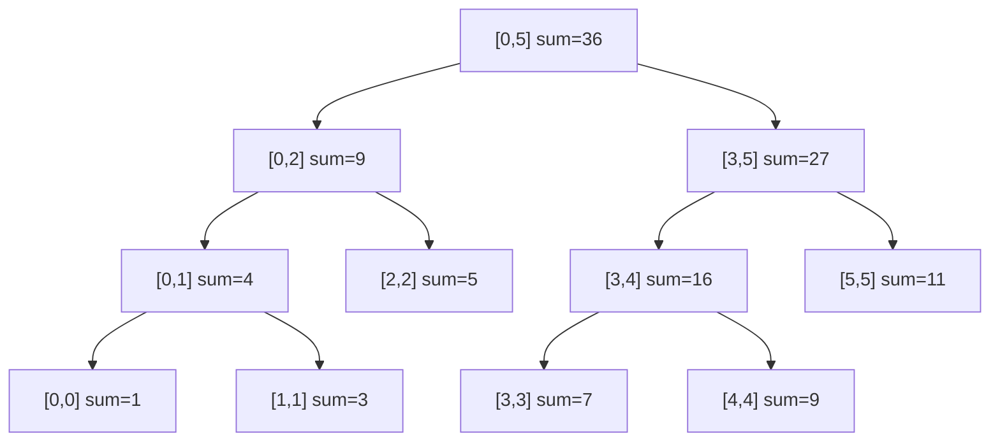

## ==========================================================================
C++ 数据结构教程 — 线段树 (Segment Tree)
## ==========================================================================

## 📋 章节概述

线段树（Segment Tree）是一种用于高效处理区间查询和区间修改的树形数据结构。
它将一个数组划分为若干区间，每个节点维护对应区间的聚合信息（如区间和、最大值、最小值等），
支持在O(log n)时间内完成单点修改、区间修改和区间查询。

线段树在竞赛编程和工程实践中应用广泛，如数据库范围查询、图形渲染中的区间重叠检测、
时间序列数据聚合等。本章将从线段树的基本原理讲起，深入懒标记的实现，
全面覆盖各种变体，最后通过实例和习题巩固所学知识。

> 📌 **底层实现参考**：如果需要深入理解本章数据结构的底层实现（纯C手写、内存布局、指针操作），请参阅 [[../../C语言深化教程/3数据结构/09_高级数据结构|C语言教程: 高级数据结构]]。C教程侧重手动实现与内存本质，本教程侧重STL使用与算法优化，两者互补。

## ==========================================================================
### 📖 第一节: 基础语法 + 计算机底层原理
## ==========================================================================

1.1 线段树的基本概念
-----------------------

线段树是一棵完全二叉树，对于一个长度为n的数组：
- 每个叶子节点存储原数组中一个元素的信息
- 每个内部节点存储其对应区间的聚合信息
- 根节点对应整个数组区间[0, n-1]
- 左子节点对应左半区间，右子节点对应右半区间

时间复杂度：
- 建树：O(n)
- 单点修改：O(log n)
- 区间查询：O(log n)
- 区间修改（带懒标记）：O(log n)

空间复杂度：O(4n)

1.2 线段树的结构示意

数组 [1, 3, 5, 7, 9, 11]，建立区间和线段树：



> 每个节点对应一个区间 [l, r]，存储该区间的聚合值（如和、最大值）。
> 查询 [1,4] 的区间和时，只需合并 [0,1] + [2,2] + [3,4] 三个节点的值，
> 而不需要遍历 4 个元素。

| 操作 | 复杂度 | 说明 |
|------|--------|------|
| build | O(n) | 自底向上构建，每个节点计算一次 |
| query(l,r) | O(log n) | 目标区间最多被拆成 2log n 个节点区间 |
| update(i,v) | O(log n) | 从叶到根更新路径上的节点 |
| range_add(l,r,v) | O(log n) | 懒标记延迟下推，不立即更新所有子孙 |

1.3 基本线段树（区间和 + 单点修改）

```cpp
#include <iostream>
#include <vector>

class SegmentTree {
private:
    std::vector<long long> tree;
    int n;

    void build(const std::vector<int>& arr, int node, int start, int end) {
        if (start == end) {
            tree[node] = arr[start];
            return;
        }
        int mid = (start + end) / 2;
        build(arr, 2 * node, start, mid);
        build(arr, 2 * node + 1, mid + 1, end);
        tree[node] = tree[2 * node] + tree[2 * node + 1];
    }

    void update(int node, int start, int end, int idx, int val) {
        if (start == end) {
            tree[node] = val;
            return;
        }
        int mid = (start + end) / 2;
        if (idx <= mid)
            update(2 * node, start, mid, idx, val);
        else
            update(2 * node + 1, mid + 1, end, idx, val);
        tree[node] = tree[2 * node] + tree[2 * node + 1];
    }

    long long query(int node, int start, int end, int l, int r) {
        if (r < start || end < l) return 0;
        if (l <= start && end <= r) return tree[node];
        int mid = (start + end) / 2;
        return query(2 * node, start, mid, l, r) +
               query(2 * node + 1, mid + 1, end, l, r);
    }

public:
    SegmentTree(const std::vector<int>& arr) {
        n = arr.size();
        tree.assign(4 * n, 0);
        build(arr, 1, 0, n - 1);
    }

    void update(int idx, int val) {
        update(1, 0, n - 1, idx, val);
    }

    long long query(int l, int r) {
        return query(1, 0, n - 1, l, r);
    }
};

int main() {
    std::vector<int> arr = {1, 3, 5, 7, 9, 11};
    SegmentTree st(arr);

    std::cout << "区间[1,4]的和: " << st.query(1, 4) << std::endl;
    st.update(2, 10);
    std::cout << "修改后区间[1,4]的和: " << st.query(1, 4) << std::endl;

    return 0;
}
```

1.4 带懒标记的线段树（区间修改 + 区间查询）

```cpp
#include <iostream>
#include <vector>

class LazySegmentTree {
private:
    std::vector<long long> tree;
    std::vector<long long> lazy;
    int n;

    void build(const std::vector<int>& arr, int node, int start, int end) {
        if (start == end) {
            tree[node] = arr[start];
            return;
        }
        int mid = (start + end) / 2;
        build(arr, 2 * node, start, mid);
        build(arr, 2 * node + 1, mid + 1, end);
        tree[node] = tree[2 * node] + tree[2 * node + 1];
    }

    void pushDown(int node, int start, int end) {
        if (lazy[node] != 0) {
            int mid = (start + end) / 2;
            tree[2 * node] += lazy[node] * (mid - start + 1);
            tree[2 * node + 1] += lazy[node] * (end - mid);
            lazy[2 * node] += lazy[node];
            lazy[2 * node + 1] += lazy[node];
            lazy[node] = 0;
        }
    }

    void rangeUpdate(int node, int start, int end, int l, int r, long long val) {
        if (r < start || end < l) return;
        if (l <= start && end <= r) {
            tree[node] += val * (end - start + 1);
            lazy[node] += val;
            return;
        }
        pushDown(node, start, end);
        int mid = (start + end) / 2;
        rangeUpdate(2 * node, start, mid, l, r, val);
        rangeUpdate(2 * node + 1, mid + 1, end, l, r, val);
        tree[node] = tree[2 * node] + tree[2 * node + 1];
    }

    long long rangeQuery(int node, int start, int end, int l, int r) {
        if (r < start || end < l) return 0;
        if (l <= start && end <= r) return tree[node];
        pushDown(node, start, end);
        int mid = (start + end) / 2;
        return rangeQuery(2 * node, start, mid, l, r) +
               rangeQuery(2 * node + 1, mid + 1, end, l, r);
    }

public:
    LazySegmentTree(const std::vector<int>& arr) {
        n = arr.size();
        tree.assign(4 * n, 0);
        lazy.assign(4 * n, 0);
        build(arr, 1, 0, n - 1);
    }

    void rangeUpdate(int l, int r, long long val) {
        rangeUpdate(1, 0, n - 1, l, r, val);
    }

    long long rangeQuery(int l, int r) {
        return rangeQuery(1, 0, n - 1, l, r);
    }
};

int main() {
    std::vector<int> arr = {1, 3, 5, 7, 9, 11};
    LazySegmentTree st(arr);

    std::cout << "区间[1,4]的和: " << st.rangeQuery(1, 4) << std::endl;
    st.rangeUpdate(1, 3, 5);
    std::cout << "[1,3]各加5后，区间[1,4]的和: " << st.rangeQuery(1, 4) << std::endl;

    return 0;
}
```

## ==========================================================================
### 📖 第二节: 所有用法大全
## ==========================================================================

2.1 区间最大值/最小值线段树

```cpp
#include <iostream>
#include <vector>
#include <algorithm>
#include <climits>

class MinMaxSegTree {
private:
    struct Node {
        long long maxVal, minVal;
    };
    std::vector<Node> tree;
    int n;

    void build(const std::vector<int>& arr, int node, int start, int end) {
        if (start == end) {
            tree[node] = {arr[start], arr[start]};
            return;
        }
        int mid = (start + end) / 2;
        build(arr, 2 * node, start, mid);
        build(arr, 2 * node + 1, mid + 1, end);
        tree[node].maxVal = std::max(tree[2*node].maxVal, tree[2*node+1].maxVal);
        tree[node].minVal = std::min(tree[2*node].minVal, tree[2*node+1].minVal);
    }

    long long queryMax(int node, int start, int end, int l, int r) {
        if (r < start || end < l) return LLONG_MIN;
        if (l <= start && end <= r) return tree[node].maxVal;
        int mid = (start + end) / 2;
        return std::max(queryMax(2*node, start, mid, l, r),
                       queryMax(2*node+1, mid+1, end, l, r));
    }

    long long queryMin(int node, int start, int end, int l, int r) {
        if (r < start || end < l) return LLONG_MAX;
        if (l <= start && end <= r) return tree[node].minVal;
        int mid = (start + end) / 2;
        return std::min(queryMin(2*node, start, mid, l, r),
                       queryMin(2*node+1, mid+1, end, l, r));
    }

public:
    MinMaxSegTree(const std::vector<int>& arr) {
        n = arr.size();
        tree.resize(4 * n);
        build(arr, 1, 0, n - 1);
    }

    long long queryMax(int l, int r) { return queryMax(1, 0, n-1, l, r); }
    long long queryMin(int l, int r) { return queryMin(1, 0, n-1, l, r); }
};

int main() {
    std::vector<int> arr = {2, 5, 1, 8, 3, 7, 4, 6};
    MinMaxSegTree st(arr);

    std::cout << "区间[1,5]最大值: " << st.queryMax(1, 5) << std::endl;
    std::cout << "区间[1,5]最小值: " << st.queryMin(1, 5) << std::endl;
    return 0;
}
```

2.2 区间乘法+加法的线段树（双懒标记）

```cpp
#include <iostream>
#include <vector>

class MulAddSegTree {
private:
    std::vector<long long> tree;
    std::vector<long long> lazyMul;
    std::vector<long long> lazyAdd;
    long long mod;
    int n;

    void build(const std::vector<int>& arr, int node, int start, int end) {
        lazyMul[node] = 1;
        lazyAdd[node] = 0;
        if (start == end) {
            tree[node] = arr[start] % mod;
            return;
        }
        int mid = (start + end) / 2;
        build(arr, 2*node, start, mid);
        build(arr, 2*node+1, mid+1, end);
        tree[node] = (tree[2*node] + tree[2*node+1]) % mod;
    }

    void pushDown(int node, int start, int end) {
        int mid = (start + end) / 2;
        apply(2*node, start, mid, lazyMul[node], lazyAdd[node]);
        apply(2*node+1, mid+1, end, lazyMul[node], lazyAdd[node]);
        lazyMul[node] = 1;
        lazyAdd[node] = 0;
    }

    void apply(int node, int start, int end, long long mul, long long add) {
        tree[node] = (tree[node] * mul % mod + add * (end - start + 1) % mod) % mod;
        lazyMul[node] = lazyMul[node] * mul % mod;
        lazyAdd[node] = (lazyAdd[node] * mul % mod + add) % mod;
    }

    void rangeMultiply(int node, int start, int end, int l, int r, long long val) {
        if (r < start || end < l) return;
        if (l <= start && end <= r) {
            apply(node, start, end, val, 0);
            return;
        }
        pushDown(node, start, end);
        int mid = (start + end) / 2;
        rangeMultiply(2*node, start, mid, l, r, val);
        rangeMultiply(2*node+1, mid+1, end, l, r, val);
        tree[node] = (tree[2*node] + tree[2*node+1]) % mod;
    }

    void rangeAdd(int node, int start, int end, int l, int r, long long val) {
        if (r < start || end < l) return;
        if (l <= start && end <= r) {
            apply(node, start, end, 1, val);
            return;
        }
        pushDown(node, start, end);
        int mid = (start + end) / 2;
        rangeAdd(2*node, start, mid, l, r, val);
        rangeAdd(2*node+1, mid+1, end, l, r, val);
        tree[node] = (tree[2*node] + tree[2*node+1]) % mod;
    }

    long long rangeQuery(int node, int start, int end, int l, int r) {
        if (r < start || end < l) return 0;
        if (l <= start && end <= r) return tree[node];
        pushDown(node, start, end);
        int mid = (start + end) / 2;
        return (rangeQuery(2*node, start, mid, l, r) +
                rangeQuery(2*node+1, mid+1, end, l, r)) % mod;
    }

public:
    MulAddSegTree(const std::vector<int>& arr, long long p) : mod(p) {
        n = arr.size();
        tree.assign(4*n, 0);
        lazyMul.assign(4*n, 1);
        lazyAdd.assign(4*n, 0);
        build(arr, 1, 0, n-1);
    }

    void rangeMultiply(int l, int r, long long val) { rangeMultiply(1, 0, n-1, l, r, val); }
    void rangeAdd(int l, int r, long long val) { rangeAdd(1, 0, n-1, l, r, val); }
    long long rangeQuery(int l, int r) { return rangeQuery(1, 0, n-1, l, r); }
};

int main() {
    std::vector<int> arr = {1, 2, 3, 4, 5};
    MulAddSegTree st(arr, 1000000007);

    std::cout << "区间[0,4]和: " << st.rangeQuery(0, 4) << std::endl;
    st.rangeMultiply(1, 3, 2);
    std::cout << "[1,3]乘2后，区间[0,4]和: " << st.rangeQuery(0, 4) << std::endl;
    st.rangeAdd(0, 2, 3);
    std::cout << "[0,2]加3后，区间[0,4]和: " << st.rangeQuery(0, 4) << std::endl;
    return 0;
}
```

2.3 动态开点线段树

```cpp
#include <iostream>

class DynamicSegTree {
private:
    struct Node {
        long long sum = 0;
        long long lazy = 0;
        int left = 0, right = 0;
    };

    std::vector<Node> nodes;
    int root;
    int L, R;

    int newNode() {
        nodes.push_back({});
        return nodes.size() - 1;
    }

    void pushDown(int node, int start, int end) {
        if (nodes[node].lazy == 0) return;
        if (!nodes[node].left) nodes[node].left = newNode();
        if (!nodes[node].right) nodes[node].right = newNode();
        int mid = (start + end) / 2;
        nodes[nodes[node].left].sum += nodes[node].lazy * (mid - start + 1);
        nodes[nodes[node].left].lazy += nodes[node].lazy;
        nodes[nodes[node].right].sum += nodes[node].lazy * (end - mid);
        nodes[nodes[node].right].lazy += nodes[node].lazy;
        nodes[node].lazy = 0;
    }

    void update(int& node, int start, int end, int l, int r, long long val) {
        if (!node) node = newNode();
        if (l <= start && end <= r) {
            nodes[node].sum += val * (end - start + 1);
            nodes[node].lazy += val;
            return;
        }
        pushDown(node, start, end);
        int mid = (start + end) / 2;
        if (l <= mid) update(nodes[node].left, start, mid, l, r, val);
        if (r > mid) update(nodes[node].right, mid+1, end, l, r, val);
        nodes[node].sum = 0;
        if (nodes[node].left) nodes[node].sum += nodes[nodes[node].left].sum;
        if (nodes[node].right) nodes[node].sum += nodes[nodes[node].right].sum;
    }

    long long query(int node, int start, int end, int l, int r) {
        if (!node) return 0;
        if (l <= start && end <= r) return nodes[node].sum;
        pushDown(node, start, end);
        int mid = (start + end) / 2;
        long long res = 0;
        if (l <= mid) res += query(nodes[node].left, start, mid, l, r);
        if (r > mid) res += query(nodes[node].right, mid+1, end, l, r);
        return res;
    }

public:
    DynamicSegTree(int l, int r) : L(l), R(r) {
        nodes.push_back({});
        root = newNode();
    }

    void update(int l, int r, long long val) { update(root, L, R, l, r, val); }
    long long query(int l, int r) { return query(root, L, R, l, r); }
};

int main() {
    DynamicSegTree st(1, 1000000000);
    st.update(1, 100, 5);
    st.update(50, 200, 3);
    std::cout << "query[1,200]: " << st.query(1, 200) << std::endl;
    std::cout << "query[50,100]: " << st.query(50, 100) << std::endl;
    return 0;
}
```

2.4 持久化线段树（主席树）

```cpp
#include <iostream>
#include <vector>
#include <algorithm>

class PersistentSegTree {
private:
    struct Node {
        int left, right;
        int count;
    };
    std::vector<Node> nodes;
    std::vector<int> roots;

    int newNode(int l = 0, int r = 0, int cnt = 0) {
        nodes.push_back({l, r, cnt});
        return nodes.size() - 1;
    }

    int build(int start, int end) {
        int node = newNode();
        if (start == end) return node;
        int mid = (start + end) / 2;
        nodes[node].left = build(start, mid);
        nodes[node].right = build(mid + 1, end);
        return node;
    }

    int update(int prev, int start, int end, int pos) {
        int node = newNode(nodes[prev].left, nodes[prev].right, nodes[prev].count + 1);
        if (start == end) return node;
        int mid = (start + end) / 2;
        if (pos <= mid)
            nodes[node].left = update(nodes[prev].left, start, mid, pos);
        else
            nodes[node].right = update(nodes[prev].right, mid + 1, end, pos);
        return node;
    }

    int query(int u, int v, int start, int end, int k) {
        if (start == end) return start;
        int mid = (start + end) / 2;
        int leftCount = nodes[nodes[v].left].count - nodes[nodes[u].left].count;
        if (k <= leftCount)
            return query(nodes[u].left, nodes[v].left, start, mid, k);
        else
            return query(nodes[u].right, nodes[v].right, mid + 1, end, k - leftCount);
    }

public:
    int queryKth(const std::vector<int>& arr, int l, int r, int k) {
        std::vector<int> sorted = arr;
        std::sort(sorted.begin(), sorted.end());
        sorted.erase(std::unique(sorted.begin(), sorted.end()), sorted.end());
        int m = sorted.size();

        nodes.clear();
        roots.clear();
        roots.push_back(build(0, m - 1));

        for (int x : arr) {
            int pos = std::lower_bound(sorted.begin(), sorted.end(), x) - sorted.begin();
            roots.push_back(update(roots.back(), 0, m - 1, pos));
        }

        int idx = query(roots[l], roots[r + 1], 0, m - 1, k);
        return sorted[idx];
    }
};

int main() {
    PersistentSegTree pst;
    std::vector<int> arr = {1, 5, 2, 6, 3, 7};
    std::cout << "区间[1,4]第2小: " << pst.queryKth(arr, 1, 4, 2) << std::endl;
    std::cout << "区间[0,5]第3小: " << pst.queryKth(arr, 0, 5, 3) << std::endl;
    return 0;
}
```

## ==========================================================================
### 📖 第三节: 实用案例
## ==========================================================================

3.1 案例一：区间染色问题

```cpp
#include <iostream>
#include <vector>
#include <set>

class IntervalColoring {
private:
    std::vector<int> tree;
    std::vector<int> lazy;
    int n;

    void pushDown(int node) {
        if (lazy[node] != 0) {
            tree[2*node] = lazy[node];
            tree[2*node+1] = lazy[node];
            lazy[2*node] = lazy[node];
            lazy[2*node+1] = lazy[node];
            lazy[node] = 0;
        }
    }

    void update(int node, int start, int end, int l, int r, int color) {
        if (l <= start && end <= r) {
            tree[node] = color;
            lazy[node] = color;
            return;
        }
        pushDown(node);
        int mid = (start + end) / 2;
        if (l <= mid) update(2*node, start, mid, l, r, color);
        if (r > mid) update(2*node+1, mid+1, end, l, r, color);
        tree[node] = (tree[2*node] == tree[2*node+1]) ? tree[2*node] : -1;
    }

    void queryColors(int node, int start, int end, int l, int r, std::set<int>& colors) {
        if (l <= start && end <= r && tree[node] > 0) {
            colors.insert(tree[node]);
            return;
        }
        if (start == end) return;
        pushDown(node);
        int mid = (start + end) / 2;
        if (l <= mid) queryColors(2*node, start, mid, l, r, colors);
        if (r > mid) queryColors(2*node+1, mid+1, end, l, r, colors);
    }

public:
    IntervalColoring(int size) : n(size) {
        tree.assign(4*n, 1);
        lazy.assign(4*n, 0);
    }

    void paint(int l, int r, int color) { update(1, 1, n, l, r, color); }

    int countColors(int l, int r) {
        std::set<int> colors;
        queryColors(1, 1, n, l, r, colors);
        return colors.size();
    }
};

int main() {
    IntervalColoring ic(100);
    ic.paint(1, 30, 1);
    ic.paint(20, 50, 2);
    ic.paint(40, 60, 3);

    std::cout << "区间[1,60]的颜色种数: " << ic.countColors(1, 60) << std::endl;
    std::cout << "区间[25,45]的颜色种数: " << ic.countColors(25, 45) << std::endl;
    return 0;
}
```

3.2 案例二：逆序对计数

```cpp
#include <iostream>
#include <vector>
#include <algorithm>

class InversionCount {
private:
    std::vector<int> tree;
    int n;

    void update(int pos) {
        for (pos += 1; pos <= n; pos += pos & (-pos))
            tree[pos]++;
    }

    int query(int pos) {
        int sum = 0;
        for (pos += 1; pos > 0; pos -= pos & (-pos))
            sum += tree[pos];
        return sum;
    }

public:
    long long count(std::vector<int>& arr) {
        std::vector<int> sorted = arr;
        std::sort(sorted.begin(), sorted.end());
        sorted.erase(std::unique(sorted.begin(), sorted.end()), sorted.end());
        n = sorted.size();
        tree.assign(n + 1, 0);

        long long inversions = 0;
        for (int i = (int)arr.size() - 1; i >= 0; --i) {
            int rank = std::lower_bound(sorted.begin(), sorted.end(), arr[i]) - sorted.begin();
            inversions += query(rank - 1);
            update(rank);
        }
        return inversions;
    }
};

int main() {
    std::vector<int> arr = {5, 3, 2, 4, 1};
    InversionCount ic;
    std::cout << "逆序对数量: " << ic.count(arr) << std::endl;
    return 0;
}
```

3.3 案例三：区间GCD查询

```cpp
#include <iostream>
#include <vector>
#include <algorithm>

class GCDSegTree {
private:
    std::vector<long long> tree;
    int n;

    long long gcd(long long a, long long b) {
        while (b) { a %= b; std::swap(a, b); }
        return a;
    }

    void build(const std::vector<int>& arr, int node, int start, int end) {
        if (start == end) {
            tree[node] = arr[start];
            return;
        }
        int mid = (start + end) / 2;
        build(arr, 2*node, start, mid);
        build(arr, 2*node+1, mid+1, end);
        tree[node] = gcd(tree[2*node], tree[2*node+1]);
    }

    long long query(int node, int start, int end, int l, int r) {
        if (r < start || end < l) return 0;
        if (l <= start && end <= r) return tree[node];
        int mid = (start + end) / 2;
        return gcd(query(2*node, start, mid, l, r),
                   query(2*node+1, mid+1, end, l, r));
    }

    void update(int node, int start, int end, int idx, int val) {
        if (start == end) {
            tree[node] = val;
            return;
        }
        int mid = (start + end) / 2;
        if (idx <= mid) update(2*node, start, mid, idx, val);
        else update(2*node+1, mid+1, end, idx, val);
        tree[node] = gcd(tree[2*node], tree[2*node+1]);
    }

public:
    GCDSegTree(const std::vector<int>& arr) {
        n = arr.size();
        tree.assign(4*n, 0);
        build(arr, 1, 0, n-1);
    }

    long long query(int l, int r) { return query(1, 0, n-1, l, r); }
    void update(int idx, int val) { update(1, 0, n-1, idx, val); }
};

int main() {
    std::vector<int> arr = {12, 18, 24, 36, 48, 60};
    GCDSegTree st(arr);

    std::cout << "区间[0,5]的GCD: " << st.query(0, 5) << std::endl;
    std::cout << "区间[2,4]的GCD: " << st.query(2, 4) << std::endl;
    st.update(3, 15);
    std::cout << "修改后区间[0,5]的GCD: " << st.query(0, 5) << std::endl;
    return 0;
}
```

## ==========================================================================
### 📖 第四节: 课后习题
## ==========================================================================

1. 基础题：实现一棵支持区间加法和区间求和的线段树（带懒标记）。

2. 应用题：使用线段树解决RMQ（Range Minimum Query）问题。
   - 支持单点修改和区间最小值查询

3. 进阶题：实现一棵支持区间乘法、区间加法和区间求和的线段树（双懒标记）。

4. 洛谷练习：
   - [P3372 线段树1](https://www.luogu.com.cn/problem/P3372)（区间加+区间和）
   - [P3373 线段树2](https://www.luogu.com.cn/problem/P3373)（区间乘+区间加+区间和）

## ==========================================================================


## --------------------------------------------------------------------------
## 🔗 知识网络
## --------------------------------------------------------------------------

- **上一章**: [[数据结构/K_并查集_UnionFind]] | **下一章**: [[数据结构/M_树状数组_BIT]] | **返回**: [[目录]]
- **相关**: [[数据结构/M_树状数组_BIT]] | [[算法技巧/分治]] | [[区间问题]]

## ==========================================================================
## 章节测试
## ==========================================================================

### 判断题

> [!question] 判断题 1
> 线段树的空间复杂度为O(2n)，其中n为数组长度。（ ）
> - [ ] ✅ 正确
> - [ ] ❌ 错误
>
> > [!success]- 点击查看答案
> > 答案: 错误
> > 
> > **解析**: 线段树通常需要开4n大小的数组来保证空间足够（因为最后一层可能不满），空间复杂度为O(4n)。

> [!question] 判断题 2
> 线段树的建树时间复杂度为O(n)。（ ）
> - [ ] ✅ 正确
> - [ ] ❌ 错误
>
> > [!success]- 点击查看答案
> > 答案: 正确
> > 
> > **解析**: 建树时每个节点只访问一次，共有约2n个节点，因此建树时间为O(n)。

> [!question] 判断题 3
> 懒标记（Lazy Propagation）的作用是将区间修改延迟到需要时才下传。（ ）
> - [ ] ✅ 正确
> - [ ] ❌ 错误
>
> > [!success]- 点击查看答案
> > 答案: 正确
> > 
> > **解析**: 懒标记将修改"懒惰地"存储在节点上，只有当需要访问子节点时才将修改下传（pushDown），从而保证区间修改的O(log n)复杂度。

> [!question] 判断题 4
> 线段树只能维护满足结合律的运算（如加法、取max、取min）。（ ）
> - [ ] ✅ 正确
> - [ ] ❌ 错误
>
> > [!success]- 点击查看答案
> > 答案: 正确
> > 
> > **解析**: 线段树合并子区间信息时需要使用区间合并操作，这要求该操作满足结合律，否则无法正确合并。

> [!question] 判断题 5
> 动态开点线段树可以处理值域为[1, 10^9]的问题。（ ）
> - [ ] ✅ 正确
> - [ ] ❌ 错误
>
> > [!success]- 点击查看答案
> > 答案: 正确
> > 
> > **解析**: 动态开点线段树只在需要时创建节点，不需要预先开辟整个值域大小的空间，因此可以处理大值域问题。

> [!question] 判断题 6
> 主席树（持久化线段树）可以查询区间第k小元素。（ ）
> - [ ] ✅ 正确
> - [ ] ❌ 错误
>
> > [!success]- 点击查看答案
> > 答案: 正确
> > 
> > **解析**: 主席树对每个前缀建立一棵权值线段树，利用前缀相减的思想可以得到任意区间的权值分布，从而查询区间第k小。

> [!question] 判断题 7
> 线段树可以处理不等长区间的查询（如查询第k个位置到第m个位置）。（ ）
> - [ ] ✅ 正确
> - [ ] ❌ 错误
>
> > [!success]- 点击查看答案
> > 答案: 正确
> > 
> > **解析**: 线段树的区间查询可以处理任意[l,r]区间，通过递归将查询分解为若干完整区间的合并。

> [!question] 判断题 8
> 对同一个区间同时进行乘法和加法修改时，必须使用双懒标记。（ ）
> - [ ] ✅ 正确
> - [ ] ❌ 错误
>
> > [!success]- 点击查看答案
> > 答案: 正确
> > 
> > **解析**: 乘法和加法的组合不满足简单的可加性，需要分别维护乘法懒标记和加法懒标记，且下传时先乘后加。

> [!question] 判断题 9
> 线段树的每次查询最多访问O(4 log n)个节点。（ ）
> - [ ] ✅ 正确
> - [ ] ❌ 错误
>
> > [!success]- 点击查看答案
> > 答案: 正确
> > 
> > **解析**: 线段树每层最多访问常数个节点（通常不超过4个），树高为O(log n)，因此总访问节点数为O(log n)。

> [!question] 判断题 10
> 线段树无法支持在数组中间插入或删除元素的操作。（ ）
> - [ ] ✅ 正确
> - [ ] ❌ 错误
>
> > [!success]- 点击查看答案
> > 答案: 错误
> > 
> > **解析**: 使用平衡树型线段树（如FHQ Treap维护的线段树）可以支持插入和删除操作，但标准数组型线段树确实不支持。

### 选择题

> [!question] 选择题 1
> 对于一个长度为n的数组，线段树的树高为？
> - [ ] A. n
> - [ ] B. log₂n
> - [ ] C. ⌈log₂n⌉ + 1
> - [ ] D. 2n
>
> > [!success]- 点击查看答案
> > 正确答案: C
> > 
> > **解析**: 线段树是一棵近似完全二叉树，叶子节点n个，树高为⌈log₂n⌉+1（包含根节点层）。

> [!question] 选择题 2
> 线段树节点编号采用"左子=2i，右子=2i+1"的方式存储，对于n=5的数组，至少需要开多大的数组？
> - [ ] A. 10
> - [ ] B. 16
> - [ ] C. 20
> - [ ] D. 32
>
> > [!success]- 点击查看答案
> > 正确答案: C
> > 
> > **解析**: 实践中通常开4n大小的数组以保证安全，4×5=20。理论上最大编号可达2^(⌈log₂n⌉+1)-1。

> [!question] 选择题 3
> 懒标记pushDown的时机是？
> - [ ] A. 每次修改操作后立即下传
> - [ ] B. 需要访问子节点的信息时下传
> - [ ] C. 查询操作时永远不需要下传
> - [ ] D. 只在建树时下传
>
> > [!success]- 点击查看答案
> > 正确答案: B
> > 
> > **解析**: 懒标记在需要进入子节点（无论是修改还是查询）时才下传，这是"懒"的核心思想——延迟更新直到必要时。

> [!question] 选择题 4
> 以下哪个操作不能用线段树在O(log n)时间内完成？
> - [ ] A. 区间求和
> - [ ] B. 区间求最大值
> - [ ] C. 区间求中位数
> - [ ] D. 区间求GCD
>
> > [!success]- 点击查看答案
> > 正确答案: C
> > 
> > **解析**: 中位数不满足"可合并性"——两个子区间的中位数无法直接合并得到整体中位数。需要结合其他技术（如二分+线段树）来解决。

> [!question] 选择题 5
> 区间加法的懒标记下传时，子节点的sum应该增加多少？
> - [ ] A. lazy[父]
> - [ ] B. lazy[父] × 子区间长度
> - [ ] C. lazy[父] / 2
> - [ ] D. lazy[父] × 父区间长度
>
> > [!success]- 点击查看答案
> > 正确答案: B
> > 
> > **解析**: 区间加操作对每个元素加lazy值，子区间的sum增量 = lazy × 子区间长度。

> [!question] 选择题 6
> 主席树相比普通线段树的空间复杂度为？
> - [ ] A. O(n)
> - [ ] B. O(n log n)
> - [ ] C. O(n²)
> - [ ] D. O(4n)
>
> > [!success]- 点击查看答案
> > 正确答案: B
> > 
> > **解析**: 主席树每次插入创建O(log n)个新节点（沿路径复制），共n次插入，总空间O(n log n)。

> [!question] 选择题 7
> 线段树与树状数组相比，以下说法正确的是？
> - [ ] A. 树状数组能做的线段树都能做
> - [ ] B. 线段树的常数因子比树状数组小
> - [ ] C. 两者的时间复杂度完全相同
> - [ ] D. 线段树无法进行区间修改
>
> > [!success]- 点击查看答案
> > 正确答案: A
> > 
> > **解析**: 线段树功能更强大，树状数组能做的（前缀和、单点修改等）线段树都可以做，但线段树常数更大、代码更长。

> [!question] 选择题 8
> 对于区间赋值操作（将[l,r]所有元素设为v），懒标记的合并策略是？
> - [ ] A. 新旧懒标记相加
> - [ ] B. 新懒标记直接覆盖旧懒标记
> - [ ] C. 取新旧懒标记的最大值
> - [ ] D. 需要先下传旧标记再设置新标记
>
> > [!success]- 点击查看答案
> > 正确答案: B
> > 
> > **解析**: 区间赋值是覆盖操作，新的赋值会完全覆盖之前的修改，因此新标记直接替换旧标记即可。

> [!question] 选择题 9
> 线段树上二分（在线段树上找第一个大于k的位置）的时间复杂度为？
> - [ ] A. O(n)
> - [ ] B. O(log n)
> - [ ] C. O(log²n)
> - [ ] D. O(n log n)
>
> > [!success]- 点击查看答案
> > 正确答案: B
> > 
> > **解析**: 线段树上二分从根开始，每层只进入一个子树，沿树高走一遍即可，时间O(log n)。

> [!question] 选择题 10
> 以下哪种线段树变体可以支持区间第k小查询？
> - [ ] A. 懒标记线段树
> - [ ] B. 动态开点线段树
> - [ ] C. 持久化线段树（主席树）
> - [ ] D. 最大值线段树
>
> > [!success]- 点击查看答案
> > 正确答案: C
> > 
> > **解析**: 主席树对每个前缀维护一棵权值线段树，通过前缀相减得到区间内的值域分布，从而支持区间第k小查询。

### 编程大题

> [!question] 编程大题 1
> **题目**: 洛谷 [P3372 线段树1](https://www.luogu.com.cn/problem/P3372)
> 
> 给定n个数的序列，支持两种操作：1. 将区间[l,r]的每个数加上k；2. 查询区间[l,r]的和。
>
> > [!success]- 点击查看提示
> > 使用带懒标记的线段树，维护区间和。pushDown时子节点的sum增加lazy×子区间长度，子节点的lazy累加父节点的lazy。注意使用long long避免溢出。

> [!question] 编程大题 2
> **题目**: 洛谷 [P3373 线段树2](https://www.luogu.com.cn/problem/P3373)
> 
> 给定n个数的序列和模数p，支持三种操作：1. 区间乘k；2. 区间加k；3. 区间求和(mod p)。
>
> > [!success]- 点击查看提示
> > 使用双懒标记（乘法标记mul和加法标记add）。pushDown时先处理乘法再处理加法：子节点sum = sum×mul + add×len，子节点mul = mul×父mul，子节点add = add×父mul + 父add。所有运算对p取模。

> [!question] 编程大题 3
> **题目**: 实现一个动态区间中位数查询系统。给定n个数的序列，支持：1. 单点修改；2. 查询区间[l,r]的中位数。
>
> > [!success]- 点击查看提示
> > 方法一：二分答案+线段树。二分中位数值mid，用线段树查询区间内≤mid的数的个数，判断是否≥(r-l+2)/2。方法二：值域线段树+区间第k小（主席树思路）。
