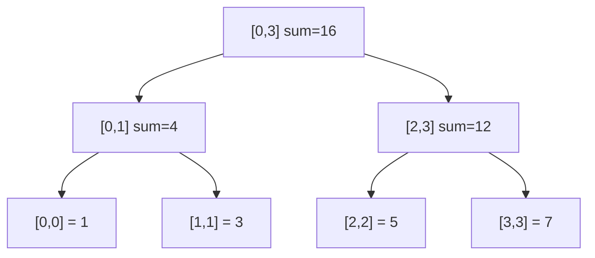

建议先阅读: [[A_容器_Container|A 容器 Container]], [[../算法/算法技巧/递推递归|递推递归]]

---

## 原理

线段树（Segment Tree）是一种用于高效处理区间查询和区间修改的树形数据结构。它将数组划分为若干区间，每个节点维护对应区间的聚合信息（和、最大值、最小值等）。

### 核心特性

- 完全二叉树结构，叶子节点对应原数组单个元素
- 每个内部节点对应其子节点区间的并集
- 根节点对应整个数组区间 [0, n-1]

以下图展示数组 `[1, 3, 5, 7]` 构建的区间和线段树：



### 时间复杂度

| 操作 | 复杂度 | 说明 |
|------|--------|------|
| 建树 build | O(n) | 每个节点计算一次 |
| 单点修改 | O(log n) | 从叶到根更新路径 |
| 区间查询 | O(log n) | 目标区间拆成最多 4*log n 个节点 |
| 区间修改（懒标记） | O(log n) | 延迟下推更新 |

空间复杂度: O(4n)

### 线段树 vs 树状数组

| 特性 | 线段树 | 树状数组 |
|------|--------|----------|
| 功能 | 支持区间最值、区间和等 | 仅支持前缀和、可减操作 |
| 区间修改 | 懒标记 | 差分（受限） |
| 代码量 | 较长 | 极短 |
| 常数因子 | 较大 | 较小 |

---

## 实现

### 区间和线段树（带懒标记）

```c
#include <stdlib.h>
#include <string.h>

typedef struct {
    long long* tree;
    long long* lazy;
    int n;
} LazySegmentTree;

static void seg_build(LazySegmentTree* seg, const int* arr, int node, int l, int r) {
    if (l == r) {
        seg->tree[node] = arr[l];
        return;
    }
    int mid = l + (r - l) / 2;
    seg_build(seg, arr, node * 2, l, mid);
    seg_build(seg, arr, node * 2 + 1, mid + 1, r);
    seg->tree[node] = seg->tree[node * 2] + seg->tree[node * 2 + 1];
}

void seg_init(LazySegmentTree* seg, const int* arr, int n) {
    seg->n = n;
    seg->tree = calloc(4 * n, sizeof(long long));
    seg->lazy = calloc(4 * n, sizeof(long long));
    seg_build(seg, arr, 1, 0, n - 1);
}

void seg_destroy(LazySegmentTree* seg) {
    free(seg->tree);
    free(seg->lazy);
}

static void push_down(LazySegmentTree* seg, int node, int l, int r) {
    if (seg->lazy[node] == 0) return;
    int mid = l + (r - l) / 2;
    int left = node * 2, right = node * 2 + 1;
    seg->tree[left] += seg->lazy[node] * (mid - l + 1);
    seg->tree[right] += seg->lazy[node] * (r - mid);
    seg->lazy[left] += seg->lazy[node];
    seg->lazy[right] += seg->lazy[node];
    seg->lazy[node] = 0;
}

static void range_add(LazySegmentTree* seg, int node, int l, int r, int ql, int qr, long long val) {
    if (qr < l || r < ql) return;
    if (ql <= l && r <= qr) {
        seg->tree[node] += val * (r - l + 1);
        seg->lazy[node] += val;
        return;
    }
    push_down(seg, node, l, r);
    int mid = l + (r - l) / 2;
    range_add(seg, node * 2, l, mid, ql, qr, val);
    range_add(seg, node * 2 + 1, mid + 1, r, ql, qr, val);
    seg->tree[node] = seg->tree[node * 2] + seg->tree[node * 2 + 1];
}

void seg_add(LazySegmentTree* seg, int l, int r, long long val) {
    range_add(seg, 1, 0, seg->n - 1, l, r, val);
}

static long long range_query(LazySegmentTree* seg, int node, int l, int r, int ql, int qr) {
    if (qr < l || r < ql) return 0;
    if (ql <= l && r <= qr) return seg->tree[node];
    push_down(seg, node, l, r);
    int mid = l + (r - l) / 2;
    return range_query(seg, node * 2, l, mid, ql, qr) +
           range_query(seg, node * 2 + 1, mid + 1, r, ql, qr);
}

long long seg_sum(LazySegmentTree* seg, int l, int r) {
    return range_query(seg, 1, 0, seg->n - 1, l, r);
}
```

### 最大值线段树（无懒标记）

```c
#include <limits.h>

typedef struct {
    int* tree;
    int n;
} MaxSegmentTree;

static void max_build(MaxSegmentTree* seg, const int* arr, int node, int l, int r) {
    if (l == r) { seg->tree[node] = arr[l]; return; }
    int mid = l + (r - l) / 2;
    max_build(seg, arr, node * 2, l, mid);
    max_build(seg, arr, node * 2 + 1, mid + 1, r);
    int left = seg->tree[node * 2];
    int right = seg->tree[node * 2 + 1];
    seg->tree[node] = left > right ? left : right;
}

void max_seg_init(MaxSegmentTree* seg, const int* arr, int n) {
    seg->n = n;
    seg->tree = malloc(4 * n * sizeof(int));
    max_build(seg, arr, 1, 0, n - 1);
}

void max_seg_destroy(MaxSegmentTree* seg) {
    free(seg->tree);
}

static void max_update(MaxSegmentTree* seg, int node, int l, int r, int idx, int val) {
    if (l == r) { seg->tree[node] = val; return; }
    int mid = l + (r - l) / 2;
    if (idx <= mid) max_update(seg, node * 2, l, mid, idx, val);
    else max_update(seg, node * 2 + 1, mid + 1, r, idx, val);
    int left = seg->tree[node * 2], right = seg->tree[node * 2 + 1];
    seg->tree[node] = left > right ? left : right;
}

void max_seg_update(MaxSegmentTree* seg, int idx, int val) {
    max_update(seg, 1, 0, seg->n - 1, idx, val);
}

static int max_query(MaxSegmentTree* seg, int node, int l, int r, int ql, int qr) {
    if (qr < l || r < ql) return INT_MIN;
    if (ql <= l && r <= qr) return seg->tree[node];
    int mid = l + (r - l) / 2;
    int left = max_query(seg, node * 2, l, mid, ql, qr);
    int right = max_query(seg, node * 2 + 1, mid + 1, r, ql, qr);
    return left > right ? left : right;
}

int max_seg_max(MaxSegmentTree* seg, int l, int r) {
    return max_query(seg, 1, 0, seg->n - 1, l, r);
}
```

---

## 应用场景

- **区间求和/最值**: 数组中任意区间 [l, r] 的聚合查询
- **区间染色**: 用线段树管理区间覆盖（懒标记为颜色值）
- **区间第 K 小**: 使用主席树（持久化线段树）查询历史版本的区间

---

## 练习

| 题号 | 题目 | 难度 | 知识点 |
|------|------|------|--------|
| P3372 | 线段树 1 | 普及+ | 区间加 + 区间求和 |
| P3373 | 线段树 2 | 提高 | 区间乘 + 区间加 |
| P4588 | 数学计算 | 提高 | 线段树维护操作序列 |

> 力扣 (LeetCode) 有对应题型，竞赛方向推荐力扣/Codeforces。
